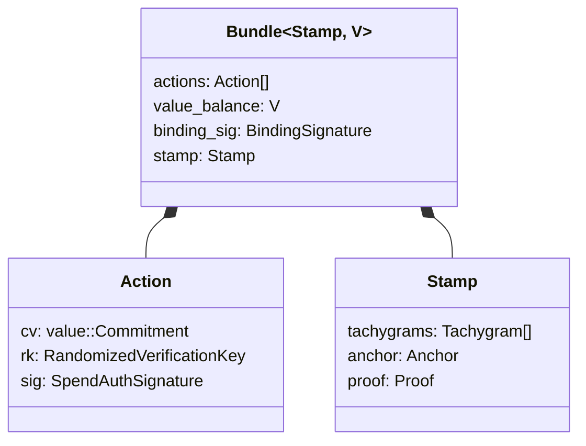

# Tachyon

The Tachyon shielded transaction protocol for Zcash.

## Architecture

### Transaction Structure

A **bundle** contains actions, a value balance, and a binding signature.
Each **action** carries a value commitment (`cv`), a randomized verification
key (`rk`), and a spend authorization signature (`sig`).

**Tachygrams** (nullifiers and note commitments) live in the **stamp**, not
in the action. This separation enables stamp stripping during proof
aggregation while actions retain their authorization.



## Status

Core cryptographic plumbing is implemented and tested:

- Key derivation (PRF^expand with sign normalization)
- Value commitments (Pedersen over Pallas, shared generators with Orchard)
- Spend authorization signatures (RedPallas, randomized keys)
- Binding signatures (value balance enforcement via homomorphic commitments)
- Bundle construction and signature verification

Stubbed (pending Ragu PCD and Poseidon integration):

- Note commitments
- Nullifier derivation (GGM tree PRF)
- Proof creation, merge, and verification
- Stamp compression/decompression

## Development

Requires Rust stable (1.85+) and nightly for formatting/linting.

```sh
just test    # cargo test --workspace --all-features
just lint    # cargo +nightly clippy --workspace --all-targets --all-features
just fmt     # cargo +nightly fmt --all
just doc     # cargo doc --workspace --no-deps
```

## License

MIT OR Apache-2.0
