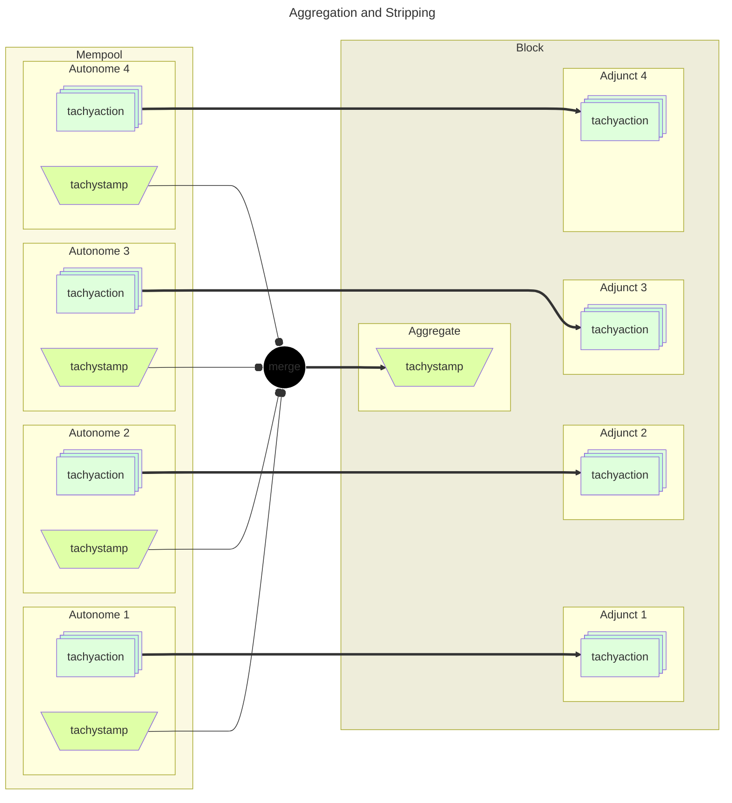

# Aggregation

Instead of verifying each transaction individually, transaction proofs may be recursively merged into a single proof that covers many transactions.
This is how Tachyon seeks to reduce chain costs.

The act of merging proofs is **aggregation**, and **aggregators** are nodes enganged in this activity creating **aggregate** transactions.

Miners are likely to vertically integrate aggregation.

## Bundle States

Transactions with no Tachyon bundle[^bundle-format] are not covered here.

Aggregation creation of a new transaction with a proof that can replace the proof in a selection of other transactions.
To create a valid block with a given aggregate, a miner must include all of those other transactions, sans their now-redundant proofs.

So Tachyon bundles have two main states: **stamped** or **stripped**.

These two states do not correspond perfectly with 'aggregate' and 'not aggregate', so we establish some nomenclature:

| Term          | State    | Provenance | Validation                                       |
| ------------- | -------- | ---------- | ------------------------------------------------ |
| **autonome**  | stamped  | wallet     | Complete proof with all inputs                   |
| **aggregate** | stamped  | aggregator | Merged proof needs input from other transactions |
| **adjunct**   | stripped | miner      | Input to merged proof from another transaction   |

Aggregates may be further named:

- *innocent* aggregate containing no Tachyon actions.  
  For example, an aggregate transaction might only contain activity in other pools, or no activity at all.
- *based* aggregate proving its own Tachyon actions.  
  For example, a miner's coin*base* transaction might be an aggregate, and also output miner rewards via Tachyon action.

[^bundle-format]: See [Bundles](./bundle.md) to understand bundle format.

## Aggregation Process

### Merge to produce Aggregate

A proof's wire format is compressed for bandwidth efficiency.
Aggregators must decompress proofs to a mutable format in order to merge proofs, and then re-compress to broadcast.

Aggregators collect autonomes or existing aggregates and merge their stamps:

1. Select transactions
2. Deserialize and decompress stamps
3. Merge stamps
   - Merge tachygrams (set union)
   - Merge anchors (range intersection)
   - Merge proofs (proof recursion)
4. Serialize and compress the merged stamp
5. Publish aggregate transaction

```admonish todo
- Explain tachygram set union validation algorithm
- Explain epoch range intersection accumulation algorithm
- Define aggregation limits
```

### Strip to produce Adjuncts

Miners obtain the broadcast aggregates, or by vertically integrating as aggregators.

When authoring a block, miners remove stamps from transactions covered by an aggregate, to produce appropriate adjuncts.



## Block Layout

Adjuncts may be identified by the presence of a Tachyon bundle containing actions but no stamp.

The relevant aggregate is the last preceding bundle that contained a stamp.

This positional correspondence makes aggregate-adjunct relationships implicit, so no explicit references are needed.
Non-tachyon transactions can appear anywhere without disrupting this correspondence.

| idx | tachyactions | tachygrams | description       |
| --- | ------------ | ---------- | ----------------- |
| 0   | 1            | 7          | aggregate         |
| 1   | 2            | -          | adjunct to 0      |
| 2   | -            | -          | no tachyon bundle |
| 3   | 2            | -          | adjunct to 0      |
| 4   | 2            | -          | adjunct to 0      |
| 5   | -            | 8          | aggregate         |
| 6   | 4            | -          | adjunct to 5      |
| 7   | 4            | -          | adjunct to 5      |

### Simplistic Validation Algorithm

If a Tachyon stamp appears, close validation of any last seen stamp and open validation of the new stamp.

As the stamp validation progresses, accumulate proof inputs.

```pseudocode
let last_stamp = None
let proof_inputs = []

for tx in block {
    if not tx.tachyon {
        continue
    }

    if tx.tachyon.stamp {
        if last_stamp {
            validate(last_stamp, proof_inputs)
            proof_inputs = []
        }
        last_stamp = tx.tachyon.stamp
    }

    proof_inputs.collect(tx.tachyon)
}

if last_stamp {
    validate(last_stamp, proof_inputs)
}
```

```admonish todo


**p2p aggregation gossip is a secondary objective** and aggregation has some complex constraints.

- aggregate size is limited by commitment size before block size (on the order of thousands of actions)
- desirable to reduce the number of stamps in tx, for size, bandwidth, and validation cost
- merging to one aggregate cannot be parallelized, but multiple aggregates may be built in parallel
- serialization/deserialization is expensive and stamps are only mutable when 'decompressed'
- does ser/de cost scale with size?
- 'merge small autonome stamp' and 'merge large aggregate stamp' are about the same cost

1. Are there some 'optimal' qualities for aggregates?
2. Will miners prefer to rely on p2p, or integrate aggregation?
3. Will miners selecting aggregates from p2p prefer certain qualities?
4. Will miners selecting aggregates from p2p prefer to:
   - select aggregates and then seek the related transactions, or
   - select transactions and then seek an appropriate aggregate?
```
