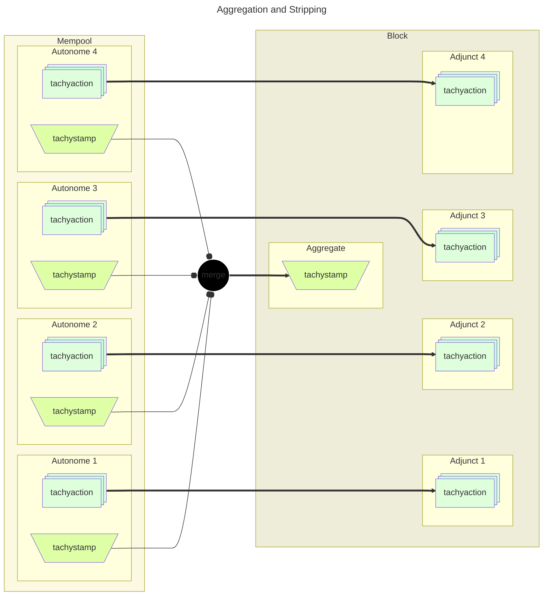

# Aggregation

Instead of verifying each transaction individually, transaction proofs may be recursively merged into a single proof that covers many transactions.
This is how Tachyon seeks to reduce chain costs.

The act of merging proofs is **aggregation**, and **aggregators** are nodes enganged in this activity creating **aggregate** transactions.

Miners are likely to vertically integrate aggregation.

## Bundle States

Transactions with no Tachyon bundle[^bundle-format] are not covered here.

Aggregation creation of a new transaction with a proof that can replace the proof in a selection of other transactions.
To create a valid block with a given aggregate, a miner must include all of those other transactions, sans their now-redundant proofs.

So Tachyon bundles have two main states: **stamped** or **stripped**.

These two states do not correspond perfectly with 'aggregate' and 'not aggregate', so we establish some nomenclature:

| Term | State | Provenance | Validation |
| ---- | ----- | ---------- | ---------- |
| **autonome** | stamped | wallet | Complete proof with all inputs |
| **aggregate** | stamped | aggregator | Merged proof needs input from other transactions |
| **adjunct** | stripped | miner | Input to merged proof from another transaction |

Aggregates may be further named:

- *innocent* aggregate containing no Tachyon actions.  
  For example, an aggregate transaction might only contain activity in other pools, or no activity at all.
- *based* aggregate proving its own Tachyon actions.  
  For example, a miner's coin*base* transaction might be an aggregate, and also output miner rewards via Tachyon action.

[^bundle-format]: See [Bundles](./bundle.md) to understand bundle format.

## Aggregation Process

### Merge to produce Aggregate

A proof's wire format is compressed for bandwidth efficiency.
Aggregators must decompress proofs to a mutable format in order to merge proofs, and then re-compress to broadcast.

Aggregators collect autonomes or existing aggregates and merge their stamps:

1. Select transactions
2. Deserialize and decompress stamps
3. Align anchors with `StampLift` (both stamps must share the same `(block_height, pool_commit)` before merging)
4. Merge stamps
   - Merge tachygrams (set union)
   - Combine action and tachygram accumulators (`MergeStamp` multiplies the underlying polynomials; see [Tachygrams](./tachygrams.md))
   - Merge proofs (proof recursion)
5. Serialize and compress the merged stamp
6. Publish aggregate transaction

<!-- TODO
- Explain tachygram set union validation algorithm
- Define aggregation limits
-->

### Strip to produce Adjuncts

Miners obtain the broadcast aggregates, or by vertically integrating as aggregators.

When authoring a block, miners remove stamps from transactions covered by an aggregate, to produce appropriate adjuncts.


```mermaid
---
title: Aggregation and Stripping
---
flowchart LR
    classDef tstamp fill:#7fff0040
    classDef ta_vec fill:#7fffd440
    classDef proof fill:#da70d640
    classDef txanchor fill:f0fff040

    style agg fill:black,stroke:white
    style invisible fill:none,stroke:none
    style pool fill:#f0e68c40
    style block fill:#bdb76b40


    subgraph pool["Mempool"]
        subgraph mp1["Autonome 1"]
            mp1_ta:::ta_vec@{ shape: procs, label: "tachyaction" }
            mp1_ts:::tstamp@{ shape: trap-t, label: "tachystamp" }
        end
        subgraph mp2["Autonome 2"]
            mp2_ta:::ta_vec@{ shape: procs, label: "tachyaction" }
            mp2_ts:::tstamp@{ shape: trap-t, label: "tachystamp" }
        end
        subgraph mp3["Autonome 3"]
            mp3_ta:::ta_vec@{ shape: procs, label: "tachyaction" }
            mp3_ts:::tstamp@{ shape: trap-t, label: "tachystamp" }
        end
        subgraph mp4["Autonome 4"]
            mp4_ta:::ta_vec@{ shape: procs, label: "tachyaction" }
            mp4_ts:::tstamp@{ shape: trap-t, label: "tachystamp" }
        end
    end

    mp1_ts ---o agg
    mp1_ta ==> bk1_ta
    mp2_ta ==> bk2_ta
    mp2_ts ---o agg
    agg(("merge")) ==> bk0_ts
    mp3_ta ==> bk3_ta
    mp3_ts ---o agg
    mp4_ta ==> bk4_ta
    mp4_ts ---o agg

    subgraph block["Block"]
        direction LR

        subgraph bk0["Aggregate"]
            bk0_ts:::tstamp@{ shape: trap-t, label: "tachystamp" }
        end

        bk0 ~~~ invisible

        subgraph invisible[" "]
            subgraph bk1["Adjunct 1"]
                bk1_ta:::ta_vec@{ shape: procs, label: "tachyaction" }
            end
            subgraph bk2["Adjunct 2"]
                bk2_ta:::ta_vec@{ shape: procs, label: "tachyaction" }
            end
            subgraph bk3["Adjunct 3"]
                bk3_ta:::ta_vec@{ shape: procs, label: "tachyaction" }
            end
            subgraph bk4["Adjunct 4"]
                bk4_ta:::ta_vec@{ shape: procs, label: "tachyaction" }
            end
        end
    end
```

## Transaction identifiers under aggregation

A Tachyon bundle's authorization form changes across aggregation: stamping, merging into a covering aggregate, and stripping all produce bit-different authorizations of the same effecting data.
[`wtxid`](https://zips.z.cash/zip-0239) — `txid || auth_digest` — is defined to uniquely fingerprint the physical on-wire transaction, so these forms must produce distinct `wtxid`s.

Tachyon routes the mutable parts through `auth_digest`, leaving `txid` stable:

- `txid` commits to [effecting data](./authorization.md#bundle-commitment) only: `action_acc || value_balance`. Stripping, merging, and re-stamping leave `txid` unchanged.
- `auth_digest` commits to sigs plus the stamp trailer, per [Tachyon `auth_digest` contribution](./authorization.md#tachyon-auth_digest-contribution). Each physical auth form yields a distinct `auth_digest` and therefore a distinct `wtxid`.

### Covering-aggregate references

An adjunct's reference to the aggregate that covers it is a `wtxid`, not a `txid`.
A `txid` alone cannot disambiguate: two bundles with the same effecting data but different stamps share a `txid`, so consensus would not know which physical aggregate to validate against.
The 64-byte `wtxid` pins a specific physical aggregate.

Miners assign the reference during block assembly. The covering aggregate must itself be top-level in the block — never stripped, never further aggregated — so the `wtxid` pointed to is stable.

## Block Layout

Adjuncts are bundles carrying actions but no stamp; each one carries an explicit `wtxid` naming the stamped bundle in the same block that covers it. The reference is 64 bytes (`txid || auth_digest`) and is assigned by the miner during block assembly. A stripped adjunct fails to serialize until its `wtxid` reference has been set.

Non-tachyon transactions can appear anywhere in the block without affecting these references — the relationship is by `wtxid`, not position.

| idx | tachyactions | stamp | description |
| --- | ------------ | ----- | ----------- |
| 0 | 1 | aggregate A | covers adjuncts pointing to `wtxid(A)` |
| 1 | 2 | adjunct | stamp_wtxid = `wtxid(A)` |
| 2 | - | - | no tachyon bundle |
| 3 | 2 | adjunct | stamp_wtxid = `wtxid(A)` |
| 4 | 2 | adjunct | stamp_wtxid = `wtxid(A)` |
| 5 | - | aggregate B | covers adjuncts pointing to `wtxid(B)` |
| 6 | 4 | adjunct | stamp_wtxid = `wtxid(B)` |
| 7 | 4 | adjunct | stamp_wtxid = `wtxid(B)` |

### Validation

For each stamped bundle, consensus collects the covering actions — the bundle's own actions plus the actions of every stripped adjunct whose `stamp_wtxid` matches the stamped bundle's `wtxid` — reconstructs the `action_acc` and tachygram multiset, and verifies the stamp against that reconstructed header.

```pseudocode
let covered: Map<wtxid, Vec<Action>> = empty

for tx in block {
    if tx.tachyon is stripped {
        covered[tx.tachyon.stamp_wtxid].append(tx.tachyon.actions)
    }
}

for tx in block {
    if tx.tachyon is stamped {
        let actions = tx.tachyon.actions ++ covered[wtxid(tx)]
        validate(tx.tachyon.stamp, actions)
    }
}
```

Because references are explicit, stamped and adjunct bundles may appear in any order; the miner is free to reorder for packing as long as each adjunct's `stamp_wtxid` keeps pointing at a stamped bundle in the block.

<!-- TODO
**p2p aggregation gossip is a secondary objective** and aggregation has some complex constraints.

- aggregate size is limited by commitment size before block size (on the order of thousands of actions)
- desirable to reduce the number of stamps in tx, for size, bandwidth, and validation cost
- merging to one aggregate cannot be parallelized, but multiple aggregates may be built in parallel
- serialization/deserialization is expensive and stamps are only mutable when 'decompressed'
- does ser/de cost scale with size?
- 'merge small autonome stamp' and 'merge large aggregate stamp' are about the same cost

1. Are there some 'optimal' qualities for aggregates?
2. Will miners prefer to rely on p2p, or integrate aggregation?
3. Will miners selecting aggregates from p2p prefer certain qualities?
4. Will miners selecting aggregates from p2p prefer to:
   - select aggregates and then seek the related transactions, or
   - select transactions and then seek an appropriate aggregate?
-->
