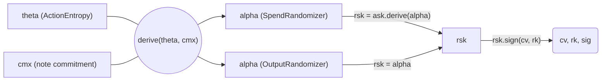
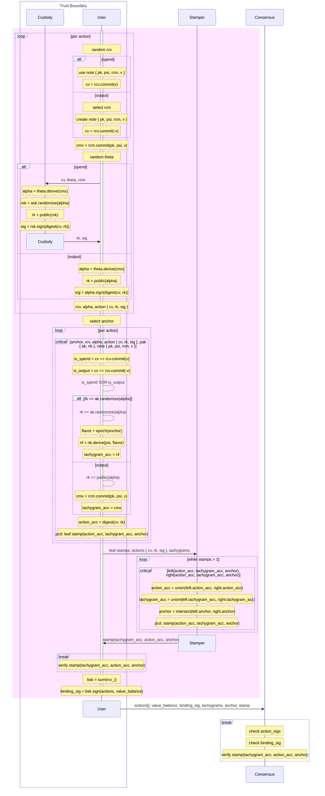

# Authorization

A Tachyon bundle requires three layers of authorization: per-action signatures that bind each tachyaction to its tachygram, value commitments that hide individual values while preserving their algebraic sum, and a binding signature that proves the declared balance is correct. This chapter covers each layer, then shows the complete flow from action creation through consensus.

## Per-action Signing

Each tachyaction requires a fresh randomized key pair. The authorization flow starts with per-action entropy $\theta$ and diverges based on whether the action is a spend or output.

### ActionEntropy ($\theta$)

32 bytes of randomness chosen by the signer. Combined with a note commitment to deterministically derive the randomizer $\alpha$:

$$\alpha = \text{ToScalar}(\text{BLAKE2b-512}(\text{"Tachyon-AlphaDrv"},\; \theta \| \mathsf{cmx}))$$

This design enables **hardware wallet signing without proof construction**: the hardware wallet holds $\mathsf{ask}$ and $\theta$, signs with $\mathsf{rsk} = \mathsf{ask} + \alpha$, and a separate device constructs the proof later using $\theta$ and $\mathsf{cmx}$ to recover $\alpha$.

### Spend vs Output

Both paths produce $(\mathsf{rk}, \text{sig})$ — the per-action verification key and its signature. The randomizer $\alpha$ is retained separately as a proof witness. Internally, $\mathsf{rsk}$ is derived and used for signing, but never exposed.

**Spend** — requires spending authority:

$$\mathsf{rsk} = \mathsf{ask} + \alpha$$

The resulting $\mathsf{rk} = \mathsf{ak} + [\alpha]\,\mathcal{G}$ is a re-randomization of the spend validating key. The custody device derives $\alpha$ from $(\theta, \mathsf{cmx})$, computes $\mathsf{rsk}$, signs, and returns $(\mathsf{rk}, \text{sig})$. The user device independently derives the same $\alpha$ for the proof witness.

**Output** — no spending authority needed:

$$\mathsf{rsk} = \alpha$$

The resulting $\mathsf{rk} = [\alpha]\,\mathcal{G}$ is a re-randomization of the generator itself. No custody device is involved.

Both produce an $\mathsf{rk}$ that can verify a signature, but only the spend's $\mathsf{rk}$ requires knowledge of $\mathsf{ask}$. This unification lets consensus treat all tachyactions identically.

### Action sighash

Each tachyaction carries a RedPallas signature over a domain-separated hash of the action's public data:

$$\text{sighash} = \text{BLAKE2b-512}(\text{"Tachyon-SpendSig"},\; \mathsf{cv} \| \mathsf{rk})$$

The signature binds ($\mathsf{cv}$, $\mathsf{rk}$) together. Since $\mathsf{rk}$ is itself a commitment to $\mathsf{cmx}$ (via $\alpha$'s derivation from $\theta$ and $\mathsf{cmx}$), the signature transitively binds the action to its tachygram without the tachygram appearing in the action.

| Key | Lifetime | Can sign? | Can verify? |
| --- | -------- | --------- | ----------- |
| $\mathsf{ask}$ | Long-lived | No | — |
| $\mathsf{ak}$ | Long-lived | — | No |
| $\mathsf{rsk}$ | Per-action | **Yes** | — |
| $\mathsf{rk}$ | Per-action | — | **Yes** |

## Value Balance

Tachyon uses Pedersen commitments on the Pallas curve for value hiding:

$$\mathsf{cv} = [v]\,\mathcal{V} + [\mathsf{rcv}]\,\mathcal{R}$$

where $v$ is the signed integer value (positive for spends, negative for outputs) and $\mathsf{rcv}$ is a random trapdoor in $\mathbb{F}_q$.

The generators $\mathcal{V}$ and $\mathcal{R}$ are shared with Orchard, derived from the domain `z.cash:Orchard-cv`. This reuse is intentional — the binding signature scheme uses `reddsa::orchard::Binding` which hardcodes $\mathcal{R}$ as its basepoint.

### Homomorphic property

The sum of value commitments preserves the algebraic structure:

$$\sum_i \mathsf{cv}_i = \bigl[\sum_i v_i\bigr]\,\mathcal{V} + \bigl[\sum_i \mathsf{rcv}_i\bigr]\,\mathcal{R}$$

This enables the binding signature scheme to prove value balance without revealing individual values.

### Binding signature

The binding signature proves that the transaction's value commitments sum to the declared balance.

The signer knows all value commitment trapdoors and computes their sum:

$$\mathsf{bsk} = \boxplus_i \mathsf{rcv}_i$$

This is the discrete log of $\mathsf{bvk}$ with respect to $\mathcal{R}$:

$$\mathsf{bvk} = \bigl(\bigoplus_i \mathsf{cv}_i\bigr) \ominus \text{ValueCommit}_0(\mathsf{v\_balance})$$

$$= \bigl[\sum_i v_i - \mathsf{v\_balance}\bigr]\,\mathcal{V} + \bigl[\sum_i \mathsf{rcv}_i\bigr]\,\mathcal{R}$$

$$= [0]\,\mathcal{V} + [\mathsf{bsk}]\,\mathcal{R} \qquad (\text{when } \sum_i v_i = \mathsf{v\_balance})$$

The binding signature proves knowledge of $\mathsf{bsk}$, which is an opening of the Pedersen commitment $\mathsf{bvk}$ to value 0. By the binding property of the commitment scheme, it is infeasible to find another opening to a different value — so value balance is enforced.

The validator recomputes $\mathsf{bvk}$ from public data (action value commitments and declared value balance) and verifies:

$$\text{BindingSig.Validate}_{\mathsf{bvk}}(\text{sighash}, \text{bindingSig}) = 1$$

### Binding sighash

Tachyon signs:

$$\text{sighash} = \text{BLAKE2b-512}(\text{"Tachyon-BindHash"},\; \mathsf{v\_balance} \| \mathsf{sig}_1 \| \cdots \| \mathsf{sig}_n)$$

This differs from Orchard's `SIGHASH_ALL` transaction hash because:

- Action signatures already bind $\mathsf{cv}$ and $\mathsf{rk}$ via $H(\text{"Tachyon-SpendSig"},\; \mathsf{cv} \| \mathsf{rk})$
- The binding signature must be computable without the full transaction
- The stamp is excluded because it is stripped during [aggregation](./aggregation.md)

## End-to-end Flow

The following diagram traces the complete authorization pipeline across trust boundaries: action construction and signing on the user device (with custody device involvement for spends), proof construction and stamping, and finally binding and submission to consensus.

A single user device may act as custody and stamper, but the trust boundary is only required to cover custody and the user device.

