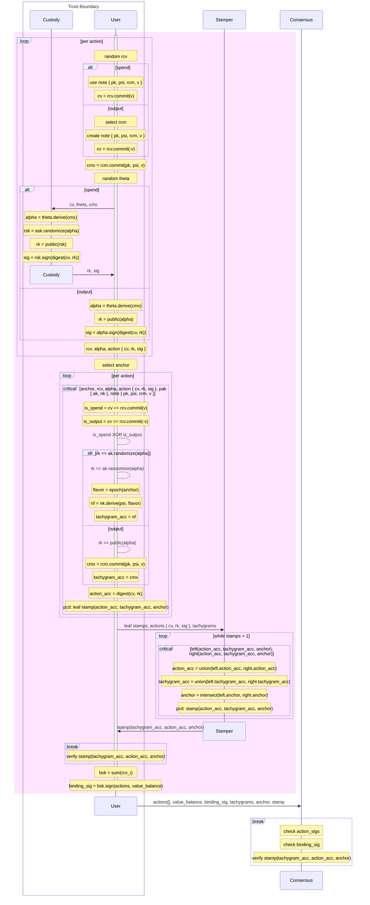

# Authorization Diagram

This diagram shows how Tachyon shielded data is constructed: action authorization, proving, stamping, and finally binding.

A single user device may act as custody and stamper, but the trust boundary is only required to cover custody and the user device.

See [Keys and Authorization](./keys.md) for the key hierarchy and [Bundle](./bundle.md) for more details.

