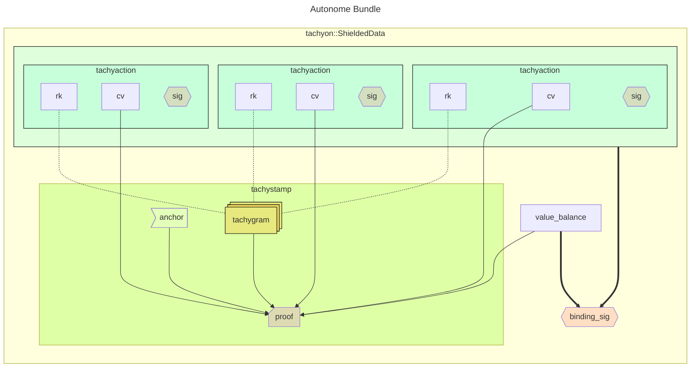

# Tachyon Bundle

This document describes the structure of Tachyon shielded bundles.

## Brief

Users create transactions with a bundle of Tachyon shielded data including a Ragu[^ragu] proof.
These transactions are broadcast to the p2p network.

Before block inclusion, Tachyon shielded data is recursively 'aggregated' in a compact format that ultimately reduces the operational burdens and improves the user experience of the chain.

## Concepts

### Tachygrams

**Tachygrams** are 32-byte field elements representing either nullifiers or note commitments. The consensus protocol does not need to distinguish between nullifiers and note commitments, and treats them identically.[^tachygram]

[^tachygram]: See [Tachyaction at a Distance](https://seanbowe.com/blog/tachyaction-at-a-distance/) for the design rationale behind unified tachyactions and tachygrams.
[^ragu]: See the Ragu [book](https://tachyon.z.cash/ragu/).
[^redpallas]: See [RedDSA](https://zips.z.cash/protocol/protocol.pdf#concretereddsa) in the Zcash Protocol Specification.

### Tachyactions

Each **tachyaction** indistinguishably represents either the creation or destruction of a note.

- A tachyaction with a commitment tachygram proves a note is created.
- A tachyaction with a nullifier tachygram proves a note is destroyed.

**Each tachyaction is cryptographically bound to one tachygram, but does not contain that tachygram.* A tachyaction *does* contain:

- `cv` - a 32-byte homomorphic commitment to the note's created or destroyed value
- `rk` - a 32-byte public key[^ragu-rerandomization] bound to one tachygram
- `act` - a 64-byte RedPallas[^redpallas] authorization by `rk`

[^ragu-rerandomization]: Ragu's [proof rerandomization](https://tachyon.z.cash/ragu/implementation/proofs.html#rerandomization) conceals private proof inputs by selecting new unrelated proof inputs that verify identically.

### Tachystamp

The **tachystamp** is a recursive zero-knowledge proof that all related tachyactions follow the correct rules.[^protocol-spec]

It contains:

- `anchor` - a recent epoch range[^anchor]
- `proof` - the recursive proof (which may be aggregated)
- `tachygrams` - nullifiers and commitments for each action

[^protocol-spec]: The [Zcash Protocol Specification](https://zips.z.cash/protocol/protocol.pdf) lists the cryptographic properties a shielded pool must preserve.
[^anchor]: Unlike Sapling/Orchard anchors which reference a single tree root, Tachyon anchors represent epoch *ranges* used for non-inclusion proofs. See [Tachyaction at a Distance §5](https://seanbowe.com/blog/tachyaction-at-a-distance/#5).

The proof establishes:

- tachygrams are not duplicated within the epoch range
- tachygrams are correctly bound to action keys
- action balance effect matches pool balance effect

The nullifier derivation is

$$ \mathsf{nf} = F_{\mathsf{nk}}(\Psi \parallel \tau) $$

where

- $\Psi$ is the nullifier trapdoor[^commitment]
- $\tau$ is an epoch range

[^commitment]: User-controlled randomness [commitment trapdoor](https://zips.z.cash/protocol/protocol.pdf#commitment)

## Bundle Structure

A Tachyon bundle collects tachyactions with authorization data:

- `tachyactions` - the tachyactions
- `value_balance` - integer net pool effect
- `binding_sig` - signature over actions and value balance
- `tachystamp` - anchor, proof, tachygrams (may be aggregated)

## Lifecycle

Users create transactions containing their individual actions and individual stamp, known as **autonomes**. These are broadcast to the p2p network. Before block inclusion, aggregators strip and merge stamps from selected transactions, producing **aggregates** (transactions carrying merged stamps) and **adjuncts** (transactions stripped of their stamp).

See [Aggregation](./aggregation.md) for transaction categories, block layout, and validation.

## Key Differences from Other Shielded Protocols

| Aspect | Sapling | Orchard | Tachyon |
| ------ | ------- | ------- | ------- |
| Operation Model | Separate Spend/Output | Unified Action | **Tachyaction** |
| Accumulator | Merkle tree | Merkle tree | **Polynomial accumulator** |
| Proving System | Groth16 | Halo 2 | **Ragu** |
| Proof Location | Per transaction | Per transaction | **Aggregated** |
| Ciphertexts | On-chain | On-chain | **Out-of-band or PIR (TBD)** |
