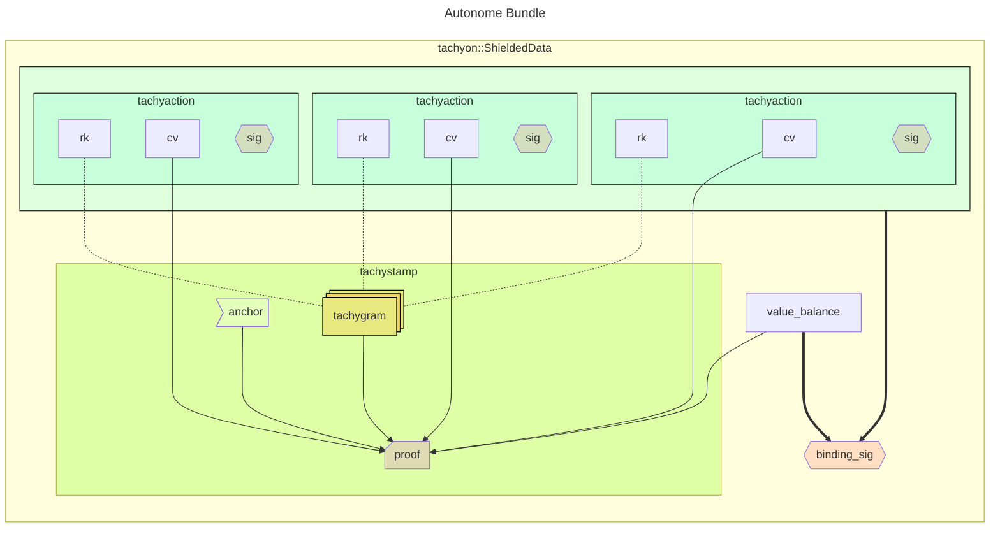

# Bundles

This document describes the structure of Tachyon shielded bundles.

## Brief

Users create transactions with a bundle of Tachyon shielded data including a Ragu[^ragu] proof.
These transactions are broadcast to the p2p network.

Before block inclusion, Tachyon shielded data is recursively 'aggregated' in a compact format that ultimately reduces the operational burdens and improves the user experience of the chain.

## Concepts

### Tachygrams

**Tachygrams** are 32-byte field elements representing either nullifiers or note commitments. The consensus protocol does not need to distinguish between nullifiers and note commitments, and treats them identically.[^tachygram]

[^tachygram]: See [Tachyaction at a Distance](https://seanbowe.com/blog/tachyaction-at-a-distance/) for the design rationale behind unified tachyactions and tachygrams.
[^ragu]: See the Ragu [book](https://tachyon.z.cash/ragu/).
[^redpallas]: See [RedDSA](https://zips.z.cash/protocol/protocol.pdf#concretereddsa) in the Zcash Protocol Specification.

### Tachyactions

Each **tachyaction** indistinguishably represents either the creation or destruction of a note.

- A tachyaction with a commitment tachygram proves a note is created.
- A tachyaction with a nullifier tachygram proves a note is destroyed.

**Each tachyaction is cryptographically bound to one tachygram, but does not contain that tachygram.* A tachyaction *does* contain:

- `cv` - a 32-byte homomorphic commitment to the note's created or destroyed value
- `rk` - a 32-byte public key[^ragu-rerandomization] bound to one tachygram
- `sig` - a 64-byte RedPallas[^redpallas] signature by `rk` over the transaction sighash

[^ragu-rerandomization]: Ragu's [proof rerandomization](https://tachyon.z.cash/ragu/implementation/proofs.html#rerandomization) conceals private proof inputs by selecting new unrelated proof inputs that verify identically.

### Tachystamp

The **tachystamp** is a recursive zero-knowledge proof that all related tachyactions follow the correct rules.

It contains:

- `anchor` - a chain [anchor](./anchor.md)
- `proof` - the recursive proof (which may be aggregated)
- `tachygrams` - nullifiers and commitments for each action

The proof establishes:

- tachygrams either create a new note or destroy an existing note
- tachygrams are correctly bound to action keys
- action balance effect matches pool balance effect

The nullifier for epoch $e$ is the leaf of the note's GGM tree at index $e$:

$$ \mathsf{nf}_e = \mathrm{Poseidon}\bigl(\mathrm{walk}(\mathsf{mk}, e)\bigr) $$

where

- $\mathsf{mk} = \mathrm{Poseidon}(\psi, \mathsf{nk})$ is the note's GGM master key, seeded by the trapdoor $\psi$ committed in the $\psi$ field[^commitment]
- $e$ is an epoch index

[^commitment]: User-controlled randomness [commitment trapdoor](https://zips.z.cash/protocol/protocol.pdf#commitment)

## Bundle Structure

A Tachyon bundle collects tachyactions with authorization data:

- `tachyactions` - the tachyactions
- `value_balance` - integer net pool effect
- `binding_sig` - signature over the transaction sighash (same digest as action sigs)
- `tachystamp` - anchor, proof, tachygrams (may be aggregated)

```mermaid
---
title: Autonome Bundle
---
flowchart LR
classDef signature fill:#fa807240
classDef optional fill:#d3d3d340,stroke-dasharray: 5 5

style tachyaction1 fill:#7fffd440,stroke:black
style tachyaction2 fill:#7fffd440,stroke:black
style tachyaction3 fill:#7fffd440,stroke:black
style tachyaction_vec fill:#7fffd440,stroke:black

style tachygram_vec fill:#ffa50040,stroke:black
style proof fill:#da70d640
style anchor fill:#f0fff040

style tachystamp fill:#7fff0040

subgraph shielded_data["tachyon::ShieldedData"]

    subgraph tachyaction_vec[" "]

        subgraph tachyaction1["tachyaction"]
            cv1["cv"]
            rk1["rk"]
            sig1:::signature@{shape: hex, label: "sig"}
        end

       subgraph tachyaction2["tachyaction"]
            cv2["cv"]
            rk2["rk"]
            sig2:::signature@{shape: hex, label: "sig"}
        end

       subgraph tachyaction3["tachyaction"]
            cv3["cv"]
            rk3["rk"]
            sig3:::signature@{shape: hex, label: "sig"}
        end
    end

    subgraph tachystamp
        anchor@{shape: odd}
        proof@{shape: notch-rect}
        tachygram_vec@{shape: procs, label: "tachygram"}

        anchor ---> proof
        tachygram_vec ---> proof
    end

    rk1 & rk2 & rk3 -.- tachygram_vec
    cv1 & cv2 & cv3 ---> proof

    sig_binding:::signature@{shape: hex, label: "binding_sig"}
    v_balance["value_balance"]

    v_balance ---> proof

    v_balance ===> sig_binding
    tachyaction_vec ===> sig_binding
end
```

## Lifecycle

Users create transactions containing their individual actions and individual stamp, known as **autonomes**. These are broadcast to the p2p network. Before block inclusion, aggregators strip and merge stamps from selected transactions, producing **aggregates** (transactions carrying merged stamps) and **adjuncts** (transactions stripped of their stamp).

See [Aggregation](./aggregation.md) for transaction categories, block layout, and validation.

## Wire Format

The first byte `tachyonBundleState` selects one of three bundle states:

| value | state | bundle contents |
| --- | --- | --- |
| `0b0000_0000` | non-tachyon | no bundle |
| `0b0000_0001` | stamped | bundle with `cActionsTachyon`, anchor, tachygrams, proof |
| `0b0000_0010` | stripped | bundle with the covering aggregate's `wtxid` |

### Stamp trailer

When `tachyonBundleState == 0x01`, the bundle body is followed by a stamp trailer:

| Name | Format | Description |
| --- | --- | --- |
| `cActionsTachyon` | 32 bytes | compressed Pedersen commitment to the stamp's merged action-digest set |
| `anchorTachyon` | 32 bytes | pool state reference |
| `nTachygrams` | compactsize | number of tachygrams |
| `vTachygrams` | 32 * nTachygrams | tachygrams for this proof |
| `proofTachyon` | PROOF_SIZE blob | serialized proof of fixed size |

`cActionsTachyon` is an assistive indicator committing to the action digests of every action the stamp covers, mirroring the commitment the proof attests to. It is authorization data that lets observers cheaply identify and correlate transactions without verifying the proof. See [Aggregation → Action set indicator](./aggregation.md#action-set-indicator).

### Stripped trailer

When `tachyonBundleState == 0x02`, the bundle body is followed by a stripped trailer:

| Name | Format | Description |
| --- | --- | --- |
| `tachyonAggregateId` | 64 bytes | `wtxid` of the covering aggregate |

The stripped trailer carries no `cActionsTachyon`: that field rides on the stamp, so it strips away when a bundle becomes an adjunct. Observers read the covering aggregate's `cActionsTachyon` from the stamped aggregate, not from the adjunct.
