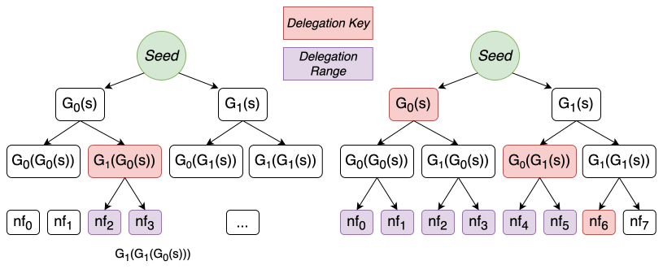

# GGM-based Nullifier

> Archive of the GGM-based nullifier design.
> We have moved away from it and embraced [Polynomial-based nullifier](./nf-analysis.md).

A natural abstraction for the first constraint is the *constrained PRF*
[[BW13]](https://eprint.iacr.org/2013/352.pdf): from the master key one can
derive a constrained key that enables the evaluation of the PRF at a certain
subset of the input domain and nowhere else. Section 3.3 of [BW13]
explains the *prefix-fixing* family realized by the seminal 
[[GGM84] PRF](https://crypto.stanford.edu/pbc/notes/crypto/ggm.html)
which is sufficient for us.

#### GGM-based Nullifier {#nf-ggm}

Let $\bits{e} = (e_0, e_1, \ldots, e_{\ell-1}) \in \{0,1\}^\ell$ be the
binary expansion of $e$ (so $e_0$ is the most significant bit).
Let $G: \{0,1\}^s \rightarrow \{0,1\}^{2s}$ be a length-doubling PRG, split into
halves $G(x) = G_0(x)\, \|\, G_1(x)$. In practice, we can instantiate $G_0(x) =
H(0 \| x), G_1(x) = H(1 \| x)$ with some hash function $H$ modeled as random oracle.
The GGM PRF walks down a binary tree from a seed, branching left or right at each
level according to the input bits:

$$
F^{\mathsf{GGM}}_{\seed}(e) :=
G_{e_{\ell-1}}\!\Bigl( \cdots G_{e_1}\!\bigl( G_{e_0}(\seed) \bigr) \cdots \Bigr)
$$

The Tachyon nullifier instantiates this GGM PRF with a per-note seed bound to
both the user's nullifier key $\nk$ and the note's trapdoor $\psi$:

$$
\nf_e = F^{\mathsf{GGM}}_{\PRF_\nk(\psi)}(e) =
G_{e_{\ell-1}}\!\Biggl( \cdots G_{e_1}\!\Bigl( G_{e_0}(\PRF_\nk(\psi)) \Bigr) \cdots \Biggr)
$$

A few properties worth highlighting:

- **Per-note and owner-bound**: Only the holder of $\nk$ can compute the seed
  $\PRF_\nk(\psi)$, so only the owner can derive $\nf_e$. The seed also
  depends on the per-note $\psi$, so different notes live in completely
  disjoint GGM trees: a prefix key delegated for one note grants the OSS
  *nothing* about any other note's nullifiers.[^cross-note-attack]
- **Forward-only**: Each $G_b$ is one-way — from any internal node one can
  walk further down, but cannot recover its parent or reach a sibling
  subtree. A partially-walked node thus lets its holder reach every leaf
  below it, and nothing else.
- **Provably pseudorandom**: For uniform $\nk$, the seed $\PRF_\nk(\psi)$ is
  pseudorandom by PRF security; GGM then yields pseudorandom $\nf_e$ over
  any distinct epoch queries, sequential or even adversarially chosen.
- **Circuit efficient**: One PRF call to derive the seed plus $\ell$ PRG
  calls down the tree — a single $\nf_e$ costs $\ell + 1$ hashes when both
  the PRF and $G_0, G_1$ are instantiated with Poseidon.

[^cross-note-attack]: Had we instead used a note-independent
    $k_e = F^{\mathsf{GGM}}_\nk(e)$ and folded $\psi$ into a final
    $\nf_e = \PRF_{k_e}(\psi)$, the same $k_e$ would be shared across every
    note the user owns. An OSS holding a delegated $k_e$ for note $A$ could
    then compute $\nf_e^{(B)} = \PRF_{k_e}(\psi_B)$ for any other note $B$
    whose $\psi_B$ it knows — and since $\psi$ is sender-shared via the
    payment protocol, a colluding sender-OSS would learn the epoch-$e$
    nullifier of every note it ever sent the user. Worse, *future*
    delegations would retroactively unmask past spends: receiving $k_{e+1}$
    later lets the attacker compute $\PRF_{k_{e+1}}(\psi_A)$ for a note $A$
    already spent at epoch $e+1$ and find the match in the on-chain
    nullifier history. Binding the GGM seed itself to per-note $\psi$ severs
    both attacks: each note has its own tree, and a delegated subtree key
    cannot cross GGM trees.

The forward-only property is exactly what makes OSS delegation work. For any
prefix $\mathbf{v}$ of length $d$, the internal node
$k_\mathbf{v} := G_{v_{d-1}}(\cdots G_{v_0}(\seed) \cdots)$ is a
*prefix-constrained key*: its holder can derive $\nf_e$ for every $e$ in
*this note's* tree whose top $d$ bits equal $\mathbf{v}$, and learns nothing
about any other $\nf$ — including any nullifier of a *different* note, whose
tree is rooted at a different seed.

Concretely, in a 3-bit epoch space, delegating the range
$[2, 4) = \{010, 011\}$ for some note amounts to handing the OSS the depth-2
prefix key

$$k_{01} = G_1(G_0(\seed)), \qquad \seed = \PRF_\nk(\psi)$$

from which it forward-walks $G_0$ and $G_1$ to obtain $k_{010}$, $k_{011}$ and
thus $\nf_2, \nf_3$ for that note. Because $G$ is one-way, the OSS cannot
reach any node outside the `01` subtree, so future revelations of
$\nf_4, \nf_5, \ldots$ remain unlinkable to anything it has seen.

When the requested range does not align to a single subtree, it is delegated as
a *set of prefix keys*: one per maximal subtree contained in the range.
Delegating $[0, 7) = \{0, 1, \ldots, 6\}$, for example, requires three subtree
roots (all under the same per-note $\seed$):

$$\bigl\{\; G_0(\seed),\quad G_0(G_1(\seed)),\quad G_0(G_1(G_1(\seed))) \;\bigr\}$$

covering $\{0,1,2,3\}$, $\{4,5\}$, and $\{6\}$ respectively. In the worst case
an arbitrary range in an $\ell$-bit epoch space needs $O(\ell)$ prefix keys, so
the delegated key material is variable-size.

  

> **Optimization: mixed-arity trees.** We use a binary tree for clarity, but the
> arity need not be uniform across levels. A nullifier's in-circuit cost is the
> number of hashes along its root-to-leaf path, i.e. the tree height, so a *wider*
> branching near the root shortens every path and lowers that cost. Keeping the
> branching binary near the *leaves* preserves fine-grained range coverage for OSS
> delegation, where a delegated subtree should span as few surplus epochs as
> possible. High arity at the top and arity-2 at the bottom buys both at once: a
> shallow circuit and tight delegation ranges.

#### Nullifier Security {#nf-sec}

We now examine how the evolving nullifier upholds the security properties [carved
out](#decouple) for the shielded protocol. Readers can safely skip this
section and come back later since the analysis refers to concepts introduced
in later sections.

**Balance.** Only the holder of $\nk$ can compute any $\nf_e$, since the GGM
seed $\PRF_\nk(\psi)$ requires it. The spend circuit pins both $\nf_e$ and
$\nf_{e+1}$ to a deterministic function of the note and epoch, so a note has
exactly one valid nullifier per epoch and no freedom to mint a fresh value that
dodges a past spend. Double-spending is then ruled out by two complementary
checks that [leave no gap](#consensus-rule). The [spendability proof](#spendability)
certifies the nullifier absent throughout pruned history up to its anchor, and
consensus rescans the recent window (the current epoch and the one before) that
the proof does not reach. Publishing both $\nf_e$ and $\nf_{e+1}$ extends this
across the epoch boundary, so a note cannot be spent twice even as $e$ advances.

**Note Privacy.** The adversary is a keyless third party reading the whole
on-chain transaction, including any in-band memo. The shielded footprint, namely
the commitment $\cm$ (hidden by $\rcm$), the spend's revealed nullifiers
(pseudorandom by GGM PRF security), the rerandomized $\rk$, and the hiding $\cv$,
reveals none of $\pk$, $v$, $\psi$. The in-band memo is payment-protocol data
that the shielded protocol carries opaquely and never parses (committed only to
`da_digest`), so its secrecy rests on the payment protocol's encryption, not on
the shielded core.

**Note Privacy (OOB).** Here the note plaintext travels out of band rather than
as an in-band ciphertext, so the adversary of concern is the sender, who learns
$\pk, v, \psi, \rcm$ but never the recipient's $\nk$. Because every $\nf_e$ hangs
off the secret seed $\PRF_\nk(\psi)$, knowledge of the note plaintext alone does
not let the sender, or anyone it colludes with, recognize the recipient's
eventual spend on chain or link it back to the note it sent.

**Spend Unlinkability.** Across epochs the $\{\nf_e\}$ of a fixed note are
mutually pseudorandom to anyone lacking $\nk$, by GGM PRF security, and this
holds even for the pair $\nf_e, \nf_{e+1}$ revealed together at spend. An OSS
[delegated](#nf-ggm) a prefix key for a range $[e_1, e_2)$ can refresh exclusion
proofs there, but the tree's forward-only structure prevents it from reaching
any leaf beyond the range, in particular the spend leaf, since
[syncing stops at $e-1$](#txflow). To an attacker holding only the on-chain
$\cm$, the spend is unlinkable to it, since the two draw on disjoint randomness
($\rcm$ versus the GGM seed). The stronger flavor of spend unlinkability, under
incoming viewing key access, falls to the payment protocol, since Tachyon's
shielded core has no $\ivk$.

**Faerie-gold via the wallet.** In Orchard, Faerie-gold resistance comes from
binding each new note's $\rho$ to the unique nullifier of an input note.
Tachyon's [tachygram accumulator](#acc) does not assign notes a canonical
position, so the shielded protocol cannot enforce that binding. A malicious
sender could in principle pick colliding $\psi$ values across two notes sent
to the same recipient, where only one of them is spendable. We push detection
to the recipient's wallet: upon receiving a note, the wallet computes the note's
nullifier at a fixed reference epoch and rejects the note if it collides with any
other note it currently holds. Since a wallet's note set is small, the check is cheap;
the knowledge that compliant wallets will reject such collisions is enough to
deter the attack.
