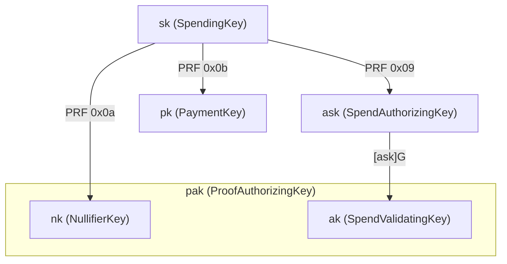

# Key Hierarchy

Tachyon simplifies the Zcash key hierarchy by removing key diversification, viewing keys, and payment addresses from the core protocol. These capabilities are handled by higher-level wallet software through out-of-band payment protocols.[^out-of-band]

[^out-of-band]: See [Tachyaction at a Distance](https://seanbowe.com/blog/tachyaction-at-a-distance/) for the full design rationale behind out-of-band payments and the simplified key hierarchy.

## Derivation

All child keys are derived from the spending key $\mathsf{sk}$ via domain-separated PRF expansion:

$$ \text{PRF}^{\text{expand}}_{\mathsf{sk}}(t) = \text{BLAKE2b-512}(\text{"Zcash\_ExpandSeed"},\; \mathsf{sk} \| t) $$

The domain bytes ($\texttt{0x09}$, $\texttt{0x0a}$, $\texttt{0x0b}$) are allocated to avoid collisions with Sapling and Orchard.

### Comparison with Orchard

| Layer | Orchard | Tachyon | Rationale |
| ----- | ------- | ------- | --------- |
| Root | Spending key ($\mathsf{sk}$) | Spending key ($\mathsf{sk}$) | Identical |
| Auth | $\mathsf{ask} \to \mathsf{ak}$ | $\mathsf{ask} \to \mathsf{ak}$ | Identical |
| Viewing | Full viewing key ($\mathsf{ak}, \mathsf{nk}, \mathsf{rivk}$) | **Removed** | Out-of-band |
| Incoming | $\mathsf{dk}, \mathsf{ivk}, \mathsf{ovk}$ | **Removed** | Out-of-band |
| Address | Diversifier $d$, transmission key $\mathsf{pk_d}$ | Payment key $\mathsf{pk}$ | No diversification |
| Proof authorization | Not separated | $\mathsf{pak} = (\mathsf{ak}, \mathsf{nk})$ | Authorize proofs for all notes |
| Per-note delegation | Not separated | $(\mathsf{ak}, \mathsf{mk})$ | Delegate proofs for one note |
| Epoch delegation | Not separated | $(\mathsf{ak}, \Psi_t)$ | Delegate non-inclusion proving for epochs $e \leq t$ |

The key insight is that removing in-band secret distribution (on-chain ciphertexts) eliminates the need for viewing keys, diversified addresses, and the entire key tree that supports them.

## Long-lived Keys

### Spending key ($\mathsf{sk}$)

Raw 32-byte entropy. The root of all authority — must be kept secret. Matches Orchard's representation (raw bytes, not a field element), preserving the full 256-bit key space.

### Spend authorizing key ($\mathsf{ask}$)

$$\mathsf{ask} = \text{ToScalar}\bigl(\text{PRF}^{\text{expand}}_{\mathsf{sk}}([\texttt{0x09}])\bigr)$$

A long-lived $\mathbb{F}_q$ scalar derived from $\mathsf{sk}$. **Cannot sign directly** — it must be randomized into a per-action $\mathsf{rsk}$ first. Per-action randomization ensures each $\mathsf{rk}$ is unlinkable to $\mathsf{ak}$, so observers cannot correlate actions to the same spending authority.

#### Sign normalization

RedPallas requires the public key $\mathsf{ak} = [\mathsf{ask}]\,\mathcal{G}$ to have $\tilde{y} = 0$ (sign bit cleared). Pallas point compression encodes $\tilde{y}$ in bit 255 of the 32-byte representation. If $\tilde{y}(\mathsf{ak}) = 1$, we negate $\mathsf{ask}$:

$$[-\mathsf{ask}]\,\mathcal{G} = -[\mathsf{ask}]\,\mathcal{G}$$

This flips the y-coordinate sign, producing a valid $\mathsf{ak}$ with $\tilde{y} = 0$. The normalization happens once at derivation time.

### Spend validating key ($\mathsf{ak}$)

$$\mathsf{ak} = [\mathsf{ask}]\,\mathcal{G}$$

The long-lived counterpart of $\mathsf{ask}$. Corresponds to the "spend validating key" in Orchard (§4.2.3). Constrains per-action $\mathsf{rk}$ in the proof, tying accumulator activity to the holder of $\mathsf{ask}$.

$\mathsf{ak}$ **cannot verify action signatures directly** — it must be randomized into a per-action $\mathsf{rk}$ for verification. Component of the proof authorizing key $\mathsf{pak}$.

#### Three-tier naming

The spend authorization keys follow a three-tier scheme mapping to **private scalar → circuit witness → public on-chain**:

| Tier | Rust type | Protocol | Role |
| ---- | --------- | -------- | ---- |
| Spend-authorizing | `SpendAuthorizingKey` | $\mathsf{ask}$ | Private scalar, enables spend authorization |
| Spend-validating | `SpendValidatingKey` | $\mathsf{ak}$ | Circuit witness, constrains `rk` for accumulator binding |
| Action-verification | `ActionVerificationKey` | $\mathsf{rk}$ | Per-action, verifies signatures (on-chain) |

### Nullifier key ($\mathsf{nk}$)

$$\mathsf{nk} = \text{ToBase}\bigl(\text{PRF}^{\text{expand}}_{\mathsf{sk}}([\texttt{0x0a}])\bigr)$$

An $\mathbb{F}_p$ element used in nullifier derivation. Tachyon simplifies Orchard's nullifier construction:[^faerie-gold]

$$\mathsf{nf} = F_{\mathsf{nk}}(\Psi \| \text{flavor})$$

where $F$ is a keyed PRF (Poseidon), $\Psi$ is the note's nullifier trapdoor, and flavor is the epoch-id. See [Notes](./notes.md#nullifier-derivation).

$\mathsf{nk}$ alone does NOT confer spend authority — combined with $\mathsf{ak}$ it forms the proof authorizing key $\mathsf{pak}$, enabling proof construction and nullifier derivation without signing capability.

[^faerie-gold]: Orchard's more complex nullifier construction defended against faerie gold attacks. These are moot under out-of-band payments because the recipient controls $\Psi$ (via payment requests or URI redemption). See footnote 1 in "Tachyaction at a Distance."

### Payment key ($\mathsf{pk}$)

$$\mathsf{pk} = \text{ToBase}\bigl(\text{PRF}^{\text{expand}}_{\mathsf{sk}}([\texttt{0x0b}])\bigr)$$

Replaces Orchard's diversified transmission key $\mathsf{pk_d}$ and the entire diversified address system:

> "Tachyon removes the diversifier $d$ because payment addresses are removed. The transmission key $\mathsf{pk_d}$ is substituted with a payment key $\mathsf{pk}$."
> — "Tachyaction at a Distance" (Bowe 2025)

$\mathsf{pk}$ is **deterministic per spending key** — every note from the same $\mathsf{sk}$ shares the same $\mathsf{pk}$. There is no per-note diversification. Unlinkability is the wallet layer's responsibility, handled via out-of-band payment protocols (ZIP 321 payment requests, ZIP 324 URI encapsulated payments).

### Proof authorizing key ($\mathsf{pak}$)

$$\mathsf{pak} = (\mathsf{ak}, \mathsf{nk})$$

Allows constructing proofs without spend authority. The prover uses $\mathsf{ak}$ to constrain $\mathsf{rk} = \mathsf{ak} + [\alpha]\mathcal{G}$ and $\mathsf{nk}$ to constrain nullifier correctness in the circuit.

$\mathsf{pak}$ covers **all notes** because $\mathsf{nk}$ is wallet-wide. For narrower delegation, per-note key bundles restrict scope:

| Bundle | Keys | Holder | Scope |
| --- | --- | --- | --- |
| $\mathsf{pak}$ | $(\mathsf{ak}, \mathsf{nk})$ | Prover | All notes, all epochs |
| per-note | $(\mathsf{ak}, \mathsf{mk})$ | Per-note prover | One note, all epochs |
| delegate | $(\mathsf{ak}, \Psi_t)$ | OSS | One note, epochs $e \leq t$ |

The per-note master key $\mathsf{mk} = \text{KDF}(\Psi, \mathsf{nk})$ and delegate key $\Psi_t = \text{GGM}(\mathsf{mk}, t)$ are described in [Notes](./notes.md#oblivious-sync-delegation).
