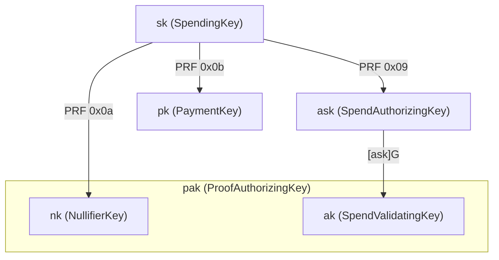
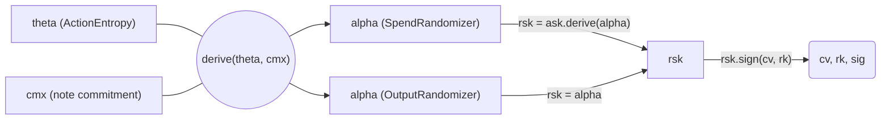
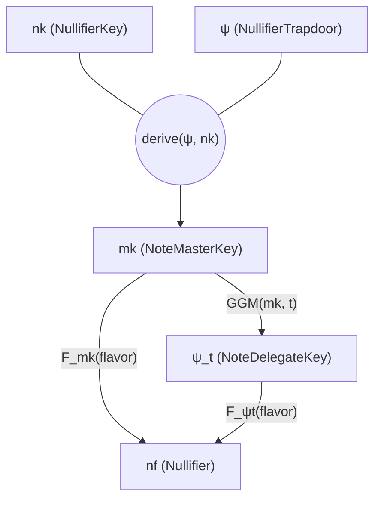

# Keys and Authorization

Tachyon simplifies the Zcash key hierarchy by removing key diversification, viewing keys, and payment addresses from the core protocol. These capabilities are handled by higher-level wallet software through out-of-band payment protocols.[^out-of-band]

[^out-of-band]: See [Tachyaction at a Distance](https://seanbowe.com/blog/tachyaction-at-a-distance/) for the full design rationale behind out-of-band payments and the simplified key hierarchy.

## Key Hierarchy

All child keys are derived from the spending key $\mathsf{sk}$ via domain-separated PRF expansion:

$$ \text{PRF}^{\text{expand}}_{\mathsf{sk}}(t) = \text{BLAKE2b-512}(\text{"Zcash\_ExpandSeed"},\; \mathsf{sk} \| t) $$

The domain bytes ($\texttt{0x09}$, $\texttt{0x0a}$, $\texttt{0x0b}$) are allocated to avoid collisions with Sapling and Orchard.

### Comparison with Orchard

| Layer | Orchard | Tachyon | Rationale |
| ----- | ------- | ------- | --------- |
| Root | Spending key ($\mathsf{sk}$) | Spending key ($\mathsf{sk}$) | Identical |
| Auth | $\mathsf{ask} \to \mathsf{ak}$ | $\mathsf{ask} \to \mathsf{ak}$ | Identical |
| Viewing | Full viewing key ($\mathsf{ak}, \mathsf{nk}, \mathsf{rivk}$) | **Removed** | Out-of-band |
| Incoming | $\mathsf{dk}, \mathsf{ivk}, \mathsf{ovk}$ | **Removed** | Out-of-band |
| Address | Diversifier $d$, transmission key $\mathsf{pk_d}$ | Payment key $\mathsf{pk}$ | No diversification |
| Proof authorization | Not separated | $\mathsf{pak} = (\mathsf{ak}, \mathsf{nk})$ | Authorize proofs for all notes |
| Per-note delegation | Not separated | $(\mathsf{ak}, \mathsf{mk})$ | Delegate proofs for one note |
| Epoch delegation | Not separated | $(\mathsf{ak}, \Psi_t)$ | Delegate non-inclusion proving for epochs $e \leq t$ |

The key insight is that removing in-band secret distribution (on-chain ciphertexts) eliminates the need for viewing keys, diversified addresses, and the entire key tree that supports them.

## Long-lived Keys

### Spending key ($\mathsf{sk}$)

Raw 32-byte entropy. The root of all authority — must be kept secret. Matches Orchard's representation (raw bytes, not a field element), preserving the full 256-bit key space.

### Spend authorizing key ($\mathsf{ask}$)

$$\mathsf{ask} = \text{ToScalar}\bigl(\text{PRF}^{\text{expand}}_{\mathsf{sk}}([\texttt{0x09}])\bigr)$$

A long-lived $\mathbb{F}_q$ scalar derived from $\mathsf{sk}$. **Cannot sign directly** — it must be randomized into a per-action $\mathsf{rsk}$ first. Per-action randomization ensures each $\mathsf{rk}$ is unlinkable to $\mathsf{ak}$, so observers cannot correlate actions to the same spending authority.

#### Sign normalization

RedPallas requires the public key $\mathsf{ak} = [\mathsf{ask}]\,\mathcal{G}$ to have $\tilde{y} = 0$ (sign bit cleared). Pallas point compression encodes $\tilde{y}$ in bit 255 of the 32-byte representation. If $\tilde{y}(\mathsf{ak}) = 1$, we negate $\mathsf{ask}$:

$$[-\mathsf{ask}]\,\mathcal{G} = -[\mathsf{ask}]\,\mathcal{G}$$

This flips the y-coordinate sign, producing a valid $\mathsf{ak}$ with $\tilde{y} = 0$. The normalization happens once at derivation time.

### Spend validating key ($\mathsf{ak}$)

$$\mathsf{ak} = [\mathsf{ask}]\,\mathcal{G}$$

The long-lived counterpart of $\mathsf{ask}$. Corresponds to the "spend validating key" in Orchard (§4.2.3). Constrains per-action $\mathsf{rk}$ in the proof, tying accumulator activity to the holder of $\mathsf{ask}$.

$\mathsf{ak}$ **cannot verify action signatures directly** — it must be randomized into a per-action $\mathsf{rk}$ for verification. Component of the proof authorizing key $\mathsf{pak}$.

#### Three-tier naming

The spend authorization keys follow a three-tier scheme mapping to **private scalar → circuit witness → public on-chain**:

| Tier | Rust type | Protocol | Role |
| ---- | --------- | -------- | ---- |
| Spend-authorizing | `SpendAuthorizingKey` | $\mathsf{ask}$ | Private scalar, enables spend authorization |
| Spend-validating | `SpendValidatingKey` | $\mathsf{ak}$ | Circuit witness, constrains `rk` for accumulator binding |
| Action-verification | `ActionVerificationKey` | $\mathsf{rk}$ | Per-action, verifies signatures (on-chain) |

### Nullifier key ($\mathsf{nk}$)

$$\mathsf{nk} = \text{ToBase}\bigl(\text{PRF}^{\text{expand}}_{\mathsf{sk}}([\texttt{0x0a}])\bigr)$$

An $\mathbb{F}_p$ element used in nullifier derivation. Tachyon simplifies Orchard's nullifier construction:[^faerie-gold]

$$\mathsf{nf} = F_{\mathsf{nk}}(\Psi \| \text{flavor})$$

where $F$ is a keyed PRF (Poseidon), $\Psi$ is the note's nullifier trapdoor, and flavor is the epoch-id. See [Nullifier Derivation](#nullifier-derivation) below.

$\mathsf{nk}$ alone does NOT confer spend authority — combined with $\mathsf{ak}$ it forms the proof authorizing key $\mathsf{pak}$, enabling proof construction and nullifier derivation without signing capability.

[^faerie-gold]: Orchard's more complex nullifier construction defended against faerie gold attacks. These are moot under out-of-band payments because the recipient controls $\Psi$ (via payment requests or URI redemption). See footnote 1 in "Tachyaction at a Distance."

### Payment key ($\mathsf{pk}$)

$$\mathsf{pk} = \text{ToBase}\bigl(\text{PRF}^{\text{expand}}_{\mathsf{sk}}([\texttt{0x0b}])\bigr)$$

Replaces Orchard's diversified transmission key $\mathsf{pk_d}$ and the entire diversified address system:

> "Tachyon removes the diversifier $d$ because payment addresses are removed. The transmission key $\mathsf{pk_d}$ is substituted with a payment key $\mathsf{pk}$."
> — "Tachyaction at a Distance" (Bowe 2025)

$\mathsf{pk}$ is **deterministic per spending key** — every note from the same $\mathsf{sk}$ shares the same $\mathsf{pk}$. There is no per-note diversification. Unlinkability is the wallet layer's responsibility, handled via out-of-band payment protocols (ZIP 321 payment requests, ZIP 324 URI encapsulated payments).

### Proof authorizing key ($\mathsf{pak}$)

$$\mathsf{pak} = (\mathsf{ak}, \mathsf{nk})$$

Allows constructing proofs without spend authority. The prover uses $\mathsf{ak}$ to constrain $\mathsf{rk} = \mathsf{ak} + [\alpha]\mathcal{G}$ and $\mathsf{nk}$ to constrain nullifier correctness in the circuit.

$\mathsf{pak}$ covers **all notes** because $\mathsf{nk}$ is wallet-wide. For narrower delegation, per-note key bundles restrict scope:

| Bundle | Keys | Holder | Scope |
| --- | --- | --- | --- |
| $\mathsf{pak}$ | $(\mathsf{ak}, \mathsf{nk})$ | Prover | All notes, all epochs |
| per-note | $(\mathsf{ak}, \mathsf{mk})$ | Per-note prover | One note, all epochs |
| delegate | $(\mathsf{ak}, \Psi_t)$ | OSS | One note, epochs $e \leq t$ |

The per-note master key $\mathsf{mk} = \text{KDF}(\Psi, \mathsf{nk})$ and delegate key $\Psi_t = \text{GGM}(\mathsf{mk}, t)$ are described in [Nullifier Derivation](#nullifier-derivation).

## Per-action Authorization

Each tachyaction requires a fresh randomized key pair. The authorization flow starts with per-action entropy $\theta$ and diverges based on whether the action is a spend or output.

### ActionEntropy ($\theta$)

32 bytes of randomness chosen by the signer. Combined with a note commitment to deterministically derive the randomizer $\alpha$:

$$\alpha = \text{ToScalar}(\text{BLAKE2b-512}(\text{"Tachyon-AlphaDrv"},\; \theta \| \mathsf{cmx}))$$

This design enables **hardware wallet signing without proof construction**: the hardware wallet holds $\mathsf{ask}$ and $\theta$, signs with $\mathsf{rsk} = \mathsf{ask} + \alpha$, and a separate device constructs the proof later using $\theta$ and $\mathsf{cmx}$ to recover $\alpha$.

### Spend vs Output authorization

Both paths produce $(\mathsf{rk}, \text{sig})$ — the per-action verification key and its signature. The randomizer $\alpha$ is retained separately as a proof witness. Internally, $\mathsf{rsk}$ is derived and used for signing, but never exposed.

**Spend** — requires spending authority:

$$\mathsf{rsk} = \mathsf{ask} + \alpha$$

The resulting $\mathsf{rk} = \mathsf{ak} + [\alpha]\,\mathcal{G}$ is a re-randomization of the spend validating key. The custody device derives $\alpha$ from $(\theta, \mathsf{cmx})$, computes $\mathsf{rsk}$, signs, and returns $(\mathsf{rk}, \text{sig})$. The user device independently derives the same $\alpha$ for the proof witness.

**Output** — no spending authority needed:

$$\mathsf{rsk} = \alpha$$

The resulting $\mathsf{rk} = [\alpha]\,\mathcal{G}$ is a re-randomization of the generator itself. No custody device is involved.

Both produce an $\mathsf{rk}$ that can verify a signature, but only the spend's $\mathsf{rk}$ requires knowledge of $\mathsf{ask}$. This unification lets consensus treat all tachyactions identically.

### Action signing and verification

Each tachyaction carries a RedPallas signature over a domain-separated hash of the action's public data:

$$\text{sighash} = \text{BLAKE2b-512}(\text{"Tachyon-SpendSig"},\; \mathsf{cv} \| \mathsf{rk})$$

The signature binds ($\mathsf{cv}$, $\mathsf{rk}$) together. Since $\mathsf{rk}$ is itself a commitment to $\mathsf{cmx}$ (via $\alpha$'s derivation from $\theta$ and $\mathsf{cmx}$), the signature transitively binds the action to its tachygram without the tachygram appearing in the action.

| Key | Lifetime | Can sign? | Can verify? |
| --- | -------- | --------- | ----------- |
| $\mathsf{ask}$ | Long-lived | No | — |
| $\mathsf{ak}$ | Long-lived | — | No |
| $\mathsf{rsk}$ | Per-action | **Yes** | — |
| $\mathsf{rk}$ | Per-action | — | **Yes** |

## Value Commitments

Tachyon uses Pedersen commitments on the Pallas curve for value hiding:

$$\mathsf{cv} = [v]\,\mathcal{V} + [\mathsf{rcv}]\,\mathcal{R}$$

where $v$ is the signed integer value (positive for spends, negative for outputs) and $\mathsf{rcv}$ is a random trapdoor in $\mathbb{F}_q$.

The generators $\mathcal{V}$ and $\mathcal{R}$ are shared with Orchard, derived from the domain `z.cash:Orchard-cv`. This reuse is intentional — the binding signature scheme uses `reddsa::orchard::Binding` which hardcodes $\mathcal{R}$ as its basepoint.

### Homomorphic property

The sum of value commitments preserves the algebraic structure:

$$\sum_i \mathsf{cv}_i = \bigl[\sum_i v_i\bigr]\,\mathcal{V} + \bigl[\sum_i \mathsf{rcv}_i\bigr]\,\mathcal{R}$$

This enables the binding signature scheme to prove value balance without revealing individual values.

## Binding Signatures

The binding signature proves that the transaction's value commitments sum to the declared balance.

### Construction (signer side)

The signer knows all value commitment trapdoors and computes their sum:

$$\mathsf{bsk} = \boxplus_i \mathsf{rcv}_i$$

This is the discrete log of $\mathsf{bvk}$ with respect to $\mathcal{R}$:

$$\mathsf{bvk} = \bigl(\bigoplus_i \mathsf{cv}_i\bigr) \ominus \text{ValueCommit}_0(\mathsf{v\_balance})$$

$$= \bigl[\sum_i v_i - \mathsf{v\_balance}\bigr]\,\mathcal{V} + \bigl[\sum_i \mathsf{rcv}_i\bigr]\,\mathcal{R}$$

$$= [0]\,\mathcal{V} + [\mathsf{bsk}]\,\mathcal{R} \qquad (\text{when } \sum_i v_i = \mathsf{v\_balance})$$

The binding signature proves knowledge of $\mathsf{bsk}$, which is an opening of the Pedersen commitment $\mathsf{bvk}$ to value 0. By the binding property of the commitment scheme, it is infeasible to find another opening to a different value — so value balance is enforced.

### Verification (validator side)

The validator recomputes $\mathsf{bvk}$ from public data (action value commitments and declared value balance) and verifies:

$$\text{BindingSig.Validate}_{\mathsf{bvk}}(\text{sighash}, \text{bindingSig}) = 1$$

### Tachyon-specific signing message

Tachyon signs:

$$\text{sighash} = \text{BLAKE2b-512}(\text{"Tachyon-BindHash"},\; \mathsf{v\_balance} \| \mathsf{sig}_1 \| \cdots \| \mathsf{sig}_n)$$

This differs from Orchard's `SIGHASH_ALL` transaction hash because:

- Action signatures already bind $\mathsf{cv}$ and $\mathsf{rk}$ via $H(\text{"Tachyon-SpendSig"},\; \mathsf{cv} \| \mathsf{rk})$
- The binding signature must be computable without the full transaction
- The stamp is excluded because it is stripped during [aggregation](./aggregation.md)

## Notes

Tachyon notes are simpler than Orchard's. Recall that Orchard notes are:

$$(d, \mathsf{pk_d}, v, \rho, \psi, \mathsf{rcm})$$

Tachyon removes $d$ (no diversified addresses), substitutes $\mathsf{pk_d}$ with $\mathsf{pk}$, and removes $\rho$ (no faerie gold defense needed). The result:

$$(\mathsf{pk}, v, \Psi, \mathsf{rcm})$$

| Field | Type | Description |
| ----- | ---- | ----------- |
| $\mathsf{pk}$ | $\mathbb{F}_p$ | Recipient's payment key |
| $v$ | integer | Note value ($< 2.1 \times 10^{15}$ zatoshis) |
| $\Psi$ | $\mathbb{F}_p$ | Nullifier trapdoor (user-controlled) |
| $\mathsf{rcm}$ | $\mathbb{F}_q$ | Commitment randomness |

Both $\Psi$ and $\mathsf{rcm}$ can be derived from a shared key negotiated through the out-of-band payment protocol. This means the sender and recipient need only exchange $\mathsf{pk}$ and $v$ explicitly — the note randomness can be deterministic from a shared secret.

## Nullifier Derivation

Tachyon's nullifier construction is significantly simpler than Orchard's:[^orchard-nf]

$$\mathsf{nf} = F_{\mathsf{nk}}(\Psi \| \text{flavor})$$

where $F$ is a keyed PRF (Poseidon), $\Psi$ is the nullifier trapdoor, and flavor is the epoch.

[^orchard-nf]: Orchard uses $\mathsf{nf} = \text{Extract}((F_{\mathsf{nk}}(\rho) + \psi \bmod p) \cdot \mathcal{G} + \mathsf{cm})$. The complexity defended against faerie gold attacks and made weak assumptions about circuit-efficient PRFs. See the [Orchard book](https://zcash.github.io/orchard/design/nullifiers.html) for the full explanation.

### Epoch flavoring

The same note spent in different epochs produces different nullifiers. This is essential for oblivious synchronization — consensus validators only need to retain the last $k$ blocks worth of nullifiers, and users must prove their notes were spendable up to a recent point in history.

### Oblivious sync delegation

The master root key $\mathsf{mk} = \text{KDF}(\Psi, \mathsf{nk})$ seeds a GGM (Goldreich-Goldwasser-Micali) tree PRF. Prefix keys $\Psi_t$ permit evaluating the PRF only for epochs $e \leq t$, enabling range-restricted delegation to an untrusted service (OSS) for non-inclusion proving without revealing spend capability.

| Key | Rust type | Holder | Capability |
| --- | --------- | ------ | ---------- |
| $\mathsf{mk}$ | `NoteMasterKey` | User device | Derive nullifiers for any epoch; derive delegate keys |
| $\Psi_t$ | `NoteDelegateKey` | OSS | Derive nullifiers for epochs $e \leq t$ only |

$\mathsf{mk}$ is ephemeral — the user device derives it from $(\mathsf{nk}, \Psi)$ when needed, never stores or transmits it. The OSS receives only delegate keys, which cannot recover $\mathsf{mk}$ or $\mathsf{nk}$.

## Domain Separators

| Constant | Value | Purpose |
| -------- | ----- | ------- |
| PRF expansion | `Zcash_ExpandSeed` | Key derivation from $\mathsf{sk}$ (shared with Sapling/Orchard) |
| Action sighash | `Tachyon-SpendSig` | Action signature message: $H(\mathsf{cv} \| \mathsf{rk})$ |
| Binding sighash | `Tachyon-BindHash` | Binding signature message: $H(\mathsf{v\_balance} \| \text{sigs})$ |
| Alpha derivation | `Tachyon-AlphaDrv` | Per-action randomizer: $H(\theta \| \mathsf{cmx})$ |
| Value commitment | `z.cash:Orchard-cv` | Generators $\mathcal{V}$, $\mathcal{R}$ (shared with Orchard) |
| Nullifier | `z.cash:Tachyon-nf` | Nullifier PRF domain |
| Note commitment | `z.cash:Tachyon-NoteCommit` | Note commitment scheme |
| Accumulator | `z.cash:Tachyon-acc` | Polynomial accumulator hash-to-curve |
