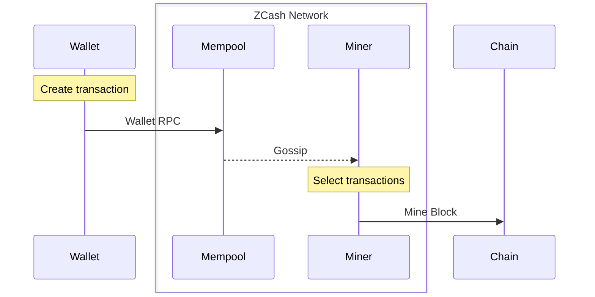
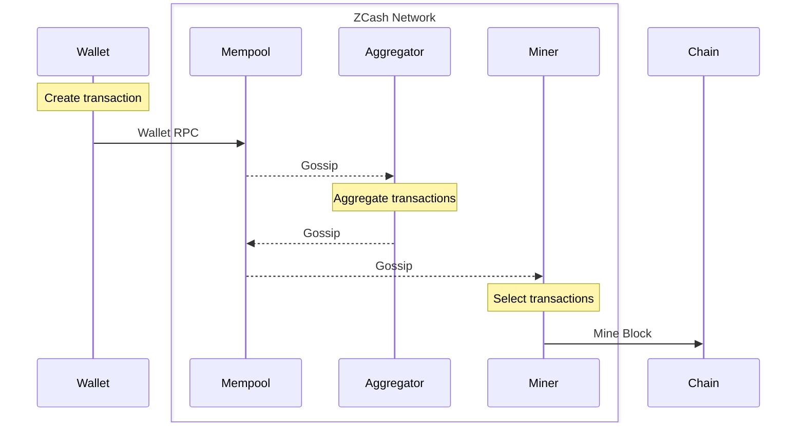

# Overview

Without Tachyon, the ZCash transaction lifecycle is similar to other blockchains:

Tachyon introduces shielded transaction aggregates, which introduce a new network role, called an _aggregator_:

