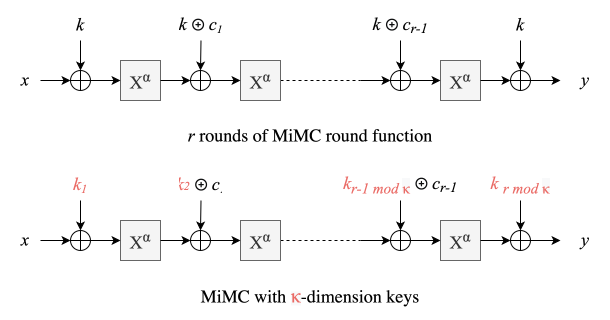
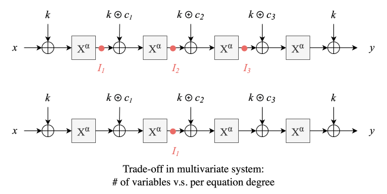

# Nullifier Analysis

## Background

Excerpt from the Tachyon [deep dive](./revisit.md) below.

A Tachyon note is:

$$
\mathsf{Note} := (\pk, v, \psi, \rcm) 
$$

where $\pk$ is the payment key, $v$ is the value of the note, 
$\psi$ is pseudo-random note identity that binds to the note nullifier value as
an input to its derivation, and $\rcm$ is a random commitment trapdoor.

The ideal functionality for an epoched nullifier is a deterministic function:

$$
\nf_e = \mathsf{KDF}(\nk, \psi, e)
$$

whose outputs are indistinguishable from random bytes. Such an $\nf_e$ binds to
both the spending authority (via $\nk$) and the underlying note (via its per-note
trapdoor $\psi$), while remaining unlinkable across epochs to anyone without $\nk$.

We proposed a [**GGM-based nullifier**](./revisit.md#nf-ggm) whose derivation
requires walking a tree where descending one level involves a Poseidon hash.
The construction details are irrelevant thus skipped here.
The main takeaway is: a single nullifier derivation (full tree walk) already
saturates the circuit capacity for a PCD step!

<a id="ggm-cost"><b>GGM Cost</b></a>: Calculation Details

    
The GGM tree size is determined by how large of the epoch space do we want to
support. A depth-$14$ tree implies the largest epoch value being $2^{14}-1$.
Assuming 1 day/epoch, this translates to 45 years in the future which is
reasonable. A full root-to-leaf walk of such tree requires $14$ Poseidon hashes.
    
Step circuit size (`max_mul_gates`) is $n=2^{11}=2048$. Since our constraint
system allows $4n$ linear constraints, this budget is overly abundant and we only
focus on multiplication constraints. Step capacity for Poseidon is $7$ ([see
here](https://github.com/tachyon-zcash/ragu/pull/720)) as per-permutation gate
cost is $288$.
    
With a [mixed-arity optimization](./revisit.md#mixed-arity) of the tree, where
the arity is higher towards the root and binary towards the leaf, we can cut
down the depth to 7, thus fit a full derivation in a single step. $\blacksquare$
    

Ideally, we want to **fit more (at least two) nullifier derivations in a single
step**. For example, the [`NfDerive` step](./revisit.md#steps) derives both
$\nf_e$ and $\nf_{e+1}$ for the spending epoch $e$ in a single step.
Therefore, the challenge is to find alternative nullifier constructions with
lower circuit complexity.

The high-level idea is to construct a degree-$d$ polynomial $f_k(X)$ such that:

- $f_k(\cdot)$ is keyed by $k = \mathsf{KDF}(\nk, \psi)$ so that only $\nk$-holder
  (namely note owners) knows the full $f_k(X)$ and its derivation is bound to the
  specific note identity $\psi$.
- Highly efficient to evaluate $\nf_e = f_k(e)$: only $O(\log{d})$ work.
  - epoch domain size $|E| < d + 1$
- Given any set of evaluation points $S \subseteq E$ and their evaluations
  $\{f_k(i)\}_{i\in S}$, *any evaluation outside the set $f_k(j \notin S)$ is
  indistinguishable from random*.
  - strictly stronger requirement than "cannot compute $f_k(j)$": unpredictability
    is insufficient; semantic security is necessary for spend unlinkability.
  - relaxing statistical indistinguishability to computational expands the
    design space.

This alternative is a promising direction because proving $\nf_e$ derivation is
now an evaluation claim, which can be either proven directly in circuit (only
field ops) or piggyback on the [online polynomial oracle](./revisit.md#acc)
exposes by the Ragu proof system (low circuit cost).

## Threat Model

We discuss security from the perspective of recipients whom we address to as
"users". Senders and syncing services (OSS) are untrusted. Here are the
assumptions/setup:

- $\psi, \rcm$: picked by the sender.
- $\nk$: privately known to the user.
- OSS can derive nullifiers for a finite range of delegated epochs. They cannot
  locate/link the note commitment $\cm$ or future nullifiers outside the range.
- malicious users try to double-spend by publishing $\nf_e' \neq \nf_e$ for the
  same note in any epoch $e$ that both pass the derivation integrity check.

## Attempt 1: Statistically Indistinguishable {#attempt1}

### Attempt 1.1: User-sampled

- User randomly samples a $f(X)$ of bounded degree, commits to it and sends
  $\cm_f$ to the sender.
  - to support epoch range $[0, d]$, take $d=2^{14}$ which is $\approx 45$
    years assuming a 1 day/epoch pace
- Sender prepares the Output note by setting $\psi = \mathsf{Extract}(\cm_f)$.
  Effectively, the $\cm$ commits to the nullifier polynomial.
  - user wallet rejects incoming note with unknown/wrong/repeated $\psi$
- OSS directly receives a single PCD proof attesting $\{\nf_i\}_{i\in R}$ for the
  delegated range $R$.

Pros:

- The circuit cost is minimum: load the note opening $\mathsf{Note}$ and $\cm_f$
  as secret witness, enforce $\psi = \mathsf{Extract}(\cm_f)$ in circuit, then
  append a PCS eval claim of form $(\cm_f, e, \nf_e)$ to the polynomial oracle.
- Proving multiple $\nf_e$ is practically free since querying multiple points on
  an already committed polynomial in our polynomial oracle incurs negligible cost.
  - Note that we don't need to witness the actual $f(X)$ or evaluate it in
    circuit thanks to the oracle, thus no special structure required for $f(X)$.
- Statistical indistinguishable due to random sampling and the $|E|\leq d$
  assumption where $E$ is the epoch domain. In practice, coefficients are
  PRF-derived from some master seed.

Cons:

1. UX nightmare: every new note requires user involvement (freshly samples then
   sends OOB).
2. Assisted proving required: OSS who tries to prove $f(e) = \nf_e$ in the
   [PCS evaluation protocol](https://tachyon.z.cash/ragu/protocol/core/accumulation/pcs)
   without access to the full $f(X)$ requires user's assistance to compute the
   evaluation of its quotient polynomial $q(u)$ at FS-challenge point $u$.
   Circumventing this impossible inconvenience leaves us with the solution where
   the user generate a PCD proof for *all* nullifier values of the delegated
   range as an input to the OSS's proof tree.
   
Among the two disadvantages, the interactive UX is the hairy one. Naturally, a
user can preload a sequence of future $\{\cm_f\}$ to the sender out-of-band.
However, this would increase the state management overhead since the wallet
needs to track all previously issued but yet unused $\cm_f$ to reject incoming
notes of unknown/repeated $\psi=\cm_f$.

Meanwhile, assisted proving is arguably inevitable (for all our attempts here).
The OSS cannot learn the full $f(X)$ since otherwise all future nullifiers are
computable and spend unlinkability is violated. To assist OSS, the user either
directly prove the full derivation of delegated nullifiers or prove the partial
evaluation of $f_k(e)$, refered as the delegation key, and OSS completes the
rest of the evaluation.[^ggm-partial] In the latter case, those partial
evaluations should reveal nothing about the full $f_k(X)$.

Alternatively, OSS can blindly trust the list of nullifiers supplied by the user
without any proof. The synced spendability proof will carry a header that collect
claimed nullifier values which will be proven once forwarded back to the user.
Spiritually, this is just another form of assisted proving, only reordered.

[^ggm-partial]: In the original GGM-based nullifier, the [`DelegateCert`
    step](./revisit.md#steps) proves integrity of the internal node whose value
    is the delegation key.

### Attempt 1b: Sender-sampled

A natural modification to avoid the user/recipient interaction is to switch to
sender-sampled random polynomials. However, the challenge is to cryptographically
bind to $\cm$. We have two ways:

1. Sender randomly sample $f(X)$ of degree $d=2^{14}$, using whatever entropy
   source, set $\psi = \mathsf{Commit}(f(X))$, thus binds to $\cm$.
2. Sender deterministically derives coefficients:
$$
\begin{aligned}
k &= H(\nk) \quad\text{(recipient-provided)}\\
a_0,\ldots,a_d &\leftarrow \mathsf{XOF}(k, \psi, d+1)\\
f(X) &= \sum_{i=0}^d a_i \, X^i
\end{aligned}
$$
   since coefficients binds to $(\nk, \psi)$, it transitively binds to $\cm$.

The problem with both approaches are their circuit costs. The first approach
requires enforcing $\mathsf{Commit}$ of a degree-$d$ polynomial in-circuit. The
second approach requires deriving all coefficients in-circuit: when instantiating
$\mathsf{XOF}$ with Poseidon-based sponge construction for variable-length
output, to witness the full $f(X)$ in-circuit requires $\frac{d}{\mathsf{Rate}}$ Poseidon
permutation. Both burden a higher cost than the original GGM construction.

## Attempt 2: Product of Sparse Polynomials {#attempt2}

> To eliminate recipient interaction during note creations, we avoid user-sampling
of coefficients. Instead, we explore a structured $f_k(X)$ where the $f_k(\cdot)$
description (i.e. coefficients) is fully determined by $(\nk, \psi)$, thus its
evaluation is enforced through proofs that $k = \mathsf{KDF}(\nk, \psi)$ and
$\nf_e = f_k(e)$. For circuit efficiency, we need to find a $f_k(X)$ with
sublinear evaluation logic which implies structured polynomials with **concise
algebraic descriptions**.
>
> Here, "concise" means fewer than $d+1$ independent coefficients, not just a
short generator program (that could expand a random seed into sufficient entropy).
Particularly, we relax our indistinguishability **from statistical to
computational** in pursuit of circuit efficiency.
We argue that this relaxation is *inevitable* when going beyond attempt 1.

We explore the first approach here and the second approach in the remaining sections.

- **product** of (low-degree) sparse polynomials
- **composition** of (low-degree) round functions where each round includes
  linear confusion and non-linear diffusion (via algebraic s-box)

Unlike attempt 1 whose $f(X)$ is randomly sampled with $(d+1)\cdot |\F|$-bit
entropy, thus remains statistically hiding so long as we reveal $\leq d$
evaluations. Our *structured* $f_k(X)$ candidates, with concise descriptions and
less entropy, must withstand various algebraic attacks.[^attack-lit]
We start with the GCD attack to demonstrate the necessity of polynomial degree
much higher than the epoch domain size: $\deg(f_k(X)) \gg |E| \approx 2^{14}$
even if we only reveal $< |E|$ evaluation points.

[^attack-lit]: For a survey of algebraic attacks on arithmtization-orientated
    cipher (AOC), start with Zellic's
    [blog post](https://www.zellic.io/blog/algebraic-attacks-on-zk-hash-functions/),
    then Section 4.2 of [MiMC](https://ia.cr/2016/492),
    Appendix E of [HADES](https://ia.cr/2019/1107),
    Appendix C.2 of [Poseidon](https://ia.cr/2019/458), and
    a detailed [SoK on Gröbner basis algorithm](https://ia.cr/2021/870).

<a id="gcd">**GCD Attack.**</a>
The GCD attack recovers the key by computing the GCD of two polynomials.
We view $f_k(X)$ as a bivariate polynomial $g(K, X)$. Given only two evaluations,
we can establish:

$$
\begin{cases}
h_1(k) = g(k, x_1) - y_1 = 0\\
h_2(k) = g(k, x_2) - y_2 = 0\\
\end{cases} \Longrightarrow
\mathsf{GCD}(h_1(K), h_2(K)) = (K - k)
$$

The complexity of GCD over two polynomial of degree $d$ is $O(d\log^2 d)$.
The quasilinear cost dictates that $\lambda=128$-bit security requires
$2^\lambda \leq d\log^2 d$, thus $d \geq 2^{118}$. $\blacksquare$

### Attempt 2a

An appealing candidate is:

$$
f_k(X) = \prod_{i=0}^{\log d} (X^{2^i} + b_i)
\quad\text{where } \{b_i\}\leftarrow \mathsf{XOF}(k, \log d + 1)
$$

This family of polynomial is attractive because it only requires $\log d$
coefficients in description while the expanded expression is **dense** (i.e.,
monomials of all degrees are present). Heuristically, sparse polynomials are
usually more vulnerable to distinguishers due to [linearization attack](#lin).

Another attractive profile is its $O(\log d)$ evaluation cost. By keeping two
running values: `x_pow` and `result`, each steps only requires `x_pow = x_pow^2`
and `result = result * (x_pow + b_i)` involving two multiplications per-step or
$2\log d$ multiplications in total.

Unfortunately, the prohibiting cost resides in binding $\log d + 1$ coefficients
to $\cm$. Instead of forcing each nullifier derivation to re-derive $\{b_i\}$
which requires $\lfloor \frac{\log d + 1}{\mathsf{Rate}=4} \rfloor \geq 30$
Poseidon permutations, we can amortize the cost by asking the sender to set
$\psi = \mathsf{Commit}(\{b_i\})$, and later re-commit the witnessed $\{b_i\}$.
The Poseidon-based commitment only takes $\lfloor \frac{30}{\mathsf{Rate}}
\rfloor\geq 8$ permutations per-nullifier. Even with the amortization, the cost
already exceeds that of [the GGM's](#ggm-cost).

As a side note, the following construction is equivalent for all algebraic
attackers; yet worse in efficiency due to the doubled number of coefficients:

$$
\begin{aligned}
f_k(X) &= \prod_{i=0}^{\log d} (a_i \cdot X^{2^i} + b_i)
\quad\text{where } \{a_i, b_i\}\leftarrow \mathsf{XOF}(k, 2\log d + 2)\\
&= B \cdot \prod_{i=0}^{\log d} (\frac{a_i}{b_i}\cdot X^{2^i} + 1)
\quad\text{where } B = \prod_i b_i \approx_s B'\leftarrow \F_p
\end{aligned}
$$

### Attempt 2b

The primary cost of Attempt 2a comes from deriving or binding its $\log d + 1$
coefficients. Naturally, we wonder if we can drop just *a few* factors while
maintaining the same highest degree to remain resilient to [GCD attack](#gcd).

$$
\begin{aligned}
\text{original}: f_k(X) = (X - b_0)\cdot(X^2 - b_1)\cdot(X^4 - b_2)\cdot\,\ldots\,\cdot (X^{117} - b_{117})\cdot(X^{118} - b_{118})\\
\text{modified}: f_k(X) = (X - b_0)\cdot\cancel{(X^2 - b_1)}\cdot(X^4 - b_2)\cdot\, \ldots\, \cdot\cancel{(X^{117} - b_{117})}\cdot(X^{118} - b_{118})\\
\end{aligned}
$$

The dropped set $S \subseteq [\log d]$ could be arbitrarily picked and fixed at
system setup. By tuning the dropped set size $|S|$, we balance the trade-off
between circuit efficiency and security. Larger $|S|$ linearly reduces the
circuit cost thanks to fewer coefficients to derive and bind to; but the
resulting $f_k(X)$ also becomes more sparse, thus more vulnerable to a class
of statistical and algebraic attacks. We discuss one such attack below.

<a id="lin">**Linearization Attack.**</a>
The linearization attack is an algebraic attack that *linearize* a set of
non-linear equations before applying Gaussian elimination.
Take a concrete example of $\log d = 4$, $S = \{1, 3\}$, namely
$f_k(X) = (X - b_0)(X^4 - b_2)(X^{16} - b_4)$. There are only 7 unique monomials
$f_k(X) = \sum_{j\in \{1, 4, 5, 16, 17, 20, 21\}} c_j \cdot X^j$ where $c_j$ are
linear combination of $\{b_0, b_2, b_4\}$. By replacing $Y_j = X^j$, we linearize
an evaluation equation:

$$
f_k(X) = \sum_j c_j\cdot X^j \;\overset{\text{linearize}}{\Longrightarrow}
g(Y_0, Y_1, \ldots, Y_6) = \sum_j c_j\cdot Y_j
$$

Given just 7 evaluations, we have a system of equation ready to be solved using
Gaussian elimination.

$$
\begin{cases}
\sum_{j=0}^{6} c_j\cdot y_j^{(0)} = f_k(x_0)\\
\qquad\ldots \\
\sum_{j=0}^{6} c_j\cdot y_j^{(6)} = f_k(x_6)\\
\end{cases} \;\overset{\text{GE}}{\Longrightarrow}
\{c_j\}
$$

With all $c_j$ solved, the attacker obtain the full description of
$g(Y_0,\ldots,Y_6) = f_k(X)$ which can be used to compute any nullifier value
$\nf_e = f_k(e)$ without recovering the key $k$ per-se.

Let $t$ be the number of unique monomials, $q$ the number of equations. With
$t\leq q$, the time complexity for linearized Gaussian elimination is
$O(t^\omega)$ where $\omega$ is the frontier matrix multiplication complexity
whose state-of-the-art is $\omega \approx 2.371$. $\blacksquare$

The exponential decay in security with only linear benefit in circuit efficiency
rules out this attempt 2b.

## Attempt 3: ZK-friendly Hash {#attempt3}

The [previous attempt](#attempt2) explores the "product-of-sparse-polynomial"
approach and explains how it failed to meet our efficiency/security requirement.
Now, we shift gears to the second approach: "composition-of-round-functions",
a.k.a. **arithmetization-oriented cipher** (AOC) in the literature. Most
ZK-friendly hash functions (e.g. MiMC, Rescue, Poseidon) are built on top of AOC.
Inspired by the classical Substitution-Permutation Network (SPN) in the popular
symmetry primitives like AES, these AOCs are block ciphers that applies
alternating rounds of confusion and diffusion. Particularly, AOC switch out
bitwise ops in AES (e.g. XOR, rotation, s-box) for algebraic counterparts that
involves only field ops (e.g. field addition for keyed confusion, $x^\alpha$
for s-box).

On a high-level, define some low-degree (e.g. degree 3 or 5) *non-linear keyed
round function* $F_k(\cdot)$, the AOC applies the round function $r$-times to
produce the ciphertext:

$$
f_k(X) = F_k^{(r-1)} \circ F_k^{(r-2)} \circ \ldots F_k^{(1)} \circ F_k^{(0)}(x)
$$

With $\deg(F_k) = \alpha$, the overall degree of $\deg(f_k) = \alpha^r$.
This exponential increase in degrees and sufficient density gives exponential
growth in its safety margin against algebraic attacks, resulting in logarithmic
number of rounds.

In this attempt, we pick an off-the-shelf ZK-friendly hash function and use it
as a black box. In the [next attempt](#attempt4), we open the black box, and
tweak parameters and design axis in pursuit of a more circuit-efficient AOC.
We pick battle-tested Poseidon with some domain separation string $\mathsf{ds}$:

$$
f_k(X) = \mathsf{Poseidon}(\mathsf{ds}, k, x)
$$

To reiterate the overall flow:

- Sender prepares the Output note with arbitrary $\psi$ (random if honest).
- User proves nullifier derivation in-circuit as:
  $$
  \nf_e = \mathsf{Poseidon}(\mathsf{ds}, \nk, \psi, e)
  $$
- OSS directly receives a single PCD proof attesting $\{\nf_i\}_{i\in R}$ for the
  delegated range.
  
Our [7 Poseidon per PCD step](#ggm-cost) capacity directly translates to $7$
nullifier derivations per step. The indistinguishability is computational but
its the one-wayness and collision resistance has fairly high confidence given
the years of cryptoanalysis against Poseidon.
The reliance on user to generate proofs of correct nullifiers (i.e. assisted
proving) seems inevitable as we argued at the end of [attempt 1.1](#attempt1).

This is the first attempts that satisfy all our security and efficiency
requirements. On the positive side, it requires no new/in-house cryptoanalysis,
no additional assumptions or trusted primitives. However, the efficiency
improvements over the GGM-based nullifiers is a moderate $7\times$.

## Attempt 4: AOC with Reduced Rounds {#attempt4}

Now, we open the AOC black-box, and systematically analyze the possible
optimization axis and their effects on the security level.
We target the [MiMC](https://ia.cr/2016/492) block cipher for its minimal
algebraic description. Our analysis might be transferable or at least serves as
a starting point when extending to the [HADES](https://ia.cr/2019/1107) family
like Poseidon with wider states and partial rounds.

> Jump to our [negative conclusion](#attempt4-conclusion) if you don't care about
the cryptoanalysis details. 

To recap, the MiMC permutation works as follows:

  

Each round involves *a linear confusion* via addition of the key $k$ and a round
constant $c_i\in\F_p$; and a *non-linear confusion* via s-box permutation
$P(x) := x^\alpha$ for some small $\alpha\geq 3$ that satisfies
$\gcd(\alpha, p-1) = 1$. For Pasta curves' scalar field $\F_p$, since
$p\equiv 1 \pmod 3$, we pick $\alpha = 5$.
Round constants $c_i$ are generated and fixed at system setup.

The overall keyed function composes of $r$ rounds:

$$
\begin{aligned}
f_k(X) &= \left( F_k^{(r-1)} \circ F_k^{(r-2)} \circ \ldots F_k^{(1)}
\circ F_k^{(0)} \right) (x) \oplus k \\
\text{where}\quad F_k^{(i)}(x) &= P(k \oplus c_i \oplus x)
\end{aligned}
$$

A variant with higher-dimension key $k = (k_1, k_2, \ldots)\in\F_p^\kappa$ has
a round function with a rotating addition key:

$$
F_k^{(i)}(x) = P(k_{\underline{i\bmod \kappa}} \oplus c_i \oplus x)
$$

**Goal.**
Our goal is to achieve $\lambda=128$-bit security but fewer than the $r=56$
rounds as recommended in the original paper.[^rec-rounds]
This might be possible (and even worth considering at all) because
our security requirement is *less stringent* than a full PRF or a block cipher.
We only require a weaker form of IND-CPA security:

- the input space is the epoch domain rather than the whole field $|E| \ll \F_p$
- the number of output/ciphertexts the attacker/distinguisher obtains is $< |E|$

[^rec-rounds]: The MiMC paper concludes that $\alpha^r \geq 2^\lambda$
    provides sufficient protection against known statistical and algebraic
    attacks. The original paper uses $\alpha=3$ pervasively; it gives the
    $\lfloor \log_3(2^{129}) \rfloor = 82$ recommendation in Table 1.
    By the same logic, for $\alpha=5$, the suggested round is
    $r \geq \lfloor \log_5(2^{129}) \rfloor = 56$.

<a id="eli">**Elimination Criteria.**</a>
To prune the design space, we can identify some criteria for quick elimination.

1. RO/PRG/PRF usage: If we invoke a random oracle, or a PRF, or a PRG internally
   as a subroutine, the cost already exceeds that of [attempt 3](#attempt3);
   because we instantiate a RO/PRF/PRG using Poseidon in practice which requires
   at least 1 Poseidon permutation.

**Optimization Axis.**
Here are some possible axis for optimization:

- Strong PRF v.s. Weak PRF: relax $f_k(X)$ to a weak PRF
- Different choice of s-box: higher $\alpha$, larger stride each round
- Fewer rounds: under the same key size, pick a more aggressive $r$
- Larger keys: higher key dimension $\kappa \geq 1$ to reduce rounds

### Axis 1: Weak PRF

While a strong PRF is indistinguishable from a random function that maps to a
random value for any attacker-controlled input, a weak PRF severely restrict the
attacker to only query the function at *random points* in the domain.
We wonder if a weak PRF is sufficient in our setting, which opens the door for
(possibly) simpler AOC-based PRFs thanks to the strictly weaker requirement?

However, the input values are epoch numbers $e\in E = \{0, 1, \ldots \}$ which
are predictable, distinguisher-chosen, and anything but random. Even if we have
a highly efficient weakly secure PRF, we must map the input to a random value
first: $e \mapsto H(e) \in_R \F_p$. This RO invocation is enough to rule out
this axis as per our [elimination criteria](#eli).

### Axis 2: Larger $\alpha$ {#axis2}

Observing the derivation of the recommended round (see footnote[^rec-rounds])
$\alpha^r \geq 2^\lambda$: larger the per-round stride, faster it reaches a high
enough degree to be resilient to algebraic attacks. On the surface, it seems
sensible to increase the $\alpha$ to reduce rounds.

There are at least two issues with this intuition.
One, fewer rounds (i.e. smaller $r$) is more vulnerable to the [Gröbner
attack](#grobner) as we explain in greater detail in the [next axis](#axis3).
Two, and most importantly, larger $\alpha$ means a higher per-round
exponentiation cost, resulting in no reduction in overall number of
multiplication constraints. Section 5.3 of MiMC paper analyzes this specifically;
it concludes that in a constraint system where squaring is as expensive as a
multiplication, changing $\alpha$ does NOT reduce the constraint count or offer
any benefit.[^alpha] For these reasons, we rule out this axis.

[^alpha]: Quoting Section 5.3 of [MiMC](https://ia.cr/2016/492):

    "To conclude, if the cost of a square operation is negligible with respect to
    the cost of a multiplication (that is, if the square operation is linear),
    then it is possible to minimize the total number of multiplications choosing
    an exponent of the form $2^t-1$ different from $3$. Instead, when the number
    of square operations cannot be ignored (as in the case of SNARK settings or
    in the $\F_p$ case), the choice of an exponent of the form $2^t-1$ different
    from $3$ does not offer any advantage due to the fact that the number $m+s$
    is almost constant."

### Axis 3: Single Key, Fewer Rounds {#axis3}

Before analyzing the lower limit on the number of bounds required, we need to
introduce another two primary algebraic attacks.

#### Interpolation Attack {#interpolate}

Interpolation attacks allow reconstruction of $f_k(X)$ from *enough*
$\{(x_i, f_k(x_i))\}$ pairs using polynomial interpolation without key recovery.
Obviously, with $\geq d+1$ pairs, we can run Lagrange interpolation in $O(d^2)$
time. Since our input domain $E$ is not a FFT domain, we cannot achieve
$O(d\log d)$ complexity. However, in our setting, the maximum number of pairs
exposed to the attacker is $|E|\ll d+1$, thus classic interpolations don't apply.

Meanwhile, interpolation for sparse polynomials is still relevant.
In parameter regimes of aggressively fewer rounds $r$, $f_k(X)$ *may* become
sparse. The expected number of unique monomials scales with $\alpha^r$.
In the extreme case, consider $r=2$, the resulting $f_k(X) = 
((X+k)^\alpha + k + c_1)^\alpha$ has $\alpha^2 + 1$ distinct monomials. Here,
$f(X)$ is only dense if we simultaneously scale up $\alpha$ to keep
$\alpha^r \approx 2^\lambda$ to compensate (as we did [previously](#axis2)).

If we only reduce $r$ while keeping other parameters unchanged, the $f(X)$ would
be sparse and subject to [Ben-Or-Tiwari's](https://dl.acm.org/doi/10.1145/62212.62241)
interpolation. Given a sparse polynomial of $t$ monomials, $2t$ evaluations,
the interpolation cost is $O(t^2)$ or $O(\alpha^{2r})$ field ops in the
general case. Again, attackers cannot use FFT due to domain restriction on the
revealed evaluations (namely the epoch domain $E$ is not a FFT domain).

An inconsequential note: technically, for sparse polynomial of $t$ terms, and
only $t+1$ evaluations, we can apply the [linearization attack](#lin) on the
fully determined system of equations. However, even though attackers know the
exact $f_k(X)$ expression, the fully expanded form with $t = \alpha^r$
coefficients *per-equation* implies at least $O(t^2)$ total memory.
In contrast, the preceding BOT interpolation algorithm is oblivious to the exact
non-zero positions/monomials and requires $O(t)$ working memory.
Moreover, the time complexity of linearization attack is $O(t^{\omega\approx
2.371})$ which is worse than interpolation. $\blacksquare$

#### Gröbner Basis Attack {#grobner}

Gröbner basis attack translates $f_k(X)$ into a multivariate system and uses
Gröbner basis reduction and univariate roots finding to solve the system of
equations. We present a greybox understanding of the algebraic procedure with
a focus on complexity of each sub-step. Our presentation here is heavily based on
[Zellic's blog](https://www.zellic.io/blog/algebraic-attacks-on-zk-hash-functions/#gr%C3%B6bner-basis-attack)
and the [SoK on Gröbner algorithm](https://eprint.iacr.org/2021/870.pdf).

Define intermediate outputs of s-box as $I_1, I_2, I_3$ for a $4$-round MiMC.
Given an evaluation pair $(x, y)$, we can convert the (high-degree) univariate
$f_k(X)$ into a system of *lower-degree* multivariate equations about variables
$K, I_1, I_2, I_3$. Solving the system, especially for variable $K$, constitutes
a successful key recovering.
Observe that there's no singular way to map to a multivariate system. We can
define fewer intermediate indeterminates at the cost of higher per-equation
degree as we shown on the right.

$$
\begin{cases}
(x + K)^5 - I_1 &= 0 \\
(I_1 + K + c_1)^5 - I_2 &= 0 \\
(I_2 + K + c_2)^5 - I_3 &= 0 \\
(I_3 + K + c_3)^5 - K - y &= 0
\end{cases}
\quad\text{or}\quad
\begin{cases}
\left((x + K)^5 + K + c_1 \right)^5 - I_1 &= 0 \\
\left((I_1 + K + c_2)^5 + K + c_3 \right)^5 - K - y &= 0 \\
\end{cases}
$$

  

Solving the multivariate system takes 3 steps:

1. Compute the Gröbner Bases in *devrevlex* order
2. Term order change to get *lex* order bases, as a result, one of the bases is
   a univariate equation
3. Apply roots-finding algorithm on the univariate polynomial, substitute the
   solution into the reduced system and repeat roots-finding for the next
   indeterminate.

We avoid formally define Gröbner basis and their properties, and only offer a
high-level intuition for these step via a concrete example below. Starting with
a system of multivariate equations $f_0, f_1, f_2$ about three variables $X, Y, Z$.
Within the reduction process, we iteratively find another multivariate system
that has the same solutions by calculating $f' = \sum_{i=0}^2 m_i\cdot f_i$
where $m_i$ are monomials. It's obvious that the solution of original system is
also the solution of $f'$. By the end of the process, the reduced Gröbner bases
*share the same solution* while being properly sorted such that the last one is
a univariate equation. Then we run univariate roots-finding algorithms to solve
the univariate basis and plug its solution (for $Z$) back into
preceding equations ($g_1$) and repeat the roots-finding.

$$
\begin{cases}
f_0: X - Y = 0 \\
f_1: XYZ = 0 \\
f_2: X^2 + Y^2 + Z^2 - 1 = 0
\end{cases}
\overset{\text{Gröbner Reduce}}{\Longrightarrow}
\begin{cases}
g_0 = X - Y \\
g_1 = Y^2 - 0.5Z^2 - 0.5 \\
g_2 = Z^3 - Z \quad\text{(univariate basis)}
\end{cases}
$$

**Cost.** Denote $n_v$ the number of variables, $s$ the number of equations,
$d_i$ the degree of each equation, reminded that $d$ is the total degree of
$f_k(X)$ thus also the product of $d_i$.

- Step 1: Estimated $O({n_v + d_{reg} \choose n_v}^\omega)$ where $d_{reg}$ is
  the degree of regularity or the highest total degree of polynomial appearing
  during the basis reduction. A tight upper bound is
  $d_{reg}\leq \sum_{i=0}^{s-1} d_i$. And $\omega \approx 2.371$.
- Step 2: The popular FGLM algorithm takes $O(n_v D^3)$ where $D$ is the volume
  of the basis staircase and bounded by $D \leq \prod_{i=0}^{s-1} d_i = O(d)$.
- Step 3: State-of-the-art univariate roots-finding from
  [[Kedlaya-Umans]](https://dl.acm.org/doi/10.1109/FOCS.2008.13)
  takes $O(D^{1.5} + D\log q)$ where $D$ is also the degree of univariate basis.
  
We consider the case of $n_v = r$, corresponding to the
one-intermediate-variable-per-round choice. The cost in step 2 dominates that of
step 3. Conveniently, the MiMC-specific multivariate system *already is* a
Gröbner basis in the devrevlex order (see Section 4 of the
[SoK paper](https://eprint.iacr.org/2021/870.pdf)), thus step 1 is skipped.
Thus, the simplified overall cost is $O(r\cdot d^3) = O(r\cdot \alpha^{3r})$.

This attack looks ridiculously expensive, more so than all other algebraic
attacks, so why do we even care to mention it? Because we only have the upper
bound, but no lower bound on the term-order change step. In practice, there
might be significantly cheaper-than-FGLM approach that brings down the attacker
cost, as demonstrated in [FreeLunch (Crypto24)](https://eprint.iacr.org/2024/347)
against an AOC used in Griffin, Anemoi, and ArionHash designs.
In the absence of proven lower bound, the conservative assumption is that
AOC attackers manage to get Gröbner reduced basis almost for free (i.e. skipping
step 1 and 2), leaving $O(d^{1.5} + d\log q)$ as a practical lower bound.
$\blacksquare$

We enumerate all attacks the and explore an aggressively fewer rounds right at
the security boundary. We take $\omega$'s lower bound $\omega\geq 2$, the round
exponent $\alpha = 5$, and $256$-bit prime field size.

- [GCD attack](#gcd) requires $d \geq 2^{118}$, which implies
  $r \geq \lfloor\log_5(2^{118})\rfloor = 51$.
- [interpolation attack](#interpolate) requires $O(t^2)$ where $t$ is the unique
  number of monomials in the expanded $f_k(X)$ which scales with $\alpha^r$.
  This implies $r \geq \lfloor 0.5\cdot\log_5(2^{128}) \rfloor = 28$.
- [Linearization attack](#lin) requires $O(t^\omega)$ which implies
  $r \geq \lfloor \omega^{-1}\cdot\log_5(2^{128}) \rfloor \approx 28$.
- [Gröbner basis attack](#grobner) requires $O(d^{1.5} + d\log q)$ which implies
  $r \geq \lfloor \frac{128 \ln 2}{1.5 \ln 5} \rfloor = 37$.

In sum, our non-exhaustive list of algebraic attacks suggest a **minimum number
of rounds $r_{\mathsf{min}} = 51$ to maintain a $128$-bit security level**.

### Axis 4: Higher Key Dimension $\kappa$ {#axis4}

As seen in the MiMC recap, we can use a rotating key in the round function given
a higher-dimension key $k\in\F_p^\kappa$ with $\kappa > 1$. The question is
whether the cost of attacks scale super-linearly with key size such that a
reduced-rounds parameter can maintain the same security level. We need to
enumerate through all major algebraic attacks.

Before the analysis, astute reader might question: if $k=\mathsf{KDF}(\nk,\psi)$,
then larger keys require *entropy expansion* which involves RO/PRF invocation;
doesn't this already rule out this axis as per our [elimination criteria](#eli)?
The answer is two folds. Firstly, to squeeze a single $k\sample\F_p$, we already
need to invoke Poseidon permutation once, which gives us $\mathsf{Rate}=4$
pseudorandom outputs at once. Practically, we can expand to $\kappa=4$ without
any extra cost. Secondly, the cost of entropy expansion might be *amortized*
if it drastically reduce the rounds, thus lower per-input evaluation cost. There
remains the possibility that a high fixed-cost key expansion accompanied by low
variable-cost nullifier computation enables deriving multiple $\nf_e$ in a
single PCD step.

Unfortunately, we need to revisit all four algebraic attacks and their cost
analysis for a $\kappa>1$ key because the $f_k(X)$ expression changes.

- [GCD attack](#gcd): no longer applies because $f_k(X)$ becomes a multivariate
  $g(K_1, K_2, \ldots, K_\kappa, X)$ polynomial beyond the bivariate. The common
  factor $\prod_{i=1}^\kappa (K_i - k_i)$ doesn't leak any of $k_i$.
- [interpolation attack](#interpolate): since all keys are treated as realized
  constants, the polynomial degree and density w.r.t. $X$ is unaffected.
  Unchanged from the [previous analysis](#axis3-bound) $r \geq 28$.
- [Linearization attack](#lin): Similar to interpolation attack, linearized
  variables are all $X$-monomials where $k$ are computed in their coefficients.
  Unchanged from [before](#axis3-bound) $r \geq 28$.
- [Gröbner basis attack](#grobner): thanks to the conservative security buffer
  that drops the first two steps of Gröbner attack whose asymptotic scales in
  very complicated expression in $\kappa$. The practical lower bound (on
  attacker cost) we use only involves $d, \log q$. Therefore, the bound
  remains unchanged from [before](#axis3-bound) $r \geq 37$.

In sum, due to the further absence of GCD attack, the **minimum number of rounds
is further reduced to $r_{\mathsf{min}} = 37$ with $\kappa$-dimensional key**
with $1 < \kappa < \mathsf{Rate}=4$ (for a free key expansion) to maintain a
$128$-bit security MiMC function.

<a id="attempt4-conclusion">**Conclusion for Attempt 4.**</a>
To clarify, the analysis does *NOT* recommend a reduced MiMC. The main point
of the exercise is to situate major algebraic attacks and explore the design
space/parameterization of AOC. Aggressively-chosen parameters only reduce the
circuit constraints to $\frac{r_{\mathsf{min}}}{r}\approx 0.67$ of a full MiMC.
Such moderate saving is *not* worthy of pursuing given our analysis is yet
peer-reviewed, non-exhaustive, and under simplified assumption.

## Attempt 5: Proof of AOC Trace {#attempt5}

Observe that the MiMC function is a highly *structured computation* with a
uniform round function. This structure gives rises to an Interactive Oracle
Proof (IOP) for the correct execution trace. In contrast to the previous
attempts ([#3](#attempt3) and [#4](#attempt4)), we can **efficiently prove correct
MiMC traces** (loaded as non-deterministic advice/witness) by piggybacking on the
IOP proof system, **rather than re-compute them in-circuit** and pay the extra
overhead of arithmetizating circuit gates into polynomial identities in the IOP.
Luckily, the Ragu proof system indeed exposes API (a.k.a. hooks) to support
*online* Fiat-Shamir challenges and polynomial oracles. "Online" here means
custom, application-level IOPs whose prover-verifier messages got *fused* with
that of Ragu's [native Polynomial
IOP](https://tachyon.z.cash/ragu/protocol/core/nark#polynomial-iop).

Denote $H\subseteq \F_p$ a multiplicative subgroup of order $(r+1)$ with
generator $\omega$. Without loss of generality, we assume $(r+1)$ is a
power-of-two such that the domain $H$ can be a FFT domain if $\F_p$ is
highly 2-adic.

Recap the MiMC construction again below for the ease of reference.

  

For an MiMC instance $f_k(x) = y$, interpolate an MiMC trace polynomial
$T(X)$, a key polynomial $K(X)$, and a round constant polynomial $C(X)$ over
the group $H = \{1, \omega^1, \ldots \omega^r\}$ as follows:

$$
\begin{aligned}
K(\omega^i) &= k \quad \forall i \in \{ 0,\ldots, r \} \\
C(\omega^i) &= c_i \quad \forall i \in \{ 0,\ldots, r-1 \} \\
C(\omega^r) &= 0 \quad \text{(unconstrained, can be arbitrary value)}\\
T(\omega^0) &= x \\
T(\omega^{i+1}) &= \left(T(\omega^i) + K(\omega^i) + C(\omega^i) \right)^5
\quad \forall i \in \{ 0,\ldots, r-1 \}
\end{aligned}
$$

Intuitively, we interpolate an
[AIR trace](https://lambdaclass.github.io/lambdaworks/starks/recap.html)
with a uniform transition function between two consecutive rows.
The execution trace is correct if and only if the following two polynomials
$g_1, g_2$ *vanishes* over $H \setminus \{r\}$. Equivalently, they perfectly
divides the vanishing polynomial $Z_H(X)$ defined below.

$$
\begin{cases}
g_1(X) &= K(\omega\cdot X) - K(X) \\
g_2(X) &= T(\omega\cdot X) - \big(T(X) + K(X) + C(X) \big)^5
\end{cases}
\quad\text{vanishes over } H \setminus \{r\} \\
\Updownarrow\\
g_1(X) \,|\, Z_H(X) \,\land\, g_2(X) \,|\, Z_H(X)
\quad\text{where } Z_H(X) = \prod_{i=0}^{r-1} (X - \omega^i)
= \frac{X^{d+1} - 1}{X - \omega^r}
$$

### IOP of MiMC Trace {#mimc-iop}

Now, we describe a simple IOP that enforce the correct trace $T(X)$. Note that
verifier can independently obtain $C(X)$ since round constants are public system
parameters; and also $Z_H(X)$. Meanwhile, both input $x$ and output $y$ in the
MiMC evaluation instance $f_k(x) = y$ are public inputs/instances.

- Prover interpolates $K(X), T(X)$ and commits them, sends commitments $\cm_K,
  \cm_T$ to the verifier.
- Verifier samples a challenge $\beta\sample\F_p$.
- Prover computes the quotient polynomial and sends its commitment $\cm_Q$ over.
  $$
  Q(X) = \frac{g_1(X) + \beta\cdot g_2(X)}{Z_H(X)}
  $$
- Verifier samples a challenge $\gamma\sample\F_p$ and query $Q(\gamma), K(\gamma),
  K(\omega\gamma), T(\gamma), T(\omega\gamma), T(1), T(\omega^r), C(\gamma),
  Z_H(\gamma)$
  against their commitments using "polynomial oracles". Then checks the
  following relations:
  $$
  \begin{cases}
  Q(\gamma)\cdot Z_H(\gamma) &\iseq g_1(\gamma) + \beta \cdot g_2(\gamma) \\
  T(1) &\iseq x \\
  T(\omega^r) + K(\gamma) &\iseq y
  \end{cases}
  $$

There is one minor issue with this IOP: if $\gamma\in H$ accidentally, then
the verifier needs the secret $K(\gamma) = k$ to complete the verification.
This event happens with only negligible probability $\frac{|H|}{|\F_p|} =
\frac{r+1}{p}$ assuming challenges squeezed from a random oracle.
Therefore, we can safely ignore it. As an (unnecessary) defense-in-depth,
verifier can reject and re-sample $\gamma'$ until $\gamma'\notin H$.
Since Fiat-Shamir is deterministic given the same transcript, there is no
ambiguity of the eventual challenge used.

Our IOP is easily extensible to **batch-verify $\ell$ MiMC traces**.
Let $g_1^{(i)}(X), g_2^{(i)}(X)$ be the polynomials that vanish on $Z_H(X)$
for the $i$-th MiMC instance $(x_i, y_i)$. Then we can batch them into the
quotient polynomial:

$$
Q(X) = \frac{\sum_{i=0}^{\ell-1} 
\big(\beta^{2i}\cdot g_1^{(i)}(X) + \beta^{2i+1}\cdot g_2^{(i)}(X) \big)}{Z_H(X)}
$$

<a id="prove-cost">**Cost.**</a>
Assuming Pedersen vector commitment for the PCS with a quasilinear commit cost.
We take recommended *full* round $r=56$ from the MiMC paper [^rec-rounds] and
round $(r+1)$ to the nearest power-of-two which gives us $r=63$.

For the single trace, the prover run a MSM of size $r$ to commit any of $K(X),
T(X), Q(X)$, and use FFT to compute the quotient polynomial.
The circuit cost is dominated by invoking Ragu's polynomial oracles whose
cost is further dominated by the number of queries on *distinct* polynomials;
extra queries on committed polynomials are almost free.

|    | Prover | Circuit |
| -- | -- | -- |
| 1 trace | $3\cdot\mathsf{MSM}(r) + \mathsf{FFT}(r)$ | query $9$ points on $5$ polys + $7$ `mul`|
| $\ell$ traces | $(2\ell+1) \cdot\mathsf{MSM}(r) + \mathsf{FFT}(r)$| $(6\ell + 3)$ points on $(2\ell + 3)$ polys + $6\ell^2$ `mul` |

Thanks to the online FS challenges and polynomial oracles capabilities exposed
by the Ragu proof system, the actual circuit cost is a mere $\approx 7$
multiplications in-circuit constraint per nullifier. This number is an
oversimplification because we didn't count the gates used to witness commitments
and oracle-replied evaluations.

> ⚠️ The main uncertainty is the capacity for polynomial oracles per-PCD-step
supported by Ragu. The assumption we have so far is that these queries are
*almost free* in circuit cost, which is only true for extra queries on already
committed polynomials. Any additional, distinct online polynomials introduce
one extra endoscaling to Ragu. Yet our capacity for endoscaling is only 4
per-step.

**Optimization Axis.**
The two parameters to tune are per-round exponent $\alpha$ and key dimension
$\kappa := \dim(k)$.

Larger $\alpha$ leads to fewer rounds to reach sufficient highest degree against
algebraic attack. A safe heuristic demands $\alpha^r \geq 2^{129}$ for $128$-bit
security. Surprisingly, a larger $\alpha$ will leads to more multiplication gates
to compute
$g_2(\gamma) = T(\omega\gamma) - \big( T(\gamma) + K(\gamma) + C(\gamma)\big)^\alpha$
in-circuit, thus *higher* circuit cost.

Higher $\kappa > 1$ also offers no benefit: prover cost and circuit cost
unaffected. The only difference is that when prover interpolate $K(X)$, it needs
to ensure $K(\omega^i) = k_{i \bmod \kappa}$ for $\forall i$.

Besides these two axis, we bring attention to a subtlety in the cost counting of
the batched verification of $\ell$ traces. If the multiplication counts for a
single trace is roughly $7$, then why does the batched version cost $6\ell^2$ and
seems more expensive than the naive non-batched cost $7\ell$? The culprit is the
RLC scalar $\beta^i$ in front of $g_1(\gamma)$ or $g_2(\gamma)$ whom only incur
a fixed exponentiation of $5$. Thus, when $\ell>5$, the `mul` count of computing
the randomizer already exceeds that of $g_2(\gamma)$. Nonetheless, this doesn't
imply that we should choose proving instance in parallel and forgo batching soon
as $\ell\geq 6$, because the overall cost profiles is dominated by the polynomial
oracle queries whose amortization savings might still justify batching.

## Conclusion

Use MiMC with rounds $r=63, \alpha=5$ over $254$-bit scalar field.[^final-r]
Concretely, the nullifier polynomial $f_k(X)$ is:

$$
\begin{aligned}
f_k(X) &= \left( F_k^{(r-1)} \circ F_k^{(r-2)} \circ \ldots F_k^{(1)}
\circ F_k^{(0)} \right) (x) \oplus k \\
\text{where}\quad F_k^{(i)}(x) &= (k \oplus c_i \oplus x)^5
\end{aligned}
$$

Follow [Attempt 5](#mimc-iop) to prove its execution trace cheaply in Ragu.

The circuit cost is shown [here](#prove-cost), which can be radically lower than
the GGM approach ($\approx 200\times$ improvement) *only if* online polynomial
oracles and FS challenges are truly zero-cost; otherwise we need to re-evaluate.
In the case of non-negligible circuit cost for these Ragu proof system hooks, we
recommend [Attempt 3](#attempt3) which offers a $7\times$ improvement on circuit
efficiency for nullifier derivations.

[^final-r]: Three more clarifications on the final recommended rounds $r$.

    1. Different from MiMC paper Section 5 which carries the implicit assumption
    that `MiMC-p/p` for large prime field $\F_p$ requires a $\log p$-bit security.
    In our case, we use a $254$-bit field, but only requiring $\lambda=128$-bit
    security, thus attacker's work/cost should be bounded by $2^\lambda$ rather
    than the full field. Our recommended rounds $r$ is derived from $\lambda$
    which is sufficient to thwart all aforementioned attacks.

    2. Later [cryptoanalysis work](https://eprint.iacr.org/2020/182.pdf) presents
    high-order differential key recovery against MiMC. They recommends an **extra
    5 rounds** to thwart their attacks (see end of Section 5 in their paper).
    This buffer is already counted for when we round up our recommended $r$ to
    the next power-of-two.
    
    3. A block-size of $\lambda + 1 = 129 \approx \frac{\log p}{2}$ is already
    sufficient for the generic birthday bound.
