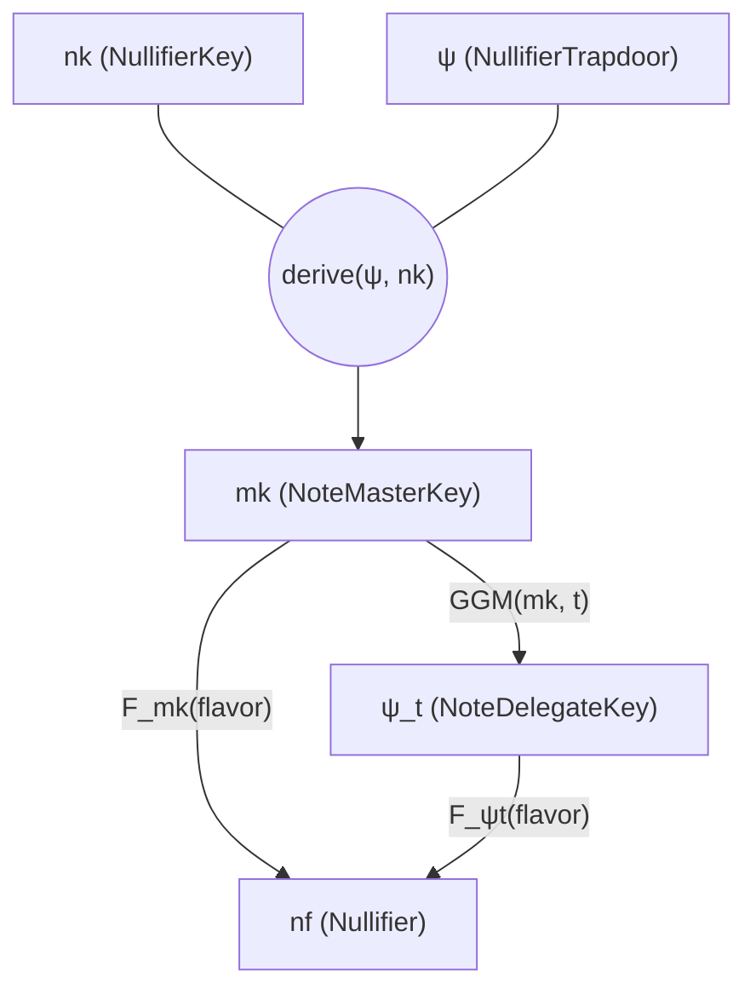

# Notes

Tachyon notes are simpler than Orchard's. Recall that Orchard notes are:

$$(d, \mathsf{pk_d}, v, \rho, \psi, \mathsf{rcm})$$

Tachyon removes $d$ (no diversified addresses), substitutes $\mathsf{pk_d}$ with $\mathsf{pk}$, and removes $\rho$ (no faerie gold defense needed). The result:

$$(\mathsf{pk}, v, \Psi, \mathsf{rcm})$$

| Field | Type | Description |
| ----- | ---- | ----------- |
| $\mathsf{pk}$ | $\mathbb{F}_p$ | Recipient's payment key |
| $v$ | integer | Note value ($< 2.1 \times 10^{15}$ zatoshis) |
| $\Psi$ | $\mathbb{F}_p$ | Nullifier trapdoor (user-controlled) |
| $\mathsf{rcm}$ | $\mathbb{F}_q$ | Commitment randomness |

Both $\Psi$ and $\mathsf{rcm}$ can be derived from a shared key negotiated through the out-of-band payment protocol. This means the sender and recipient need only exchange $\mathsf{pk}$ and $v$ explicitly — the note randomness can be deterministic from a shared secret.

## Nullifier Derivation

Tachyon's nullifier construction is significantly simpler than Orchard's:[^orchard-nf]

$$\mathsf{nf} = F_{\mathsf{nk}}(\Psi \| \text{flavor})$$

where $F$ is a keyed PRF (Poseidon), $\Psi$ is the nullifier trapdoor, and flavor is the epoch.

[^orchard-nf]: Orchard uses $\mathsf{nf} = \text{Extract}((F_{\mathsf{nk}}(\rho) + \psi \bmod p) \cdot \mathcal{G} + \mathsf{cm})$. The complexity defended against faerie gold attacks and made weak assumptions about circuit-efficient PRFs. See the [Orchard book](https://zcash.github.io/orchard/design/nullifiers.html) for the full explanation.

### Epoch flavoring

The same note spent in different epochs produces different nullifiers. This is essential for oblivious synchronization — consensus validators only need to retain the last $k$ blocks worth of nullifiers, and users must prove their notes were spendable up to a recent point in history.

### Oblivious sync delegation

The master root key $\mathsf{mk} = \text{KDF}(\Psi, \mathsf{nk})$ seeds a GGM (Goldreich-Goldwasser-Micali) tree PRF. Prefix keys $\Psi_t$ permit evaluating the PRF only for epochs $e \leq t$, enabling range-restricted delegation to an untrusted service (OSS) for non-inclusion proving without revealing spend capability.

| Key | Rust type | Holder | Capability |
| --- | --------- | ------ | ---------- |
| $\mathsf{mk}$ | `NoteMasterKey` | User device | Derive nullifiers for any epoch; derive delegate keys |
| $\Psi_t$ | `NoteDelegateKey` | OSS | Derive nullifiers for epochs $e \leq t$ only |

$\mathsf{mk}$ is ephemeral — the user device derives it from $(\mathsf{nk}, \Psi)$ when needed, never stores or transmits it. The OSS receives only delegate keys, which cannot recover $\mathsf{mk}$ or $\mathsf{nk}$.
