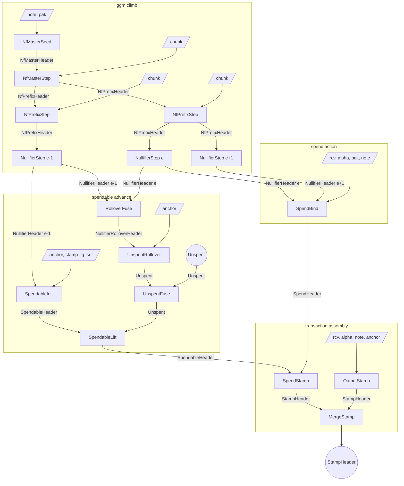
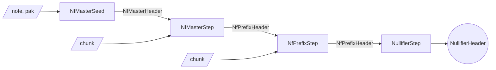
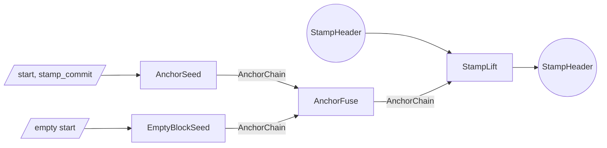
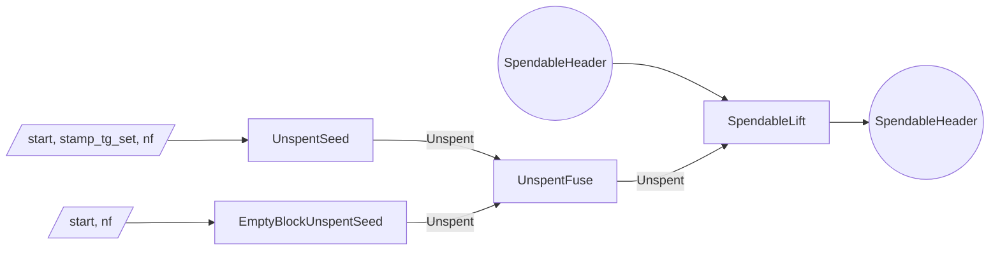
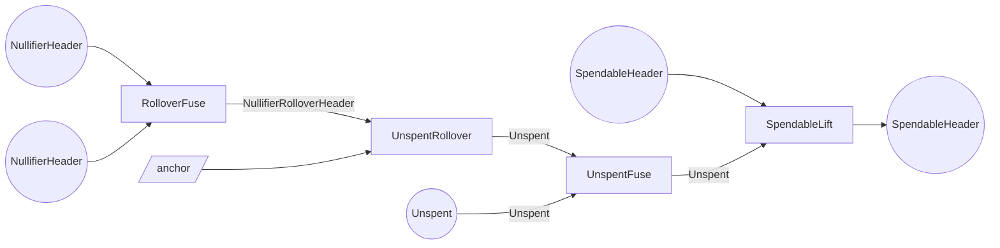

# Proof tree

The Tachyon proof tree is a graph of proof steps.
Each step accepts arbitrary witness inputs and up to two PCD inputs, performs computations and checks constraints, and emits a new PCD.

Multiple parties execute the proof tree.

- A **wallet** holds note data and keys
- A **sync service** holds delegate key material and pool state proofs
- A **aggregator** merges stamps for pool efficiency

## Lifecycle

A note is essentially created when the wallet runs `SpendableInit`.
The step takes the wallet's `NullifierHeader` for the creation epoch, a pre-stamp anchor, and the tachygram set of the stamp that produced the note; it checks the note's commitment[^notes] is among those tachygrams and advances the anchor through the stamp.
The output is a `SpendableHeader` carrying the nullifier and the post-stamp anchor.

Maintaining the spendable means advancing its anchor forward over `Unspent` segments.
`SpendableLift` consumes one `Unspent` whose start nullifier matches the spendable's and whose start anchor matches the spendable's current anchor, producing a fresh `SpendableHeader` at the segment's end and adopting the segment's end nullifier (which differs from the start only when the segment crossed an epoch boundary).
Each `UnspentSeed` link absorbs one stamp and proves the spendable's nullifier was absent from that stamp's tachygram set[^tachygrams]; `EmptyBlockUnspentSeed` covers empty blocks; `UnspentFuse` composes adjacent segments.
The sync service produces the `Unspent` segments and may perform lifts on the wallet's behalf.

Crossing an epoch boundary happens inside the `Unspent` lineage, so a single segment can span the boundary.
`RolloverFuse` consumes two consecutive-epoch `NullifierHeader`s that share a note commitment and emits a `NullifierRolloverHeader`.
`DelegateRolloverFuse` is the sync-service analog, fusing two `DelegateNullifierHeader`s by `delegation_id` equality; the resulting `NullifierRolloverHeader` is the same shape either way.
`UnspentRollover` consumes that rollover header and emits a zero-stamp `Unspent` segment that applies the cross-epoch anchor advance and rotates the exclusion nullifier from the old epoch's to the new epoch's.
Fusing the prior-epoch and new-epoch segments onto it with `UnspentFuse` yields one `Unspent` spanning the boundary, which `SpendableLift` then consumes exactly as it consumes an intra-epoch one.

To spend, the wallet derives two `NullifierHeader`s (for the present epoch and the next) by running the GGM walk[^nullifiers] twice on the same note.
`SpendBind` fuses these two leaves, checks that the witnessed note's commitment[^notes] matches the commitment carried on each, and emits a `SpendHeader` containing the value commitment, action verification key, and both nullifiers.
`SpendStamp` then fuses that `SpendHeader` with a current-epoch `SpendableHeader`, checks that the present-epoch nullifier matches the spendable's, derives the action digest from the SpendHeader's value commitment and verification key, and emits a `StampHeader` whose tachygram set contains both nullifiers and whose anchor is the spendable's.

An output operation runs `OutputStamp` directly.
The step witnesses the new note, value-randomness, action-randomness, and an anchor; the wallet typically anchors each output at the same height as the transaction's spends so the merge can proceed without an intervening lift.
The resulting `StampHeader` is a single-action stamp committing to the new note's commitment as its sole tachygram.

A transaction with multiple spend and output stamps composes them with `MergeStamp`.
The output is a single `StampHeader` whose multisets are the union of the two inputs' at the shared anchor.

After the transaction stamp is fully composed, the wallet may run `StampLift` over an `AnchorChain` segment to advance the stamp's anchor toward the present tip before publication.

On publication the bundle carries the action descriptors, tachygrams, anchor, and the stamp proof.

Validators reconstruct the action-set and tachygram-set commitments from those published bundles, checks the proof against the reconstructed values, and confirms the anchor against the consensus chain.

After publication, an aggregator combines `StampHeader`s from independently-proven bundles into a single **aggregate**[^aggregation] whose proof can stand in for many transactions' worth of stamps, cutting per-transaction verification cost downstream.
Each input is anchored at whatever height its wallet chose, so the aggregator obtains an `AnchorChain` segment per input and runs `StampLift` to bring every input onto a common later anchor.
`MergeStamp` then fuses the aligned stamps pairwise into a single `StampHeader` whose multisets are the union of all the inputs'.
The aggregated stamp has the same shape as any other, so it is itself eligible for further aggregation; aggregators stack to fold many published transactions into one stamp, and miners typically integrate the aggregator role into block production.

## Roles

The wallet runs every step that touches the note's commitment or master key.
It seeds and walks the private GGM tree (`NfMasterSeed`, `NfMasterStep`, `NfPrefixStep`, `NullifierStep`), produces blinded handoffs for the sync service (`DelegationStep`), fuses leaves across an epoch boundary (`RolloverFuse`), derives spendable status from its own leaf (`SpendableInit`), and produces spend and output stamps (`SpendBind`, `OutputStamp`, `SpendStamp`).

The sync service holds a `DelegateNfPrefixHeader` produced by the wallet at delegation time.
From there it climbs the blinded subtree (`DelegateNfPrefixStep`) to whichever leaf an epoch requires and emits a `DelegateNullifierHeader` (`DelegateNullifierStep`); it fuses two consecutive-epoch leaves with `DelegateRolloverFuse` when an epoch boundary is approached.
It produces the `Unspent` segments that carry the spendable forward (`UnspentSeed`, `EmptyBlockUnspentSeed`, `UnspentFuse`, and `UnspentRollover` to cross a boundary), and runs the lifts that consume them (`SpendableLift`).

The aggregator works only with published `StampHeader`s.
It aligns anchors with `StampLift` over `AnchorChain` segments (`AnchorSeed`, `EmptyBlockSeed`, `AnchorFuse`) and fuses with `MergeStamp`.

| step | wallet | sync service | aggregator |
| ---- | ------ | ------------ | ---------- |
| AnchorSeed | possible | yes | yes |
| EmptyBlockSeed | possible | yes | yes |
| AnchorFuse | possible | yes | yes |
| UnspentSeed | possible | yes | no |
| EmptyBlockUnspentSeed | possible | yes | no |
| UnspentFuse | possible | yes | no |
| UnspentRollover | possible | yes | no |
| NfMasterSeed | yes | no | no |
| NfMasterStep | yes | no | no |
| NfPrefixStep | yes | no | no |
| NullifierStep | yes | no | no |
| DelegationStep | yes | no | no |
| DelegateNfPrefixStep | possible | yes | no |
| DelegateNullifierStep | possible | yes | no |
| RolloverFuse | yes | no | no |
| DelegateRolloverFuse | no | yes | no |
| SpendableInit | yes | no | no |
| SpendableLift | yes | possible | no |
| SpendBind | yes | no | no |
| OutputStamp | yes | no | no |
| SpendStamp | yes | no | no |
| MergeStamp | yes | no | yes |
| StampLift | yes | possible | yes |

## Soundness

The subsections below walk each subtree bottom-up: the derivations and chain segments that act as primitives, then the spendable maintenance that consumes them, then spend binding, then stamps.

### Nullifier derivation

`NfMasterSeed` constructs the GGM[^nullifiers] root from the witnessed note's nullifier trapdoor and the wallet's nullifier key, with constraints rejecting zero or over-range note values and requiring the note's payment key to match the witnessed key material[^keys].
`NfMasterStep` and `NfPrefixStep` advance the walk one chunk per step, accumulating into a `NfPrefixHeader` that carries the prefix key alongside the master key and the note's commitment.
`NullifierStep` terminates the walk at the leaf depth and emits a `NullifierHeader` whose epoch is fixed by the path the walk took.

### Delegation

`DelegationStep` replaces the master-key and commitment lineage of a private prefix header with an opaque delegation identifier, computed as a Poseidon binding of the master key, the commitment, and a fresh per-delegation trapdoor.
`DelegateNfPrefixStep` continues the GGM walk[^nullifiers] one chunk per step under that blinded identity; `DelegateNullifierStep` terminates at the leaf and emits a `DelegateNullifierHeader`.
The delegate already holds the cryptographic material to climb any leaf below the prefix key, so the blinded walk constrains which leaf was reached, not which leaves were reachable.
A fresh trapdoor per delegation makes the delegation identifier unlinkable across delegations of the same note, and the delegate cannot recover the master key or the note's commitment from the blinded header.

### Anchor segments

`AnchorSeed`, `EmptyBlockSeed`, `UnspentSeed`, and `EmptyBlockUnspentSeed` each witness a starting anchor and prove one anchor step.
`AnchorFuse` and `UnspentFuse` compose adjacent segments by checking endpoint equality.
A segment ties to real chain history only when a stamp-emitting step consumes it and the resulting stamp's anchor matches a consensus-published end-of-block value.

### Spendable lifecycle

A spendable bootstraps at `SpendableInit`, which fuses the wallet's `NullifierHeader` with a pre-stamp anchor and the tachygram set of the stamp that produced the note, verifies the note's commitment[^notes] is among those tachygrams, and advances the anchor through that stamp.
`SpendableLift` advances the spendable's anchor further by consuming an `Unspent` segment whose start nullifier equals the spendable's and whose start anchor matches the spendable's current anchor; the spendable adopts the segment's end nullifier and end anchor.
An `Unspent` carries the nullifier excluded at its start and the one at its end; the two are equal within an epoch and differ only when the segment crosses a boundary.
Each `UnspentSeed` link absorbs one stamp into the anchor and proves the spendable's nullifier is absent from that stamp's tachygram set[^tachygrams]; `EmptyBlockUnspentSeed` skips the absence check (no tachygrams to scan); `UnspentFuse` requires the left segment's end nullifier to equal the right's start nullifier and the two to meet at a common anchor.

### Epoch rollover

Crossing a boundary is handled within the `Unspent` lineage, so one segment can span it.
`RolloverFuse` consumes two consecutive-epoch `NullifierHeader`s, checks they share a note commitment, and emits a `NullifierRolloverHeader`.
`DelegateRolloverFuse` is the sync-service analog, fusing two `DelegateNullifierHeader`s by `delegation_id` equality; the resulting `NullifierRolloverHeader` is the same shape either way.
`UnspentRollover` consumes that rollover header, witnesses the pre-boundary anchor, and emits a zero-stamp `Unspent` segment that applies the cross-epoch anchor advance and rotates the exclusion nullifier from old to new.
`UnspentFuse` then composes the prior-epoch and new-epoch segments around it into one boundary-spanning `Unspent`, which an ordinary `SpendableLift` consumes.
The cross-epoch anchor advance is the only such transition in the proof tree; same-epoch advances always run through `AnchorChain` or `Unspent` segments, and only `UnspentRollover` emits the boundary step.

### Spend binding

Spending a note publishes two nullifiers, one for the current epoch and one for the next.
Both leaves come from the same note's GGM tree[^nullifiers], and `SpendBind` ties them together by checking that the witnessed note's commitment[^notes] equals the commitment carried on each input.
The value commitment and action verification key are derived at `SpendBind` from the witnessed note and key material[^keys]; the action digest is derived downstream at `SpendStamp` from those two values, so that `SpendBind` stays within its per-step gate budget.
Publishing both nullifiers lets consensus apply the spend across an epoch transition that may occur between proof construction and inclusion.

### Stamp construction

A stamp commits to two multisets, an action-digest set and a tachygram set[^tachygrams].
`OutputStamp` derives a value commitment, action verification key, and action digest from a witnessed note, value-randomness, and action-randomness; constraints reject zero or over-range note values and require the note's payment key to match the witnessed key material[^keys].
`SpendStamp` consumes a `SpendHeader` (carrying value commitment, action verification key, and two nullifiers) and a `SpendableHeader` (already anchor-bound), checks the spend's present-epoch nullifier equals the spendable's, derives the action digest from the SpendHeader's value commitment and verification key, and emits a stamp whose action digest, two-nullifier tachygram set, and threaded anchor follow from that constraint.
`MergeStamp` fuses two stamps by checking anchor equality and unioning their commitments through witnessed multiset gadgets.

### Stamp anchor

`OutputStamp` is the only stamp-producing step that takes an anchor as direct witness: an output operation has no prior chain state to thread from.
The other stamp-producing steps thread the anchor from a validated spendable (`SpendStamp`), equality-constrain the two inputs' anchors (`MergeStamp`), or advance over an `AnchorChain` segment whose start matches the stamp's prior anchor (`StampLift`).
Consensus verifies the published anchor against the chain before accepting the stamp.

## Simple transaction

A transaction with one spend and one output, where the spendable was bootstrapped in the previous epoch and rolled over to the spend epoch before being consumed.

`s_prefix_old` and `s_prefix` each collapse a chain of `NfPrefixStep`s walking the GGM tree[^nullifiers] to a leaf; they branch after `s_first_m` to reach the creation-epoch leaf and the spend-epoch leaves respectively.
`NullifierHeader e` is consumed twice: once by `RolloverFuse` to advance the spendable across the boundary, and once by `SpendBind` as the spend's present-epoch nullifier.

## Focused subgraphs

### GGM nullifier derivation

`NfPrefixStep` repeats once per remaining GGM depth.

A sync-service variant inserts `DelegationStep` at the handoff depth (consuming an `NfPrefixHeader` and witnessing a per-delegation trapdoor), producing a `DelegateNfPrefixHeader` that the sync service climbs with `DelegateNfPrefixStep` and terminates with `DelegateNullifierStep`; the resulting `DelegateNullifierHeader` carries an opaque `delegation_id` in place of the private master-key and commitment lineage.

### Stamp anchor advance

### Spendable advance over an Unspent span

### Epoch rollover

A sync-service variant substitutes `DelegateRolloverFuse` (consuming two `DelegateNullifierHeader`s) for `RolloverFuse`; the resulting `NullifierRolloverHeader` is identical, so the downstream `UnspentRollover`, fuse, and lift are unchanged.

## Headers

| Header | Fields |
| ------ | ------ |
| AnchorChain | (prev_anchor, end_anchor) |
| Unspent | (start_nf, end_nf, start_anchor, end_anchor) |
| NfMasterHeader | (mk, cm) |
| NfPrefixHeader | (prefix{key, depth, index}, mk, cm) |
| NullifierHeader | (cm, nf, epoch) |
| DelegateNfPrefixHeader | (prefix{key, depth, index}, delegation_id) |
| DelegateNullifierHeader | (nf, epoch, delegation_id) |
| NullifierRolloverHeader | (old_nf, new_nf, new_epoch) |
| SpendableHeader | (nf, anchor) |
| SpendHeader | (cv, rk, present_nf, future_nf) |
| StampHeader | (action_acc, tachygram_acc, anchor) |

## Steps

| Step | Left | Right | Witness | Output |
| ---- | ---- | ----- | ------- | ------ |
| AnchorSeed | — | — | start, stamp_commit | AnchorChain |
| EmptyBlockSeed | — | — | start | AnchorChain |
| AnchorFuse | AnchorChain | AnchorChain | — | AnchorChain |
| UnspentSeed | — | — | start, stamp_tg_set, nf | Unspent |
| EmptyBlockUnspentSeed | — | — | start, nf | Unspent |
| UnspentFuse | Unspent | Unspent | — | Unspent |
| UnspentRollover | NullifierRolloverHeader | — | start | Unspent |
| NfMasterSeed | — | — | note, pak | NfMasterHeader |
| NfMasterStep | NfMasterHeader | — | chunk | NfPrefixHeader |
| NfPrefixStep | NfPrefixHeader | — | chunk | NfPrefixHeader |
| NullifierStep | NfPrefixHeader | — | — | NullifierHeader |
| DelegationStep | NfPrefixHeader | — | trapdoor | DelegateNfPrefixHeader |
| DelegateNfPrefixStep | DelegateNfPrefixHeader | — | chunk | DelegateNfPrefixHeader |
| DelegateNullifierStep | DelegateNfPrefixHeader | — | — | DelegateNullifierHeader |
| RolloverFuse | NullifierHeader | NullifierHeader | — | NullifierRolloverHeader |
| DelegateRolloverFuse | DelegateNullifierHeader | DelegateNullifierHeader | — | NullifierRolloverHeader |
| SpendableInit | NullifierHeader | — | anchor, stamp_tg_set | SpendableHeader |
| SpendableLift | SpendableHeader | Unspent | — | SpendableHeader |
| SpendBind | NullifierHeader | NullifierHeader | rcv, alpha, pak, note | SpendHeader |
| OutputStamp | — | — | rcv, alpha, note, anchor | StampHeader |
| SpendStamp | SpendHeader | SpendableHeader | — | StampHeader |
| MergeStamp | StampHeader | StampHeader | action gadgets, tachygram gadgets | StampHeader |
| StampLift | StampHeader | AnchorChain | — | StampHeader |

[^nullifiers]: See [Nullifiers](./nullifiers.md) for the GGM tree, the prefix walk, and the leaf wrap that produces a published nullifier.
[^tachygrams]: See [Tachygrams](./tachygrams.md) for the per-stamp multiset polynomial and its Pedersen commitment.
[^notes]: See [Notes](./notes.md) for the four-field note structure and its commitment.
[^keys]: See [Keys](./keys.md) for the wallet key hierarchy and the per-action derivations.
[^aggregation]: See [Aggregation](./aggregation.md) for the autonome/aggregate/adjunct lifecycle and the miner-side stripping that realizes the chain-cost reduction.
