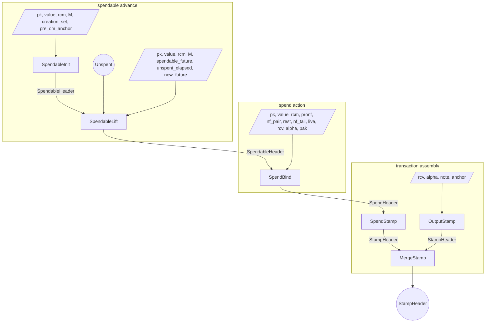
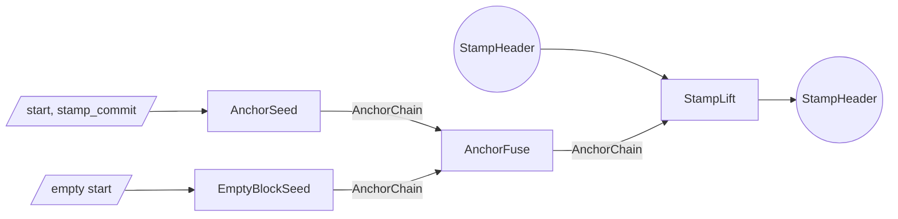
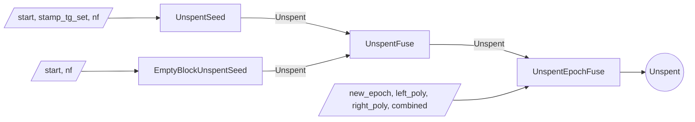
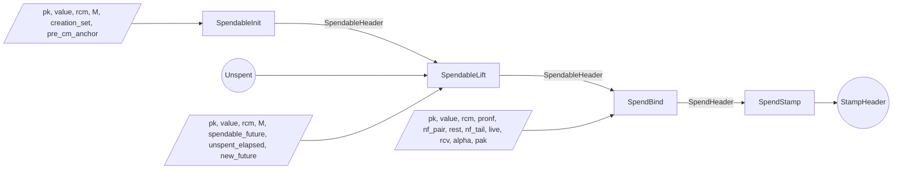

# Proof tree

The Tachyon proof tree is a graph of proof steps.
Each step accepts arbitrary witness inputs and up to two PCD inputs, performs computations and checks constraints, and emits a new PCD.

Multiple parties execute the proof tree.

- A **wallet** holds note data, keys, and the note's pronullifier polynomial
- A **sync service** holds nullifier values shared by the wallet and pool state proofs
- An **aggregator** merges stamps for pool efficiency

## Lifecycle

A spendable starts when `SpendableInit` seeds it.
The step is a wallet-only seed: it witnesses the note's non-psi fields (`pk`, `value`, `rcm`), the note's pronullifier polynomial $M$, the creation stamp's tachygrams, and the anchor running into the creation stamp.
It derives `psi = commit(M)` and `cm = Poseidon(rcm, pk, value, psi)`, checks that `cm` is among the creation stamp's tachygrams[^tachygrams], and that the value is in range[^notes]; a wallet supplying an $M$ whose commit diverges from the note's `psi` yields a divergent derived `cm` that fails the in-set check.
It emits a `SpendableHeader` carrying `future` and the spendable's anchor.
The `future` is the homomorphic cm-shift then cm-trapdoor of `psi`: a commitment to the nullifier polynomial $N$ blinded with `cm`[^nullifiers].
The anchor is set initially to the position immediately after the creation stamp and advanced by each lift.

Maintaining the spendable means advancing its anchor forward over `Unspent` segments.
The sync service produces `Unspent` segments without ever holding the note's commitment, polynomial, or `psi`.
`UnspentSeed` absorbs one stamp and proves a wallet-supplied nullifier was absent from that stamp's tachygram set; the resulting `Unspent` has crossed no epoch boundary, so its `elapsed` is empty and it records that nullifier as its in-progress tip, `present_nf`.
`EmptyBlockUnspentSeed` covers empty blocks.
`UnspentFuse` composes adjacent same-epoch segments: it extends coverage within one epoch, so the forward half must have crossed no boundary and both halves must share the same `present_nf`.
`UnspentEpochFuse` crosses an epoch boundary: it advances the anchor across the boundary and splices the left half's completing tip into `elapsed`, so `elapsed_size` grows by exactly one per crossing while `present_nf` becomes the right half's tip.

`SpendableLift` is wallet-only: it consumes one composed `Unspent` whose start matches the spendable's current anchor, and witnesses the note's non-psi fields and $M$ (from which it derives `cm`, never witnessed naked), the spendable's remaining nullifier polynomial (carrying $N$'s coefficients $N_{c+i}$), the `Unspent`'s `elapsed` nullifiers, and the unconsumed tail.
It verifies the cm-trapdoored commit, shrinks `future` by the `Unspent`'s `elapsed_size` (the number of boundary crossings the segment spanned), and produces a fresh `SpendableHeader` whose `future` is the trapdoored commit of the unconsumed tail.
A required tip-tie attributes the `Unspent`'s in-progress nullifier `present_nf` to the new `future`'s leading coefficient.
A single lift can consume an arbitrarily long composed `Unspent`, including one that crosses many epoch boundaries.

To spend, the wallet runs `SpendBind`.
It consumes a `SpendableHeader` and witnesses the note's non-psi fields, its full pronullifier polynomial $M$ as `pronf` (`cm` is derived from the preimage, not witnessed), the live nullifier pair `nf_pair`, the tail `rest` after it, the concatenation `nf_tail = nf_pair ++ rest`, and the two live pronullifiers $(M_e, M_{e+1})$ as scalars.
It derives `psi = commit(M)` from `pronf` and `cm = Poseidon(rcm, pk, value, psi)` from the preimage, tying `cm` and the published nullifiers to `value` and `pk`.
It checks value and payment-key consistency. The witnessed `nf_pair` is bound to the rank-2 reference commitment $[N_e]\,G_0 + [N_{e+1}]\,G_1$ of the two published nullifiers (two generator scalar muls, never a fabricated polynomial), so it carries no coefficient past degree 1, and `nf_tail = nf_pair ++ rest`, at the constant offset 2, is bound to `future.unblind(cm)`. By Pedersen independence that match forces the same `cm` that bootstrapped the spendable and pins the tail to the lineage.
There is no separate $N$-reassembly: `future` already is this note's re-based $N$, so the tail match ties `nf_tail` to the genuine suffix and `cm` to its trapdoor, and the published pair $N_e = M_e + \mathsf{cm}$, $N_{e+1} = M_{e+1} + \mathsf{cm}$ follows from the rank-2 binding of `nf_pair` to the witnessed scalars. Each pronullifier must be nonzero, or a published nullifier would equal `cm` and collide with the note's own commitment in the tachygram scan; the published next nullifier must be nonzero too, since `nf_pair`'s length is not pinned and a rank-1 pair could otherwise forge it to 0 (hiding the real next nullifier and defeating the two-epoch double-spend scan).
The output `SpendHeader` carries the value commitment, action verification key, the two nullifiers, and the threaded anchor.

`SpendStamp` consumes that `SpendHeader`, derives the action digest from its value commitment and verification key, and emits a `StampHeader` whose tachygram set contains both nullifiers and whose anchor is threaded from the spend.

An output operation runs `OutputStamp` directly.
The step witnesses the new note, value-randomness, action-randomness, and an anchor; the wallet typically anchors each output at the same height as the transaction's spends so the merge can proceed without an intervening lift.
The resulting `StampHeader` is a single-action stamp committing to the new note's commitment as its sole tachygram.

A transaction with multiple spend and output stamps composes them with `MergeStamp`.
The output is a single `StampHeader` whose multisets are the union of the two inputs' at the shared anchor.

After the transaction stamp is fully composed, the wallet may run `StampLift` over an `AnchorChain` segment to advance the stamp's anchor toward the present tip before publication.

On publication the bundle carries the action descriptors, tachygrams, anchor, and the stamp proof.

Validators reconstruct the action-set and tachygram-set commitments from those published bundles, checks the proof against the reconstructed values, and confirms the anchor against the consensus chain.

After publication, an aggregator combines `StampHeader`s from independently-proven bundles into a single **aggregate**[^aggregation] whose proof can stand in for many transactions' worth of stamps, cutting per-transaction verification cost downstream.
Each input is anchored at whatever height its wallet chose, so the aggregator obtains an `AnchorChain` segment per input and runs `StampLift` to bring every input onto a common later anchor.
`MergeStamp` then fuses the aligned stamps pairwise into a single `StampHeader` whose multisets are the union of all the inputs'.
The aggregated stamp has the same shape as any other, so it is itself eligible for further aggregation; aggregators stack to fold many published transactions into one stamp, and miners typically integrate the aggregator role into block production.

## Roles

The wallet runs every step that touches the note's commitment or pronullifier polynomial.
It seeds and advances the spendable lineage (`SpendableInit`, `SpendableLift`) and produces spend and output stamps (`SpendBind`, `OutputStamp`, `SpendStamp`).
Verifying the spendable's cm-trapdoored `future` requires the note's `cm` as a witness, which is why `SpendableLift` is wallet-only.

The sync service holds the per-epoch nullifier values the wallet shared, indexed by relative epoch from inclusion, and pool history.
It composes `Unspent` segments (`UnspentSeed`, `EmptyBlockUnspentSeed`, `UnspentFuse`, `UnspentEpochFuse`) across stamps and epochs and hands the composed segment to the wallet for the lift.
It cannot run `SpendableLift` or `SpendBind`, which require `cm`.

The aggregator works only with published `StampHeader`s.
It aligns anchors with `StampLift` over `AnchorChain` segments (`AnchorSeed`, `EmptyBlockSeed`, `AnchorFuse`) and fuses with `MergeStamp`.

| step | wallet | sync service | aggregator |
| ---- | ------ | ------------ | ---------- |
| AnchorSeed | possible | yes | yes |
| EmptyBlockSeed | possible | yes | yes |
| AnchorFuse | possible | yes | yes |
| UnspentSeed | possible | yes | no |
| EmptyBlockUnspentSeed | possible | yes | no |
| UnspentFuse | possible | yes | no |
| UnspentEpochFuse | possible | yes | no |
| SpendableInit | yes | no | no |
| SpendableLift | yes | no | no |
| OutputStamp | yes | no | no |
| SpendBind | yes | no | no |
| SpendStamp | yes | no | no |
| MergeStamp | yes | no | yes |
| StampLift | yes | possible | yes |

## Soundness

The subsections below walk each subtree bottom-up: the chain segments that act as primitives, then the `Unspent` segments that consume them, then the spendable lineage, then spend binding and stamps.

### Anchor segments

`AnchorSeed`, `EmptyBlockSeed`, `UnspentSeed`, and `EmptyBlockUnspentSeed` each witness a starting anchor and prove one anchor step.
`AnchorFuse` and `UnspentFuse` compose adjacent segments by checking endpoint equality.
A segment ties to real chain history only when a stamp-emitting step consumes it and the resulting stamp's anchor matches a consensus-published end-of-block value.

### Unspent composition

An `Unspent` carries `elapsed` (one nullifier coefficient per epoch-boundary crossing in its span, in forward-chronological order), the crossing count `elapsed_size`, a starting anchor, an ending anchor, and its in-progress tip nullifier `present_nf`[^nullifiers].
`UnspentSeed` and `EmptyBlockUnspentSeed` produce within-epoch `Unspent`s for one stamp's worth of anchor advance: `elapsed` is empty, `elapsed_size` is zero, and the nullifier they just non-membership-checked is recorded as `present_nf`.
`UnspentFuse` composes two same-epoch halves: it requires the forward half to have crossed no boundary (empty `elapsed`) and both halves to share `present_nf`; the anchor adjacency check welds the segments together.
`UnspentEpochFuse` crosses an epoch boundary: it witnesses the two halves' nullifier polynomials and the combined result, advances the anchor via the cross-epoch domain, and splices the left half's completing tip between them.
Writing $s$ for the left crossing count `elapsed_size` and $p$ for the left tip `present_nf`, the splice confirms

$$C(X) = L(X) + X^{s}\,p + X^{s+1}\,R(X)$$

for the witnessed `combined` $C$, left $L$, and right $R$, checked at a Fiat-Shamir challenge.
The scalar $p$ is the left header's value, bound by the recursive verification of the left PCD before the challenge; because the identity is linear in $p$, that prior binding is what makes the splice sound (a freely-chosen $p$ could otherwise be solved to fit any $C$).
The output `elapsed_size` becomes $s + 1 + s'$ for the right crossing count $s'$, and the new `present_nf` is the right half's tip.

### Spendable lineage

`SpendableInit` is the lineage's only seed and is wallet-only.
It witnesses the note's non-psi fields (`pk`, `value`, `rcm`), the unshifted pronullifier polynomial $M$, the creation stamp's tachygrams, and the anchor running into the creation stamp.
It derives `psi = commit(M)` and `cm = Poseidon(rcm, pk, value, psi)`, binds the note to the pool (`cm` in `creation_set`), and produces the spendable's initial `future` by the homomorphic cm-shift then cm-trapdoor of `psi`, at one scalar mul plus one point add against a precomputed basis.
That `future` is the commitment to the nullifier polynomial $N$ blinded with `cm`[^nullifiers].
It emits `SpendableHeader(future, anchor)`; the fields, $M$, `cm`, derived `psi`, and creation_set are all dropped from the output.

`SpendableLift` shrinks `future` by an `Unspent`'s crossings.
It witnesses the note's non-psi fields and $M$ (deriving `cm` from them, never witnessed naked), the spendable's current nullifier polynomial (carrying $N$'s coefficients $N_{c+i}$ from the running consumed offset $c$), the `Unspent`'s `elapsed` nullifiers, and the unconsumed tail.
It verifies the cm-trapdoor identity (`spendable_future.commit().blind(cm) == future`), the `Unspent`'s `elapsed` commit, and anchor adjacency; the commitment bindings then force the witnessed coefficients to match the chain.
It confirms the consumed range is the low-degree prefix of the future at offset $s = $ `elapsed_size`,

$$\sum_i N_{c+i}\,X^i = E(X) + X^{s} \sum_i N_{c+s+i}\,X^i,$$

for the `Unspent`'s `elapsed` polynomial $E$, and re-trapdoors the new commit with the same `cm`.
A required tip-tie binds the in-progress nullifier to the carried-forward present epoch, `present_nf = new_future(0)`, closing the partial-tip-epoch gap.
Pedersen independence chains the trapdoor invariant across successive lifts: the `cm` derived at any lift must be the same `cm` from the seed, or the identity fails.

### Spend binding

Spending a note publishes two nullifiers, one for the current epoch and one for the next, both pinned by the spendable's `future` to the same nullifier polynomial $N$.
`SpendBind` witnesses `(pk, value, rcm, pronf, nf_pair, rest, nf_tail, live, rcv, alpha, pak)`, with `live` the live pronullifier pair $(M_e, M_{e+1})$. It derives `psi = commit(M)` from the full pronullifier polynomial `pronf` and `cm = Poseidon(rcm, pk, value, psi)` from the preimage (not witnessed).
It then publishes the spend pair. The two live pronullifiers shift up by `cm` to the published nullifiers; the witnessed `nf_pair` is bound to equal their rank-2 reference commitment $[N_e]\,G_0 + [N_{e+1}]\,G_1$ (two generator scalar muls, not a fabricated polynomial), so by Pedersen binding it carries no coefficient past degree 1. The tail `nf_tail = nf_pair ++ rest`, at the constant offset 2, is bound to `future.unblind(cm)`: removing the `cm` blind from the header's `future` recovers the lineage's committed nullifier suffix, and matching it (by Pedersen independence, $G$ independent of $H$) pins `nf_tail` to that suffix and `cm` to the lineage. There is no $N$-reassembly: `future` already is this note's re-based $N$, maintained by each sound `SpendableLift`, so the tail match alone ties `nf_tail` to the genuine suffix; `psi` is derived only as the `cm` preimage and is never shifted. Each pronullifier must be nonzero (else $N_e = \mathsf{cm}$, colliding with the note's own commitment in the tachygram scan), and the published next nullifier must be nonzero: `nf_pair`'s length is not pinned by its commit, so a rank-1 pair could otherwise forge `next_nf` to 0 and hide the real one, defeating the two-epoch scan.
The value commitment and action verification key are derived from the witnessed fields and key material[^keys]; the action digest is derived downstream at `SpendStamp`, so that `SpendBind` stays within its per-step gate budget.
The `cm` derivation and the `future` comparison pin `cm` two independent ways: the derivation ties `cm` to the preimage by Poseidon (the spender must know `rcm`, `pk`, `value`, `M`), the comparison ties it to the spendable's lineage by Pedersen independence (the same tail and `cm` must be the spendable's own). Poseidon collision-resistance then pins $M$ and `value` to the real note, binding the action's value commitment to the note being spent[^notes].
Publishing both nullifiers lets consensus apply the spend across an epoch transition that may occur between proof construction and inclusion.

The note's age never becomes public. The lineage re-bases `future` to degree 0 at each lift, so `SpendBind` holds only the re-based suffix and the published pair sits at the constant offsets 0 and 1; there is no consumed-offset witness to leak. `SpendBind` is also an intermediate step, its `SpendHeader` output consumed by `SpendStamp`, so $M$ and the tail never propagate. The pair's own shift is the constant 2, so no step reads a length.

Why witness the whole tail, rather than just the two published nullifiers? Each nullifier is one coefficient of the polynomial `future` commits to, and a Pedersen commitment does not let you read a coefficient back out. To pin the two published values to `future`, the step must hold the tail polynomial itself. Two shorter-witness attempts fail:

- Re-deriving the pair from `future` by commitment arithmetic pins nothing: `future` already contains those coefficients, so the witnessed copies cancel against them.
- Proving the pair is `future`'s low-degree prefix does pin them, but the proof is an opening of `future`, and producing that opening means holding its polynomial: the full tail again.

So the spend witnesses the tail in nullifier form, as `nf_pair` and `rest`, together with their concatenation `nf_tail`. A step cannot fabricate a polynomial, so each is witnessed (or produced by concatenating witnessed pieces); the pair is pinned by a rank-2 reference commitment, and `nf_tail` by matching `future.unblind(cm)` at the constant offset 2. No step recomputation reads a length.

### Stamp construction

A stamp commits to two multisets, an action-digest set and a tachygram set[^tachygrams].
`OutputStamp` derives a value commitment, action verification key, and action digest from a witnessed note, value-randomness, and action-randomness; constraints reject zero or over-range note values and require the note's payment key to match the witnessed key material[^keys].
`SpendStamp` consumes a `SpendHeader` (carrying value commitment, action verification key, two nullifiers, and anchor), derives the action digest from the value commitment and verification key, and emits a stamp whose action digest, two-nullifier tachygram set, and threaded anchor follow.
`MergeStamp` fuses two stamps by checking anchor equality and confirming each output set is the union of the two inputs': it witnesses the merged action-digest and tachygram sets and enforces, for each, that the merged set polynomial is the product of the input set polynomials.

### Stamp anchor

`OutputStamp` is the only stamp-producing step that takes an anchor as direct witness: an output operation has no prior chain state to thread from.
The other stamp-producing steps thread the anchor from a validated spendable through `SpendBind`/`SpendStamp`, equality-constrain the two inputs' anchors (`MergeStamp`), or advance over an `AnchorChain` segment whose start matches the stamp's prior anchor (`StampLift`).
Consensus verifies the published anchor against the chain before accepting the stamp.

## Simple transaction

A transaction with one spend and one output, where the spendable was bootstrapped in a previous epoch and consumed an `Unspent` crossing an epoch boundary before the spend.

The single `SpendableLift` consumes the composed `Unspent` (potentially crossing many epoch boundaries); the trapdoored `future` chains the lineage's binding to the note's `cm` through every shrink.

## Focused subgraphs

### Stamp anchor advance

### Unspent composition across epochs

### Spendable advance and spend

## Headers

| Header | Fields |
| ------ | ------ |
| AnchorChain | (prev_anchor, end_anchor) |
| Unspent | ((elapsed, elapsed_size), prev_anchor, end_anchor, present_nf) |
| SpendableHeader | (future, anchor) |
| SpendHeader | (cv, rk, (now_nf, next_nf), anchor) |
| StampHeader | (action_acc, tachygram_acc, anchor) |

## Steps

| Step | Left | Right | Witness | Output |
| ---- | ---- | ----- | ------- | ------ |
| AnchorSeed | — | — | start, stamp_commit | AnchorChain |
| EmptyBlockSeed | — | — | start | AnchorChain |
| AnchorFuse | AnchorChain | AnchorChain | — | AnchorChain |
| UnspentSeed | — | — | start, stamp_tg_set, nf | Unspent |
| EmptyBlockUnspentSeed | — | — | start, nf | Unspent |
| UnspentFuse | Unspent | Unspent | — | Unspent |
| UnspentEpochFuse | Unspent | Unspent | new_epoch, left_poly, right_poly, combined | Unspent |
| SpendableInit | — | — | pk, value, rcm, M, creation_set, pre_cm_anchor | SpendableHeader |
| SpendableLift | SpendableHeader | Unspent | pk, value, rcm, M, spendable_future, unspent_elapsed, new_future | SpendableHeader |
| OutputStamp | — | — | rcv, alpha, note, anchor | StampHeader |
| SpendBind | SpendableHeader | — | pk, value, rcm, pronf, nf_pair, rest, nf_tail, live, rcv, alpha, pak | SpendHeader |
| SpendStamp | SpendHeader | — | — | StampHeader |
| MergeStamp | StampHeader | StampHeader | action polys, tachygram polys | StampHeader |
| StampLift | StampHeader | AnchorChain | — | StampHeader |

[^nullifiers]: See [Nullifiers](./nullifiers.md) for the pronullifier polynomial, the cm-trapdoored spendable commit, and the prefix relation that shrinks it.
[^tachygrams]: See [Tachygrams](./tachygrams.md) for the per-stamp multiset polynomial and its Pedersen commitment.
[^notes]: See [Notes](./notes.md) for the four-field note structure and its commitment.
[^keys]: See [Keys](./keys.md) for the wallet key hierarchy and the per-action derivations.
[^aggregation]: See [Aggregation](./aggregation.md) for the autonome/aggregate/adjunct lifecycle and the miner-side stripping that realizes the chain-cost reduction.
