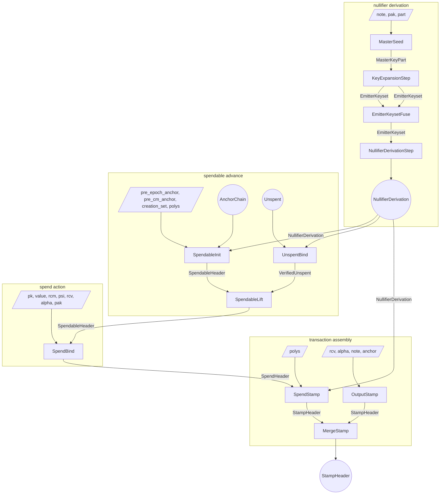
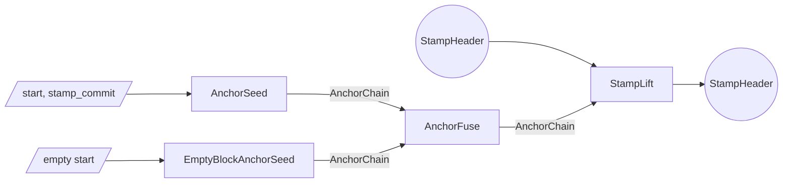
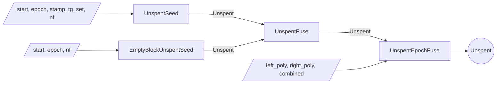

# Proof tree

The Tachyon proof tree is a graph of proof steps.
Each step accepts arbitrary witness inputs and up to two PCD inputs, performs computations and checks constraints, and emits a new PCD.

Multiple parties execute the proof tree.

- A **wallet** holds note data and keys
- A **sync service** holds nullifier values shared by the wallet and pool state proofs
- An **aggregator** merges stamps for pool efficiency

## Lifecycle

### Deriving nullifiers

A wallet certifies its note's nullifier derivation once; every later consumer re-evaluates queries against the certified commitments[^nullifiers].
`MasterSeed` witnesses the note, the proof-authorizing key `pak`, and a part index; it checks `note.pk == pak.derive_payment_key()` (which pins `nk`), derives that part of the master key `mk`, and emits a `MasterKeyPart` carrying the part's round keys, the part index, and the whole note (so the deferred `cm` can bind downstream). Two seeds cover the two `mk` parts.
`KeyExpansionStep` fuses the two `MasterKeyPart`s, concatenates them into the full `mk`, and proves one window of the key expansion as a committed cipher trace: the window's expansion outputs are committed as an eval-form part-key polynomial into that window's slot of a one-slot `EmitterKeyset`. Four invocations produce the four parts that interleave into the full schedule.
`EmitterKeysetFuse` merges disjoint keysets slot-wise, in any tree shape, while `mk` and the note are reconciled across every merge; each covered slot carries its part commitment at its schedule position.
`NullifierDerivationStep` consumes the single fully covered `EmitterKeyset`, matches each witnessed part polynomial's commitment against its slot (binding the whole ordered set of part commitments), computes the deferred `cm` from the fused note, and certifies the note's derivation polynomials against the schedule.
The result is a `NullifierDerivation` header carrying the derivation-polynomial commitments, a transcript digest over them, `cm`, and the query parameters, proving every future nullifier query reads the genuine derivation of the note identified by `cm`.
The derivation carries no offset origin: it is epoch-independent, a function of the note alone. Each consumer that needs the origin witnesses it locally.

### Bootstrapping a spendable

A spendable starts when `SpendableInit` fuses a boundary-rooted `AnchorChain` with the note's certified `NullifierDerivation`.
It witnesses `(pre_epoch_anchor, pre_cm_anchor, creation_set, polys, creation_epoch)`: it computes the creation-epoch nullifier in-circuit as the offset-zero query over the derivation polynomials (binding the witnessed polynomials to the certified commitments), takes `cm` from the derivation header, checks `cm` is among the creation stamp's tachygrams[^tachygrams], requires the chain to root at `pre_epoch_anchor.next_epoch(creation_epoch)`, requires the cm-stamp to be the chain's final link, and emits a `SpendableHeader` carrying `(cm, (present_epoch, present_nf), anchor, creation_epoch)`.
The witnessed `creation_epoch` is where the lineage's offset origin is fixed: rooting the chain at `next_epoch(creation_epoch)` pins it to the consensus epoch, since consensus anchor membership of the eventual spend anchor forces the boundary, and hence the creation epoch, to be real. Without it a note spent in its creation epoch crosses no boundary, leaving the origin a free witness.
The anchor is set initially to the position immediately after the creation stamp and advanced by each lift.

### Maintaining a spendable

Maintaining the spendable means advancing its anchor forward over `Unspent` segments while proving the crossed nullifiers absent.
The sync service produces `Unspent` segments without ever holding the note, its `cm`, or `psi`.
`UnspentSeed` absorbs one stamp at a given absolute epoch and proves a wallet-supplied nullifier was absent from that stamp's tachygram set; the resulting `Unspent` has crossed no epoch boundary, so its `elapsed` is empty and it records that nullifier as its in-progress tip `nf_end`.
`EmptyBlockUnspentSeed` covers empty blocks.
`UnspentFuse` composes adjacent same-epoch segments: the forward half must have crossed no boundary, and both halves must agree on the junction nullifier.
`UnspentEpochFuse` crosses an epoch boundary: it advances the anchor across the boundary and splices the left half's completing tip into `elapsed`, so the crossing count grows by exactly one while `nf_end` becomes the right half's tip.
An `Unspent` records its span as two absolute epoch endpoints, `epoch_start` and `epoch_end`; the crossing count is their difference.

`UnspentBind` binds a sync-built `Unspent` to genuine derivation. It is wallet-side: it consumes the `Unspent` and the note's certified `NullifierDerivation`, reconstructs the tested-value polynomial (the `elapsed` crossings followed by the tip nullifier), and proves every tested value is the note's genuine query with a homomorphic running-sum argument over the certified derivation polynomials, indexed by epoch offsets from a witnessed offset origin.
The origin is unconstrained here (the derivation carries none); it gains meaning only at `SpendableLift`, which reconciles it against the lineage's anchor-bound creation epoch.
It emits a `VerifiedUnspent` carrying the span's boundary nullifiers and anchors, the boundary epochs, the note's `cm`, and that witnessed origin.

`SpendableLift` is wallet-side and witness-free: it consumes a `SpendableHeader` and a `VerifiedUnspent`.
It checks the verified segment's `cm` equals the spendable's (so the absence-proven nullifiers are this note's, and the value cannot drift), the segment's witnessed offset origin equals the lineage's anchor-bound creation epoch (so the tested arc cannot be shifted), the segment's starting nullifier and epoch equal the spendable's `present_nf` and `present_epoch` (continuity), and the segment's starting anchor equals the spendable's anchor (adjacency).
It advances to the segment's tip nullifier, tip epoch, and end anchor, threading `cm` and the creation epoch unchanged.
A single lift can consume an arbitrarily long composed `Unspent`, including one that crosses many epoch boundaries.

### Spending

To spend, the wallet runs `SpendBind`.
It consumes the `SpendableHeader` and witnesses the note's fields and the action fields.
It derives `cm` from the preimage and requires `spendable.cm == cm`, so the witnessed note is the spendable lineage's note: the value commitment `cv` then commits to the minted value[^notes].
The output `SpendHeader` carries the value commitment, action verification key, the lineage's current nullifier `present_nf`, the threaded anchor, `cm`, and the spend offset (the difference of the lineage's two pinned epochs).

`SpendStamp` composes that `SpendHeader` with the note's certified `NullifierDerivation` and witnesses the derivation polynomials.
It requires the derivation's `cm` to equal the spend's, binds the witnessed polynomials to the certified commitments, and computes the nullifier pair $(\mathsf{nf}_d, \mathsf{nf}_{d+1})$ in-circuit as queries at consecutive coset points, using the threaded spend offset $d$.
Because `present_nf` is threaded from the lineage, matching the present-epoch query against it re-pins $d$ to the genuine epoch, and so $\mathsf{nf}_{d+1}$ to the true successor.
Nonzero guards close the `nf == 0` degenerate.
It derives the action digest from the value commitment and verification key, and emits a `StampHeader` whose tachygram set contains both nullifiers and whose anchor is threaded from the spend.

An output operation runs `OutputStamp` directly.
The step witnesses the new note, value-randomness, action-randomness, and an anchor; the wallet typically anchors each output at the same height as the transaction's spends so the merge can proceed without an intervening lift.
The resulting `StampHeader` is a single-action stamp committing to the new note's commitment as its sole tachygram.

A transaction with multiple spend and output stamps composes them with `MergeStamp`.
The output is a single `StampHeader` whose multisets are the union of the two inputs' at the shared anchor.

After the transaction stamp is fully composed, the wallet may run `StampLift` over an `AnchorChain` segment to advance the stamp's anchor toward the present tip before publication.

On publication the bundle carries the action descriptors, tachygrams, anchor, and the stamp proof.
Validators reconstruct the action-set and tachygram-set commitments from those published bundles, check the proof against the reconstructed values, and confirm the anchor against the consensus chain.

After publication, an aggregator combines `StampHeader`s from independently-proven bundles into a single **aggregate**[^aggregation] whose proof can stand in for many transactions' worth of stamps, cutting per-transaction verification cost downstream.
Each input is anchored at whatever height its wallet chose, so the aggregator obtains an `AnchorChain` segment per input and runs `StampLift` to bring every input onto a common later anchor.
`MergeStamp` then fuses the aligned stamps pairwise into a single `StampHeader` whose multisets are the union of all the inputs'.
The aggregated stamp has the same shape as any other, so it is itself eligible for further aggregation; aggregators stack to fold many published transactions into one stamp, and miners typically integrate the aggregator role into block production.

## Roles

The wallet runs every step that touches the note's commitment or master key.
It seeds and certifies the private derivation (`MasterSeed`, `KeyExpansionStep`, `EmitterKeysetFuse`, `NullifierDerivationStep`), derives spendable status from its own creation-epoch query (`SpendableInit`), binds and lifts over sync-built segments (`UnspentBind`, `SpendableLift`), and produces spend and output stamps (`SpendBind`, `OutputStamp`, `SpendStamp`).

The sync service holds the per-epoch nullifier values the wallet shared and pool history.
It produces the `Unspent` segments that carry the spendable forward (`UnspentSeed`, `EmptyBlockUnspentSeed`, `UnspentFuse`, `UnspentEpochFuse`) and hands the composed segment to the wallet to bind and lift over; it never sees a note, `cm`, `psi`, or `mk`.

The aggregator works only with published `StampHeader`s.
It aligns anchors with `StampLift` over `AnchorChain` segments (`AnchorSeed`, `EmptyBlockAnchorSeed`, `AnchorFuse`) and fuses with `MergeStamp`.

| step | wallet | sync service | aggregator |
| ---- | ------ | ------------ | ---------- |
| AnchorSeed | possible | yes | yes |
| EmptyBlockAnchorSeed | possible | yes | yes |
| AnchorFuse | possible | yes | yes |
| UnspentSeed | possible | yes | no |
| EmptyBlockUnspentSeed | possible | yes | no |
| UnspentFuse | possible | yes | no |
| UnspentEpochFuse | possible | yes | no |
| MasterSeed | yes | no | no |
| KeyExpansionStep | yes | no | no |
| EmitterKeysetFuse | yes | no | no |
| NullifierDerivationStep | yes | no | no |
| UnspentBind | yes | no | no |
| SpendableInit | yes | no | no |
| SpendableLift | yes | no | no |
| SpendBind | yes | no | no |
| OutputStamp | yes | no | no |
| SpendStamp | yes | no | no |
| MergeStamp | yes | no | yes |
| StampLift | yes | possible | yes |

## Soundness

The subsections below walk each subtree bottom-up: the chain segments that act as primitives, then the `Unspent` segments and the derivation chain that consume them, then the binding at `UnspentBind`, the spendable lineage, then spend binding and stamps.

### Anchor segments

`AnchorSeed`, `EmptyBlockAnchorSeed`, `UnspentSeed`, and `EmptyBlockUnspentSeed` each witness a starting anchor and prove one anchor step.
`AnchorFuse` and `UnspentFuse` compose adjacent segments by checking endpoint equality.
A segment ties to real chain history only through a consensus-published stamp whose anchor matches an end-of-block value: `StampLift` emits that stamp directly, while a segment consumed by `SpendableInit` produces a private spendable whose anchor reaches consensus only once it is spent into a stamp.

### Unspent composition

An `Unspent` carries `elapsed` (one nullifier coefficient per epoch-boundary crossing in its span, forward-chronological), its two absolute boundary pairs `(epoch_start, nf_start)` and `(epoch_end, nf_end)`, a starting anchor, and an ending anchor[^nullifiers]. The crossing count is `epoch_end - epoch_start`.
`UnspentSeed` and `EmptyBlockUnspentSeed` produce within-epoch `Unspent`s for one stamp's worth of anchor advance: `elapsed` is empty, `epoch_end == epoch_start`, and the nullifier they just non-membership-checked is recorded at both boundaries.
`UnspentFuse` composes two same-epoch halves: it requires the forward half to have crossed no boundary and both halves to agree on the junction nullifier; the anchor adjacency check welds the segments together.
`UnspentEpochFuse` crosses an epoch boundary: it witnesses the two halves' nullifier polynomials and the combined result, advances the anchor via the cross-epoch domain, and splices the left half's completing tip between them.
Writing $s$ for the left crossing count and $p$ for the left tip `nf_end`, the splice confirms

$$C(X) = L(X) + X^{s}\,p + X^{s+1}\,R(X)$$

for the witnessed `combined` $C$, left $L$, and right $R$, checked at a Fiat-Shamir challenge.
The scalar $p$ is the left header's value, bound by the recursive verification of the left PCD before the challenge; because the identity is linear in $p$, that prior binding is what makes the splice sound.
The crossing epoch is the right half's `epoch_start`, which must be exactly one past the left tip, and folding it into the boundary anchor via the cross-epoch domain consensus-ties the absolute epoch.

### Derivation chain

`MasterSeed` is the chain's only seed. It binds the master key to the note: `note.pk == pak.derive_payment_key()` pins `nk`, and the note commitment digests `nk` (through `pk`) and `psi`, so each derived `mk` part is consistent with the note the seed threads forward. `nk` is witnessed and discarded, never carried on a header.
`KeyExpansionStep` pins its two inputs as `mk` parts zero and one of the same note, then proves the expansion window as a committed cipher trace: a boundary relation applies round zero outside the trace, a masked recurrence advances every remaining round, and a decimation relation binds the eval-form part-key polynomial to the trace's final column plus the whitening key. So each covered slot's commitment is exactly that window's expansion outputs under the note's `mk`.
`EmitterKeysetFuse` merges disjoint keysets slot-wise, reconciling `mk` and the note across every merge; the range-checked window index selects each part's slot, so slot position is identity- and order-binding, and the boolean coverage flags make double-certification impossible.
`NullifierDerivationStep` requires full coverage and matches each witnessed part polynomial's commitment against its slot, so every key the certify relations read is the proven interleaved schedule. Per derivation polynomial, a boundary relation pins round zero from the per-polynomial salt and a committed-offset recurrence pins the remaining rounds against the schedule reconstructed from the part polynomials.
So a `NullifierDerivation` is a sound proof that the committed derivation polynomials are the genuine emitter traces of the note identified by `cm`, with `cm` computed in-step from the fused note.

### Verifying unspent against derivation

`UnspentBind` consumes the sync's `Unspent` and the wallet's certified `NullifierDerivation`.
It witnesses the `elapsed` polynomial, a singleton tip polynomial, and the range polynomial, binding the elapsed by commit-equality and the tip to the single-coefficient commitment of `nf_end`, and confirms

$$R(X) = E(X) + X^{s}\,\texttt{nf\_end}$$

for the range $R$, elapsed $E$, and crossing count $s$, at a Fiat-Shamir challenge.
It then proves every tested value genuine with the homomorphic arc match: a challenge $\beta$ is derived over the certified derivation digest, the range commitment, and the span; per derivation polynomial a committed geometric weight is proven, an exclusive-prefix accumulator of $\beta$-weighted queries is proven over the query coset, and the range match

$$q(\beta)\,\beta^{\,\texttt{start} - E_0} = A(p_{\texttt{end} - E_0}) - A(p_{\texttt{start} - E_0})$$

forces each tested value to the note's genuine $\mathsf{nf}$ at its offset, indexed from a witnessed offset origin $E_0$: the tip nullifier is a genuine query value, not a free one.
The derivation carries no origin, so $E_0$ is a free witness here; it is unconstrained at this step and reconciled against the lineage's anchor-bound creation epoch at `SpendableLift`.
It surfaces the span's first nullifier as `nf_start` (the range's degree-zero coefficient, pinned by its commitment), the tip as `nf_end`, and threads the derivation's `cm` and the witnessed $E_0$.

### Spendable lineage

`SpendableInit` is the lineage's only seed and is wallet-only. It fuses a boundary-rooted `AnchorChain` with the note's certified `NullifierDerivation`.
It witnesses the creation stamp's tachygrams, the anchors around the creation stamp, the derivation polynomials, and the creation epoch.
It computes the creation-epoch nullifier in-circuit as the offset-zero query (the witnessed polynomials pinned to the certified commitments), takes `cm` from the derivation, and binds the note to the pool (`cm` in `creation_set`).
It emits `SpendableHeader(cm, (present_epoch, present_nf), anchor, creation_epoch)`, with the boundary rooting pinning the witnessed `creation_epoch` to consensus. This is where the lineage's offset origin is fixed; the derivation supplies none.

`SpendableLift` advances the lineage over a `VerifiedUnspent` and is witness-free.
It threads `cm` by equality (`verified.cm == spendable.cm`), so every consumed segment belongs to the lineage's one note and the spent value cannot drift to a different same-`mk` note, and reconciles the segment's witnessed offset origin against the lineage's anchor-bound `creation_epoch`, so the tested arc cannot be shifted. Since the derivation certifies no origin, this reconciliation is what ties the pool branch's witnessed $E_0$ to the anchor-bound one.
Continuity holds through nullifier values and epochs: `verified.nf_start == spendable.present_nf` and `verified.epoch_start == spendable.present_epoch`.
Both nullifiers are PRF outputs of `mk` and the offset, so value-equality forces the same note and the same epoch; combined with the tip binding at `UnspentBind` (which makes each new `present_nf` itself a genuine query value), a lineage cannot skip an epoch or splice in another note.
The anchor adjacency check (`verified.anchor_prev == spendable.anchor`) welds the segment to the lineage's current position.

### Spend binding

Spending a note publishes two nullifiers, one for the current epoch and one for the next, both pinned to the note's genuine derivation.
`SpendBind` witnesses the note's fields and the action material and consumes the `SpendableHeader`.
It derives `cm` from the preimage and requires `spendable.cm == cm`: the witnessed note is the lineage's note, so a phantom note reusing the same `psi` (and so the same nullifiers) but carrying a different value, and hence a different `cm`, is rejected.
The value commitment binds to `value`, which `cm` digests, so the spent value is the minted value[^notes].
The output `SpendHeader` threads the lineage's `present_nf`, anchor, and `cm`, and derives the spend offset from the lineage's two pinned epochs; `SpendBind` is an intermediate step, its `SpendHeader` consumed only by `SpendStamp`, so the note never propagates.

`SpendStamp` completes the publication: it composes the `SpendHeader` with the note's certified `NullifierDerivation`, requires `derivation.cm == cm`, and witnesses the derivation polynomials, pinned to the certified commitments.
It computes the pair $(\mathsf{nf}_d, \mathsf{nf}_{d+1})$ in-circuit as weighted queries at the consecutive coset points $c\,\gamma^{d}$ and $c\,\gamma^{d+1}$, at the threaded offset $d$: matching $\mathsf{nf}_d$ against the lineage's `present_nf` re-pins $d$ to the genuine epoch (the query is injective in $d$), and so $\mathsf{nf}_{d+1}$ to the true successor.
Each published nullifier must be nonzero, or it would collide with the note's own `cm` in the tachygram scan.
Deferring the pair query and the action digest to `SpendStamp` keeps each step within its per-step gate budget.

The two complementary `cm` checks pin value two independent ways. `cm == note.commitment()` ties `cm` to the preimage by `Poseidon` collision-resistance (the spender must know `rcm`, `pk`, `value`, `psi`). `spendable.cm == cm` ties it to the lineage, which the creation stamp proved minted. Together they bind the action's value commitment to the note actually being spent. Publishing both nullifiers lets consensus apply the spend across an epoch transition that may occur between proof construction and inclusion.

The note's age never becomes public. The lineage carries only a single current nullifier, not a polynomial with a consumed offset, and the published pair sits at the constant epochs of the live range, so no step reads a position that would leak how long the note has existed.

### Stamp construction

A stamp commits to two multisets, an action-digest set and a tachygram set[^tachygrams].
`OutputStamp` derives a value commitment, action verification key, and action digest from a witnessed note, value-randomness, and action-randomness; constraints reject zero or over-range note values and require the note's payment key to match the witnessed key material[^keys].
`SpendStamp` composes a `SpendHeader` (carrying value commitment, action verification key, `present_nf`, anchor, `cm`, and the spend offset) with the note's certified `NullifierDerivation`, computes the published pair in-circuit, derives the action digest, and emits a stamp whose action digest, two-nullifier tachygram set, and threaded anchor follow.
`MergeStamp` fuses two stamps by checking anchor equality and confirming each output set is the union of the two inputs': it witnesses the merged sets and enforces, for each, that the merged set polynomial is the product of the input set polynomials.

### Stamp anchor

`OutputStamp` is the only stamp-producing step that takes an anchor as direct witness: an output operation has no prior chain state to thread from.
The other stamp-producing steps thread the anchor from a validated spendable through `SpendBind`/`SpendStamp`, equality-constrain the two inputs' anchors (`MergeStamp`), or advance over an `AnchorChain` segment whose start matches the stamp's prior anchor (`StampLift`).
Consensus verifies the published anchor against the chain before accepting the stamp.

## Simple transaction

A transaction with one spend and one output, where the spendable was bootstrapped in a previous epoch and lifted over an `Unspent` crossing an epoch boundary before the spend.

The single `SpendableLift` consumes one composed `VerifiedUnspent` (potentially crossing many epoch boundaries); threading `cm` chains the lineage's binding to the note through every advance.

## Focused subgraphs

### Stamp anchor advance

### Unspent composition across epochs

## Headers

| Header | Fields |
| ------ | ------ |
| AnchorChain | (start, end) |
| Unspent | (anchor_prev, (epoch_start, nf_start), elapsed, (epoch_end, nf_end), anchor_last) |
| VerifiedUnspent | (cm, anchor_prev, (epoch_start, nf_start), (epoch_end, nf_end), anchor_last, creation_epoch) |
| MasterKeyPart | (mk_part, part, note) |
| EmitterKeyset | (slots, coverage, mk, note) |
| NullifierDerivation | (commits, digest, cm, shift, ratios) |
| SpendableHeader | (cm, (present_epoch, present_nf), anchor, creation_epoch) |
| SpendHeader | (cm, (cv, rk), present_nf, anchor, offset) |
| StampHeader | (action_commit, tachygram_commit, anchor) |

## Steps

| Step | Left | Right | Witness | Output |
| ---- | ---- | ----- | ------- | ------ |
| AnchorSeed | — | — | start, stamp_commit | AnchorChain |
| EmptyBlockAnchorSeed | — | — | start | AnchorChain |
| AnchorFuse | AnchorChain | AnchorChain | — | AnchorChain |
| UnspentSeed | — | — | anchor_prev, (epoch, nf), stamp_tg_set | Unspent |
| EmptyBlockUnspentSeed | — | — | anchor_prev, (epoch, nf) | Unspent |
| UnspentFuse | Unspent | Unspent | left_seq, combined_seq, right_seq | Unspent |
| UnspentEpochFuse | Unspent | Unspent | left_seq, combined_seq, right_seq | Unspent |
| UnspentBind | Unspent | NullifierDerivation | elapsed, tip, range, polys, weights, accumulator, quotients, creation_epoch | VerifiedUnspent |
| MasterSeed | — | — | note, pak, part | MasterKeyPart |
| KeyExpansionStep | MasterKeyPart | MasterKeyPart | trace, quotients, key_poly, decimation_quotient, part | EmitterKeyset |
| EmitterKeysetFuse | EmitterKeyset | EmitterKeyset | — | EmitterKeyset |
| NullifierDerivationStep | EmitterKeyset | — | parts, polys, quotients | NullifierDerivation |
| SpendableInit | AnchorChain | NullifierDerivation | pre_epoch_anchor, pre_cm_anchor, creation_set, polys, creation_epoch | SpendableHeader |
| SpendableLift | SpendableHeader | VerifiedUnspent | — | SpendableHeader |
| SpendBind | SpendableHeader | — | pk, value, rcm, psi, rcv, alpha, pak | SpendHeader |
| OutputStamp | — | — | rcv, alpha, note, anchor | StampHeader |
| SpendStamp | SpendHeader | NullifierDerivation | polys | StampHeader |
| MergeStamp | StampHeader | StampHeader | action polys, tachygram polys | StampHeader |
| StampLift | StampHeader | AnchorChain | — | StampHeader |

[^nullifiers]: See [Nullifiers](./nullifiers.md) for the master-key expansion, the emitter polynomials, and the off-domain query.
[^tachygrams]: See [Tachygrams](./tachygrams.md) for the per-stamp multiset polynomial and its Pedersen commitment.
[^notes]: See [Notes](./notes.md) for the four-field note structure and its commitment.
[^keys]: See [Keys](./keys.md) for the wallet key hierarchy and the per-action derivations.
[^aggregation]: See [Aggregation](./aggregation.md) for the autonome/aggregate/adjunct lifecycle and the miner-side stripping that realizes the chain-cost reduction.
