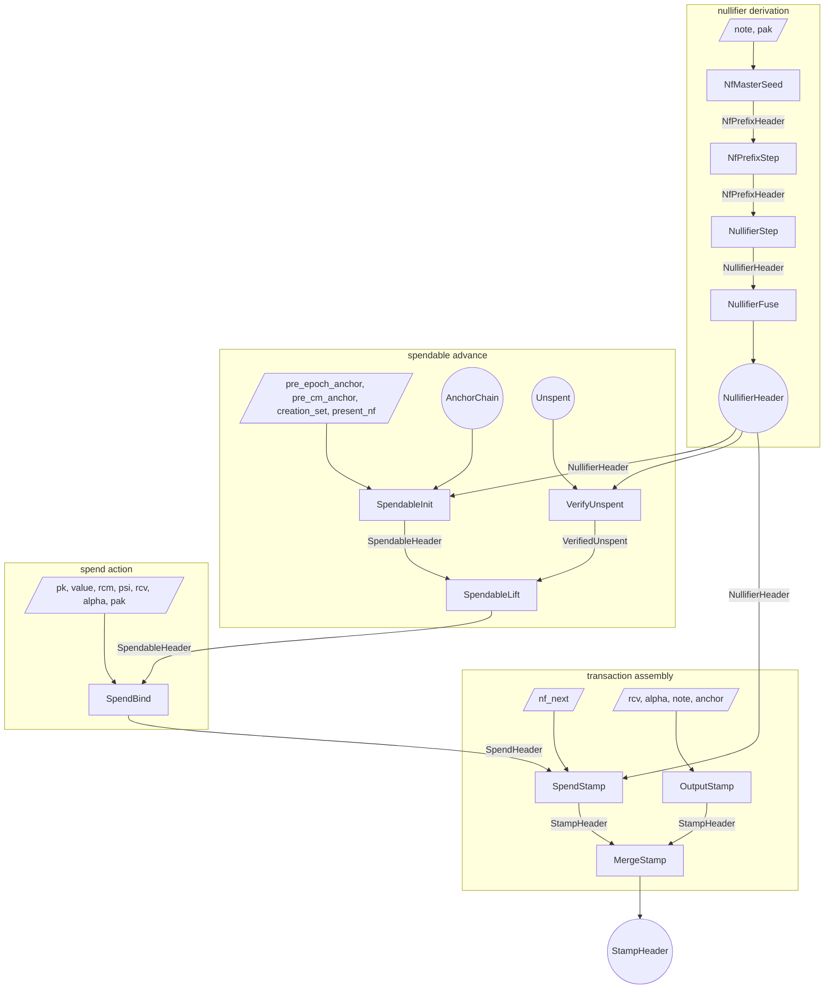
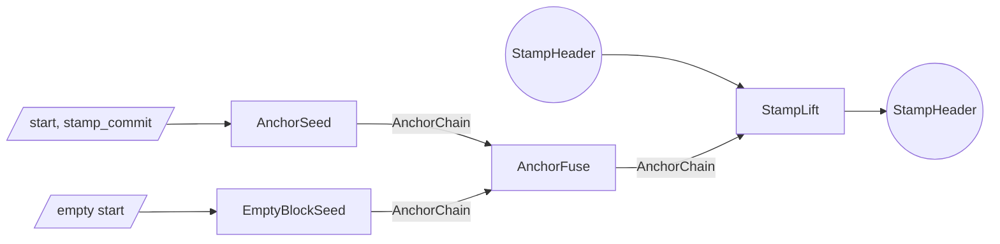
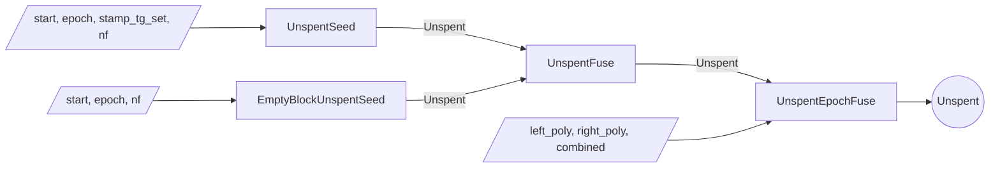

# Proof tree

The Tachyon proof tree is a graph of proof steps.
Each step accepts arbitrary witness inputs and up to two PCD inputs, performs computations and checks constraints, and emits a new PCD.

Multiple parties execute the proof tree.

- A **wallet** holds note data and keys
- A **sync service** holds nullifier values shared by the wallet and pool state proofs
- An **aggregator** merges stamps for pool efficiency

## Lifecycle

### Deriving nullifiers

A wallet proves a contiguous run of its note's nullifiers were correctly GGM-derived[^nullifiers].
`NfMasterSeed` witnesses the note and the proof-authorizing key `pak`, checks `note.pk == pak.derive_payment_key()` (which pins `nk`, and through `nk` the commitment `cm`), derives the master key `mk` and `cm`, and emits an `NfPrefixHeader` carrying the master node, depth zero, leaf index zero, and `cm`.
`NfPrefixStep` descends one tree level on a freely-witnessed chunk: it hashes the node with the chunk and accumulates the chunk into the leaf index, so the leaf a walk reaches is pinned into the index even though each step's chunk is free.
`NullifierStep` turns a depth-complete node into a single-epoch `NullifierHeader`: a rank-1 commitment to the leaf nullifier, spanning the half-open epoch range `[index, index + 1)`, carrying `cm`.
`NullifierFuse` concatenates two adjacent ranges into one, requiring the same `cm` and contiguity (`right.start == left.end`).
The result is a `NullifierHeader` proving the range `[start, end)` commits to the genuine `GGM(mk, ·)` leaves of the note identified by `cm`.

### Bootstrapping a spendable

A spendable starts when `SpendableInit` fuses a boundary-rooted `AnchorChain` with the wallet's single-leaf `NullifierHeader` for the starting epoch.
It witnesses `(pre_epoch_anchor, pre_cm_anchor, creation_set, present_nf)`: it binds `present_nf` to the proven leaf (`NfSeqCommit::single(present_nf)` equals the range commitment, the range spanning the single epoch `[epoch, epoch + 1)`), takes `cm` from the range header, checks `cm` is among the creation stamp's tachygrams[^tachygrams], requires the chain to root at `pre_epoch_anchor.next_epoch(epoch)`, requires the cm-stamp to be the chain's final link, and emits a `SpendableHeader` carrying `(present_nf, anchor, cm)`.
Rooting the chain at `next_epoch(epoch)` pins the starting GGM leaf index to the consensus epoch: consensus anchor membership of the eventual spend anchor forces the boundary, and hence `epoch`, to be the real creation epoch. Without it a note spent in its creation epoch crosses no boundary, leaving the index a free witness.
The anchor is set initially to the position immediately after the creation stamp and advanced by each lift.

### Maintaining a spendable

Maintaining the spendable means advancing its anchor forward over `Unspent` segments while proving the crossed nullifiers absent.
The sync service produces `Unspent` segments without ever holding the note, its `cm`, or `psi`.
`UnspentSeed` absorbs one stamp at a given absolute epoch and proves a wallet-supplied nullifier was absent from that stamp's tachygram set; the resulting `Unspent` has crossed no epoch boundary, so its `elapsed` is empty and it records that nullifier as its in-progress tip `present_nf`.
`EmptyBlockUnspentSeed` covers empty blocks.
`UnspentFuse` composes adjacent same-epoch segments: the forward half must have crossed no boundary, and both halves must share the same `present_nf`.
`UnspentEpochFuse` crosses an epoch boundary: it advances the anchor across the boundary and splices the left half's completing tip into `elapsed`, so the crossing count grows by exactly one while `present_nf` becomes the right half's tip.
An `Unspent` records its span as two absolute epoch endpoints, `start_epoch` and `present_epoch`; the crossing count is their difference.

`VerifyUnspent` binds a sync-built `Unspent` to genuine derivation. It is wallet-side: it consumes the `Unspent` and a wallet `NullifierHeader` range, and proves the range commits to exactly the `elapsed` crossings followed by the tip `present_nf`, with the range's epochs equal to the `Unspent`'s span. So every crossed nullifier and the tip are proven `GGM(mk, ·)` leaves.
It emits a `VerifiedUnspent` carrying the span's boundary nullifiers and anchors, the tip epoch, and the note's `cm`.

`SpendableLift` is wallet-side and witness-free: it consumes a `SpendableHeader` and a `VerifiedUnspent`.
It checks the verified segment's `cm` equals the spendable's (so the absence-proven nullifiers are this note's, and the value cannot drift), the segment's starting nullifier equals the spendable's `present_nf` (continuity), and the segment's starting anchor equals the spendable's anchor (adjacency).
It advances to the segment's tip nullifier and end anchor, threading `cm` unchanged.
A single lift can consume an arbitrarily long composed `Unspent`, including one that crosses many epoch boundaries.

### Spending

To spend, the wallet runs `SpendBind`.
It consumes the `SpendableHeader` and witnesses the note's fields and the action fields.
It derives `cm` from the preimage and requires `spendable.cm == cm`, so the witnessed note is the spendable lineage's note: the value commitment `cv` then commits to the minted value[^notes].
The output `SpendHeader` carries the value commitment, action verification key, the lineage's current nullifier `present_nf`, the threaded anchor, and `cm`.

`SpendStamp` composes that `SpendHeader` with a length-2 `NullifierHeader` range (the live pair for the current and next epochs) and witnesses the next-epoch nullifier `nf_next`.
It requires `range.end == range.start + 2` and `range.cm == cm`, then checks the rank-2 reference $[\texttt{present\_nf}]\,\mathcal{G}_0 + [\texttt{nf\_next}]\,\mathcal{G}_1 = \texttt{range\_commit}$ against the range's commitment $[N_e]\,\mathcal{G}_0 + [N_{e+1}]\,\mathcal{G}_1$.
Because `present_nf` is threaded from the lineage, the single free operand `nf_next` is pinned to the genuine $N_{e+1}$ leaf, and the slot-0 equality forces the range to start at the lineage's current epoch (subsuming a separate `present_nf == nf_now` check).
Nonzero guards close the `nf == 0` degenerate.
It derives the action digest from the value commitment and verification key, and emits a `StampHeader` whose tachygram set contains both nullifiers and whose anchor is threaded from the spend.

An output operation runs `OutputStamp` directly.
The step witnesses the new note, value-randomness, action-randomness, and an anchor; the wallet typically anchors each output at the same height as the transaction's spends so the merge can proceed without an intervening lift.
The resulting `StampHeader` is a single-action stamp committing to the new note's commitment as its sole tachygram.

A transaction with multiple spend and output stamps composes them with `MergeStamp`.
The output is a single `StampHeader` whose multisets are the union of the two inputs' at the shared anchor.

After the transaction stamp is fully composed, the wallet may run `StampLift` over an `AnchorChain` segment to advance the stamp's anchor toward the present tip before publication.

On publication the bundle carries the action descriptors, tachygrams, anchor, and the stamp proof.
Validators reconstruct the action-set and tachygram-set commitments from those published bundles, check the proof against the reconstructed values, and confirm the anchor against the consensus chain.

After publication, an aggregator combines `StampHeader`s from independently-proven bundles into a single **aggregate**[^aggregation] whose proof can stand in for many transactions' worth of stamps, cutting per-transaction verification cost downstream.
Each input is anchored at whatever height its wallet chose, so the aggregator obtains an `AnchorChain` segment per input and runs `StampLift` to bring every input onto a common later anchor.
`MergeStamp` then fuses the aligned stamps pairwise into a single `StampHeader` whose multisets are the union of all the inputs'.
The aggregated stamp has the same shape as any other, so it is itself eligible for further aggregation; aggregators stack to fold many published transactions into one stamp, and miners typically integrate the aggregator role into block production.

## Roles

The wallet runs every step that touches the note's commitment or master key.
It seeds and walks the private GGM tree (`NfMasterSeed`, `NfPrefixStep`, `NullifierStep`, `NullifierFuse`), derives spendable status from its own leaf (`SpendableInit`), binds and lifts over sync-built segments (`VerifyUnspent`, `SpendableLift`), and produces spend and output stamps (`SpendBind`, `OutputStamp`, `SpendStamp`).

The sync service holds the per-epoch nullifier values the wallet shared and pool history.
It produces the `Unspent` segments that carry the spendable forward (`UnspentSeed`, `EmptyBlockUnspentSeed`, `UnspentFuse`, `UnspentEpochFuse`) and hands the composed segment to the wallet to bind and lift over; it never sees a note, `cm`, `psi`, or `mk`.

The aggregator works only with published `StampHeader`s.
It aligns anchors with `StampLift` over `AnchorChain` segments (`AnchorSeed`, `EmptyBlockSeed`, `AnchorFuse`) and fuses with `MergeStamp`.

| step | wallet | sync service | aggregator |
| ---- | ------ | ------------ | ---------- |
| AnchorSeed | possible | yes | yes |
| EmptyBlockSeed | possible | yes | yes |
| AnchorFuse | possible | yes | yes |
| UnspentSeed | possible | yes | no |
| EmptyBlockUnspentSeed | possible | yes | no |
| UnspentFuse | possible | yes | no |
| UnspentEpochFuse | possible | yes | no |
| NfMasterSeed | yes | no | no |
| NfPrefixStep | yes | no | no |
| NullifierStep | yes | no | no |
| NullifierFuse | yes | no | no |
| VerifyUnspent | yes | no | no |
| SpendableInit | yes | no | no |
| SpendableLift | yes | no | no |
| SpendBind | yes | no | no |
| OutputStamp | yes | no | no |
| SpendStamp | yes | no | no |
| MergeStamp | yes | no | yes |
| StampLift | yes | possible | yes |

## Soundness

The subsections below walk each subtree bottom-up: the chain segments that act as primitives, then the `Unspent` segments and the derivation chain that consume them, then the binding at `VerifyUnspent`, the spendable lineage, then spend binding and stamps.

### Anchor segments

`AnchorSeed`, `EmptyBlockSeed`, `UnspentSeed`, and `EmptyBlockUnspentSeed` each witness a starting anchor and prove one anchor step.
`AnchorFuse` and `UnspentFuse` compose adjacent segments by checking endpoint equality.
A segment ties to real chain history only through a consensus-published stamp whose anchor matches an end-of-block value: `StampLift` emits that stamp directly, while a segment consumed by `SpendableInit` produces a private spendable whose anchor reaches consensus only once it is spent into a stamp.

### Unspent composition

An `Unspent` carries `elapsed` (one nullifier coefficient per epoch-boundary crossing in its span, forward-chronological), its tip epoch `present_epoch`, a starting anchor, an ending anchor, its in-progress tip nullifier `present_nf`, and its absolute `start_epoch`[^nullifiers]. The crossing count is `present_epoch - start_epoch`.
`UnspentSeed` and `EmptyBlockUnspentSeed` produce within-epoch `Unspent`s for one stamp's worth of anchor advance: `elapsed` is empty, `present_epoch == start_epoch`, and the nullifier they just non-membership-checked is recorded as `present_nf`.
`UnspentFuse` composes two same-epoch halves: it requires the forward half to have crossed no boundary and both halves to share `present_nf`; the anchor adjacency check welds the segments together.
`UnspentEpochFuse` crosses an epoch boundary: it witnesses the two halves' nullifier polynomials and the combined result, advances the anchor via the cross-epoch domain, and splices the left half's completing tip between them.
Writing $s$ for the left crossing count and $p$ for the left tip `present_nf`, the splice confirms

$$C(X) = L(X) + X^{s}\,p + X^{s+1}\,R(X)$$

for the witnessed `combined` $C$, left $L$, and right $R$, checked at a Fiat-Shamir challenge.
The scalar $p$ is the left header's value, bound by the recursive verification of the left PCD before the challenge; because the identity is linear in $p$, that prior binding is what makes the splice sound.
The crossing epoch is the right half's `start_epoch`, which must be exactly one past the left tip, and folding it into the boundary anchor via the cross-epoch domain consensus-ties the absolute epoch.

### Derivation chain

`NfMasterSeed` is the chain's only seed. It binds the master key to the note: `note.pk == pak.derive_payment_key()` pins `nk`, and the note commitment digests `nk` (through `pk`) and `psi`, so the derived `mk = Poseidon(psi, nk)` is consistent with the `cm` the seed threads forward.
`NfPrefixStep` is a genuine `Poseidon` hash of the node with a free chunk, accumulating the chunk into the leaf index; the index pins which leaf a walk reaches even though chunks are free.
`NullifierStep` builds its rank-1 range commitment by a generator scalar mul, not a fabricated polynomial.
`NullifierFuse` witnesses the two range polynomials and their concatenation, binds each by commit-equality, and confirms the concat at the constant offset `left.end - left.start`, requiring the same `cm` and contiguity.
So a `NullifierHeader` is a sound proof that a contiguous epoch range commits to the genuine leaves of the note identified by `cm`.

### Verifying unspent against derivation

`VerifyUnspent` consumes the sync's `Unspent` and the wallet's `NullifierHeader`.
It witnesses the `elapsed` polynomial, a singleton tip polynomial, and the range polynomial, binding each by commit-equality (the tip to the rank-1 commitment of `present_nf`), and confirms

$$R(X) = E(X) + X^{s}\,\texttt{present\_nf}$$

for the range $R$, elapsed $E$, and crossing count $s$, at a Fiat-Shamir challenge.
With the range epochs pinned to the `Unspent`'s span (`range.start == start_epoch`, `range.end == present_epoch + 1`), this proves the crossings and the tip are exactly the derived `GGM(mk, ·)` leaves: the tip nullifier is a genuine leaf, not a free value.
It surfaces the span's first nullifier as `start_nf` (the range's degree-zero coefficient, pinned by its commitment), the tip as `end_nf`, and threads the range's `cm`.

### Spendable lineage

`SpendableInit` is the lineage's only seed and is wallet-only.
It witnesses the note's fields, the creation stamp's tachygrams, the anchor running into the creation stamp, and the starting-epoch nullifier `present_nf`.
It derives `cm` and binds the note to the pool (`cm` in `creation_set`), which pins the whole note preimage to the real minted note.
It emits `SpendableHeader(present_nf, anchor, cm)`.
`present_nf` is unconstrained here; the first lift requires it to equal a `VerifiedUnspent`'s `start_nf`, a genuine leaf, pinning it to the note's starting nullifier at the consensus-tied starting epoch.

`SpendableLift` advances the lineage over a `VerifiedUnspent` and is witness-free.
It threads `cm` by equality (`verified.cm == spendable.cm`), so every consumed segment belongs to the lineage's one note and the spent value cannot drift to a different same-`mk` note.
Continuity holds through nullifier values: `verified.start_nf == spendable.present_nf`.
Both are `GGM(mk, ·)` PRF outputs, so value-equality forces the same note and the same epoch; combined with the tip binding at `VerifyUnspent` (which makes each new `present_nf` itself a genuine leaf), a lineage cannot skip an epoch or splice in another note.
The anchor adjacency check (`verified.start_anchor == spendable.anchor`) welds the segment to the lineage's current position.

### Spend binding

Spending a note publishes two nullifiers, one for the current epoch and one for the next, both pinned to the note's genuine leaves.
`SpendBind` witnesses the note's fields and the action material and consumes the `SpendableHeader`.
It derives `cm` from the preimage and requires `spendable.cm == cm`: the witnessed note is the lineage's note, so a phantom note reusing the same `psi` (and so the same nullifiers) but carrying a different value, and hence a different `cm`, is rejected.
The value commitment binds to `value`, which `cm` digests, so the spent value is the minted value[^notes].
The output `SpendHeader` threads the lineage's `present_nf`, anchor, and `cm`; `SpendBind` is an intermediate step, its `SpendHeader` consumed only by `SpendStamp`, so the note never propagates.

`SpendStamp` completes the publication: it composes the `SpendHeader` with a length-2 `NullifierHeader` range, witnesses `nf_next`, and requires the range to span exactly two epochs with `range.cm == cm`.
The range's rank-2 commitment fixes the published pair via the reference $[\texttt{present\_nf}]\,\mathcal{G}_0 + [\texttt{nf\_next}]\,\mathcal{G}_1 = \texttt{range\_commit}$: `present_nf` is threaded from the lineage, so the lone free operand `nf_next` is pinned to the genuine next leaf, and the slot-0 equality forces the range to start at the lineage's current epoch.
Each published nullifier must be nonzero, or it would collide with the note's own `cm` in the tachygram scan.
Deferring the rank-2 reference and the action digest to `SpendStamp` keeps each step within its per-step gate budget.

The two complementary `cm` checks pin value two independent ways. `cm == note.commitment()` ties `cm` to the preimage by `Poseidon` collision-resistance (the spender must know `rcm`, `pk`, `value`, `psi`). `spendable.cm == cm` ties it to the lineage, which the creation stamp proved minted. Together they bind the action's value commitment to the note actually being spent. Publishing both nullifiers lets consensus apply the spend across an epoch transition that may occur between proof construction and inclusion.

The note's age never becomes public. The lineage carries only a single current nullifier, not a polynomial with a consumed offset, and the published pair sits at the constant epochs of the live range, so no step reads a position that would leak how long the note has existed.

### Stamp construction

A stamp commits to two multisets, an action-digest set and a tachygram set[^tachygrams].
`OutputStamp` derives a value commitment, action verification key, and action digest from a witnessed note, value-randomness, and action-randomness; constraints reject zero or over-range note values and require the note's payment key to match the witnessed key material[^keys].
`SpendStamp` composes a `SpendHeader` (carrying value commitment, action verification key, `present_nf`, anchor, and `cm`) with the note's length-2 `NullifierHeader` range, binds the published pair to the range, derives the action digest, and emits a stamp whose action digest, two-nullifier tachygram set, and threaded anchor follow.
`MergeStamp` fuses two stamps by checking anchor equality and confirming each output set is the union of the two inputs': it witnesses the merged sets and enforces, for each, that the merged set polynomial is the product of the input set polynomials.

### Stamp anchor

`OutputStamp` is the only stamp-producing step that takes an anchor as direct witness: an output operation has no prior chain state to thread from.
The other stamp-producing steps thread the anchor from a validated spendable through `SpendBind`/`SpendStamp`, equality-constrain the two inputs' anchors (`MergeStamp`), or advance over an `AnchorChain` segment whose start matches the stamp's prior anchor (`StampLift`).
Consensus verifies the published anchor against the chain before accepting the stamp.

## Simple transaction

A transaction with one spend and one output, where the spendable was bootstrapped in a previous epoch and lifted over an `Unspent` crossing an epoch boundary before the spend.

The single `SpendableLift` consumes one composed `VerifiedUnspent` (potentially crossing many epoch boundaries); threading `cm` chains the lineage's binding to the note through every advance.

## Focused subgraphs

### Stamp anchor advance

### Unspent composition across epochs

## Headers

| Header | Fields |
| ------ | ------ |
| AnchorChain | (prev_anchor, end_anchor) |
| Unspent | ((elapsed, present_epoch), prev_anchor, end_anchor, present_nf, start_epoch) |
| VerifiedUnspent | (start_anchor, start_nf, end_anchor, end_nf, cm, epoch) |
| NfPrefixHeader | (node, depth, index, cm) |
| NullifierHeader | (range_commit, start_epoch, end_epoch, cm) |
| SpendableHeader | (present_nf, anchor, cm) |
| SpendHeader | (cv, rk, present_nf, anchor, cm) |
| StampHeader | (action_acc, tachygram_acc, anchor) |

## Steps

| Step | Left | Right | Witness | Output |
| ---- | ---- | ----- | ------- | ------ |
| AnchorSeed | — | — | start, stamp_commit | AnchorChain |
| EmptyBlockSeed | — | — | start | AnchorChain |
| AnchorFuse | AnchorChain | AnchorChain | — | AnchorChain |
| UnspentSeed | — | — | start, epoch, stamp_tg_set, nf | Unspent |
| EmptyBlockUnspentSeed | — | — | start, epoch, nf | Unspent |
| UnspentFuse | Unspent | Unspent | — | Unspent |
| UnspentEpochFuse | Unspent | Unspent | left_poly, right_poly, combined | Unspent |
| VerifyUnspent | Unspent | NullifierHeader | elapsed_poly, tip_poly, range_poly | VerifiedUnspent |
| NfMasterSeed | — | — | note, pak | NfPrefixHeader |
| NfPrefixStep | NfPrefixHeader | — | chunk | NfPrefixHeader |
| NullifierStep | NfPrefixHeader | — | — | NullifierHeader |
| NullifierFuse | NullifierHeader | NullifierHeader | left_poly, right_poly, merged | NullifierHeader |
| SpendableInit | AnchorChain | NullifierHeader | pre_epoch_anchor, pre_cm_anchor, creation_set, present_nf | SpendableHeader |
| SpendableLift | SpendableHeader | VerifiedUnspent | — | SpendableHeader |
| SpendBind | SpendableHeader | — | pk, value, rcm, psi, rcv, alpha, pak | SpendHeader |
| OutputStamp | — | — | rcv, alpha, note, anchor | StampHeader |
| SpendStamp | SpendHeader | NullifierHeader | nf_next | StampHeader |
| MergeStamp | StampHeader | StampHeader | action polys, tachygram polys | StampHeader |
| StampLift | StampHeader | AnchorChain | — | StampHeader |

[^nullifiers]: See [Nullifiers](./nullifiers.md) for the GGM derivation, the scalar `psi` seed, and the re-based absence sequence.
[^tachygrams]: See [Tachygrams](./tachygrams.md) for the per-stamp multiset polynomial and its Pedersen commitment.
[^notes]: See [Notes](./notes.md) for the four-field note structure and its commitment.
[^keys]: See [Keys](./keys.md) for the wallet key hierarchy and the per-action derivations.
[^aggregation]: See [Aggregation](./aggregation.md) for the autonome/aggregate/adjunct lifecycle and the miner-side stripping that realizes the chain-cost reduction.
