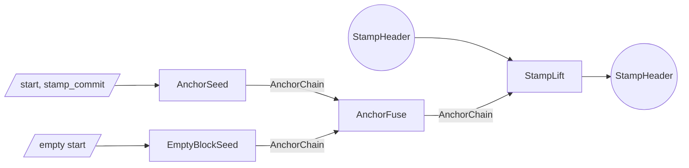
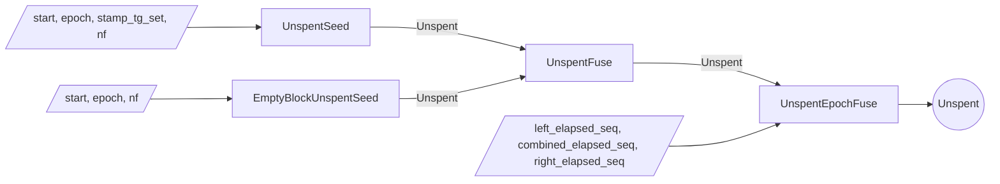

# Proof tree

The Tachyon proof tree is a graph of proof steps.
Each step accepts arbitrary witness inputs and up to two PCD inputs, performs computations and checks constraints, and emits a new PCD.

Multiple parties execute the proof tree.

- A **wallet** holds note data and keys
- A **sync service** holds nullifier values shared by the wallet and pool state proofs
- An **aggregator** merges stamps for pool efficiency

## Lifecycle

### Deriving nullifiers

A wallet proves one window of 128 consecutive epochs' nullifiers in a single pair of steps[^nullifiers].
The window's 128 cipher evaluations, 64 round states each, interpolate row-major as one trace polynomial over an order-8192 domain; the whitened trace $W$ takes the window's nullifiers as its values on the last-column coset, one nullifier point per epoch, so a consumer reads any covered nullifier as a single opening.
`SboxStep` seeds the window. It witnesses the trace, the S-box intermediates `square` and `quartic`, a combined quotient, the master key `mk` (a free witness here), and the window `base`; it certifies the S-box decomposition and the arithmetic-progression boundary (each row's first cell is round 0 of input `base + row`), range-checks `base` against the epoch space, and computes the whitened commitment `nf_commit = trace_commit + w·𝒢₀` homomorphically. The resulting `Sbox` header is private to the pipeline.
`WrapStep` fuses over the cert. It re-witnesses the trace and `quartic` and binds them by commit-equality, certifies the round-transition identity, derives the note's real master key (`note.pk == pak.derive_payment_key()` pins `nk`; `mk` from `psi` and `nk`) and pins the seed's free-witness `mk` to it, computes `cm`, and emits the `NullifierDerivation` covering exactly `[base, base + 128)`. `nk` never leaves the step.
The result is a point-queryable `NullifierDerivation` carrying `(cm, epoch_start, epoch_end, nf_commit)`, always exactly one window wide. A consumer re-witnesses $W$ against `nf_commit` by commit-equality and reads whatever nullifiers it needs as openings at pinned points on the nullifier coset; no key material rides the header.

### Bootstrapping a spendable

A spendable starts when `SpendableInit` fuses a boundary-rooted `AnchorChain` with a `NullifierDerivation` covering the creation epoch.
It witnesses `((pre_epoch_anchor, pre_cm_anchor), creation_set, creation_epoch)` and the whitened trace $W$: it reads `present_nf` off $W$ at the creation epoch's nullifier point, takes `cm` from the derivation header, checks `cm` is among the creation stamp's tachygrams[^tachygrams], requires the chain to root at `pre_epoch_anchor.next_epoch(creation_epoch)`, requires the cm-stamp to be the chain's final link, and emits a `SpendableHeader` carrying `(cm, present_nf, anchor)`.
Rooting the chain at `next_epoch(epoch)` pins the starting epoch index to the consensus epoch: consensus anchor membership of the eventual spend anchor forces the boundary, and hence `epoch`, to be the real creation epoch. Without it a note spent in its creation epoch crosses no boundary, leaving the index a free witness.
The anchor is set initially to the position immediately after the creation stamp and advanced by each lift.

### Maintaining a spendable

Maintaining the spendable means advancing its anchor forward over `Unspent` segments while proving the crossed nullifiers absent.
The sync service produces `Unspent` segments without ever holding the note, its `cm`, or `psi`.
`UnspentSeed` absorbs one stamp at a given absolute epoch and proves a wallet-supplied nullifier was absent from that stamp's tachygram set; the resulting `Unspent` has crossed no epoch boundary, so its `elapsed` is empty and `epoch_start == epoch_end` with `nf_start == nf_end` the tested nullifier.
`EmptyBlockUnspentSeed` covers empty blocks.
`UnspentFuse` composes two contiguous ranges that share a junction epoch (`right.epoch_start == left.epoch_end`): it concatenates their `elapsed` histories and seam-binds the junction nullifier (`left.nf_end == right.nf_start`) at adjacent anchors.
`UnspentEpochFuse` crosses an epoch boundary: it advances the anchor across the boundary and splices the left range's completing tip `nf_end` into `elapsed`, so the crossing count grows by exactly one; either half may itself be a multi-epoch range.
An `Unspent` records its span as two absolute epoch endpoints, `epoch_start` and `epoch_end`; the crossing count is their difference.

`UnspentBind` binds a sync-built `Unspent` to genuine derivation. It is wallet-side: it consumes the `Unspent` and a `NullifierDerivation` that merely *covers* the unspent span, and proves, by folding the covered leaves of $W$ at a commitment-bound challenge, that the `elapsed` crossings followed by the tip `nf_end` are exactly the derived nullifiers over the unspent's epochs. So every crossed nullifier and the tip are proven genuine leaves of the note's window.
It emits a `VerifiedUnspent` carrying the span's boundary epochs and nullifiers, its anchors, and the note's `cm`.

`SpendableLift` is wallet-side and witness-free: it consumes a `SpendableHeader` and a `VerifiedUnspent`.
It checks the verified segment's `cm` equals the spendable's (so the absence-proven nullifiers are this note's, and the value cannot drift), the segment's `nf_start` equals the spendable's `present_nf` (continuity), and the segment's `anchor_prev` equals the spendable's anchor (adjacency).
It advances to the segment's `nf_end` and `anchor_last`, threading `cm` unchanged.
A single lift can consume an arbitrarily long composed `Unspent`, including one that crosses many epoch boundaries.

### Spending

To spend, the wallet runs `SpendBind`.
It consumes the `SpendableHeader` and a `NullifierDerivation` covering the present and next epochs, and witnesses the whitened trace $W$ and a nullifier point.
It ties the derivation to the lineage by `deriv.cm == spendable.cm` (so no note witness is needed here), pins the witnessed nullifier point to the last-column coset, confirms the lineage's `present_nf` as $W$'s value there, and reads the adjacent point as the next epoch's nullifier `nf_next`.
Nonzero guards close the `nf == 0` degenerate.
The output `SpendHeader` carries `cm`, the confirmed pair `(present_nf, nf_next)`, and the threaded anchor.

`SpendStamp` proves the spend's action, mirroring `OutputStamp`.
It consumes the `SpendHeader`, witnesses the note and the action material `(rcv, alpha, pak)`, requires `note.commitment() == cm` and `note.pk == pak.derive_payment_key()`, derives the value commitment `cv` and the randomized action verification key `rk`[^notes], and emits a `StampHeader` whose action digest follows from `(cv, rk)`, whose tachygram set is the pair `{present_nf, nf_next}` read off the `SpendHeader`, and whose anchor is threaded from the spend.

An output operation runs `OutputStamp` directly.
The step witnesses the new note, value-randomness, action-randomness, and an anchor; the wallet typically anchors each output at the same height as the transaction's spends so the merge can proceed without an intervening lift.
The resulting `StampHeader` is a single-action stamp committing to the new note's commitment as its sole tachygram.

A transaction with multiple spend and output stamps composes them with `MergeStamp`.
The output is a single `StampHeader` whose multisets are the union of the two inputs' at the shared anchor.

After the transaction stamp is fully composed, the wallet may run `StampLift` over an `AnchorChain` segment to advance the stamp's anchor toward the present tip before publication.

On publication the bundle carries the action descriptors, tachygrams, anchor, and the stamp proof.
Validators reconstruct the action-set and tachygram-set commitments from those published bundles, check the proof against the reconstructed values, and confirm the anchor against the consensus chain.

After publication, an aggregator combines `StampHeader`s from independently-proven bundles into a single **aggregate**[^aggregation] whose proof can stand in for many transactions' worth of stamps, cutting per-transaction verification cost downstream.
Each input is anchored at whatever height its wallet chose, so the aggregator obtains an `AnchorChain` segment per input and runs `StampLift` to bring every input onto a common later anchor.
`MergeStamp` then fuses the aligned stamps pairwise into a single `StampHeader` whose multisets are the union of all the inputs'.
The aggregated stamp has the same shape as any other, so it is itself eligible for further aggregation; aggregators stack to fold many published transactions into one stamp, and miners typically integrate the aggregator role into block production.

## Roles

The wallet runs every step that touches the note's commitment or master key.
It derives its nullifier windows (`SboxStep`, `WrapStep`), derives spendable status from its own derivation (`SpendableInit`), binds and lifts over sync-built segments (`UnspentBind`, `SpendableLift`), and produces spend and output stamps (`SpendBind`, `OutputStamp`, `SpendStamp`).

The sync service holds the per-epoch nullifier values the wallet shared and pool history.
It produces the `Unspent` segments that carry the spendable forward (`UnspentSeed`, `EmptyBlockUnspentSeed`, `UnspentFuse`, `UnspentEpochFuse`) and hands the composed segment to the wallet to bind and lift over; it never sees a note, `cm`, `psi`, or `mk`.

The aggregator works only with published `StampHeader`s.
It aligns anchors with `StampLift` over `AnchorChain` segments (`AnchorSeed`, `EmptyBlockSeed`, `AnchorFuse`) and fuses with `MergeStamp`.

| step | wallet | sync service | aggregator |
| ---- | ------ | ------------ | ---------- |
| AnchorSeed | possible | yes | yes |
| EmptyBlockSeed | possible | yes | yes |
| AnchorFuse | possible | yes | yes |
| UnspentSeed | possible | yes | no |
| EmptyBlockUnspentSeed | possible | yes | no |
| UnspentFuse | possible | yes | no |
| UnspentEpochFuse | possible | yes | no |
| SboxStep | yes | no | no |
| WrapStep | yes | no | no |
| UnspentBind | yes | no | no |
| SpendableInit | yes | no | no |
| SpendableLift | yes | no | no |
| SpendBind | yes | no | no |
| OutputStamp | yes | no | no |
| SpendStamp | yes | no | no |
| MergeStamp | yes | no | yes |
| StampLift | yes | possible | yes |

## Soundness

The subsections below walk each subtree bottom-up: the chain segments that act as primitives, then the `Unspent` segments and the derivation chain that consume them, then the binding at `UnspentBind`, the spendable lineage, then spend binding and stamps.

### Anchor segments

`AnchorSeed`, `EmptyBlockSeed`, `UnspentSeed`, and `EmptyBlockUnspentSeed` each witness an `anchor_prev` and prove one anchor step.
`AnchorFuse` composes adjacent segments by checking endpoint equality; `UnspentFuse` additionally concatenates the two halves' `elapsed` histories.
A segment ties to real chain history only through a consensus-published stamp whose anchor matches an end-of-block value: `StampLift` emits that stamp directly, while a segment consumed by `SpendableInit` produces a private spendable whose anchor reaches consensus only once it is spent into a stamp.

### Unspent composition

An `Unspent` is a contiguous range bracketed by `anchor_prev` and `anchor_last`, with boundary pairs `(epoch_start, nf_start)` and `(epoch_end, nf_end)`, plus `elapsed` (one nullifier coefficient per epoch-boundary crossing in its span, forward-chronological, terminated by a sentinel coefficient $1$ at the crossing count)[^nullifiers]. `nf_start`/`nf_end` are the nullifiers at `epoch_start`/`epoch_end`; the crossing count is `epoch_end - epoch_start`.
The sentinel keeps the committed polynomial nonzero for every sequence, so the commitment never falls on the identity point, which the in-circuit point representation cannot hold; it also pins the sequence's exact length, which commit-equality alone bounds only from above.
`UnspentSeed` and `EmptyBlockUnspentSeed` produce within-epoch `Unspent`s for one stamp's worth of anchor advance: `elapsed` is empty (the sentinel constant $1$, committing to $\mathcal{G}_0$), `epoch_start == epoch_end`, and the nullifier they just non-membership-checked is both `nf_start` and `nf_end`.
`UnspentFuse` composes two contiguous ranges sharing a junction epoch (`right.epoch_start == left.epoch_end`) at adjacent anchors (`left.anchor_last == right.anchor_prev`): it concatenates their histories and seam-binds the junction nullifier (`left.nf_end == right.nf_start`). Writing $s$ for the left crossing count, the concat confirms

$$C(X) = L(X) + X^{s}\,(R(X) - 1)$$

for the witnessed `combined` $C$, left $L$, and right $R$, at a Fiat-Shamir challenge: the $-1$ cancels the left half's sentinel at degree $s$, the right half's first crossing takes its slot, and the right half's sentinel re-terminates the combined sequence; the seam-bind makes the shared junction epoch's nullifier unambiguous across the merge.
`UnspentEpochFuse` crosses an epoch boundary: it witnesses the two halves' nullifier polynomials and the combined result, advances the anchor via the cross-epoch domain, and splices the left range's completing tip between them.
Writing $p$ for the left tip `nf_end`, the splice confirms

$$C(X) = L(X) + X^{s}\,(p - 1) + X^{s+1}\,R(X)$$

at a Fiat-Shamir challenge: the spliced tip overwrites the left half's sentinel and the right half's sentinel re-terminates the combined sequence.
$L$ and $R$ are bound by the recursive verification of the two input PCDs, and the scalar $p$ is a left-header value bound likewise, all before the challenge; because the identity is linear in $L$, $R$, and $p$, that prior binding is what makes the splice sound.
The crossing epoch is the right half's `epoch_start`, which must be exactly one past the left tip, and folding it into the boundary anchor via the cross-epoch domain consensus-ties the absolute epoch.

### Derivation chain

A window's trace lays 128 cipher evaluations row-major over the order-8192 multiplicative domain $\langle\omega\rangle$: row $r$'s 64 round states occupy $\omega^{64r}, \ldots, \omega^{64r+63}$, and the row subgroup and the nullifier coset structure the grid,

$$
\zeta = \omega^{64}, \qquad \sigma = \omega^{63}, \qquad W = T + w, \qquad \mathsf{nf}_{\texttt{base}+r} = W(\sigma\zeta^{r}).
$$

The last column, the coset $\sigma\langle\zeta\rangle$, holds each row's final state, so the whitened trace $W$ evaluates to the window's nullifiers there.

The round-constant schedule and the row index are public interpolants the steps Horner-evaluate in-circuit, never committed. The schedule is column-periodic, $C(X) = C_{\mathrm{col}}(X^{128})$, supplying each column's round-constant offset and $0$ on the wrap column; the row index satisfies $N_{\mathrm{row}}(\zeta^{r}) = r$ on the first column. Each cell's round input is $T + C + k$.

`SboxStep` derives the combination challenge $\chi_A = \mathsf{Poseidon}_\texttt{Tachyon-NfLeafSq}$ over the trace, `square`, and `quartic` commitments, and checks the combined identity at a Fiat-Shamir point:

$$
\begin{aligned}
I_1 &= \mathsf{square} - (T + C + k)^2 \\
I_2 &= \mathsf{quartic} - \mathsf{square}^2 \\
I_4 &= \bigl(T - (\texttt{base} + k + N_{\mathrm{row}})^5\bigr) \cdot \frac{X^{8192}-1}{X^{128}-1}
\end{aligned}
$$

$$
I_1 + \chi_A\,\bigl(I_2 + \chi_A\, I_4\bigr) = Q_A \cdot (X^{8192} - 1)
$$

$I_1$ and $I_2$ decompose the degree-5 S-box across the whole domain, and $I_4$ pins each row's first cell to round 0 of its arithmetic-progression input $\texttt{base} + r$. The step range-checks $\texttt{base}$ against the epoch space and computes the whitening in-circuit,

$$
\mathsf{nf\_commit} = \mathsf{trace\_commit} + w \cdot \mathcal{G}_0,
$$

so a valid cert's `nf_commit` is a pinned function of the certified trace and `mk`. `mk` is a free witness at the seed; the `Sbox` cert is consumed only by `WrapStep`, which pins it.

`WrapStep` binds the witnessed trace and `quartic` to the cert by commit-equality, derives the note's real master key $\mathsf{mk} = \mathsf{Poseidon}_\texttt{Tachyon-NfMaster}\!(\psi, \mathsf{nk})$ behind the `note.pk == pak.derive_payment_key()` pin, equality-constrains both components against the cert's, computes $\mathsf{cm}$, and checks the round-transition identity at a fresh Fiat-Shamir point:

$$
T(\omega X) - \mathsf{quartic}\cdot(T + C + k) - \frac{X^{8192}-1}{X^{128}-\sigma^{128}}\cdot \mathsf{wrap} = Q_B \cdot (X^{8192} - 1)
$$

The 128-coefficient `wrap` polynomial, interpolated over the nullifier coset, absorbs the row seams: each row's last cell is exempted from stepping into the next row's first cell.

So a `NullifierDerivation` is a sound certificate that `nf_commit` commits the whitened trace of the genuine window `[epoch_start, epoch_end)` of the note identified by `cm`; `WrapStep` is its only emitter and always exports exactly one window. Consumers bind by commit-equality on the re-witnessed $W$ and read leaves as point openings at pinned coset points.

### Binding unspent to derivation

`UnspentBind` consumes the sync's `Unspent` and a `NullifierDerivation` that merely *covers* the unspent span (`deriv.start <= unspent.start`, `unspent.end < deriv.end`), not one aligned to it.
It binds `elapsed` to the `Unspent` header and the whitened trace $W$ to the `NullifierDerivation`, both by commit-equality, and derives the fold weight $\chi = \mathsf{Poseidon}_\texttt{Tachyon-NfLeafFd}\!(\mathsf{nf\_commit}, \mathsf{elapsed\_commit})$. A witnessed accumulator $A$ satisfies the fold identity

$$A(X) - \chi\,A(\zeta X) = W(\sigma X)$$

checked at a Fiat-Shamir point, so it holds as polynomials. Writing $\texttt{off} = \texttt{unspent.start} - \texttt{deriv.start}$ for the header-fixed coverage offset and $\texttt{span} = \texttt{unspent.end} - \texttt{unspent.start}$ for the crossing count, iterating the identity over $X = \zeta^{\texttt{off}}, \ldots, \zeta^{\texttt{off}+\texttt{span}}$ telescopes to

$$A(\zeta^{\texttt{off}}) - \chi^{\texttt{span}+1}\,A(\zeta^{\texttt{off}+\texttt{span}+1}) = \sum_{i=0}^{\texttt{span}} \chi^{i}\,W(\sigma\zeta^{\texttt{off}+i}),$$

the genuine nullifiers over the covered span folded at $\chi$, in a constant number of openings. The tested sub-sequence, the crossings followed by the tip, discharges against the telescope at $\chi$:

$$\texttt{elapsed}(\chi) + (\texttt{nf\_end} - 1)\,\chi^{\texttt{span}} = A(\zeta^{\texttt{off}}) - \chi^{\texttt{span}+1}\,A(\zeta^{\texttt{off}+\texttt{span}+1})$$

The monomial swaps `elapsed`'s sentinel for the tip; because $\chi$ is bound to `elapsed`'s commitment before the check, the single-point equality forces every coefficient of `elapsed`, and the tip, to the genuine nullifiers: the tip nullifier is genuine, not a free value.
`nf_start` is read as a degree-0 opening of `elapsed`, or equality with `nf_end` closes the zero-span case; the step guards that the derivation is a single window covering the span and threads the derivation's `cm` onto the `VerifiedUnspent`.

### Spendable lineage

`SpendableInit` is the lineage's only seed and is wallet-only.
It consumes a covering `NullifierDerivation` and witnesses the creation stamp's tachygrams, the anchors running into the creation stamp, the creation epoch, and the whitened trace $W$.
It takes `cm` from the derivation and binds the note to the pool (`cm` in `creation_set`), which pins the note to the real minted note; it reads `present_nf` off $W$ at the creation epoch's nullifier point, so `present_nf` is a genuine nullifier from the outset, tied to the consensus creation epoch by the boundary-rooted chain.
It emits `SpendableHeader(cm, present_nf, anchor)`.

`SpendableLift` advances the lineage over a `VerifiedUnspent` and is witness-free.
It threads `cm` by equality (`verified.cm == spendable.cm`), so every consumed segment belongs to the lineage's one note and the spent value cannot drift to a different same-`mk` note.
Continuity holds through nullifier values: `verified.nf_start == spendable.present_nf`.
Both are pseudorandom outputs of the note's nullifier cipher, so value-equality forces the same note and the same epoch; combined with the tip binding at `UnspentBind` (which makes each new `present_nf` itself a genuine nullifier), a lineage cannot skip an epoch or splice in another note.
The anchor adjacency check (`verified.anchor_prev == spendable.anchor`) welds the segment to the lineage's current position.

### Spend binding

Spending a note publishes two nullifiers, one for the current epoch and one for the next, both pinned to the note's genuine leaves.
`SpendBind` consumes the `SpendableHeader` and a `NullifierDerivation` covering the present and next epochs. It ties the derivation to the lineage by `deriv.cm == spendable.cm`, so the pair it confirms is this note's, and it needs no note witness of its own.
It witnesses the whitened trace $W$ and a nullifier point $\ell$, pinned to the last-column coset by a squaring chain; on the coset $W$ takes exactly the window's genuine nullifiers, so matching the lineage's `present_nf` pins $\ell$ to the present epoch's nullifier point, and the wrap from the window's last epoch back to its first is rejected:

$$
\ell^{128} = \sigma^{128}, \qquad W(\ell) = \texttt{present\_nf}, \qquad \texttt{nf\_next} = W(\zeta\ell), \qquad \zeta\ell \neq \sigma
$$

Both published nullifiers are genuine leaves at adjacent epochs.
Each must be nonzero, or it would collide with the note's own `cm` in the tachygram scan.
The output `SpendHeader` carries `cm`, the pair `(present_nf, nf_next)`, and the anchor; `SpendBind` is an intermediate step, its `SpendHeader` consumed only by `SpendStamp`.

`SpendStamp` proves the action, mirroring `OutputStamp`, and completes publication.
It witnesses the note and the action material, requires `note.commitment() == cm` and `note.pk == pak.derive_payment_key()`, and derives the value commitment `cv`, the randomized action verification key `rk`, and the action digest; it emits a `StampHeader` whose tachygram set is the pair `{present_nf, nf_next}` read off the `SpendHeader`.
Splitting the pair-binding from the action keeps each step within its per-step gate budget and lets `SpendStamp` stay focused on the action, like `OutputStamp`.

Value is pinned two independent ways. `note.commitment() == cm` at `SpendStamp` ties `cm` to the note by `Poseidon` collision-resistance (the spender must know `rcm`, `pk`, `value`, `psi`), so the value commitment `cv` commits to the minted value[^notes]. `deriv.cm == spendable.cm` at `SpendBind` ties the published nullifiers to the lineage the creation stamp proved minted. Together they bind the action's value commitment to the note actually being spent. Publishing both nullifiers lets consensus apply the spend across an epoch transition that may occur between proof construction and inclusion.

The note's age never becomes public. The lineage carries only a single current nullifier, and `SpendBind` reads the pair off the whitened trace of a derivation whose epoch range never reaches a published header, so no step surfaces a position that would leak how long the note has existed.

### Stamp construction

A stamp commits to two multisets, an action-digest set and a tachygram set[^tachygrams].
`OutputStamp` derives a value commitment, action verification key, and action digest from a witnessed note, value-randomness, and action-randomness; constraints reject zero or over-range note values and require the note's payment key to match the witnessed key material[^keys].
`SpendStamp` consumes a `SpendHeader` (carrying `cm`, the pair `(present_nf, nf_next)`, and the anchor), witnesses the note and randomness, checks the note against `cm` and its payment key against the witnessed key material[^keys], derives the value commitment, action verification key, and action digest, and emits a stamp whose one-action digest set, two-nullifier tachygram set `{present_nf, nf_next}`, and threaded anchor follow.
`MergeStamp` fuses two stamps by checking anchor equality and confirming each output set is the union of the two inputs': it witnesses the merged sets and enforces, for each, that the merged set polynomial is the product of the input set polynomials.

### Stamp anchor

`OutputStamp` is the only stamp-producing step that takes an anchor as direct witness: an output operation has no prior chain state to thread from.
The other stamp-producing steps thread the anchor from a validated spendable through `SpendBind`/`SpendStamp`, equality-constrain the two inputs' anchors (`MergeStamp`), or advance over an `AnchorChain` segment whose start matches the stamp's prior anchor (`StampLift`).
Consensus verifies the published anchor against the chain before accepting the stamp.

## Simple transaction

A transaction with one spend and one output, where the spendable was bootstrapped in a previous epoch and lifted over an `Unspent` crossing an epoch boundary before the spend.

```mermaid
flowchart TB
  subgraph derive [nullifier derivation]
    w_sbox[/trace, square, quartic, quotient, mk, base/]
    s_sbox[SboxStep]
    w_wrap[/trace, quartic, wrap, quotient, note, pak/]
    s_wrap[WrapStep]
    nf_range((NullifierDerivation))
  end

  subgraph spendable [spendable advance]
    w_init[/pre_epoch_anchor, pre_cm_anchor, creation_set, creation_epoch, nf_spectrum/]
    anchor_init((AnchorChain))
    s_init[SpendableInit]
    unspent_in((Unspent))
    s_verify[UnspentBind]
    s_lift[SpendableLift]
  end

  subgraph spend_action [spend action]
    w_bind[/nf_spectrum, nf_point/]
    s_bind[SpendBind]
  end

  subgraph merge [transaction assembly]
    w_stamp[/note, rcv, alpha, pak/]
    s_spendstamp[SpendStamp]
    w_output[/rcv, alpha, note, anchor/]
    s_output[OutputStamp]
    s_merge[MergeStamp]
  end

  stamp_out((StampHeader))

  w_sbox --> s_sbox
  s_sbox -->|Sbox| s_wrap
  w_wrap --> s_wrap
  s_wrap --> nf_range

  anchor_init --> s_init
  nf_range -->|NullifierDerivation| s_init
  w_init --> s_init
  nf_range -->|NullifierDerivation| s_verify
  unspent_in --> s_verify
  s_init -->|SpendableHeader| s_lift
  s_verify -->|VerifiedUnspent| s_lift
  s_lift -->|SpendableHeader| s_bind

  nf_range -->|NullifierDerivation| s_bind
  w_bind --> s_bind
  s_bind -->|SpendHeader| s_spendstamp
  w_stamp --> s_spendstamp

  w_output --> s_output
  s_spendstamp -->|StampHeader| s_merge
  s_output -->|StampHeader| s_merge
  s_merge --> stamp_out
```

The single `SpendableLift` consumes one composed `VerifiedUnspent` (potentially crossing many epoch boundaries); threading `cm` chains the lineage's binding to the note through every advance.

## Focused subgraphs

### Stamp anchor advance

### Unspent composition across epochs

## Headers

| Header | Fields |
| ------ | ------ |
| AnchorChain | (start, end) |
| Unspent | (anchor_prev, (epoch_start, nf_start), elapsed, (epoch_end, nf_end), anchor_last) |
| VerifiedUnspent | (cm, anchor_prev, (epoch_start, nf_start), (epoch_end, nf_end), anchor_last) |
| Sbox | (trace_commit, nf_commit, quartic_commit, mk, base) |
| NullifierDerivation | (cm, epoch_start, epoch_end, nf_commit) |
| SpendableHeader | (cm, present_nf, anchor) |
| SpendHeader | (cm, present_nf, nf_next, anchor) |
| StampHeader | (action_commit, tachygram_commit, anchor) |

## Steps

| Step | Left | Right | Witness | Output |
| ---- | ---- | ----- | ------- | ------ |
| AnchorSeed | — | — | start, stamp_commit | AnchorChain |
| EmptyBlockSeed | — | — | start | AnchorChain |
| AnchorFuse | AnchorChain | AnchorChain | — | AnchorChain |
| UnspentSeed | — | — | anchor_prev, (epoch, nf), stamp_tg_set | Unspent |
| EmptyBlockUnspentSeed | — | — | anchor_prev, (epoch, nf) | Unspent |
| UnspentFuse | Unspent | Unspent | left_elapsed_seq, combined_elapsed_seq, right_elapsed_seq | Unspent |
| UnspentEpochFuse | Unspent | Unspent | left_elapsed_seq, combined_elapsed_seq, right_elapsed_seq | Unspent |
| UnspentBind | Unspent | NullifierDerivation | elapsed_seq, nf_spectrum, accumulator | VerifiedUnspent |
| SboxStep | — | — | trace, square, quartic, quotient, mk, base | Sbox |
| WrapStep | Sbox | — | trace, quartic, wrap, quotient, note, pak | NullifierDerivation |
| SpendableInit | AnchorChain | NullifierDerivation | (pre_epoch_anchor, pre_cm_anchor), creation_set, creation_epoch, nf_spectrum | SpendableHeader |
| SpendableLift | SpendableHeader | VerifiedUnspent | — | SpendableHeader |
| SpendBind | SpendableHeader | NullifierDerivation | nf_spectrum, nf_point | SpendHeader |
| OutputStamp | — | — | rcv, alpha, note, anchor | StampHeader |
| SpendStamp | SpendHeader | — | note, rcv, alpha, pak | StampHeader |
| MergeStamp | StampHeader | StampHeader | (action_set, tachygram_set) × left, merged, right | StampHeader |
| StampLift | StampHeader | AnchorChain | — | StampHeader |

[^nullifiers]: See [Nullifiers](./nullifiers.md) for the nullifier cipher, the whitened window trace, and the delegated absence sequence.
[^tachygrams]: See [Tachygrams](./tachygrams.md) for the per-stamp multiset polynomial and its Pedersen commitment.
[^notes]: See [Notes](./notes.md) for the four-field note structure and its commitment.
[^keys]: See [Keys](./keys.md) for the wallet key hierarchy and the per-action derivations.
[^aggregation]: See [Aggregation](./aggregation.md) for the autonome/aggregate/adjunct lifecycle and the miner-side stripping that realizes the chain-cost reduction.
