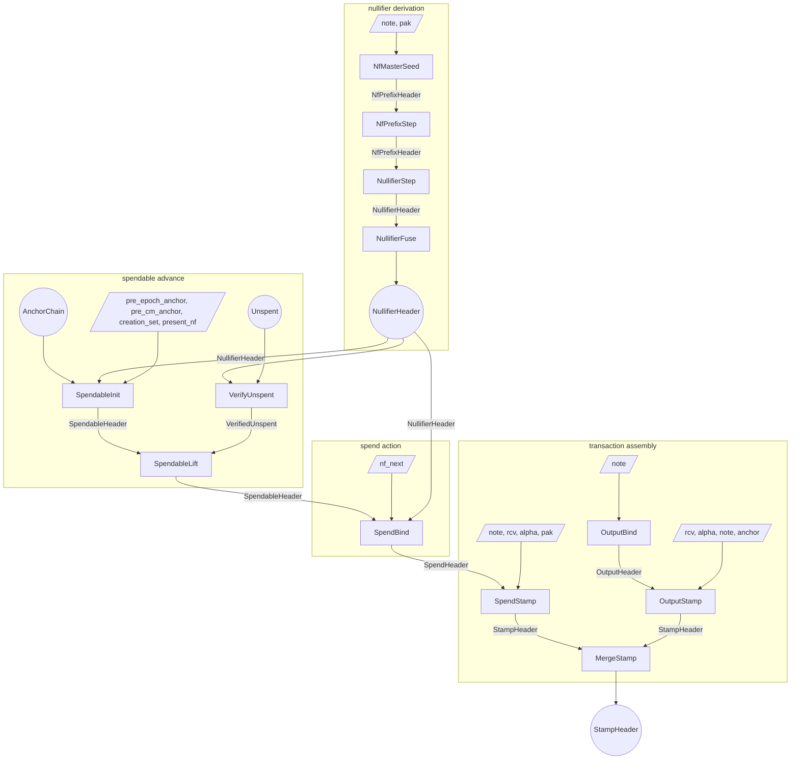
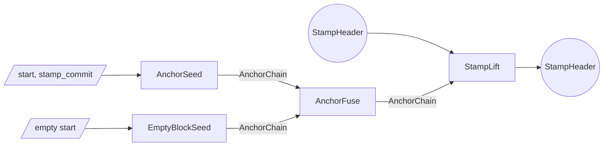
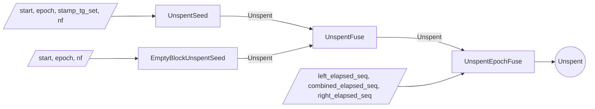

# Proof tree

The Tachyon proof tree is a graph of proof steps.
Each step accepts arbitrary witness inputs and up to two PCD inputs, performs computations and checks constraints, and emits a new PCD.

Multiple parties execute the proof tree.

- A **wallet** holds note data and keys
- A **sync service** holds nullifier values shared by the wallet and pool state proofs
- An **aggregator** merges stamps for pool efficiency

## Lifecycle

### Deriving nullifiers

A wallet proves a contiguous run of its note's nullifiers were correctly GGM-derived[^nullifiers].
`NfMasterSeed` witnesses the note and the proof-authorizing key `pak`, checks `note.pk == pak.derive_payment_key()` (which pins `nk`, and through `nk` the commitment `cm`), derives the master key `mk` and `cm`, and emits an `NfPrefixHeader` carrying `cm`, the master node, depth zero, and leaf index zero.
`NfPrefixStep` descends one tree level on a freely-witnessed chunk: it hashes the node with the chunk and accumulates the chunk into the leaf index, so the leaf a walk reaches is pinned into the index even though each step's chunk is free.
`NullifierStep` turns a depth-complete node into a single-epoch `NullifierHeader`: `cm`, the boundary `(epoch, nf)` pairs (`nf_start` and `nf_end` coincide for a single leaf), and a single-leaf `nf_seq_commit` over the half-open epoch range `[index, index + 1)`.
`NullifierFuse` concatenates two adjacent nullifier sequences into one, requiring the same `cm` and contiguity (`right.epoch_start == left.epoch_end`).
The result is a `NullifierHeader` proving the range `[epoch_start, epoch_end)` commits to the genuine `GGM(mk, ·)` leaves of the note identified by `cm`, surfacing `nf_start` and `nf_end` as its boundary leaves.

### Bootstrapping a spendable

A spendable starts when `SpendableInit` fuses a boundary-rooted `AnchorChain` with the wallet's single-leaf `NullifierHeader` for the starting epoch.
It witnesses `((pre_epoch_anchor, pre_cm_anchor), creation_set, present_nf)`: it binds `present_nf` to the proven leaf by equality (`present_nf == nf_start`, the range spanning the single epoch `[epoch_start, epoch_start + 1)`), takes `cm` from the range header, checks `cm` is among the creation stamp's tachygrams[^tachygrams], requires the chain to root at `pre_epoch_anchor.next_epoch(epoch)`, requires the cm-stamp to be the chain's final link, and emits a `SpendableHeader` carrying `(cm, present_nf, anchor)`.
Rooting the chain at `next_epoch(epoch)` pins the starting GGM leaf index to the consensus epoch: consensus anchor membership of the eventual spend anchor forces the boundary, and hence `epoch`, to be the real creation epoch. Without it a note spent in its creation epoch crosses no boundary, leaving the index a free witness.
The anchor is set initially to the position immediately after the creation stamp and advanced by each lift.

### Maintaining a spendable

Maintaining the spendable means advancing its anchor forward over `Unspent` segments while proving the crossed nullifiers absent.
The sync service produces `Unspent` segments without ever holding the note, its `cm`, or `psi`.
`UnspentSeed` absorbs one stamp at a given absolute epoch and proves a wallet-supplied nullifier was absent from that stamp's tachygram set; the resulting `Unspent` has crossed no epoch boundary, so its `elapsed` is empty and `epoch_start == epoch_end` with `nf_start == nf_end` the tested nullifier.
`EmptyBlockUnspentSeed` covers empty blocks.
`UnspentFuse` composes two contiguous ranges that share a junction epoch (`right.epoch_start == left.epoch_end`): it concatenates their `elapsed` histories and seam-binds the junction nullifier (`left.nf_end == right.nf_start`) at adjacent anchors.
`UnspentEpochFuse` crosses an epoch boundary: it advances the anchor across the boundary and splices the left range's completing tip `nf_end` into `elapsed`, so the crossing count grows by exactly one; either half may itself be a multi-epoch range.
An `Unspent` records its span as two absolute epoch endpoints, `epoch_start` and `epoch_end`; the crossing count is their difference.

`VerifyUnspent` binds a sync-built `Unspent` to genuine derivation. It is wallet-side: it consumes the `Unspent` and a wallet `NullifierHeader` range, and proves the range commits to exactly the `elapsed` crossings followed by the tip `nf_end`, with the range's epochs equal to the `Unspent`'s span. So every crossed nullifier and the tip are proven `GGM(mk, ·)` leaves.
It emits a `VerifiedUnspent` carrying the span's boundary nullifiers and anchors, the end epoch, and the note's `cm`.

`SpendableLift` is wallet-side and witness-free: it consumes a `SpendableHeader` and a `VerifiedUnspent`.
It checks the verified segment's `cm` equals the spendable's (so the absence-proven nullifiers are this note's, and the value cannot drift), the segment's `nf_start` equals the spendable's `present_nf` (continuity), and the segment's `anchor_prev` equals the spendable's anchor (adjacency).
It advances to the segment's `nf_end` and `anchor_last`, threading `cm` unchanged.
A single lift can consume an arbitrarily long composed `Unspent`, including one that crosses many epoch boundaries.

### Spending

To spend, the wallet runs `SpendBind`.
It consumes the `SpendableHeader` and a length-2 `NullifierHeader` range (the live pair for the current and next epochs), and witnesses the next-epoch nullifier `nf_next`.
It requires `range.epoch_end == range.epoch_start + 2` and `range.cm == spendable.cm`, then binds the published pair to the range's boundary leaves by equality: `present_nf == range.nf_start` and `nf_next == range.nf_end`.
Because `present_nf` is threaded from the lineage, the `nf_start` equality forces the range to start at the lineage's current epoch, while `nf_next` is pinned to the genuine end leaf $N_{e+1}$.
Nonzero guards close the `nf == 0` degenerate.
The output `SpendHeader` carries `cm`, the confirmed pair `(present_nf, nf_next)`, and the threaded anchor; it carries no curve points.

`SpendStamp` consumes that `SpendHeader` and witnesses the note and the action fields.
It requires `note.commitment() == cm`, so the witnessed note is the spendable lineage's note: the value commitment `cv` then commits to the minted value[^notes].
It derives the action digest from `cv` and the randomized action key `rk`, and emits a `StampHeader` whose tachygram set contains both nullifiers and whose anchor is threaded from the spend.

An output operation splits the same way, into `OutputBind` and `OutputStamp`.
`OutputBind` witnesses the new note and derives its tachygram pair, the note commitment `cm` and the padding tachygram `pad`, both from the same note fields[^tachygrams]; the resulting `OutputHeader` carries the pair and nothing else.
`OutputStamp` re-witnesses the note against `cm`, adds value-randomness, action-randomness, and an anchor, and emits a single-action `StampHeader` whose tachygram set is the pair. The wallet typically anchors each output at the same height as the transaction's spends so the merge can proceed without an intervening lift.

A transaction with multiple spend and output stamps composes them with `MergeStamp`.
The output is a single `StampHeader` whose multisets are the union of the two inputs' at the shared anchor.

After the transaction stamp is fully composed, the wallet may run `StampLift` over an `AnchorChain` segment to advance the stamp's anchor toward the present tip before publication.

On publication the bundle carries the action descriptors, tachygrams, anchor, and the stamp proof.
Validators reconstruct the action-set and tachygram-set commitments from those published bundles, check the proof against the reconstructed values, and confirm the anchor against the consensus chain.

After publication, an aggregator combines `StampHeader`s from independently-proven bundles into a single **aggregate**[^aggregation] whose proof can stand in for many transactions' worth of stamps, cutting per-transaction verification cost downstream.
Each input is anchored at whatever height its wallet chose, so the aggregator obtains an `AnchorChain` segment per input and runs `StampLift` to bring every input onto a common later anchor.
`MergeStamp` then fuses the aligned stamps pairwise into a single `StampHeader` whose multisets are the union of all the inputs'.
The aggregated stamp has the same shape as any other, so it is itself eligible for further aggregation; aggregators stack to fold many published transactions into one stamp, and miners typically integrate the aggregator role into block production.

## Roles

The wallet runs every step that touches the note's commitment or master key.
It seeds and walks the private GGM tree (`NfMasterSeed`, `NfPrefixStep`, `NullifierStep`, `NullifierFuse`), derives spendable status from its own leaf (`SpendableInit`), binds and lifts over sync-built segments (`VerifyUnspent`, `SpendableLift`), and produces spend and output stamps (`SpendBind`, `SpendStamp`, `OutputBind`, `OutputStamp`).

The sync service holds the per-epoch nullifier values the wallet shared and pool history.
It produces the `Unspent` segments that carry the spendable forward (`UnspentSeed`, `EmptyBlockUnspentSeed`, `UnspentFuse`, `UnspentEpochFuse`) and hands the composed segment to the wallet to bind and lift over; it never sees a note, `cm`, `psi`, or `mk`.

The aggregator works only with published `StampHeader`s.
It aligns anchors with `StampLift` over `AnchorChain` segments (`AnchorSeed`, `EmptyBlockSeed`, `AnchorFuse`) and fuses with `MergeStamp`.

| step | wallet | sync service | aggregator |
| ---- | ------ | ------------ | ---------- |
| AnchorSeed | possible | yes | yes |
| EmptyBlockSeed | possible | yes | yes |
| AnchorFuse | possible | yes | yes |
| UnspentSeed | possible | yes | no |
| EmptyBlockUnspentSeed | possible | yes | no |
| UnspentFuse | possible | yes | no |
| UnspentEpochFuse | possible | yes | no |
| NfMasterSeed | yes | no | no |
| NfPrefixStep | yes | no | no |
| NullifierStep | yes | no | no |
| NullifierFuse | yes | no | no |
| VerifyUnspent | yes | no | no |
| SpendableInit | yes | no | no |
| SpendableLift | yes | no | no |
| SpendBind | yes | no | no |
| OutputBind | yes | no | no |
| OutputStamp | yes | no | no |
| SpendStamp | yes | no | no |
| MergeStamp | yes | no | yes |
| StampLift | yes | possible | yes |

## Soundness

The subsections below walk each subtree bottom-up: the chain segments that act as primitives, then the `Unspent` segments and the derivation chain that consume them, then the binding at `VerifyUnspent`, the spendable lineage, then spend binding and stamps.

### Anchor segments

`AnchorSeed`, `EmptyBlockSeed`, `UnspentSeed`, and `EmptyBlockUnspentSeed` each witness an `anchor_prev` and prove one anchor step.
`AnchorFuse` composes adjacent segments by checking endpoint equality; `UnspentFuse` additionally concatenates the two halves' `elapsed` histories.
A segment ties to real chain history only through a consensus-published stamp whose anchor matches an end-of-block value: `StampLift` emits that stamp directly, while a segment consumed by `SpendableInit` produces a private spendable whose anchor reaches consensus only once it is spent into a stamp.

### Unspent composition

An `Unspent` is a contiguous range bracketed by `anchor_prev` and `anchor_last`, with boundary pairs `(epoch_start, nf_start)` and `(epoch_end, nf_end)`, plus `elapsed` (one nullifier coefficient per epoch-boundary crossing in its span, forward-chronological, terminated by a sentinel coefficient $1$ at the crossing count)[^nullifiers]. `nf_start`/`nf_end` are the nullifiers at `epoch_start`/`epoch_end`; the crossing count is `epoch_end - epoch_start`.
The sentinel keeps the committed polynomial nonzero for every sequence, so the commitment never falls on the identity point, which the in-circuit point representation cannot hold; it also pins the sequence's exact length, which commit-equality alone bounds only from above.
`UnspentSeed` and `EmptyBlockUnspentSeed` produce within-epoch `Unspent`s for one stamp's worth of anchor advance: `elapsed` is empty (the sentinel constant $1$, committing to $\mathcal{G}_0$), `epoch_start == epoch_end`, and the nullifier they just non-membership-checked is both `nf_start` and `nf_end`.
`UnspentFuse` composes two contiguous ranges sharing a junction epoch (`right.epoch_start == left.epoch_end`) at adjacent anchors (`left.anchor_last == right.anchor_prev`): it concatenates their histories and seam-binds the junction nullifier (`left.nf_end == right.nf_start`). Writing $s$ for the left crossing count, the concat confirms

$$C(X) = L(X) + X^{s}\,(R(X) - 1)$$

for the witnessed `combined` $C$, left $L$, and right $R$, at a Fiat-Shamir challenge: the $-1$ cancels the left half's sentinel at degree $s$, the right half's first crossing takes its slot, and the right half's sentinel re-terminates the combined sequence; the seam-bind makes the shared junction epoch's nullifier unambiguous across the merge.
`UnspentEpochFuse` crosses an epoch boundary: it witnesses the two halves' nullifier polynomials and the combined result, advances the anchor via the cross-epoch domain, and splices the left range's completing tip between them.
Writing $p$ for the left tip `nf_end`, the splice confirms

$$C(X) = L(X) + X^{s}\,(p - 1) + X^{s+1}\,R(X)$$

at a Fiat-Shamir challenge: the spliced tip overwrites the left half's sentinel and the right half's sentinel re-terminates the combined sequence.
$L$ and $R$ are bound by the recursive verification of the two input PCDs, and the scalar $p$ is a left-header value bound likewise, all before the challenge; because the identity is linear in $L$, $R$, and $p$, that prior binding is what makes the splice sound.
The crossing epoch is the right half's `epoch_start`, which must be exactly one past the left tip, and folding it into the boundary anchor via the cross-epoch domain consensus-ties the absolute epoch.

### Derivation chain

`NfMasterSeed` is the chain's only seed. It binds the master key to the note: `note.pk == pak.derive_payment_key()` pins `nk`, and the note commitment digests `nk` (through `pk`) and `psi`, so the derived `mk = Poseidon(psi, nk)` is consistent with the `cm` the seed threads forward.
`NfPrefixStep` is a genuine `Poseidon` hash of the node with a free chunk, accumulating the chunk into the leaf index; the index pins which leaf a walk reaches even though chunks are free.
`NullifierStep` builds its single-leaf range commitment homomorphically, $[\texttt{nf}]\,\mathcal{G}_0 + \mathcal{G}_1$ ($\mathcal{G}_1$ carries the sentinel), not from a fabricated polynomial.
`NullifierFuse` witnesses the two nullifier sequences and their concatenation, binds each by commit-equality, and confirms the concat at the constant offset `left.epoch_end - left.epoch_start`, requiring the same `cm` and contiguity.
So a `NullifierHeader` is a sound proof that a contiguous epoch range commits to the genuine leaves of the note identified by `cm`.

### Verifying unspent against derivation

`VerifyUnspent` consumes the sync's `Unspent` and the wallet's `NullifierHeader`.
It witnesses the `elapsed` sequence and the range sequence, binds each by commit-equality (`elapsed` to the `Unspent` header, the range to the `NullifierHeader`), and appends the header's tip scalar `nf_end`, confirming

$$R(X) = E(X) + X^{s}\,(\texttt{nf\_end} - 1) + X^{s+1}$$

for the range $R$, elapsed $E$, and crossing count $s$, at a Fiat-Shamir challenge: the appended tip overwrites `elapsed`'s sentinel and the trailing term re-terminates the range. The tip scalar is a left-header value, fixed by the recursive verification of the `Unspent` PCD before the challenge.
With the range epochs pinned to the `Unspent`'s span (`range.epoch_start == epoch_start`, `range.epoch_end == epoch_end + 1`), this proves the crossings and the tip are exactly the derived `GGM(mk, ·)` leaves: the tip nullifier is a genuine leaf, not a free value.
It binds the span's boundary nullifiers to the range's genuine boundary leaves by equality (`nf_start` and `nf_end`), and threads the range's `cm`.

### Spendable lineage

`SpendableInit` is the lineage's only seed and is wallet-only.
It witnesses the note's fields, the creation stamp's tachygrams, the anchor running into the creation stamp, and the starting-epoch nullifier `present_nf`.
It derives `cm` and binds the note to the pool (`cm` in `creation_set`), which pins the whole note to the real minted note.
It emits `SpendableHeader(cm, present_nf, anchor)`.
`present_nf` is unconstrained here; the first lift requires it to equal a `VerifiedUnspent`'s `nf_start`, a genuine leaf, pinning it to the note's starting nullifier at the consensus-tied starting epoch.

`SpendableLift` advances the lineage over a `VerifiedUnspent` and is witness-free.
It threads `cm` by equality (`verified.cm == spendable.cm`), so every consumed segment belongs to the lineage's one note and the spent value cannot drift to a different same-`mk` note.
Continuity holds through nullifier values: `verified.nf_start == spendable.present_nf`.
Both are `GGM(mk, ·)` PRF outputs, so value-equality forces the same note and the same epoch; combined with the tip binding at `VerifyUnspent` (which makes each new `present_nf` itself a genuine leaf), a lineage cannot skip an epoch or splice in another note.
The anchor adjacency check (`verified.anchor_prev == spendable.anchor`) welds the segment to the lineage's current position.

### Spend binding

Spending a note publishes two nullifiers, one for the current epoch and one for the next, both pinned to the note's genuine leaves.
`SpendBind` consumes the `SpendableHeader` and a length-2 `NullifierHeader` range, witnesses `nf_next`, and requires the range to span exactly two epochs with `range.cm == spendable.cm`.
It binds the published pair to the range's boundary leaves by equality (`present_nf == range.nf_start`, `nf_next == range.nf_end`): `present_nf` is threaded from the lineage, so the `nf_start` equality forces the range to start at the lineage's current epoch, and `nf_next` is pinned to the genuine `nf_end` leaf.
Each published nullifier must be nonzero, or it would collide with the note's own `cm` in the tachygram scan.
No note witness is needed here: the range and the lineage are already tied to the same note by their two `cm` fields, bound where the range was derived and at `SpendableInit` respectively.
The output `SpendHeader` threads `cm`, the confirmed pair, and the anchor, and carries no curve points.

`SpendStamp` completes the publication: it re-witnesses the note against the header's `cm`, derives the value commitment `cv` and the randomized action key `rk`, and commits the one-action set alongside the two-element tachygram set.
Requiring `note.commitment() == cm` rejects a phantom note reusing the same `psi`, and so the same nullifiers, while carrying a different value and hence a different `cm`.
The note is witnessed only in this terminal step, so it never propagates.

The two complementary `cm` checks pin value two independent ways. `cm == note.commitment()` ties `cm` to the note by `Poseidon` collision-resistance (the spender must know `rcm`, `pk`, `value`, `psi`). `spendable.cm == cm` ties it to the lineage, which the creation stamp proved minted. Together they bind the action's value commitment to the note actually being spent. Publishing both nullifiers lets consensus apply the spend across an epoch transition that may occur between proof construction and inclusion.

The note's age never becomes public. The lineage carries only a single current nullifier, not a polynomial with a consumed offset, and the published pair sits at the constant epochs of the live range, so no step reads a position that would leak how long the note has existed.

### Stamp construction

A stamp commits to two multisets, an action-digest set and a tachygram set[^tachygrams].
`OutputBind` derives the output's tachygram pair from one note, the commitment `cm` and the padding tachygram `pad`, so both are fixed before any action material exists. Each is nonzero-guarded, and the pad's preimage is the note opening rather than `cm`, which is what stops an observer pairing the two off in the published set[^tachygrams].
`OutputStamp` then derives a value commitment, action verification key, and action digest from a re-witnessed note, value-randomness, and action-randomness; constraints tie the note to the header's `cm` and reject over-range note values. No key material is witnessed: an output's `rk` is a fresh randomizer's public key, and the recipient's payment key rides inside `cm` where the sender cannot be asked to prove anything about it[^keys].
`SpendStamp` mirrors it on the spend side: it re-witnesses the note against the `SpendHeader`'s `cm`, derives the value commitment, action verification key, and action digest, and emits a stamp whose one-action digest set, two-nullifier tachygram set, and threaded anchor follow. The nullifier pair it publishes was already confirmed against the covering range at `SpendBind`.
`MergeStamp` fuses two stamps by checking anchor equality and confirming each output set is the union of the two inputs': it witnesses the merged sets and enforces, for each, that the merged set polynomial is the product of the input set polynomials.

### Stamp anchor

`OutputStamp` is the only stamp-producing step that takes an anchor as direct witness: an output operation has no prior chain state to thread from.
The other stamp-producing steps thread the anchor from a validated spendable through `SpendBind`/`SpendStamp`, equality-constrain the two inputs' anchors (`MergeStamp`), or advance over an `AnchorChain` segment whose start matches the stamp's prior anchor (`StampLift`).
Consensus verifies the published anchor against the chain before accepting the stamp.

### Rerandomization at trust boundaries

Every stamp-producing step rerandomizes its proof before releasing it: `prove_output`, `prove_spend`, and `prove_merge` each rerandomize the PCD they built. This is obligatory rather than cosmetic.

A PCD proof is a commitment to its own witness data. Two proofs built from overlapping private inputs are correlated as group elements, even when their public headers reveal nothing. The proof a wallet holds after `SpendBind` and the proof it publishes in a stamp share a lineage, so an observer holding both could link them, and an aggregator that merges two stamps sees both inputs directly.

A stamp crosses a trust boundary at exactly these points. A wallet hands an autonome to the p2p network; an aggregator hands a merged stamp onward while retaining the inputs it merged. Rerandomizing at each handoff replaces the proof with an unrelated one that verifies against the same header, so the released artifact carries no correlation back to the private lineage that produced it, and none forward to a later release of the same lineage.

The rule is that a proof leaving the process that built it is rerandomized first. Intermediate PCDs that stay inside a wallet, such as a derivation window or an `Unspent` segment, do not need it: nothing outside the wallet ever observes them.

## Simple transaction

A transaction with one spend and one output, where the spendable was bootstrapped in a previous epoch and lifted over an `Unspent` crossing an epoch boundary before the spend.

```mermaid
flowchart TB
  subgraph derive [nullifier derivation]
    w_seed[/note, pak/]
    s_seed[NfMasterSeed]
    s_walk[NfPrefixStep]
    s_leaf[NullifierStep]
    s_dfuse[NullifierFuse]
    nf_range((NullifierHeader))
  end

  subgraph spendable [spendable advance]
    w_init[/pre_epoch_anchor, pre_cm_anchor, creation_set, present_nf/]
    anchor_init((AnchorChain))
    s_init[SpendableInit]
    unspent_in((Unspent))
    s_verify[VerifyUnspent]
    s_lift[SpendableLift]
  end

  subgraph spend_action [spend action]
    w_bind[/nf_next/]
    s_bind[SpendBind]
  end

  subgraph merge [transaction assembly]
    w_stamp[/note, rcv, alpha, pak/]
    s_spendstamp[SpendStamp]
    w_outbind[/note/]
    s_outbind[OutputBind]
    w_output[/rcv, alpha, note, anchor/]
    s_output[OutputStamp]
    s_merge[MergeStamp]
  end

  stamp_out((StampHeader))

  w_seed --> s_seed
  s_seed -->|NfPrefixHeader| s_walk
  s_walk -->|NfPrefixHeader| s_leaf
  s_leaf -->|NullifierHeader| s_dfuse
  s_dfuse --> nf_range

  anchor_init --> s_init
  nf_range -->|NullifierHeader| s_init
  w_init --> s_init
  nf_range --> s_verify
  unspent_in --> s_verify
  s_init -->|SpendableHeader| s_lift
  s_verify -->|VerifiedUnspent| s_lift
  s_lift -->|SpendableHeader| s_bind

  w_bind --> s_bind
  nf_range -->|NullifierHeader| s_bind
  s_bind -->|SpendHeader| s_spendstamp
  w_stamp --> s_spendstamp

  w_outbind --> s_outbind
  s_outbind -->|OutputHeader| s_output
  w_output --> s_output
  s_spendstamp -->|StampHeader| s_merge
  s_output -->|StampHeader| s_merge
  s_merge --> stamp_out
```

The single `SpendableLift` consumes one composed `VerifiedUnspent` (potentially crossing many epoch boundaries); threading `cm` chains the lineage's binding to the note through every advance.

## Focused subgraphs

### Stamp anchor advance

```mermaid
flowchart LR
  sh_in((StampHeader))
  w_seed[/start, stamp_commit/]
  s_seed[AnchorSeed]
  w_fuse[/empty start/]
  s_empty[EmptyBlockSeed]
  s_fuse[AnchorFuse]
  s_lift[StampLift]
  sh_out((StampHeader))

  w_seed --> s_seed
  w_fuse --> s_empty
  s_seed -->|AnchorChain| s_fuse
  s_empty -->|AnchorChain| s_fuse
  sh_in --> s_lift
  s_fuse -->|AnchorChain| s_lift
  s_lift --> sh_out
```

### Unspent composition across epochs

```mermaid
flowchart LR
  w_seed[/start, epoch, stamp_tg_set, nf/]
  s_useed[UnspentSeed]
  w_empty[/start, epoch, nf/]
  s_uempty[EmptyBlockUnspentSeed]
  s_ufuse[UnspentFuse]
  w_efuse[/left_elapsed_seq, combined_elapsed_seq, right_elapsed_seq/]
  s_efuse[UnspentEpochFuse]
  unspent_out((Unspent))

  w_seed --> s_useed
  w_empty --> s_uempty
  s_useed -->|Unspent| s_ufuse
  s_uempty -->|Unspent| s_ufuse
  s_ufuse -->|Unspent| s_efuse
  w_efuse --> s_efuse
  s_efuse --> unspent_out
```

## Headers

| Header | Fields |
| ------ | ------ |
| AnchorChain | (start, end) |
| Unspent | (anchor_prev, (epoch_start, nf_start), elapsed, (epoch_end, nf_end), anchor_last) |
| VerifiedUnspent | (cm, anchor_prev, (epoch_start, nf_start), (epoch_end, nf_end), anchor_last) |
| NfPrefixHeader | (cm, node, depth, index) |
| NullifierHeader | (cm, (epoch_start, nf_start), nf_seq_commit, (epoch_end, nf_end)) |
| SpendableHeader | (cm, present_nf, anchor) |
| OutputHeader | (cm, pad) |
| SpendHeader | (cm, present_nf, nf_next, anchor) |
| StampHeader | (action_commit, tachygram_commit, anchor) |

## Steps

| Step | Left | Right | Witness | Output |
| ---- | ---- | ----- | ------- | ------ |
| AnchorSeed | — | — | start, epoch, stamp_commit | AnchorChain |
| EmptyBlockSeed | — | — | start, epoch | AnchorChain |
| AnchorFuse | AnchorChain | AnchorChain | — | AnchorChain |
| UnspentSeed | — | — | anchor_prev, (epoch, nf), stamp_tg_set | Unspent |
| EmptyBlockUnspentSeed | — | — | anchor_prev, (epoch, nf) | Unspent |
| UnspentFuse | Unspent | Unspent | left_elapsed_seq, combined_elapsed_seq, right_elapsed_seq | Unspent |
| UnspentEpochFuse | Unspent | Unspent | left_elapsed_seq, combined_elapsed_seq, right_elapsed_seq | Unspent |
| VerifyUnspent | Unspent | NullifierHeader | elapsed_seq, nf_seq | VerifiedUnspent |
| NfMasterSeed | — | — | note, pak | NfPrefixHeader |
| NfPrefixStep | NfPrefixHeader | — | chunk | NfPrefixHeader |
| NullifierStep | NfPrefixHeader | — | — | NullifierHeader |
| NullifierFuse | NullifierHeader | NullifierHeader | left_seq, merged_seq, right_seq | NullifierHeader |
| SpendableInit | AnchorChain | NullifierHeader | (pre_epoch_anchor, pre_cm_anchor), creation_set, present_nf | SpendableHeader |
| SpendableLift | SpendableHeader | VerifiedUnspent | — | SpendableHeader |
| SpendBind | SpendableHeader | NullifierHeader | nf_next | SpendHeader |
| OutputBind | — | — | note | OutputHeader |
| OutputStamp | OutputHeader | — | rcv, alpha, note, anchor | StampHeader |
| SpendStamp | SpendHeader | — | note, rcv, alpha, pak | StampHeader |
| MergeStamp | StampHeader | StampHeader | (action_set, tachygram_set) × left, merged, right | StampHeader |
| StampLift | StampHeader | AnchorChain | — | StampHeader |

[^nullifiers]: See [Nullifiers](./nullifiers.md) for the GGM derivation, the scalar `psi` seed, and the re-based absence sequence.
[^tachygrams]: See [Tachygrams](./tachygrams.md) for the per-stamp multiset polynomial and its Pedersen commitment.
[^notes]: See [Notes](./notes.md) for the four-field note structure and its commitment.
[^keys]: See [Keys](./keys.md) for the wallet key hierarchy and the per-action derivations.
[^aggregation]: See [Aggregation](./aggregation.md) for the autonome/aggregate/adjunct lifecycle and the miner-side stripping that realizes the chain-cost reduction.
