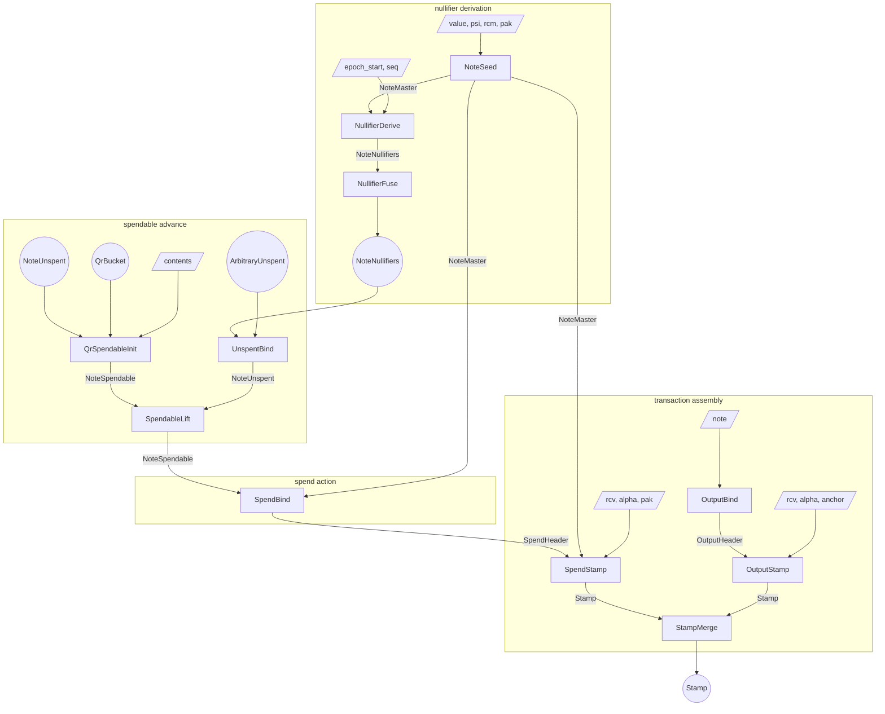
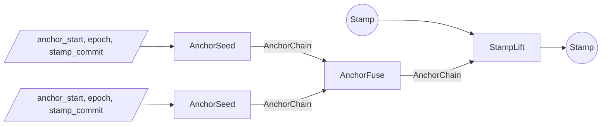
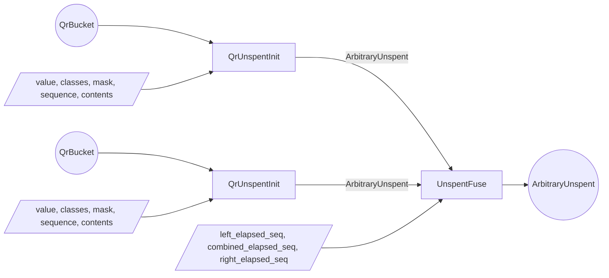

# Proof tree

The Tachyon proof tree is a graph of proof steps.
Each step accepts arbitrary witness inputs and up to two PCD inputs, performs computations and checks constraints, and emits a new PCD.

Multiple parties execute the proof tree.

- A **wallet** holds note data and keys
- A **sync service** holds nullifier values shared by the wallet and pool state proofs
- An **aggregator** merges stamps for pool efficiency

## Lifecycle

### Deriving nullifiers

A wallet proves a window of its note's nullifiers were correctly derived[^nullifiers].
`NoteSeed` witnesses the note's value and trapdoors and the proof-authorizing key `pak`, derives the note's payment key from `pak` (which pins `nk`, and through `nk` the commitment `cm`), derives the master key `mk` and `cm`, and emits a `NoteMaster` carrying `(cm, note, mk)`. `nk` never leaves the step.
`NullifierDerive` consumes that seed. It witnesses the window's start epoch (constrained group-aligned) and its sequence, runs four sponges over $(\texttt{Tachyon-NfDerive}, \mathsf{mk}, w)$ to squeeze the window's 16 nullifiers natively, and binds the sequence to them with one opening at a free challenge (below). It exports the whole window, so the range it announces is derived rather than witnessed.
`NullifierFuse` concatenates two adjacent nullifier sequences into one, requiring the same `cm` and contiguity (`right.epoch_start == left.epoch_end + 1`).
The result is a `NoteNullifiers` proving the range `[epoch_start, epoch_end]` commits to the genuine nullifiers of the note identified by `cm`, one factor per covered epoch.

### Bootstrapping a spendable

A spendable starts when `SpendableInit` consumes a `NoteNullifiers`.
It witnesses `(anchor_prev, creation_set, creation_epoch)`. It takes `cm` from the range header, checks `cm` is among the creation stamp's tachygrams[^tachygrams], and emits a `NoteSpendable` carrying `(cm, creation_epoch, anchor)` with `anchor = anchor_prev.next_stamp(creation_epoch, creation_commit)`, the position immediately after the creation stamp, advanced by each lift.
`anchor_prev` is a free witness, so the anchor binds only downstream: lift adjacency threads it to the eventual spend anchor, which consensus checks for chain membership, and a chain node's preimage fixes the real predecessor, the real creation epoch, and the real cm-stamp.

### Maintaining a spendable

A spendable from `SpendableInit` spends within its creation epoch. Carrying a note into later epochs means advancing its anchor forward over `ArbitraryUnspent` segments while proving the crossed nullifiers absent.
The sync service produces `ArbitraryUnspent` segments without ever holding the note, its `cm`, or `psi`: the values a segment tests are arbitrary field elements as far as its own proof is concerned, and only `UnspentBind` attributes them to a derivation.

A `Summary` folds a run of one epoch's stamps into one accumulator alongside the anchor (`SummarySeed`, `SummaryAdvance`); summaries are note-independent, so anyone can build them.
Summaries and single stamps root an epoch's QR evidence.
Once per epoch a builder routes every published tachygram into buckets by quadratic-residue profile (`QrSummaryIntake`, `QrStampIntakeSeed`, `QrEmptyIntakeSeed`, `QrIntakeSplit`, `QrSideDescend`, `QrIntakeMerge`, `QrBucketSeal`).
A nullifier has one profile, so it can have been published in only one bucket, and one exclusion opening on that bucket proves it absent from the epoch (`QrUnspentInit`).
Every `ArbitraryUnspent` starts that way, and runs from one entry anchor to the next.
A segment's `elapsed` holds one member per epoch in `[epoch_start, epoch_end)`: its only fold in `epoch_end` is the crossing into it, which absorbs no tachygrams, so that epoch's nullifier is the next segment's to test.
`UnspentFuse` composes two segments meeting at an entry anchor and concatenates their `elapsed` histories.
An epoch that published nothing seals an empty bucket, so its segment is as cheap as any other.
`QrSpendableInit` starts a wallet's spendable from the bucket holding its note's creation, over the note's own QR segment for that epoch.
A builder that keeps an epoch's buckets folds them into one `EvidenceTree` and retains a single proof for its root, replaying a bucket on demand from a quaternary Merkle path (`EvidenceTreeLeaf`, `EvidenceTreeLeafPair`, `EvidenceTreePairFuse`, `EvidenceTreeFuse`, `EvidenceTreeCap`, `EvidenceTreeDescend`, `EvidenceTreeOpen`).
The evidence is note-independent and rebuildable from public data alone.

`UnspentBind` is wallet-side. It consumes the sync-built `ArbitraryUnspent` and a `NoteNullifiers`, and divides `elapsed` out of the derivation's sequence, so every factor of `elapsed` is a genuine nullifier of the note at its own epoch.
It emits a `NoteUnspent` carrying the span's anchors and epochs, and the note's `cm`.

`SpendableLift` is wallet-side and witness-free: it consumes a `NoteSpendable` and a `NoteUnspent`.
It checks the verified segment's `cm` equals the spendable's (so the absence-proven nullifiers are this note's, and the value cannot drift), the segment's `epoch_start` equals the spendable's `epoch_current` (continuity), and the segment's `anchor_prev` equals the spendable's anchor (adjacency).
It advances to the segment's `epoch_end` and `anchor_end`, threading `cm` unchanged.
A single lift can consume an arbitrarily long composed `ArbitraryUnspent`, including one that crosses many epoch boundaries.

### Spending

To spend, the wallet runs `SpendBind`.
It consumes the `NoteSpendable` and the note's `NoteMaster`, and requires `master.cm == spendable.cm`.
It derives the pair `(nf_current, nf_next)` from the master's `mk`, at the lineage's epoch and the epoch after it.
Nonzero guards close the `nf == 0` degenerate.
The output `SpendHeader` carries `cm`, the derived pair `(nf_current, nf_next)`, and the threaded anchor; it carries no curve points.

`SpendStamp` consumes that `SpendHeader` on the left and the note's `NoteMaster` on the right, witnessing only the action fields.
It requires `master.cm == cm`, so the note on the master header is the spendable lineage's note: the value commitment `cv` then commits to the minted value[^notes].
It derives the action digest from `cv` and the randomized action key `rk`, and emits a `Stamp` whose tachygram set contains both nullifiers and whose anchor is threaded from the spend.

An output operation splits the same way, into `OutputBind` and `OutputStamp`.
`OutputBind` witnesses the new note and derives its tachygram pair, the note commitment `cm` and the padding tachygram `pad`, both from the same note fields[^tachygrams]; the resulting `OutputHeader` carries the pair and the note's value.
`OutputStamp` reads the value off that header, adds value-randomness, action-randomness, and an anchor, and emits a single-action `Stamp` whose tachygram set is the pair. The wallet typically anchors each output at the same height as the transaction's spends so the merge can proceed without an intervening lift.

A transaction with multiple spend and output stamps composes them with `StampMerge`.
The output is a single `Stamp` whose multisets are the union of the two inputs' at the shared anchor.

After the transaction stamp is fully composed, the wallet may run `StampLift` over an `AnchorChain` segment to advance the stamp's anchor toward the chain's latest anchor before publication.

On publication the bundle carries the action descriptors, tachygrams, anchor, and the stamp proof.
Validators reconstruct the action-set and tachygram-set commitments from those published bundles, check the proof against the reconstructed values, and confirm the anchor against the consensus chain.

After publication, an aggregator combines `Stamp`s from independently-proven bundles into a single **aggregate**[^aggregation] whose proof can stand in for many transactions' worth of stamps, cutting per-transaction verification cost downstream.
Each input is anchored at whatever height its wallet chose, so the aggregator obtains an `AnchorChain` segment per input and runs `StampLift` to bring every input onto a common later anchor.
`StampMerge` then fuses the aligned stamps pairwise into a single `Stamp` whose multisets are the union of all the inputs'.
The aggregated stamp has the same shape as any other, so it is itself eligible for further aggregation; aggregators stack to fold many published transactions into one stamp, and miners typically integrate the aggregator role into block production.

## Roles

The wallet runs every step that touches the note's commitment or master key.
It derives its nullifier windows (`NoteSeed`, `NullifierDerive`, `NullifierFuse`), derives spendable status from its own derivation (`SpendableInit`, `QrSpendableInit`), binds and lifts over sync-built segments (`UnspentBind`, `SpendableLift`), and produces spend and output stamps (`SpendBind`, `SpendStamp`, `OutputBind`, `OutputStamp`).

The sync service holds the per-epoch nullifier values the wallet shared and pool history.
It builds summaries (`SummarySeed`, `SummaryAdvance`), routes each epoch's tachygrams into QR evidence (`QrSummaryIntake`, `QrStampIntakeSeed`, `QrEmptyIntakeSeed`, `QrIntakeSplit`, `QrSideDescend`, `QrIntakeMerge`, `QrBucketSeal`), folds the sealed buckets into one tree and opens it per query (`EvidenceTreeLeaf`, `EvidenceTreeLeafPair`, `EvidenceTreePairFuse`, `EvidenceTreeFuse`, `EvidenceTreeCap`, `EvidenceTreeDescend`, `EvidenceTreeOpen`), and produces the `ArbitraryUnspent` segments that carry the spendable forward (`QrUnspentInit` over one bucket, `UnspentFuse` across epochs), then hands the composed segment to the wallet to bind and lift over; it never sees a note, `cm`, `psi`, or `mk`.

The aggregator works only with published `Stamp`s.
It aligns anchors with `StampLift` over `AnchorChain` segments (`AnchorSeed`, `AnchorFuse`) and fuses with `StampMerge`.

| step | wallet | sync service | aggregator |
| ---- | ------ | ------------ | ---------- |
| AnchorSeed | possible | yes | yes |
| AnchorFuse | possible | yes | yes |
| SummarySeed | possible | yes | no |
| SummaryAdvance | possible | yes | no |
| QrSummaryIntake | possible | yes | no |
| QrStampIntakeSeed | possible | yes | no |
| QrEmptyIntakeSeed | possible | yes | no |
| QrIntakeMerge | possible | yes | no |
| QrIntakeSplit | possible | yes | no |
| QrBucketSeal | possible | yes | no |
| EvidenceTreeLeaf | possible | yes | no |
| EvidenceTreeLeafPair | possible | yes | no |
| EvidenceTreePairFuse | possible | yes | no |
| EvidenceTreeFuse | possible | yes | no |
| EvidenceTreeCap | possible | yes | no |
| EvidenceTreeDescend | possible | yes | no |
| EvidenceTreeOpen | possible | yes | no |
| QrSideDescend | possible | yes | no |
| QrUnspentInit | possible | yes | no |
| UnspentFuse | possible | yes | no |
| NoteSeed | yes | no | no |
| NullifierDerive | yes | no | no |
| NullifierFuse | yes | no | no |
| UnspentBind | yes | no | no |
| SpendableInit | yes | no | no |
| QrSpendableInit | yes | no | no |
| SpendableLift | yes | no | no |
| SpendBind | yes | no | no |
| OutputBind | yes | no | no |
| OutputStamp | yes | no | no |
| SpendStamp | yes | no | no |
| StampMerge | yes | no | yes |
| StampLift | yes | possible | yes |

## Soundness

The subsections below walk each subtree bottom-up.

### Anchor segments

`AnchorSeed`, `SummarySeed`, and `QrStampIntakeSeed` each witness a predecessor anchor and prove one anchor step from it, and the fuses compose adjacent segments by checking endpoint equality.
A segment ties to real chain history only through a consensus-published stamp whose anchor matches an end-of-block value, emitted at `StampLift`. `SpendableInit`'s anchor closes the same way without a segment: the private spendable's anchor reaches consensus once it is spent into a stamp.

### ArbitraryUnspent composition

An `ArbitraryUnspent` is a coverage extent `(anchor_prev, anchor_end]` between two entry anchors, labelled `epoch_start` and `epoch_end`, plus `elapsed`: the product of one indexed cubic factor per epoch in `[epoch_start, epoch_end)`[^nullifiers].
The segment's only fold in `epoch_end` is the crossing into it, which absorbs no tachygrams, so that epoch has nothing to test.
Each factor carries its own epoch, so the product is a multiset of `(epoch, nullifier)` pairs and needs no degree pin. Every producer holds the two properties that `UnspentBind` relies on: each factor's epoch lies in `[epoch_start, epoch_end)`, and each such epoch has exactly one factor.
`QrUnspentInit` is the only seed. It pins its one-factor product against the value it tests, at a challenge absorbing the sequence commitment and a scalar-binding point of the value.
`UnspentFuse` composes two segments at one entry anchor (`left.anchor_end == right.anchor_prev`), labelled with one epoch (`right.epoch_start == left.epoch_end`), confirming

$$C(X) = L(X) \cdot R(X)$$

for the witnessed `combined` $C$, left $L$, and right $R$. The halves hold disjoint epochs, so their product holds each epoch once. The recursive verification of the two input PCDs binds $L$ and $R$ before the challenge.

### Summaries

A `Summary` carries `(epoch, anchor_prev, anchor_end, acc_commit)`: a run of one epoch's stamps whose tachygram sets fold into one accumulator while the anchor absorbs the same commitments.
`SummarySeed` is `AnchorSeed` with the stamp's set commitment carried on the header.
`SummaryAdvance` binds the witnessed accumulator to the header by commit-equality, checks `extended = acc * stamp` at a challenge, and advances `anchor_end` by the same `stamp.commit()`.
The product of two root polynomials is the root polynomial of the multiset union, and consensus forbids republishing a tachygram within two epochs, so the accumulator is square-free.
Where a summary starts and stops is prover-chosen: a consumer splices summaries by anchor equality and passes through every stamp link regardless.

Summaries root unbound like every seed. The QR evidence built on them closes through the bucket seal's crossing, where consensus anchor membership forces every spliced link.

### QR epoch evidence

An epoch's evidence partitions its tachygrams by a sequence of quadratic tests.
The builder samples the first discriminant $R_0$ privately; every QR header carries it, and the discriminants progress by one from it,

$$R_j = R_0 + j \quad (j = 0, \ldots, 31).$$

A value takes the residue side at depth $j$ when $x + R_j$ is a square or zero.
A private $R_0$ is what lets a network be routed while its epoch is still in flight: a builder opens one, keeps $R_0$ and its intake headers unpublished until the epoch closes, and publishes the sealed buckets after.
Choosing $R_0$ moves how members distribute across buckets, never which bucket holds a given value under that $R_0$, so a biased or prematurely revealed $R_0$ affects only that builder's buckets, and a wallet can use any valid network.
Honest depth is $\log_2$ of the bucket count and stays below 26 at any proposed throughput; the 32-position register is a width, not a security parameter[^balance].
A profile is the string of sides on the path to a bucket.

`QrSummaryIntake` starts a `QrIntake` from a `Summary` at depth zero, `QrStampIntakeSeed` starts one from a single stamp directly, `QrEmptyIntakeSeed` starts an empty one over an epoch that published no stamp, and `QrIntakeMerge` joins two intakes of one epoch, discriminant and profile whose spans meet, so spans compose as anchor segments do.
`QrIntakeSplit` factors an intake's contents into two sides at $R = R_0 + \mathsf{depth}$ as `QrIntakeSides`, and `QrSideDescend` extracts one side while attesting the other at its class multiplier $c$:

$$u(X)^2 - c\,(X + R) = s(X)\, h(X)$$

holds only when every root of the sibling $s$ takes its side at $R$, since each root leaves $u(x)^2 = c\,(x + R)$; with the split's product, every member of the extracted class is then in the child.
A child may carry a stray member of the other class, which only tightens the openings its consumers make, but it cannot lack a member of its own.
The exceptional value $-R$ has root $0$ under either class, so the split also opens the non-residue side nonzero at $-R$.
The descent's challenge absorbs the three commitments and a scalar-binding point of $R$. $R_0$ is prover-chosen, so without it a prover could solve the identity for $R$ after $z$. $R_0$ is read off the header, so every step of one network classifies at the same progression.
Each descend requires the parent's depth below 32, so $\mathsf{bits} < 2^{32} < p$ and two paths never share a profile.
A layer splits every intake over capacity, then merges same-profile neighbours while the product fits one polynomial; sibling buckets need not stop at the same depth.

`QrBucketSeal` turns a routed intake into a `QrBucket` that runs boundary to boundary. It pins the extent's `anchor_prev` to epoch-link form and performs the boundary digest of the intake's `anchor_end`,

$$\mathsf{anchor\_prev} = H_\mathsf{ep}(\mathsf{anchor\_final\_prev}, \mathsf{epoch}), \qquad \mathsf{anchor\_end}' = H_\mathsf{ep}(\mathsf{anchor\_end}, \mathsf{epoch} + 1).$$

Epoch zero's entry anchor is the first rule at $\mathsf{anchor\_final\_prev} = 0$. The bucket carries $\mathsf{anchor\_end}'$.
It checks nothing about the discriminant. That is the builder's own $R_0$; every step threads it unchanged and every merge requires it equal.
The crossing is what makes the bucket's whole-epoch claim true. In the accepted chain, the only anchor of epoch-link form absorbing $\mathsf{epoch} + 1$ is the one folded from $\mathsf{final}(\mathsf{epoch})$. An intake sealed short folds to a value nobody published, and by preimage resistance no fold downstream of it rejoins the chain, so its bucket never reaches a consensus-checked spend.
The seal admits every bucket; `EvidenceTreeOpen` only replays one a tree already holds.

`QrUnspentInit` witnesses a nonzero value $x$, a side $b_j$ and root $r_j$ at each of the 32 positions, a mask $m_j$, the sequence naming $x$, and the bucket's contents.
With $s_j = x + R_0 + j$ and $c$ the non-residue,

$$r_j^2 = \bigl(c - (c - 1)\, b_j\bigr)\, s_j, \qquad b_j = 0 \implies s_j \neq 0,$$

so $b_j$ is the value's own side at every position, with $s_j = 0$ filed residue-side as the split files it.
The mask selects the bucket's depth $d$ as a prefix and the fold compares the bucket's sides against the value's,

$$\sum_j m_j = d, \qquad 2 \sum_j j\, m_j = d\,(d - 1), \qquad a_{j+1} = a_j + m_j\,(a_j + b_j), \qquad a_{32} = \mathsf{bits},$$

since among boolean vectors of weight $d$ only the leading positions attain the minimum index sum; positions past $d$ are tested but compared to nothing.
A bucket matching $x$'s profile contains every occurrence of $x$ in its span, so opening its contents nonzero at $x$ proves absence over that span.
The emitted segment takes the bucket's extent, which ends on the entry anchor of $\mathsf{epoch} + 1$, and its one member is $(\mathsf{epoch}, x)$. Consecutive epochs' segments abut at the entry anchor and `UnspentFuse` composes them directly.
The sequence's one member is checked at a challenge absorbing $G_0 \cdot x$; the sequence and the contents are the step's two oracles.

`QrSpendableInit` bootstraps a spendable from the bucket holding the note's creation.
Its left input is the note's `NoteUnspent` over that epoch, the QR segment bound by `UnspentBind`, so `cm` and the whole-epoch absence of the nullifier arrive on the header; the step opens the bucket at $\mathsf{cm}$ for zero, requires the segment's extent to equal the bucket's, and emits the spendable at the segment's `anchor_end`. That anchor is the next epoch's entry anchor.
Membership needs no profile: every bucket divides the epoch's stamp polynomials, so a root of any bucket is a tachygram published in its span, and the span equality closes the bucket's anchors through the lineage the segment already joins.

### Evidence trees

A bucket is complete evidence on its own, so a builder needs every bucket's proof only until it has something that vouches for them all at once.
`EvidenceTreeLeaf` admits one sealed bucket as a one-leaf `EvidenceTree`, hashing the whole bucket header into a leaf digest,

$$\mathsf{root} = H_\mathsf{bkt}(e, \mathsf{anchor_{prev}}, \mathsf{anchor_{end}}, R_0, \mathsf{depth}, \mathsf{bits}, \mathsf{contents}).$$

`EvidenceTreeLeafPair` admits two buckets at once, as two leaf digests under one half-assembled node.

A node has four children, so it fills the sponge rate and takes no domain constant of its own.
Four children reach one hash through two steps, since a step takes at most two predecessor proofs: `EvidenceTreePairFuse` carries two trees into a half-assembled node, and `EvidenceTreeFuse` hashes two of those halves,

$$\mathsf{root} = H(\ell_0, \ell_1, r_0, r_1).$$

Both require their inputs to agree on `epoch`, `anchor_prev`, `anchor_end` and `discriminant`.
Those four are checked equal because a consumer reads the extent off the tree: a tree spanning further than its leaves do would let a bucket's exclusion cover folds the bucket never held.
Every bucket of one network shares all four.
`EvidenceTreeCap` raises a root by repeating it into all four slots. A builder runs it until the depth is a multiple of the levels one descent covers.
The builder keeps the buckets' polynomials, the tree, and one proof for the root, and drops the per-bucket proofs.

A query walks back down. `EvidenceTreeDescend` witnesses one node's four children per level, checks they hash to the node it holds, and selects among them on two side bits; the levels per step are fixed, so a deeper tree takes a longer chain of descents.
`EvidenceTreeOpen` then witnesses the leaf's preimage, checks the leaf digest against the root it has reached, and emits the `QrBucket` the leaf stands for. `QrUnspentInit` and `QrSpendableInit` consume it unchanged.
Binding the profile into the leaf is what makes the replay safe: a real bucket's contents presented under the tested value's own profile would pass the fold and open nonzero, proving exclusion for a value published in a different bucket.
A leaf absorbs nine elements and a node four, so no path can stop one level short and present a node as a bucket.

The tree claims nothing about which buckets it holds, and nothing asks it to.
A tree over one bucket is as valid as a tree over a whole network; a builder that omits a bucket can only fail to answer for it, never answer wrongly, since the bucket it does serve carries its own whole-epoch claim.
Two builders, or one builder at two times, may therefore publish different trees for one epoch.

### Derivation window

`NoteSeed` is the only seed. It binds the master key to the note: deriving `pk` from `pak` pins `nk`, and the note commitment digests `nk` (through `pk`) and `psi`, so the derived `mk = Poseidon(psi, nk)` is consistent with the `cm` the seed threads forward.
`NullifierDerive` threads `mk` from that header, squeezes the window's nullifiers natively, and binds the witnessed sequence to them at a fresh challenge $z$:

$$g(z) = \prod_{j < K} F_{\texttt{base}+j,\ \mathsf{nf}_{\texttt{base}+j}}(z)$$

for $K$ the window width. The sequence is committed before $z$ exists, and every factor's scalars are pinned in-circuit: each epoch index is `epoch_start` plus a constant, and each nullifier is a sponge output of the threaded `mk`. `epoch_start` is a free witness constrained group-aligned in-step, pinned by the header it produces because it is emitted on the header directly.
`NullifierFuse` binds both sequences and their product by commit-equality and confirms $M(X) = L(X) \cdot R(X)$, requiring the same `cm` and contiguity, which keeps the product squarefree.

### Binding unspent to derivation

`UnspentBind` consumes the sync's `ArbitraryUnspent` and any `NoteNullifiers`, comparing no bounds against the unspent span.
It binds `elapsed` and the derivation's sequence $g$ to their headers by commit-equality, then confirms the divisibility

$$g(X) = \texttt{elapsed}(X) \cdot \texttt{complement}(X)$$

where the witnessed complement holds the derivation's factors outside the lineage. Every factor is irreducible, so divisibility is multiset containment: each `elapsed` factor, its epoch included, is a genuine derived pair, and an epoch the derivation lacks has no factor to divide out.
With the provenance properties above, every epoch of the span was therefore tested with its own genuine nullifier.
The derivation's `cm` is stamped onto the `NoteUnspent`.

### Spendable lineage

`SpendableInit` seeds a lineage that spends within its creation epoch, and is wallet-only.
It witnesses the creation stamp's tachygrams, the anchor running into the creation stamp, and the creation epoch.
It takes `cm` from the range header and binds the note to the pool (`cm` in `creation_set`), which pins the whole note to the real minted note.
It emits `NoteSpendable(cm, creation_epoch, anchor)`, where `anchor` folds the creation epoch onto the free-witnessed `anchor_prev`; a wrong epoch or predecessor lands the anchor off the published sequence, so consensus anchor membership of the eventual spend forces both.
It tests no exclusion: the only stamp its position covers is the creating one, and a spend inside that stamp would need an anchor folding in the stamp's own tachygrams.

`SpendableLift` advances the lineage over a `NoteUnspent`.
It threads `cm` by equality (`unspent.cm == spendable.cm`), so every consumed segment belongs to the lineage's one note and the spent value cannot drift to a different same-`mk` note.
Every `NoteUnspent` factor is genuine by `UnspentBind`, so a lineage cannot skip an epoch or splice in another note.

Continuity holds through the epoch: `unspent.epoch_start == spendable.epoch_current`.
`UnspentBind` made every member of the segment the genuine nullifier of `cm` at its epoch, so equal `cm` and epoch fix the member the segment starts on without comparing nullifiers.
The anchor adjacency check (`unspent.anchor_prev == spendable.anchor`) welds the segment to the lineage's current position.
Every segment opens on an entry anchor, so only a lineage resting on one lifts: a `QrSpendableInit` spendable, or one already lifted.

### Spend binding

Spending a note publishes two nullifiers, one for the current epoch and one for the next, both pinned to the note's genuine derivation.
`SpendBind` consumes the `NoteSpendable` and the note's `NoteMaster`, and requires `master.cm == spendable.cm`.
It derives both nullifiers from the master's `mk`, one group sponge each, at $e$ and $e+1$ with $e$ the lineage's epoch. Nothing in the pair is witnessed: `mk` and `cm` were bound together at `NoteSeed`, and $e$ is threaded on the spendable.
Each published nullifier must be nonzero, or it would collide with the note's own `cm` in the tachygram scan.
The output `SpendHeader` threads `cm`, the derived pair, and the anchor, and carries no curve points.

`SpendStamp` completes the publication: it takes the note on a `NoteMaster`, requires the master's `cm` to equal the header's, derives the value commitment `cv` and the randomized action key `rk`, and commits the one-action set alongside the two-element tachygram set.
`NoteSeed` computed the master's `cm` from that note, so the equality rejects a phantom note reusing the same `psi`, and so the same nullifiers, while carrying a different value and hence a different `cm`.
The note rides only on the wallet-private `NoteMaster`, so it never reaches a published header.

The two complementary `cm` checks pin value two independent ways. `NoteSeed`'s `cm = note.commitment()` ties `cm` to the note by `Poseidon` collision-resistance (the spender must know `rcm`, `pk`, `value`, `psi`). `spendable.cm == cm` ties it to the lineage, which the creation stamp proved minted. Together they bind the action's value commitment to the note actually being spent. Publishing both nullifiers lets consensus apply the spend across an epoch transition that may occur between proof construction and inclusion.

The note's age never becomes public. The lineage carries only a single current nullifier, not a polynomial with a consumed offset, and the published pair sits at the constant epochs of the live range, so no step reads a position that would leak how long the note has existed.

### Stamp construction

A stamp commits to two multisets, an action-digest set and a tachygram set[^tachygrams].
`OutputBind` derives the output's tachygram pair from one note, the commitment `cm` and the padding tachygram `pad`, so both are fixed before any action material exists, and carries the note's value beside them. Each tachygram is nonzero-guarded, and the pad's preimage is the note opening rather than `cm`, which is what stops an observer pairing the two off in the published set[^tachygrams].
`OutputStamp` then derives a value commitment, action verification key, and action digest from the header's value, value-randomness, and action-randomness, and rejects over-range values. No key material is witnessed: an output's `rk` is a fresh randomizer's public key, and the recipient's payment key rides inside `cm` where the sender cannot be asked to prove anything about it[^keys].
`SpendStamp` mirrors it on the spend side: it takes the note on a `NoteMaster` bound to the `SpendHeader`'s `cm`, derives the value commitment, action verification key, and action digest, and emits a stamp whose one-action digest set, two-nullifier tachygram set, and threaded anchor follow. The nullifier pair it publishes was derived from the master key at `SpendBind`.
`StampMerge` fuses two stamps by checking anchor equality and confirming each output set is the union of the two inputs': it witnesses the merged sets and enforces, for each, that the merged set polynomial is the product of the input set polynomials.

### Stamp anchor

`OutputStamp` is the only stamp-producing step that takes an anchor as direct witness: an output operation has no prior chain state to thread from.
The other stamp-producing steps thread the anchor from a validated spendable through `SpendBind`/`SpendStamp`, equality-constrain the two inputs' anchors (`StampMerge`), or advance over an `AnchorChain` path whose `anchor_start` matches the stamp's anchor (`StampLift`).
Consensus verifies the published anchor against the chain before accepting the stamp.

### Rerandomization at trust boundaries

Every stamp-producing step rerandomizes its proof before releasing it: `prove_output`, `prove_spend`, and `prove_merge` each rerandomize the PCD they built. This is obligatory rather than cosmetic.

A PCD proof is a commitment to its own witness data. Two proofs built from overlapping private inputs are correlated as group elements, even when their public headers reveal nothing. The proof a wallet holds after `SpendBind` and the proof it publishes in a stamp share a lineage, so an observer holding both could link them, and an aggregator that merges two stamps sees both inputs directly.

A stamp crosses a trust boundary at exactly these points. A wallet hands an autonome to the p2p network; an aggregator hands a merged stamp onward while retaining the inputs it merged. Rerandomizing at each handoff replaces the proof with an unrelated one that verifies against the same header, so the released artifact carries no correlation back to the private lineage that produced it, and none forward to a later release of the same lineage.

The rule is that a proof leaving the process that built it is rerandomized first. Intermediate PCDs that stay inside a wallet, such as a derivation window or an `ArbitraryUnspent` segment, do not need it: nothing outside the wallet ever observes them.

## Simple transaction

A transaction with one spend and one output, where the spendable was bootstrapped in a previous epoch and lifted over an `ArbitraryUnspent` crossing an epoch boundary before the spend.

```mermaid
flowchart TB
  subgraph derive [nullifier derivation]
    w_seed[/value, psi, rcm, pak/]
    s_seed[NoteSeed]
    w_window[/epoch_start, seq/]
    s_window[NullifierDerive]
    s_dfuse[NullifierFuse]
    nf_range((NoteNullifiers))
  end

  subgraph spendable [spendable advance]
    bucket_in((QrBucket))
    creation_in((NoteUnspent))
    w_init[/contents/]
    s_init[QrSpendableInit]
    unspent_in((ArbitraryUnspent))
    s_unspentbind[UnspentBind]
    s_lift[SpendableLift]
  end

  subgraph spend_stamp [spend action]
    s_bind[SpendBind]
  end

  subgraph merge [transaction assembly]
    w_stamp[/rcv, alpha, pak/]
    s_spendstamp[SpendStamp]
    w_outbind[/note/]
    s_outbind[OutputBind]
    w_output[/rcv, alpha, anchor/]
    s_output[OutputStamp]
    s_merge[StampMerge]
  end

  stamp_out((Stamp))

  w_seed --> s_seed
  s_seed -->|NoteMaster| s_window
  w_window --> s_window
  s_window -->|NoteNullifiers| s_dfuse
  s_dfuse --> nf_range

  creation_in --> s_init
  bucket_in --> s_init
  w_init --> s_init
  nf_range --> s_unspentbind
  unspent_in --> s_unspentbind
  s_init -->|NoteSpendable| s_lift
  s_unspentbind -->|NoteUnspent| s_lift
  s_lift -->|NoteSpendable| s_bind

  s_seed -->|NoteMaster| s_bind
  s_bind -->|SpendHeader| s_spendstamp
  s_seed -->|NoteMaster| s_spendstamp
  w_stamp --> s_spendstamp

  w_outbind --> s_outbind
  s_outbind -->|OutputHeader| s_output
  w_output --> s_output
  s_spendstamp -->|Stamp| s_merge
  s_output -->|Stamp| s_merge
  s_merge --> stamp_out
```

The single `SpendableLift` consumes one composed `NoteUnspent` (potentially crossing many epoch boundaries); threading `cm` chains the lineage's binding to the note through every advance.

## Focused subgraphs

### Stamp anchor advance

```mermaid
flowchart LR
  sh_in((Stamp))
  w_seed[/anchor_start, epoch, stamp_commit/]
  s_seed[AnchorSeed]
  w_next[/anchor_start, epoch, stamp_commit/]
  s_next[AnchorSeed]
  s_fuse[AnchorFuse]
  s_lift[StampLift]
  sh_out((Stamp))

  w_seed --> s_seed
  w_next --> s_next
  s_seed -->|AnchorChain| s_fuse
  s_next -->|AnchorChain| s_fuse
  sh_in --> s_lift
  s_fuse -->|AnchorChain| s_lift
  s_lift --> sh_out
```

### ArbitraryUnspent composition across epochs

```mermaid
flowchart LR
  bucket_e((QrBucket))
  w_init[/value, classes, mask, sequence, contents/]
  s_init[QrUnspentInit]
  bucket_next((QrBucket))
  w_next[/value, classes, mask, sequence, contents/]
  s_next[QrUnspentInit]
  w_ufuse[/left_elapsed_seq, combined_elapsed_seq, right_elapsed_seq/]
  s_ufuse[UnspentFuse]
  unspent_out((ArbitraryUnspent))

  bucket_e --> s_init
  w_init --> s_init
  bucket_next --> s_next
  w_next --> s_next
  s_init -->|ArbitraryUnspent| s_ufuse
  s_next -->|ArbitraryUnspent| s_ufuse
  w_ufuse --> s_ufuse
  s_ufuse --> unspent_out
```

## Headers

| Header | Fields |
| ------ | ------ |
| AnchorChain | (anchor_start, anchor_end) |
| Summary | (epoch, anchor_prev, anchor_end, acc_commit) |
| QrIntake | (epoch, anchor_prev, anchor_end, discriminant, profile, contents) |
| QrIntakeSides | (epoch, anchor_prev, anchor_end, discriminant, profile, non_residue, residue) |
| QrBucket | (epoch, anchor_prev, anchor_end, discriminant, profile, contents) |
| EvidenceTree | (epoch, anchor_prev, anchor_end, discriminant, root) |
| EvidenceTreePair | (epoch, anchor_prev, anchor_end, discriminant, first, second) |
| ArbitraryUnspent | (anchor_prev, epoch_start, elapsed, epoch_end, anchor_end) |
| NoteUnspent | (cm, anchor_prev, epoch_start, epoch_end, anchor_end) |
| NoteMaster | (cm, note, mk) |
| NoteNullifiers | (cm, epoch_start, nf_commit, epoch_end) |
| NoteSpendable | (cm, epoch_current, anchor) |
| OutputHeader | (cm, pad, value) |
| SpendHeader | (cm, nf_current, nf_next, anchor) |
| Stamp | (action_commit, stamp_tg_commit, anchor) |

## Steps

| Step | Left | Right | Witness | Output |
| ---- | ---- | ----- | ------- | ------ |
| AnchorSeed | — | — | anchor_start, epoch, stamp_commit | AnchorChain |
| AnchorFuse | AnchorChain | AnchorChain | — | AnchorChain |
| SummarySeed | — | — | anchor_prev, epoch, stamp_commit | Summary |
| SummaryAdvance | Summary | — | acc, extended, stamp | Summary |
| QrSpendableInit | NoteUnspent | QrBucket | contents | NoteSpendable |
| QrSummaryIntake | Summary | — | discriminant | QrIntake |
| QrStampIntakeSeed | — | — | anchor_prev, epoch, discriminant, stamp_commit | QrIntake |
| QrEmptyIntakeSeed | — | — | anchor, epoch, discriminant | QrIntake |
| QrIntakeMerge | QrIntake | QrIntake | left_contents, right_contents, merged | QrIntake |
| QrIntakeSplit | QrIntake | — | contents, non_residue, residue | QrIntakeSides |
| QrSideDescend | QrIntakeSides | — | bit, sibling_contents, interpolant, quotient | QrIntake |
| QrBucketSeal | QrIntake | — | anchor_final_prev | QrBucket |
| QrUnspentInit | QrBucket | — | value, classes, mask, sequence, contents | ArbitraryUnspent |
| EvidenceTreeLeaf | QrBucket | — | — | EvidenceTree |
| EvidenceTreeLeafPair | QrBucket | QrBucket | — | EvidenceTreePair |
| EvidenceTreePairFuse | EvidenceTree | EvidenceTree | — | EvidenceTreePair |
| EvidenceTreeFuse | EvidenceTreePair | EvidenceTreePair | — | EvidenceTree |
| EvidenceTreeCap | EvidenceTree | — | — | EvidenceTree |
| EvidenceTreeDescend | EvidenceTree | — | path | EvidenceTree |
| EvidenceTreeOpen | EvidenceTree | — | profile, contents | QrBucket |
| UnspentFuse | ArbitraryUnspent | ArbitraryUnspent | left_elapsed_seq, combined_elapsed_seq, right_elapsed_seq | ArbitraryUnspent |
| UnspentBind | ArbitraryUnspent | NoteNullifiers | elapsed_seq, nf_seq, complement_seq | NoteUnspent |
| NoteSeed | — | — | value, psi, rcm, pak | NoteMaster |
| NullifierDerive | NoteMaster | — | epoch_start, seq | NoteNullifiers |
| NullifierFuse | NoteNullifiers | NoteNullifiers | left_seq, merged_seq, right_seq | NoteNullifiers |
| SpendableInit | NoteNullifiers | — | anchor_prev, creation_set, creation_epoch | NoteSpendable |
| SpendableLift | NoteSpendable | NoteUnspent | — | NoteSpendable |
| SpendBind | NoteSpendable | NoteMaster | — | SpendHeader |
| OutputBind | — | — | note | OutputHeader |
| OutputStamp | OutputHeader | — | rcv, alpha, anchor, action_set, tachygram_set | Stamp |
| SpendStamp | SpendHeader | NoteMaster | rcv, alpha, pak, action_set, tachygram_set | Stamp |
| StampMerge | Stamp | Stamp | (action_set, tachygram_set) × left, merged, right | Stamp |
| StampLift | Stamp | AnchorChain | — | Stamp |

[^nullifiers]: See [Nullifiers](./nullifiers.md) for the nullifier sponge, the scalar `psi` seed, and the delegated absence sequence.
[^tachygrams]: See [Tachygrams](./tachygrams.md) for the per-stamp multiset polynomial and its Pedersen commitment.
[^notes]: See [Notes](./notes.md) for the four-field note structure and its commitment.
[^keys]: See [Keys](./keys.md) for the wallet key hierarchy and the per-action derivations.
[^balance]: Profiles of $x$ and $x + 1$ are shifts of one another along the progression, so two values share a bucket of depth $d$ only when $\chi(t) = \chi(t + \delta)$ across a window of $d$ consecutive $t$, about $2^{-d}$ per pair for any fixed $\delta$ by the Weil bound; for uniform tachygrams the loads are those of independent uniform assignment, and the binomial balance argument applies.
[^aggregation]: See [Aggregation](./aggregation.md) for the autonome/aggregate/adjunct lifecycle and the miner-side stripping that realizes the chain-cost reduction.
