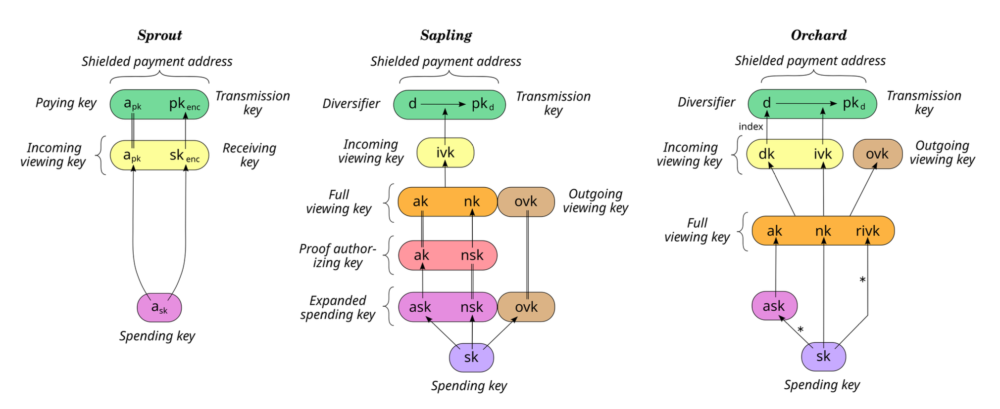
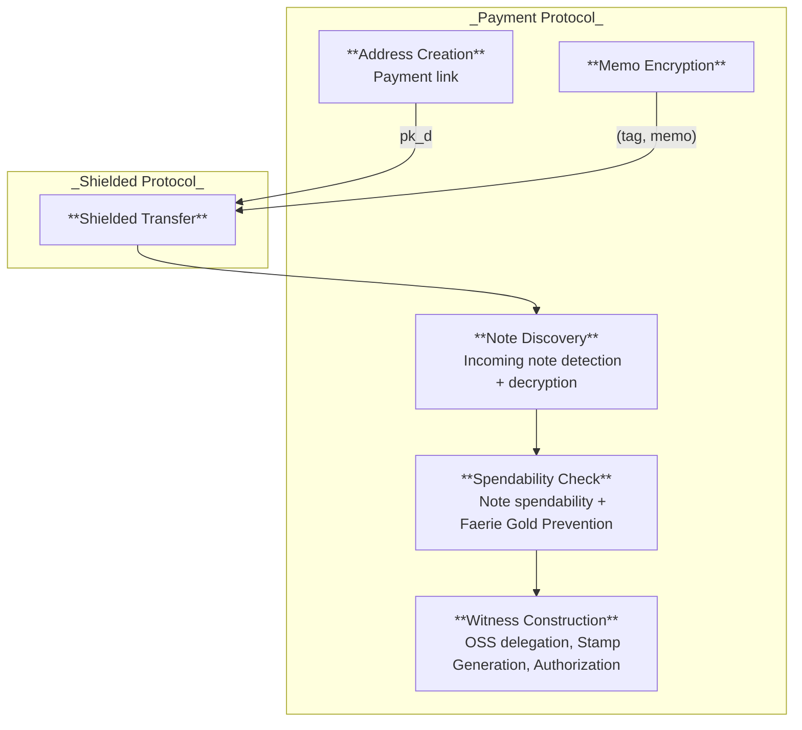
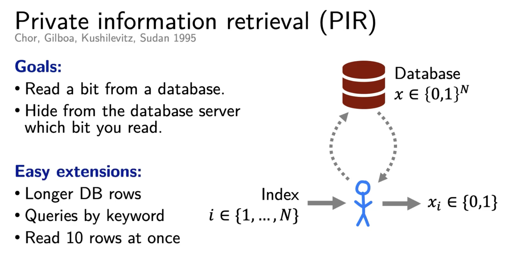

# A Deep Dive on Tachyon

Although Tachyon’s central contribution is its use of prunable nullifiers to
scale Zcash without compromising privacy, we begin from a different vantage point.
Rather than diving directly into how evolving nullifiers work, we first examine a
foundational design decision in Tachyon’s key structure: the separation of concerns across subprotocols that shapes the rest of the system.

The [Zcash Spec](https://zips.z.cash/protocol/protocol.pdf) is most illustrious
for its sedimentary layers of meticulous notations and its evolving key
structures across network upgrades.
We marvel at the sophistication of the key designs, at the laborious effort
behind to strive for efficiency, security, and rich functionalities all at once.
But why such growing complexity? After all, the Sprout upgrade, following the
original [Zerocash](https://eprint.iacr.org/2014/349.pdf), only requires one
payment key and one encryption key.

  

One source of the complexity is the **separation of proof generation and
transaction authorization**. In Zerocash/Sprout, a valid SNARK proof already
ensures rightful ownership, thus no further authorization needed theoretically.
In practice, however, hardware wallets are both resource constrained and vendor
gated to support intensive proof generation. While Sprout can lean on the zero
knowledge of SNARKs to prevent linkability, Sapling spends authorized via
signatures requires *re-randomizable signature* to prevent linkage between
spends from the same owner. This re-randomization manifests through the
*authorization key* $\ak$ in the secret witness and the *randomized authorization
key* $\rk = \ak + [\alpha]\,\G$ in the public instance of the proof.
The spend authorization signature is verified against the publicized $\rk$.

Another reason for the complexity is the **conflation of note ownership
and note transmission**. Since the original Zerocash (inherited in all Zcash
upgrades), the payment address serves *dual* purposes: declaring note ownership
and facilitating transmission of note secrets. The sender of a transaction
needs to securely communicate the output note openings so that they can be spent
later by the recipient. Without assuming secure channels between all users,
Zcash has been transmitting the encrypted memo *in-band* as part of the
transaction, effectively using the blockchain as the public bulletin board.
The payment address, publicized to the sender, contains a *transmission key*
which is the encryption key of a hybrid public key encryption scheme.
Zcash, from Sapling onward, is extra cautious about the privacy leakage in case
of colluding senders under reused transmission keys.
Therefore, *diversified address* is introduced to randomized the transmission
key *while preserving the same incoming viewing key* $\ivk$ for memo decryption
and detecting incoming notes.

Furthermore, **fine-grained disclosure of transaction flows** requires a
distinct *outgoing viewing key* to enable optional viewing of outbound notes.
Viewing keys support selective disclosure of both incoming and outgoing notes,
either to the account holder or to authorized third parties.
This separation also facilitates quantum-safe outgoing viewing keys from day
one, as they are not subject to the address-diversification requirement that
currently ties $\ivk$ to discrete-log–based constructions.

## Decoupling Payment Protocol from Shielded Protocol {#decouple}

A key observation Tachyon makes is that we can **separate the concerns of
spend authorization and note transmission**! This separation appears in the
decoupling of the shielded protocol from the payment protocol. The payment protocol
is responsible for full payment address construction, note transmission, and
selective disclosure capabilities, while the shielded protocol is reduced to the
minimal functionality required to maintain the shielded pool and enforce note
ownership and authorized transfers on-chain.

Informally:

- Shielded protocol: binds every note to an owner for spend authorization
  - Spend authorization requires both valid proof of ownership (proof of
  knowledge on $\nk$) and transaction authorization (signature under $\rk$)
  - Beyond maintaining the shielded pool, the blockchain acts as a data
  availability layer for arbitrary payment-protocol data
- Payment protocol: securely transmits relevant note info to intended recipients
  - Wallets, typically standardized, define the concrete key derivation hierarchy
  needed to satisfy the payment protocol’s functionality and security requirements.
  - Wallets may support multiple payment protocols, such as 
  Payment request ([ZIP-321](https://zips.z.cash/zip-0321)) and
  URI-encapsulated Payments ([ZIP-324](https://zips.z.cash/zip-0324)).

The rationale for this separation becomes clearer when examining the underlying
key material. Of all derived keys, *only two* are strictly necessary for enforcing
note ownership: the nullifier key $\nk$, used to derive nullifiers, and the
authorization key $\ak$, used to derive the randomized spend validation key.
Both are known only to the note owner and supply as secret witnesses in the
SNARK proof.

In Zcash today, a shielded payment address binds together $(\ak, \nk)$ and
additionally includes $\ivk$ for incoming note detection. Tachyon instead
decomposes this structure into a diversifiable payment key
$\pkd = \mathsf{Com}(\ak, \nk; \rpk)$, a hiding commitment to the pair with $\rpk$
a per-address diversifier, and a separate transmission key managed entirely by the
payment protocol. This significantly
simplifies the shielded protocol’s key architecture by removing functionality
unrelated to spend authorization.

> Among the main [security properties](https://zcash.github.io/orchard/design/nullifiers.html#security-properties),
> Tachyon shielded protocol needs to uphold Ledger Indistinguishability
> (defined in [Zerocash](https://eprint.iacr.org/2014/349.pdf)),
> Balance, Note Privacy, Note Privacy (OOB), Spend Unlinkability (but attackers access
> restricted to only payment key).
> Full Spend Unlinkability (attacker with $\ivk$ access) and Faerie Resistance are now
> the responsibilities of the payment protocol.
> Security analysis on a more [comprehensive list](https://github.com/daira/zcash-security) of properties is outside our scope.

This separation[^reproduce-orchard] yields several benefits:
a narrower and more manageable scope for shielded pool upgrades,
cleaner isolation of security assumptions for auditing,
greater flexibility in exploring payment protocol designs while preserving a stable
shielded core, and the ability to develop sub-protocols in parallel.
More broadly, we believe this separation of concerns enables Tachyon, and future
post-Tachyon upgrades, to evolve more rapidly while supporting more modular
security analysis.

[^reproduce-orchard]: One way to convince yourself that such separation works is
    to reproduce all of Orchard functionalities in this decoupled framework. We
    leave it as a homework exercise for the readers. 
    As a hint, your diversified address now may look like
    $\mathsf{addr} := (\pkd, \tk)$ where
    $\pkd = \mathsf{Com}(\ak, \nk; \rpk)$ is the diversified payment key,
    $\tk = (d, pk_d)$ is the diversified transmission key.
    Your $\ivk = \mathsf{ToScalar}(\PRF_\sk([9]))$ can now be directly
    derived from master spending key $\sk$, rather than meandering through
    layers of indirect derivation (similarly for outgoing viewing key).

## Shielded Protocol {#shielded}

We incrementally cover the whole Tachyon shielded protocol in this section.

> Note: in practice, all derivation functions (e.g., hash, KDF, XOF, and Derive)
> should be domain-separated;
> we omit this detail here for simplicity of presentation.

### Payment Key {#payment-key}

As explained [above](#decouple), Tachyon shielded protocol only expects an
authorization key $\ak$ from a re-randomizable signature scheme[^redpalla] and
a nullifier key $\nk$. While both keys *should* be derived from a master spending
key as per [ZIP-32](https://zips.z.cash/zip-0032), the concrete derivation path
is specified by wallet standards. The transfer proofs in shielded transaction only
use them directly as secret witnesses to further derive public values including
(randomized) spend validating key $\rk$ and nullifier $\nf$, but never constrain
their derivations. The shielded protocol only mandates that they are
indistinguishable from randomly sampled keys.
    
[^redpalla]: Tachyon sticks with $\mathsf{RedPallas}$, a Schnorr-based signature
    over the Palla curve supporting re-randomization, as in Orchard.
    See our [approach](#pq-rerand) when fully migrating to post-quantum world.

  

The payment key $\pkd = \mathsf{Com}(\ak, \nk; \rpk)$ is the owner field every note
commits to: a hiding commitment to the $(\ak, \nk)$ pair, diversified by a
per-address trapdoor $\rpk$. Being a symmetric (Poseidon-based) commitment, $\pkd$
gives a succinct owner field and
[quantum recoverability](https://zips.z.cash/draft-ecc-quantum-recoverability)
today.
Publicizing $\ak$ directly, a Schnorr verification key, to senders who might have
future access to a quantum computer exposes the user 
["Harvest Now, Decrypt Later"](https://en.wikipedia.org/wiki/Harvest_now%2C_decrypt_later)
risk.

Spend authorization follows the same construction as in Orchard.
The authorization key pair satisfies the DLog relation $\ak = [\ask]\,\G$, and
can be re-randomized into an unlinkable key pair using a randomizer $\alpha\in\F$.
Transactions are signed using the re-randomized signing key $\ask + \alpha$.
The resulting signature is unlinkable to the original spending authority,
while remaining verifiable against the randomized spend validating key $\rk$,
defined as:

$$
\rk = \ak + [\alpha]\,\G = [\ask + \alpha]\,\G
$$

### Note {#note}

A tachyon note is a tuple:

$$
\mathsf{Note}^\mathsf{Tachyon} := (\pkd, v, \psi, \rcm)
$$

where $\pkd$ is the [payment key](#payment-key), $v$ is the value of the note,
$\psi$ is pseudo-random note identity that binds to the note nullifier value
as an input to its derivation, and $\rcm$ is a random commitment trapdoor[^cm-psi].
In contrast to Sapling/Orchard, the note commitment in Tachyon
$\cm = \mathsf{Com}(\pkd, v, \psi; \rcm)$ is purely based on symmetric primitives[^cm].
Thus, Tachyon doesn't require extra enforcement on $\rcm$ derivation on wallets
to achieve quantum recoverability
like [Orchard does](https://x.com/zkDragon/status/2026047830759182672).

[^cm-psi]: Pseudorandom values like $\psi$ and $\rcm$ should be
    deterministically derived from the wallet master key via secure KDF to avoid
    poor operational entropy. The derivation should be standardized.

[^cm]: Sapling and Orchard uses variants of the vector Pedersen commitment,
    which relies on DLog hardness. We choose Sponge-based Hash constructed from
    algebraic permutation Poseidon.
    
### Evolving Nullifier {#nf}

Readers should refer to Sean's 
[post](https://seanbowe.com/blog/tachyon-scaling-zcash-oblivious-synchronization/)
and the [short note [BM25]](https://eprint.iacr.org/2025/2031.pdf) for a
detailed motivation and an overview of Tachyon's evolving nullifiers.

A scaling Zcash produces more note commitments and nullifiers, both accumulating
in the shielded pool. The commitment set grows on disk, but luckily storage is cheap.
The nullifier set becomes the bottleneck: every transaction must check that its
inputs' nullifiers have never appeared before, which forces consensus nodes to
keep the whole set in memory *on the critical path*.
At Visa-level throughput, this nullifier state would grow by an [unattainable
500 GB per day](https://youtu.be/D51JV1ItMGE?si=5i5ByeKYg6fhf7U8&t=201).

Tachyon offloads most of this check to the user. The consensus node retains only
nullifiers from the most recent blocks; the user supplies an *exclusion proof*
attesting that their nullifier does not appear anywhere in the older history.
This proof must be kept current as each new block lands, which Tachyon achieves
incrementally via [proof-carrying data (PCD)](https://tachyon.z.cash/ragu/concepts/pcd).
Since constantly scanning blocks and refreshing proofs is onerous, users can
outsource the task to an *oblivious syncing service (OSS)*. However, updating
an exclusion proof requires knowing the nullifier value, and a nullifier revealed
to the syncing service let it trace the eventual spend of that note — a disastrous
privacy leak. Tachyon resolves this by letting nullifiers **evolve across
epochs**: the value a user shares with the OSS in one epoch is unlinkable to the
value revealed at spend time. This breaks a long-standing Zcash invariant:
each note has only *one* nullifier that is globally unique value in the pool.
As a result, Tachyon requires both a new nullifier derivation and a new
double-spending prevention mechanism.

> **<a id="philosophy">Philosophy:</a> Client-side Validation**
> ([CSV](https://eprint.iacr.org/2025/068)).
>
> Tachyon's scaling approach rests on one principle: move validation off the
> critical path of consensus and onto the client wherever possible. As a
> blockchain scales, the burden on consensus nodes grows along every axis —
> compute, memory, storage, and bandwidth. The remedy is to let the transacting
> client prove its own correctness and leave consensus only cheap verification.
> This principle guides many design decisions beyond our prunable nullifiers.

The ideal functionality for an epoched nullifier is a deterministic function

$$\nf_e = \mathsf{KDF}(\nk, \psi, e)$$

whose outputs are indistinguishable from random bytes. Such an $\nf_e$ binds to
both the spending authority (via $\nk$) and the underlying note (via its
per-note trapdoor $\psi$), while remaining unlinkable across epochs to anyone
without $\nk$.

Two additional constraints shape the choice of $\mathsf{KDF}$:

- **Constrained evaluation.** The wallet should be able to delegate $\nf_e$
  computation for a *range* of epochs to an OSS while keeping every epoch
  outside that range opaque to the service. Without this, outsourcing
  block-scanning would cost the user their privacy.
- **Circuit efficiency.** The spend proof constrains $\nf_e$ in-circuit, so the
  construction should be circuit friendly.

A natural abstraction for the first constraint is the *constrained PRF*
[[BW13]](https://eprint.iacr.org/2013/352.pdf): from the master key one can
derive a constrained key that enables the evaluation of the PRF at a certain
subset of the input domain and nowhere else. Section 3.3 of [BW13]
explains the *prefix-fixing* family realized by the seminal 
[[GGM84] PRF](https://crypto.stanford.edu/pbc/notes/crypto/ggm.html)
which is sufficient for us.

#### GGM-based Nullifier {#nf-ggm}

Let $\bits{e} = (e_0, e_1, \ldots, e_{\ell-1}) \in \{0,1\}^\ell$ be the
binary expansion of $e$ (so $e_0$ is the most significant bit).
Let $G: \{0,1\}^s \rightarrow \{0,1\}^{2s}$ be a length-doubling PRG, split into
halves $G(x) = G_0(x)\, \|\, G_1(x)$. In practice, we can instantiate $G_0(x) =
H(0 \| x), G_1(x) = H(1 \| x)$ with some hash function $H$ modeled as random oracle.
The GGM PRF walks down a binary tree from a seed, branching left or right at each
level according to the input bits:

$$
F^{\mathsf{GGM}}_{\seed}(e) :=
G_{e_{\ell-1}}\!\Bigl( \cdots G_{e_1}\!\bigl( G_{e_0}(\seed) \bigr) \cdots \Bigr)
$$

The Tachyon nullifier instantiates this GGM PRF with a per-note seed bound to
both the user's nullifier key $\nk$ and the note's trapdoor $\psi$:

$$
\nf_e = F^{\mathsf{GGM}}_{\PRF_\nk(\psi)}(e) =
G_{e_{\ell-1}}\!\Biggl( \cdots G_{e_1}\!\Bigl( G_{e_0}(\PRF_\nk(\psi)) \Bigr) \cdots \Biggr)
$$

A few properties worth highlighting:

- **Per-note and owner-bound**: Only the holder of $\nk$ can compute the seed
  $\PRF_\nk(\psi)$, so only the owner can derive $\nf_e$. The seed also
  depends on the per-note $\psi$, so different notes live in completely
  disjoint GGM trees: a prefix key delegated for one note grants the OSS
  *nothing* about any other note's nullifiers.[^cross-note-attack]
- **Forward-only**: Each $G_b$ is one-way — from any internal node one can
  walk further down, but cannot recover its parent or reach a sibling
  subtree. A partially-walked node thus lets its holder reach every leaf
  below it, and nothing else.
- **Provably pseudorandom**: For uniform $\nk$, the seed $\PRF_\nk(\psi)$ is
  pseudorandom by PRF security; GGM then yields pseudorandom $\nf_e$ over
  any distinct epoch queries, sequential or even adversarially chosen.
- **Circuit efficient**: One PRF call to derive the seed plus $\ell$ PRG
  calls down the tree — a single $\nf_e$ costs $\ell + 1$ hashes when both
  the PRF and $G_0, G_1$ are instantiated with Poseidon.

[^cross-note-attack]: Had we instead used a note-independent
    $k_e = F^{\mathsf{GGM}}_\nk(e)$ and folded $\psi$ into a final
    $\nf_e = \PRF_{k_e}(\psi)$, the same $k_e$ would be shared across every
    note the user owns. An OSS holding a delegated $k_e$ for note $A$ could
    then compute $\nf_e^{(B)} = \PRF_{k_e}(\psi_B)$ for any other note $B$
    whose $\psi_B$ it knows — and since $\psi$ is sender-shared via the
    payment protocol, a colluding sender-OSS would learn the epoch-$e$
    nullifier of every note it ever sent the user. Worse, *future*
    delegations would retroactively unmask past spends: receiving $k_{e+1}$
    later lets the attacker compute $\PRF_{k_{e+1}}(\psi_A)$ for a note $A$
    already spent at epoch $e+1$ and find the match in the on-chain
    nullifier history. Binding the GGM seed itself to per-note $\psi$ severs
    both attacks: each note has its own tree, and a delegated subtree key
    cannot cross GGM trees.

The forward-only property is exactly what makes OSS delegation work. For any
prefix $\mathbf{v}$ of length $d$, the internal node
$k_\mathbf{v} := G_{v_{d-1}}(\cdots G_{v_0}(\seed) \cdots)$ is a
*prefix-constrained key*: its holder can derive $\nf_e$ for every $e$ in
*this note's* tree whose top $d$ bits equal $\mathbf{v}$, and learns nothing
about any other $\nf$ — including any nullifier of a *different* note, whose
tree is rooted at a different seed.

Concretely, in a 3-bit epoch space, delegating the range
$[2, 4) = \{010, 011\}$ for some note amounts to handing the OSS the depth-2
prefix key

$$k_{01} = G_1(G_0(\seed)), \qquad \seed = \PRF_\nk(\psi)$$

from which it forward-walks $G_0$ and $G_1$ to obtain $k_{010}$, $k_{011}$ and
thus $\nf_2, \nf_3$ for that note. Because $G$ is one-way, the OSS cannot
reach any node outside the `01` subtree, so future revelations of
$\nf_4, \nf_5, \ldots$ remain unlinkable to anything it has seen.

When the requested range does not align to a single subtree, it is delegated as
a *set of prefix keys*: one per maximal subtree contained in the range.
Delegating $[0, 7) = \{0, 1, \ldots, 6\}$, for example, requires three subtree
roots (all under the same per-note $\seed$):

$$\bigl\{\; G_0(\seed),\quad G_0(G_1(\seed)),\quad G_0(G_1(G_1(\seed))) \;\bigr\}$$

covering $\{0,1,2,3\}$, $\{4,5\}$, and $\{6\}$ respectively. In the worst case
an arbitrary range in an $\ell$-bit epoch space needs $O(\ell)$ prefix keys, so
the delegated key material is variable-size.

  

> **Optimization: mixed-arity trees.** We use a binary tree for clarity, but the
> arity need not be uniform across levels. A nullifier's in-circuit cost is the
> number of hashes along its root-to-leaf path, i.e. the tree height, so a *wider*
> branching near the root shortens every path and lowers that cost. Keeping the
> branching binary near the *leaves* preserves fine-grained range coverage for OSS
> delegation, where a delegated subtree should span as few surplus epochs as
> possible. High arity at the top and arity-2 at the bottom buys both at once: a
> shallow circuit and tight delegation ranges.

#### Nullifier Security {#nf-sec}

We now examine how the evolving nullifier upholds the security properties [carved
out](#decouple) for the shielded protocol. Readers can safely skip this
section and come back later since the analysis refers to concepts introduced
in later sections.

**Balance.** Only the holder of $\nk$ can compute any $\nf_e$, since the GGM
seed $\PRF_\nk(\psi)$ requires it. The spend circuit pins both $\nf_e$ and
$\nf_{e+1}$ to a deterministic function of the note and epoch, so a note has
exactly one valid nullifier per epoch and no freedom to mint a fresh value that
dodges a past spend. Double-spending is then ruled out by two complementary
checks that [leave no gap](#consensus-rule). The [spendability proof](#spendability)
certifies the nullifier absent throughout pruned history up to its anchor, and
consensus rescans the recent window (the current epoch and the one before) that
the proof does not reach. Publishing both $\nf_e$ and $\nf_{e+1}$ extends this
across the epoch boundary, so a note cannot be spent twice even as $e$ advances.

**Note Privacy.** The adversary is a keyless third party reading the whole
on-chain transaction, including any in-band memo. The shielded footprint, namely
the commitment $\cm$ (hidden by $\rcm$), the spend's revealed nullifiers
(pseudorandom by GGM PRF security), the rerandomized $\rk$, and the hiding $\cv$,
reveals none of $\pkd$, $v$, $\psi$. The in-band memo is payment-protocol data
that the shielded protocol carries opaquely and never parses (committed only to
`da_digest`), so its secrecy rests on the payment protocol's encryption, not on
the shielded core.

**Note Privacy (OOB).** Here the note plaintext travels out of band rather than
as an in-band ciphertext, so the adversary of concern is the sender, who learns
$\pkd, v, \psi, \rcm$ but never the recipient's $\nk$. Because every $\nf_e$ hangs
off the secret seed $\PRF_\nk(\psi)$, knowledge of the note plaintext alone does
not let the sender, or anyone it colludes with, recognize the recipient's
eventual spend on chain or link it back to the note it sent.

**Spend Unlinkability.** Across epochs the $\{\nf_e\}$ of a fixed note are
mutually pseudorandom to anyone lacking $\nk$, by GGM PRF security, and this
holds even for the pair $\nf_e, \nf_{e+1}$ revealed together at spend. An OSS
[delegated](#nf-ggm) a prefix key for a range $[e_1, e_2)$ can refresh exclusion
proofs there, but the tree's forward-only structure prevents it from reaching
any leaf beyond the range, in particular the spend leaf, since
[syncing stops at $e-1$](#txflow). To an attacker holding only the on-chain
$\cm$, the spend is unlinkable to it, since the two draw on disjoint randomness
($\rcm$ versus the GGM seed). The stronger flavor of spend unlinkability, under
incoming viewing key access, falls to the payment protocol, since Tachyon's
shielded core has no $\ivk$.

**Faerie-gold via the wallet.** In Orchard, Faerie-gold resistance comes from
binding each new note's $\rho$ to the unique nullifier of an input note.
Tachyon's [tachygram accumulator](#acc) does not assign notes a canonical
position, so the shielded protocol cannot enforce that binding. A malicious
sender could in principle pick colliding $\psi$ values across two notes sent
to the same recipient, where only one of them is spendable. We push detection
to the recipient's wallet: upon receiving a note, the wallet computes the note's
nullifier at a fixed reference epoch and rejects the note if it collides with any
other note it currently holds. Since a wallet's note set is small, the check is cheap;
the knowledge that compliant wallets will reject such collisions is enough to
deter the attack.

### Tachygram Accumulator {#acc}

All shielded pools in Zcash today maintain two separate accumulators:
a note commitment Merkle tree for efficient inclusion proofs and a nullifier
set with constant-time membership queries for exclusion testing.

Tachyon instead uses a single cryptographic accumulator whose members are
encoded as roots of a polynomial, so that both membership and non-membership
tests reduce to a single evaluation query.
Conveniently, Tachyon's PCD proof system natively and cheaply supports
evaluation queries against *online polynomial oracles*[^polyoracle].
Because the accumulator is universal[^universal], it need not distinguish
nullifiers from note commitments: a single accumulator collects
indistinguishable 32-byte blobs, each a **tachygram**, that can be either a
nullifier *or* a commitment.

$$
\tg := \begin{cases}
    \cm = \mathsf{Com}(\pkd, v, \psi; \rcm) &\quad\text{in Output actions}\\
    \nf_e = \mathsf{KDF}(\nk, \psi, e) &\quad\text{in Spend actions}
\end{cases}
$$

[^polyoracle]: Ragu PCD proof, through [reduction of
    knowledge](https://eprint.iacr.org/2022/009), reduces down to a list of
    evaluation claims of multiple opening points on multiple polynomials.
    These claims are then
    [folded](https://tachyon.z.cash/ragu/protocol/core/accumulation/pcs.html)
    into a single running aggregated claim.
    Ragu expose the capability to fuse online/application-time polynomial
    queries into the proof system directly, without encoding the evaluation
    through the constraint system which can be expensive.
    This is spiritually similar to
    [lookup argument](https://zcash.github.io/halo2/design/proving-system/lookup.html)
    enforced as part of the PIOP relation rather than through the circuit.
    
[^universal]: In [crypto literature](https://eprint.iacr.org/2018/1188.pdf),
    a universal accumulator is dynamic (supports insertion and removal) and
    supports both membership and non-membership proofs.

The accumulator is the commitment to a polynomial $f^\tg(X)$:

$$
\tgacc = \mathsf{Com}(f^\tg(X)) = \mathsf{Com}( \prod_i{(X - \tg_i)} )
$$

The key properties of this universal accumulator:

- Membership is enforced via $f^\tg(x) = 0$, non-membership via
  $f^\tg(x) \neq 0$. Both tests are insensitive to multiplicity, so this is a
  *multiset* accumulator: a tachygram appearing $m$ times contributes the factor
  $(X - \tg_i)^m$, but a single occurrence already certifies membership.
  - We do not deduplicate. In honest operation every tachygram is a distinct
    pseudorandom blob, so multiplicity exceeds one only with negligible (or
    adversarial) probability; and since (non-)membership ignores multiplicity,
    such cases are harmless. 
- Members are *unordered*: a multiset commitment, not a vector commitment.
- <a id="union">**Multiset union**</a>
  is polynomial multiplication, yielding a product accumulator
  $f^\tg(X) \cdot g^\tg(X)$ (unconditionally, with no disjointness precondition);
  multiset difference is division, yielding a quotient $\frac{f^\tg(X)}{g^\tg(X)}$
  whenever the divisor is contained, and failing with a remainder otherwise.
  - A union can be tested via $p(r) \iseq f(r) \cdot g(r)$ at a random point
    $r\sample\F$.

We emphasize a subtlety in the security of this polynomial-based accumulator.
Since some polynomial commitment schemes are not degree-binding (KZG, Pedersen,
etc.), the (non-)membership test is complete and sound only if the commitment
is honestly computed.
Concretely, consider a set of 10 items with its correct accumulator $\acc$.
An attacker appends a malicious item $\tg_{11}$ and produces an $\acc'$
indistinguishable from a normal Pedersen commitment. Since $\acc'$ does not
bind the degree of the committed polynomial, a verifier could be fooled into
accepting a membership test for $\tg_{11}$. Similarly, an attacker given an
untrusted accumulator could drop genuine members from the polynomial. These
attacks are impossible in Tachyon because every $\tgacc$ is verified by
consensus validators using the technique [below](#acc-correct).

#### Checking Accumulator Correctness {#acc-correct}

Our goal is to check the correctness of the accumulator value $\tgacc$ given
a public list of $\set{\tg_i}$ *without expensive recomputation*.

The solution is batch verification via a randomized point check.
The verifier samples a random $r\sample\F$ and invokes the PCS evaluation
procedure on the (commitment, point, evaluation) claim $(\tgacc, r, y_r)$, where
$y_r = \prod (r - \tg_i)$ is computed locally.
Naturally, this proof can be made non-interactive with Fiat-Shamir.
Notably, the verifier performs only cheap field operations, avoiding the group
operations that recomputing the commitment would require (for Pedersen, KZG, or
Bulletproof PCS).

### Tachyon Transaction {#tx}

Each block contains one or more transactions. Each transaction has a `txid`,
which commits only to its _effecting data_
([ZIP-244](https://zips.z.cash/zip-0244)) and is therefore the stable,
non-malleable transaction identifier, and a `wtxid`
([ZIP-239](https://zips.z.cash/zip-0239)), which additionally commits to the
malleable authorization data and is the identifier used to relay v5+ transactions
over the p2p network.
Each transaction optionally contains a bundle of transfers from each pool:
JoinSplit for Sprout (soon deprecated), Spend/Output for Sapling, Action for
Orchard, and now Tachyon Action for the new Tachyon pool.

A **Tachyon Action transfer** either spends an old note or creates a new one.
Whether a spend or an output, its *Action description* is uniformly represented
by a pair $(\rk, \cv)$, where $\rk$ is the randomized spend validating key, whose
derivation *binds to the underlying note*, and $\cv$ is a blinding commitment to
the net value (negative for a spend).
Unlike Sapling and Orchard, the tachygrams (nullifier or commitment) are left
out of the description, because evolving per-epoch nullifiers are no longer
static. We instead bind the note to $\rk$ through its randomizer $\alpha$:

$$
\begin{cases}
\rk = [\ask + \alpha]\,\G \\
\alpha = \PRF(\cm \| \theta)  \quad\theta\text{: arbitrary entropy}
\end{cases}
$$

The Tachyon bundle inside a transaction carries a sequence of Action
descriptions together with the net balance of all action transfers
$v^{\mathsf{bal}}$, proven by a *binding signature* $\sigma^{\mathsf{bind}}$ as
in Sapling/Orchard.

Recall: How binding signature works.

The net value commitment $\cv$ in every action description is Pedersen-committed:

$$
\cv = [v]\,\G + [\rcv]\,\H
$$

where $\rcv$ is the blinding factor and $\H$ is an independent group generator.

By the homomorphic property of Pedersen commitments, the verifier can sum the
$\cv$ in a bundle to obtain $\sum_i{\cv_i}$, itself a blinding commitment to the
net balance $v^\mathsf{bal}$ with blinding factor $\bsk = \sum_i{\rcv_i}$:

$$
\sum_i{\cv_i} = [\sum_i{v_i}]\,\G + [\sum_i{\rcv_i}]\,\H
= [v^\mathsf{bal}]\,\G + [\bsk]\,\H.
$$

To verify the net balance, the validator reconstructs a discrete-log public key

$$
\bvk = \sum_i{\cv_i} - [v^\mathsf{bal}]\,\G,
$$

and then verifies a Schnorr signature $\sigma^\mathsf{bind}$ produced under
$\bsk$. Effectively, the signature serves as a proof of knowledge of the secret
scalar $\bsk$ behind the public key $\bvk$.

Before describing the stamp, we name a recurring object it relies on: the
**spendability proof**.
To spend a note, its owner must convince consensus that
the note is *currently spendable* — that its commitment was once added to the
pool (*inclusion*) and that, in every epoch since, the note's nullifier *for that
epoch* has stayed absent (*exclusion*).
Since the pool retains only recent tachygrams and prunes the rest
([above](#nf)), neither fact is checkable from a node's live state; the spender
instead carries an updateable PCD proof of both, taken relative to a particular
[anchor](#anchor) that pins a point in pool history. The proof can be constructed
as soon as the note's creation transaction lands in a block, and is thereafter
*lifted* forward with its anchor advanced over newer transactions.
The owner need not keep it perpetually fresh: lifting is usually a
retroactive syncing pass, run (or delegated to an OSS) only when a spend is
intended, to carry the proof up to the spending epoch. We defer the lifting
machinery (the [proof tree](#prooftree) and its steps) to a later section; for
now it suffices that every spend consumes a spendability proof anchored near the
chain tip when its transaction is published.

A **Tachyon Stamp** provides the PCD proof for the [Action statement](#statement)
along with its public inputs: a set of tachygrams $\set{\tg_i}$, their
accumulator $\tgacc$, an anchor value from the [anchor chain](#anchor), and the
epoch $e$ that anchor lies in.
Alternatively, the stamp holds a `wtxid` reference to another transaction whose
stamp carries an aggregated PCD proof and the corresponding public inputs.
The accumulator is included to spare miners from recomputing it over all
tachygrams; instead, the correctness of $\tgacc$ is proven as part of the Action
statement using the [batched verification trick](#acc-correct).
The **stamp is updateable** in three main ways:
1. [**in-epoch anchor lift**](#in-e): advance the anchor within the same epoch,
updating the inclusion proof of Spend note commitments.
2. [**cross-epoch anchor lift**](#cross-e): advance the anchor into a new epoch,
which requires revealing a [new nullifier](#nf) and updating the spendability
proof (both the commitment inclusion and nullifier exclusion) of Spend notes.
3. [**bundle aggregation**](#aggregation):
a new aggregated transaction is created whose stamp
contains the union of tachygrams, the accumulator of that union, an anchor, and an
aggregated PCD proof. The stamps of all constituent transactions are replaced by a
reference to the aggregated transaction's `wtxid`.

> Note: an aggregated Tachyon bundle shares exactly the same format as a normal
> standalone bundle (a.k.a. a _Tachyon autonome_), and may even carry additional
> Action descriptions of its own. A purely aggregating bundle, by contrast,
> carries an empty Action list (hence no authorization signatures), a zero value
> balance, a trivial binding signature, and a stamp holding the aggregated proof
> and its proof data.
>
> The balance check and authorization signature verification (including the
> `SIGHASH` computation) are identical for every bundle, aggregated or standalone.
> The only difference is proof verification: an aggregated bundle verifies against
> the single stamp of the aggregated transaction, so its cost is amortized across
> all constituents and thus economically incentivized.

Importantly, each Action description is **associated with two tachygrams**, a
consequence of the evolving nullifiers. If a user proves only the nullifier
$\nf_e$ for the current epoch $e$, the epoch may advance to $e+1$ before the
transaction is picked up from the mempool. Since neither miners nor the OSS—the
latter responsible only for syncing past epochs, and never learning future
nullifiers, least of all at spend time—can unilaterally update the proof, the
transaction goes stale and requires further user input to refresh. This is poor
UX and a potential timing side-channel that leaks privacy. We therefore require
every spend action to reveal (and prove in circuit) the nullifiers for **both the
current and the next epoch**, leaving an ample buffer against this cross-epoch
race. To keep spend and output actions indistinguishable, we further require each
output action to publish a random dummy tachygram alongside its note commitment.

All non-malleable parts, collectively the *effecting data*, hash into a stable
identifier `txid`: a bundle commitment from each pool and their value balance
$v^{\mathsf{bal}}$. In-band encrypted memos count as effecting data for the legacy
pools, but, as detailed below, *not* for the Tachyon pool.
The Tachyon bundle commitment $\actacc$ is defined similarly to the tachygram accumulator:

$$
\actacc = \mathsf{Com}(\prod_i{(X - a_i)})
\quad\text{where }
a_i = H(\cv_i, \rk_i)
$$

All mutable parts (orange in the diagram) commit only to the `auth_digest`, and
hence transitively to `wtxid = txid || auth_digest`; only the stable parts
(green in the diagram) contribute to `txid`.

Specifically,

- `txid` commits to $(\actacc \| v^\mathsf{bal})$. Importantly, for the Tachyon
pool the memos are *not* effecting data and are therefore excluded from the
`txid` inputs.
- `auth_digest` commits to $(\set{\sigma^\mathsf{act}}, \sigma^\mathsf{bind}, \mathsf{stamp})$.
- an additional `da_digest` commits to the (optional) opaque memo bytes, which
are unconstrained (never parsed or interpreted) and thus have no effect on the
shielded protocol.

Finally, the Tachyon bundle carries a spend authorization signature for every
Action description, each signed over the `SIGHASH`, which commits to the same
transaction-wide effecting data (across all pools) used to derive `txid`[^txid-sighash].
Block space can additionally serve as a data-availability layer for arbitrary
payment-protocol data used in note transmission; the shielded protocol neither
interprets this data nor checks its correctness. As explained [later](#payment),
the payment protocol Tachyon targets distributes the recipient's KEM encapsulation
key out of band through the [address](#address), and carries a KEM ciphertext
in-band only on rare first-contact transactions (ordinary payments carry none), so
the in-band footprint stays small. The scheme is quantum-safe from day one and
leaves the format unchanged even through a full [quantum upgrade](#pq).

[^txid-sighash]: `txid` and `SIGHASH` are domain-separated with different
    personalization strings, but they commit to the same effecting data.
    `SIGHASH` further incorporates a *SIGHASH type* byte, the `nConsensusBranchId`
    network-version identifier (e.g., NU5, NU6), and other consensus-level metadata.

### Anchor Chain {#anchor}

An anchor chain is a hash chain of **per-stamp** [tachygram accumulators](#acc).
Every stamp carries a $\tgacc$ committing to the tachygrams it introduces: those
of a single bundle for a standalone transaction (a *Tachyon autonome*), or the
union across many for an [aggregate](#tx). Each new stamp extends the chain by
hashing its accumulator into the running state:

$$
\tgst \leftarrow H(\mathsf{st^{tg}_{old}} \;\|\; \tgacc)
$$

  

The chain therefore advances at *sub-block, above-transaction* granularity: in a
block of transactions with all standalone Tachyon bundles it ticks once per
transaction. A stamp's $\mathsf{anchor}$ field may reference any node value
$\tgst$ in the chain, anchoring at a historical snapshot of the pool state.

Why anchor *per-stamp rather than per-block*, when the block is the unit of
consensus finality? The primary justification is that it minimizes validator
work, in alignment with our [philosophy](#philosophy). Each stamp already ships a
$\tgacc$ whose correctness is [batch-verified in circuit](#acc-correct), so a
validator merely hashes it into the chain. A per-block anchor would instead force
every validator to rebuild a block-wide accumulator from scratch: re-accumulating
every tachygram in the block, interpolating the product polynomial, and
committing it which involves an expensive multi-scalar multiplication for some PCS
choices. A secondary benefit of sub-block granularity is allowing note creation
and spend *in the same block* which enables true atomic swaps.[^swap]

[^swap]: Atomic swaps need the miner's cooperation. Better yet, the swap
    participants are themselves the block builder. Say Alice wants to swap her
    Sapling coin for Bob's Orchard coin. She builds her half with a validity
    proof but *no* authorization signature and sends it to Bob. Assuming the
    miner agrees to place it at the top of the next block, Bob can predict the
    exact anchor value that will exist right after her transaction is absorbed.
    Anchoring to that not-yet-realized point, Bob builds and fully authorizes the
    matching half and returns it to Alice, who then authorizes her own half and
    submits both. Alice is safe because her transaction is inert until Bob
    supplies his fully stamped and signed one; Bob is safe because Alice cannot
    publish his transaction alone — its proof verifies only if the anchor chain
    actually contains Alice's tachygrams ahead of his, and absent that the
    claimed anchor is a phantom that consensus rejects.

Per-stamp cadence also raises concerns about the cost of generating exclusion
proofs. To prove $\nf_e$ never appeared in epoch $e$, a user could naively show
$f^\tg(\nf_e) \neq 0$ against the accumulator of *every* stamp folded into the
chain that epoch. Instead, we leverage the [multiset union](#union) operation
on our accumulator polynomials to collapse the per-stamp checks into one.
The product of all stamp polynomials in an epoch is itself an accumulator over
all tachygrams of that epoch — the <a id="epoch-acc">*epoch accumulator*</a> $e(X)$:

$$
\underbrace{\circ \overset{f^\tg_1(X)}{\longrightarrow} \circ
\overset{f^\tg_2(X)}{\longrightarrow} \circ \overset{\ldots}{\longrightarrow} \circ}
_{\text{entire epoch: } e(X) = \prod_i{f^\tg_i(X)}}
$$

and $\nf_e$ is absent from the epoch exactly when $e(\nf_e) \neq 0$. Anyone
(typically an OSS) can prove that $e(X)$ is the correct product of the committed
$\tgacc_i = \mathsf{Com}(f^\tg_i(X))$ already fixed in the anchor chain by showing
$e(r) \iseq \prod_i{f^\tg_i(r)}$ using the proof system's cheap polynomial-oracle
queries[^polyoracle]. Since the queries are served natively by the folding scheme
and not through a step circuit, $e(X)$ may have degree as large as the SRS of the PCS
allows, independent of any per-PCD-step-circuit size limit. Admittedly, the prover
cost is still linear in the epoch's stamp count, but it is paid *once* and then
**amortized**. The epoch accumulator $e(X)$, carrying its correctness proof, can
now be reused by every unspent note to directly test the exclusion of their
epoched nullifiers.

This removes the per-stamp checks, but $e(X)$ still has degree linear in the
total number of tachygrams in the epoch $N$. We now present an optimization
trick that reduces the amortized per-nullifier cost to strictly sublinear.

#### Quadratic Residue Filters {#qr-trick}

> This subsection is a self-contained optimization; readers can safely skip it and
> continue to the [transaction life cycle](#txflow).

Our goal: let a user prove non-membership of $\nf_e$ over an *entire epoch* at
cost logarithmic in $N$, the number of tachygrams that epoch (equivalently, the
anchor-chain length).

The idea is **bucketing**. Suppose we sort every tachygram into one of $2^k$
buckets by a rule that (i) a nullifier can cheaply prove it follows and (ii)
splits the field evenly. Then $\nf_e$ falls into exactly one bucket, and it can
only ever collide with the tachygrams sharing that bucket. Thus, non-membership
across the whole epoch collapses to non-membership against a *single* bucket's
accumulator, holding only $\approx N/2^k$ entries. Taking $k = \log N - \log\log N$
shrinks each bucket to $\approx \log N$ entries while keeping the query $O(\log N)$.
Quadratic residues give us exactly such a rule.

**A number theory detour.** Over a prime field $\F$, the nonzero elements split
perfectly in half: the *quadratic residues* ($\QR$) and the *non-residues* ($\NQR$).
Both classes are cheap to test in-circuit:

- $x \in \QR$: supply the root $y$ as advice; one constraint $y^2 = x$.
- $x \in \NQR$: fix a public non-residue $c$ and supply $y$ with $y^2 = cx$,
  since multiplying by a non-residue flips the class:

$$
\begin{cases}
x\in\QR \iff c\cdot x \in\NQR \\
x\in\NQR \iff c\cdot x \in\QR
\end{cases}
$$

A **QR filter** is one such split with a random offset: draw $R \sample \F$ and
classify $x$ by whether $x + R$ is a residue. A random offset cuts the field
roughly in half, and $k$ independent offsets $R_1, \ldots, R_k$ tag every element
with a $k$-bit **QR profile** $\v{b} = (b_1, \ldots, b_k) \in \{0,1\}^k$, where
$b_j = 1$ iff $x + R_j \in \QR$ (written $x \in \QR_{R_j}$) and $b_j = 0$
otherwise. The $k$ filters together sort the field into $2^k$ disjoint buckets of
roughly equal size.

<a id="batch-qr">**Batched QR Test.**</a> Given the vanishing polynomial over
some elements $f(X)=\prod_i{(X - x_i)}$, we can batch-test that all elements are
QR, namely $\forall x_i \in \QR$, as follows:

- Prover interpolates all QR pairs $(x_i, y_i)$ into a polynomial $g(X)$ where
$g(x_i) = y_i$ and $x_i = y_i^2$
- Prover computes $h(X)=\frac{g(X) - X}{f(X)}$ and sends commitments to $g(X)$
and $h(X)$ to the Verifier
  - Observe that the numerator $g(X) - X$ vanishes over all $x_i$, thus must
  perfectly divide the vanishing polynomial $f(X)$
- Verifier samples a random $r\sample\F$, and test: $g(r) - r \iseq f(r)\cdot h(r)$

**Building the buckets (once, by the OSS).** Fix $R_1, \ldots, R_k \sample \F$ at
system startup. Conceptually, the buckets are the leaves of a binary tree built
by recursively splitting the epoch accumulator by each filter. Splitting
$e(X) = \prod_{j=1}^N (X - \tg_j)$ by $R_1$ gives

$$
\begin{cases}
q_0(X) = \prod_{\tg_i\in\NQR_{R_1}}{(X - \tg_i)}\\
q_1(X) = \prod_{\tg_i\in\QR_{R_1}}{(X - \tg_i)}\\
e(X) = q_0(X) \cdot q_1(X)
\end{cases}
$$

so $q_1$ gathers the tachygrams passing the $R_1$ filter and $q_0$ its
complement; bisecting each by $R_2$ gives four, and so on:

$$
\begin{cases}
q_{00}(X) = \prod_{\tg_i\in\NQR_{R_2} \,\cap\, \NQR_{R_1}}{(X - \tg_i)}\\
q_{10}(X) = \prod_{\tg_i\in\QR_{R_2} \,\cap\, \NQR_{R_1}}{(X - \tg_i)}\\
q_0(X) = q_{00}(X) \cdot q_{10}(X)
\end{cases}
\quad
\begin{cases}
q_{01}(X) = \prod_{\tg_i\in\NQR_{R_2} \,\cap\, \QR_{R_1}}{(X - \tg_i)}\\
q_{11}(X) = \prod_{\tg_i\in\QR_{R_2} \,\cap\, \QR_{R_1}}{(X - \tg_i)}\\
q_1(X) = q_{01}(X) \cdot q_{11}(X)
\end{cases}
$$

After $k$ filters we reach $2^k$ leaves, where leaf $q_{\v{b}}(X)$ holds exactly
the tachygrams of profile $\v{b}$.

In practice the OSS never splits top-down. It keeps the $2^k$ bucket accumulators
live and *streams* tachygrams into them: as each new stamp lands, it computes
every tachygram's profile $\v{b}$ (its $k$ QR bits) and folds the factor
$(X - \tg)$ into the matching leaf $q_{\v{b}}$. Internal product nodes are formed
bottom-up only when a decomposition proof calls for them. Maintaining the buckets
costs $O(kN)$ linear-factor multiplications across the epoch, amortized over all
users and all nullifiers.

  

With the buckets maintained, a user proves $\nf_e$ absent from the *entire epoch*
in three parts:

1. **Profile.** Compute $\nf_e$'s QR profile $\v{b}$ ($k$ squaring constraints)
   pinning down the single leaf $q_{\v{b}}$ it could possibly belong to.
2. **Leaf non-membership.** Test $q_{\v{b}}(\nf_e) \neq 0$ against that one leaf,
   of expected degree $N/2^k$.
3. **Path decomposition.** Certify that $q_{\v{b}}$ is genuinely the
   profile-$\v{b}$ bucket of the epoch accumulator $e(X)$, by walking the
   root-to-leaf path and checking, at each level $j$, two things:
   - *product relation*: the on-path parent equals the product of its two children,
   tested at a random point as in the [accumulator correctness check](#acc-correct);
   - *sibling QR purity*: the *off-path* sibling is pure in its QR class with
     respect to $R_j$: a single [batched QR test](#batch-qr), applied directly for
     a $\QR$ sibling or to $c\cdot(\cdot)$ for an $\NQR$ one.[^sibling]

[^sibling]: Why the sibling test, and why only one per level? The product checks
    alone are not enough: a cheating OSS could hide a tachygram equal to $\nf_e$
    by misfiling it into the *sibling* subtree, leaving the user's leaf test to
    wrongly report absence. Sibling purity shuts this down. If the off-path
    sibling provably holds only elements of the opposite class at level $j$, then
    every on-path-class element of the parent is forced into the on-path child —
    it has nowhere else to go. Chaining this down all $k$ levels pins every
    profile-$\v{b}$ element of $e(X)$, in particular any occurrence of $\nf_e$,
    into the leaf $q_{\v{b}}$. Hence $e(\nf_e) = 0 \iff q_{\v{b}}(\nf_e) = 0$, and
    a passing leaf test certifies epoch-wide exclusion. Constraining only the
    sibling is enough: purity of the off-path side already captures all
    on-path-class elements, and a stray wrong-class element that leaks *into* the
    on-path child can at worst make an honest exclusion proof fail (a false
    positive), never admit a double-spend (a false negative).

The decomposition certifies $q_{\v{b}}$ only *relative to* $e(X)$. Full soundness also
needs $e(X)$ to be canonical, the correct product of the per-stamp $\tgacc_i$
committed in the anchor chain, which is the separate
[epoch-accumulator correctness](#epoch-acc) proof from above.

**Cost.** Each level adds one product check and one batched QR test, each settled
by $O(1)$ random-point evaluations, so the path is $O(k)$; the leaf test adds work
proportional to its degree $N/2^k$. Setting $2^k = N/\log N$, i.e.
$k = \log N - \log\log N$, balances the two — leaves hold $\approx \log N$
tachygrams and the path is $\approx \log N$ levels deep — for an $O(\log N)$
per-nullifier proof, strictly sublinear. (Pushing $k$ all the way to $\log N$
would shrink leaves to $O(1)$, but the $O(k)$ path cost still dominates at
$O(\log N)$ while the bucket count doubles, so nothing is gained.) This
per-nullifier cost sits *on top of* the OSS's one-time epoch work: maintaining the
buckets ($O(kN)$) and proving $e(X)$ canonical. Both the path-decomposition proofs
(shared by everyone whose nullifier lands in the same bucket) and the $e(X)$
proof (shared by all) are paid once and amortized across the epoch.

### Transaction Life Cycle {#txflow}

1. **Select notes, delegate syncing.** The wallet picks the input notes to spend
and the output notes to create, fixing the target spending epoch $e$. For each
input note the bulk of the work is bringing its [spendability proof](#spendability)
up to date, from wherever it was last synced through epoch $e-1$. The wallet
delegates this to an [OSS](#nf), handing over the
[prefix-constrained keys](#nf-ggm) for exactly the epoch range to be synced. From
those, the OSS derives the note's per-epoch nullifiers $\nf_i$ and proves their
derivation in-circuit, while learning nothing about epochs outside the range,
especially the eventual spend leaf $\nf_e$.

2. **Lift the spendability proof.** Maintaining the proof means advancing its
[anchor](#anchor) along the anchor chain while preserving both halves of the
claim:
    - *Exclusion* is extended exactly as in the [anchor chain section](#anchor):
    for each epoch, the note's nullifier $\nf_i$ for that epoch is shown absent
    from the epoch accumulator $e(X)$ (cheaply, via the
    [QR-filter test](#qr-trick)), with no per-stamp membership tests.
    - *Inclusion* needs no re-proving of membership: the note's commitment was
    shown to lie in its creating stamp's accumulator *once*, and each lift simply
    extends that anchor to the new one along the chain's hash links.
    - Within an epoch this is an [in-epoch lift](#in-e); crossing a boundary is a
    [cross-epoch lift](#cross-e), which reveals the new epoch's nullifier and runs
    a PCD step binding $\nf_i$ and $\nf_{i+1}$ to the *same note* (matching the
    underlying commitment), so the chain of per-epoch exclusions cannot be spliced
    across notes. The OSS repeats this epoch by epoch up to $e-1$ and returns the
    synced proof. It deliberately stops one epoch short of the spend: lifting only
    through $e-1$ keeps the spend-epoch nullifiers $\nf_e, \nf_{e+1}$ outside its
    delegated range, so the [forward-only](#nf-ggm) tree leaves them, and the
    eventual spend, opaque to the service.

3. **Generate the stamp.** The OSS hands back a proof synced through $e-1$; the
wallet performs the final cross-epoch lift into the spending epoch $e$
*itself*, keeping the spend-epoch nullifiers private, and folds the result into a
last proof step establishing the spend-specific facts: the integrity of the
current and next-epoch nullifiers $\nf_e, \nf_{e+1}$ (both
[derived from the same note](#nf)), the output commitments, and the correct
computation of the bundle accumulator $\tgacc$ over all revealed tachygrams (the
[batched correctness check](#acc-correct)). The accumulator collects *two tachygrams
per action*: $(\nf_e, \nf_{e+1})$ for a spend, the note commitment and a
zero-value dummy $(\cm, \tg_\bot)$ for an output.
The result is the [Tachyon stamp](#tx): the PCD proof for the
[Action statement](#statement) together with its public inputs
$(\set{\tg_i}, \tgacc, \mathsf{anchor}, e)$, whose anchor now sits in epoch $e$.
Revealing *both* $\nf_e$ and $\nf_{e+1}$ is what insures the transaction against
the [cross-epoch race](#race) while it waits in the mempool.

Why must the user lift the spendability proof into epoch $e$?

Two reasons, one for privacy and one for tachygram count.

*Unlinkability.* The OSS hands back a proof anchored in $e-1$. Folding that anchor
into the stamp *verbatim* would let the OSS recognize the very anchor it just
produced and link the eventual spend back to the syncing session. The wallet must
re-lift to a fresh anchor of its own to erase that handle.

*Two tachygrams, not three.* Given that a lift is required, the wallet could still
lift only *within* $e-1$, leaving the exclusion claim anchored in the previous
epoch. But then the blind spot consensus must close with its live window would
stretch back across $e-1$, and catching a double-spend there would force the
wallet to also publish the $\nf_{e-1}$ — a *third* tachygram on top of
$\nf_e, \nf_{e+1}$. Lifting across the boundary into $e$ instead shrinks the
uncovered tail to epoch $e$ alone, which the two-epoch live window closes using only
the pair $(\nf_e, \nf_{e+1})$ we already reveal.

4. **Authorize and bind.** Concurrent to the proving path of steps 1-3,
the wallet assembles the transaction body, computes the [`SIGHASH`](#tx) over
the effecting data, and produces:
    - a spend-authorization signature for every action, signed under the
    [re-randomized key](#payment-key) $\ask + \alpha$ and verifiable against the
    published $\rk$;
    - the net value balance $v^\mathsf{bal}$ and a single [binding signature](#tx)
    $\sigma^\mathsf{bind}$ over the value commitments.

5. **Mempool and aggregation.** The finished transaction enters the mempool as a
standalone *Tachyon autonome*. A miner (or any [aggregator](#aggregation)) may
then fold it together with others *sharing the same target epoch $e$*: it lifts
every input stamp onto a common anchor, takes the [multiset union](#union) of their
tachygrams and the
accumulator of that union, and produces a single aggregated PCD proof. Each
constituent's stamp is replaced by a reference to the aggregate transaction's
`wtxid`, moving the tachygrams, anchor, and proof onto the aggregate.

#### Consensus Validation {#consensus-rule}

Of the consensus rules, the bundle balance check and authorization-signature
validation are unchanged from Orchard; only stamp verification is new.

**Stamp verification.** Given the published tachygrams $\set{\tg_i}$, the
accumulator $\tgacc$, the anchor, and the anchor's epoch $e$, the validator:

1. confirms $e$ is either the current or the preceding epoch:
   $e = e_\mathsf{cur} \lor e = e_\mathsf{cur} - 1$
2. confirms the $\mathsf{anchor}$ is a genuine node value in the consensus
   [anchor chain](#anchor), lying in epoch $e$;
3. verifies the stamp's PCD proof against $(\set{\tg_i}, \tgacc, \mathsf{anchor}, e)$,
   i.e. the [Action statement](#statement). The statement internally enforces
   $\tgacc$'s consistency with the published $\set{\tg_i}$ (the
   [batched check](#acc-correct)), the integrity of the revealed nullifiers and
   output commitments, and the spendability of every spent note up to the anchor.

A stamp's proof is bound to a public epoch $e$ (i.e., the epoch its anchor lies
in) and certifies the spent note unspent only up to that anchor. A strict rule
would accept the stamp only while the chain is still in $e$, forcing a
cross-epoch lift the instant the epoch advances. Tachyon *relaxes* this
(step 1 above): a proof for $e$ is accepted while the chain tip is in epoch $e$
*or* $e+1$. The stamp may therefore lag the chain by one epoch, so a transaction
that drifts across an epoch boundary while waiting in the mempool stays valid.

**Consensus window (new double-spend rule).**
To close the gap between the anchor and the block that includes the stamp,
consensus enforces a live duplicate check spanning **the current and preceding
epochs**. Validators hold the tachygrams of the two most recent epochs in memory
and reject any bundle whose published tachygram already appears among them. The
window is two epochs wide exactly because the stamp proof may be one epoch stale.

Relaxed freshness does *not* weaken soundness, because each spend publishes the
pair $(\nf_e, \nf_{e+1})$. Whichever of the two permitted epochs accepts the
stamp, the pair already contains that epoch's nullifier:

- accepted in $e$: the window covers $\set{e-1, e}$ and $\nf_e$ is the active
  nullifier. A double-spend of the same note must publish the same $\nf_e$ and
  collide; so does a prior spend back in $e-1$ that carried $\nf_e$ as its
  next-epoch nullifier.
- accepted in $e+1$: the window covers $\set{e, e+1}$ and $\nf_{e+1}$ is the active
  nullifier, catching any competitor targeting $e+1$. A double-spend made in epoch
  $e$ after the anchor is caught too, since its $\nf_e$ also falls in the window.

**Standalone vs. aggregated.** Balance, authorization, and the tachygram-window
check run per constituent bundle in both cases; only the stamp proof differs. A
standalone autonome is verified against its own stamp, whereas the constituents of
an [aggregated](#aggregation) bundle have had their stamps stripped and replaced
by a reference, so one PCD proof stands in for the whole batch and amortizes
verification across it.

### Proof Tree {#prooftree}

Every Tachyon Action transfer, whether a spend or an output, comes with a statement
that its proof must satisfy. As in Sapling, the Spend and Output actions have
separate statements. A Tachyon [transaction](#tx) does not ship one proof per
action: its bundle carries a *single* aggregated proof attesting that every Action
description satisfies its statement. This differs from both predecessors. Sapling
emits $n$ independent proofs for an $n$-spend/output bundle; Orchard folds them
into one proof only in name, since its size and verification still grow linearly in
$n$. Tachyon's aggregated proof is *compressing*, sublinear in $n$, thanks to
PCD proofs.

What makes Tachyon's proof generation intricate is that it is built *incrementally*
and relayed across parties, for both privacy and practicality. In every existing
pool, proof generation is monolithic and local, with the spender producing the whole
proof alone. Tachyon's [evolving nullifiers](#nf) change this: the onerous task of
syncing past epochs to keep a [spendability proof](#spendability) current is
delegated to an Oblivious Syncing Service (OSS), which assists in assembling the
final proof yet learns nothing that would let it link a future spend. The proof that
finally lands on chain is thus the output of a computation laid out over a binary
(2-arity) DAG whose nodes are computed partly by the user and partly by the OSS. We
call this graph the **proof tree**.

We build up to it in stages. We first give the monolithic Spend, Output, and
bundle-level statements, then show how the combined state of all actions in a transaction
decomposes into a tree of steps, each step proving a subset of the statement and
recursively folding forward the proofs beneath it. This split also modularizes the
security analysis into two independent checks: that the monolithic statement is
*sufficient*, and that the decomposition is *sound* (e.g., every step refers to
the same note). A sub-statement is split into its own step for one of three reasons:

- **Circuit size.** Each step is a bounded circuit (we target $2^{13}$ constraints),
so a statement too large for one step must be spread across several.
- **Privacy boundary.** Some sub-statements need secret witnesses that would leak
note privacy or spend linkability if the OSS saw them, so the OSS proves up to that
boundary and relays the partial proof to the user, who finishes the step.
- **Proof reuse.** Some sub-statement proofs are shared across many notes, such as
[epoch accumulator $e(X)$ integrity](#epoch-acc). Proving such a statement once lets
it feed into many notes' proof trees as a ready-made input, with no per-note
recomputation.

We give the three monolithic statements an action's proof must satisfy: the
per-action statements ([Output](#output) or [Spend](#spend)), and the
[bundle-level](#bundle) statement that composes them. Their decomposition into
folding steps (the in-epoch and cross-epoch lifts, and aggregation) follows in the
remaining subsections, where each step is a circuit over a small header of data.

Each condition below is tagged by who supplies its proof: $\Sc$ (shared across
users), $\Uc$ (the user), or $\Oc$ (the OSS).

#### Output Action Statement {#output}

A valid instance of an *Output Action statement* assures that, given the public input:

- $\cv$: net value commitment
- $\rk$: randomized proof validation key *of the sender*
- $\cm$: the output note commitment, published as a tachygram
- $\tg_\bot$: a dummy tachygram, so an output reveals two tachygrams,
  [indistinguishable](#race) from a spend's nullifier pair

the prover knows the secret witness:

- $\mathsf{Note} := (\pkd, v, \psi, \rcm)$: note opening, where $\pkd$ is the
  recipient's payment key taken from their address
- $\mathsf{Note}_\bot := (\pk_\bot, 0, \psi_\bot, \rcm_\bot)$: dummy note opening
  with arbitrary $\pk_\bot, \psi_\bot, \rcm_\bot$ values.
- $\ak$: *sender* authorization key
- the randomizers $\theta, \rcv$

such that the following conditions hold:

- **Value commitment integrity** ($\Uc$): $\cv = [v]\,\G + [\rcv]\,\H$, committing the
  (non-negative) created value $v$.
- **Note commitment integrity** ($\Uc$): $\cm = \mathsf{Com}(\pkd, v, \psi; \rcm)$, the
  published commitment opens to this note.
- **Zero-value Dummy Commitment** ($\Uc$): $\tg_\bot = \mathsf{Com}
  (\pk_\bot, 0, \psi_\bot; \rcm_\bot)$, ensures zero-value dummy note.
- **Authorization** ($\Uc$): $\rk = \ak + [\alpha]\,\G$ and
  $\alpha = \PRF(\cm \,\|\, \theta)$ binding the validation key to the output note.

#### Spend Action Statement {#spend}

A valid instance of a *Spend Action statement* assures that, given the public input:

- $e$: the spend (current) epoch
- $\cv$: net value commitment
- $\rk$: randomized proof validation key
- $\nf_e, \nf_{e+1}$: the spend-time nullifiers, published as tachygrams
- $\mathsf{anchor}$: the [anchor](#anchor) the spend proves against

the prover knows the secret witness:

- $\mathsf{Note} := (\pkd, v, \psi, \rcm)$: note opening
- $(\ak, \nk, \rpk)$: authorization key, nullifier key, payment-key trapdoor
- the witness for the [spendability proof](#spendability)
- the randomizers $\alpha, \theta, \rcv$

such that the following conditions hold:

- **Value commitment integrity** ($\Uc$): $\cv = [-v]\,\G + [\rcv]\,\H$, committing the
  negated spent value.
- **Note commitment integrity** ($\Uc$): $\cm = \mathsf{Com}(\pkd, v, \psi; \rcm)$.
- **Payment key integrity** ($\Uc$): $\pkd = \mathsf{Com}(\ak, \nk; \rpk)$.
- **Spend Authority** ($\Uc$): $\rk = \ak + [\alpha]\,\G$ and
  $\alpha = \PRF(\cm \,\|\, \theta)$, binding the validating key to the note.
- **Commitment Inclusion**: $\cm$ entered the pool at a point preceding the anchor.
  - Initial inclusion ($\Uc$): $\cm$ is a member of its creating stamp's
    [accumulator](#acc), i.e. $f^\tg(\cm) = 0$.
  - Lift to block boundary ($\Uc$): that creating stamp is carried along the
    [anchor chain](#anchor) to its end-of-block anchor.
  - Flyclient anchor chain ($\Oc$): the end-of-block anchor connects to the spend's
    anchor through the hash chain, sampled flyclient-style in a logarithmic number
    of hashes.
- **Past Nullifier Exclusion** (until $e-1$): the note's per-epoch nullifier is
  absent in every epoch up to the anchor.
  - epoch accumulator integrity ($\Sc$): each [epoch accumulator $e(X)$](#epoch-acc) is
    the correct product of the per-stamp accumulators fixed in the anchor chain.
  - delegation key integrity ($\Uc$): the [prefix-constrained keys](#nf-ggm) handed to
    the OSS are the right GGM nodes for this note's seed over the delegated range.
  - nullifier derivation from delegation key ($\Oc$): the OSS forward-walks those keys
    to derive each in-range nullifier $\nf_i$.
  - epoched nullifier non-membership ($\Oc$): each $\nf_i$ satisfies $e_i(\nf_i) \neq 0$,
    via the [QR-filter test](#qr-trick).
- **Spend-time Nullifier Integrity** ($\Uc$): $\nf_e, \nf_{e+1}$ are this note's
  [GGM nullifiers](#nf-ggm) at epochs $e, e+1$, derived from the seed
  $\PRF_\nk(\psi)$ and so bound to $\cm$.

There's an obvious challenge on catching up anchor chain for inclusion proof,
which is linear hash chain proving, scale with the anchor chain length, but with flyclient
roots, we can prove block inclusion with *logarithmic* number of hashes to catch up. The
gap between the anchor for initial inclusion til the end-of-block anchor that shows up
in the block header (of the inclusion block) is still user's responsibility.

#### Bundle-level Statement {#bundle}

The bundle statement glues the per-action proofs together. Given the public input:

- $e$: the current epoch
- $\set{(\cv_i, \rk_i)}$: the list of [Action descriptions](#tx)
- $\set{\tg_i}$: the associated tachygram multiset of the bundle, two tachygrams
  per action
- $\tgacc$: their accumulator, a PCS commitment to $f^\tg(X) = \prod_i (X - \tg_i)$
- $\mathsf{anchor}$: the common [anchor](#anchor) every spend proves against

it attests that:

- **Per-action satisfiability**: every action's [Spend](#spend) or [Output](#output)
  statement holds, folded in as a sub-proof, and the tachygrams it emits
  ($\nf_e, \nf_{e+1}$ for a spend; $\cm, \tg_\bot$ for an output) are exactly those
  collected in $\set{\tg_i}$.
- **Accumulator integrity** ($\Uc$): $\tgacc$ accumulates the multiset $\set{\tg_i}$,
  by the [batched correctness check](#acc-correct) at a random point.

The value balance, anchor genuineness, and authorization signatures are enforced
*outside* this statement: respectively the [binding signature](#tx), a
[consensus check](#consensus-rule), and signature verification against $\rk$.

#### In-epoch Lift {#in-e}

#### Cross-epoch Lift {#cross-e}

#### Aggregation {#aggregation}

## Payment Protocol {#payment}

As established in the [motivation](#decouple), the payment protocol owns secure
note transmission. That entails a full payment address carrying the key material
for incoming-note detection, plus infrastructure for fast memo retrieval and
spending-witness construction. The leading Tachyon-compatible payment protocol is
being developed by [ValarGroup](https://github.com/valargroup); we sketch their
architecture and design rationale here.

The infamous[^sandblast] pain point of the existing note-transmission mechanism
is shielded sync by **trial decryption** of memos distributed in-band.
[Roman's article](https://x.com/akhtariev/status/2044113751767691637) gives a
detailed motivation and problem statement; briefly, the linear scan it requires
leaks metadata and grows infeasible for bandwidth-limited mobile wallets as Zcash
throughput scales.

[^sandblast]: Due to the linear cost of the shielded sync and an unprotective
    gas price, Zcash NU5 experienced a DOS attack, referred to as [the sandblasting
    attack](https://electriccoin.co/blog/a-look-back-nu5-and-network-sandblasting/),
    preventing wallets from syncing fast enough to access their funds.

One promising remedy is **Private Information Retrieval** (PIR), which lets a
client query a database without the server learning anything about the query
(slides below by [Corrigan-Gibbs](https://www.youtube.com/watch?v=Jdzrf3im1gQ)).
With PIR, the sender publishes the encrypted memo with a short `tag` attached, and
the resulting `(tag, encrypted_memo)` pairs are stored in a PIR database for
instant, leak-free retrieval.

  

### PIR Databases {#pirdb}

Modern single-server PIR trades $\Theta(N)$ preprocessing for a faster online
response and lower per-query communication. Since many of the costs we care about
scale as $\Theta(\sqrt{N})$, we keep every database bounded, capping its expected
size to hold overhead in check. For our scope, the payment protocol maintains at
least the following PIR databases (entries written as `key => value`):

- Epoched memo DB: a per-epoch `tag => memo` store, synced from the
  [DA blobs](#tx) on chain.
- First-contact memo DB: a `tag => KEM.c || memo` store for the [handshake](#discovery)
  transactions, synced from chain. It is also chunked, but over a much longer
  horizon than per-epoch, given how rare first-contact transactions are.
- Epoched tachygram DB: a per-epoch,
  [hash-table-bucketed](https://github.com/valargroup/spendability-pir/blob/main/nullifier/README.md)
  `H(tg)[:4] => tg (32 bytes) || blk_height (u32_le) || anchor_height (u32_le) || action_count (u8)`
  store, recording each tachygram and the block and anchor it appears in, synced
  from stamps on chain.
- PKI DB: an off-chain address registry `H(addr) => addr`, returning a full
  address (its ML-KEM encapsulation key and payment key) from a short digest.

### Full Payment Address {#address}

The [decoupling](#decouple) split the owner-binding payment key from the
note-transmission key, leaving the latter for the payment protocol to define. A
Tachyon *diversified payment address* is

$$
\addr = (\pkd,\,\ek)
\qquad
\begin{cases}
    \pkd = \mathsf{Com}(\ak, \nk; \rpk)\\
    (\ek, \dk) \leftarrow \mathsf{ML\text{-}KEM.KeyGen}()
\end{cases}
$$

with two components:

- *Diversified payment key* $\pkd$: the owner field every note commits to
  ([defined earlier](#payment-key)), randomized by the trapdoor $\rpk$ so that
  payment keys from the same wallet are unlinkable. The decoupling lets us
  diversify it independently of the transmission key.
- *Diversified transmission key* $\ek$: the encapsulation key of a freshly sampled
  ML-KEM key pair.

**Why not an Orchard-style transmission key.** Orchard derives a whole family of
diversified transmission keys $[\ivk]\,\G_d$ from diversified bases $\G_d$, all
sharing one incoming viewing key $\ivk$. This is convenient, since minting as many
unlinkable addresses as needed never increases the number of viewing keys note
discovery must scan. But it is not quantum-private: a sender who later gains access
to a quantum computer could *retroactively recover* $\ivk$ by breaking discrete
log, and a single $\ivk$ exposes every incoming note of the recipient, past and
future. ML-KEM sidesteps this, as its encapsulation is lattice-based and
post-quantum secure, and the symmetric encryption under the KEM-derived shared
secret is already quantum-safe today.

**No persistent viewing key? Tags to the rescue.**
An unfortunate byproduct of switching to ML-KEM is that the "diversified base,
same $\ivk$" algebraic relation no longer holds[^ivk]: instead, the decapsulation
key $\dk$ is freshly sampled for each new diversified address. Naively, this
multiplies the cost of shielded sync by the number of $\dk$ in the wallet, since
each must be trialed during the linear scan. PIR shortcuts that trial decryption
by attaching to every encrypted memo a retrieval handle, the $\tag$, which the
recipient queries the memo database with directly. The incoming viewing key in
Tachyon is therefore effectively:

$$
\ivk^{\mathsf{Tachyon}} := (
\underbrace{\tag}_{\text{per-note}}, \underbrace{\dk}_{\text{per-sender}})
$$

[^ivk]: The diversified-base trick yields two key pairs $(\pk, \sk)$ and
    $(\pk', \sk)$ that are unlinkable yet share the same $\sk$. Such a relation is
    easy in the discrete-log world but has no known secure analogue in the LWE
    world.

As the figure below shows, we sample the KEM key pair *deterministically*. Although
[ML-KEM's public `KeyGen`](https://nvlpubs.nist.gov/nistpubs/FIPS/NIST.FIPS.203.pdf)
is randomized, wallets invoke the derandomized `KeyGen_Internal(d, z)` with
$(d, z)$ derived from the HD-wallet master spending key, so the key pair is
reproducible from the seed. The sequence of tags is bound to the shared secret of
a channel, predictable to the two parties but opaque to everyone else. We say more
about tags in the [next section](#discovery).

  

**Two diversification schedules: per-sender and per-note.**
Address diversification historically existed to stop colluding senders from
recognizing that two addresses belong to the same recipient, which calls for a
per-sender schedule for $\ek$. Tags need a tighter one: since a $\tag$ appears
directly on chain, any reuse would link the two transactions carrying it to the
same recipient, so a fresh tag must be generated for every output note.

**Payment address PKI.** An ML-KEM encapsulation key is a few kilobytes, too large
for a QR code or payment URI. We therefore keep a PIR database that maps a short
digest to the full address, $H(\addr) \mapsto \addr$, queried on demand. Two
concerns remain open: the registry grows without bound, and rerunning PIR
preprocessing on every new entry is expensive. In practice we will likely split
the registry into size-capped chunks, conceding a few bits of privacy so that a
preprocessing rerun touches only the last, not-yet-full chunk.

### Note Discovery {#discovery}

> **In one breath:** first contact hands the sender a diversified address, the
> opening transaction completes the handshake, a stateful wallet then fast-syncs
> through the PIR databases, and an AEAD-encrypted wallet state posted on chain
> backs full recovery from the mnemonic alone.

Note discovery breaks into three interrelated procedures: handshake, stateful
sync, and recovery. In the **handshake**, a tentative sender makes first contact
and obtains a *distinct* KEM encapsulation key $\ek$ from the recipient,
establishing a shared secret $K$ that will encrypt every future note sent to that
recipient. The tags attached to those encrypted memos, the recipient's advice for
fast PIR retrieval, are derived deterministically from $K$ and known only to the
two channel parties. Once the recipient comes online and decapsulates $K$, its
wallet enters **stateful sync**, updating its local state (handshake material, the
number of notes seen on the channel, and each [note's spendability](#spendable))
as it syncs blocks with help from the PIR databases. Finally there is the rare
case of **recovery from mnemonic**, where a wallet rebuilds its state from scratch
by scanning the chain alone, ideally accelerated by PIR servers when available.

We examine each procedure more closely and explore possible design choices.

Everything starts with the recipient sharing a diversified address: the sender
uses its payment key to construct the output note and its transmission key for
secure in-band secret distribution. Disseminating $\addr$ is trivial when the two
already share a secure channel (Signal, WhatsApp, and the like), and a recipient
may simply publicize contact info for anyone to reach. The **first-contact
problem** arises when the recipient would rather not broadcast a private contact
(opening an OOB channel with every sender) or is not always online to answer
handshake requests. The simplest answer is a dynamic URI that serves a fresh $\ek$
from a precomputed sequence on each access, in practice a self-hosted page handing
out a new HD-derived $\ek$ on every click[^intro-service].

Once the sender has $\addr$, it runs `KEM.Encaps(ek)` to obtain the shared secret
$K$ and a KEM ciphertext $c$[^kem-ct], and from then on encrypts every note to the
recipient symmetrically under $K$. The ciphertext $c$ is sizable, 768 bytes to 1.5
KB in ML-KEM depending on security level, far more than the 32-byte
$\mathsf{epk}$ that plays the analogous role in Orchard. This overhead is the
primary reason we maximize shared-secret reuse. Three subtleties follow:

- Only first-contact transactions carry the KEM ciphertext $c$; follow-ups omit
  it. The resulting distinction is harmless: in the security reduction the
  simulator emits transactions with and without the $c$ field at random, so ledger
  indistinguishability still holds.
- Costly as first contact is, parties with an existing secure channel should still
  not send a randomly sampled shared secret directly: that has no forward secrecy
  and leaks all past and future incoming notes the moment the channel is breached.
  Nor should they send the encrypted memo over the OOB channel, unless the
  recipient will spend it soon, since a memo with no on-chain backing complicates
  wallet recovery and can permanently strand unspent coins.
- For two payments to the same recipient to be mutually unlinkable, the sender
  must open a new channel; by design, all notes on one channel trace back to the
  same first-contact $\ek$, and hence to the same sender.

[^intro-service]: A fancier option is an *introduction service* that shares a
    channel with the recipient Bob, who hands it a list of diversified addresses
    in advance, each authenticated by a signature under a well-known public key of
    his. Alice then reaches the always-online service, which accepts all incoming
    requests. Two subtleties: (1) the service must vouch for the authenticity of a
    relayed $\ek$, via a signature or a ZKP; (2) it must defend against DOS, e.g.
    rate-limiting through an upfront micropayment.

[^kem-ct]: The KEM ciphertext $c$ is distinct from the encrypted memo, which is a
    ciphertext under the shared secret. $c$ is analogous to the ephemeral
    $\mathsf{epk}$ in Orchard's DH setting: the material a recipient needs to
    decapsulate the shared secret.
    
Beyond the shared secret that produces the encrypted memo, the other half of the
memo-encryption task is attaching a short tag for fast retrieval. As noted
[above](#address), tags must be distinct per note. Ours are all derivable from the
shared secret, except for the first-contact tag:

$$
\begin{cases}
\tag_0 = H(\ek) &\text{first-contact tag} \\
\tag_i = H(K, i) &\text{for follow-up } i>0
\end{cases}
$$

The whole sequence is predictable to the channel parties but private to everyone
else. The first-contact tag cannot depend on $K$: the recipient does not yet hold
$K$ at first contact, and binding the tag to $K$ would force a trial decapsulation
of every transaction with a non-empty KEM-ciphertext field. Setting
$\tag_0 = H(\ek)$ instead lets the recipient locate the first-contact transaction
and its memo with a single PIR query. The predictable sequence keeps wallet
tracking state minimal, eases mnemonic recovery, and preserves unlinkability.

<i>Alternative tag designs that don't work.</i>

First, who picks the tag values?

- *Sender-picked*: too much bookkeeping for the recipient wallet, and it needs
integration (or manual relaying) between the messaging app and the Zcash wallet.
- *Receiver-picked, random*: the recipient must be online to issue new tags before
more notes can be sent, and wallet state grows linearly in the number of tags.
- *Receiver-picked, sequentially derivable*: minimal wallet state, just the
first-contact seed and a running `num_tags` counter.

Second, what does the sequential derivation look like?

- $\tag_i = H^i(\ek)$: if $\ek$ leaks, anyone can derive the whole sequence,
breaking unlinkability.
- $\tag_i = H^i(K)$: works, but recovering the $i$-th tag means walking the entire
hash-chain prefix.
- $\tag_i = H(K, i)$: random access, but the first-contact tag is unknown to the
recipient, forcing a trial decapsulation for $\tag_0$.
- $\tag_0 = H(\ek),\ \tag_{i>0} = H(K, i)$: checks every box.

To detect notes, the recipient first settles any new handshakes by querying the
first-contact memo DB at $\tag_0 = H(\ek)$, for each $\ek$ it handed out in an
address. On a hit $(c, \memo)$ it runs `KEM.Decaps(dk, c)` to recover the shared
secret $K$ and decrypt the memo. From there, detecting that sender's later notes
is cheap: the subsequent tags are all computable, and querying them against the
[epoched memo DB](#pirdb) is near-instant, at most one PIR query per unsynced
epoch to collect every tagged memo since the last sync. The *minimal* state a
wallet keeps locally for a fast next sync is:

$$
\set{\underbrace{(\mathsf{idx}_\ek, \blk_\mathsf{fc}, n)}_{\text{per-sender}}},
\set{\underbrace{(\mathsf{Note^{Tachyon}}, \blk_\mathsf{mint}, \blk_\mathsf{last})}_{\text{per-note}}}
$$

where $\mathsf{idx}_\ek$ is the HD derivation index of the channel's $\ek$,
$\blk_\mathsf{fc}$ its first-contact block, and $n$ the number of notes detected
on it so far; each note additionally records its plaintext opening, its mint
block, and the block where the last sync stopped. In normal operation a wallet
caches far more, such as the $\ek, \dk, K$ of each channel, to avoid
recomputation.

Last and perhaps most important, a wallet must be recoverable from the mnemonic
alone, even if more slowly than a stateful resync. The idea is to periodically
encrypt the minimal state under authenticated encryption and post the ciphertext
on chain, reusing the optional opaque data field we add to the
[transaction format](#tx). A wallet starting from scratch reverse-scans from the
chain tip, trial-decrypting these *wallet-state ciphertexts*; on the first hit it
recovers its state and returns to fast, PIR-accelerated syncing.

### Note Spendability {#spendable}

Two questions gate whether a received note is worth keeping: is it actually
spendable, and is it free of Faerie-gold collisions.

**Spendability and witness data.** A note is spendable only if its commitment
was added to the pool and its nullifier has stayed absent since. Building and
maintaining the [spendability proof](#spendability) means knowing, for any
tachygram, whether and where it appears on chain, exactly what the
[epoched tachygram DB](#pirdb) answers privately. A wallet PIR-queries it to
locate its note's commitment (for inclusion) and to confirm its per-epoch
nullifiers are absent (for exclusion), without revealing which tachygram it is
asking about.

**Faerie-gold prevention.** Recall the shielded protocol
[pushes Faerie-gold detection to the wallet](#nf-sec): a cheap nullifier test
lets the recipient reject colliding notes. On receiving a note the wallet
computes its nullifier at a fixed reference epoch and checks it against the notes
it already holds. A malicious sender has two avenues, both blocked:

- *Reused $\psi$.* Two notes sent to one recipient with the same $\psi$ share
  every $\nf_e$; recomputing $\nf$ at the reference epoch exposes the collision,
  and the wallet keeps only one (only one was ever spendable).
- *Targeted collision.* Choosing a $\psi$ whose nullifier collides with that of
  an honestly created note is a second-preimage on the nullifier derivation,
  infeasible for a hash/PRF-based $\nf$.

### Witness Construction {#witness}

Witness construction is where the payment protocol's databases feed the shielded
protocol's [transaction life cycle](#txflow). Having discovered and validated its
notes, a spender:

1. pulls inclusion and exclusion data for each input from the
   [epoched tachygram DB](#pirdb), and delegates the heavy per-epoch
   [spendability syncing](#txflow) to an OSS through
   [prefix-constrained keys](#nf-ggm);
2. folds the synced spendability proofs into a [stamp](#tx), then authorizes and
   binds the bundle, as detailed in the [life cycle](#txflow).

In short, the shielded protocol defines *what* the witness must prove, and the
payment protocol supplies the data-availability and private-retrieval layer that
makes assembling it practical at scale.

## Quantum Safety {#pq}

Tachyon is designed to be **quantum-private today and quantum-sound after a
future upgrade**. These are different bars. Privacy must hold retroactively,
since an adversary can harvest today's chain and decrypt once it has a quantum
computer, so anything protecting privacy must already be post-quantum. Soundness
(no forgery, no theft) need only hold at spend time, so it can wait for a
coordinated network upgrade before quantum computers arrive.

**Quantum-private today.** Everything Tachyon publishes is either a hiding
commitment or encrypted under post-quantum symmetric/KEM crypto, so a future
quantum computer learns nothing about old transactions:

- the owner field $\pkd = \mathsf{Com}(\ak, \nk; \rpk)$ and the note commitment
  $\cm$ are hash/symmetric (Poseidon) commitments, hiding even against a quantum
  computer;
- nullifiers are PRF/hash outputs, pseudorandom against a quantum computer, so
  [spend unlinkability](#nf-sec) survives;
- memos travel under [ML-KEM](#address), post-quantum from day one.

The only discrete-log values on chain are the per-action value commitment $\cv$,
the randomized validating key $\rk = [\ask + \alpha]\,\G$, and the binding key. The
Pedersen $\cv = [v]\,\G + [\rcv]\,\H$ is perfectly hiding, so even a quantum
computer learns nothing about $v$. Re-randomization makes the other two
quantum-*private* as well: a quantum computer can take the discrete log of $\rk$ to
recover $\ask + \alpha$, but $\alpha = \PRF(\cm \,\|\, \theta)$ is a fresh secret
mask, so the result is unlinkable to $\ask$ or to any other spend. Privacy and
unlinkability therefore already hold against a quantum adversary.

**Not yet quantum-sound.** What a quantum computer *can* do is forge. Recovering
$\ask + \alpha$ from $\rk$ lets it authorize a spend, and breaking the
discrete-log-based PCD proof system lets it fabricate a spend proof for a note it
does not own. Together that is theft, not a privacy break, which is why soundness
can wait for a coordinated upgrade. Two pieces must then go post-quantum: the
re-randomizable signature (Schnorr re-randomization is intrinsically discrete-log,
[below](#pq-rerand)) and the proof system itself ([below](#pq-pcd)). A third
classic obstacle, discrete-log address diversification, never arises here, as the
payment protocol already replaced $[\ivk]\,\G_d$ with a fresh per-sender ML-KEM
key ([above](#address)).

### PQ Signature Re-randomization {#pq-rerand}

Re-randomization buys unlinkability by publishing a fresh-looking but valid
key/signature each spend. With no post-quantum re-randomizable signature, we
recover the same effect from zero knowledge. Instead of broadcasting a signature
to be checked against $\rk$, the spender proves *knowledge* of a valid
post-quantum signature in zero knowledge. The proof reveals nothing about the
signature, so two spends by the same key stay unlinkable, exactly what
re-randomization provided. Proving signature knowledge in-circuit puts a premium
on a **circuit-friendly** scheme, one cheap to verify inside a proof; SNARK-friendly
post-quantum signatures such as [CAPSS](https://eprint.iacr.org/2025/061), built
on arithmetization-oriented permutations, are designed for exactly this. And since
authorization is now a proof rather than a separate signature, it folds into the
transaction's [PCD proof](#pq-pcd), unifying authorization and validity into one
post-quantum artifact. The randomized key $\rk$ then drops out of the
[action description](#tx) entirely. One detail moves with it: today $\rk$'s
randomizer $\alpha = \PRF(\cm \,\|\, \theta)$ is what
[binds the note to its action](#tx), so with $\rk$ gone that binding has to be
re-established as a constraint inside the proof statement.

### PQ PCD Proofs {#pq-pcd}

The remaining gap is the proof system itself. Tachyon's PCD/folding (Ragu)
commits with discrete-log-based polynomial commitments, which a quantum computer
breaks, undermining the proof soundness that the theft vector above relies on. A
full quantum upgrade swaps this for a **lattice-based folding scheme** resting on
SIS/Module-LWE rather than discrete log. The folding structure that makes
Tachyon's [spendability proofs](#spendability) incremental is preserved; only the
underlying commitment and its hardness assumption change. Concrete lattice
folding constructions are an active research area, and the details remain TBD.
