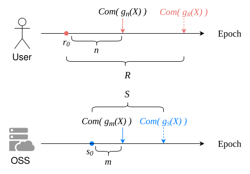
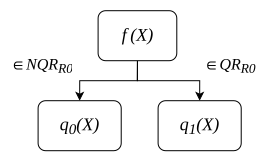
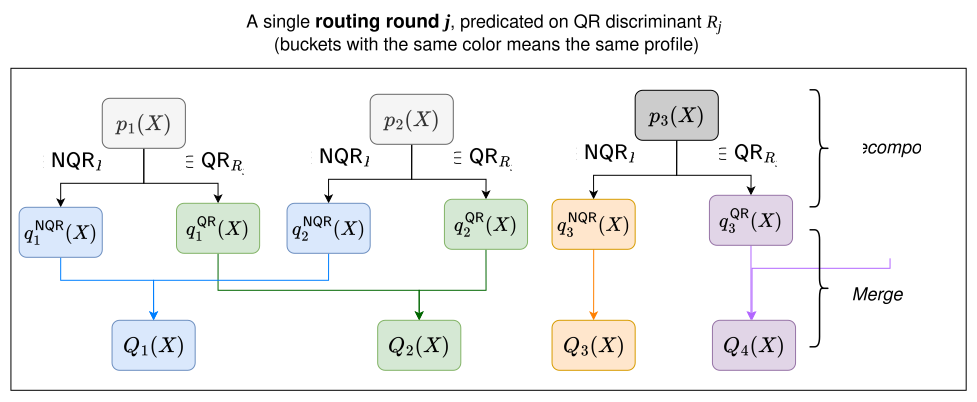
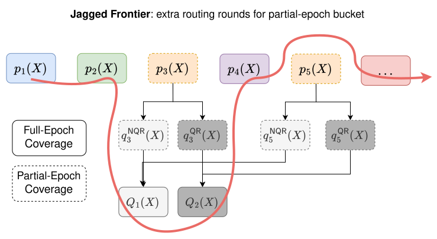
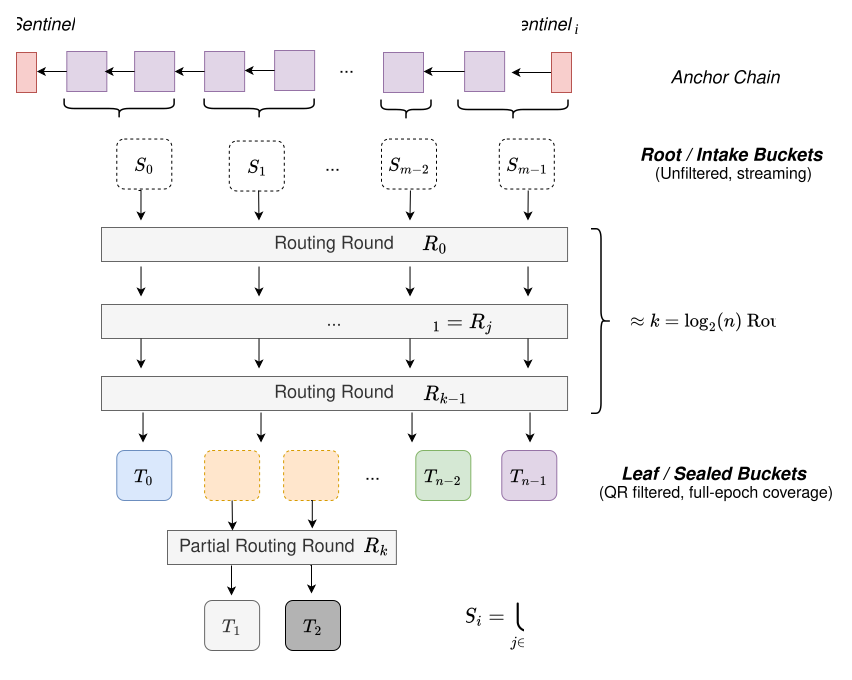
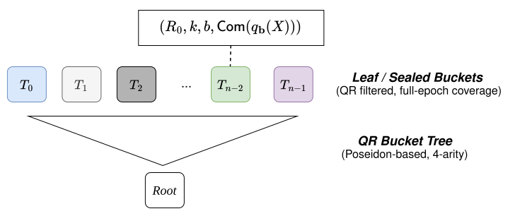
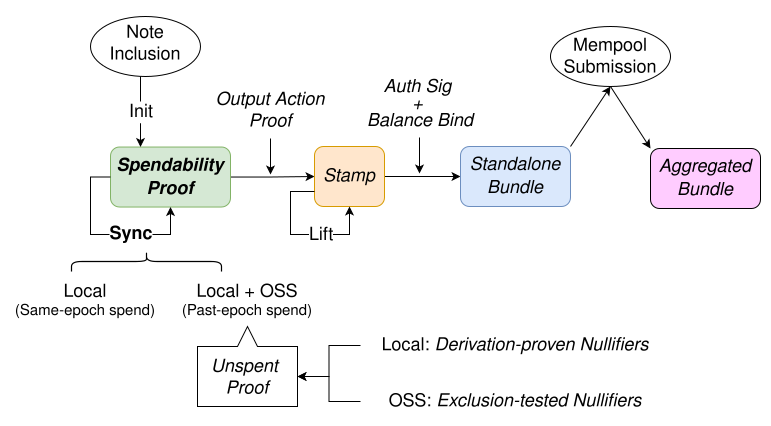
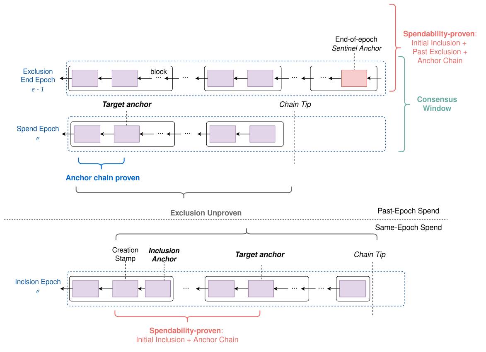
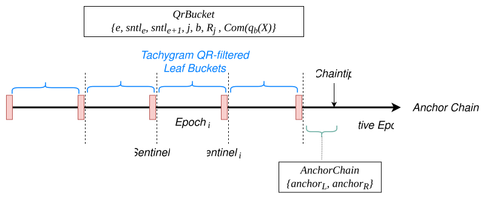
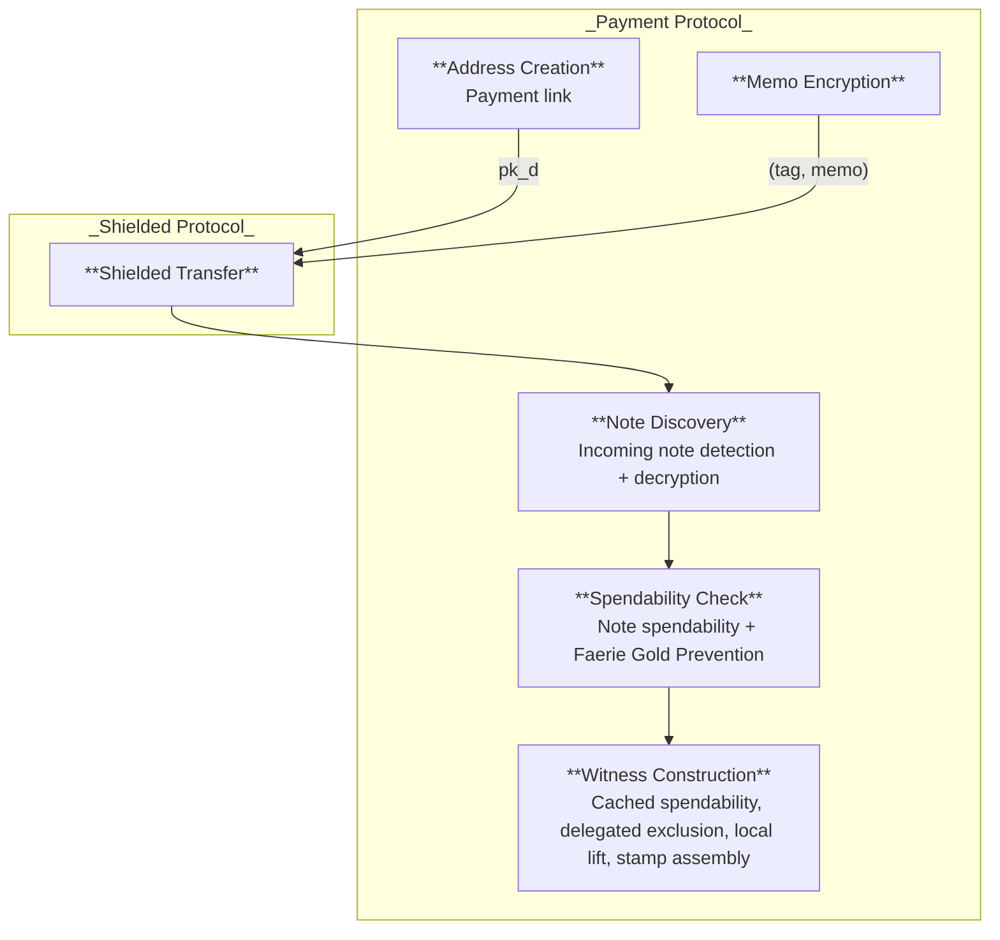

# A Deep Dive on Tachyon

Although Tachyon’s central contribution is its use of prunable nullifiers to
scale Zcash without compromising privacy, we begin from a different vantage point.
Rather than diving directly into how evolving nullifiers work, we first examine a
foundational design decision in Tachyon’s key structure: the separation of concerns across subprotocols that shapes the rest of the system.

The [Zcash Spec](https://zips.z.cash/protocol/protocol.pdf) is most illustrious
for its sedimentary layers of meticulous notations and its evolving key
structures across network upgrades.
We marvel at the sophistication of the key designs, at the laborious effort
behind to strive for efficiency, security, and rich functionalities all at once.
But why such growing complexity? After all, the Sprout upgrade, following the
original [Zerocash](https://eprint.iacr.org/2014/349.pdf), only requires one
payment key and one encryption key.

  

One source of the complexity is the **separation of proof generation and
transaction authorization**. In Zerocash/Sprout, a valid SNARK proof already
ensures rightful ownership, thus no further authorization needed theoretically.
In practice, however, hardware wallets are both resource constrained and vendor
gated to support intensive proof generation. While Sprout can lean on the zero
knowledge of SNARKs to prevent linkability, Sapling spends authorized via
signatures requires *re-randomizable signature* to prevent linkage between
spends from the same owner. This re-randomization manifests through the
*authorization key* $\ak$ in the secret witness and the *randomized authorization
key* $\rk = \ak + [\alpha]\,\G$ in the public instance of the proof.
The spend authorization signature is verified against the publicized $\rk$.

Another reason for the complexity is the **conflation of note ownership
and note transmission**. Since the original Zerocash (inherited in all Zcash
upgrades), the payment address serves *dual* purposes: declaring note ownership
and facilitating transmission of note secrets. The sender of a transaction
needs to securely communicate the output note openings so that they can be spent
later by the recipient. Without assuming secure channels between all users,
Zcash has been transmitting the encrypted memo *in-band* as part of the
transaction, effectively using the blockchain as the public bulletin board.
The payment address, publicized to the sender, contains a *transmission key*
which is the encryption key of a hybrid public key encryption scheme.
Zcash, from Sapling onward, is extra cautious about the privacy leakage in case
of colluding senders under reused transmission keys.
Therefore, *diversified address* is introduced to randomized the transmission
key *while preserving the same incoming viewing key* $\ivk$ for memo decryption
and detecting incoming notes.

Furthermore, **fine-grained disclosure of transaction flows** requires a
distinct *outgoing viewing key* to enable optional viewing of outbound notes.
Viewing keys support selective disclosure of both incoming and outgoing notes,
either to the account holder or to authorized third parties.
This separation also facilitates quantum-safe outgoing viewing keys from day
one, as they are not subject to the address-diversification requirement that
currently ties $\ivk$ to discrete-log–based constructions.

## Decoupling Payment Protocol from Shielded Protocol {#decouple}

A key observation Tachyon makes is that we can **separate the concerns of
spend authorization and note transmission**! This separation appears in the
decoupling of the shielded protocol from the payment protocol. The payment protocol
is responsible for full payment address construction, note transmission, and
selective disclosure capabilities, while the shielded protocol is reduced to the
minimal functionality required to maintain the shielded pool and enforce note
ownership and authorized transfers on-chain.

Informally:

- Shielded protocol: binds every note to an owner for spend authorization
  - Spend authorization requires both valid proof of ownership (proof of
  knowledge on $\nk$) and transaction authorization (signature under $\rk$)
  - Beyond maintaining the shielded pool, the blockchain acts as a data
  availability layer for arbitrary payment-protocol data
- Payment protocol: securely transmits relevant note info to intended recipients
  - Wallets, typically standardized, define the concrete key derivation hierarchy
  needed to satisfy the payment protocol’s functionality and security requirements.
  - Wallets may support multiple payment protocols, such as 
  Payment request ([ZIP-321](https://zips.z.cash/zip-0321)) and
  URI-encapsulated Payments ([ZIP-324](https://zips.z.cash/zip-0324)).

The rationale for this separation becomes clearer when examining the underlying
key material. Of all derived keys, *only two* are strictly necessary for enforcing
note ownership: the nullifier key $\nk$, used to derive nullifiers, and the
authorization key $\ak$, used to derive the randomized spend validation key.
Both are known only to the note owner and supply as secret witnesses in the
SNARK proof.

In Zcash today, a shielded payment address binds together $(\ak, \nk)$ and
additionally includes $\ivk$ for incoming note detection. Tachyon instead
decomposes this structure into a payment key $\pk = \mathsf{Com}(\ak, \nk)$, a
binding commitment to the pair and a *separate* transmission key managed entirely
by the payment protocol. This significantly simplifies the shielded protocol’s
key architecture by removing functionality unrelated to spend authorization.

> Among the main [security properties](https://zcash.github.io/orchard/design/nullifiers.html#security-properties),
> Tachyon shielded protocol needs to uphold Ledger Indistinguishability
> (defined in [Zerocash](https://eprint.iacr.org/2014/349.pdf)),
> Balance, Note Privacy, Note Privacy (OOB), Spend Unlinkability (but attackers access
> restricted to only payment key).
> Full Spend Unlinkability (attacker with $\ivk$ access) and Faerie Resistance are now
> the responsibilities of the payment protocol.
> Security analysis on a more [comprehensive list](https://github.com/daira/zcash-security) of properties is outside our scope.

This separation[^reproduce-orchard] yields several benefits:
a narrower and more manageable scope for shielded pool upgrades,
cleaner isolation of security assumptions for auditing,
greater flexibility in exploring payment protocol designs while preserving a stable
shielded core, and the ability to develop sub-protocols in parallel.
More broadly, we believe this separation of concerns enables Tachyon, and future
post-Tachyon upgrades, to evolve more rapidly while supporting more modular
security analysis.

[^reproduce-orchard]: One way to convince yourself that such separation works is
    to reproduce all of Orchard functionalities in this decoupled framework. We
    leave it as a homework exercise for the readers. 
    As a hint, your diversified address now may look like
    $\mathsf{addr} := (\pkd, \tk)$ where
    $\pkd = \mathsf{Com}(\ak, \nk; \rpk)$ is the diversified payment key,
    $\tk = (d, pk_d)$ is the diversified transmission key.
    Your $\ivk = \mathsf{ToScalar}(\PRF_\sk([9]))$ can now be directly
    derived from master spending key $\sk$, rather than meandering through
    layers of indirect derivation (similarly for outgoing viewing key).

## Shielded Protocol {#shielded}

We incrementally cover the whole Tachyon shielded protocol in this section.

> Note: in practice, all derivation functions (e.g., hash, KDF, XOF, and Derive)
> should be domain-separated;
> we omit this detail here for simplicity of presentation.

### Payment Key {#payment-key}

As explained [above](#decouple), Tachyon shielded protocol only expects an
authorization key $\ak$ from a re-randomizable signature scheme[^redpalla] and
a nullifier key $\nk$. While both keys *should* be derived from a master spending
key as per [ZIP-32](https://zips.z.cash/zip-0032), the concrete derivation path
is specified by wallet standards. The transfer proofs in shielded transaction only
use them directly as secret witnesses to further derive public values including
(randomized) spend validating key $\rk$ and nullifier $\nf$, but never constrain
their derivations. The shielded protocol only mandates that they are
indistinguishable from randomly sampled keys.
    
[^redpalla]: Tachyon sticks with $\mathsf{RedPallas}$, a Schnorr-based signature
    over the Palla curve supporting re-randomization, as in Orchard.
    See our [approach](#pq-rerand) when fully migrating to post-quantum world.

  

The payment key $\pk = \mathsf{Com}(\ak, \nk)$ is the owner field every note
commits to: a binding commitment to the $(\ak, \nk)$ pair. A wallet
mints a fresh address per sender from its master spending key in 
[ZIP-32](https://zips.z.cash/zip-0032)-style.
Instantiated with a hash-based commitment, $\pk$
gives a succinct owner field and
[quantum recoverability](https://zips.z.cash/draft-ecc-quantum-recoverability)
today.
Publicizing $\ak$ directly, a Schnorr verification key, to senders who might have
future access to a quantum computer exposes the user 
["Harvest Now, Decrypt Later"](https://en.wikipedia.org/wiki/Harvest_now%2C_decrypt_later)
risk.

Spend authorization follows the same construction as in Orchard.
The authorization key pair satisfies the DLog relation $\ak = [\ask]\,\G$, and
can be re-randomized into an unlinkable key pair using a randomizer $\alpha\in\F$.
Transactions are signed using the re-randomized signing key $\ask + \alpha$.
The resulting signature is unlinkable to the original spending authority,
while remaining verifiable against the randomized spend validating key $\rk$,
defined as:

$$
\rk = \ak + [\alpha]\,\G = [\ask + \alpha]\,\G
$$

### Note {#note}

A tachyon note is a tuple:

$$
\mathsf{Note}^\mathsf{Tachyon} := (\pk, v, \psi, \rcm)
$$

where $\pk$ is the [payment key](#payment-key), $v$ is the value of the note,
$\psi$ is pseudo-random note identity that binds to the note nullifier value
as an input to its derivation, and $\rcm$ is a random commitment trapdoor[^cm-psi].
In contrast to Sapling/Orchard, the note commitment in Tachyon
$\cm = \mathsf{Com}(\pk, v, \psi; \rcm)$ is purely based on symmetric primitives[^cm].
Thus, Tachyon doesn't require extra enforcement on $\rcm$ derivation on wallets
to achieve quantum recoverability
like [Orchard does](https://x.com/zkDragon/status/2026047830759182672).

[^cm-psi]: Pseudorandom values like $\psi$ and $\rcm$ should be
    deterministically derived from the wallet master key via secure KDF to avoid
    poor operational entropy. The derivation should be standardized.

[^cm]: Sapling and Orchard uses variants of the vector Pedersen commitment,
    which relies on DLog hardness. We choose Sponge-based Hash constructed from
    algebraic permutation Poseidon.
    
### Evolving Nullifier {#nf}

Readers should refer to Sean's 
[post](https://seanbowe.com/blog/tachyon-scaling-zcash-oblivious-synchronization/)
and the [short note [BM25]](https://eprint.iacr.org/2025/2031.pdf) for a
detailed motivation and an overview of Tachyon's evolving nullifiers.

A scaling Zcash produces more note commitments and nullifiers, both accumulating
in the shielded pool. The commitment set grows on disk, but luckily storage is cheap.
The nullifier set becomes the bottleneck: every transaction must check that its
inputs' nullifiers have never appeared before, which forces consensus nodes to
keep the whole set in memory *on the critical path*.
At Visa-level throughput, this nullifier state would grow by an [unattainable
500 GB per day](https://youtu.be/D51JV1ItMGE?si=5i5ByeKYg6fhf7U8&t=201).

Tachyon offloads most of this check to the user. The consensus node retains only
nullifiers from the most recent blocks; the user supplies an *exclusion proof*
attesting that their nullifier does not appear anywhere in the older history.
This proof must be kept current as each new block lands, which Tachyon achieves
incrementally via [proof-carrying data (PCD)](https://tachyon.z.cash/ragu/concepts/pcd).
Since constantly scanning blocks and refreshing proofs is onerous, users can
outsource the task to an *oblivious syncing service (OSS)*. However, updating
an exclusion proof requires knowing the nullifier value, and a nullifier revealed
to the OSS lets it trace the eventual spend of that note — a disastrous
privacy leak. Tachyon resolves this by letting nullifiers **evolve across
epochs**: the value a user shares with the OSS in one epoch is unlinkable to the
value revealed at spend time. This breaks a long-standing Zcash invariant:
each note has only *one* nullifier that is globally unique value in the pool.
As a result, Tachyon requires both a new nullifier derivation and a new
double-spending prevention mechanism.

> **<a id="philosophy">Philosophy:</a> Client-side Validation**
> ([CSV](https://eprint.iacr.org/2025/068)).
>
> Tachyon's scaling approach rests on one principle: move validation off the
> critical path of consensus and onto the client wherever possible. As a
> blockchain scales, the burden on consensus nodes grows along every axis —
> compute, memory, storage, and bandwidth. The remedy is to let the transacting
> client prove its own correctness and leave consensus only cheap verification.
> This principle guides many design decisions beyond our prunable nullifiers.

The ideal functionality for an epoched nullifier is a deterministic function

$$\nf_e = \mathsf{KDF}(\nk, \psi, e)$$

whose outputs are indistinguishable from random bytes. Such an $\nf_e$ binds to
both the spending authority (via $\nk$) and the underlying note (via its
per-note trapdoor $\psi$), while remaining unlinkable across epochs to anyone
without $\nk$.

Circuit efficiency and delegated privacy shape the choice of $\mathsf{KDF}$.
A *constrained PRF* [[BW13]](https://eprint.iacr.org/2013/352.pdf) would let the
wallet hand an OSS an evaluation key for a delegation range, but the [GGM-based
candidate](./ggm.md) has relatively poor circuit efficiency (see its [cost
analysis](./nf-analysis.md#ggm-cost)). After exploring the
[alternatives](./nf-analysis.md), we instead entrust users themselves to derive
and prove their nullifiers. The OSS receives nullifier values and a proclaimed
range without any note-binding evidence: a valid syncing request may equally be
a decoy list unrelated to any note. The user/wallet later binds the exclusion
proof returned by the OSS to nullifiers derived from the actual note.

The [leading candidate](./nf-analysis.md) evaluates several consecutive
nullifiers with one algebraic permutation:

$$
\nf_e = \mathsf{Poseidon}^\nf.\mathsf{Permute}
(\nk, \psi, \lfloor e/\mathsf{Rate}\rfloor)[e\bmod\mathsf{Rate}].
$$

For example, if a user wants to cover epoch $\{5,6\}$ with a sponge rate of
$\mathsf{Rate}=4$, she would delegate the range $S=[5,7)$, a subrange of
local derivation range $R=[4,8)$ realized by a single Poseidon squeeze:
$\nf_4, \ldots, \nf_7 = \mathsf{Poseidon}^\nf.\mathsf{Permute}
(\nk, \psi, \lfloor 6/4 \rfloor = 1)$.
In practice, the delegation range may be larger, which requires the user
multiple PCD steps to fully cover the whole $R$.

> For the remaining presentation, $\nf_e=f_k(e)$ denotes any construction that
> provides efficient batched evaluation and the required semantic security.

#### Ranged Nullifier Commitment {#nf-flow}

A **ranged nullifier commitment** binds a sequence of epoched nullifiers
$[(i,\nf_i)]_{i\in R}$ for some epoch range $R$.
This primitive provides three properties:

- **Position and value binding.** A committed entry binds both its epoch $i$ and
  its nullifier $\nf_i$.
- **Incremental range extension.** The commitment can be incrementally built and
  updated without fixing the range endpoint in advance.
- **Indexed-subset proof.** Given commitments to two nullifier ranges, the
  prover can succinctly prove that every indexed value in one occurs in the
  other. Range counters separately enforce order and contiguity.

The natural candidate is a vector commitment (VC) scheme that supports subvector
opening and updatability (cf a
[SoK on VC](https://www.di.ens.fr/~nitulesc/files/vc-sok.pdf)).
However, existing solutions are all built on RSA or bilinear groups, neither is
circuit-friendly. Luckily, in our specific use case, we don't strictly need a
full-blown VC: our nullifier commitment is built incrementally, with each update
proven correct against the running commitment. In other words,
the prover in a standard VC is given $[(i,\nf_i)]$ to produce a commitment to
the verifier for subvector opening, but a cheating prover could deviate from
the prescribed commit algorithm; whereas in our context, we can enforce honest
commit/update, thus expand the design space for the commitment scheme.

In our setting, the wallet locally proves correct derivation of nullifiers in
range $R$ and commits to them. Concurrently, the OSS receives opaque pairs
$(i,\nf_i)$, proves each $\nf_i$ absent from all tachygrams appeared in the past
epoch $i$, and commits to the epoched nullifiers for which it has tested
non-membership. Both the wallet and the OSS compute their nullifier commitment
incrementally because both nullifier derivations and non-membership tests span
across multiple PCD steps. The wallet then proves that the OSS-tested indexed set
is contained in its locally derived range. This binds the delegated exclusion
proof back to the note without revealing the note or any linkable information to
the OSS.

  

Here is our concrete construction.

Let $\nf_i=f_k(i), k=\mathsf{KDF}(\nk,\psi)$
where evaluations outside any revealed set remain computationally
indistinguishable from random. To bind both an epoch position and its value, fix
a *non-cubic residue* $c\in\F$ and encode $(i,\nf_i)$ as the cubic factor

$$
F_{i,\nf_i}(X) := ((i+1)\, X + \nf_i)^3 - c.
$$

Encoding both the absolute epoch index $i$ and its nullifier $\nf_i$ in each
factor provides both positional and value binding. It allows us to sidestep
traditional vector commitments and collect the range as an **indexed multiset**,
which admits a simple subset proof.

The wallet begins at an arbitrary epoch $r_0$. For a consecutive range
$R=[r_0,r_0+n)$ it derives the corresponding nullifiers and commits to

$$
g_R(X) := \prod_{i\in R} F_{i,\nf_i}(X)
$$

The commitment is incrementally built. Starting from $g_\varnothing(X)=1$,
appending the next epoch gives

$$
\begin{aligned}
g_{n+1}(X) &= g_n(X)\cdot F_{r_0+n,\nf_{r_0+n}}(X) \\
&= g_n(X)\cdot \left( ((r_0+n+1)\, X + \nf_{r_0+n})^3 - c \right)
\end{aligned}
$$

Using Ragu's polynomial oracle[^polyoracle] functionality, we can easily check the
update to the commitment by identity testing at a random point.
Importantly, this commitment is naturally extensible without fixing the overall
range $R$ or the endpoint in advance.

An OSS receives opaque pairs $(i,\nf_i)$ and proves each $\nf_i$ absent from the
assigned portion of epoch $i$'s public history. It commits to the corresponding
indexed factors for the consecutive range $S=[s_0, s_0+m) \subseteq R$:

$$
g_S(X):=\prod_{i\in S} F_{i,\nf_i}(X)
$$

To bind the delegated work back to the note, the wallet proves that every
OSS-tested $(i,\nf_i)$ occurs in its locally derived range. This indexed-subset
relation is enforced via the standard quotient argument: there must exist a
quotient $q(X)$ such that

$$
g_R(X)=g_S(X)\cdot q(X).
$$

The commitments to $g_R$, $g_S$, and $q$ are fixed before the oracle challenge
$r\sample\F$, after which the verifier checks $g_R(r)=g_S(r)\cdot q(r)$.

Divisibility itself is commutative and therefore proves only indexed-multiset
inclusion; it *does not prove order*. Order is enforced separately by requiring
$S$ to be a contiguous increasing epoch range and checking its counter and
sentinel endpoints as it is built.

**Soundness sketch.** For Pasta scalar field $\F_p$, we know $p=1\pmod 3$, thus
we can fix $c=2$ as a public non-cube. Then $Y^3-c$ is irreducible over $\F$,
and so is its image under every invertible affine substitution $Y=aX+b$. For a
valid epoch $0\leq i<2^{32}$, we have $a=i+1\neq0$ in $\F$.
With unique factorization, there is only a rare chance left for indexed-subset
forgery: when $F_{a,b}(X)$ is not injective:

$$
\begin{cases}
a_1 = \omega\, a_2 \\
b_1 = \omega\, b_2 \\
\omega^3 = 1
\end{cases}\Longleftrightarrow
(a_1\,X + b_1)^3 = (a_2\,X + b_2)^3 \quad\text{over }\F_p
$$

But since our epoch range is small $i\in \{0,1\}^{32} \ll F_p$ and the nontrivial
cubic root of unity $\omega$ is very large, such coincidence will never occur.
Even though we didn't explicitly enforce $i$'s range in circuit, we do enforce
its increment as the user or the OSS incrementally builds $g_R(X)$ and $g_S(X)$.
Additionally, an out-of-range $i$ will result in invalid [anchor](#anchor) values
in the final proof; thus indirectly rejected.

#### Nullifier Security {#nf-sec}

We now examine how the evolving nullifier upholds the security properties [carved
out](#decouple) for the shielded protocol. Readers can safely skip this
section and come back later since the analysis refers to concepts introduced
in later sections.

**Balance.** Only the holder of $\nk$ can compute any $\nf_e=f_k(e)$, since
$k=\mathsf{KDF}(\nk,\psi)$ requires it. A spend proof pins both $\nf_e$ and
$\nf_{e+1}$ to a deterministic function of the note and epoch, so a note has
exactly one valid nullifier per epoch and no freedom to mint a fresh value that
dodges a past spend. Double-spending is ruled out by two complementary checks:
the user proves exclusion from authenticated older history, while consensus
checks duplicates in the recent epochs it retains. Publishing both adjacent
nullifiers makes those checks overlap across an epoch boundary.

**Note Privacy.** The adversary is a keyless third party reading the whole
on-chain transaction, including any in-band memo. The shielded footprint, namely
the commitment $\cm$ (hidden by $\rcm$), the spend's revealed nullifiers (pseudorandom
by the semantic security of $f_k$), the rerandomized $\rk$, and the hiding $\cv$,
reveals none of $\pk$, $v$, $\psi$. The in-band memo is payment-protocol data
that the shielded protocol carries opaquely and never parses (committed only to
`da_digest`), so its secrecy rests on the payment protocol's encryption, not on
the shielded core.

**Note Privacy (OOB).** Here the note plaintext travels out of band rather than
as an in-band ciphertext, so the adversary of concern is the sender, who learns
$\pk, v, \psi, \rcm$ but never the recipient's $\nk$. Because every $\nf_e=f_k(e)$
hangs off the nullifier key $k = \mathsf{KDF}(\nk, \psi)$, which cannot be formed
without $\nk$, knowledge of the note plaintext alone does
not let the sender, or anyone it colludes with, recognize the recipient's
eventual spend on chain or link it back to the note it sent.

**Spend Unlinkability.** Across epochs the $\{\nf_e\}$ of a fixed note are
mutually pseudorandom to anyone lacking $\nk$: by the semantic security of
$f_k$, any set of revealed evaluations leaves every evaluation outside it
indistinguishable from random, and this holds even for the pair
$\nf_e, \nf_{e+1}$ revealed together at spend. Delegation is *list-bounded*: an
OSS [delegated](#nf) a set $S$ holds the explicit evaluations
$\{(e, \nf_e)\}_{e \in S}$ and no key material at all, so it can refresh
exclusion proofs for exactly those epochs and predict nothing beyond the list.
It sees the public history segments assigned to it, but not the note commitment,
the user's note-binding proof, or the eventual spend endpoint. Range
standardization, decoys, and local continuation can therefore keep maintenance
and imminent-spend requests in the same cryptographic shape.
And since $k$ binds the per-note $\psi$, a list delegated for one note reveals
nothing about any other note the user owns. To an attacker holding only the on-chain
$\cm$, the spend is unlinkable to it, since the two draw on disjoint randomness
($\rcm$ versus $k$). The stronger flavor of spend unlinkability, under
incoming viewing key access, falls to the payment protocol, since Tachyon's
shielded core has no $\ivk$.

**Faerie-gold via the wallet.** In Orchard, Faerie-gold resistance comes from
binding each new note's $\rho$ to the unique nullifier of an input note.
Tachyon's [tachygram accumulator](#acc) does not assign notes a canonical
position, so the shielded protocol cannot enforce that binding. A malicious
sender could in principle pick colliding $\psi$ values across two notes sent
to the same recipient, where only one of them is spendable. We push detection
to the recipient's wallet: upon receiving a note, the wallet computes the note's
nullifier at a fixed reference epoch and rejects the note if it collides with any
other note it currently holds. Since a wallet's note set is small, the check is cheap;
the knowledge that compliant wallets will reject such collisions is enough to
deter the attack.

### Tachygram Accumulator {#acc}

All shielded pools in Zcash today maintain two separate accumulators:
a note commitment Merkle tree for efficient inclusion proofs and a nullifier
set with constant-time membership queries for exclusion testing.

Tachyon instead uses a single cryptographic accumulator whose members are
encoded as roots of a polynomial, so that both membership and non-membership
tests reduce to a single evaluation query.
Conveniently, Tachyon's PCD proof system natively and cheaply supports
evaluation queries against *online polynomial oracles*[^polyoracle].
Because the accumulator is universal[^universal], it need not distinguish
nullifiers from note commitments: a single accumulator collects
indistinguishable 32-byte blobs, each a **tachygram**, that can be either a
nullifier *or* a commitment.

$$
\tg := \begin{cases}
    \cm = \mathsf{Com}(\pk, v, \psi; \rcm) &\quad\text{in Output actions}\\
    \nf_e = \mathsf{KDF}(\nk, \psi, e) &\quad\text{in Spend actions}
\end{cases}
$$

[^polyoracle]: Ragu PCD proof, through [reduction of
    knowledge](https://eprint.iacr.org/2022/009), reduces down to a list of
    evaluation claims of multiple opening points on multiple polynomials.
    These claims are then
    [folded](https://tachyon.z.cash/ragu/protocol/core/accumulation/pcs.html)
    into a single running aggregated claim.
    Ragu expose the capability to fuse online/application-time polynomial
    queries into the proof system directly, without encoding the evaluation
    through the constraint system which can be expensive.
    This is spiritually similar to
    [lookup argument](https://zcash.github.io/halo2/design/proving-system/lookup.html)
    enforced as part of the PIOP relation rather than through the circuit.
    
[^universal]: In [crypto literature](https://eprint.iacr.org/2018/1188.pdf),
    a universal accumulator is dynamic (supports insertion and removal) and
    supports both membership and non-membership proofs.

The accumulator is the commitment to a polynomial $f^\tg(X)$:

$$
\tgacc = \mathsf{Com}(f^\tg(X)) = \mathsf{Com}( \prod_i{(X - \tg_i)} )
$$

The key properties of this universal accumulator:

- Membership is enforced via $f^\tg(x) = 0$, non-membership via
  $f^\tg(x) \neq 0$. Both tests are insensitive to multiplicity, so this is a
  *multiset* accumulator: a tachygram appearing $m$ times contributes the factor
  $(X - \tg_i)^m$, but a single occurrence already certifies membership.
  - We do not deduplicate. In honest operation every tachygram is a distinct
    pseudorandom blob, so multiplicity exceeds one only with negligible (or
    adversarial) probability; and since (non-)membership ignores multiplicity,
    such cases are harmless. 
  - Consensus nevertheless requires every newly validated tachygram to be distinct
    from both the retained window and earlier tachygrams in the same candidate
    bundle. Consequently every accepted per-epoch accumulator guarantees to have
    a multiplicity of $1$ for all members/roots.
- Members are *unordered*: a multiset commitment, not a vector commitment.
- <a id="union">**Multiset union**</a>
  is polynomial multiplication, yielding a product accumulator
  $f^\tg(X) \cdot g^\tg(X)$ (unconditionally, with no disjointness precondition);
  multiset difference is division, yielding a quotient $\frac{f^\tg(X)}{g^\tg(X)}$
  whenever the divisor is contained, and failing with a remainder otherwise.
  - A union can be tested via $p(r) \iseq f(r) \cdot g(r)$ at a random point
    $r\sample\F$.

We emphasize a subtlety in the security of this polynomial-based accumulator.
Polynomial-commitment binding says that a commitment opens to one polynomial; it
does not say that this polynomial is the accumulator of the claimed tachygrams.
An attacker could instead commit to a polynomial that adds a malicious root or
drops a genuine one, making the corresponding membership test true or false at
will. Tachyon therefore verifies every $\tgacc$ against its published tachygram
list using the technique [below](#acc-correct). The randomized identity test is
sound relative to the PCS degree bound $D$: commitments are fixed before the
challenge, so a false identity passes with probability at most $D/|\F|$.

#### Checking Accumulator Correctness {#acc-correct}

Our goal is to check the correctness of the accumulator value $\tgacc$ given
a public list of $\set{\tg_i}$ *without expensive recomputation*.

The solution is batch verification via a randomized point check.
The verifier samples a random $r\sample\F$ and invokes the PCS evaluation
procedure on the (commitment, point, evaluation) claim $(\tgacc, r, y_r)$, where
$y_r = \prod (r - \tg_i)$ is computed locally.
Naturally, this proof can be made non-interactive with Fiat-Shamir.
Notably, the verifier performs only cheap field operations, avoiding the group
operations that recomputing the commitment would require (for Pedersen, KZG, or
Bulletproof PCS).

### Tachyon Transaction {#tx}

Each block contains one or more transactions. Each transaction has a `txid`,
which commits only to its _effecting data_
([ZIP-244](https://zips.z.cash/zip-0244)) and is therefore the stable,
non-malleable transaction identifier, and a `wtxid`
([ZIP-239](https://zips.z.cash/zip-0239)), which additionally commits to the
malleable authorization data and is the identifier used to relay v5+ transactions
over the p2p network.
Each transaction optionally contains a bundle of transfers from each pool:
JoinSplit for Sprout (soon deprecated), Spend/Output for Sapling, Action for
Orchard, and now Tachyon Action for the new Tachyon pool.

A **Tachyon Action transfer** either spends an old note or creates a new one.
Whether a spend or an output, its *Action description* is uniformly represented
by a pair $(\rk, \cv)$, where $\rk$ is the randomized spend validating key, whose
derivation *binds to the underlying note*, and $\cv$ is a blinding commitment to
the net value (positive for a spend, negative for an output, following the
Sapling/Orchard sign convention).
Unlike Sapling and Orchard, the tachygrams (nullifier or commitment) are left
out of the description, because evolving per-epoch nullifiers are no longer
static. We instead bind the note to $\rk$ through its randomizer $\alpha$:

$$
\begin{cases}
\rk = [\ask + \alpha]\,\G \;\;\text{(spend)}
\qquad
\rk = [\alpha]\,\G \;\;\text{(output)}\\
\alpha = \PRF(\cm \| \theta)  \quad\theta\text{: arbitrary entropy}
\end{cases}
$$

A spend's $\rk$ re-randomizes the custody-held spending authority $\ask$; an
output's carries no authority at all — creating a note requires none, since the
binding signature already enforces that outputs are funded. An output's signing
key is thus just $\alpha$, so a hot device can sign outputs without a custody
round-trip; only spends need the custody-held $\ask$. Both forms of $\rk$ are
uniformly random points, indistinguishable on chain.

The Tachyon bundle inside a transaction carries a sequence of Action
descriptions together with the net balance of all action transfers
$v^{\mathsf{bal}} = \sum_{\mathsf{spends}} v - \sum_{\mathsf{outputs}} v$,
positive when value leaves the shielded pool, matching the `valueBalance`
convention of Sapling/Orchard and keeping the ZIP-209 pool-turnstile accounting
uniform across pools. The balance is proven by a *binding signature*
$\sigma^{\mathsf{bind}}$ as in Sapling/Orchard.

Recall: How binding signature works.

The net value commitment $\cv$ in every action description is Pedersen-committed:

$$
\cv = [v]\,\G + [\rcv]\,\H
$$

where $\rcv$ is the blinding factor and $\H$ is an independent group generator.
(Both value-commitment bases are independent of the spend-authorization base
behind $\rk$; in practice Tachyon reuses Orchard's `ValueCommit` generators.)

By the homomorphic property of Pedersen commitments, the verifier can sum the
$\cv$ in a bundle to obtain $\sum_i{\cv_i}$, itself a blinding commitment to the
net balance $v^\mathsf{bal}$ with blinding factor $\bsk = \sum_i{\rcv_i}$:

$$
\sum_i{\cv_i} = [\sum_i{v_i}]\,\G + [\sum_i{\rcv_i}]\,\H
= [v^\mathsf{bal}]\,\G + [\bsk]\,\H.
$$

To verify the net balance, the validator reconstructs a discrete-log public key

$$
\bvk = \sum_i{\cv_i} - [v^\mathsf{bal}]\,\G,
$$

and then verifies a Schnorr signature $\sigma^\mathsf{bind}$ produced under
$\bsk$. Effectively, the signature serves as a proof of knowledge of the secret
scalar $\bsk$ behind the public key $\bvk$.

Before describing the stamp, we name a recurring object it relies on: the
**spendability proof**. Once complete, it establishes
two historical facts about a spent note: its commitment appeared in a stamp
included in a finalized block (*inclusion*), and every nullifier required for
complete earlier epochs was absent (*exclusion*). For a same-epoch note the
exclusion range is empty. Historical claims remain relative to an authenticated
chain position until the target anchor is checked by consensus. Since old
tachygrams are pruned from the live tachygram set, these facts are proven against
an authenticated history of tachygrams on-chain.

Once the creation block is finalized, the wallet may prepare evidence for an
immediate same-epoch spend, where no past exclusion is required. If the note
survives the epoch, authenticated full-epoch evidence establishes both creation
membership and inclusion-epoch nullifier exclusion. Additional full-epoch
evidence extends exclusion through later completed epochs.

A **Tachyon Stamp** provides a PCD proof that every action in the bundle is
valid and that the action and tachygram accumulators match those actions.
Its public inputs are $(\actacc,\tgacc,\anchor)$. The stamp
also publishes the tachygram multiset $\set{\tg_i}$. The target epoch is implied
by the target $\anchor$ in the [anchor chain](#anchor).
Alternatively, the stamp holds a `wtxid` reference to another transaction whose
stamp carries an aggregated PCD proof and the corresponding public inputs.
The accumulator is included to spare miners from recomputing it over all
tachygrams; instead, the correctness of $\tgacc$ is proven using the
[batched verification trick](#acc-correct).
The PCD construction supports aggregating finished bundle proofs: a new
aggregated transaction will be created whose stamp contains the union of the
action and tachygram multisets, their accumulators, the common anchor, and an
aggregated PCD proof. The stamps of all constituent transactions are replaced
by a reference to the aggregated transaction's `wtxid`.

> Note: an aggregated Tachyon bundle shares exactly the same format as a normal
> standalone bundle (a.k.a. a _Tachyon autonome_), and may even carry additional
> Action descriptions of its own. A purely aggregating bundle, by contrast,
> carries an empty Action list (hence no authorization signatures), a zero value
> balance, a trivial binding signature, and a stamp holding the aggregated proof
> and its proof data.
>
> The balance check and authorization signature verification (including the
> `SIGHASH` computation) are identical for every bundle, aggregated or standalone.
> The only difference is proof verification: an aggregated bundle verifies against
> the single stamp of the aggregated transaction, so its cost is amortized across
> all constituents and thus economically incentivized.

Importantly, each Action description is **associated with two tachygrams**, a
consequence of the evolving nullifiers. If a user proves only the nullifier
$\nf_e$ for the current epoch $e$, the epoch may advance to $e+1$ before the
transaction is picked up from the mempool. Since neither miners nor the OSS—the
latter responsible only for syncing past epochs, and never learning future
nullifiers, least of all at spend time—can unilaterally update the proof, the
transaction goes stale and requires further user input to refresh. This is poor
UX and a potential timing side-channel that leaks privacy. We therefore require
every spend action to reveal (and prove in circuit) the nullifiers for **both the
current and the next epoch**, leaving an ample buffer against this cross-epoch
race. To keep spend and output actions indistinguishable, we further require each
output action to publish a dummy tachygram alongside its note commitment, so
every action uniformly carries two.[^padding]

[^padding]: Without the dummy, a spend would carry two tachygrams and an output
    one. A bundle already reveals its action count $n$ (one authorization
    signature per action), so the tachygram count $t$ would give away the
    split: $s = t - n$ spends and $o = 2n - t$ outputs. Padding fixes $t = 2n$
    identically, hiding the split. The leak without padding is only *arity*:
    tachygrams ride in the stamp as one flat multiset, so *which* action is a
    spend is never visible either way.

All non-malleable parts, collectively the *effecting data*, hash into a stable
identifier `txid`: a bundle commitment from each pool and their value balance
$v^{\mathsf{bal}}$. In-band memos count as effecting data in the legacy pools,
and they remain so in the Tachyon pool, entering `txid` through the `da_digest`
described below.
Each Action description is first mapped to a field element:

$$
a_i = \mathsf{Poseidon}(\rk_i, \cv_i).
$$

The Action multiset and its polynomial commitment are

$$
f^\mathsf{act}(X) = \prod_i (X-a_i),
\qquad
\actacc = \mathsf{Com}(f^\mathsf{act}(X)).
$$

Repeated Action descriptions contribute repeated factors. The canonical
encoding of $\actacc$ enters the Tachyon bundle commitment directly.

All mutable parts (orange in the diagram) commit only to the `auth_digest`, and
hence transitively to `wtxid = txid || auth_digest`; only the stable parts
(green in the diagram) contribute to `txid`.

Specifically,

- `da_digest` commits to the (optional) memo bytes, which the Tachyon pool
carries as an opaque DA blob: unconstrained, never parsed or interpreted by the
shielded protocol.
- `txid` commits to $(\actacc \| v^\mathsf{bal} \| \mathsf{da\_digest})$.
- `auth_digest` commits to $(\set{\sigma^\mathsf{act}}, \sigma^\mathsf{bind}, \mathsf{stamp})$.

Keeping the memo payload inside the effecting data is what makes it
tamper-proof. Authorizing data is malleable by definition, and Tachyon relayers
rewrite it in flight: aggregation replaces a transaction's stamp, and with it
`auth_digest` and `wtxid`. With `da_digest` inside `txid`, tampering becomes
detectable: every authorization signature signs over it through the `SIGHASH`,
so altering the DA bytes yields a different transaction whose signatures no
longer verify. ZIP-244 makes the same choice for the legacy pools by hashing
their in-band memo ciphertexts into `txid`.

Finally, the Tachyon bundle carries a spend authorization signature for every
Action description, each signed over the `SIGHASH`, which commits to the same
transaction-wide effecting data (across all pools) used to derive `txid`[^txid-sighash].
Block space can additionally serve as a data-availability layer for arbitrary
payment-protocol data used in note transmission; the shielded protocol neither
interprets this data nor checks its correctness. As explained [later](#payment),
the payment protocol Tachyon targets distributes the recipient's KEM encapsulation
key out of band through the [address](#address), and carries a KEM ciphertext
in-band only on rare first-contact transactions (ordinary payments carry none), so
the in-band footprint stays small. The scheme is quantum-safe from day one and
leaves the format unchanged even through a full [quantum upgrade](#pq).

[^txid-sighash]: `txid` and `SIGHASH` are domain-separated with different
    personalization strings, but they commit to the same effecting data.
    `SIGHASH` further incorporates a *SIGHASH type* byte, the `nConsensusBranchId`
    network-version identifier (e.g., NU5, NU6), and other consensus-level metadata.

### Anchor Chain {#anchor}

An anchor chain is a hash chain whose updates absorb **per-stamp**
[tachygram accumulator](#acc) commitments. Every stamp carries a $\tgacc$
committing to the tachygrams it introduces: those of a single bundle for a
standalone transaction (a *Tachyon autonome*), or their union across many
transactions for an [aggregate](#tx).
Each chain state (the $\anchor$ field in each block header) is an **anchor**;
$\tgacc$ itself is not an anchor, but a state delta to compute the next anchor.
A stamp in consensus epoch $i$ extends the chain as

$$
\anchor \leftarrow H(\anchor_{\mathsf{old}} \;\|\; i \;\|\; \tgacc)
$$

Binding $i$ at every tick lets a proof authenticate the epoch containing each
anchor-chain segment without relying on external validation.

At the transition into every epoch $i$, consensus appends exactly one
domain-separated **epoch sentinel**, after all stamps of epoch $i-1$:

$$
\sntl_i = H^{\mathsf{epoch}}(\anchor_{i-1,\mathsf{end}}\;\|\;i).
$$

Here $\anchor_{i-1,\mathsf{end}}$ is the final anchor-chain state before the
transition; for an epoch with no stamps, it is simply $\sntl_{i-1}$.
This is an ordinary update of the anchor-chain state already carried by every
block header, not a new header field: the terminal block of epoch $i-1$ commits
to $\sntl_i$ after processing its stamps and the transition. By convention,
**the sentinel for epoch $i$ always means its first anchor $\sntl_i$**. Epoch
$i$ therefore spans $\sntl_i$ to $\sntl_{i+1}$. Every transition has a sentinel,
so even an empty epoch has two distinct, authenticated boundaries. For epoch
zero, the genesis anchor-chain state replaces $\anchor_{-1,\mathsf{end}}$.

Every canonical anchor therefore determines a unique epoch: $\sntl_i$ and all
ordinary anchors after it but before $\sntl_{i+1}$ belong to epoch $i$. We write
$\mathsf{Epoch}(\anchor)$ for this value and assume validators implement this
map efficiently.

  

The chain therefore advances at *sub-block, above-transaction* granularity: in a
block containing only standalone Tachyon bundles, it ticks once per transaction.
A published stamp carries a target $\anchor$. As with
Orchard anchors today, validators maintain the (unpruned) anchor chain and are
responsible for validating the stamp's $\anchor$ against the canonical history.
When consensus accepts the stamp, its $\tgacc$ is absorbed into the current state
to produce the next anchor.

Why anchor *per-stamp rather than per-block*, when the block is the unit of
consensus finality? The primary justification is that it minimizes validator
work, in alignment with our [philosophy](#philosophy). Each stamp already ships a
$\tgacc$ whose correctness is [batch-verified in circuit](#acc-correct), so a
validator merely hashes it into the chain. A per-block anchor would instead force
every validator to rebuild a block-wide accumulator from scratch: re-accumulating
every tachygram in the block, interpolating the product polynomial, and
committing to it, which involves an expensive multi-scalar multiplication for
some PCS choices.

Per-stamp cadence also raises concerns about the cost of generating exclusion
proofs. To prove $\nf_e$ never appeared in epoch $e$, a user could naively show
$f^\tg(\nf_e) \neq 0$ against the accumulator of *every* stamp folded into the
chain that epoch. Instead, we leverage the [multiset union](#union) operation
on our accumulator polynomials to collapse the per-stamp checks into one.
The product of all stamp polynomials in an epoch is itself an accumulator over
all tachygrams of that epoch — the epoch accumulator $e(X)$:

$$
\underbrace{\circ \overset{f^\tg_1(X)}{\longrightarrow} \circ
\overset{f^\tg_2(X)}{\longrightarrow} \circ \overset{\ldots}{\longrightarrow} \circ}
_{\text{entire epoch: } e(X) = \prod_i{f^\tg_i(X)}}
$$

and $\nf_e$ is absent from the epoch exactly when $e(\nf_e) \neq 0$. Anyone
(typically an OSS) can prove that $e(X)$ is the correct product of the per-stamp
polynomials $f_i^\tg(X)$ whose commitments
$\tgacc_i=\mathsf{Com}(f_i^\tg(X))$ were absorbed into the anchor chain, by showing
$e(r) \iseq \prod_i{f^\tg_i(r)}$ using the proof system's cheap polynomial-oracle
queries[^polyoracle]. Since the queries are served natively by the folding scheme
and not through a step circuit, $e(X)$ may have as high a degree as the PCS SRS
allows, independent of any per-PCD-step-circuit size limit. Admittedly, the
prover cost is still linear in the epoch's stamp count, but it is paid *once* and
then *amortized*. The epoch accumulator $e(X)$, carrying its correctness proof,
can now be reused to test each unspent note's epoched nullifier directly.

Sentinel transitions absorb no tachygram-accumulator commitment and therefore
contribute no factor to $e(X)$. For an empty epoch $i$, $e_i(X)=1$; the distinct
endpoint anchors $\sntl_i,\sntl_{i+1}$ still certify that the whole epoch was
traversed.

This removes the per-stamp checks, but $e(X)$ still has degree linear in the
total number of tachygrams $N$ within an epoch. Even though Ragu theoretically
supports high-degree polynomial oracles, they become practically infeasible: a
modest throughput of $100$ TPS (all 2-input-2-output) and a two-week epoch would
yield $N \gt 480{,}000{,}000$ tachygrams. With our Bulletproof PCS's linear-time
verifier, transaction verification would take more than 16 minutes[^zkalc].

We now present an optimization that reduces the amortized per-nullifier cost
to strictly sublinear, without maintaining or testing against any high-degree
polynomials at all.

[^zkalc]: Estimate from [zka.lc](https://zka.lc/): MSM on $\G_1$ over
    Pallas using Zcash's `pasta_curves` implementation on an AWS EC2
    m5.2xlarge instance.

### Quadratic Residue Filters {#qr}

Our goal: prove non-membership of $\nf_e$ over an *entire epoch* at an amortized
cost sublinear in $N$, the total number of tachygrams in epoch $e$.

The idea is **bucketing**: partition the epoch's tachygrams into smaller groups
so that a query needs to examine only one of them. Assign each tachygram a short
**QR profile** using discriminants that the queried tachygram can also evaluate.
The profile is derived deterministically from the tachygram, partitioning the
tachygram space into disjoint classes. Thus $\nf_e$ belongs to exactly one class
and, if it appeared during the epoch, must lie in the corresponding bucket.
Epoch-wide non-membership therefore reduces to one accumulator opening against
that bucket.

To construct the profile buckets within the polynomial degree bound, first
collect the epoch into bounded, unclassified root buckets. An OSS can route
these buckets as they arrive under its privately chosen discriminants. Routing
repeatedly decomposes each bucket under the next discriminant and merges
adjacent buckets assigned the same resulting profile whenever their union
remains within capacity.
Once all buckets for one profile merge into a single bounded bucket covering the
full epoch, that bucket is final; otherwise those buckets continue through
another routing round. QR discriminants make each decomposition cheap to prove
while keeping expected profile loads nearly balanced.

#### A number theory detour

Over a prime field $\F$, the *nonzero* elements split perfectly in half:
the *quadratic residues* ($\QR$) and the *non-residues* ($\NQR$).
Both classes are cheap to test in-circuit:

- $x \in \QR$: supply the root $y$ as advice; one constraint $y^2 = x$.
- $x \in \NQR$: fix a public quadratic non-residue $c \in\NQR$ and supply $y$
  with $y^2 = cx$, since multiplying by a non-residue flips the class:

$$
\begin{cases}
x\in\QR \iff c\cdot x \in\NQR \\
x\in\NQR \iff c\cdot x \in\QR
\end{cases}
$$

A **QR discriminant** is one such split under an offset $R$: classify $x$ by
whether $x + R$ is a square, assigning the exceptional value $x=-R$ to the
residue side. A random offset cuts any fixed epoch set roughly in half, and $k$
distinct discriminants $R_0, \ldots, R_{k-1}$ tag every element with a $k$-bit
**QR profile** $\v{b} = (b_0, \ldots, b_{k-1}) \in \{0,1\}^k$, where $b_j=1$
iff $x+R_j$ is a square or zero (written as $x\in\QR_{R_j}$), and $b_j=0$
otherwise (written as $x\in\NQR_{R_j}$). The $k$ discriminants together sort the
field into $2^k$ disjoint buckets of roughly equal size.

For a claimed non-residue bit, the circuit must also prove $x+R_j\neq0$, for
example with an inverse witness. Otherwise $x=-R_j$ could incorrectly take the
non-residue branch with square root zero.

#### Batched QR Test {#batch-qr}

Given the square-free vanishing polynomial $f(X)=\prod_i{(X-x_i)}$, we can
batch-test that all roots are QR, namely $\forall x_i\in\QR$, as follows.
Canonical epoch accumulators are square-free by the [consensus uniqueness rule](#consensus-rule).
"Square-free" here means that every root has multiplicity $1$: there are no
repeated $x_i$.

- Prover interpolates all QR pairs $(x_i, y_i)$ into a polynomial $g(X)$ where
  $g(x_i) = y_i$ and $x_i = y_i^2$.
- Prover computes $h(X)=\frac{g(X)^2 - X}{f(X)}$ and sends commitments to $g(X)$
  and $h(X)$ to the Verifier.
  - Observe that the numerator $g(X)^2 - X$ vanishes over all $x_i$ (since
  $g(x_i)^2 = y_i^2 = x_i$), so $f(X)$ perfectly divides the numerator.
- Verifier samples a random $r\sample\F$ and tests
  $g(r)^2-r \iseq f(r)\cdot h(r)$.

For an offset $R$, the corresponding identities replace $X$ by $X+R$.
The prover for a batched $\QR_R$ test would set $h(X)$ as:

$$
h(X) = \frac{g(X)^2 - (X + R)}{\prod_i (X - x_i)}
\qquad\text{where}\quad
\forall x_i\in\QR_R
$$

Similarly, the prover for a batched $\NQR_R$ test would set $h(X)$ as:

$$
h(X) = \frac{g(X)^2 - c\cdot (X + R)}{\prod_i (X - x_i)}
\qquad\text{where}\quad
c\in\NQR,\quad \forall x_i\in\NQR_R
$$

#### QR Decomposition {#partition}

With the [batched QR test](#batch-qr), we can reduce a QR decomposition claim to
PCS evaluation claims. Let $f(X)$ be the square-free accumulator of a set $S$,
and let $c\in\NQR$ be a fixed public quadratic non-residue. The relation is

$$
\left\{ \left(
\begin{aligned}
    \mathtt{x} &:= \cm_f,\cm_{q_0},\cm_{q_1}\in\G, R\in\F;\\
    \mathtt{w} &:= S
\end{aligned}
\right):\quad
\begin{aligned}
& f(X)=\prod_{x_i\in S}(X-x_i), &\cm_f=\mathsf{Com}(f(X))\\
& q_0(X)=\prod_{x_i\in S\cap\NQR_R}(X-x_i), &\cm_{q_0}=\mathsf{Com}(q_0(X))\\
& q_1(X)=\prod_{x_i\in S\cap\QR_R}(X-x_i), &\cm_{q_1}=\mathsf{Com}(q_1(X))
\end{aligned}
\right\}
$$

It preserves $S$ without adding or removing elements. The left output contains
exactly the $\NQR_R$ elements and the right output exactly the $\QR_R$ elements.

  

The reduction works as follows:

- Prover interpolates $g^\QR(X),g^\NQR(X)$ such that
  $$
  \begin{aligned}
  g^\QR(x_i)&=y_i &&\text{where }x_i\in S\cap\QR_R,
      \quad x_i+R=y_i^2,\\
  g^\NQR(x_i)&=y_i &&\text{where }x_i\in S\cap\NQR_R,
      \quad c\cdot(x_i+R)=y_i^2.
  \end{aligned}
  $$
- Prover computes
  $$
  h^\QR(X)=\frac{g^\QR(X)^2-(X+R)}{q_1(X)},\qquad
  h^\NQR(X)=\frac{g^\NQR(X)^2-c\cdot(X+R)}{q_0(X)},
  $$
  and commits to these four polynomials.
- After all commitments are fixed, the verifier samples $r\sample\F$ and checks
  $$
  \begin{aligned}
  f(r)&\iseq q_0(r)\cdot q_1(r) &\text{(decomposition)}\\
  g^\QR(r)^2-(r+R)&\iseq q_1(r)\cdot h^\QR(r) &\text{(QR purity)}\\
  g^\NQR(r)^2-c\cdot(r+R)&\iseq q_0(r)\cdot h^\NQR(r) &\text{(NQR purity)}\\
  q_0(-R)&\neq 0 &\text{(zero-value assignment)}
  \end{aligned}
  $$

The last check assigns the exceptional value $x=-R$ to $\QR_R$. The non-residue
identity alone cannot distinguish it, since $y=0$ satisfies
$y^2=c\cdot(x+R)=0$. Because $q_0$ is a product of linear factors,
$q_0(-R)\neq0$ proves that $-R$ is absent from the non-residue output. Together
with $f(X)=q_0(X)\cdot q_1(X)$, this forces it into $q_1$ whenever it occurs.

#### QR Bucket Routing {#qr-routing}

**Routing Round.**
QR decomposition is the atomic algebraic relation: it takes one bounded bucket
and returns its two factors under one discriminant. Bucket routing composes many
such relations into **decompose-merge routing rounds**. A round decomposes
its input buckets under the next discriminant and merges *adjacent* outputs
with the *same extended profile* wherever their union remains within the bucket
capacity.

The diagram below shows round $j$, using discriminant $R_j$. Its inputs
$p_1,p_2,p_3$ are outputs of the preceding round, with $p_1$ and $p_2$ sharing
one QR profile and $p_3$ carrying another. Decomposition sends each bucket's
$\NQR_{R_j}$ tachygrams left and its $\QR_{R_j}$ tachygrams right. The resulting
buckets inherit the input bucket's anchor range and append the corresponding
class bit to its profile. Both outputs retain that range even when one is empty
and represented by the unit polynomial. Consequently, outputs produced from
different input profiles remain different even when they take the same side
under $R_j$.

Merging then combines outputs only when two conditions hold: they have identical
profiles, and their anchor ranges are contiguous. If the left bucket covers
$[a_L,a_M]$ and the right covers $[a_M,a_R]$, their merged bucket covers the
union $[a_L,a_R]$. A merge is performed only when the union remains within the
bucket capacity. An output that cannot merge with its neighbor, such as the
orange bucket in the diagram, remains a separate bucket with its original
range.

  

Each routing round consumes $m$ buckets and, with high probability, emits
$n\approx m$ buckets. Decomposition approximately halves each input, after which
merging pairs of adjacent, same-profile outputs brings the resulting buckets
back toward capacity.

Conveniently, each routing round is **highly parallelizable** and conducive to
**streaming**. Decompositions are independent, while merges are local to ordered
runs of same-profile buckets. The round can therefore be parallelized across
those runs or pipelined over a stream of input buckets when memory is limited.

**Routing Network with a Jagged Frontier.**
Every root bucket begins with a contiguous anchor range, and the root ranges
together cover the epoch. Decomposition preserves these ranges, while each merge
replaces two contiguous ranges by their union. This range invariant is what
allows routing to turn many partial-epoch buckets into one full-epoch bucket for
each final profile.

Call a routing round **full** when it is applied across the entire current layer.
After $k$ full rounds, most profiles may already have one bounded bucket covering
the whole epoch. Capacity fluctuations can nevertheless leave several
partial-epoch buckets with the same profile at that layer. As illustrated below,
only those unresolved buckets need another, **partial** routing round. Their
decompositions preserve the partial ranges, and merges between matching outputs
extend those ranges until they cover the full epoch.

  

This additional work creates a **jagged frontier**: buckets completed after the
full rounds remain at depth $k$, while unresolved buckets continue to deeper
profiles. A partial routing round can complete some of those profiles and leave
others unresolved, so a branch may require more than one partial round.

Zooming out, suppose root buckets $S_0,\ldots,S_{m-1}$ cover consecutive ranges
of one epoch. The network applies $k$ full routing rounds to all active buckets,
then zero or more partial routing rounds only to unresolved same-profile buckets.
At depth $d$, the complete class for profile $\v{b}\in\{0,1\}^d$ is

$$
T_\v{b}=\left\{\tg\in\bigcup_i S_i:
(\phi_0(\tg),\ldots,\phi_{d-1}(\tg))=\v{b}\right\}.
$$

Routing for $\v{b}$ is complete only when all of $T_\v{b}$ is represented by one
bounded bucket whose anchor range covers the epoch. Final profiles may therefore
have different depths. They form a prefix partition of the field, and every final
bucket covers the whole epoch. QR balance controls the expected number of full
and partial rounds, while decomposition and contiguous range unions preserve
the epoch's tachygrams.

  

<a id="qr-discriminants">**QR Discriminant Choice.**</a>
The discriminants must remain unpredictable to users while the epoch's
tachygrams are chosen; otherwise a user could grind commitments to overload a
chosen bucket. Each OSS privately samples its own $R_0$ and increments
sequentially:

$$
R_{j+1}=R_j+1.
$$

The OSS keeps $R_0$ private until the epoch closes, allowing it to build its
routing network *in flight* without exposing a grinding target. Discriminant
choice affects balance, not soundness: decomposition proofs certify the output
buckets for any choice. Consumers may use any valid routing network, so a
biased or prematurely revealed network can simply be ignored in favor of an
honest OSS's routing network. Consecutive discriminants are not statistically
independent, but their QR classes have *negligible correlation* and retain an
almost-uniform profile partition.[^qr-correlation]

[^qr-correlation]: Writing $\chi$ for the quadratic character, distinct
    translates satisfy
    $\sum_{t\in\F_p}\chi(t+a)\chi(t+b)=-1$, while standard character-sum bounds
    place each fixed $k$-bit profile within $O(k\sqrt p)$ of $p/2^k$ field
    elements, apart from the zero convention. Since random $R_0$ translates each
    fixed input uniformly, expected bucket loads are correspondingly balanced;
    for $k=32$ in the protocol field, the relative deviation is negligible.

**Queries and cost.** After the epoch closes, a service reveals $R_0$ and
publishes all full-epoch final buckets. To query $\tg$, a consumer derives
successive discriminants and profile bits until they select a final profile. It
then tests $q_\v{b}(\tg)=0$ for membership or $q_\v{b}(\tg)\neq 0$ for
non-membership against that one bucket. Routing processes a tachygram once per
depth it traverses; this one-time work is amortized across later queries.

A 32-bit profile is sufficient for our intended scale. Even at $50K$
two-input-two-output transactions ($8$ tachygrams each) per second for a two-week
epoch, there are fewer than $4.84\times10^{11}$ tachygrams, or fewer than
$6.1\times10^7$ root buckets at $8{,}000$ entries each.  Thus 32 bits is ample
for $k=\log_2(6.1\times10^7)\leq 26$. This leaves room for an unlikely unbalanced
profile while keeping the complete profile derivation and QR checks compact.

#### QR Bucket Tree {#qr-bucket-tree}

The routing network above produces one proof per final bucket. Retaining and
serving every proof is unnecessary: as an orthogonal post-processing step, the
OSS folds any chosen set of final-bucket proofs into one proof committing to a
**QR bucket tree**.

The QR bucket tree is a Poseidon Merkle tree over any chosen set of final
buckets. A leaf binds the epoch, its sentinel endpoints, $R_0$, the profile
depth $j$, the encoded profile $b$, and the bucket's tachygram-set commitment
$\mathsf{Com}(q_\v{b}(X))$. The folded proof attests that every included leaf
came from a valid full-epoch routing bucket and that all leaves use the same
epoch metadata. Its public output is a single authenticated tree root.

  

We use Poseidon's rate as the Merkle arity. With rate $4$, the tree is
quaternary and has depth $\lceil\log_4 n\rceil$ for $n$ final buckets, half the
depth of a binary tree. At the intended maximum of fewer than $2^{26}$ buckets,
an opening requires at most $13$ Poseidon hashes.

The tree need not contain every final bucket: even a single-leaf tree is valid.
It only needs to contain the bucket used by a query. The OSS retains its chosen
final buckets, their Merkle tree, and one proof for the root. A query supplies
the selected leaf and its Merkle path rather than the bucket's original routing
proof. After authenticating the leaf against the tree root, the consumer derives
the claimed profile from $(R_0,j)$, checks its encoding $b$, and performs the
same polynomial membership or non-membership test as before. This layer does
not replace or alter routing: it only compresses a set of already proven
buckets into one reusable certificate. Since routing runs in flight, tree
construction is the only post-epoch work on the critical path.

### Transaction Life Cycle {#txflow}

At a high level, Tachyon retains the Orchard/Ironwood transaction pipeline: the
wallet prepares Spend and Output actions, proves their validity, balance-binds
and authorizes the bundle, and submits the enclosing transaction to the
mempool.

Tachyon differs in two main respects:

- **Spend-proof construction.** [Evolving nullifiers](#nf) require an older
  note to prove nullifier exclusion across past epochs. This work can be
  delegated to an OSS without identifying the note, after which the wallet
  binds the returned exclusion proof to its local derivation and may privately
  advance the anchor. Spend and Output proofs have very different workloads and
  can be prepared independently.
- **PCD aggregation.** The action proofs in one bundle are folded into a
  [Tachyon stamp](#tx), and finished stamps from different transactions may be
  folded again into one aggregate proof.

  

The transaction flow is as follows:

1. **Initialize the spendability proof.** Once the note's creation block is
   included on chain, the wallet proves that the note commitment belongs to its
   creation stamp and records that stamp's resulting anchor. The final stamp
   later authenticates the path from this anchor to its consensus-checked target.
   The resulting proof supports an immediate same-epoch spend. Within the active
   epoch, the wallet may advance its anchor locally, without delegated work, to
   avoid revealing the exact inclusion anchor.

2. **Synchronize spendability: local derivation and delegated exclusion.** To
   spend a note from a past epoch, the wallet derives the required epoched
   nullifiers. It directly proves inclusion-epoch exclusion and commits any
   later range with a [ranged nullifier commitment](#nf-flow). It may give one
   or more OSSs opaque lists of $(i,\nf_i)$ values. For every delegated epoch,
   the OSS proves the value absent from authenticated full-epoch tachygram
   history and commits to the epoched nullifiers it tested.

   The request and returned exclusion proof are note-independent: OSS cannot
   differentiate a syncing request from a decoy request unrelated to any note.
   After the proofs return, the wallet shows that the epoched nullifiers
   tested by the OSS form an indexed subset of its locally derived range. This
   binds the delegated exclusions to the local derivation without revealing the
   note. Together, authenticated creation membership and the required exclusion
   evidence establish spendability through the completed epochs. A final
   active-epoch anchor segment may be covered locally before spending.

3. **Fold the action proofs into a stamp.** Output actions are independent of
   historical anchors, require no synchronization, and can be constructed when
   the transaction is prepared. The wallet folds all action proofs into one
   [Tachyon stamp](#tx). The stamp contains the aggregated PCD proof with public
   inputs

   $$
   (\actacc,\tgacc,\anchor).
   $$

   The stamp separately publishes $\{\tg_i\}$. The bundle accumulator $\tgacc$
   commits to *two tachygrams per action*:
   $(\nf_e,\nf_{e+1})$ for a spend and $(\cm,\tg_\bot)$ for an output. Revealing
   both adjacent nullifiers protects the transaction against the
   [cross-epoch race](#race) while it waits in the mempool. The wallet may also
   lift the finished stamp to a later target anchor within the same spending
   epoch.

4. **Authorize and balance-bind.** Concurrently with the proving path above,
   the wallet assembles the transaction body, computes the [`SIGHASH`](#tx) over
   the effecting data, and produces:

   - an authorization signature for every action, verifiable against its
     published $\rk$: spends sign under the
     [re-randomized key](#payment-key) $\ask+\alpha$ (a custody round-trip),
     while outputs sign under the bare randomizer $\alpha$ (no spend authority
     is needed, so a hot device can sign); and
   - the net value balance $v^\mathsf{bal}$ and one
     [binding signature](#tx) $\sigma^\mathsf{bind}$ over the value
     commitments.

5. **Mempool and aggregation.** The finished transaction enters the mempool as a
standalone Tachyon bundle. A miner or another aggregator may lift several stamps
whose anchors lie in the same epoch to a common later anchor, take the
[multiset union](#union) of their actions and tachygrams, combine both
accumulators, and produce one aggregated PCD proof. Each constituent stamp is
replaced by a reference to the aggregate transaction's `wtxid`; the aggregate
carries the combined tachygrams, accumulators, anchor, and proof.

#### Consensus Validation {#consensus-rule}

The bundle balance check and authorization-signature validation are unchanged
from Orchard. Tachyon adds stamp verification and a live tachygram-duplicate
window.

**Stamp verification.** Given $\actacc$, the published tachygrams
$\set{\tg_i}$, $\tgacc$, and $\anchor$, the validator:

1. checks that the target $\anchor$ occurs in canonical chain history and
   obtains $e=\mathsf{Epoch}(\anchor)$.
2. confirms $e$ is either the current or the preceding epoch:
   $e = e_\mathsf{cur} \lor e = e_\mathsf{cur} - 1$.
3. confirms that $\actacc$ commits to the Poseidon digests of the covered
   Action descriptions and that $\tgacc$ commits to $\set{\tg_i}$.
4. verifies the stamp's PCD proof against the public inputs
   $(\actacc,\tgacc,\anchor)$. The proof enforces the integrity of both
   accumulators, the revealed nullifiers and output commitments, and the initial
   inclusion and past exclusion of every spent note.

  

**What the stamp proves.** A stamp's PCD proof is bound to its public target
$\anchor$, which is either the starting sentinel $\sntl_e$ or an ordinary
anchor in the target epoch $e$. The diagram above shows where each historical
claim ends:

- **Same-epoch spend.** Inclusion is established through the note's inclusion
  anchor in epoch $e$. No nullifier-exclusion claim is needed before that point,
  because the note did not yet exist. Anchor-chain authenticity then connects
  the inclusion anchor to the target $\anchor$.
- **Past-epoch spend.** Authenticated closed-epoch history establishes inclusion
  in epoch $e_\incl$, and authenticated full-epoch histories prove nullifier
  exclusion for every epoch in $[e_\incl,e)$. This reaches $\sntl_e$. An
  authenticated active-epoch chain segment then reaches the target $\anchor$
  without making a further exclusion claim.

Thus, in either case, the stamp proves the required inclusion, all required
exclusion before epoch $e$, and an authentic path to its target anchor.
It does not claim that $\nf_e$ is absent from epoch $e$.
*The target anchor therefore cannot be interpreted as an exclusion endpoint*. The
stamp guarantees only the required exclusion prior to epoch $e$: through
$\sntl_e$ for an older note, while a same-epoch note requires no past exclusion.

**Target-epoch duplicate check.** Every spend targeting epoch $e$ must therefore
publish $\nf_e$. Consensus places every tachygram published in epoch $e$ into
one duplicate set. A candidate is checked against the values already in that
set and then inserted, so later candidates are checked against it in turn. By
the end of the epoch, the check has covered the whole of $e$. Two spends of the
same note targeting $e$ derive the same $\nf_e$ and therefore collide. This
uniform whole-epoch check applies identically to same-epoch and past-epoch
spends.

**Epoch-boundary race.** If stamps targeting $e$ were accepted only during
epoch $e$, publishing $\nf_e$ and checking epoch $e$ would suffice. In practice,
a transaction may still be waiting in the mempool when epoch $e+1$ begins.
Requiring an immediate proof refresh would make transaction validity brittle,
so Tachyon also accepts an epoch-$e$ stamp during epoch $e+1$. Each spend
publishes the adjacent pair $(\nf_e,\nf_{e+1})$ so that the same stamp remains
protected after this boundary crossing.

**Consensus window (new double-spend rule).** The one-epoch grace period means
that, while processing epoch $e$, validators may see both fresh stamps targeting
$e$ and lagging stamps targeting $e-1$. Consensus therefore retains one
duplicate window containing all tachygrams from the **current and preceding
epochs**. Candidate tachygrams are processed in deterministic order, with each
value checked and inserted before the next. A candidate consequently conflicts
with the retained window, an earlier bundle in the same block, or an earlier
tachygram in its own bundle.

For a stamp targeting epoch $e$, the two possible acceptance times are safe:

- **Accepted in $e$.** The live window is $\set{e-1,e}$. Another spend targeting
  $e$ publishes the same $\nf_e$. A spend targeting $e-1$ also publishes
  $\nf_e$ as its next-epoch nullifier, so a conflicting value published in
  either retained epoch is detected. A still older spend is impossible for a
  same-epoch note; for an older note, it lies within the history covered by the
  stamp's past-exclusion proof.
- **Accepted in $e+1$.** The live window is $\set{e,e+1}$. A competing spend
  targeting $e$ shares $\nf_e$, while one targeting $e+1$ shares
  $\nf_{e+1}$. A spend targeting $e-1$ that was accepted during epoch $e$ also
  published $\nf_e$ and remains in the preceding-epoch window. If it was
  accepted earlier, it lies before $\sntl_e$ and is caught by past exclusion.
  As above, such an earlier spend is impossible for a note created in epoch
  $e$.

**Verifying standalone vs. aggregated bundles.** Balance, authorization, and
the tachygram-window check retain the same per-constituent semantics in both
cases. A standalone bundle is verified against its own stamp. In an aggregated
bundle, each constituent stamp has been replaced by a reference to the aggregate,
whose single PCD proof covers the entire batch. Aggregation therefore amortizes
proof verification without changing which actions, signatures, balances, or
tachygrams consensus checks.

### Proof Statement {#statement}

First, we give the three monolithic statements an action's proof must satisfy:
the per-action statements ([Output](#output) or [Spend](#spend)), and the
[bundle-level](#bundle) statement that composes them. Their recursive realization
via a PCD computation graph, where each step covers some sub-statements and
recursively verify/fold input proofs, follows afterward.

#### Output Action Statement {#output}

A valid instance of an *Output Action statement* assures that, given the public
input:

- $\cv$: net value commitment
- $\rk$: randomized action validation key, carrying no spend authority
- $\cm$: the output note commitment, published as a tachygram
- $\tg_\bot$: a dummy tachygram, so an output reveals two tachygrams,
  [indistinguishable](#race) from a spend's nullifier pair

the prover knows the secret witness:

- $\mathsf{Note}:=(\pk,v,\psi,\rcm)$: note opening, where $\pk$ is the
  recipient's payment key taken from their address
- $r_\bot$: an arbitrary preimage for the dummy tachygram
- the randomizers $\theta,\rcv$

such that the following conditions hold:

- **Value commitment integrity**: $\cv=[-v]\G+[\rcv]\H$, committing the
  negated created value (value entering the pool counts negatively toward
  $v^\mathsf{bal}$, per the [sign convention](#tx)).
- **Value range**: $0\leq v\leq v_\mathsf{max}$ in-circuit, with
  $v_\mathsf{max}=2.1\times10^{15}$ zatoshi (`MAX_MONEY`): non-negative as in
  Ironwood; zero-value outputs are legal (e.g., carrying a memo with no
  payment), while the upper bound keeps balance arithmetic overflow-free.
- **Note commitment integrity**:
  $\cm=\mathsf{Com}(\pk,v,\psi;\rcm)$, so the published commitment opens to
  this note.
- **Dummy tachygram integrity**: $\tg_\bot=H^{\cm_\bot}(r_\bot)$, where
  $H^{\cm_\bot}$ is a domain-separated hash reserved for dummy commitments.
- **Nonzero tachygrams**: $\cm\neq0$ and $\tg_\bot\neq0$.[^nonzero]
- **Authorization**: $\alpha=\PRF(\cm\parallel\theta)$ and
  $\rk=[\alpha]\G$, binding the validation key to the output note. The signing
  key behind $\rk$ is $\alpha$ itself, so creating an output requires no spend
  authority ([rationale](#tx)).

The statement contains no anchor or epoch. Historical context neither changes an
output nor affects its validity.

[^nonzero]: Every published tachygram is constrained nonzero. Poseidon outputs
    hit zero only with negligible probability, but the explicit guard reserves
    zero as a degenerate value: it keeps every accumulator factor $(X-\tg)$
    non-trivial, and closes the zero-valued edge cases that tend to produce
    identity points in committed form, which in-circuit point representations
    cannot hold (a bug class already paid for once in the implementation).

#### Spend Action Statement {#spend}

A valid instance of a *Spend Action statement* assures that, given the public
input:

- $\cv$: net value commitment
- $\rk$: randomized spend-validation key
- $\nf_e,\nf_{e+1}$: the spend-time nullifiers, published as tachygrams
- $\anchor$: the target anchor, which uniquely implies the spend epoch
  $e=\mathsf{Epoch}(\anchor)$

the prover knows the secret witness:

- $\mathsf{Note}:=(\pk,v,\psi,\rcm)$: note opening
- $(\ak,\nk)$: authorization key and nullifier key
- $e_\incl$: the note's inclusion epoch
- authenticated active anchor-chain and closed-epoch QR-bucket evidence
  witnessing inclusion and every required past-nullifier exclusion
- the randomizers $\alpha,\theta,\rcv$

such that the following conditions hold:

- **Value commitment integrity**: $\cv=[v]\G+[\rcv]\H$, committing the spent
  value (value leaving the pool counts positively toward $v^\mathsf{bal}$, per
  the [sign convention](#tx)).
- **Value range**: $0\leq v\leq v_\mathsf{max}$ is re-checked against the
  witnessed note. Although its creating output already enforced this range, the
  redundant check provides cheap defense in depth and keeps balance arithmetic
  overflow-free.
- **Note commitment integrity**: $\cm=\mathsf{Com}(\pk,v,\psi;\rcm)$.
- **Payment key integrity**: $\pk=\mathsf{Com}(\ak,\nk)$.
- **Spend Authority**: $\alpha=\PRF(\cm\parallel\theta)$ and
  $\rk=\ak+[\alpha]\G$, binding the validation key to the note.
- **Commitment Inclusion**: $\cm$ occurs in an *authenticated* creation stamp in
  epoch $e_\incl\leq e$:
  - **Creation membership**: $\cm$ is a member of the creation stamp's
    [accumulator](#acc), i.e. $f^\tg(\cm)=0$.
  - **Creation stamp integrity**: an authenticated [anchor-chain](#anchor)
    history links the creation stamp to the target $\anchor$.
- **Past Nullifier Exclusion**: for every complete past epoch
  $i\in[e_\incl,e)$, the nullifier never appears in that epoch's tachygrams:
  - **Past nullifier derivation**: $k=\mathsf{KDF}(\nk,\psi)$ and
    $\nf_i=f_k(i)$.
  - **Nullifier nonmembership**: the routed full-epoch accumulator selected by
    $\nf_i$'s profile evaluates nonzero at $\nf_i$.
  - **Tachygram integrity**: its certificate binds the accumulator to all
    authenticated stamps between $\sntl_i$ and $\sntl_{i+1}$.
- **Spend-time Nullifier Integrity**: $\nf_e$ and $\nf_{e+1}$ are this note's
  [nullifiers](#nf) at epochs $e,e+1$, derived from
  $k=\mathsf{KDF}(\nk,\psi)$ and therefore bound to $\cm$; both are constrained
  nonzero.[^nonzero]

#### Bundle-level Statement {#bundle}

The bundle statement glues the per-action statements together. Given the public
inputs and published tachygrams:

- $\anchor$: the common target anchor, which implies the target epoch;
- $\actacc$: the [Action multiset](#tx) commitment;
- $\set{\tg_i}$: the associated tachygram multiset, two tachygrams per action;
  and
- $\tgacc$: their accumulator, a PCS commitment to
  $f^\tg(X)=\prod_i(X-\tg_i)$,

it attests that:

- **Per-action satisfiability**: every [Spend](#spend) statement holds at the
  common target $\anchor$, and every [Output](#output) statement holds.
- **Action-multiset integrity**: hashing each emitted $(\rk_i,\cv_i)$ with
  Poseidon produces exactly the multiset committed by $\actacc$.
- **Tachygram association**: each action contributes exactly its statement's
  pair—$(\nf_e,\nf_{e+1})$ for a spend or $(\cm,\tg_\bot)$ for an output—and
  these pairs form exactly the published multiset $\set{\tg_i}$.
- **Accumulator integrity**: $\tgacc$ commits to
  $f^\tg(X)=\prod_i(X-\tg_i)$ for exactly the published multiset
  $\set{\tg_i}$.

The value-balance check, authorization signatures, and canonical target-anchor
check remain outside the PCD statement. For an output-only bundle, the prover
supplies the target $\anchor$ directly; no output claim is made historical,
and consensus performs the same canonical-anchor check.

### Proof Tree {#prooftree}

We now decompose the Output, Spend, and bundle-level statements into proof trees.
Each node is a **step**: a bounded circuit that takes up to two child PCD proofs
plus some private witness, checks part of its statement, and emits a fresh PCD
proof. A step's output is its **header** (the "data" of proof-carrying data), the
public input that captures the computation so far. Headers flow upward, from
children to parents. A parent, besides proving its part of the sub-statement, **bridges**
two children by loading both headers and equality-checking the fields they must
agree on (e.g. the same $\cm$ field to ensure they are proving consistently
against the same underlying note). Sufficient bridging checks make each
decomposition into a tree of sub-statements sound.

> Notation: we will use different font families for steps and headers:
> $\mathsf{MyStep}(\mathtt{Left}, \mathtt{Right})$. Fields in a header are
> wrapped in braces: $\mathtt{left}\{e, \cm\}$ with dot accessor
> $\mathtt{left}.\cm$.
>
> Naming: steps use "noun + verb" with verbs like "seed, fuse, lift, merge"
> and the noun is usually a header name, whereas headers use "adj + noun"
> like "Spendable, Unspent, VerifiedUnspent".
>
> Color: User scope is blue ($\Uc$), OSS scope is red ($\Oc$), and shared
> headers are green ($\Sc$). OSS-generated shared-evidence steps are red.

As previewed in the [Tachyon transaction flow](#txflow),
the wallet proves note-specific facts, the OSS proves absence
of nullifiers over past epochs, and shared evidence supplies closed-epoch QR
bucket trees, authenticated bucket openings, and active anchor-chain segments.
The wallet bridges those branches only after the OSS proof returns.

#### Shared Evidence: Anchor Chains and QR Bucket Trees {#shared-headers}

Shared evidence has two durable final forms. Ordinary $\mathtt{AnchorChain}$
evidence advances stamps within the active epoch. Closed-epoch
$\mathtt{QrBucketTree}$ evidence authenticates a set of final QR buckets under
one Merkle root. $\mathtt{Summary}$ and $\mathtt{QrBucket}$ are
intermediate shared headers used to construct that tree. A query opens one
tree leaf into a $\mathtt{QrBucketOpening}$; anchor chains do not use QR
routing.

**Active anchor chains.** An anchor-chain header is simply

$$
\mathtt{AnchorChain}\{\anchor_L,\anchor_R\}.
$$

$\mathsf{AnchorSeed}$ witnesses one stamp transition, including the epoch and
the tachygram-accumulator commitment absorbed by that transition, and emits its
two endpoint anchors. $\mathsf{AnchorFuse}$ takes two headers, requires the left
endpoint of the second to equal the right endpoint of the first, and emits the
outer endpoints. Since neither step admits a sentinel transition, a fused chain
cannot cross an epoch boundary. These headers are built only for the active
epoch and are consumed only by $\mathsf{StampLift}$.

```mermaid
flowchart LR
  classDef o fill:#fde8ea,stroke:#DC143C,color:#1a1a1a;
  classDef s fill:#e7f3ea,stroke:#228B22,color:#1a1a1a;

  AnchorSeedA(["$$\mathsf{AnchorSeed}$$"]):::o --> a["$$\mathtt{AnchorChain}\\ \{\anchor_0,\anchor_1\}$$"]:::s
  AnchorSeedB(["$$\mathsf{AnchorSeed}$$"]):::o --> b["$$\mathtt{AnchorChain}\\ \{\anchor_1,\anchor_2\}$$"]:::s
  a --> AnchorFuse(["$$\mathsf{AnchorFuse}$$"]):::o
  b --> AnchorFuse --> out["$$\mathtt{AnchorChain}\\ \{\anchor_0,\anchor_2\}$$"]:::s
```

**Continuous stamp summaries.** While epoch $e$ is active, an OSS continuously
summarizes its stamps in bounded headers

$$
\mathtt{Summary}\{e,\anchor_\mathsf{prev},\anchor_\mathsf{last},
  \mathsf{Com}(p(X))\}.
$$

$\mathsf{SummarySeed}$ starts from one stamp with accumulator $a_T$: it sets
$p=a_T$ and computes $\anchor_\mathsf{last}$ by absorbing
$\mathsf{Com}(a_T)$ into $\anchor_\mathsf{prev}$ under epoch $e$.
$\mathsf{SummaryAdvance}$ fixes the old accumulator, next stamp accumulator, and
product before its challenge, checks

$$
p'(r)\iseq p(r)\cdot a_T(r),
$$

and advances $\anchor_\mathsf{last}$ by absorbing the same commitment
$\mathsf{Com}(a_T)$. A summary closes before another stamp would exceed the
polynomial capacity. Thus its anchors bracket exactly the stamp transitions
whose tachygrams are roots of $p$; summaries cannot cross a sentinel transition.

```mermaid
%%{init: {"flowchart": {"nodeSpacing": 12, "rankSpacing": 18, "padding": 4, "useMaxWidth": true}, "themeVariables": {"fontSize": "12px"}}}%%
flowchart LR
  classDef o fill:#fde8ea,stroke:#DC143C,color:#1a1a1a;
  classDef s fill:#e7f3ea,stroke:#228B22,color:#1a1a1a;

  SummarySeed(["$$\mathsf{SummarySeed}$$"]):::o
  summary0["$$\mathtt{Summary}\\ \{e,\anchor_0,\anchor_1,\mathsf{Com}(p_0)\}$$"]:::s
  SummaryAdvance(["$$\mathsf{SummaryAdvance}$$"]):::o
  summary1["$$\mathtt{Summary}\\ \{e,\anchor_0,\anchor_m,\mathsf{Com}(p)\}$$"]:::s

  SummarySeed --> summary0 --> SummaryAdvance --> summary1
```

**Streaming QR routing.** During epoch $e$, an OSS privately samples $R_0$ and
$\mathsf{QrSummaryIntakeInit}$ turns each completed summary into

$$
\mathtt{QrIntake}\{e,\anchor_\mathsf{prev},\anchor_\mathsf{last},
  j,b,R_j,\mathsf{Com}(q_b(X))\}.
$$

Here $j$ is the routing depth, and $b$ is the integer encoding of the $j$ QR
profile bits encountered so far, with NQR encoded as $0$ and QR as $1$.
Appending a side bit updates $b$ to $2b+\mathsf{bit}$; $R_j$ is the next
discriminant. The OSS keeps these routing headers unpublished until the epoch
closes, so they do not reveal $R_0$ while users can still choose tachygrams.

The root profile has $(j,b)=(0,0)$ and the OSS's chosen $R_0$. A stamp not yet
included in a summary can enter through $\mathsf{QrStampIntakeSeed}$. This has
the same root shape and binds its one stamp transition directly.
$\mathsf{QrSummaryIntakeInit}$ equality-constrains $(e,\anchor_\mathsf{prev},
\anchor_\mathsf{last},\mathsf{Com}(p))$ to the consumed summary and fixes the
root fields above; $(j,b)=(0,0)$ here encodes the empty profile. The single-stamp
seed likewise carries exactly the stamp accumulator absorbed by its anchor
transition.

For an empty epoch, $\mathsf{QrEmptyIntakeSeed}$ emits the root intake

$$
\mathtt{QrIntake}\{e,\sntl_e,\sntl_e,0,0,R_0,
  \mathsf{Com}(1)\}.
$$

The sealing checks below authenticate both sentinels, so the empty polynomial
cannot be used to omit a nonempty prefix.

Each $\mathtt{QrIntake}$ realizes one bounded bucket in an abstract routing
round: its anchor endpoints encode that bucket's source range, and its polynomial
commits to the bucket's tachygrams. A round over $m$ buckets expands into
fixed-arity proof steps.

$\mathsf{QrIntakeSplit}$ realizes the atomic decomposition. It takes one intake
polynomial $p$, fixes proposed sides $q_0,q_1$, and checks

$$
p(r)\iseq q_0(r)\cdot q_1(r),\qquad q_0(-R_j)\neq0.
$$

Relative to the four [QR decomposition](#partition) substatements,
$\mathsf{QrIntakeSplit}$ enforces **decomposition** through the product identity
and **zero-value assignment** through the nonzero opening at $-R_j$. It emits a
$\mathtt{QrIntakeSides}$ header carrying both commitments.

Each $\mathsf{QrSideDescend}$ invocation returns one side as a new
$\mathtt{QrIntake}$ while checking the purity of its sibling:

- returning the QR side $q_1$ enforces **NQR purity** of $q_0$, proving that
  $q_1$ contains every QR root of the parent; and
- returning the NQR side $q_0$ enforces **QR purity** of $q_1$, proving that
  $q_0$ contains every NQR root of the parent.

To realize one routing round, $\mathsf{QrSideDescend}$ is invoked once for each
side of every split. Each invocation requires $j<32$ and appends its chosen bit,

$$
j'=j+1,\qquad b'=2b+\mathsf{bit},\qquad R_{j+1}=R_j+1.
$$

Checking the sibling proves the returned child is **complete** for its class:
the product relation leaves nowhere else for a matching input root to go. The
returned child need not itself be pure; an opposite-class extra root only makes
a non-membership opening harder to satisfy. Creation membership is also safe,
because splitting and merging never add roots and a zero opening does not depend
on the bucket's class label. Across the pair of descents, both purity
substatements are checked, so an honestly materialized pair satisfies all four
decomposition substatements. The two child proofs are not recombined, however:
each child individually carries the split checks and its sibling's purity check,
which proves completeness but not its own purity. This weaker per-branch claim is
sufficient for the membership and non-membership queries below. Applying the
construction independently to all $m$ routing buckets produces the round's $2m$
unmerged children.

$\mathsf{QrIntakeMerge}$ joins two intakes only when they have the same epoch,
profile, and next discriminant, their anchor ranges are contiguous, and the
product fits the PCS degree limit. It fixes both input
polynomials and their product before checking

$$
q_M(r)\iseq q_L(r)\cdot q_R(r).
$$

Merge enforces none of the four decomposition substatements anew. Instead,
repeated binary merges combine each contiguous block of same-profile outputs
while preserving their completeness, root provenance, and range coverage. Where
another merge would exceed the degree limit, neighboring pieces remain separate
outputs of the round. Thus split, descend, and merge realize the abstract round's
variable output arity without requiring a variable-arity proof step.

Routing and merging proceed as summaries arrive. Once the epoch closes, any
profile represented by a single full-epoch intake can be sealed; remaining
pieces continue through further decompose-merge rounds.
$\mathsf{QrBucketSeal}$ verifies that the intake
begins at $\sntl_e$ and that applying the closing sentinel transition to its
terminal stamp anchor yields $\sntl_{e+1}$, and requires $j\leq32$. It emits the
sentinel-bounded header

$$
\mathtt{QrBucket}\{e,\sntl_e,\sntl_{e+1},j,b,R_j,
  \mathsf{Com}(q_b(X))\}.
$$

The following diagram collects all three intake paths and the subsequent
closed-epoch QR routing flow. Every header is shared, while every step is run by
an OSS. The two side branches show separate instances of the same descend,
merge, and seal steps.

```mermaid
%%{init: {"flowchart": {"nodeSpacing": 10, "rankSpacing": 16, "padding": 3, "useMaxWidth": true}, "themeVariables": {"fontSize": "11px"}}}%%
flowchart TB
  classDef o fill:#fde8ea,stroke:#DC143C,color:#1a1a1a;
  classDef s fill:#e7f3ea,stroke:#228B22,color:#1a1a1a;

  summary["$$\mathtt{Summary}\\ \{e,\anchor_L,\anchor_R,\mathsf{Com}(p)\}$$"]:::s
  QrSummaryIntakeInit(["$$\mathsf{QrSummaryIntakeInit}$$"]):::o
  QrStampIntakeSeed(["$$\mathsf{QrStampIntakeSeed}$$"]):::o
  QrEmptyIntakeSeed(["$$\mathsf{QrEmptyIntakeSeed}$$"]):::o
  root["$$\mathtt{QrIntake}\\ \{e,\anchor_L,\anchor_R,0,0,R_0,\mathsf{Com}(p)\}$$"]:::s

  QrIntakeSplit(["$$\mathsf{QrIntakeSplit}$$"]):::o
  sides["$$\mathtt{QrIntakeSides}\\ \{\ldots,\mathsf{Com}(q_0),\mathsf{Com}(q_1)\}$$"]:::s

  DescendNqr(["$$\mathsf{QrSideDescend}\\ \NQR_{R_j}\text{ side}$$"]):::o
  DescendQr(["$$\mathsf{QrSideDescend}\\ \QR_{R_j}\text{ side}$$"]):::o
  child0["$$\mathtt{QrIntake}\\ \{\ldots,j+1,2b,R_{j+1},\mathsf{Com}(q_0)\}$$"]:::s
  child1["$$\mathtt{QrIntake}\\ \{\ldots,j+1,2b+1,R_{j+1},\mathsf{Com}(q_1)\}$$"]:::s
  peer0["$$\mathtt{QrIntake}\\ \text{same }2b\text{ profile, adjacent range}$$"]:::s
  peer1["$$\mathtt{QrIntake}\\ \text{same }2b+1\text{ profile, adjacent range}$$"]:::s

  Merge0(["$$\mathsf{QrIntakeMerge}$$"]):::o
  Merge1(["$$\mathsf{QrIntakeMerge}$$"]):::o
  merged0["$$\mathtt{QrIntake}\\ \text{merged }\NQR\text{ range}$$"]:::s
  merged1["$$\mathtt{QrIntake}\\ \text{merged }\QR\text{ range}$$"]:::s
  Seal0(["$$\mathsf{QrBucketSeal}$$"]):::o
  Seal1(["$$\mathsf{QrBucketSeal}$$"]):::o
  bucket0["$$\mathtt{QrBucket}\\ \{e,\sntl_e,\sntl_{e+1},j+1,2b,R_{j+1},\mathsf{Com}(q_{2b})\}$$"]:::s
  bucket1["$$\mathtt{QrBucket}\\ \{e,\sntl_e,\sntl_{e+1},j+1,2b+1,R_{j+1},\mathsf{Com}(q_{2b+1})\}$$"]:::s

  summary --> QrSummaryIntakeInit --> root
  QrStampIntakeSeed --> root
  QrEmptyIntakeSeed --> root
  root --> QrIntakeSplit --> sides
  sides --> DescendNqr --> child0
  sides --> DescendQr --> child1
  child0 --> Merge0
  peer0 --> Merge0 --> merged0 -->|full epoch| Seal0 --> bucket0
  child1 --> Merge1
  peer1 --> Merge1 --> merged1 -->|full epoch| Seal1 --> bucket1
```

**QR bucket tree.** $\mathsf{QrBucketTreeSeed}$ consumes one
$\mathtt{QrBucket}$ proof and hashes the leaf payload

$$
(e,\sntl_e,\sntl_{e+1},R_0,j,b,\mathsf{Com}(q_b(X)))
$$

with domain-separated Poseidon. It derives $R_0=R_j-j$ from the bucket's next
discriminant and emits

$$
\mathtt{QrBucketTree}\{e,\sntl_e,\sntl_{e+1},R_0,\mathsf{root}^\QR\}.
$$

$\mathsf{QrBucketTreeFuse}$ recursively folds two tree proofs, requires their
headers to agree on $(e,\sntl_e,\sntl_{e+1},R_0)$, and hashes their roots into a
new rate-$4$ Poseidon Merkle node. Every seed or fuse output is already a valid
$\mathtt{QrBucketTree}$; there is no sealing step or coverage requirement. A
single seed is a valid one-leaf tree. Since every leaf proof is a sound
full-epoch $\mathtt{QrBucket}$ proof, the tree only needs to preserve common
epoch metadata and authenticate whichever leaves it contains. The OSS may
discard the individual bucket proofs after folding them.

$\mathsf{QrBucketTreeOpen}$ consumes $\mathtt{QrBucketTree}$ and privately
witnesses one leaf payload and its quaternary Merkle path. It verifies the path
against $\mathsf{root}^\QR$ and emits

$$
\mathtt{QrBucketOpening}\{e,\sntl_e,\sntl_{e+1},R_0,j,b,
  \mathsf{Com}(q_b(X))\}.
$$

This step performs only leaf authentication. A consuming query step then
derives the first $j$ discriminants from $R_0$, checks that the QR
classifications of $x$ encode $b$, and opens $q_b$ at $x$ for membership or
non-membership. Every non-residue profile bit also requires $x+R_i\neq0$.
Separating the Merkle path from profile derivation and the polynomial query
keeps both steps bounded.

```mermaid
flowchart TB
  classDef o fill:#fde8ea,stroke:#DC143C,color:#1a1a1a;
  classDef s fill:#e7f3ea,stroke:#228B22,color:#1a1a1a;

  bucket0["$$\mathtt{QrBucket}_0$$"]:::s
  bucket1["$$\mathtt{QrBucket}_1$$"]:::s
  seed0(["$$\mathsf{QrBucketTreeSeed}$$"]):::o
  seed1(["$$\mathsf{QrBucketTreeSeed}$$"]):::o
  tree0["$$\mathtt{QrBucketTree}_0$$"]:::s
  tree1["$$\mathtt{QrBucketTree}_1$$"]:::s
  fuse(["$$\mathsf{QrBucketTreeFuse}$$"]):::o
  tree["$$\mathtt{QrBucketTree}\\ \{e,\sntl_e,\sntl_{e+1},R_0,\mathsf{root}^\QR\}$$"]:::s
  open(["$$\mathsf{QrBucketTreeOpen}$$"]):::o
  opening["$$\mathtt{QrBucketOpening}\\ \{e,\sntl_e,\sntl_{e+1},R_0,j,b,\mathsf{Com}(q_b)\}$$"]:::s

  bucket0 --> seed0 --> tree0 --> fuse
  bucket1 --> seed1 --> tree1 --> fuse
  fuse --> tree --> open --> opening
```

The diagram below summarizes the active anchor-chain and closed-epoch QR
headers. $\mathtt{AnchorChain}$ may end at the active tip;
$\mathtt{QrBucketTree}$ and its bucket openings are available only for complete
past epochs.

  

#### Same-epoch Spend {#same-epoch-spend}

We start with the simplest case: a user spends a note created in the same epoch
($e=e_\incl$). No past exclusion is required, so the spend needs no OSS
assistance.

```mermaid
%%{init: {"flowchart": {"nodeSpacing": 20, "rankSpacing": 15, "padding": 5}}}%%
flowchart TB
  classDef u fill:#e8eeff,stroke:#4169E1,color:#1a1a1a;
  classDef o fill:#fde8ea,stroke:#DC143C,color:#1a1a1a;
  classDef s fill:#e7f3ea,stroke:#228B22,color:#1a1a1a;

  spendable["$$\mathtt{Spendable}\\ \{\cm, e, \anchor\}$$"]:::u
  spendstamp["$$\mathtt{Stamp}\\ \{\actacc,\tgacc,\anchor\}$$"]:::u
  outputstamp["$$\mathtt{Stamp}\\ \{\actacc,\tgacc,\anchor\}$$"]:::u
  stamp["$$\mathtt{Stamp}\\ \{\actacc',\tgacc',\anchor\}$$"]:::u
  stampprime["$$\mathtt{Stamp}\\ \{\actacc,\tgacc,\anchor'\}$$"]:::u
  anc["$$\mathtt{AnchorChain}\\ \{\anchor,\anchor'\}$$"]:::s

  SpendableInit(["$$\mathsf{SpendableInit}$$"]):::u
  SpendBind(["$$\mathsf{SpendBind}$$"]):::u
  OutputSeed(["$$\mathsf{OutputSeed}$$"]):::u
  StampMerge(["$$\mathsf{StampMerge}$$"]):::u
  StampLift(["$$\mathsf{StampLift}$$"]):::u

  SpendableInit --> spendable --> SpendBind --> spendstamp
  OutputSeed --> outputstamp
  spendstamp --> StampMerge
  outputstamp --> StampMerge
  StampMerge --> stamp
  stamp --> StampLift
  anc --> StampLift
  StampLift --> stampprime
```

Each completed spend or output branch emits a $\mathtt{Stamp}$ header whose
$\actacc$ commits to the single root $\mathsf{Poseidon}(\rk,\cv)$ and whose
$\tgacc$ commits to that action's two tachygrams. $\mathsf{StampMerge}$
multiplies both input multiset polynomials and emits their two commitments.

$\mathtt{Spendable}$ always means, relative to its carried anchor lineage, that
its $\cm$ is included and every required past nullifier is excluded before its
epoch; $\cm$ is not checked against a note opening until $\mathsf{SpendBind}$.
$\mathsf{SpendableInit}$ takes the creation stamp data as private witness, proves
$\cm$ occurs among that stamp's tachygrams and is a root of its accumulator, then
computes the stamp's resulting anchor from that same accumulator. The later
$\mathsf{StampLift}$ connects this seed-rooted lineage through
$\mathtt{AnchorChain}$ evidence to a target checked against canonical history. A
same-epoch spend requires no past exclusion because the note did not exist before
that stamp, so this base case satisfies the same conditional
$\mathtt{Spendable}$ invariant.
For $\mathsf{StampLift}$, the input stamp anchor must equal
$\mathtt{AnchorChain}.\anchor_L$ and the output stamp anchor equals
$\mathtt{AnchorChain}.\anchor_R$. The chain contains only authenticated stamp
transitions and admits no sentinel transition, so the lift remains within the
same spending epoch. Sufficient lift is needed to obfuscate the inclusion block
for [spend unlinkability](#nf-sec).
$\mathsf{SpendBind}$ requires the target anchor and carried spending epoch to
remain aligned. Consensus later checks that the target anchor occurs in
canonical history in that epoch.

Users may cache the $\mathtt{Spendable}$ immediately after note inclusion and
send it to a hardware wallet for spend-time signing in parallel with
$\mathsf{SpendBind}$ and the later steps.

To map back to the [monolithic action statement](#statement), our steps cover
these sub-statements respectively:

- $\mathsf{OutputSeed}$: all of [output action statement](#output).
- $\mathsf{SpendableInit}$: conditional creation-stamp commitment membership;
  past nullifier exclusion is unnecessary in the inclusion epoch.
- $\mathsf{SpendBind}$: integrity of $\cv, \cm, \pk$, value range of $v$,
  spend authority $\rk$, and spend-time nullifier integrity $\nf_e, \nf_{e+1}$.
- $\mathsf{StampMerge}$: ensures action and tachygram accumulator integrity at
  the bundle level.
- $\mathsf{StampLift}$: proves same-epoch ancestry from the stamp's old anchor to
  its target $\anchor$.

#### Past-epoch Spend {#past-epoch-spend}

When a wallet comes back online, it may rebuild or refresh spendability proofs
for all its unspent notes. Once a note's inclusion epoch $e_\incl$ is in the
past, spending it requires proving exclusion across every intervening epoch.
The inclusion branch and exclusion branch remain independent. Each first opens
its selected bucket from the epoch's $\mathtt{QrBucketTree}$. A membership opening
against the resulting $\mathtt{QrBucketOpening}$ proves that $\cm$ occurred in
epoch $e_\incl$. Separately, the user-owned
$\mathsf{VerifiedUnspentInit}$ consumes only the $\mathtt{QrBucketOpening}$
selected by $\nf_{e_\incl}$'s profile. It privately witnesses the note opening
and $(\ak,\nk)$, then enforces

$$
\begin{aligned}
\pk&=\mathsf{Com}(\ak,\nk),&
\cm&=\mathsf{Com}(\pk,v,\psi;\rcm),\\
k&=\mathsf{KDF}(\nk,\psi),&
\nf_{e_\incl}&=f_k(e_\incl).
\end{aligned}
$$

It copies $e_\incl$ and both sentinels from the opening, derives the nullifier's
complete QR profile from $(R_0,j)$, matches $b$, and proves
$q_b(\nf_{e_\incl})\neq0$. Thus the output $\cm$ and excluded nullifier come from
the same note, while the QR query proves absence from the whole epoch.
The step emits

$$
\mathtt{VerifiedUnspent}\{\cm,e_\incl,e_\incl+1,
  \sntl_{e_\incl},\sntl_{e_\incl+1}\}.
$$

This direct singleton path replaces both the ranged $\mathtt{Nullifiers}$ proof
and
$\mathsf{UnspentSeed}\rightarrow\mathsf{UnspentLift}\rightarrow
\mathsf{UnspentBind}$ for the inclusion epoch. Those general steps remain useful
for delegated, extensible later ranges.

$\mathsf{SpendableReinit}$ consumes the singleton $\mathtt{VerifiedUnspent}$ and
the independent $\cm$ bucket opening. It requires the same epoch and sentinel
endpoints, carries $\cm$ from the verified header, derives its complete QR
profile, and proves $q_{b'}(\cm)=0$. It does not reopen the note, derive or test
a nullifier, or consume anchor-chain evidence. It emits the fully established

$$
\mathtt{Spendable}\{\cm,e_\incl+1,\sntl_{e_\incl+1}\}.
$$

```mermaid
%%{init: {"flowchart": {"nodeSpacing": 20, "rankSpacing": 25, "padding": 5}}}%%
flowchart TB
  classDef u fill:#e8eeff,stroke:#4169E1,color:#1a1a1a;
  classDef o fill:#fde8ea,stroke:#DC143C,color:#1a1a1a;
  classDef s fill:#e7f3ea,stroke:#228B22,color:#1a1a1a;

  vfyincl["$$\mathtt{VerifiedUnspent}\\ \{\cm,e_\incl,e_\incl+1,\sntl_{e_\incl},\sntl_{e_\incl+1}\}$$"]:::u
  vfylater["$$\mathtt{VerifiedUnspent}\\ \{\cm,s_L,s_R,\sntl_{s_L},\sntl_{s_R}\}$$"]:::u
  nf["$$\mathtt{Nullifiers}\\ \{\cm,k,r_L,r_R,\mathsf{Com}(g_{r_L,r_R}(X))\}$$"]:::u
  unspent["$$\mathtt{Unspent}\\ \{s_L,s_L,\sntl_{s_L},\sntl_{s_L},\mathsf{Com}(1)\}$$"]:::o
  unspentprime["$$\mathtt{Unspent}\\ \{s_L,s_R,\sntl_{s_L},\sntl_{s_R},\mathsf{Com}(g_{s_L,s_R})\}$$"]:::o
  inclTree["$$\mathtt{QrBucketTree}_{e_\incl}$$"]:::s
  laterTree["$$\mathtt{QrBucketTree}_i$$"]:::s
  inclNfBucket["$$\mathtt{QrBucketOpening}\text{ for }\nf_{e_\incl}$$"]:::s
  laterNfBucket["$$\mathtt{QrBucketOpening}\text{ for }\nf_i$$"]:::s
  cmBucket["$$\mathtt{QrBucketOpening}\text{ for }\cm$$"]:::s
  spendable["$$\mathtt{Spendable}\\ \{\cm,e_\incl+1,\sntl_{e_\incl+1}\}$$"]:::u
  spendableprime["$$\mathtt{Spendable}\\ \{\cm,s_R,\sntl_{s_R}\}$$"]:::u
  spendstamp["$$\mathtt{Stamp}\\ \{\actacc,\tgacc,\anchor\}$$"]:::u

  UnspentSeed(["$$\mathsf{UnspentSeed}$$"]):::o
  UnspentLift(["$$\mathsf{UnspentLift}$$"]):::o
  NullifierDerive(["$$\mathsf{NullifierDerive}$$"]):::u
  VerifiedUnspentInit(["$$\mathsf{VerifiedUnspentInit}$$"]):::u
  UnspentBind(["$$\mathsf{UnspentBind}$$"]):::u
  SpendableReinit(["$$\mathsf{SpendableReinit}$$"]):::u
  SpendableLift(["$$\mathsf{SpendableLift}$$"]):::u
  SpendBind(["$$\mathsf{SpendBind}$$"]):::u
  OpenInclNf(["$$\mathsf{QrBucketTreeOpen}$$"]):::u
  OpenLaterNf(["$$\mathsf{QrBucketTreeOpen}$$"]):::o
  OpenCm(["$$\mathsf{QrBucketTreeOpen}$$"]):::u

  UnspentSeed --> unspent
  inclTree --> OpenInclNf --> inclNfBucket
  laterTree --> OpenLaterNf --> laterNfBucket
  inclTree --> OpenCm --> cmBucket
  unspent --> UnspentLift --> unspentprime
  laterNfBucket --> UnspentLift
  UnspentBind --> vfylater
  nf --> NullifierDerive --> nf
  inclNfBucket --> VerifiedUnspentInit --> vfyincl
  unspentprime --> UnspentBind
  nf --> UnspentBind
  vfyincl --> SpendableReinit --> spendable
  cmBucket --> SpendableReinit
  spendable --> SpendableLift --> spendableprime
  vfylater --> SpendableLift
  spendableprime --> SpendBind --> spendstamp

```

$\mathsf{NullifierDerive}$ has an explicit base and continuation relation. The
base reopens one note, enforces $\pk=\mathsf{Com}(\ak,\nk)$, recomputes
$\cm=\mathsf{Com}(\pk,v,\psi;\rcm)$ and $k=\mathsf{KDF}(\nk,\psi)$, chooses the
left endpoint $r_L$, and emits

$$
\mathtt{Nullifiers}\{\cm,k,r_L,r_L,\mathsf{Com}(1)\}.
$$

A continuation preserves $(\cm,k,r_L)$, derives
$\nf_{r_R}=f_k(r_R)$, increments the right endpoint, and appends the
[indexed factor $F_{i,\nf_i}(X)$](#nf-flow):

$$
g_{r_L,r_R+1}(X)=g_{r_L,r_R}(X)\cdot F_{r_R,\nf_{r_R}}(X).
$$

The old and new commitments are fixed before the random-point product check.
These invariants make every header commit to exactly the consecutive range
$[r_L,r_R)$ derived from one note.

Later past exclusion is built independently. $\mathsf{NullifierDerive}$ derives
a consecutive local range from the note and extends its [ranged nullifier
commitment](#nf-flow). The wallet may give the OSS the relevant opaque pairs
$(i,\nf_i)$, but no note-opening data. An $\mathtt{Unspent}$ header has the form

$$
\mathtt{Unspent}\{s_L,s_R,\sntl_{s_L},\sntl_{s_R},
  \mathsf{Com}(g_{s_L,s_R}(X))\},
$$

where $g_{s_L,s_R}$ contains one indexed factor for every epoch in $[s_L,s_R)$.
$\mathsf{UnspentSeed}$ creates the empty range $[s_L,s_L)$ with
$g_{s_L,s_L}(X)=1$. This seed cannot be bound into a spendable proof until at
least one epoch is appended. Each $\mathsf{UnspentLift}$:

- requires its current right sentinel to equal the input
  $\mathtt{QrBucketOpening}$'s left sentinel;
- requires that opening to cover the next epoch $i=s_R$;
- takes the opaque $\nf_{s_R}$ as witness, derives its complete QR profile from
  $(R_0,j)$, matches $b$, and proves
  $q_b(\nf_{s_R})\neq0$ in the same query step; and
- appends the [indexed factor $F_{s_R,\nf_{s_R}}(X)$](#nf-flow), fixing the old
  and new commitments before the oracle challenge and enforcing
  $$
  g_{s_L,s_R+1}(X)=g_{s_L,s_R}(X)\cdot F_{s_R,\nf_{s_R}}(X),
  $$
  then sets $s_R'=s_R+1$ and advances the right sentinel to $\sntl_{s_R'}$.

These equalities force consecutive sentinel-to-sentinel advancement: an OSS
cannot skip, repeat, or reorder an epoch. The resulting proof covers exactly
$[s_L,s_R)$, bracketed by $(\sntl_{s_L},\sntl_{s_R})$.

$\mathsf{UnspentBind}$ then makes this note-independent proof note-specific. It
requires $s_L<s_R$ and
$[s_L,s_R)\subseteq[r_L,r_R)$, and checks that the OSS commitment is an
indexed subset of the wallet's locally derived commitment using the
[quotient relation](#nf-flow). It carries the local $\cm$ into
$\mathtt{VerifiedUnspent}$ while retaining $(s_L,s_R)$ and their sentinels.
Because each commitment factor binds both its epoch and value, this proves that
every nullifier tested by the OSS is the actual nullifier derived for that note
and epoch.

The inclusion-epoch singleton bypasses these general steps through
$\mathsf{VerifiedUnspentInit}$ and is consumed by $\mathsf{SpendableReinit}$.
Every later $\mathtt{VerifiedUnspent}$ instead feeds $\mathsf{SpendableLift}$,
which requires both children to carry the same $\cm$ and enforces the ordinary
forward seam

$$
e_\mathsf{old}=s_L,\qquad
\anchor_\mathsf{old}=\sntl_{s_L},\qquad
e_\mathsf{new}=s_R,\qquad
\anchor_\mathsf{new}=\sntl_{s_R},\qquad s_L<s_R.
$$

For the first lift, $s_L=e_\incl+1$, so later exclusion begins exactly where
the reinitialized spendable ends. $\mathsf{SpendBind}$ then
recomputes the note relation, derives
$(\nf_e,\nf_{e+1})$ for that epoch, and performs the same value and authority
checks as in the [same-epoch case](#same-epoch-spend), emitting
$\mathtt{Stamp}$. Output construction, stamp merging, and any final
in-epoch stamp lift are unchanged and therefore omitted from the diagram.

#### Delegation Extension and Multiple OSSs {#extend-range}
The singleton inclusion-epoch $\mathtt{VerifiedUnspent}$ is built and consumed
separately at reinitialization. Beyond it, both branches remain extendable. The
wallet extends its local commitment by applying $\mathsf{NullifierDerive}$ again;
an OSS extends a range beginning no earlier than $e_\incl+1$ by applying
$\mathsf{QrBucketTreeOpen}$ and $\mathsf{UnspentLift}$ to the next full-epoch tree.
That later range need not fix its final endpoint in advance.

A wallet may also delegate different ranges to different OSSs. To combine two
adjacent results, $\mathsf{UnspentMerge}$ takes

$$
\begin{aligned}
A&=\mathtt{Unspent}\{s_L,s_M,\sntl_{s_L},\sntl_{s_M},
    \mathsf{Com}(g_{s_L,s_M})\},\\
B&=\mathtt{Unspent}\{s_M,s_R,\sntl_{s_M},\sntl_{s_R},
    \mathsf{Com}(g_{s_M,s_R})\}.
\end{aligned}
$$

It requires $s_L<s_M<s_R$ and equality between $A$'s ending sentinel and $B$'s
starting sentinel. These checks establish order and exclude gaps or overlaps. It
then emits

$$
\mathtt{Unspent}\{s_L,s_R,\sntl_{s_L},\sntl_{s_R},
  \mathsf{Com}(g_{s_L,s_R})\},
$$

setting $g_{s_L,s_R}=g_{s_L,s_M}\cdot g_{s_M,s_R}$ and proving the product
identity at a random point after all three commitments are fixed. Although
polynomial multiplication is commutative, the endpoint checks make the merged
historical range ordered. Repeated merges can combine any number of adjacent
post-bootstrap OSS results before the wallet binds them to its note. They do not
absorb the separate inclusion-epoch singleton.

```mermaid
%%{init: {"flowchart": {"nodeSpacing": 20, "rankSpacing": 20, "padding": 5}}}%%
flowchart TB
  classDef u fill:#e8eeff,stroke:#4169E1,color:#1a1a1a;
  classDef o fill:#fde8ea,stroke:#DC143C,color:#1a1a1a;

  left["$$A:\ \mathtt{Unspent}\\ \{s_L,s_M,\sntl_{s_L},\sntl_{s_M},\mathsf{Com}(g_{s_L,s_M})\}$$"]:::o
  right["$$B:\ \mathtt{Unspent}\\ \{s_M,s_R,\sntl_{s_M},\sntl_{s_R},\mathsf{Com}(g_{s_M,s_R})\}$$"]:::o
  merged["$$\mathtt{Unspent}\\ \{s_L,s_R,\sntl_{s_L},\sntl_{s_R},\mathsf{Com}(g_{s_L,s_R})\}$$"]:::o
  nf["$$\mathtt{Nullifiers}\\ \{\cm,k,r_L,r_R,\mathsf{Com}(g_{r_L,r_R})\}$$"]:::u
  verified["$$\mathtt{VerifiedUnspent}\\ \{\cm,s_L,s_R,\sntl_{s_L},\sntl_{s_R}\}$$"]:::u

  UnspentMerge(["$$\mathsf{UnspentMerge}$$"]):::u
  UnspentBind(["$$\mathsf{UnspentBind}$$"]):::u

  left --> UnspentMerge
  right --> UnspentMerge
  UnspentMerge --> merged
  merged --> UnspentBind
  nf --> UnspentBind
  UnspentBind --> verified
```

$\mathsf{UnspentBind}$ performs the same [ranged-commitment](#nf-flow)
indexed-subset check on the merged polynomial as on a single OSS result. The OSSs
learn only the opaque nullifiers and ranges assigned to them; they do not learn
$\cm$, the note opening, another OSS's proof, or the eventual spend anchor.
Request timing and range-selection policy remain wallet-level privacy concerns.

#### Aggregation {#aggregation}

$\mathsf{StampMerge}$ first combines the spend and output stamps within one
transaction. Network aggregation applies the same operation one level higher,
merging finished stamps from independently proven transactions.

Constituent stamps may carry different anchors in the same epoch. Before
merging, the aggregator uses $\mathsf{StampLift}$ and shared
$\mathtt{AnchorChain}$ evidence to move them to a common later anchor. The lift
must remain within one epoch: crossing a sentinel would change the active
nullifier window without proving the intervening exclusion. Once aligned,
$\mathsf{StampMerge}$ checks equal anchors, unions the action and tachygram
multisets, proves each output accumulator is the product of its input
accumulators, and folds the child proofs.

The resulting aggregate stamp has the same shape as a standalone stamp and can
be merged again. Balance and authorization remain attached to each constituent
transaction; aggregation neither creates nor removes an action. At block
construction, covered transactions discard their redundant stamps and refer to
the aggregate by `wtxid`, as detailed in the [aggregation chapter](./aggregation.md).

## Payment Protocol {#payment}

As established in the [motivation](#decouple), the payment protocol owns secure
note transmission. That entails a full payment address carrying the key material
for incoming-note detection, plus infrastructure for fast memo retrieval and
spending-witness construction. The leading Tachyon-compatible payment protocol is
being developed by [ValarGroup](https://github.com/valargroup); we sketch their
architecture and design rationale here.

```mermaid
flowchart TB
    subgraph _Payment Protocol_
    addr["**Address Creation**
    Payment link"]
    memo["**Memo Encryption**"]
    discovery["**Note Discovery**
    Incoming note detection + decryption"]
    check["**Spendability Check**
    Note spendability + Faerie Gold Prevention"]
    wit["**Witness Construction**
    Cached spendability, delegated exclusion, local lift, stamp assembly"]
    end

    subgraph _Shielded Protocol_
    transfer["**Shielded Transfer**"]
    end

    addr -- "`pk_d`" --> transfer
    memo -- "`(tag, memo)`" --> transfer
    transfer --> discovery --> check --> wit
```

The infamous[^sandblast] pain point of the existing note-transmission mechanism
is shielded sync by **trial decryption** of memos distributed in-band.
[Roman's article](https://x.com/akhtariev/status/2044113751767691637) gives a
detailed motivation and problem statement; briefly, the linear scan it requires
leaks metadata and grows infeasible for bandwidth-limited mobile wallets as Zcash
throughput scales.

[^sandblast]: Due to the linear cost of the shielded sync and an unprotective
    gas price, Zcash NU5 experienced a DOS attack, referred to as [the sandblasting
    attack](https://electriccoin.co/blog/a-look-back-nu5-and-network-sandblasting/),
    preventing wallets from syncing fast enough to access their funds.

One promising remedy is **Private Information Retrieval** (PIR), which lets a
client query a database without the server learning anything about the query
(slides below by [Corrigan-Gibbs](https://www.youtube.com/watch?v=Jdzrf3im1gQ)).
With PIR, the sender publishes the encrypted memo with a short `tag` attached, and
the resulting `(tag, encrypted_memo)` pairs are stored in a PIR database for
instant, leak-free retrieval.

  

### PIR Databases {#pirdb}

Modern single-server PIR trades $\Theta(N)$ preprocessing for a faster online
response and lower per-query communication. Since many of the costs we care about
scale as $\Theta(\sqrt{N})$, we keep every database bounded, capping its expected
size to hold overhead in check. For our scope, the payment protocol maintains at
least the following PIR databases (entries written as `key => value`):

- Epoched memo DB: a per-epoch `tag => memo` store, synced from the
  [DA blobs](#tx) on chain.
- First-contact memo DB: a `tag => KEM.c || memo` store for the [handshake](#discovery)
  transactions, synced from chain. It is also chunked, but over a much longer
  horizon than per-epoch, given how rare first-contact transactions are.
- Epoched tachygram DB: a per-epoch,
  [hash-table-bucketed](https://github.com/valargroup/spendability-pir/blob/main/nullifier/README.md)
  `H(tg)[:4] => tg (32 bytes) || blk_height (u32_le) || anchor_height (u32_le) || action_count (u8)`
  store, recording each tachygram together with its stamp's block and post-stamp
  anchor, synced from stamps on chain.
- PKI DB: an off-chain address registry `H(addr) => addr`, returning a full
  address (its ML-KEM encapsulation key and payment key) from a short digest.

### Full Payment Address {#address}

The [decoupling](#decouple) split the owner-binding payment key from the
note-transmission key, leaving the latter for the payment protocol to define. A
Tachyon *payment address* is

$$
\addr = (\pk,\,\ek)
\qquad
\begin{cases}
    \pk = \mathsf{Com}(\ak, \nk)\\
    (\ek, \dk) \leftarrow \mathsf{ML\text{-}KEM.KeyGen}()
\end{cases}
$$

with two components, both minted fresh per sender:

- *Payment key* $\pk$: the owner field every note commits to
  ([defined earlier](#payment-key)), committing to a freshly indexed
  $(\ak, \nk)$ pair so that payment keys from the same wallet are unlinkable.
  The decoupling lets us refresh it independently of the transmission key.
- *Transmission key* $\ek$: the encapsulation key of a freshly sampled
  ML-KEM key pair.

**Why not an Orchard-style transmission key.** Orchard derives a whole family of
diversified transmission keys $[\ivk]\,\G_d$ from diversified bases $\G_d$, all
sharing one incoming viewing key $\ivk$. This is convenient, since minting as many
unlinkable addresses as needed never increases the number of viewing keys note
discovery must scan. But it is not quantum-private: a sender who later gains access
to a quantum computer could *retroactively recover* $\ivk$ by breaking discrete
log, and a single $\ivk$ exposes every incoming note of the recipient, past and
future. ML-KEM sidesteps this, as its encapsulation is lattice-based and
post-quantum secure, and the symmetric encryption under the KEM-derived shared
secret is already quantum-safe today.

**No persistent viewing key? Tags to the rescue.**
An unfortunate byproduct of switching to ML-KEM is that the "diversified base,
same $\ivk$" algebraic relation no longer holds[^ivk]: instead, the decapsulation
key $\dk$ is freshly sampled for each new address. Naively, this
multiplies the cost of shielded sync by the number of $\dk$ in the wallet, since
each must be trialed during the linear scan. PIR shortcuts that trial decryption
by attaching to every encrypted memo a retrieval handle, the $\tag$, which the
recipient queries the memo database with directly. The incoming viewing key in
Tachyon is therefore effectively:

$$
\ivk^{\mathsf{Tachyon}} := (
\underbrace{\tag}_{\text{per-note}}, \underbrace{\dk}_{\text{per-sender}})
$$

[^ivk]: The diversified-base trick yields two key pairs $(\pk, \sk)$ and
    $(\pk', \sk)$ that are unlinkable yet share the same $\sk$. Such a relation is
    easy in the discrete-log world but has no known secure analogue in the LWE
    world.

As the figure below shows, we sample the KEM key pair *deterministically*. Although
[ML-KEM's public `KeyGen`](https://nvlpubs.nist.gov/nistpubs/FIPS/NIST.FIPS.203.pdf)
is randomized, wallets invoke the derandomized `KeyGen_Internal(d, z)` with
$(d, z)$ derived from the HD-wallet master spending key, so the key pair is
reproducible from the seed. The sequence of tags is bound to the shared secret of
a channel, predictable to the two parties but opaque to everyone else. We say more
about tags in the [next section](#discovery).

  

**Two freshness schedules: per-sender and per-note.**
Address diversification historically existed to stop colluding senders from
recognizing that two addresses belong to the same recipient, which calls for a
per-sender schedule for $\ek$. Tags need a tighter one: since a $\tag$ appears
directly on chain, any reuse would link the two transactions carrying it to the
same recipient, so a fresh tag must be generated for every output note.

**Payment address PKI.** An ML-KEM encapsulation key is a few kilobytes, too large
for a QR code or payment URI. We therefore keep a PIR database that maps a short
digest to the full address, $H(\addr) \mapsto \addr$, queried on demand. Two
concerns remain open: the registry grows without bound, and rerunning PIR
preprocessing on every new entry is expensive. In practice we will likely split
the registry into size-capped chunks, conceding a few bits of privacy so that a
preprocessing rerun touches only the last, not-yet-full chunk.

### Note Discovery {#discovery}

> **In one breath:** first contact hands the sender a fresh address, the
> opening transaction completes the handshake, a stateful wallet then fast-syncs
> through the PIR databases, and an AEAD-encrypted wallet state posted on chain
> backs full recovery from the mnemonic alone.

Note discovery breaks into three interrelated procedures: handshake, stateful
sync, and recovery. In the **handshake**, a tentative sender makes first contact
and obtains a *distinct* KEM encapsulation key $\ek$ from the recipient,
establishing a shared secret $K$ that will encrypt every future note sent to that
recipient. The tags attached to those encrypted memos, the recipient's advice for
fast PIR retrieval, are derived deterministically from $K$ and known only to the
two channel parties. Once the recipient comes online and decapsulates $K$, its
wallet enters **stateful sync**, updating its local state (handshake material, the
number of notes seen on the channel, and each [note's spendability](#spendable))
as it syncs blocks with help from the PIR databases. Finally there is the rare
case of **recovery from mnemonic**, where a wallet rebuilds its state from scratch
by scanning the chain alone, ideally accelerated by PIR servers when available.

We examine each procedure more closely and explore possible design choices.

Everything starts with the recipient sharing a fresh address: the sender
uses its payment key to construct the output note and its transmission key for
secure in-band secret distribution. Disseminating $\addr$ is trivial when the two
already share a secure channel (Signal, WhatsApp, and the like), and a recipient
may simply publicize contact info for anyone to reach. The **first-contact
problem** arises when the recipient would rather not broadcast a private contact
(opening an OOB channel with every sender) or is not always online to answer
handshake requests. The simplest answer is a dynamic URI that serves a fresh $\ek$
from a precomputed sequence on each access, in practice a self-hosted page handing
out a new HD-derived $\ek$ on every click[^intro-service].

Once the sender has $\addr$, it runs `KEM.Encaps(ek)` to obtain the shared secret
$K$ and a KEM ciphertext $c$[^kem-ct], and from then on encrypts every note to the
recipient symmetrically under $K$. The ciphertext $c$ is sizable, 768 bytes to 1.5
KB in ML-KEM depending on security level, far more than the 32-byte
$\mathsf{epk}$ that plays the analogous role in Orchard. This overhead is the
primary reason we maximize shared-secret reuse. Three subtleties follow:

- Only first-contact transactions carry the KEM ciphertext $c$; follow-ups omit
  it. The resulting distinction is harmless: in the security reduction the
  simulator emits transactions with and without the $c$ field at random, so ledger
  indistinguishability still holds.
- Costly as first contact is, parties with an existing secure channel should still
  not send a randomly sampled shared secret directly: that has no forward secrecy
  and leaks all past and future incoming notes the moment the channel is breached.
  Nor should they send the encrypted memo over the OOB channel, unless the
  recipient will spend it soon, since a memo with no on-chain backing complicates
  wallet recovery and can permanently strand unspent coins.
- For two payments to the same recipient to be mutually unlinkable, the sender
  must open a new channel; by design, all notes on one channel trace back to the
  same first-contact $\ek$, and hence to the same sender.

[^intro-service]: A fancier option is an *introduction service* that shares a
    channel with the recipient Bob, who hands it a list of fresh addresses
    in advance, each authenticated by a signature under a well-known public key of
    his. Alice then reaches the always-online service, which accepts all incoming
    requests. Two subtleties: (1) the service must vouch for the authenticity of a
    relayed $\ek$, via a signature or a ZKP; (2) it must defend against DOS, e.g.
    rate-limiting through an upfront micropayment.

[^kem-ct]: The KEM ciphertext $c$ is distinct from the encrypted memo, which is a
    ciphertext under the shared secret. $c$ is analogous to the ephemeral
    $\mathsf{epk}$ in Orchard's DH setting: the material a recipient needs to
    decapsulate the shared secret.
    
Beyond the shared secret that produces the encrypted memo, the other half of the
memo-encryption task is attaching a short tag for fast retrieval. As noted
[above](#address), tags must be distinct per note. Ours are all derivable from the
shared secret, except for the first-contact tag:

$$
\begin{cases}
\tag_0 = H(\ek) &\text{first-contact tag} \\
\tag_i = H(K, i) &\text{for follow-up } i>0
\end{cases}
$$

The whole sequence is predictable to the channel parties but private to everyone
else. The first-contact tag cannot depend on $K$: the recipient does not yet hold
$K$ at first contact, and binding the tag to $K$ would force a trial decapsulation
of every transaction with a non-empty KEM-ciphertext field. Setting
$\tag_0 = H(\ek)$ instead lets the recipient locate the first-contact transaction
and its memo with a single PIR query. The predictable sequence keeps wallet
tracking state minimal, eases mnemonic recovery, and preserves unlinkability.

<i>Alternative tag designs that don't work.</i>

First, who picks the tag values?

- *Sender-picked*: too much bookkeeping for the recipient wallet, and it needs
integration (or manual relaying) between the messaging app and the Zcash wallet.
- *Receiver-picked, random*: the recipient must be online to issue new tags before
more notes can be sent, and wallet state grows linearly in the number of tags.
- *Receiver-picked, sequentially derivable*: minimal wallet state, just the
first-contact seed and a running `num_tags` counter.

Second, what does the sequential derivation look like?

- $\tag_i = H^i(\ek)$: if $\ek$ leaks, anyone can derive the whole sequence,
breaking unlinkability.
- $\tag_i = H^i(K)$: works, but recovering the $i$-th tag means walking the entire
hash-chain prefix.
- $\tag_i = H(K, i)$: random access, but the first-contact tag is unknown to the
recipient, forcing a trial decapsulation for $\tag_0$.
- $\tag_0 = H(\ek),\ \tag_{i>0} = H(K, i)$: checks every box.

To detect notes, the recipient first settles any new handshakes by querying the
first-contact memo DB at $\tag_0 = H(\ek)$, for each $\ek$ it handed out in an
address. On a hit $(c, \memo)$ it runs `KEM.Decaps(dk, c)` to recover the shared
secret $K$ and decrypt the memo. From there, detecting that sender's later notes
is cheap: the subsequent tags are all computable, and querying them against the
[epoched memo DB](#pirdb) is near-instant, at most one PIR query per unsynced
epoch to collect every tagged memo since the last sync. The *minimal* state a
wallet keeps locally for a fast next sync is:

$$
\set{\underbrace{(\mathsf{idx}_\ek, \blk_\mathsf{fc}, n)}_{\text{per-sender}}},
\set{\underbrace{(\mathsf{Note^{Tachyon}}, \blk_\mathsf{mint}, \blk_\mathsf{last})}_{\text{per-note}}}
$$

where $\mathsf{idx}_\ek$ is the HD derivation index of the channel's $\ek$,
$\blk_\mathsf{fc}$ its first-contact block, and $n$ the number of notes detected
on it so far; each note additionally records its plaintext opening, its mint
block, and the block where the last sync stopped. In normal operation a wallet
caches far more, such as the $\ek, \dk, K$ of each channel, to avoid
recomputation.

Last and perhaps most important, a wallet must be recoverable from the mnemonic
alone, even if more slowly than a stateful resync. The idea is to periodically
encrypt the minimal state under authenticated encryption and post the ciphertext
on chain, reusing the optional opaque data field we add to the
[transaction format](#tx). A wallet starting from scratch reverse-scans from the
chain tip, trial-decrypting these *wallet-state ciphertexts*; on the first hit it
recovers its state and returns to fast, PIR-accelerated syncing.

### Note Spendability {#spendable}

Two questions gate whether a received note is worth keeping: is it actually
spendable, and is it free of Faerie-gold collisions.

**Spendability and witness data.** A note is spendable only if its commitment
was added to the pool and its nullifier has stayed absent since. Building and
maintaining the [spendability proof](#spendability) means knowing, for any
tachygram, whether and where it appears on chain, exactly what the
[epoched tachygram DB](#pirdb) answers privately. A wallet PIR-queries it to
locate its note's commitment (for inclusion) and to confirm its per-epoch
nullifiers are absent (for exclusion), without revealing which tachygram it is
asking about.

**Faerie-gold prevention.** Recall the shielded protocol
[pushes Faerie-gold detection to the wallet](#nf-sec): a cheap nullifier test
lets the recipient reject colliding notes. On receiving a note the wallet
computes its nullifier at a fixed reference epoch and checks it against the notes
it already holds. A malicious sender has two avenues, both blocked:

- *Reused $\psi$.* Two notes sent to one recipient with the same $\psi$ share
  every $\nf_e$; recomputing $\nf$ at the reference epoch exposes the collision,
  and the wallet keeps only one (only one was ever spendable).
- *Targeted collision.* Choosing a $\psi$ whose nullifier collides with that of
  an honestly created note is a second-preimage on the nullifier derivation,
  infeasible for a hash/PRF-based $\nf$.

### Witness Construction {#witness}

Witness construction is where the payment protocol's databases feed the shielded
protocol's [transaction life cycle](#txflow). Having discovered and validated its
notes, a wallet:

1. uses creation-stamp data from the [epoched tachygram DB](#pirdb) to build and
   cache an active-epoch `Spendable` proof as soon as the creation block finalizes;
2. independently extends one local $\mathtt{Nullifiers}$ header and delegates
   opaque nullifiers and sentinel-bounded epoch ranges to one or more OSSs;
3. after the inclusion epoch closes, directly binds its derived
   $\nf_{e_\incl}$ to one $\mathtt{QrBucketOpening}$ through
   $\mathsf{VerifiedUnspentInit}$, then joins that singleton exclusion with the
   separate $\cm$ bucket opening at $\mathsf{SpendableReinit}$; later lifts
   consume ranges beginning at $e_\incl+1$; and
4. folds the updated spends and reusable anchorless outputs into a fresh
   [stamp](#tx), advances it with active $\mathtt{AnchorChain}$ evidence if
   needed, then performs authorization.

A same-epoch spend skips steps 2 and 3. If the wallet crosses an epoch without
OSS help, it uses the same unspent steps locally rather than a different
statement.

In short, the shielded protocol defines *what* the witness must prove, and the
payment protocol supplies the data-availability and private-retrieval layer that
makes assembling it practical at scale.

## Quantum Safety {#pq}

Tachyon is designed to be **quantum-private today and quantum-sound after a
future upgrade**. These are different bars. Privacy must hold retroactively,
since an adversary can harvest today's chain and decrypt once it has a quantum
computer, so anything protecting privacy must already be post-quantum. Soundness
(no forgery, no theft) need only hold at spend time, so it can wait for a
coordinated network upgrade before quantum computers arrive.

**Quantum-private today.** Everything Tachyon publishes is either a hiding
commitment or encrypted under post-quantum symmetric/KEM crypto, so a future
quantum computer learns nothing about old transactions:

- the owner field $\pk = \mathsf{Com}(\ak, \nk)$ and the note commitment
  $\cm$ are hash/symmetric (Poseidon) commitments, hiding even against a quantum
  computer;
- nullifiers are PRF/hash outputs, pseudorandom against a quantum computer, so
  [spend unlinkability](#nf-sec) survives;
- memos travel under [ML-KEM](#address), post-quantum from day one.

The only discrete-log values on chain are the per-action value commitment $\cv$,
the randomized validating key $\rk$ ($[\ask + \alpha]\,\G$ for spends,
$[\alpha]\,\G$ for outputs), and the binding key. The
Pedersen $\cv = [v]\,\G + [\rcv]\,\H$ is perfectly hiding, so even a quantum
computer learns nothing about $v$. Re-randomization makes the other two
quantum-*private* as well: a quantum computer can take the discrete log of $\rk$ to
recover $\ask + \alpha$, but $\alpha = \PRF(\cm \,\|\, \theta)$ is a fresh secret
mask, so the result is unlinkable to $\ask$ or to any other spend. Privacy and
unlinkability therefore already hold against a quantum adversary.

**Not yet quantum-sound.** What a quantum computer *can* do is forge. Recovering
$\ask + \alpha$ from $\rk$ lets it authorize a spend, and breaking the
discrete-log-based PCD proof system lets it fabricate a spend proof for a note it
does not own. Together that is theft, not a privacy break, which is why soundness
can wait for a coordinated upgrade. Two pieces must then go post-quantum: the
re-randomizable signature (Schnorr re-randomization is intrinsically discrete-log,
[below](#pq-rerand)) and the proof system itself ([below](#pq-pcd)). A third
classic obstacle, discrete-log address diversification, never arises here, as the
payment protocol already replaced $[\ivk]\,\G_d$ with a fresh per-sender ML-KEM
key ([above](#address)).

### PQ Signature Re-randomization {#pq-rerand}

Re-randomization buys unlinkability by publishing a fresh-looking but valid
key/signature each spend. With no post-quantum re-randomizable signature, we
recover the same effect from zero knowledge. Instead of broadcasting a signature
to be checked against $\rk$, the spender proves *knowledge* of a valid
post-quantum signature in zero knowledge. The proof reveals nothing about the
signature, so two spends by the same key stay unlinkable, exactly what
re-randomization provided. Proving signature knowledge in-circuit puts a premium
on a **circuit-friendly** scheme, one cheap to verify inside a proof; SNARK-friendly
post-quantum signatures such as [CAPSS](https://eprint.iacr.org/2025/061), built
on arithmetization-oriented permutations, are designed for exactly this. And since
authorization is now a proof rather than a separate signature, it folds into the
transaction's [PCD proof](#pq-pcd), unifying authorization and validity into one
post-quantum artifact. The randomized key $\rk$ then drops out of the
[action description](#tx) entirely. One detail moves with it: today $\rk$'s
randomizer $\alpha = \PRF(\cm \,\|\, \theta)$ is what
[binds the note to its action](#tx), so with $\rk$ gone that binding has to be
re-established as a constraint inside the proof statement.

### PQ PCD Proofs {#pq-pcd}

The remaining gap is the proof system itself. Tachyon's PCD/folding (Ragu)
commits with discrete-log-based polynomial commitments, which a quantum computer
breaks, undermining the proof soundness that the theft vector above relies on. A
full quantum upgrade swaps this for a **lattice-based folding scheme** resting on
SIS/Module-LWE rather than discrete log. The folding structure that makes
Tachyon's [spendability proofs](#spendability) incremental is preserved; only the
underlying commitment and its hardness assumption change. Concrete lattice
folding constructions are an active research area, and the details remain TBD.
