# A Deep Dive on Tachyon

Although Tachyon’s central contribution is its use of prunable nullifiers to
scale Zcash without compromising privacy, we begin from a different vantage point.
Rather than diving directly into how evolving nullifiers work, we first examine a
foundational design decision in Tachyon’s key structure: the separation of concerns across subprotocols that shapes the rest of the system.

The [Zcash Spec](https://zips.z.cash/protocol/protocol.pdf) is most illustrious
for its sedimentary layers of meticulous notations and its evolving key
structures across network upgrades.
We marvel at the sophistication of the key designs, at the laborious effort
behind to strive for efficiency, security, and rich functionalities all at once.
But why such growing complexity? After all, the Sprout upgrade, following the
original [Zerocash](https://eprint.iacr.org/2014/349.pdf), only requires one
payment key and one encryption key.

  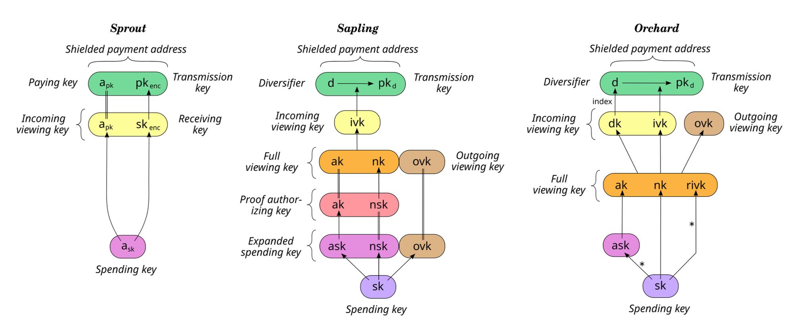

One source of the complexity is the **separation of proof generation and
transaction authorization**. In Zerocash/Sprout, a valid SNARK proof already
ensures rightful ownership, thus no further authorization needed theoretically.
In practice, however, hardware wallets are both resource constrained and vendor
gated to support intensive proof generation. While Sprout can lean on the zero
knowledge of SNARKs to prevent linkability, Sapling spends authorized via
signatures requires *re-randomizable signature* to prevent linkage between
spends from the same owner. This re-randomization manifests through the
*authorization key* $\ak$ in the secret witness and the *randomized authorization
key* $\rk = \ak + [\alpha]\,\G$ in the public instance of the proof.
The spend authorization signature is verified against the publicized $\rk$.

Another reason for the complexity is the **conflation of note ownership
and note transmission**. Since the original Zerocash (inherited in all Zcash
upgrades), the payment address serves *dual* purposes: declaring note ownership
and facilitating transmission of note secrets. The sender of a transaction
needs to securely communicate the output note openings so that they can be spent
later by the recipient. Without assuming secure channels between all users,
Zcash has been transmitting the encrypted memo *in-band* as part of the
transaction, effectively using the blockchain as the public bulletin board.
The payment address, publicized to the sender, contains a *transmission key*
which is the encryption key of a hybrid public key encryption scheme.
Zcash, from Sapling onward, is extra cautious about the privacy leakage in case
of colluding senders under reused transmission keys.
Therefore, *diversified address* is introduced to randomized the transmission
key *while preserving the same incoming viewing key* $\ivk$ for memo decryption
and detecting incoming notes.

Furthermore, **fine-grained disclosure of transaction flows** requires a
distinct *outgoing viewing key* to enable optional viewing of outbound notes.
Viewing keys support selective disclosure of both incoming and outgoing notes,
either to the account holder or to authorized third parties.
This separation also facilitates quantum-safe outgoing viewing keys from day
one, as they are not subject to the address-diversification requirement that
currently ties $\ivk$ to discrete-log–based constructions.

## Decoupling Payment Protocol from Shielded Protocol {#decouple}

A key observation Tachyon makes is that we can **separate the concerns of
spend authorization and note transmission**! This separation appears in the
decoupling of the shielded protocol from the payment protocol. The payment protocol
is responsible for full payment address construction, note transmission, and
selective disclosure capabilities, while the shielded protocol is reduced to the
minimal functionality required to maintain the shielded pool and enforce note
ownership and authorized transfers on-chain.

Informally:

- Shielded protocol: binds every note to an owner for spend authorization
  - Spend authorization requires both valid proof of ownership (proof of
  knowledge on $\nk$) and transaction authorization (signature under $\rk$)
  - Beyond maintaining the shielded pool, the blockchain acts as a data
  availability layer for arbitrary payment-protocol data
- Payment protocol: securely transmits relevant note info to intended recipients
  - Wallets, typically standardized, define the concrete key derivation hierarchy
  needed to satisfy the payment protocol’s functionality and security requirements.
  - Wallets may support multiple payment protocols, such as 
  Payment request ([ZIP-321](https://zips.z.cash/zip-0321)) and
  URI-encapsulated Payments ([ZIP-324](https://zips.z.cash/zip-0324)).

The rationale for this separation becomes clearer when examining the underlying
key material. Of all derived keys, *only two* are strictly necessary for enforcing
note ownership: the nullifier key $\nk$, used to derive nullifiers, and the
authorization key $\ak$, used to derive the randomized spend validation key.
Both are known only to the note owner and supply as secret witnesses in the
SNARK proof.

In Zcash today, a shielded payment address binds together $(\ak, \nk)$ and
additionally includes $\ivk$ for incoming note detection. Tachyon instead
decomposes this structure into a payment key $\pk = \mathsf{Com}(\ak, \nk)$, a
binding commitment to the pair and a *separate* transmission key managed entirely
by the payment protocol. This significantly simplifies the shielded protocol’s
key architecture by removing functionality unrelated to spend authorization.

> Among the main [security properties](https://zcash.github.io/orchard/design/nullifiers.html#security-properties),
> Tachyon shielded protocol needs to uphold Ledger Indistinguishability
> (defined in [Zerocash](https://eprint.iacr.org/2014/349.pdf)),
> Balance, Note Privacy, Note Privacy (OOB), Spend Unlinkability (but attackers access
> restricted to only payment key).
> Full Spend Unlinkability (attacker with $\ivk$ access) and Faerie Resistance are now
> the responsibilities of the payment protocol.
> Security analysis on a more [comprehensive list](https://github.com/daira/zcash-security) of properties is outside our scope.

This separation[^reproduce-orchard] yields several benefits:
a narrower and more manageable scope for shielded pool upgrades,
cleaner isolation of security assumptions for auditing,
greater flexibility in exploring payment protocol designs while preserving a stable
shielded core, and the ability to develop sub-protocols in parallel.
More broadly, we believe this separation of concerns enables Tachyon, and future
post-Tachyon upgrades, to evolve more rapidly while supporting more modular
security analysis.

[^reproduce-orchard]: One way to convince yourself that such separation works is
    to reproduce all of Orchard functionalities in this decoupled framework. We
    leave it as a homework exercise for the readers. 
    As a hint, your diversified address now may look like
    $\mathsf{addr} := (\pkd, \tk)$ where
    $\pkd = \mathsf{Com}(\ak, \nk; \rpk)$ is the diversified payment key,
    $\tk = (d, pk_d)$ is the diversified transmission key.
    Your $\ivk = \mathsf{ToScalar}(\PRF_\sk([9]))$ can now be directly
    derived from master spending key $\sk$, rather than meandering through
    layers of indirect derivation (similarly for outgoing viewing key).

## Shielded Protocol {#shielded}

We incrementally cover the whole Tachyon shielded protocol in this section.

> Note: in practice, all derivation functions (e.g., hash, KDF, XOF, and Derive)
> should be domain-separated;
> we omit this detail here for simplicity of presentation.

### Payment Key {#payment-key}

As explained [above](#decouple), Tachyon shielded protocol only expects an
authorization key $\ak$ from a re-randomizable signature scheme[^redpalla] and
a nullifier key $\nk$. While both keys *should* be derived from a master spending
key as per [ZIP-32](https://zips.z.cash/zip-0032), the concrete derivation path
is specified by wallet standards. The transfer proofs in shielded transaction only
use them directly as secret witnesses to further derive public values including
(randomized) spend validating key $\rk$ and nullifier $\nf$, but never constrain
their derivations. The shielded protocol only mandates that they are
indistinguishable from randomly sampled keys.
    
[^redpalla]: Tachyon sticks with $\mathsf{RedPallas}$, a Schnorr-based signature
    over the Palla curve supporting re-randomization, as in Orchard.
    See our [approach](#pq-rerand) when fully migrating to post-quantum world.

  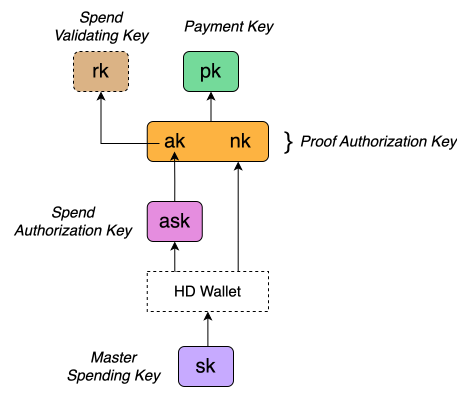

The payment key $\pk = \mathsf{Com}(\ak, \nk)$ is the owner field every note
commits to: a binding commitment to the $(\ak, \nk)$ pair. A wallet
mints a fresh address per sender from its master spending key in 
[ZIP-32](https://zips.z.cash/zip-0032)-style.
Instantiated with a hash-based commitment, $\pk$
gives a succinct owner field and
[quantum recoverability](https://zips.z.cash/draft-ecc-quantum-recoverability)
today.
Publicizing $\ak$ directly, a Schnorr verification key, to senders who might have
future access to a quantum computer exposes the user 
["Harvest Now, Decrypt Later"](https://en.wikipedia.org/wiki/Harvest_now%2C_decrypt_later)
risk.

Spend authorization follows the same construction as in Orchard.
The authorization key pair satisfies the DLog relation $\ak = [\ask]\,\G$, and
can be re-randomized into an unlinkable key pair using a randomizer $\alpha\in\F$.
Transactions are signed using the re-randomized signing key $\ask + \alpha$.
The resulting signature is unlinkable to the original spending authority,
while remaining verifiable against the randomized spend validating key $\rk$,
defined as:

$$
\rk = \ak + [\alpha]\,\G = [\ask + \alpha]\,\G
$$

### Note {#note}

A tachyon note is a tuple:

$$
\mathsf{Note}^\mathsf{Tachyon} := (\pk, v, \psi, \rcm)
$$

where $\pk$ is the [payment key](#payment-key), $v$ is the value of the note,
$\psi$ is pseudo-random note identity that binds to the note nullifier value
as an input to its derivation, and $\rcm$ is a random commitment trapdoor[^cm-psi].
In contrast to Sapling/Orchard, the note commitment in Tachyon
$\cm = \mathsf{Com}(\pk, v, \psi; \rcm)$ is purely based on symmetric primitives[^cm].
Thus, Tachyon doesn't require extra enforcement on $\rcm$ derivation on wallets
to achieve quantum recoverability
like [Orchard does](https://x.com/zkDragon/status/2026047830759182672).

[^cm-psi]: Pseudorandom values like $\psi$ and $\rcm$ should be
    deterministically derived from the wallet master key via secure KDF to avoid
    poor operational entropy. The derivation should be standardized.

[^cm]: Sapling and Orchard uses variants of the vector Pedersen commitment,
    which relies on DLog hardness. We choose Sponge-based Hash constructed from
    algebraic permutation Poseidon.
    
### Evolving Nullifier {#nf}

Readers should refer to Sean's 
[post](https://seanbowe.com/blog/tachyon-scaling-zcash-oblivious-synchronization/)
and the [short note [BM25]](https://eprint.iacr.org/2025/2031.pdf) for a
detailed motivation and an overview of Tachyon's evolving nullifiers.

A scaling Zcash produces more note commitments and nullifiers, both accumulating
in the shielded pool. The commitment set grows on disk, but luckily storage is cheap.
The nullifier set becomes the bottleneck: every transaction must check that its
inputs' nullifiers have never appeared before, which forces consensus nodes to
keep the whole set in memory *on the critical path*.
At Visa-level throughput, this nullifier state would grow by an [unattainable
500 GB per day](https://youtu.be/D51JV1ItMGE?si=5i5ByeKYg6fhf7U8&t=201).

Tachyon offloads most of this check to the user. The consensus node retains only
nullifiers from the most recent blocks; the user supplies an *exclusion proof*
attesting that their nullifier does not appear anywhere in the older history.
This proof must be kept current as each new block lands, which Tachyon achieves
incrementally via [proof-carrying data (PCD)](https://tachyon.z.cash/ragu/concepts/pcd).
Since constantly scanning blocks and refreshing proofs is onerous, users can
outsource the task to an *oblivious syncing service (OSS)*. However, updating
an exclusion proof requires knowing the nullifier value, and a nullifier revealed
to the syncing service let it trace the eventual spend of that note — a disastrous
privacy leak. Tachyon resolves this by letting nullifiers **evolve across
epochs**: the value a user shares with the OSS in one epoch is unlinkable to the
value revealed at spend time. This breaks a long-standing Zcash invariant:
each note has only *one* nullifier that is globally unique value in the pool.
As a result, Tachyon requires both a new nullifier derivation and a new
double-spending prevention mechanism.

> **<a id="philosophy">Philosophy:</a> Client-side Validation**
> ([CSV](https://eprint.iacr.org/2025/068)).
>
> Tachyon's scaling approach rests on one principle: move validation off the
> critical path of consensus and onto the client wherever possible. As a
> blockchain scales, the burden on consensus nodes grows along every axis —
> compute, memory, storage, and bandwidth. The remedy is to let the transacting
> client prove its own correctness and leave consensus only cheap verification.
> This principle guides many design decisions beyond our prunable nullifiers.

The ideal functionality for an epoched nullifier is a deterministic function

$$\nf_e = \mathsf{KDF}(\nk, \psi, e)$$

whose outputs are indistinguishable from random bytes. Such an $\nf_e$ binds to
both the spending authority (via $\nk$) and the underlying note (via its
per-note trapdoor $\psi$), while remaining unlinkable across epochs to anyone
without $\nk$.

Two additional constraints shape the choice of $\mathsf{KDF}$:

- **Constrained evaluation.** The wallet should be able to delegate $\nf_e$
  computation for a *range* of epochs to an OSS while keeping every epoch
  outside that range opaque to the service. Without this, outsourcing
  block-scanning would cost the user their privacy.
- **Circuit efficiency.** The spend proof constrains $\nf_e$ in-circuit, so the
  construction should be circuit friendly.

A natural abstraction for the first constraint is the *constrained PRF*
[[BW13]](https://eprint.iacr.org/2013/352.pdf): from the master key one can
derive a constrained key that enables the evaluation of the PRF at a certain
subset of the input domain and nowhere else. Section 3.3 of [BW13]
explains the *prefix-fixing* family realized by the seminal 
[[GGM84] PRF](https://crypto.stanford.edu/pbc/notes/crypto/ggm.html).
While sufficient, the [GGM-based nullifier](./ggm.md) has relatively poor circuit
efficiency (see its [cost analysis](./nf-analysis.md#ggm-cost)).

After exploring the [alternatives](./nf-analysis.md), we decide to **entrust users
to prove nullifier derivations**, relieving the OSS from the task, thus
*dropping the constrained evaluation requirement* and removing our reliance on
the GGM approach. Instead, we envision a polynomial-based nullifier with the
following workflow:

1. The user natively derives nullifiers of an epoch range $R$:
   $$
   \{ \nf_i := f_k(i)\}_{i\in R} \quad\text{where } k = \mathsf{KDF}(\nk, \psi)
    $$
    where the keyed polynomial $f_k(\cdot)$ is only known to and evaluable for
    the $\nk$-holder (namely note owner).
    - $f_k(X)$ has a high degree $d$ to be resilient against algebraic attacks,
      while super *efficient to evaluate*: only $O(\log{d})$ work required.
    - Given any set of evaluation points $S$ and their evaluations
      $\{f_k(i)\}_{i\in S}$, any evaluation *outside* the set $f_k(j \notin S)$
      is (at least computationally) *indistinguishable from random*.
2. The user hands the nonempty delegated range $S=[s_0,s_1)$ to the
   OSS as the list $[(i,\nf_i)]_{i\in S}$. This is the entire proving request, no
   note-binding evidence accompanies it: a valid request may equally be a decoy
   list unrelated to any note. The OSS proves exclusion of each $\nf_i$ against
   the nullifier set of epoch $i$, implicitly trusting the supplied nullifiers.
   In parallel, the user batch-proves derivations of all nullifiers in $R$.
    - We strictly requires $S$ to be a **prefix** of $R$ (i.e. $s_0 = r_0, s_1
      \leq r_1$) to simplify our subset check later. This (left-extend $s_0$ to
      align with $r_0$) preserves completeness because if a note is unspent until
      $s_1$, then its nullifiers are absent in the epoch range $[0, s_1)$.
      Left-extending $s_0$ also helps obfuscating note metadata such as its
      inclusion epoch.
3. As the OSS incrementally proves the exclusions in epoch order, it collects
   the tested nullifiers into an ordered sequence polynomial:
   $$
   g_S(X) := \sum_{j=0}^{|S| - 1} \nf_{s_0 + j} \cdot X^{|S|-1-j}
   $$
   We use the *Horner-ordering* for its position-independent extension relation.
   For example, if $g(X)$ encodes the first $m$ tested nullifiers over
   $[s_0,s_0+m)$, adding $\nf_{s_0+m}$ gives
   $$
   g'(X) = g(X) \cdot X + \nf_{s_0+m}.
   $$

   The OSS maintains the full polynomial and its commitment. Ragu certifies each
   update efficiently through its *online polynomial-oracle* capability[^polyoracle],
   by testing the identity at a random point.
4. Upon receiving the proof and $\mathsf{Com}(g_S)$ from the OSS, the user fuses
   it with their nullifier derivation proof (generated locally). Importantly,
   the user further enforces that nullifiers encoded by $g_S(X)$ are a
   *prefix* of $[\nf_i]_{i\in R}$ whose derivations are proven.

   The user proves the "prefix relation" by constructing a *masked
   sequence polynomial* $g_R(X)$ that scans through all of
   $[\nf_i]_{i\in R}$, while only its prefix $S$ contributes meaningfully.
   To clarify, the polynomial is constructed natively outside the circuit, and
   probabilistically tested inside Ragu using the polynomial oracle capability.
   $$
   \begin{aligned}
   g_R(X) &:= \sum_{j=0}^{|R|-1} b_j \cdot \nf_{r_0+j} \cdot X^{|R|-1-j}
   &&\text{(construction integrity)}\\
   &= X^{r_1 - s_1} \cdot g_S(X) &&\text{(prefix relation)} \\
   \text{where}\quad
   b_j &= \begin{cases}
   1 &\text{if } 0 \leq j < |S| \\
   0 &\text{otherwise}
   \end{cases}
   \end{aligned}
   $$

   

       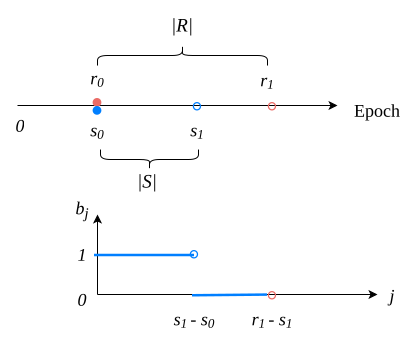
   

   Note that the construction integrity is proven locally as part of the nullifier
   derivation, independent of the OSS, since the user is aware of the ranges
   $R, S$ in advance. The exponent $|R|-|S|$ is the number of masked positions
   *after* $S$. The prefix relation is only enforced during proof folding after
   the user gets back the exclusion proof from the OSS.
   Furthermore, users may split the construction of $g_R(X)$ into multiple
   PCD steps due to the circuit size limit. Similar to $g_S(X)$, we can check
   each incremental extension easily thanks to the Horner-ordering.
   As a generalization, let $g(X)$ be the sequence polynomial after proving $m$
   positions. In the next step, the user proves the next $\ell$ values
   $\{\nf_{s_0+m},\ldots,\nf_{s_0+m+\ell-1}\}$,
   then checks the updated polynomial $g'(X)$ via:
   $$
   g'(X) = g(X)\cdot X^\ell
   + \sum_{j=0}^{\ell-1} b_{m+j} \cdot \nf_{s_0+m+j}\cdot X^{\ell-1-j}.
   $$

   Crucially for circuit efficiency, we can constrain $b_j$ transitively without
   resorting to any interpolation across the entire $[0,|R|)$ domain.
   The following definition avoids comparison, bit decomposition, and
   witness-dependent branches:
   $$
   \begin{cases}
   b_0&= 1, \\
   b_{j+1} &= b_j - \mathsf{isEq}(j, |S| - 1).
   \end{cases}
   $$

   A sequence commitment after $m$ processed positions carries the bound
   $\deg(g(X))<m$, enforced by the PCS interface together with $m$. If the two
   committed polynomials do not satisfy the claimed relation, their difference is therefore
   a nonzero polynomial of degree at most $|R|-1$, so it passes an independently
   sampled evaluation point with probability at most $(|R|-1)/|\mathbb{F}|$.

$\mathsf{Com}(g_S)$ and $\mathsf{Com}(g_R)$ are **nullifier commitments**. They
bind ordered coefficients for construction and prefix checks. The
[tachygram accumulator](#acc) separately commits to an unordered multiset for
membership and non-membership tests.
   
Our leading candidate among [all options](./nf-analysis.md) uses off-the-shelf
algebraic hash function (like Poseidon) as the nullifier polynomial. This
candidate gives us a capacity of $28$ nullifier derivation per PCD step based on
our [first-order estimation](./nf-analysis.md#attempt3).

$$
\nf_e = \mathsf{Poseidon}^\nf.\mathsf{Permute}
(\nk, \psi, \lfloor \frac{e}{\mathsf{Rate}} \rfloor)[e \bmod \mathsf{Rate}]
$$

A concrete example. If a user wants to cover epochs $\{5,6\}$ with a sponge
rate of $\mathsf{Rate}=4$, she left-extends the delegated range to $S=[4,7)$,
a prefix of the range $R=[4, 8)$ realized by one Poseidon permutation:
$\nf_4,\ldots,\nf_7 = \mathsf{Poseidon}^\nf.\mathsf{Permute}
(\nk, \psi, \lfloor \frac{6}{4} \rfloor=1)$.
In practice, the delegation range may be larger, which requires users multiple
PCD steps to reach a minimally covering superset $R$. 

> Note: $\mathsf{Poseidon}^\nf.\mathsf{Permute}$ *is* a polynomial-based block
> cipher, or an instantiation of the keyed nullifier polynomial $f_k(X)$.
> For generality, we will use $\nf_e = f_k(e)$ generically for the remaining
> presentation to be generic over any choice that meet our aforementioned
> requirements (efficient evaluation and semantic security).

#### Nullifier Security {#nf-sec}

We now examine how the evolving nullifier upholds the security properties [carved
out](#decouple) for the shielded protocol. Readers can safely skip this
section and come back later since the analysis refers to concepts introduced
in later sections.

**Balance.** Only the holder of $\nk$ can compute any $\nf_e = f_k(e)$, since
$k=\mathsf{KDF}(\nk, \psi)$ requires it. The spend circuit pins both $\nf_e$ and
$\nf_{e+1}$ to a deterministic function of the note and epoch, so a note has
exactly one valid nullifier per epoch and no freedom to mint a fresh value that
dodges a past spend. Double-spending is then ruled out by two complementary
checks that [leave no gap](#consensus-rule). Along the delegated path, the
[spendability proof](#spendability) certifies absence throughout pruned history
ending at the target epoch's starting sentinel; consensus checks the recent
window that this proof does not reach. Publishing both $\nf_e$ and $\nf_{e+1}$ extends this
across the epoch boundary, so a note cannot be spent twice even as $e$ advances.

**Note Privacy.** The adversary is a keyless third party reading the whole
on-chain transaction, including any in-band memo. The shielded footprint, namely
the commitment $\cm$ (hidden by $\rcm$), the spend's revealed nullifiers (pseudorandom
by the semantic security of $f_k$), the rerandomized $\rk$, and the hiding $\cv$,
reveals none of $\pk$, $v$, $\psi$. The in-band memo is payment-protocol data
that the shielded protocol carries opaquely and never parses (committed only to
`da_digest`), so its secrecy rests on the payment protocol's encryption, not on
the shielded core.

**Note Privacy (OOB).** Here the note plaintext travels out of band rather than
as an in-band ciphertext, so the adversary of concern is the sender, who learns
$\pk, v, \psi, \rcm$ but never the recipient's $\nk$. Because every $\nf_e=f_k(e)$
hangs off the nullifier key $k = \mathsf{KDF}(\nk, \psi)$, which cannot be formed
without $\nk$, knowledge of the note plaintext alone does
not let the sender, or anyone it colludes with, recognize the recipient's
eventual spend on chain or link it back to the note it sent.

**Spend Unlinkability.** Across epochs the $\{\nf_e\}$ of a fixed note are
mutually pseudorandom to anyone lacking $\nk$: by the semantic security of
$f_k$, any set of revealed evaluations leaves every evaluation outside it
indistinguishable from random, and this holds even for the pair
$\nf_e, \nf_{e+1}$ revealed together at spend. Delegation is *list-bounded*: an
OSS [delegated](#nf) a range $S$ holds the explicit evaluations
$\{(e, \nf_e)\}_{e \in S}$ and no key material at all, so it can refresh
exclusion proofs for exactly those epochs and predict nothing beyond the list,
in particular the spend-epoch nullifier, since [syncing stops at $e-1$](#txflow).
The OSS also sees a selected join epoch $e_\join$, which equals the
inclusion epoch for an older real request but may be chosen independently for
same-epoch and decoy requests. This leaks epoch metadata, not a cryptographic
link to a note.
And since $k$ binds the per-note $\psi$, a list delegated for one note reveals
nothing about any other note the user owns. To an attacker holding only the on-chain
$\cm$, the spend is unlinkable to it, since the two draw on disjoint randomness
($\rcm$ versus $k$). The stronger flavor of spend unlinkability, under
incoming viewing key access, falls to the payment protocol, since Tachyon's
shielded core has no $\ivk$.

**Faerie-gold via the wallet.** In Orchard, Faerie-gold resistance comes from
binding each new note's $\rho$ to the unique nullifier of an input note.
Tachyon's [tachygram accumulator](#acc) does not assign notes a canonical
position, so the shielded protocol cannot enforce that binding. A malicious
sender could in principle pick colliding $\psi$ values across two notes sent
to the same recipient, where only one of them is spendable. We push detection
to the recipient's wallet: upon receiving a note, the wallet computes the note's
nullifier at a fixed reference epoch and rejects the note if it collides with any
other note it currently holds. Since a wallet's note set is small, the check is cheap;
the knowledge that compliant wallets will reject such collisions is enough to
deter the attack.

### Tachygram Accumulator {#acc}

All shielded pools in Zcash today maintain two separate accumulators:
a note commitment Merkle tree for efficient inclusion proofs and a nullifier
set with constant-time membership queries for exclusion testing.

Tachyon instead uses a single cryptographic accumulator whose members are
encoded as roots of a polynomial, so that both membership and non-membership
tests reduce to a single evaluation query.
Conveniently, Tachyon's PCD proof system natively and cheaply supports
evaluation queries against *online polynomial oracles*[^polyoracle].
Because the accumulator is universal[^universal], it need not distinguish
nullifiers from note commitments: a single accumulator collects
indistinguishable 32-byte blobs, each a **tachygram**, that can be either a
nullifier *or* a commitment.

$$
\tg := \begin{cases}
    \cm = \mathsf{Com}(\pk, v, \psi; \rcm) &\quad\text{in Output actions}\\
    \nf_e = \mathsf{KDF}(\nk, \psi, e) &\quad\text{in Spend actions}
\end{cases}
$$

[^polyoracle]: Ragu PCD proof, through [reduction of
    knowledge](https://eprint.iacr.org/2022/009), reduces down to a list of
    evaluation claims of multiple opening points on multiple polynomials.
    These claims are then
    [folded](https://tachyon.z.cash/ragu/protocol/core/accumulation/pcs.html)
    into a single running aggregated claim.
    Ragu expose the capability to fuse online/application-time polynomial
    queries into the proof system directly, without encoding the evaluation
    through the constraint system which can be expensive.
    This is spiritually similar to
    [lookup argument](https://zcash.github.io/halo2/design/proving-system/lookup.html)
    enforced as part of the PIOP relation rather than through the circuit.
    
[^universal]: In [crypto literature](https://eprint.iacr.org/2018/1188.pdf),
    a universal accumulator is dynamic (supports insertion and removal) and
    supports both membership and non-membership proofs.

The accumulator is the commitment to a polynomial $f^\tg(X)$:

$$
\tgacc = \mathsf{Com}(f^\tg(X)) = \mathsf{Com}( \prod_i{(X - \tg_i)} )
$$

The key properties of this universal accumulator:

- Membership is enforced via $f^\tg(x) = 0$, non-membership via
  $f^\tg(x) \neq 0$. Both tests are insensitive to multiplicity, so this is a
  *multiset* accumulator: a tachygram appearing $m$ times contributes the factor
  $(X - \tg_i)^m$, but a single occurrence already certifies membership.
  - We do not deduplicate. In honest operation every tachygram is a distinct
    pseudorandom blob, so multiplicity exceeds one only with negligible (or
    adversarial) probability; and since (non-)membership ignores multiplicity,
    such cases are harmless. 
  - Consensus nevertheless requires every newly validated tachygram to be distinct
    from both the retained window and earlier tachygrams in the same candidate
    bundle. Consequently every accepted per-epoch accumulator guarantees to have
    a multiplicity of $1$ for all members/roots.
- Members are *unordered*: a multiset commitment, not a vector commitment.
- <a id="union">**Multiset union**</a>
  is polynomial multiplication, yielding a product accumulator
  $f^\tg(X) \cdot g^\tg(X)$ (unconditionally, with no disjointness precondition);
  multiset difference is division, yielding a quotient $\frac{f^\tg(X)}{g^\tg(X)}$
  whenever the divisor is contained, and failing with a remainder otherwise.
  - A union can be tested via $p(r) \iseq f(r) \cdot g(r)$ at a random point
    $r\sample\F$.

We emphasize a subtlety in the security of this polynomial-based accumulator.
Polynomial-commitment binding says that a commitment opens to one polynomial; it
does not say that this polynomial is the accumulator of the claimed tachygrams.
An attacker could instead commit to a polynomial that adds a malicious root or
drops a genuine one, making the corresponding membership test true or false at
will. Tachyon therefore verifies every $\tgacc$ against its published tachygram
list using the technique [below](#acc-correct). The randomized identity test is
sound relative to the PCS degree bound $D$: commitments are fixed before the
challenge, so a false identity passes with probability at most $D/|\F|$.

#### Checking Accumulator Correctness {#acc-correct}

Our goal is to check the correctness of the accumulator value $\tgacc$ given
a public list of $\set{\tg_i}$ *without expensive recomputation*.

The solution is batch verification via a randomized point check.
The verifier samples a random $r\sample\F$ and invokes the PCS evaluation
procedure on the (commitment, point, evaluation) claim $(\tgacc, r, y_r)$, where
$y_r = \prod (r - \tg_i)$ is computed locally.
Naturally, this proof can be made non-interactive with Fiat-Shamir.
Notably, the verifier performs only cheap field operations, avoiding the group
operations that recomputing the commitment would require (for Pedersen, KZG, or
Bulletproof PCS).

### Tachyon Transaction {#tx}

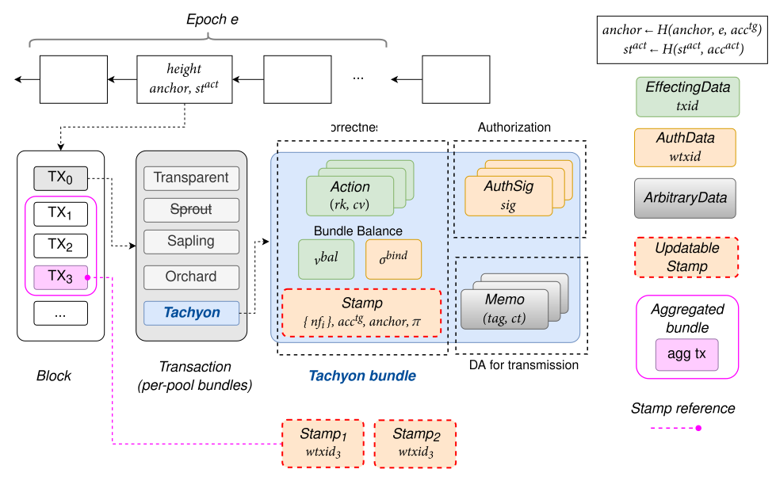

Each block contains one or more transactions. Each transaction has a `txid`,
which commits only to its _effecting data_
([ZIP-244](https://zips.z.cash/zip-0244)) and is therefore the stable,
non-malleable transaction identifier, and a `wtxid`
([ZIP-239](https://zips.z.cash/zip-0239)), which additionally commits to the
malleable authorization data and is the identifier used to relay v5+ transactions
over the p2p network.
Each transaction optionally contains a bundle of transfers from each pool:
JoinSplit for Sprout (soon deprecated), Spend/Output for Sapling, Action for
Orchard, and now Tachyon Action for the new Tachyon pool.

A **Tachyon Action transfer** either spends an old note or creates a new one.
Whether a spend or an output, its *Action description* is uniformly represented
by a pair $(\rk, \cv)$, where $\rk$ is the randomized spend validating key, whose
derivation *binds to the underlying note*, and $\cv$ is a blinding commitment to
the net value (positive for a spend, negative for an output, following the
Sapling/Orchard sign convention).
Unlike Sapling and Orchard, the tachygrams (nullifier or commitment) are left
out of the description, because evolving per-epoch nullifiers are no longer
static. We instead bind the note to $\rk$ through its randomizer $\alpha$:

$$
\begin{cases}
\rk = [\ask + \alpha]\,\G \;\;\text{(spend)}
\qquad
\rk = [\alpha]\,\G \;\;\text{(output)}\\
\alpha = \PRF(\cm \| \theta)  \quad\theta\text{: arbitrary entropy}
\end{cases}
$$

A spend's $\rk$ re-randomizes the custody-held spending authority $\ask$; an
output's carries no authority at all — creating a note requires none, since the
binding signature already enforces that outputs are funded. An output's signing
key is thus just $\alpha$, so a hot device can sign outputs without a custody
round-trip; only spends need the custody-held $\ask$. Both forms of $\rk$ are
uniformly random points, indistinguishable on chain.

The Tachyon bundle inside a transaction carries a sequence of Action
descriptions together with the net balance of all action transfers
$v^{\mathsf{bal}} = \sum_{\mathsf{spends}} v - \sum_{\mathsf{outputs}} v$,
positive when value leaves the shielded pool, matching the `valueBalance`
convention of Sapling/Orchard and keeping the ZIP-209 pool-turnstile accounting
uniform across pools. The balance is proven by a *binding signature*
$\sigma^{\mathsf{bind}}$ as in Sapling/Orchard.

Recall: How binding signature works.

The net value commitment $\cv$ in every action description is Pedersen-committed:

$$
\cv = [v]\,\G + [\rcv]\,\H
$$

where $\rcv$ is the blinding factor and $\H$ is an independent group generator.
(Both value-commitment bases are independent of the spend-authorization base
behind $\rk$; in practice Tachyon reuses Orchard's `ValueCommit` generators.)

By the homomorphic property of Pedersen commitments, the verifier can sum the
$\cv$ in a bundle to obtain $\sum_i{\cv_i}$, itself a blinding commitment to the
net balance $v^\mathsf{bal}$ with blinding factor $\bsk = \sum_i{\rcv_i}$:

$$
\sum_i{\cv_i} = [\sum_i{v_i}]\,\G + [\sum_i{\rcv_i}]\,\H
= [v^\mathsf{bal}]\,\G + [\bsk]\,\H.
$$

To verify the net balance, the validator reconstructs a discrete-log public key

$$
\bvk = \sum_i{\cv_i} - [v^\mathsf{bal}]\,\G,
$$

and then verifies a Schnorr signature $\sigma^\mathsf{bind}$ produced under
$\bsk$. Effectively, the signature serves as a proof of knowledge of the secret
scalar $\bsk$ behind the public key $\bvk$.

Before describing the stamp, we name a recurring object it relies on: the
**spendability proof**. It establishes two historical
facts about a spent note: its commitment appeared in a stamp included in a
finalized block (*inclusion*), and its epoch-specific nullifier remained absent
afterward (*exclusion*). Since old tachygrams are pruned from the live pool, these
facts are proven against authenticated [anchor-chain](#anchor) history.

This evidence need not be kept continuously fresh: it can be assembled when a
spend is intended, against an anchor in the target epoch. A same-epoch spend
still carries a nonempty exclusion range predating the note as camouflage.

A **Tachyon Stamp** provides the PCD proof for the [Action statement](#statement).
Its public inputs are the bundle's Action descriptions, a set of tachygrams
$\set{\tg_i}$, their accumulator $\tgacc$, a target $\anchor$
in the [anchor chain](#anchor), and the target epoch $e$.
Alternatively, the stamp holds a `wtxid` reference to another transaction whose
stamp carries an aggregated PCD proof and the corresponding public inputs.
The accumulator is included to spare miners from recomputing it over all
tachygrams; instead, the correctness of $\tgacc$ is proven as part of the Action
statement using the [batched verification trick](#acc-correct).
The PCD construction supports aggregating finished bundle proofs: a new
aggregated transaction will be created whose stamp contains the union of
tachygrams, the accumulator of that union, the common anchor, and an aggregated
PCD proof. The stamps of all constituent transactions are replaced by a
reference to the aggregated transaction's `wtxid`.

> Note: an aggregated Tachyon bundle shares exactly the same format as a normal
> standalone bundle (a.k.a. a _Tachyon autonome_), and may even carry additional
> Action descriptions of its own. A purely aggregating bundle, by contrast,
> carries an empty Action list (hence no authorization signatures), a zero value
> balance, a trivial binding signature, and a stamp holding the aggregated proof
> and its proof data.
>
> The balance check and authorization signature verification (including the
> `SIGHASH` computation) are identical for every bundle, aggregated or standalone.
> The only difference is proof verification: an aggregated bundle verifies against
> the single stamp of the aggregated transaction, so its cost is amortized across
> all constituents and thus economically incentivized.

Importantly, each Action description is **associated with two tachygrams**, a
consequence of the evolving nullifiers. If a user proves only the nullifier
$\nf_e$ for the current epoch $e$, the epoch may advance to $e+1$ before the
transaction is picked up from the mempool. Since neither miners nor the OSS—the
latter responsible only for syncing past epochs, and never learning future
nullifiers, least of all at spend time—can unilaterally update the proof, the
transaction goes stale and requires further user input to refresh. This is poor
UX and a potential timing side-channel that leaks privacy. We therefore require
every spend action to reveal (and prove in circuit) the nullifiers for **both the
current and the next epoch**, leaving an ample buffer against this cross-epoch
race. To keep spend and output actions indistinguishable, we further require each
output action to publish a dummy tachygram alongside its note commitment, so
every action uniformly carries two.[^padding]

[^padding]: Without the dummy, a spend would carry two tachygrams and an output
    one. A bundle already reveals its action count $n$ (one authorization
    signature per action), so the tachygram count $t$ would give away the
    split: $s = t - n$ spends and $o = 2n - t$ outputs. Padding fixes $t = 2n$
    identically, hiding the split. The leak without padding is only *arity*:
    tachygrams ride in the stamp as one flat multiset, so *which* action is a
    spend is never visible either way.

All non-malleable parts, collectively the *effecting data*, hash into a stable
identifier `txid`: a bundle commitment from each pool and their value balance
$v^{\mathsf{bal}}$. In-band memos count as effecting data in the legacy pools,
and they remain so in the Tachyon pool, entering `txid` through the `da_digest`
described below.
The Tachyon bundle commitment $\actacc$ is an order-committing,
personalized hash over the Action descriptions in wire order:

$$
\actacc = H\bigl( (\cv_1, \rk_1) \,\|\, (\cv_2, \rk_2) \,\|\, \ldots \,\|\, (\cv_n, \rk_n) \bigr)
$$

A plain hash suffices here: `txid` needs no algebraic structure, and committing
to the wire order (as ZIP-244 digests do) keeps `txid` in one-to-one
correspondence with the serialized effecting data.[^actacc]

[^actacc]: An earlier draft realized $\actacc$ as a polynomial accumulator
    $\mathsf{Com}(\prod_i(X - a_i))$ with $a_i = H(\cv_i, \rk_i)$, mirroring the
    tachygram accumulator. That algebraic form is only needed where a *proof*
    consumes the action set; for a transaction identifier it buys nothing and
    drags group operations into `txid` derivation.

All mutable parts (orange in the diagram) commit only to the `auth_digest`, and
hence transitively to `wtxid = txid || auth_digest`; only the stable parts
(green in the diagram) contribute to `txid`.

Specifically,

- `da_digest` commits to the (optional) memo bytes, which the Tachyon pool
carries as an opaque DA blob: unconstrained, never parsed or interpreted by the
shielded protocol.
- `txid` commits to $(\actacc \| v^\mathsf{bal} \| \mathsf{da\_digest})$.
- `auth_digest` commits to $(\set{\sigma^\mathsf{act}}, \sigma^\mathsf{bind}, \mathsf{stamp})$.

Keeping the memo payload inside the effecting data is what makes it
tamper-proof. Authorizing data is malleable by definition, and Tachyon relayers
rewrite it in flight: aggregation replaces a transaction's stamp, and with it
`auth_digest` and `wtxid`. With `da_digest` inside `txid`, tampering becomes
detectable: every authorization signature signs over it through the `SIGHASH`,
so altering the DA bytes yields a different transaction whose signatures no
longer verify. ZIP-244 makes the same choice for the legacy pools by hashing
their in-band memo ciphertexts into `txid`.

Finally, the Tachyon bundle carries a spend authorization signature for every
Action description, each signed over the `SIGHASH`, which commits to the same
transaction-wide effecting data (across all pools) used to derive `txid`[^txid-sighash].
Block space can additionally serve as a data-availability layer for arbitrary
payment-protocol data used in note transmission; the shielded protocol neither
interprets this data nor checks its correctness. As explained [later](#payment),
the payment protocol Tachyon targets distributes the recipient's KEM encapsulation
key out of band through the [address](#address), and carries a KEM ciphertext
in-band only on rare first-contact transactions (ordinary payments carry none), so
the in-band footprint stays small. The scheme is quantum-safe from day one and
leaves the format unchanged even through a full [quantum upgrade](#pq).

[^txid-sighash]: `txid` and `SIGHASH` are domain-separated with different
    personalization strings, but they commit to the same effecting data.
    `SIGHASH` further incorporates a *SIGHASH type* byte, the `nConsensusBranchId`
    network-version identifier (e.g., NU5, NU6), and other consensus-level metadata.

### Anchor Chain {#anchor}

An anchor chain is a hash chain whose updates absorb **per-stamp**
[tachygram-accumulator](#acc) commitments. Every stamp carries a $\tgacc$ committing to the
tachygrams it introduces: those of a single bundle for a standalone transaction
(a *Tachyon autonome*), or the union across many for an [aggregate](#tx).
Each chain state $\anchor$ is an **anchor**; $\tgacc$ is not an anchor, but an
input committed into the next one.
A stamp in consensus epoch $i$ extends the chain as

$$
\anchor \leftarrow H(\anchor_{\mathsf{old}} \;\|\; i \;\|\; \tgacc)
$$

Binding $i$ at every tick lets a proof authenticate the epoch containing each
anchor-chain segment without relying on external validation.

At the transition into every epoch $i$, consensus appends exactly one
domain-separated **epoch sentinel**, after all stamps of epoch $i-1$:

$$
\sntl_i = H^{\mathsf{epoch}}(\anchor_{i-1,\mathsf{end}}\;\|\;i).
$$

Here $\anchor_{i-1,\mathsf{end}}$ is the final anchor-chain state before the
transition; for an epoch with no stamps, it is simply $\sntl_{i-1}$.
This is an ordinary update of the anchor-chain state already carried by every
block header, not a new header field: the terminal block of epoch $i-1$ commits
to $\sntl_i$ after processing its stamps and the transition. By convention,
**the sentinel for epoch $i$ always means its first anchor $\sntl_i$**. Epoch
$i$ therefore spans $\sntl_i$ to $\sntl_{i+1}$. Every transition has a sentinel,
so even an empty epoch has two distinct, authenticated boundaries. For epoch
zero, the genesis anchor-chain state replaces $\anchor_{-1,\mathsf{end}}$.

  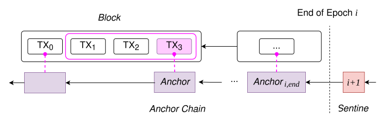

The chain therefore advances at *sub-block, above-transaction* granularity: in a
block of transactions with all standalone Tachyon bundles it ticks once per
transaction. A published stamp carries a target anchor $\anchor$. As with
Orchard anchors today, validators maintain the (unpruned) anchor chain and are
responsible for validating the stamp's $\anchor$ against the canonical history.
When consensus accepts the stamp, its $\tgacc$ is absorbed into the current state
to produce the next anchor.

Why anchor *per-stamp rather than per-block*, when the block is the unit of
consensus finality? The primary justification is that it minimizes validator
work, in alignment with our [philosophy](#philosophy). Each stamp already ships a
$\tgacc$ whose correctness is [batch-verified in circuit](#acc-correct), so a
validator merely hashes it into the chain. A per-block anchor would instead force
every validator to rebuild a block-wide accumulator from scratch: re-accumulating
every tachygram in the block, interpolating the product polynomial, and
committing it which involves an expensive multi-scalar multiplication for some PCS
choices.

Per-stamp cadence also raises concerns about the cost of generating exclusion
proofs. To prove $\nf_e$ never appeared in epoch $e$, a user could naively show
$f^\tg(\nf_e) \neq 0$ against the accumulator of *every* stamp folded into the
chain that epoch. Instead, we leverage the [multiset union](#union) operation
on our accumulator polynomials to collapse the per-stamp checks into one.
The product of all stamp polynomials in an epoch is itself an accumulator over
all tachygrams of that epoch — the <a id="epoch-acc">*epoch accumulator*</a> $e(X)$:

$$
\underbrace{\circ \overset{f^\tg_1(X)}{\longrightarrow} \circ
\overset{f^\tg_2(X)}{\longrightarrow} \circ \overset{\ldots}{\longrightarrow} \circ}
_{\text{entire epoch: } e(X) = \prod_i{f^\tg_i(X)}}
$$

and $\nf_e$ is absent from the epoch exactly when $e(\nf_e) \neq 0$. Anyone
(typically an OSS) can prove that $e(X)$ is the correct product of the per-stamp
polynomials $f_i^\tg(X)$ whose commitments
$\tgacc_i=\mathsf{Com}(f_i^\tg(X))$ were absorbed into the anchor chain, by showing
$e(r) \iseq \prod_i{f^\tg_i(r)}$ using the proof system's cheap polynomial-oracle
queries[^polyoracle]. Since the queries are served natively by the folding scheme
and not through a step circuit, $e(X)$ may have degree as large as the SRS of the PCS
allows, independent of any per-PCD-step-circuit size limit. Admittedly, the prover
cost is still linear in the epoch's stamp count, but it is paid *once* and then
**amortized**. The epoch accumulator $e(X)$, carrying its correctness proof, can
now be reused by every unspent note to directly test the exclusion of their
epoched nullifiers.

Sentinel transitions absorb no tachygram-accumulator commitment and therefore
contribute no factor to $e(X)$. For an empty epoch $i$, $e_i(X)=1$; the distinct
endpoint anchors $\sntl_i,\sntl_{i+1}$ still certify that the whole epoch was
traversed.

This removes the per-stamp checks, but $e(X)$ still has degree linear in the
total number of tachygrams in the epoch $N$. We now present an optimization
trick that reduces the amortized per-nullifier cost to strictly sublinear.

#### Quadratic Residue Filters {#qr-trick}

> This subsection is a self-contained optimization; readers can safely skip it and
> continue to the [transaction life cycle](#txflow). The current proof tree uses
> the full epoch accumulator for simplicity; QR filter is a future optimization.

Our goal: let a user prove non-membership of $\nf_e$ over an *entire epoch* at
cost logarithmic in $N$, the number of tachygrams that epoch.

The idea is **bucketing**. Suppose we sort every tachygram into one of $2^k$
buckets by a rule that (i) a nullifier can cheaply prove it follows and (ii)
splits the field evenly. Then $\nf_e$ falls into exactly one bucket, and it can

only ever collide with the tachygrams sharing that bucket. Thus, non-membership
across the whole epoch collapses to non-membership against a *single* bucket's
accumulator, holding only $\approx N/2^k$ entries. Taking $k = \log N - \log\log N$
shrinks each bucket to $\approx \log N$ entries while keeping the query $O(\log N)$.
Quadratic residues give us exactly such a rule.

**A number theory detour.** Over a prime field $\F$, the nonzero elements split
perfectly in half: the *quadratic residues* ($\QR$) and the *non-residues* ($\NQR$).
Both classes are cheap to test in-circuit:

- $x \in \QR$: supply the root $y$ as advice; one constraint $y^2 = x$.
- $x \in \NQR$: fix a public non-residue $c$ and supply $y$ with $y^2 = cx$,
  since multiplying by a non-residue flips the class:

$$
\begin{cases}
x\in\QR \iff c\cdot x \in\NQR \\
x\in\NQR \iff c\cdot x \in\QR
\end{cases}
$$

A **QR filter** is one such split with a random offset: draw $R \sample \F$ and
classify $x$ by whether $x + R$ is a square, assigning the exceptional value
$x+R=0$ to the residue side. A random offset cuts any fixed epoch set roughly in
half, and $k$ independent offsets $R_1, \ldots, R_k$ tag every element with a
$k$-bit **QR profile** $\v{b} = (b_1, \ldots, b_k) \in \{0,1\}^k$, where $b_j=1$
iff $x+R_j$ is a square (written $x\in\QR_{R_j}$), including zero, and $b_j=0$
otherwise. The $k$ filters together sort the field into $2^k$ disjoint buckets
of roughly equal expected size.

<a id="batch-qr">**Batched QR Test.**</a> Given the square-free vanishing
polynomial $f(X)=\prod_i{(X-x_i)}$, we can batch-test that all roots are QR,
namely $\forall x_i\in\QR$, as follows. Canonical epoch accumulators are
square-free by the [consensus uniqueness rule](#consensus-rule).
"Square-free" here means the multiplicity of each root is $1$, namely no repeated
or duplicated $x_i$.

- Prover interpolates all QR pairs $(x_i, y_i)$ into a polynomial $g(X)$ where
$g(x_i) = y_i$ and $x_i = y_i^2$
- Prover computes $h(X)=\frac{g(X)^2 - X}{f(X)}$ and sends commitments to $g(X)$
and $h(X)$ to the Verifier
  - Observe that the numerator $g(X)^2 - X$ vanishes over all $x_i$ (since
  $g(x_i)^2 = y_i^2 = x_i$), so $f(X)$ perfectly divides the numerator
- Verifier samples a random $r\sample\F$, and test: $g(r)^2 - r \iseq f(r)\cdot h(r)$

For an offset $R_j$, the corresponding identities replace $X$ by $X+R_j$.
A residue sibling checks $g(X)^2-(X+R_j)=f(X)h(X)$. A non-residue sibling checks
$g(X)^2-c(X+R_j)=f(X)h(X)$ and additionally interpolates the inverses into
$z(X)$ and checks $(X+R_j)z(X)-1=f(X)q(X)$. The latter excludes zero from the
non-residue side.

**Building the buckets (once, by the OSS).** Fix
$R_1,\ldots,R_k\sample\F$ as transparent system parameters. Conceptually, the
buckets are the leaves of a binary tree built by recursively splitting the epoch
accumulator by each filter. Splitting
$e(X) = \prod_{j=1}^N (X - \tg_j)$ by $R_1$ gives

$$
\begin{cases}
q_0(X) = \prod_{\tg_i\in\NQR_{R_1}}{(X - \tg_i)}\\
q_1(X) = \prod_{\tg_i\in\QR_{R_1}}{(X - \tg_i)}\\
e(X) = q_0(X) \cdot q_1(X)
\end{cases}
$$

so $q_1$ gathers the tachygrams passing the $R_1$ filter and $q_0$ its
complement; bisecting each by $R_2$ gives four, and so on:

$$
\begin{cases}
q_{00}(X) = \prod_{\tg_i\in\NQR_{R_2} \,\cap\, \NQR_{R_1}}{(X - \tg_i)}\\
q_{10}(X) = \prod_{\tg_i\in\QR_{R_2} \,\cap\, \NQR_{R_1}}{(X - \tg_i)}\\
q_0(X) = q_{00}(X) \cdot q_{10}(X)
\end{cases}
\quad
\begin{cases}
q_{01}(X) = \prod_{\tg_i\in\NQR_{R_2} \,\cap\, \QR_{R_1}}{(X - \tg_i)}\\
q_{11}(X) = \prod_{\tg_i\in\QR_{R_2} \,\cap\, \QR_{R_1}}{(X - \tg_i)}\\
q_1(X) = q_{01}(X) \cdot q_{11}(X)
\end{cases}
$$

After $k$ filters we reach $2^k$ leaves, where leaf $q_{\v{b}}(X)$ holds exactly
the tachygrams of profile $\v{b}$.

In practice the OSS never splits top-down. It keeps the $2^k$ bucket accumulators
live and streams tachygrams into them: as each new stamp lands, it computes the
tachygram's profile $\v{b}$ and folds $(X-\tg)$ into the matching leaf
$q_{\v{b}}$. Internal product nodes are formed bottom-up only when a
decomposition proof calls for them. Maintaining the buckets costs $O(kN)$
profile work and linear-factor insertions, amortized over all users and all
nullifiers.

  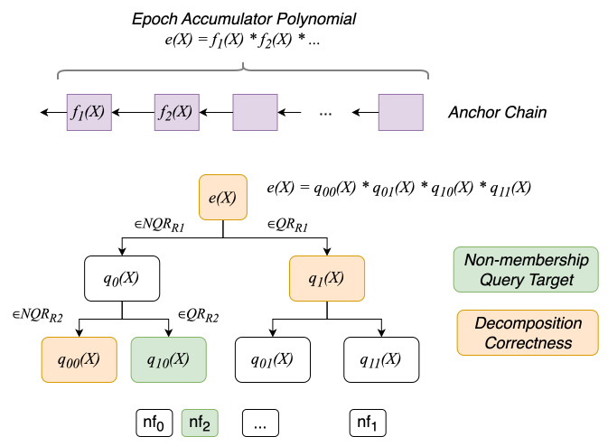

With the buckets maintained, a user proves $\nf_e$ absent from the *entire epoch*
in three parts:

1. **Profile.** Compute $\nf_e$'s QR profile $\v{b}$ ($k$ squaring constraints)
   pinning down the single leaf $q_{\v{b}}$ it could possibly belong to.
2. **Leaf non-membership.** Test $q_{\v{b}}(\nf_e) \neq 0$ against that one leaf,
   of expected degree $N/2^k$.
3. **Path decomposition.** Certify that $q_{\v{b}}$ is genuinely the
   profile-$\v{b}$ bucket of the epoch accumulator $e(X)$, by walking the
   root-to-leaf path and checking, at each level $j$, two things:
   - *product relation*: the on-path parent equals the product of its two children,
   tested at a random point as in the [accumulator correctness check](#acc-correct);
   - *sibling QR purity*: the *off-path* sibling is pure in its QR class with
     respect to $R_j$, using the shifted [batched QR identities](#batch-qr)
     above.[^sibling]

[^sibling]: Why the sibling test, and why only one per level? The product checks
    alone are not enough: a cheating OSS could hide a tachygram equal to $\nf_e$
    by misfiling it into the *sibling* subtree, leaving the user's leaf test to
    wrongly report absence. Sibling purity shuts this down. If the off-path
    sibling provably holds only elements of the opposite class at level $j$, then
    every on-path-class element of the parent is forced into the on-path child —
    it has nowhere else to go. Chaining this down all $k$ levels pins every
    profile-$\v{b}$ element of $e(X)$, in particular any occurrence of $\nf_e$,
    into the leaf $q_{\v{b}}$. Hence $e(\nf_e) = 0 \iff q_{\v{b}}(\nf_e) = 0$, and
    a passing leaf test certifies epoch-wide exclusion. Constraining only the
    sibling is enough: purity of the off-path side already captures all
    on-path-class elements, and a stray wrong-class element that leaks *into* the
    on-path child can at worst make an honest exclusion proof fail (a false
    positive), never admit a double-spend (a false negative).

The decomposition certifies $q_{\v{b}}$ only *relative to* $e(X)$. Full soundness also
needs $e(X)$ to be canonical: the correct product of the per-stamp accumulator
polynomials whose commitments $\tgacc_i$ were absorbed into the anchor chain.
That is the separate [epoch-accumulator correctness](#epoch-acc) proof from above.

**Cost.** Each level adds one product check and one batched QR test, each settled
by $O(1)$ random-point evaluations, so the path is $O(k)$; the leaf test adds work
proportional to its degree $N/2^k$. Setting $2^k = N/\log N$, i.e.
$k = \log N - \log\log N$, balances the two — leaves hold $\approx \log N$
tachygrams and the path is $\approx \log N$ levels deep — for an $O(\log N)$
per-nullifier proof, strictly sublinear. (Pushing $k$ all the way to $\log N$
would shrink leaves to $O(1)$, but the $O(k)$ path cost still dominates at
$O(\log N)$ while the bucket count doubles, so nothing is gained.) This
per-nullifier cost sits *on top of* the OSS's one-time epoch work: maintaining the
buckets ($O(kN)$) and proving $e(X)$ canonical. Both the path-decomposition proofs
(shared by everyone whose nullifier lands in the same bucket) and the $e(X)$
proof (shared by all) are paid once and amortized across the epoch.

### Transaction Life Cycle {#txflow}

The main delegated flow follows four named anchors:

$$
\underbrace{
  \underbrace{
    \mathsf{creation\ stamp}\Rightarrow\mathsf{inclusion\ anchor}
  }_{\mathsf{inclusion\ block}}
  \Rightarrow\mathsf{join\ anchor}
}_{\mathsf{inclusion\ epoch}}
\Rightarrow
\underbrace{
  \mathsf{exclusion\ anchor}\Rightarrow\mathsf{target\ anchor}
}_{\mathsf{spending\ epoch}}.
$$

The **inclusion anchor** is the anchor produced by the end-of-block stamp of the
block containing the creation stamp. The
**join anchor** is the ending sentinel
$\sntl_{e_\incl+1}$ of the inclusion epoch. It is where the wallet's local path
from the note's creation meets the delegated history advancing across later
epochs. The **exclusion anchor** is $\sntl_e$, proving exclusion through epoch
$e-1$. The **target anchor** is the published anchor in the spending epoch $e$.
The same-epoch case shortens this path as described later.

The flow is as follows:

1. **Select notes, dispatch syncing.** The wallet picks the input notes to spend
and the output notes to create, fixing the target spending epoch $e$. For each
input, let $e_\incl$ be the note inclusion epoch. The wallet natively derives
the explicit list $\{(i,\nf_i)\}_{i\in S}$ for a nonempty past range $S=[s_0,e)$
and chooses a join epoch $e_\join\in S$. For an older note it sets
$e_\join=e_\incl$; for a same-epoch spend or decoy request it may choose
$e_\join$ independently. It immediately sends $e_\join$ and the
opaque list to an [OSS](#nf). Derivation proof for
$\{\nf_i\}$ is not required, so the request may be unrelated to any real note.
If $e_\incl=e$, the entire range $S$ predates the note; proving their
exclusion anyway makes the request and resulting proof indistinguishable from
those of an older note.

2. **Build the spendability proof in parallel.**
   - **Inclusion**: Once the creation block is finalized, the
   wallet proves the note commitment belongs to the creation stamp and advances
   to the inclusion anchor. For an older note it continues to the join anchor;
   for a same-epoch spend it stops at the inclusion anchor.
   - **Past nullifier derivation**: The wallet concurrently proves nullifier
   derivation over a covering range $R\supseteq S$.
   - **Delegated history**: The OSS proves each supplied nullifier absent from
   its past epoch, advances the anchor chain from $\sntl_{s_0}$ to the exclusion
   anchor $\sntl_e$, and records the join anchor $\sntl_{e_\join+1}$.

3. **Generate the stamp.** The wallet binds inclusion and nullifier derivation to
the same $\cm$ and verifies that the OSS-proven nullifiers are a prefix of the
derived nullifiers. For an older note it checks
$e_\join=e_\incl$ and that the wallet's join anchor equals the one
recorded by the OSS, producing an action at the exclusion anchor. For a
same-epoch spend, it instead checks $e_\incl=e$ and produces the action at the
inclusion anchor. The wallet then lifts only the anchor field of the action to
the target anchor within the spending epoch.

    The wallet also establishes the remaining spend-specific facts: the integrity
of $\nf_e,\nf_{e+1}$, the output commitments, and the correct computation of the
bundle accumulator $\tgacc$ over all revealed tachygrams (the [batched
correctness check](#acc-correct)). The accumulator collects *two tachygrams per
action*: $(\nf_e, \nf_{e+1})$ for a spend, the note commitment and a dummy
$(\cm, \tg_\bot)$ for an output. The result is the [Tachyon stamp](#tx):
the PCD proof for the [Action statement](#statement) together with its public
inputs $(\{ (\cv_i, \rk_i)\}, \{ \tg_i \}, \tgacc, \anchor, e)$.
Revealing *both* $\nf_e$ and $\nf_{e+1}$ is what insures the transaction against
the [cross-epoch race](#race) while it waits in the mempool.

4. **Authorize and bind.** Concurrent to the proving path of steps 1-3,
the wallet assembles the transaction body, computes the [`SIGHASH`](#tx) over
the effecting data, and produces:
    - an authorization signature for every action, verifiable against its
    published $\rk$: spends sign under the [re-randomized key](#payment-key)
    $\ask + \alpha$ (a custody round-trip), outputs under the bare randomizer
    $\alpha$ (no authority needed, signable by the hot device);
    - the net value balance $v^\mathsf{bal}$ and a single [binding signature](#tx)
    $\sigma^\mathsf{bind}$ over the value commitments.

5. **Mempool and aggregation.** The finished transaction enters the mempool as a
standalone *Tachyon autonome*. A miner (or any [aggregator](#aggregation)) may
then lift several stamps targeting $e$ to a common later anchor, take the
[multiset union](#union) of their tachygrams and accumulators, and produce one
aggregated PCD proof. Each constituent's stamp is replaced by a reference to the
aggregate transaction's `wtxid`, moving the tachygrams, anchor, and proof
onto the aggregate.

#### Consensus Validation {#consensus-rule}

Of the consensus rules, the bundle balance check and authorization-signature
validation are unchanged from Orchard; only stamp verification is new.

**Stamp verification.** Given the published tachygrams $\set{\tg_i}$, accumulator
$\tgacc$, $\anchor$, and target epoch $e$, the validator:

1. confirms $e$ is either the current or the preceding epoch:
   $e = e_\mathsf{cur} \lor e = e_\mathsf{cur} - 1$
2. checks the target $\anchor$ occurs in canonical finalized history in epoch $e$
3. verifies the stamp's PCD proof against
   $(\set{(\cv_i,\rk_i)},\set{\tg_i},\tgacc,\anchor,e)$,
   i.e. the [Action statement](#statement). The statement internally enforces
   $\tgacc$'s consistency with the published $\set{\tg_i}$ (the
   [batched check](#acc-correct)), the integrity of the revealed nullifiers and
   output commitments, and the finalized inclusion and required past exclusion
   of every spent note.

A stamp's proof is bound to its public target $\anchor$ in epoch $e$. Its past
exclusion claim ends at $\sntl_e$; consensus checks epoch $e$ from the live window.
A strict rule would accept the stamp only while the chain is still in $e$,
forcing a refresh the instant the epoch advances. Tachyon *relaxes* this
(step 1 above): a proof for $e$ is accepted while the chain tip is in epoch $e$
*or* $e+1$. The stamp may therefore lag the chain by one epoch, so a transaction
that drifts across an epoch boundary while waiting in the mempool stays valid.

**Consensus window (new double-spend rule).**
To close the gap between $\sntl_e$ and the block that includes the stamp,
consensus enforces a live duplicate check spanning **the current and preceding
epochs**. Validators hold the tachygrams of the two most recent epochs in memory
and process a candidate bundle's tachygrams in deterministic order, checking and
inserting each before checking the next. A tachygram therefore conflicts with
the retained window, an earlier bundle in the block, or an earlier tachygram in
the same bundle. The window is two epochs wide exactly because the stamp proof
may be one epoch stale.

Relaxed freshness does *not* weaken soundness, because each spend publishes the
pair $(\nf_e, \nf_{e+1})$. Whichever of the two permitted epochs accepts the
stamp, the pair already contains that epoch's nullifier:

- accepted in $e$: the window covers $\set{e-1, e}$ and $\nf_e$ is the active
  nullifier. A double-spend of the same note must publish the same $\nf_e$ and
  collide; so does a prior spend back in $e-1$ that carried $\nf_e$ as its
  next-epoch nullifier.
- accepted in $e+1$: the window covers $\set{e, e+1}$ and $\nf_{e+1}$ is the active
  nullifier, catching any competitor targeting $e+1$. A double-spend made in epoch
  $e$ is caught too, since its $\nf_e$ also falls in the window.

**Standalone vs. aggregated.** Balance, authorization, and the tachygram-window
check run per constituent bundle in both cases; only the stamp proof differs. A
standalone autonome is verified against its own stamp, whereas the constituents of
an [aggregated](#aggregation) bundle have had their stamps stripped and replaced
by a reference, so one PCD proof stands in for the whole batch and amortizes
verification across it.

### Proof Tree {#prooftree}

Every Spend or Output action has its own validity statement. A Tachyon
[transaction](#tx), however, does not carry one proof per action: recursive PCD
folds all action proofs into a single bundle proof. Sapling carries $n$ independent
proofs for an $n$-action bundle, while Orchard's aggregate proof still has size and
verification cost linear in $n$. Tachyon's recursive proof is compressing, with
sublinear on-chain proof size and verification cost.

Recursion also lets independent parties construct different parts of the proof.
The wallet proves note-specific facts, an Oblivious Syncing Service (OSS) proves an
opaque nullifier sequence absent from past epochs while advancing the corresponding
sentinel chain, and note-independent epoch evidence can be shared across requests.
The OSS records one selected join anchor but does not receive an
inclusion proof; the wallet later binds that conditional statement to its own
inclusion and nullifier derivations. These branches and the bundle-level
composition form a binary proof DAG, which we call the **proof tree**.

We first state the monolithic Spend, Output, and bundle conditions, then decompose
them into bounded recursive steps. This separates two questions: whether the
monolithic statements are sufficient, and whether the decomposition faithfully
preserves them across branches and folds. A sub-statement receives its own step
for one of three reasons:

- **Circuit size.** Each step is a bounded circuit: $2^{11}$ multiplication
gates, plus up to $4n = 2^{13}$ linear constraints over those gates' wires. The
linear budget is abundant in practice, so the multiplication-gate count is the
binding limit and the unit we size steps by. A statement too large for one step
must be spread across several.
- **Privacy boundary.** Some sub-statements need secret witnesses that would leak
note privacy or spend linkability if the OSS saw them. They remain on a
user-local branch; the OSS constructs a separate conditional proof and relays
only that result to the user.
- **Proof reuse.** Some sub-statement proofs are shared across many notes, such as
[epoch accumulator $e(X)$ integrity](#epoch-acc). Proving such a statement once lets
it feed into many notes' proof trees as a ready-made input, with no per-note
recomputation.

#### Action Statements {#statement}

We give the three monolithic statements an action's proof must satisfy: the
per-action statements ([Output](#output) or [Spend](#spend)), and the
[bundle-level](#bundle) statement that composes them. These statements describe
only the end-to-end relation; their recursive realization follows afterward.
Single-party conditions are tagged by who is responsible for establishing them:
$\Sc$ (shared evidence), $\Uc$ (the user), or $\Oc$ (the OSS). Conditions shared
across multiple parties are left untagged.

<a id="output">**Output Action Statement**</a>

A valid instance of an *Output Action statement* assures that, given the public input:

- $\cv$: net value commitment
- $\rk$: randomized action validation key, carrying no spend authority
- $\cm$: the output note commitment, published as a tachygram
- $\tg_\bot$: a dummy tachygram, so an output reveals two tachygrams,
  [indistinguishable](#race) from a spend's nullifier pair

the prover knows the secret witness:

- $\mathsf{Note} := (\pk, v, \psi, \rcm)$: note opening, where $\pk$ is the
  recipient's payment key taken from their address
- $r_\bot$: an arbitrary preimage for the dummy tachygram
- the randomizers $\theta, \rcv$

such that the following conditions hold:

- **Value commitment integrity** ($\Uc$): $\cv = [-v]\,\G + [\rcv]\,\H$, committing the
  negated created value (value entering the pool counts negatively toward
  $v^\mathsf{bal}$, per the [sign convention](#tx)).
- **Value range** ($\Uc$): $0 \leq v \leq v_\mathsf{max}$ in-circuit, with
  $v_\mathsf{max} = 2.1\times10^{15}$ zatoshi (`MAX_MONEY`): non-negative as in
  Ironwood: zero-value outputs are legal (e.g., carrying a memo with no
  payment); with the upper bound keeping balance arithmetic overflow-free.
- **Note commitment integrity** ($\Uc$): $\cm = \mathsf{Com}(\pk, v, \psi; \rcm)$, the
  published commitment opens to this note.
- **Dummy tachygram integrity** ($\Uc$): $\tg_\bot = H^{\cm_\bot}(r_\bot)$, where
  $H^{\cm_\bot}$ is a domain-separated hash reserved for dummy commitment.
- **Nonzero tachygrams** ($\Uc$): $\cm \neq 0$ and $\tg_\bot \neq 0$.[^nonzero]
- **Authorization** ($\Uc$): $\rk = [\alpha]\,\G$ and
  $\alpha = \PRF(\cm \,\|\, \theta)$, binding the validation key to the output
  note. The signing key behind $\rk$ is $\alpha$ itself — creating an output
  requires no spend authority ([rationale](#tx)).

[^nonzero]: Every published tachygram is constrained nonzero. Poseidon outputs
    hit zero only with negligible probability, but the explicit guard reserves
    zero as a degenerate value: it keeps every accumulator factor $(X - \tg)$
    non-trivial, and closes the zero-valued edge cases that tend to produce
    identity points in committed form, which in-circuit point representations
    cannot hold (a bug class already paid for once in the implementation).

<a id="spend">**Spend Action Statement**</a>

A valid instance of a *Spend Action statement* assures that, given the public input:

- $e$: the spend (current) epoch
- $\cv$: net value commitment
- $\rk$: randomized proof validation key
- $\nf_e, \nf_{e+1}$: the spend-time nullifiers, published as tachygrams
- $\anchor$: the target anchor in epoch $e$

the prover knows the secret witness:

- $\mathsf{Note} := (\pk, v, \psi, \rcm)$: note opening
- $(\ak, \nk)$: authorization key, nullifier key
- $e_\incl$: the note's inclusion epoch
- a nonempty exclusion range $S=[s_0,e)$ with $s_0\leq e_\incl$
- authenticated tachygram and anchor-chain history witnessing inclusion and
  past nullifier exclusion
- the randomizers $\alpha, \theta, \rcv$

such that the following conditions hold:

- **Value commitment integrity** ($\Uc$): $\cv = [v]\,\G + [\rcv]\,\H$, committing the
  spent value (value leaving the pool counts positively toward $v^\mathsf{bal}$,
  per the [sign convention](#tx)).
- **Value range** ($\Uc$): $0 \leq v \leq v_\mathsf{max}$, re-checked on the
  witnessed note — its creating output already enforced the range, but the
  redundant check is cheap defense in depth and keeps balance arithmetic
  overflow-free.
- **Note commitment integrity** ($\Uc$): $\cm = \mathsf{Com}(\pk, v, \psi; \rcm)$.
- **Payment key integrity** ($\Uc$): $\pk = \mathsf{Com}(\ak, \nk)$.
- **Spend Authority** ($\Uc$): $\rk = \ak + [\alpha]\,\G$ and
  $\alpha = \PRF(\cm \,\|\, \theta)$, binding the validating key to the note.
- **Commitment Inclusion**: $\cm$ occurs in a creation stamp in epoch
  $e_\incl\leq e$, with its ancestry established across the named anchors:
  - **Creation membership** ($\Uc$): $\cm$ is a member of the creation stamp's
    [accumulator](#acc), i.e. $f^\tg(\cm)=0$.
  - **Inclusion-block ancestry** ($\Uc$): the creation stamp is absorbed into
    the [anchor chain](#anchor), whose remaining updates in that block reach the
    inclusion anchor.
  - **Inclusion-epoch ancestry** ($\Uc$): when $e_\incl<e$, the inclusion anchor
    advances to the join anchor $\sntl_{e_\incl+1}$.
  - **Past-epoch ancestry** ($\Uc/\Oc$): when $e_\incl<e$, the join anchor is an
    authenticated ancestor of the exclusion anchor $\sntl_e$.
  - **Target ancestry** ($\Uc$): when $e_\incl<e$, the exclusion anchor is an
    ancestor of the target $\anchor$ within epoch $e$.
  - **Same-epoch path** ($\Uc$): when $e_\incl=e$, the inclusion anchor instead
    is an ancestor of the target $\anchor$; the join and exclusion paths are not
    needed to establish inclusion.
- **Past Nullifier Exclusion** (until $e-1$): for every $i\in S=[s_0,e)$,
  where $s_0\leq e_\incl$:
  - **Nullifier derivation** ($\Uc$): $\nf_i=f_k(i)$ for
    $k=\mathsf{KDF}(\nk,\psi)$.
  - **Epoch-history integrity** ($\Sc$): the epoch accumulator $e_i(X)$ is the
    exact product of the tachygrams absorbed by the authenticated anchor-chain
    segment from $\sntl_i$ to $\sntl_{i+1}$.
  - **Nullifier consistency** ($\Uc+\Oc$): the value tested against epoch $i$ is
    the same $\nf_i$ derived for that position.
  - **Epoched nonmembership** ($\Oc$): $e_i(\nf_i)\neq0$. The
    [QR-filter trick](#qr-trick) is an orthogonal refinement of this test.
- **Spend-time Nullifier Integrity** ($\Uc$): $\nf_e, \nf_{e+1}$ are this note's
  [nullifiers](#nf) at epochs $e,e+1$, derived from
  $k=\mathsf{KDF}(\nk,\psi)$ and so bound to $\cm$; both constrained
  nonzero.[^nonzero]

Consensus separately validates $\anchor$ against canonical history and checks
the active epoch from its live tachygram window.

<a id="bundle">**Bundle-level Statement**</a>

The bundle statement glues the per-action statements together. Given the public input:

- $e$: the target epoch
- $\anchor$: the common target anchor in $e$
- $\set{(\cv_i, \rk_i)}$: the list of [Action descriptions](#tx)
- $\set{\tg_i}$: the associated tachygram multiset of the bundle, two tachygrams
  per action
- $\tgacc$: their accumulator, a PCS commitment to $f^\tg(X) = \prod_i (X - \tg_i)$

it attests that:

- **Per-action satisfiability**: every action's [Spend](#spend) or [Output](#output)
  statement holds, and the tachygrams it emits
  ($\nf_e, \nf_{e+1}$ for a spend; $\cm, \tg_\bot$ for an output) are exactly those
  collected in $\set{\tg_i}$.
- **Accumulator integrity** ($\Uc$): $\tgacc$ commits to
  $f^\tg(X)=\prod_i(X-\tg_i)$ for the published multiset $\set{\tg_i}$.

The value balance, anchor validity, and authorization signatures are enforced
*outside* this statement: respectively the [binding signature](#tx), a
[consensus check](#consensus-rule), and signature verification against $\rk$.

#### Steps, Headers, and Bridging

We now decompose the three statements into the proof tree. Each node is a
**step**: a bounded circuit that takes up to two child PCD proofs plus some
private witness, checks part of the statement, and emits a fresh PCD proof. A
step's output is its **header** (the "data" of proof-carrying data), the public
input that captures the computation so far. Headers flow upward, from children
to parents. A parent **bridges** its two children by loading both headers and
equality-checking the fields they must agree on (the same $\cm$ on user-local
branches, the prefix origin and sequence lengths, contiguous epochs),
then emits its own. Enough bridging makes the decomposition
sound: every step proves a sub-statement of the same bundle-level statement.

In this design, the wallet proves note-specific facts, the OSS proves absence
of nullifiers over past epochs, and shared epoch evidence supplies their
authenticated anchor chain history. The wallet bridges those branches only after
the OSS proof returns.

- The entire [Output statement](#output) is cheap and all $\Uc$, so it stays
  one step, `OutputCore`.
- `NfDerive` ($\Uc$) starts at $s_0$ and proves nullifiers in bounded batches.
  After $n$ positions its derived range is $R=[s_0,s_0+n)$. It Horner-scans
  them into $g_n^\Uc(X)$, including the first $|S|$ coefficients and masking
  any trailing coefficients to zero. Its user-local header carries $\cm$, the
  note-specific derivation key $k=\mathsf{KDF}(\nk,\psi)$, $S$, the masked
  commitment, and $n$. These fields are always local to the user.
- `InclusionInit` ($\Uc$) proves $\cm$ is in its creation stamp and advances
  through the rest of that block to the inclusion anchor.
  For an older note, `InclusionLift` advances that header within $e_\incl$ to
  the join anchor $\sntl_{e_\incl+1}$. A same-epoch note needs no such lift
  before binding.
- The remaining $\Uc$ [Spend conditions](#spend) (value, note, payment-key, and
  authority integrity) are cheap and all tied to one note, so they share a step,
  `SpendCore`. It consumes the completed derivation and lifted inclusion branches,
  equality-checks their $\cm$, recomputes $k$, and derives
  $\nf_e,\nf_{e+1}$. It preserves the current inclusion-branch anchor and
  $e_\incl$ for the final fold.
- The pool-history evidence for a *full* epoch is **note-independent**, so it
  factors into a shared sub-tree, built once and reused by every OSS request.
  `EpochAccCert` ($\Sc$) multiplies one ordered sequence of per-stamp accumulator
  polynomials into $e_i(X)$ and hashes their commitments through the corresponding
  anchor segment from $\sntl_i$ to $\sntl_{i+1}$. It emits the reusable
  `EpochHeader`; chaining these segments to the public target anchor
  authenticates each segment's boundary anchors.
- The OSS proves that every value in the delegated opaque sequence for
  $S=[s_0,e)$ is absent from its corresponding whole epoch, without assuming
  that the values belong to any note.
  [`CrossEpochLift`](#cross-epoch-lift) consumes the shared `EpochHeader`
  for each $i\in S$, tests the corresponding nullifier, and
  Horner-extends $g_S^\Oc(X)$. It also carries a selected join epoch
  $e_\join$ and captures its authenticated [join anchor](#join-anchor). The
  resulting `UnspentHeader` remains note-independent until the final fold.
- `SpendBind` ($\Uc$) fuses `SpendCore` with the returned `UnspentHeader`. It
  aligns the two branches on $S=[s_0,s_0+m)$; the user's processed range is
  $R=[s_0,s_0+n)$. It then invokes the polynomial-oracle capability to check
  $g_n^\Uc(X)=X^{n-m}g_m^\Oc(X)$. This proves that the nullifier sequence over
  $S$ is a prefix of the correctly derived sequence over $R$.
  - Older note: it checks $e_\incl=e_\join$ and $\anchor_\incl=\sntl_\join$,
    then emits at the exclusion anchor $\sntl_e$.
  - Same-epoch spend: it checks $e_\incl=e$, bypasses the join equalities,
    and emits at the inclusion anchor $\anchor_\incl$.
- `ActionLift` advances the resulting `ActionHeader` within epoch $e$, preserving
  every other field. It advances either the exclusion anchor of an older note or
  the inclusion anchor of a same-epoch note to the target anchor.
- `SpendBind`, `ActionLift`, and `OutputCore` emit the same `ActionHeader` shape,
  carrying one action description, its two tachygrams, and an epoch and anchor.
  Before assembly, every spend header reaches the bundle's common target anchor.
  Repeated `BundleAssemble` steps recursively merge any number of action or
  partial-bundle headers, concatenate their action descriptions and tachygram
  lists, and multiply their tachygram polynomials. The final merge emits the
  published stamp.

The figure below shows the division of historical coverage. The wallet proves
inclusion at the creation stamp and advances within its inclusion epoch. The OSS
proves the supplied nullifiers absent from every whole epoch in $S=[s_0,e)$ and
authenticates the sentinel-to-sentinel chain through the exclusion anchor
$\sntl_e$. For an older note, it records the join anchor at the end of
$e_\incl$. The range may begin earlier for camouflage.

  <a href="./assets/step_range.svg">
    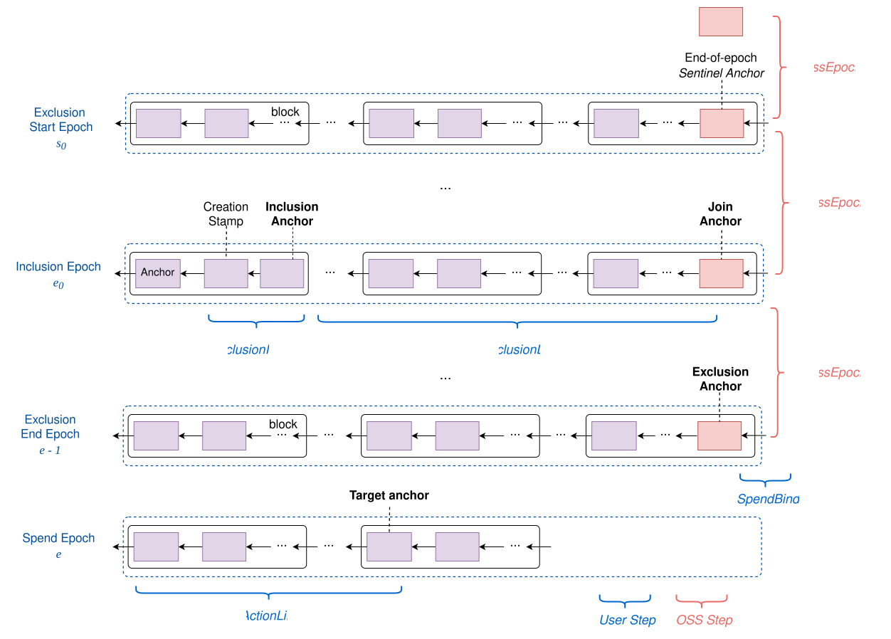
  </a>

This is a map of which party supplies evidence for each range, not a schedule of
PCD inputs. The wallet later equality-checks its join anchor against the captured
join anchor. The OSS neither receives the inclusion proof nor learns
whether the selected join epoch belongs to a real note.

No note secret or commitment crosses the OSS boundary. Local headers may carry
$\cm$ and $k$ directly because they are folded together before either header is
externally exposed: `SpendCore` checks that the commitment proven included by
the lifted inclusion branch is exactly the commitment used by `NfDerive`. For
an older request, $e_\join$ reveals the inclusion epoch but not the note identity; a
same-epoch or decoy request chooses it independently.

Why the recursive Spendability proof is note-binding

`SpendCore` first checks the two local branches carry the same $\cm$, recomputes
$k=\mathsf{KDF}(\nk,\psi)$ from that note, and checks the $k$ carried by
`NfDerive`. Binding of $\cm$ prevents an included note from being paired with a
different note opening, even when a sender reuses $\psi$.
Carrying $k$ also keeps successive `NfDerive` steps on the same derivation key;
without it, every step would have to reopen $\pk=\mathsf{Com}(\ak,\nk)$ and
repeat the KDF.

`SpendBind` uses the polynomial identity to tie every value the OSS tested to the
prefix derived by `NfDerive`. For an older note, equality with the captured join
sentinel connects its inclusion proof to the OSS's authenticated chain; for a
same-epoch note, $e_\incl=e$ selects the direct branch. The free-standing
`UnspentHeader` becomes note-specific only at this final fold.

Step reuse and OSS batching

The reusable step is the shared per-epoch evidence (`EpochAccCert`, built once
per epoch and consumed by every request). Each list consumes that evidence once
per covered epoch through `CrossEpochLift`.

An OSS serving many requests can batch `CrossEpochLift` a second way, across
*lists*: it carries many delegated sequence commitments in one bundled header
and advances them all against the same `EpochHeader` in a single step. With $M$
lists per step, the dominant
cross-epoch count $N \cdot E$ (over $N$ lists and $E$ epochs) drops to
$(N/M) \cdot E$, bounded by the per-step circuit budget. This is an OSS-internal
throughput win, touching neither soundness nor privacy.

<a id="headers">**Headers.**</a> Each header carries only its binding fields.
After deriving $n$ positions from the left endpoint $s_0$ of $S$, the user's
current range is $R=[s_0,s_0+n)$, so no separate $R$
end point is carried. $b_n$ is the mask state for the next position. On the OSS
branch, $s_0$ and $m$ likewise define the proven range $[s_0,s_0+m)$ and current
epoch $s_0+m-1$. The fixed $e_\join$ selects one epoch of the requested
range; $c_m$ records whether the processed prefix has reached it and captured
its join anchor in $\sntl_\join$.

| Header | Fields | Party |
| ------ | ------ | ----- |
| `NfHeader` | $(\cm,k,S,\mathsf{Com}(g_n^\Uc),n,b_n)$ | $\Uc$ |
| `InclusionHeader` | $(\cm,\anchor_\incl,e_\incl)$ | $\Uc$ |
| `SpendCoreHeader` | $(S,\mathsf{Com}(g_n^\Uc),n,\cv,\rk,\nf_e,\nf_{e+1},\anchor_\incl,e_\incl,e)$ | $\Uc$ |
| `EpochHeader` | $(i,\sntl_i,\sntl_{i+1},\mathsf{Com}(e_i(X)))$ | $\Sc$ |
| `UnspentHeader` | $(s_0,e_\join,\mathsf{Com}(g_m^\Oc),m,\sntl_{s_0+m},\sntl_\join,c_m)$ | $\Oc$ |
| `ActionHeader` | $(\cv,\rk,\tg_0,\tg_1,\anchor,e)$ | $\Uc$ |
| `StampHeader` | $(\set{(\cv_i,\rk_i)},\set{\tg_i},\tgacc,\anchor,e)$ | $\Uc$ |

`InclusionHeader` and `NfHeader` are strictly user-local. They may expose $\cm$
and the note-specific $k$ to their parent circuit because neither header is sent
to the OSS or published. An `InclusionHeader` retains its fixed inclusion epoch
while its current inclusion-branch anchor $\anchor_\incl$ advances within
that epoch. Initially this field is the inclusion
anchor; after `InclusionLift` it is the join anchor for an older note. A
same-epoch spend retains the inclusion anchor. `SpendCore` absorbs $\cm,k$ but preserves
$\anchor_\incl,e_\incl$ for
`SpendBind`. No header the OSS holds (`EpochHeader`, `UnspentHeader`) carries $\cm$, $k$,
$\nk$, or $\psi$.

<a id="steps">**Steps.**</a>
Left and Right are PCD inputs; a dash marks a leaf with witness only.

| Step | Party | Left | Right | Output | Witness |
| ---- | ----- | ---- | ----- | ------ | ------- |
| `NfDerive` | $\Uc$ | `NfHeader`/— | — | `NfHeader` | leaf: $\mathsf{Note},\nk$; next nullifier batch, full old and updated sequence polynomials |
| `ExtendRange` | $\Uc$ | `NfHeader` | — | `NfHeader` | — |
| `InclusionInit` | $\Uc$ | — | — | `InclusionHeader` | $\mathsf{Note}$, creation stamp accumulator polynomial, preceding anchor, block anchor-chain suffix |
| `InclusionLift` | $\Uc$ | `InclusionHeader` | — | `InclusionHeader` | in-epoch anchor-chain path |
| `SpendCore` | $\Uc$ | `NfHeader` | `InclusionHeader` | `SpendCoreHeader` | $\mathsf{Note}, (\ak,\nk), (\alpha,\theta,\rcv)$ |
| `OutputCore` | $\Uc$ | — | — | `ActionHeader` | $\mathsf{Note}, r_\bot, (\alpha,\theta,\rcv)$ |
| `EpochAccCert` | $\Sc$ | — | — | `EpochHeader` | epoch $i$'s ordered per-stamp accumulator polynomials |
| `CrossEpochLift` | $\Oc/\Uc$ | `UnspentHeader`/— | `EpochHeader` | `UnspentHeader` | supplied $\nf_i$, updated sequence polynomial and, on continuation, its predecessor; epoch polynomial $e_i(X)$ |
| `SpendBind` | $\Uc$ | `SpendCoreHeader` | `UnspentHeader` | `ActionHeader` | sequence polynomials |
| `ActionLift` | $\Uc$ | `ActionHeader` | — | `ActionHeader` | in-epoch anchor-chain path |
| `BundleAssemble` | $\Uc$ | `ActionHeader`/`StampHeader` | `ActionHeader`/`StampHeader`/— | `StampHeader` | full child and product tachygram polynomials |
| `StampLift` | $\Uc$ | `StampHeader` | — | `StampHeader` | anchor-chain path between anchors |

**Step-local transitions.** These checks establish each branch before any
independently constructed headers meet.

- `NfDerive` maintains the invariant that an `NfHeader` of length $n$ has
  derived epochs $R=[s_0,s_0+n)$, commits to their masked sequence polynomial
  $g_n^\Uc(X)$, and carries the mask state $b_n$ for the next position.
  - Base case: with no `NfHeader` child, it computes $\cm$ from the note
    opening and $k=\mathsf{KDF}(\nk,\psi)$, then starts from the virtual state
    $n=0$, $g_0^\Uc(X)=0$, and $b_0=1$.
  - Normal case: from either the base state or an input header, it checks the
    same $\cm,k,S$ and derives the next bounded batch of $\ell$ nullifiers. For
    each $0\leq j<\ell$, it derives $\nf_{s_0+n+j}$ and applies
    $$
    b_{n+j+1}=b_{n+j}-\mathsf{isEq}(n+j,|S|-1).
    $$
    Ragu checks the Horner update
    $$
    g_{n+\ell}^\Uc(X)=X^\ell g_n^\Uc(X)
    +\sum_{j=0}^{\ell-1}b_{n+j} \cdot \nf_{s_0+n+j} \cdot X^{\ell-1-j},
    $$
    after which the output header carries $n+\ell$ and $b_{n+\ell}$.
- `InclusionInit` checks $\cm=\mathsf{Com}(\pk,v,\psi;\rcm)$ and then tests
  $f^\tg_\incl(\cm)=0$ against $\tgacc_\incl$.
  It absorbs $\tgacc_\incl$ into the preceding anchor,
  advances through the remaining stamps in the same block, and emits the
  end-of-block stamp's resulting inclusion anchor as
  $(\cm,\anchor_\incl,e_\incl)$.
- `InclusionLift` checks the same $\cm,e_\incl$ and advances the anchor through
  stamps in $e_\incl$; it may finish with the transition to
  $\sntl_{e_\incl+1}$. It never crosses another epoch.
- `EpochAccCert` uses the same ordered per-stamp accumulator sequence to compute
  $e_i(X)=\prod_t f^\tg_{i,t}(X)$ and to hash from
  $\sntl_i$ through the ordinary epoch-$i$ stamps and the next boundary
  transition to $\sntl_{i+1}$. Its header binds the product to that exact
  sentinel-bounded segment; when there are no stamps, the product is $1$.

**Bridging checks.** These equalities connect independently built branches and
preserve the monolithic statements across later folds:

- `SpendCore` checks that `NfHeader` and `InclusionHeader` carry the same $\cm$.
  It recomputes $\cm$ and $k=\mathsf{KDF}(\nk,\psi)$ from one note opening,
  checks the derivation branch's $k$ and terminal $b_n=0$, and preserves
  $\anchor_\incl,e_\incl$ for the later join. Thus inclusion, past derivation,
  spend-time nullifiers, value, and authority all refer to one note.
- `CrossEpochLift` matches the `UnspentHeader`'s current sentinel to the
  `EpochHeader`'s left sentinel and requires its epoch $i=s_0+m$. This prevents
  gaps or reordering while extending the same delegated sequence through the
  shared epoch evidence.
- `SpendBind` aligns the two branches on
  $S=[s_0,s_0+m)$ and $R=[s_0,s_0+n)$, then checks
  $$
  g_n^\Uc(X)=X^{n-m}g_m^\Oc(X).
  $$
  It also requires $c_m=1$ and $e=s_0+m$. For an older note it checks
  $e_\join=e_\incl$ and $\anchor_\incl=\sntl_\join$, then emits at $\sntl_e$.
  For a same-epoch note it instead checks $e_\incl=e$ and emits at
  $\anchor_\incl$. These checks bind the opaque OSS exclusions to the user's
  derived prefix and connect the appropriate inclusion path.
- `ActionLift` and `StampLift` change only the anchor while preserving the epoch
  and every other header field. Their output therefore carries the same proven
  action or stamp to a later anchor.
- Each `BundleAssemble` checks its children share
  $(\anchor,e)$, preserves their wire order, and proves that the output action
  and tachygram lists are their concatenation and that $\tgacc$ is the product
  of their accumulator polynomials. Thus assembly neither drops nor alters an
  action.

<a id="prooftree-diagram">**The tree.**</a>
For an ordinary older-note, one-spend, one-output transaction (colored by
proving party). Private witnesses are listed in the [step table](#steps) and
omitted here:

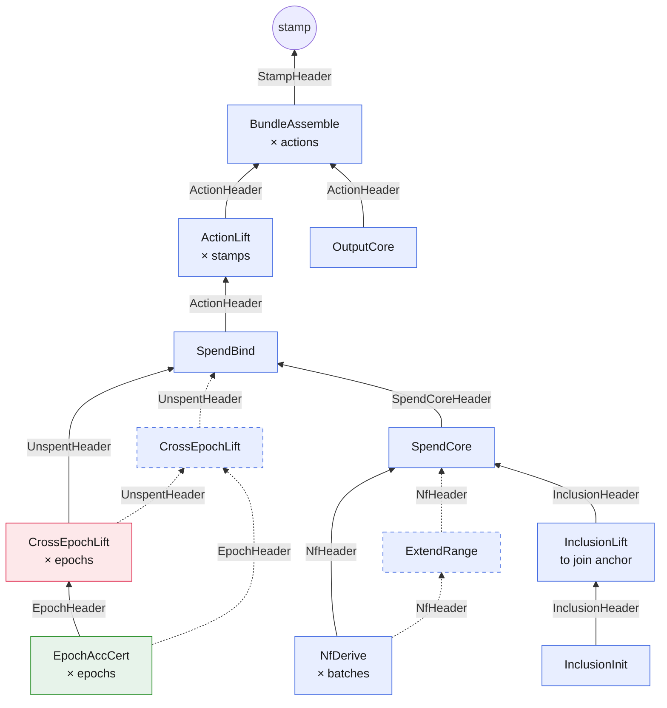
```mermaid
flowchart BT
  classDef u fill:#e8eeff,stroke:#4169E1,color:#1a1a1a;
  classDef o fill:#fde8ea,stroke:#DC143C,color:#1a1a1a;
  classDef s fill:#e7f3ea,stroke:#228B22,color:#1a1a1a;
  classDef optional fill:#e8eeff,stroke:#4169E1,color:#1a1a1a,stroke-dasharray:5 5;

  eacc["EpochAccCert<br/>× epochs"]:::s

  nfderive["NfDerive<br/>× batches"]:::u
  extend[ExtendRange]:::optional
  uinit[InclusionInit]:::u
  ilift["InclusionLift<br/>to join anchor"]:::u
  score[SpendCore]:::u
  xoss["CrossEpochLift<br/>× epochs"]:::o
  xextend["CrossEpochLift<br/>"]:::optional
  sbind[SpendBind]:::u
  alift["ActionLift<br/>× stamps"]:::u
  ocore[OutputCore]:::u
  bmerge["BundleAssemble<br/>× actions"]:::u
  stamp((stamp))

  nfderive -->|NfHeader| score
  nfderive -.->|NfHeader| extend
  extend -.->|NfHeader| score
  uinit -->|InclusionHeader| ilift
  ilift -->|InclusionHeader| score

  eacc -->|EpochHeader| xoss
  xoss -->|UnspentHeader| sbind
  xoss -.->|UnspentHeader| xextend
  eacc -.->|EpochHeader| xextend
  xextend -.->|UnspentHeader| sbind
  score -->|SpendCoreHeader| sbind

  sbind -->|ActionHeader| alift
  alift -->|ActionHeader| bmerge
  ocore -->|ActionHeader| bmerge
  bmerge -->|StampHeader| stamp
```

Dashed nodes denote optional local range extension. After `ExtendRange`, the
wallet resumes `NfDerive`; the user-side `CrossEpochLift` advances the returned
OSS branch in parallel.

This spend branch is built bottom-up in three phases. The wallet sends request
data to the OSS, but no user proof feeds the OSS branch.

1. **Dispatch.** The wallet sends the opaque list
   $[(i,\nf_i)]_{i\in S}$ and selected join epoch $e_\join$. The leaf
   `CrossEpochLift` can start as soon as the shared `EpochHeader` for $s_0$ is
   available; neither `InclusionHeader` nor `NfHeader` must exist yet.

2. **Parallel proving ($\Uc/\Oc$).** On the wallet, a previously cached
   `InclusionInit` proof links the note to its inclusion anchor.
   For an older note, `InclusionLift` reaches the join anchor
   $\sntl_{e_\incl+1}$, while
   `NfDerive` independently scans forward from $s_0$. Concurrently, repeated
   `CrossEpochLift` steps clear every epoch in $S$, advance the anchor chain,
   and capture the join anchor selected by $e_\join$. The OSS stops at
   the exclusion anchor and returns the
   `UnspentHeader`. Garbage and decoy lists are valid requests because
   derivation lies outside its statement; admission and rate limiting are
   separate service policy.

3. **Wallet, after all branches complete ($\Uc$).** The completed
   `NfDerive` and `InclusionHeader` branches meet at `SpendCore`, which directly
   binds $\cm$, $k$, the authenticated inclusion epoch, the masked commitment,
   and the spend-time nullifiers $(\nf_e,\nf_{e+1})$. `SpendBind` then matches
   $S$ against the OSS proof and checks
   $g_n^\Uc(X)=X^{n-m}g_m^\Oc(X)$. It applies the older- or same-epoch join and
   emits an `ActionHeader` at the exclusion anchor for an older note or the
   inclusion anchor for a same-epoch note. `ActionLift` advances either one to
   the target anchor. Recursive
   `BundleAssemble` steps fold it and the output headers into the published stamp.

> Note: at every hand-off across a trust boundary, the carried PCD proof is
> [re-randomized](https://tachyon.z.cash/ragu/implementation/proofs.html#rerandomization)
> first. The relayed proof is then unlinkable to its pre-handoff form and reveals
> nothing about the private inputs of earlier steps beyond its public header.
> These hand-off points include the OSS returning the exclusion proof, the wallet
> publishing its stamp, and an aggregator merging published stamps. The initial
> wallet-to-OSS request contains no PCD proof to re-randomize.

#### Same-epoch Spend {#same-epoch-spend}

  <a href="./assets/step_range_same_epoch.svg">
    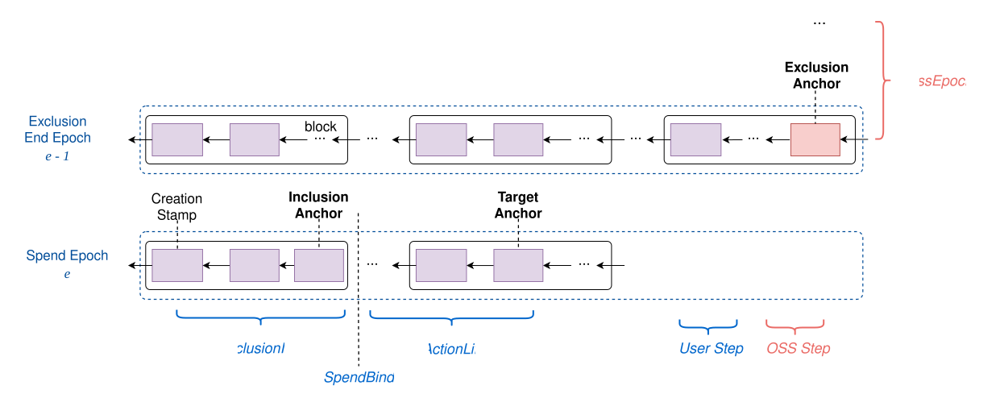
  </a>

When $e_\incl=e$, past exclusion is unnecessary for soundness but remains useful
as camouflage. The wallet therefore follows the same branches through
`SpendBind`: it chooses a
nonempty $S=[s_0,e)$, derives the note's actual nullifiers for that range, and
runs `NfDerive`, the OSS branch, and `SpendBind` normally. It chooses an
independent $e_\join\in S$, so the request has the same shape as an
older note's. How well this hides the same-epoch case depends on wallet policy:
the wallet should sample $(s_0,e_\join)$ from the same joint distribution that
older-note requests expose.

Its inclusion branch is shorter: `InclusionInit` stops at the inclusion anchor,
which `SpendBind` carries into the `ActionHeader`. `ActionLift` then advances the
completed action to the target anchor. The final PCD proof hides this internal
shape.

`SpendBind` admits this case through $e_\incl=e$ and bypasses the join-anchor
equality. Canonical inclusion proves the note did not
exist before epoch $e$, while consensus's live-window test of $\nf_e$ covers the
entire interval after its creation. An older note cannot use the equality branch
because the inclusion-anchor update binds its actual $e_\incl$. Thus the common
construction is sound and does not reveal this case through its proving shape
or OSS interaction. Creation and spending in the same block remain unsupported
because the block containing the creation stamp must already be finalized.

#### Extending a delegated range {#extend-range}

A request may extend its right endpoint without rebuilding either proof branch.
The dashed nodes in the [proof tree](#prooftree-diagram) show this optional
continuation.

**OSS branch.** An `UnspentHeader` carries $s_0$ and its processed length $m$,
so its current range is $S_m=[s_0,s_0+m)$; it carries no fixed right endpoint.
`CrossEpochLift` extends this range with epoch $i=s_0+m$, tests $\nf_i$, updates
$$
g_{m+1}^\Oc(X)=Xg_m^\Oc(X)+\nf_i,
$$
and increments $m$. Additional $(i,\nf_i)$ pairs may therefore arrive as a
stream. `SpendBind` fixes the eventual endpoint by requiring $e=s_0+m$.

**Wallet branch.** To preserve earlier derivation work, the wallet retains the
`NfHeader` at each potential extension boundary
$$
n=|S|,\qquad b_n=0.
$$
Here $g_n^\Uc(X)$ contains exactly the derived sequence over $S$, with no
trailing masked positions. `ExtendRange` checks $n=|S|$, replaces $S$ by a
right extension $S'$ with the same $s_0$, resets $b_n$ to one, and preserves
every other field, including $\mathsf{Com}(g_n^\Uc)$. `NfDerive` then resumes
at epoch $s_0+n$ and turns the mask off after the last position of $S'$. If the
main derivation branch has already appended trailing zeros, the wallet extends
from the retained boundary header instead.

The equality $n=|S|$ is necessary. A header that has advanced past $|S|$
already commits to zero coefficients at positions $|S|,\ldots,n-1$. Resetting
its mask would turn derivation back on after this gap. The delegated list could
then use zero at each corresponding epoch; since every published tachygram is
nonzero, zero passes the non-membership checks, leaving the note's actual
nullifiers in the gap untested. Starting instead from $n=|S|$ keeps the derived
sequence a prefix. It also enforces a strict extension without comparing
endpoints: the reset mask can return to zero only if the new turn-off position
$|S'|-1$ still lies ahead, while bounded counters exclude field wraparound. At
the final fold, the branches agree on
$$
S'=[s_0,s_0+m),\qquad
g_n^\Uc(X)=X^{n-m}g_m^\Oc(X),
$$
so the extended OSS sequence remains a prefix of the wallet's derived sequence.

After the OSS handoff, the wallet may extend both branches itself: it applies
`ExtendRange` followed by `NfDerive` on the retained header, and applies
`CrossEpochLift` to the returned `UnspentHeader`. The selected $e_\join$ remains
fixed, while the join anchor and capture state follow their ordinary recurrence.
Because the returned header fixes no right endpoint, the OSS cannot know which
later sentinel the spend will use.

#### Cross-epoch Lifts {#cross-epoch-lift}

Every past epoch uses the same `CrossEpochLift`. Reaching $\sntl_e$ certifies
complete coverage through epoch $e-1$, so no lift is needed in the active epoch.

- `CrossEpochLift` maintains the invariant that a length-$m$ `UnspentHeader`
  covers $[s_0,s_0+m)$, commits to $g_m^\Oc(X)$, and ends at
  $\sntl_{s_0+m}$.
  - **Base case:** with no `UnspentHeader` child, it starts from the virtual
    state $m=0$, $g_0^\Oc(X)=0$, current sentinel $\sntl_{s_0}$, and
    $(\sntl_\join,c_0)=(0,0)$. It then processes epoch $s_0$ by the normal case,
    producing the first actual header at $\sntl_{s_0+1}$.
  - **Normal case:** for $i=s_0+m$, it consumes the matching `EpochHeader`,
    tests $\nf_i$ against epoch $i$, extends the sequence and join-capture
    state, and emits length $m+1$ at $\sntl_{i+1}$. The OSS normally runs these
    steps before handoff, but the wallet may continue them locally.

A valid instance of a continuing [`CrossEpochLift`](#steps) assures that, given the public
input:

- the input [`UnspentHeader`](#headers)
  $(s_0,e_\join,\mathsf{Com}(g_m^\Oc),m,\sntl_i,
  \sntl_\join,c_m)$
- the shared [`EpochHeader`](#headers)
  $(i,\sntl_i,\sntl_{i+1},\mathsf{Com}(e_i(X)))$, certifying
  epoch $i$ boundary-to-boundary with its [whole-epoch accumulator](#epoch-acc)
  $e_i(X)$
- the output `UnspentHeader`
  $(s_0,e_\join,\mathsf{Com}(g_{m+1}^\Oc),m+1,\sntl_{i+1},
  \sntl_\join',c_{m+1})$

the prover knows the secret witness:

- the child PCD proofs carried by the two input headers
- the supplied nullifier $\nf_i$
- the full old and updated sequence polynomials
  $g_m^\Oc(X),g_{m+1}^\Oc(X)$
- the epoch polynomial $e_i(X)$ for epoch $i$

such that the following conditions hold:

- **Child proof recursion**: fold the child proofs into the running PCD proof.
- **Consecutive epoch**: $i=s_0+m$.
- **Delegated commitment extension**:
  $g_{m+1}^\Oc(X)=Xg_m^\Oc(X)+\nf_i$. Ragu tests this at its randomized
  polynomial-oracle point $r$ as the field identity
  $g_{m+1}^\Oc(r)=r\,g_m^\Oc(r)+\nf_i$.
- **Sentinel continuity**: two input headers carry the same
  $\sntl_i$.
- **Exclusion extension**: $e_i(\nf_i) \neq 0$ against the committed
  $\mathsf{Com}(e_i(X))$, attested through the [poly-query oracle](#acc); one query
  clearing all of epoch $i$.
- **Join capture**: for $h_i=\mathsf{isEq}(i,e_\join)$,
  $$
  c_{m+1}=c_m+h_i,\qquad
  \sntl_\join'=
  h_i\cdot \sntl_{i+1} + (1-h_i)\cdot \sntl_\join.
  $$
  Since the traversed epoch indices are distinct and bounded, $h_i=1$ at most
  once.

The `EpochHeader` is note-independent, so crossing a past epoch costs one per-list
step, and an OSS may [batch many lists](#steps) against the same one.

**Final user binding.** The active epoch $e$ is still in progress, so no
`EpochHeader` exists for it. [`SpendBind`](#steps) instead binds the delegated
sequence ending at the exclusion anchor $\sntl_e$ to the user's derivations and
joins the inclusion proof at the captured join anchor when the note is older.

A valid instance assures that, given the public input:

- the [`UnspentHeader`](#headers)
  $(s_0,e_\join,\mathsf{Com}(g_m^\Oc),m,\sntl_e,
  \sntl_\join,c_m)$
  returned by the OSS
- the [`SpendCoreHeader`](#headers)
  $(S,\mathsf{Com}(g_n^\Uc),n,\cv,\rk,\nf_e,\nf_{e+1},
  \anchor_\incl,e_\incl,e)$,
  already revealing the spend nullifier $\nf_e$ and carrying the masked commitment
- the output [`ActionHeader`](#headers)
  $(\cv,\rk,\nf_e,\nf_{e+1},\anchor,e)$

the prover knows the secret witness:

- the child PCD proofs carried by the two input headers
- the full sequence polynomials $g_n^\Uc(X),g_m^\Oc(X)$

such that the following conditions hold:

- **Child proof recursion**: fold the child proofs into the running PCD proof.
- **Prefix consistency**: the child headers agree on
  $S=[s_0,s_0+m)$, the user's processed range is $R=[s_0,s_0+n)$, and
  $$
  g_n^\Uc(X)=X^{n-m}g_m^\Oc(X).
  $$
  `NfDerive` has already checked all $n$ derivations and masked exactly the
  trailing $n-m$ positions. Ragu tests the displayed identity at a fresh
  polynomial-oracle point.
- **Consecutive epoch**: $s_0+m=e$.
- **Complete past boundary**: the `UnspentHeader` ends at
  $\sntl_e$, the authenticated exclusion anchor.
- **Completed join capture**: $c_m=1$, proving
  $e_\join\in S$ and
  $\sntl_\join=\sntl_{e_\join+1}$ on the carried chain.
- **Inclusion provenance**: let $q=\mathsf{isEq}(e_\incl,e)$. If $q=0$, require
  $e_\join=e_\incl$ and
  $\anchor_\incl=\sntl_\join$, and require the output
  $\anchor=\sntl_e$. If $q=1$, require the output
  $\anchor=\anchor_\incl$, the inclusion anchor carried by the inclusion branch.

#### Action Lift {#action-lift}

`ActionLift` moves a completed action from its current anchor to a later target
anchor in the same spending epoch. That current anchor is the exclusion anchor
for an older note or the inclusion anchor for a same-epoch note. A valid instance
consumes $(\cv,\rk,\tg_0,\tg_1,\anchor',e)$ and emits the same fields at
$\anchor$, proving every intervening anchor-chain update with epoch $e$. The
step is bounded and may repeat; it changes no field except the anchor.

The active epoch falls to the consensus [two-epoch live-window
check](#consensus-rule) on $(\nf_e, \nf_{e+1})$;
[anchor validation](#consensus-rule) confirms the final $\anchor$ is canonical
and belongs to epoch $e$.

#### Aggregation {#aggregation}

Aggregation folds several finished stamps into one, run by any aggregator or miner.
It is a distinct step from [`BundleAssemble`](#steps): where `BundleAssemble`
composes one transaction's `ActionHeader`s into that transaction's stamp,
aggregation merges the [`StampHeader`](#headers)s of
already-stamped transactions — the same multiset-union-by-product, one level up.
Constituents may carry different anchors in epoch $e$. `StampLift` first proves
each source anchor is an ancestor of a common later anchor, preserving the
action and tachygram fields. Each constituent's
stamp can afterward be replaced by a reference to the aggregate's `wtxid`.

A valid `StampLift` keeps $e$, the action list, tachygrams, and $\tgacc$
unchanged, and replaces only $\anchor$ after proving the source anchor is an
ancestor of the new anchor in the same epoch.

A valid Aggregation step assures that, given the public input:

- the aligned constituent `StampHeader`s $\set{\mathsf{StampHeader}_k}$, each
  $(\set{(\cv_i,\rk_i)}_k,\set{\tg_i}_k,\tgacc_k,
  \anchor,e)$
- the output aggregate `StampHeader`
  $(\set{(\cv_i,\rk_i)},\set{\tg_i},\tgacc,
  \anchor,e)$, with the tachygram lists and accumulators
  unioned

the prover knows:

- the child PCD proofs carried by the constituent `StampHeader`s

such that the following conditions hold:

- **Child proof recursion**: fold the child proofs into the running PCD proof.
- **Common context**: every constituent shares
  $(\anchor,e)$.
- **Multiset union**: $\set{\tg_i}$ is the union of the constituent tachygram
  lists and $\tgacc=\prod_k\tgacc_k$ is its [multiset accumulator](#union),
  verified at a random point.
- **Action aggregation**: the aggregate action list $\set{(\cv_i, \rk_i)}$ concatenates
  the constituents'.

Value balance and per-action authorization stay *outside* the proof, as in the
[bundle-level statement](#bundle): the constituents' [binding signatures](#tx) and
the [consensus anchor check](#consensus-rule) carry over unchanged, since
aggregation neither creates nor destroys value and only unions already-valid
tachygram sets.

Stated N-ary over the $\set{\mathsf{StampHeader}_k}$, aggregation folds on the
binary DAG as a tree of two-input `MergeStamp`s, preceded where necessary by
`StampLift`.

## Payment Protocol {#payment}

As established in the [motivation](#decouple), the payment protocol owns secure
note transmission. That entails a full payment address carrying the key material
for incoming-note detection, plus infrastructure for fast memo retrieval and
spending-witness construction. The leading Tachyon-compatible payment protocol is
being developed by [ValarGroup](https://github.com/valargroup); we sketch their
architecture and design rationale here.

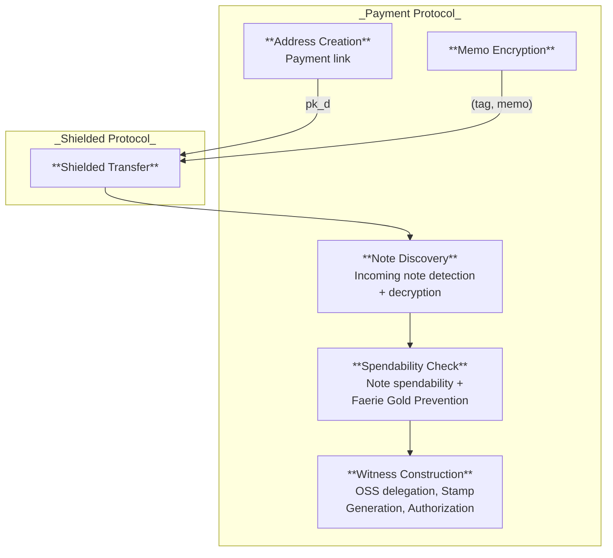
```mermaid
flowchart TB
    subgraph _Payment Protocol_
    addr["**Address Creation**
    Payment link"]
    memo["**Memo Encryption**"]
    discovery["**Note Discovery**
    Incoming note detection + decryption"]
    check["**Spendability Check**
    Note spendability + Faerie Gold Prevention"]
    wit["**Witness Construction**
    OSS delegation, Stamp Generation, Authorization"]
    end

    subgraph _Shielded Protocol_
    transfer["**Shielded Transfer**"]
    end

    addr -- "`pk_d`" --> transfer
    memo -- "`(tag, memo)`" --> transfer
    transfer --> discovery --> check --> wit
```

The infamous[^sandblast] pain point of the existing note-transmission mechanism
is shielded sync by **trial decryption** of memos distributed in-band.
[Roman's article](https://x.com/akhtariev/status/2044113751767691637) gives a
detailed motivation and problem statement; briefly, the linear scan it requires
leaks metadata and grows infeasible for bandwidth-limited mobile wallets as Zcash
throughput scales.

[^sandblast]: Due to the linear cost of the shielded sync and an unprotective
    gas price, Zcash NU5 experienced a DOS attack, referred to as [the sandblasting
    attack](https://electriccoin.co/blog/a-look-back-nu5-and-network-sandblasting/),
    preventing wallets from syncing fast enough to access their funds.

One promising remedy is **Private Information Retrieval** (PIR), which lets a
client query a database without the server learning anything about the query
(slides below by [Corrigan-Gibbs](https://www.youtube.com/watch?v=Jdzrf3im1gQ)).
With PIR, the sender publishes the encrypted memo with a short `tag` attached, and
the resulting `(tag, encrypted_memo)` pairs are stored in a PIR database for
instant, leak-free retrieval.

  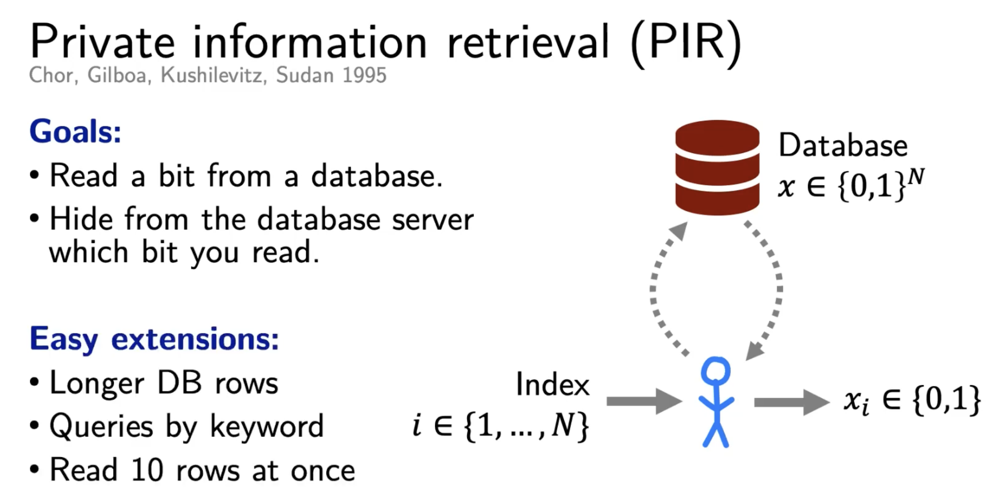

### PIR Databases {#pirdb}

Modern single-server PIR trades $\Theta(N)$ preprocessing for a faster online
response and lower per-query communication. Since many of the costs we care about
scale as $\Theta(\sqrt{N})$, we keep every database bounded, capping its expected
size to hold overhead in check. For our scope, the payment protocol maintains at
least the following PIR databases (entries written as `key => value`):

- Epoched memo DB: a per-epoch `tag => memo` store, synced from the
  [DA blobs](#tx) on chain.
- First-contact memo DB: a `tag => KEM.c || memo` store for the [handshake](#discovery)
  transactions, synced from chain. It is also chunked, but over a much longer
  horizon than per-epoch, given how rare first-contact transactions are.
- Epoched tachygram DB: a per-epoch,
  [hash-table-bucketed](https://github.com/valargroup/spendability-pir/blob/main/nullifier/README.md)
  `H(tg)[:4] => tg (32 bytes) || blk_height (u32_le) || anchor_height (u32_le) || action_count (u8)`
  store, recording each tachygram together with its stamp's block and post-stamp
  anchor, synced from stamps on chain.
- PKI DB: an off-chain address registry `H(addr) => addr`, returning a full
  address (its ML-KEM encapsulation key and payment key) from a short digest.

### Full Payment Address {#address}

The [decoupling](#decouple) split the owner-binding payment key from the
note-transmission key, leaving the latter for the payment protocol to define. A
Tachyon *payment address* is

$$
\addr = (\pk,\,\ek)
\qquad
\begin{cases}
    \pk = \mathsf{Com}(\ak, \nk)\\
    (\ek, \dk) \leftarrow \mathsf{ML\text{-}KEM.KeyGen}()
\end{cases}
$$

with two components, both minted fresh per sender:

- *Payment key* $\pk$: the owner field every note commits to
  ([defined earlier](#payment-key)), committing to a freshly indexed
  $(\ak, \nk)$ pair so that payment keys from the same wallet are unlinkable.
  The decoupling lets us refresh it independently of the transmission key.
- *Transmission key* $\ek$: the encapsulation key of a freshly sampled
  ML-KEM key pair.

**Why not an Orchard-style transmission key.** Orchard derives a whole family of
diversified transmission keys $[\ivk]\,\G_d$ from diversified bases $\G_d$, all
sharing one incoming viewing key $\ivk$. This is convenient, since minting as many
unlinkable addresses as needed never increases the number of viewing keys note
discovery must scan. But it is not quantum-private: a sender who later gains access
to a quantum computer could *retroactively recover* $\ivk$ by breaking discrete
log, and a single $\ivk$ exposes every incoming note of the recipient, past and
future. ML-KEM sidesteps this, as its encapsulation is lattice-based and
post-quantum secure, and the symmetric encryption under the KEM-derived shared
secret is already quantum-safe today.

**No persistent viewing key? Tags to the rescue.**
An unfortunate byproduct of switching to ML-KEM is that the "diversified base,
same $\ivk$" algebraic relation no longer holds[^ivk]: instead, the decapsulation
key $\dk$ is freshly sampled for each new address. Naively, this
multiplies the cost of shielded sync by the number of $\dk$ in the wallet, since
each must be trialed during the linear scan. PIR shortcuts that trial decryption
by attaching to every encrypted memo a retrieval handle, the $\tag$, which the
recipient queries the memo database with directly. The incoming viewing key in
Tachyon is therefore effectively:

$$
\ivk^{\mathsf{Tachyon}} := (
\underbrace{\tag}_{\text{per-note}}, \underbrace{\dk}_{\text{per-sender}})
$$

[^ivk]: The diversified-base trick yields two key pairs $(\pk, \sk)$ and
    $(\pk', \sk)$ that are unlinkable yet share the same $\sk$. Such a relation is
    easy in the discrete-log world but has no known secure analogue in the LWE
    world.

As the figure below shows, we sample the KEM key pair *deterministically*. Although
[ML-KEM's public `KeyGen`](https://nvlpubs.nist.gov/nistpubs/FIPS/NIST.FIPS.203.pdf)
is randomized, wallets invoke the derandomized `KeyGen_Internal(d, z)` with
$(d, z)$ derived from the HD-wallet master spending key, so the key pair is
reproducible from the seed. The sequence of tags is bound to the shared secret of
a channel, predictable to the two parties but opaque to everyone else. We say more
about tags in the [next section](#discovery).

  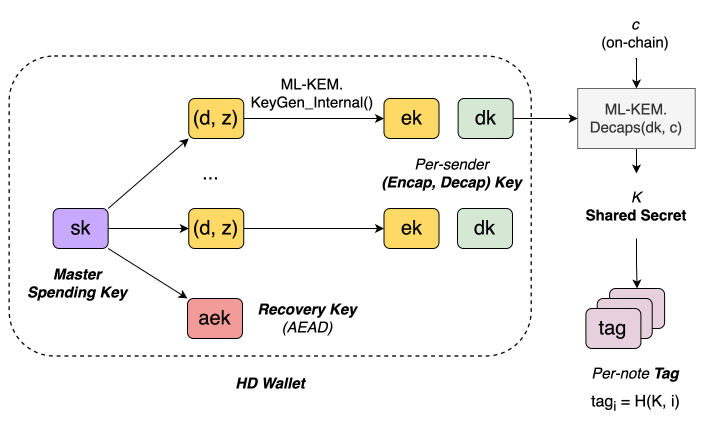

**Two freshness schedules: per-sender and per-note.**
Address diversification historically existed to stop colluding senders from
recognizing that two addresses belong to the same recipient, which calls for a
per-sender schedule for $\ek$. Tags need a tighter one: since a $\tag$ appears
directly on chain, any reuse would link the two transactions carrying it to the
same recipient, so a fresh tag must be generated for every output note.

**Payment address PKI.** An ML-KEM encapsulation key is a few kilobytes, too large
for a QR code or payment URI. We therefore keep a PIR database that maps a short
digest to the full address, $H(\addr) \mapsto \addr$, queried on demand. Two
concerns remain open: the registry grows without bound, and rerunning PIR
preprocessing on every new entry is expensive. In practice we will likely split
the registry into size-capped chunks, conceding a few bits of privacy so that a
preprocessing rerun touches only the last, not-yet-full chunk.

### Note Discovery {#discovery}

> **In one breath:** first contact hands the sender a fresh address, the
> opening transaction completes the handshake, a stateful wallet then fast-syncs
> through the PIR databases, and an AEAD-encrypted wallet state posted on chain
> backs full recovery from the mnemonic alone.

Note discovery breaks into three interrelated procedures: handshake, stateful
sync, and recovery. In the **handshake**, a tentative sender makes first contact
and obtains a *distinct* KEM encapsulation key $\ek$ from the recipient,
establishing a shared secret $K$ that will encrypt every future note sent to that
recipient. The tags attached to those encrypted memos, the recipient's advice for
fast PIR retrieval, are derived deterministically from $K$ and known only to the
two channel parties. Once the recipient comes online and decapsulates $K$, its
wallet enters **stateful sync**, updating its local state (handshake material, the
number of notes seen on the channel, and each [note's spendability](#spendable))
as it syncs blocks with help from the PIR databases. Finally there is the rare
case of **recovery from mnemonic**, where a wallet rebuilds its state from scratch
by scanning the chain alone, ideally accelerated by PIR servers when available.

We examine each procedure more closely and explore possible design choices.

Everything starts with the recipient sharing a fresh address: the sender
uses its payment key to construct the output note and its transmission key for
secure in-band secret distribution. Disseminating $\addr$ is trivial when the two
already share a secure channel (Signal, WhatsApp, and the like), and a recipient
may simply publicize contact info for anyone to reach. The **first-contact
problem** arises when the recipient would rather not broadcast a private contact
(opening an OOB channel with every sender) or is not always online to answer
handshake requests. The simplest answer is a dynamic URI that serves a fresh $\ek$
from a precomputed sequence on each access, in practice a self-hosted page handing
out a new HD-derived $\ek$ on every click[^intro-service].

Once the sender has $\addr$, it runs `KEM.Encaps(ek)` to obtain the shared secret
$K$ and a KEM ciphertext $c$[^kem-ct], and from then on encrypts every note to the
recipient symmetrically under $K$. The ciphertext $c$ is sizable, 768 bytes to 1.5
KB in ML-KEM depending on security level, far more than the 32-byte
$\mathsf{epk}$ that plays the analogous role in Orchard. This overhead is the
primary reason we maximize shared-secret reuse. Three subtleties follow:

- Only first-contact transactions carry the KEM ciphertext $c$; follow-ups omit
  it. The resulting distinction is harmless: in the security reduction the
  simulator emits transactions with and without the $c$ field at random, so ledger
  indistinguishability still holds.
- Costly as first contact is, parties with an existing secure channel should still
  not send a randomly sampled shared secret directly: that has no forward secrecy
  and leaks all past and future incoming notes the moment the channel is breached.
  Nor should they send the encrypted memo over the OOB channel, unless the
  recipient will spend it soon, since a memo with no on-chain backing complicates
  wallet recovery and can permanently strand unspent coins.
- For two payments to the same recipient to be mutually unlinkable, the sender
  must open a new channel; by design, all notes on one channel trace back to the
  same first-contact $\ek$, and hence to the same sender.

[^intro-service]: A fancier option is an *introduction service* that shares a
    channel with the recipient Bob, who hands it a list of fresh addresses
    in advance, each authenticated by a signature under a well-known public key of
    his. Alice then reaches the always-online service, which accepts all incoming
    requests. Two subtleties: (1) the service must vouch for the authenticity of a
    relayed $\ek$, via a signature or a ZKP; (2) it must defend against DOS, e.g.
    rate-limiting through an upfront micropayment.

[^kem-ct]: The KEM ciphertext $c$ is distinct from the encrypted memo, which is a
    ciphertext under the shared secret. $c$ is analogous to the ephemeral
    $\mathsf{epk}$ in Orchard's DH setting: the material a recipient needs to
    decapsulate the shared secret.
    
Beyond the shared secret that produces the encrypted memo, the other half of the
memo-encryption task is attaching a short tag for fast retrieval. As noted
[above](#address), tags must be distinct per note. Ours are all derivable from the
shared secret, except for the first-contact tag:

$$
\begin{cases}
\tag_0 = H(\ek) &\text{first-contact tag} \\
\tag_i = H(K, i) &\text{for follow-up } i>0
\end{cases}
$$

The whole sequence is predictable to the channel parties but private to everyone
else. The first-contact tag cannot depend on $K$: the recipient does not yet hold
$K$ at first contact, and binding the tag to $K$ would force a trial decapsulation
of every transaction with a non-empty KEM-ciphertext field. Setting
$\tag_0 = H(\ek)$ instead lets the recipient locate the first-contact transaction
and its memo with a single PIR query. The predictable sequence keeps wallet
tracking state minimal, eases mnemonic recovery, and preserves unlinkability.

<i>Alternative tag designs that don't work.</i>

First, who picks the tag values?

- *Sender-picked*: too much bookkeeping for the recipient wallet, and it needs
integration (or manual relaying) between the messaging app and the Zcash wallet.
- *Receiver-picked, random*: the recipient must be online to issue new tags before
more notes can be sent, and wallet state grows linearly in the number of tags.
- *Receiver-picked, sequentially derivable*: minimal wallet state, just the
first-contact seed and a running `num_tags` counter.

Second, what does the sequential derivation look like?

- $\tag_i = H^i(\ek)$: if $\ek$ leaks, anyone can derive the whole sequence,
breaking unlinkability.
- $\tag_i = H^i(K)$: works, but recovering the $i$-th tag means walking the entire
hash-chain prefix.
- $\tag_i = H(K, i)$: random access, but the first-contact tag is unknown to the
recipient, forcing a trial decapsulation for $\tag_0$.
- $\tag_0 = H(\ek),\ \tag_{i>0} = H(K, i)$: checks every box.

To detect notes, the recipient first settles any new handshakes by querying the
first-contact memo DB at $\tag_0 = H(\ek)$, for each $\ek$ it handed out in an
address. On a hit $(c, \memo)$ it runs `KEM.Decaps(dk, c)` to recover the shared
secret $K$ and decrypt the memo. From there, detecting that sender's later notes
is cheap: the subsequent tags are all computable, and querying them against the
[epoched memo DB](#pirdb) is near-instant, at most one PIR query per unsynced
epoch to collect every tagged memo since the last sync. The *minimal* state a
wallet keeps locally for a fast next sync is:

$$
\set{\underbrace{(\mathsf{idx}_\ek, \blk_\mathsf{fc}, n)}_{\text{per-sender}}},
\set{\underbrace{(\mathsf{Note^{Tachyon}}, \blk_\mathsf{mint}, \blk_\mathsf{last})}_{\text{per-note}}}
$$

where $\mathsf{idx}_\ek$ is the HD derivation index of the channel's $\ek$,
$\blk_\mathsf{fc}$ its first-contact block, and $n$ the number of notes detected
on it so far; each note additionally records its plaintext opening, its mint
block, and the block where the last sync stopped. In normal operation a wallet
caches far more, such as the $\ek, \dk, K$ of each channel, to avoid
recomputation.

Last and perhaps most important, a wallet must be recoverable from the mnemonic
alone, even if more slowly than a stateful resync. The idea is to periodically
encrypt the minimal state under authenticated encryption and post the ciphertext
on chain, reusing the optional opaque data field we add to the
[transaction format](#tx). A wallet starting from scratch reverse-scans from the
chain tip, trial-decrypting these *wallet-state ciphertexts*; on the first hit it
recovers its state and returns to fast, PIR-accelerated syncing.

### Note Spendability {#spendable}

Two questions gate whether a received note is worth keeping: is it actually
spendable, and is it free of Faerie-gold collisions.

**Spendability and witness data.** A note is spendable only if its commitment
was added to the pool and its nullifier has stayed absent since. Building and
maintaining the [spendability proof](#spendability) means knowing, for any
tachygram, whether and where it appears on chain, exactly what the
[epoched tachygram DB](#pirdb) answers privately. A wallet PIR-queries it to
locate its note's commitment (for inclusion) and to confirm its per-epoch
nullifiers are absent (for exclusion), without revealing which tachygram it is
asking about.

**Faerie-gold prevention.** Recall the shielded protocol
[pushes Faerie-gold detection to the wallet](#nf-sec): a cheap nullifier test
lets the recipient reject colliding notes. On receiving a note the wallet
computes its nullifier at a fixed reference epoch and checks it against the notes
it already holds. A malicious sender has two avenues, both blocked:

- *Reused $\psi$.* Two notes sent to one recipient with the same $\psi$ share
  every $\nf_e$; recomputing $\nf$ at the reference epoch exposes the collision,
  and the wallet keeps only one (only one was ever spendable).
- *Targeted collision.* Choosing a $\psi$ whose nullifier collides with that of
  an honestly created note is a second-preimage on the nullifier derivation,
  infeasible for a hash/PRF-based $\nf$.

### Witness Construction {#witness}

Witness construction is where the payment protocol's databases feed the shielded
protocol's [transaction life cycle](#txflow). Having discovered and validated its
notes, a spender following the delegated flow:

1. pulls inclusion data for every input from the [epoched tachygram DB](#pirdb),
   derives a delegated nullifier range, selects a join epoch, and hands the
   opaque values to an OSS for [spendability syncing](#txflow), while lifting
   inclusion within its inclusion epoch;
2. binds the returned proof to its inclusion and derivation branches, brings
   every action to its target anchor, then folds all spend proofs into
   a [stamp](#tx), as detailed in the [life cycle](#txflow).

In short, the shielded protocol defines *what* the witness must prove, and the
payment protocol supplies the data-availability and private-retrieval layer that
makes assembling it practical at scale.

## Quantum Safety {#pq}

Tachyon is designed to be **quantum-private today and quantum-sound after a
future upgrade**. These are different bars. Privacy must hold retroactively,
since an adversary can harvest today's chain and decrypt once it has a quantum
computer, so anything protecting privacy must already be post-quantum. Soundness
(no forgery, no theft) need only hold at spend time, so it can wait for a
coordinated network upgrade before quantum computers arrive.

**Quantum-private today.** Everything Tachyon publishes is either a hiding
commitment or encrypted under post-quantum symmetric/KEM crypto, so a future
quantum computer learns nothing about old transactions:

- the owner field $\pk = \mathsf{Com}(\ak, \nk)$ and the note commitment
  $\cm$ are hash/symmetric (Poseidon) commitments, hiding even against a quantum
  computer;
- nullifiers are PRF/hash outputs, pseudorandom against a quantum computer, so
  [spend unlinkability](#nf-sec) survives;
- memos travel under [ML-KEM](#address), post-quantum from day one.

The only discrete-log values on chain are the per-action value commitment $\cv$,
the randomized validating key $\rk$ ($[\ask + \alpha]\,\G$ for spends,
$[\alpha]\,\G$ for outputs), and the binding key. The
Pedersen $\cv = [v]\,\G + [\rcv]\,\H$ is perfectly hiding, so even a quantum
computer learns nothing about $v$. Re-randomization makes the other two
quantum-*private* as well: a quantum computer can take the discrete log of $\rk$ to
recover $\ask + \alpha$, but $\alpha = \PRF(\cm \,\|\, \theta)$ is a fresh secret
mask, so the result is unlinkable to $\ask$ or to any other spend. Privacy and
unlinkability therefore already hold against a quantum adversary.

**Not yet quantum-sound.** What a quantum computer *can* do is forge. Recovering
$\ask + \alpha$ from $\rk$ lets it authorize a spend, and breaking the
discrete-log-based PCD proof system lets it fabricate a spend proof for a note it
does not own. Together that is theft, not a privacy break, which is why soundness
can wait for a coordinated upgrade. Two pieces must then go post-quantum: the
re-randomizable signature (Schnorr re-randomization is intrinsically discrete-log,
[below](#pq-rerand)) and the proof system itself ([below](#pq-pcd)). A third
classic obstacle, discrete-log address diversification, never arises here, as the
payment protocol already replaced $[\ivk]\,\G_d$ with a fresh per-sender ML-KEM
key ([above](#address)).

### PQ Signature Re-randomization {#pq-rerand}

Re-randomization buys unlinkability by publishing a fresh-looking but valid
key/signature each spend. With no post-quantum re-randomizable signature, we
recover the same effect from zero knowledge. Instead of broadcasting a signature
to be checked against $\rk$, the spender proves *knowledge* of a valid
post-quantum signature in zero knowledge. The proof reveals nothing about the
signature, so two spends by the same key stay unlinkable, exactly what
re-randomization provided. Proving signature knowledge in-circuit puts a premium
on a **circuit-friendly** scheme, one cheap to verify inside a proof; SNARK-friendly
post-quantum signatures such as [CAPSS](https://eprint.iacr.org/2025/061), built
on arithmetization-oriented permutations, are designed for exactly this. And since
authorization is now a proof rather than a separate signature, it folds into the
transaction's [PCD proof](#pq-pcd), unifying authorization and validity into one
post-quantum artifact. The randomized key $\rk$ then drops out of the
[action description](#tx) entirely. One detail moves with it: today $\rk$'s
randomizer $\alpha = \PRF(\cm \,\|\, \theta)$ is what
[binds the note to its action](#tx), so with $\rk$ gone that binding has to be
re-established as a constraint inside the proof statement.

### PQ PCD Proofs {#pq-pcd}

The remaining gap is the proof system itself. Tachyon's PCD/folding (Ragu)
commits with discrete-log-based polynomial commitments, which a quantum computer
breaks, undermining the proof soundness that the theft vector above relies on. A
full quantum upgrade swaps this for a **lattice-based folding scheme** resting on
SIS/Module-LWE rather than discrete log. The folding structure that makes
Tachyon's [spendability proofs](#spendability) incremental is preserved; only the
underlying commitment and its hardness assumption change. Concrete lattice
folding constructions are an active research area, and the details remain TBD.
