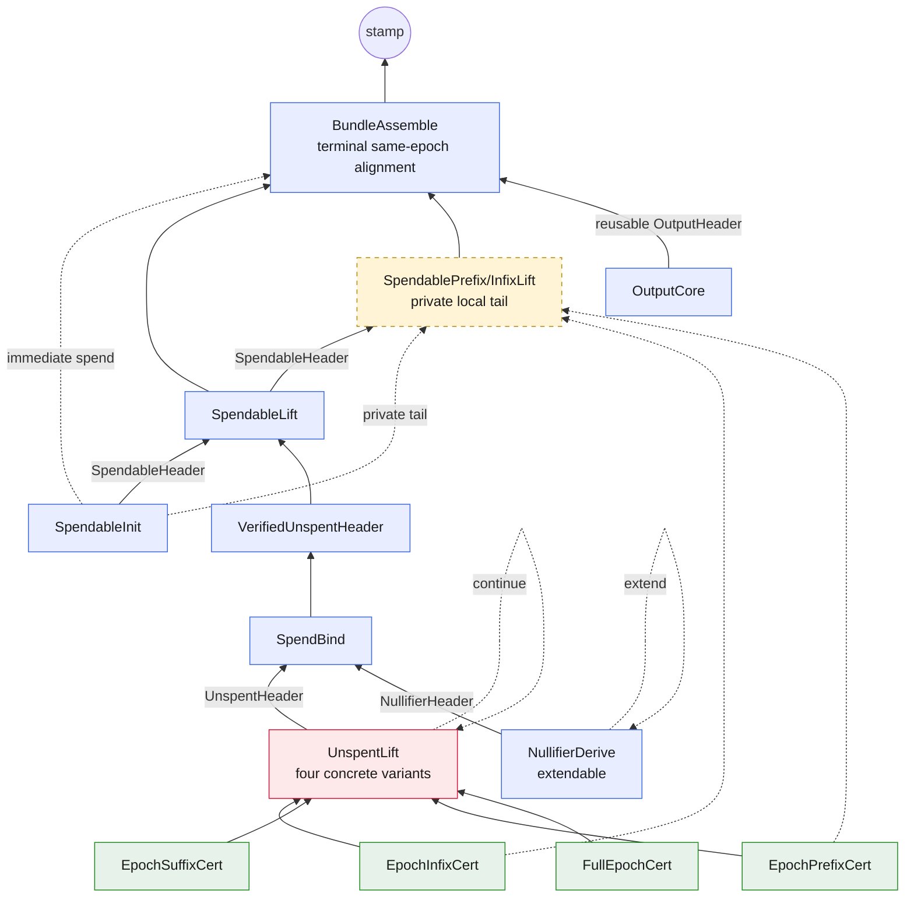
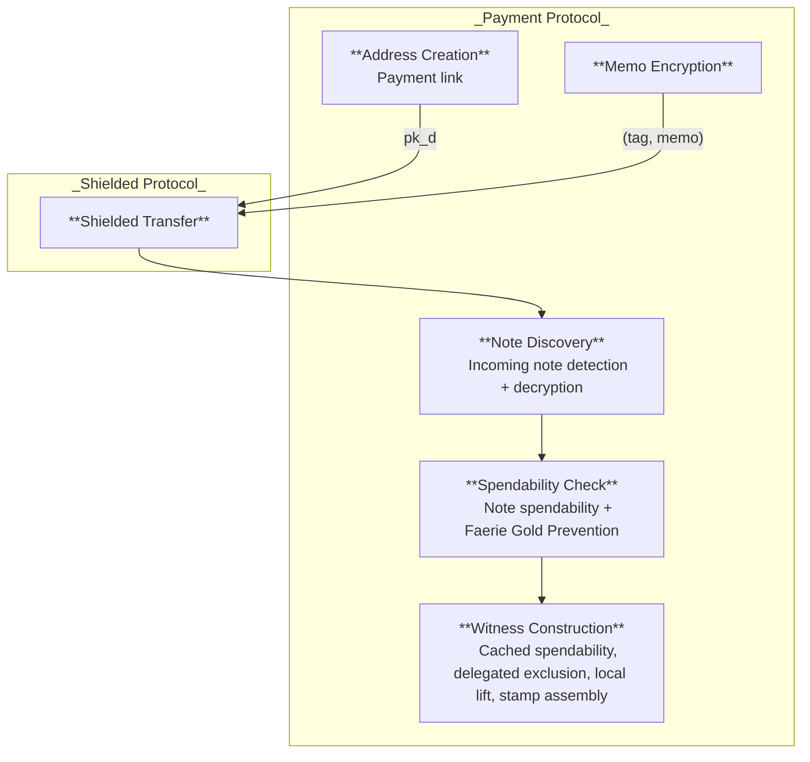

# A Deep Dive on Tachyon

Although Tachyon’s central contribution is its use of prunable nullifiers to
scale Zcash without compromising privacy, we begin from a different vantage point.
Rather than diving directly into how evolving nullifiers work, we first examine a
foundational design decision in Tachyon’s key structure: the separation of concerns across subprotocols that shapes the rest of the system.

The [Zcash Spec](https://zips.z.cash/protocol/protocol.pdf) is most illustrious
for its sedimentary layers of meticulous notations and its evolving key
structures across network upgrades.
We marvel at the sophistication of the key designs, at the laborious effort
behind to strive for efficiency, security, and rich functionalities all at once.
But why such growing complexity? After all, the Sprout upgrade, following the
original [Zerocash](https://eprint.iacr.org/2014/349.pdf), only requires one
payment key and one encryption key.

  

One source of the complexity is the **separation of proof generation and
transaction authorization**. In Zerocash/Sprout, a valid SNARK proof already
ensures rightful ownership, thus no further authorization needed theoretically.
In practice, however, hardware wallets are both resource constrained and vendor
gated to support intensive proof generation. While Sprout can lean on the zero
knowledge of SNARKs to prevent linkability, Sapling spends authorized via
signatures requires *re-randomizable signature* to prevent linkage between
spends from the same owner. This re-randomization manifests through the
*authorization key* $\ak$ in the secret witness and the *randomized authorization
key* $\rk = \ak + [\alpha]\,\G$ in the public instance of the proof.
The spend authorization signature is verified against the publicized $\rk$.

Another reason for the complexity is the **conflation of note ownership
and note transmission**. Since the original Zerocash (inherited in all Zcash
upgrades), the payment address serves *dual* purposes: declaring note ownership
and facilitating transmission of note secrets. The sender of a transaction
needs to securely communicate the output note openings so that they can be spent
later by the recipient. Without assuming secure channels between all users,
Zcash has been transmitting the encrypted memo *in-band* as part of the
transaction, effectively using the blockchain as the public bulletin board.
The payment address, publicized to the sender, contains a *transmission key*
which is the encryption key of a hybrid public key encryption scheme.
Zcash, from Sapling onward, is extra cautious about the privacy leakage in case
of colluding senders under reused transmission keys.
Therefore, *diversified address* is introduced to randomized the transmission
key *while preserving the same incoming viewing key* $\ivk$ for memo decryption
and detecting incoming notes.

Furthermore, **fine-grained disclosure of transaction flows** requires a
distinct *outgoing viewing key* to enable optional viewing of outbound notes.
Viewing keys support selective disclosure of both incoming and outgoing notes,
either to the account holder or to authorized third parties.
This separation also facilitates quantum-safe outgoing viewing keys from day
one, as they are not subject to the address-diversification requirement that
currently ties $\ivk$ to discrete-log–based constructions.

## Decoupling Payment Protocol from Shielded Protocol {#decouple}

A key observation Tachyon makes is that we can **separate the concerns of
spend authorization and note transmission**! This separation appears in the
decoupling of the shielded protocol from the payment protocol. The payment protocol
is responsible for full payment address construction, note transmission, and
selective disclosure capabilities, while the shielded protocol is reduced to the
minimal functionality required to maintain the shielded pool and enforce note
ownership and authorized transfers on-chain.

Informally:

- Shielded protocol: binds every note to an owner for spend authorization
  - Spend authorization requires both valid proof of ownership (proof of
  knowledge on $\nk$) and transaction authorization (signature under $\rk$)
  - Beyond maintaining the shielded pool, the blockchain acts as a data
  availability layer for arbitrary payment-protocol data
- Payment protocol: securely transmits relevant note info to intended recipients
  - Wallets, typically standardized, define the concrete key derivation hierarchy
  needed to satisfy the payment protocol’s functionality and security requirements.
  - Wallets may support multiple payment protocols, such as 
  Payment request ([ZIP-321](https://zips.z.cash/zip-0321)) and
  URI-encapsulated Payments ([ZIP-324](https://zips.z.cash/zip-0324)).

The rationale for this separation becomes clearer when examining the underlying
key material. Of all derived keys, *only two* are strictly necessary for enforcing
note ownership: the nullifier key $\nk$, used to derive nullifiers, and the
authorization key $\ak$, used to derive the randomized spend validation key.
Both are known only to the note owner and supply as secret witnesses in the
SNARK proof.

In Zcash today, a shielded payment address binds together $(\ak, \nk)$ and
additionally includes $\ivk$ for incoming note detection. Tachyon instead
decomposes this structure into a payment key $\pk = \mathsf{Com}(\ak, \nk)$, a
binding commitment to the pair and a *separate* transmission key managed entirely
by the payment protocol. This significantly simplifies the shielded protocol’s
key architecture by removing functionality unrelated to spend authorization.

> Among the main [security properties](https://zcash.github.io/orchard/design/nullifiers.html#security-properties),
> Tachyon shielded protocol needs to uphold Ledger Indistinguishability
> (defined in [Zerocash](https://eprint.iacr.org/2014/349.pdf)),
> Balance, Note Privacy, Note Privacy (OOB), Spend Unlinkability (but attackers access
> restricted to only payment key).
> Full Spend Unlinkability (attacker with $\ivk$ access) and Faerie Resistance are now
> the responsibilities of the payment protocol.
> Security analysis on a more [comprehensive list](https://github.com/daira/zcash-security) of properties is outside our scope.

This separation[^reproduce-orchard] yields several benefits:
a narrower and more manageable scope for shielded pool upgrades,
cleaner isolation of security assumptions for auditing,
greater flexibility in exploring payment protocol designs while preserving a stable
shielded core, and the ability to develop sub-protocols in parallel.
More broadly, we believe this separation of concerns enables Tachyon, and future
post-Tachyon upgrades, to evolve more rapidly while supporting more modular
security analysis.

[^reproduce-orchard]: One way to convince yourself that such separation works is
    to reproduce all of Orchard functionalities in this decoupled framework. We
    leave it as a homework exercise for the readers. 
    As a hint, your diversified address now may look like
    $\mathsf{addr} := (\pkd, \tk)$ where
    $\pkd = \mathsf{Com}(\ak, \nk; \rpk)$ is the diversified payment key,
    $\tk = (d, pk_d)$ is the diversified transmission key.
    Your $\ivk = \mathsf{ToScalar}(\PRF_\sk([9]))$ can now be directly
    derived from master spending key $\sk$, rather than meandering through
    layers of indirect derivation (similarly for outgoing viewing key).

## Shielded Protocol {#shielded}

We incrementally cover the whole Tachyon shielded protocol in this section.

> Note: in practice, all derivation functions (e.g., hash, KDF, XOF, and Derive)
> should be domain-separated;
> we omit this detail here for simplicity of presentation.

### Payment Key {#payment-key}

As explained [above](#decouple), Tachyon shielded protocol only expects an
authorization key $\ak$ from a re-randomizable signature scheme[^redpalla] and
a nullifier key $\nk$. While both keys *should* be derived from a master spending
key as per [ZIP-32](https://zips.z.cash/zip-0032), the concrete derivation path
is specified by wallet standards. The transfer proofs in shielded transaction only
use them directly as secret witnesses to further derive public values including
(randomized) spend validating key $\rk$ and nullifier $\nf$, but never constrain
their derivations. The shielded protocol only mandates that they are
indistinguishable from randomly sampled keys.
    
[^redpalla]: Tachyon sticks with $\mathsf{RedPallas}$, a Schnorr-based signature
    over the Palla curve supporting re-randomization, as in Orchard.
    See our [approach](#pq-rerand) when fully migrating to post-quantum world.

  

The payment key $\pk = \mathsf{Com}(\ak, \nk)$ is the owner field every note
commits to: a binding commitment to the $(\ak, \nk)$ pair. A wallet
mints a fresh address per sender from its master spending key in 
[ZIP-32](https://zips.z.cash/zip-0032)-style.
Instantiated with a hash-based commitment, $\pk$
gives a succinct owner field and
[quantum recoverability](https://zips.z.cash/draft-ecc-quantum-recoverability)
today.
Publicizing $\ak$ directly, a Schnorr verification key, to senders who might have
future access to a quantum computer exposes the user 
["Harvest Now, Decrypt Later"](https://en.wikipedia.org/wiki/Harvest_now%2C_decrypt_later)
risk.

Spend authorization follows the same construction as in Orchard.
The authorization key pair satisfies the DLog relation $\ak = [\ask]\,\G$, and
can be re-randomized into an unlinkable key pair using a randomizer $\alpha\in\F$.
Transactions are signed using the re-randomized signing key $\ask + \alpha$.
The resulting signature is unlinkable to the original spending authority,
while remaining verifiable against the randomized spend validating key $\rk$,
defined as:

$$
\rk = \ak + [\alpha]\,\G = [\ask + \alpha]\,\G
$$

### Note {#note}

A tachyon note is a tuple:

$$
\mathsf{Note}^\mathsf{Tachyon} := (\pk, v, \psi, \rcm)
$$

where $\pk$ is the [payment key](#payment-key), $v$ is the value of the note,
$\psi$ is pseudo-random note identity that binds to the note nullifier value
as an input to its derivation, and $\rcm$ is a random commitment trapdoor[^cm-psi].
In contrast to Sapling/Orchard, the note commitment in Tachyon
$\cm = \mathsf{Com}(\pk, v, \psi; \rcm)$ is purely based on symmetric primitives[^cm].
Thus, Tachyon doesn't require extra enforcement on $\rcm$ derivation on wallets
to achieve quantum recoverability
like [Orchard does](https://x.com/zkDragon/status/2026047830759182672).

[^cm-psi]: Pseudorandom values like $\psi$ and $\rcm$ should be
    deterministically derived from the wallet master key via secure KDF to avoid
    poor operational entropy. The derivation should be standardized.

[^cm]: Sapling and Orchard uses variants of the vector Pedersen commitment,
    which relies on DLog hardness. We choose Sponge-based Hash constructed from
    algebraic permutation Poseidon.
    
### Evolving Nullifier {#nf}

Readers should refer to Sean's 
[post](https://seanbowe.com/blog/tachyon-scaling-zcash-oblivious-synchronization/)
and the [short note [BM25]](https://eprint.iacr.org/2025/2031.pdf) for a
detailed motivation and an overview of Tachyon's evolving nullifiers.

A scaling Zcash produces more note commitments and nullifiers, both accumulating
in the shielded pool. The commitment set grows on disk, but luckily storage is cheap.
The nullifier set becomes the bottleneck: every transaction must check that its
inputs' nullifiers have never appeared before, which forces consensus nodes to
keep the whole set in memory *on the critical path*.
At Visa-level throughput, this nullifier state would grow by an [unattainable
500 GB per day](https://youtu.be/D51JV1ItMGE?si=5i5ByeKYg6fhf7U8&t=201).

Tachyon offloads most of this check to the user. The consensus node retains only
nullifiers from the most recent blocks; the user supplies an *exclusion proof*
attesting that their nullifier does not appear anywhere in the older history.
This proof must be kept current as each new block lands, which Tachyon achieves
incrementally via [proof-carrying data (PCD)](https://tachyon.z.cash/ragu/concepts/pcd).
Since constantly scanning blocks and refreshing proofs is onerous, users can
outsource the task to an *oblivious syncing service (OSS)*. However, updating
an exclusion proof requires knowing the nullifier value, and a nullifier revealed
to the OSS lets it trace the eventual spend of that note — a disastrous
privacy leak. Tachyon resolves this by letting nullifiers **evolve across
epochs**: the value a user shares with the OSS in one epoch is unlinkable to the
value revealed at spend time. This breaks a long-standing Zcash invariant:
each note has only *one* nullifier that is globally unique value in the pool.
As a result, Tachyon requires both a new nullifier derivation and a new
double-spending prevention mechanism.

> **<a id="philosophy">Philosophy:</a> Client-side Validation**
> ([CSV](https://eprint.iacr.org/2025/068)).
>
> Tachyon's scaling approach rests on one principle: move validation off the
> critical path of consensus and onto the client wherever possible. As a
> blockchain scales, the burden on consensus nodes grows along every axis —
> compute, memory, storage, and bandwidth. The remedy is to let the transacting
> client prove its own correctness and leave consensus only cheap verification.
> This principle guides many design decisions beyond our prunable nullifiers.

The ideal functionality for an epoched nullifier is a deterministic function

$$\nf_e = \mathsf{KDF}(\nk, \psi, e)$$

whose outputs are indistinguishable from random bytes. Such an $\nf_e$ binds to
both the spending authority (via $\nk$) and the underlying note (via its
per-note trapdoor $\psi$), while remaining unlinkable across epochs to anyone
without $\nk$.

Circuit efficiency and delegated privacy shape the choice of $\mathsf{KDF}$.
A *constrained PRF* [[BW13]](https://eprint.iacr.org/2013/352.pdf) would let the
wallet hand an OSS an evaluation key for a delegation range, but the [GGM-based
candidate](./ggm.md) has relatively poor circuit efficiency (see its [cost
analysis](./nf-analysis.md#ggm-cost)). After exploring the
[alternatives](./nf-analysis.md), we instead entrust users themselves to derive
and prove their nullifiers. The OSS receives nullifier values and a proclaimed
range without any note-binding evidence: a valid request may equally be a decoy
list unrelated to any note. The user/wallet later binds the returned exclusion
proof to nullifiers derived from the actual note.

The [leading candidate](./nf-analysis.md) evaluates several consecutive
nullifiers with one algebraic permutation:

$$
\nf_e = \mathsf{Poseidon}^\nf.\mathsf{Permute}
(\nk, \psi, \lfloor e/\mathsf{Rate}\rfloor)[e\bmod\mathsf{Rate}].
$$

For example, a wallet may prove the whole permutation block
$[4,8)$ once, while one OSS tests epochs $\{5,6\}$ and another later tests
$\{4,7\}$. Both delegated lists can be checked as subsequences of the same
locally derived range. The local proof may be extended whenever later epochs
become relevant.

> For the remaining presentation, $\nf_e=f_k(e)$ denotes any construction that
> provides efficient batched evaluation and the required semantic security.

#### Ranged Nullifier Commitment {#nf-flow}

Let $\nf_i=f_k(i)$ for $k=\mathsf{KDF}(\nk,\psi)$. A **ranged nullifier
commitment** binds a sequence of epoched nullifiers

$$
[(i,\nf_i)]_{i\in R}
$$

for some epoch range $R$. Its interface provides three properties:

- **Position and value binding.** A committed entry binds both its epoch $i$ and
  its nullifier $\nf_i$.
- **Incremental extension.** The wallet can append newly derived epochs without
  fixing the eventual endpoint or any delegated range in advance.
- **Subsequence checking.** Given commitments to two epoched-nullifier lists,
  the prover can show that every entry in one occurs in the other with the same
  epoch and value. The smaller list need not be a prefix or a contiguous range.

The wallet proves correct derivation of a locally chosen range $R$ and commits
to its epoched nullifiers. The OSS receives opaque pairs $(i,\nf_i)$, proves each
value absent from the assigned portion of epoch $i$'s public history, and commits
to the epoched nullifiers it tested. The wallet then proves that the OSS-tested
list is a subsequence of its locally derived list. This binds the delegated
exclusion proof back to the note without revealing the note or derivation key to
the OSS.

The rest of the protocol may refer only to this interface, keeping the proof
tree independent of the particular commitment scheme. The following concrete
construction realizes that interface.

Let $\nf_i=f_k(i), k=\mathsf{KDF}(\nk,\psi)$
where evaluations outside any revealed set remain computationally
indistinguishable from random. To bind both an epoch position and its value, fix
a *non-cubic residue* $c\in\F$ and encode $(i,v_i)$ as the cubic factor

$$
F_{i,v_i}(X) := ((i+1)\, X + v_i)^3 - c.
$$

The absolute index inside the factor removes the need for an ordered vector
commitment or a mask whose shape is fixed before delegation.

The wallet begins at an arbitrary epoch $r_0$. For a consecutive range
$R=[r_0,r_0+n)$ it derives the corresponding nullifiers and commits to

$$
g_R(X) := \prod_{i\in R} F_{i,\nf_i}(X)
$$

The commitment is incrementally built. Starting from $g_\varnothing(X)=1$,
appending the next epoch gives

$$
\begin{aligned}
g_{n+1}(X) &= g_n(X)\cdot F_{r_0+n,\nf_{r_0+n}}(X) \\
&= g_n(X)\cdot \left( ((r_0+n+1)\, X + \nf_{r_0+n})^3 - c \right)
\end{aligned}
$$

Using Ragu's polynomial oracle[^polyoracle] functionality, we can easily check the
update by identity-testing at a random point.
Importantly, this commitment is naturally extensible without fixing the overall
range or the endpoint in advance.

An OSS receives opaque pairs $(i,\nf_i)$ and proves each $\nf_i$ absent from the
assigned portion of epoch $i$'s public history. It commits to the corresponding
indexed factors for the consecutive range $S=[s_0, s_0+m) \subseteq R$:

$$
g_S(X):=\prod_{i\in S} F_{i,\nf_i}(X)
$$

To bind the delegated work back to the note, the wallet proves that every
OSS-tested $\nf_i$ occurs in its locally derived nullifier list. This
*sub-sequence relation* is enforced via the standard quotient argument: by the
existence of a quotient $q(X)$ such that:

$$
g_R(X)=g_S(X)\cdot q(X).
$$

In fact, this divisibility ensures a general sub-sequence relation: $S$ needs not
to be prefix or even a contiguous sub-range of $R$.

**Soundness sketch.** The binding property of this commitment comes from the
irreducibility of each factor, because for divisibility to imply unique
factorization, we need each factor to be irreducible. Take $Y = (aX + b)$,
$F(Y)=Y^3 - c$ is irreducible over $\F$ because $c$ is chosen to be a non cubic
residue. Setting $a = i+1$ further ensures $a\neq 0$. There is a rare chance of
$F_{a,b}(X)$ not being injective:

$$
\begin{cases}
a_1 = \omega\, a_2 \\
b_1 = \omega\, b_2 \\
\omega^3 = 1
\end{cases}\Longrightarrow
(a_1\,X + b_1)^3 = (a_2\,X + b_2)^3 \quad\text{over }\F_p
$$

But since our epoch range is small $i\in \{0,1\}^{32} \ll F_p$ and the unit cubic
root $\omega$ is very large, such coincidence will never occur. Even though we
didn't explicitly enforce $i$'s range in circuit, we do enforce its increment as
the user or the OSS incrementally builds $g_R(X)$ and $g_S(X)$. Additionally,
an out-of-range $i$ will result in invalid [anchor](#anchor) values in the final
proof; thus indirectly prevented.

#### Nullifier Security {#nf-sec}

We now examine how the evolving nullifier upholds the security properties [carved
out](#decouple) for the shielded protocol. Readers can safely skip this
section and come back later since the analysis refers to concepts introduced
in later sections.

**Balance.** Only the holder of $\nk$ can compute any $\nf_e=f_k(e)$, since
$k=\mathsf{KDF}(\nk,\psi)$ requires it. A spend proof pins both $\nf_e$ and
$\nf_{e+1}$ to a deterministic function of the note and epoch, so a note has
exactly one valid nullifier per epoch and no freedom to mint a fresh value that
dodges a past spend. Double-spending is ruled out by two complementary checks:
the user proves exclusion from authenticated older history, while consensus
checks duplicates in the recent epochs it retains. Publishing both adjacent
nullifiers makes those checks overlap across an epoch boundary.

**Note Privacy.** The adversary is a keyless third party reading the whole
on-chain transaction, including any in-band memo. The shielded footprint, namely
the commitment $\cm$ (hidden by $\rcm$), the spend's revealed nullifiers (pseudorandom
by the semantic security of $f_k$), the rerandomized $\rk$, and the hiding $\cv$,
reveals none of $\pk$, $v$, $\psi$. The in-band memo is payment-protocol data
that the shielded protocol carries opaquely and never parses (committed only to
`da_digest`), so its secrecy rests on the payment protocol's encryption, not on
the shielded core.

**Note Privacy (OOB).** Here the note plaintext travels out of band rather than
as an in-band ciphertext, so the adversary of concern is the sender, who learns
$\pk, v, \psi, \rcm$ but never the recipient's $\nk$. Because every $\nf_e=f_k(e)$
hangs off the nullifier key $k = \mathsf{KDF}(\nk, \psi)$, which cannot be formed
without $\nk$, knowledge of the note plaintext alone does
not let the sender, or anyone it colludes with, recognize the recipient's
eventual spend on chain or link it back to the note it sent.

**Spend Unlinkability.** Across epochs the $\{\nf_e\}$ of a fixed note are
mutually pseudorandom to anyone lacking $\nk$: by the semantic security of
$f_k$, any set of revealed evaluations leaves every evaluation outside it
indistinguishable from random, and this holds even for the pair
$\nf_e, \nf_{e+1}$ revealed together at spend. Delegation is *list-bounded*: an
OSS [delegated](#nf) a set $S$ holds the explicit evaluations
$\{(e, \nf_e)\}_{e \in S}$ and no key material at all, so it can refresh
exclusion proofs for exactly those epochs and predict nothing beyond the list.
It sees the public history segments assigned to it, but not the note commitment,
the user's note-binding proof, or the eventual spend endpoint. Range
standardization, decoys, and local continuation can therefore keep maintenance
and imminent-spend requests in the same cryptographic shape.
And since $k$ binds the per-note $\psi$, a list delegated for one note reveals
nothing about any other note the user owns. To an attacker holding only the on-chain
$\cm$, the spend is unlinkable to it, since the two draw on disjoint randomness
($\rcm$ versus $k$). The stronger flavor of spend unlinkability, under
incoming viewing key access, falls to the payment protocol, since Tachyon's
shielded core has no $\ivk$.

**Faerie-gold via the wallet.** In Orchard, Faerie-gold resistance comes from
binding each new note's $\rho$ to the unique nullifier of an input note.
Tachyon's [tachygram accumulator](#acc) does not assign notes a canonical
position, so the shielded protocol cannot enforce that binding. A malicious
sender could in principle pick colliding $\psi$ values across two notes sent
to the same recipient, where only one of them is spendable. We push detection
to the recipient's wallet: upon receiving a note, the wallet computes the note's
nullifier at a fixed reference epoch and rejects the note if it collides with any
other note it currently holds. Since a wallet's note set is small, the check is cheap;
the knowledge that compliant wallets will reject such collisions is enough to
deter the attack.

### Tachygram Accumulator {#acc}

All shielded pools in Zcash today maintain two separate accumulators:
a note commitment Merkle tree for efficient inclusion proofs and a nullifier
set with constant-time membership queries for exclusion testing.

Tachyon instead uses a single cryptographic accumulator whose members are
encoded as roots of a polynomial, so that both membership and non-membership
tests reduce to a single evaluation query.
Conveniently, Tachyon's PCD proof system natively and cheaply supports
evaluation queries against *online polynomial oracles*[^polyoracle].
Because the accumulator is universal[^universal], it need not distinguish
nullifiers from note commitments: a single accumulator collects
indistinguishable 32-byte blobs, each a **tachygram**, that can be either a
nullifier *or* a commitment.

$$
\tg := \begin{cases}
    \cm = \mathsf{Com}(\pk, v, \psi; \rcm) &\quad\text{in Output actions}\\
    \nf_e = \mathsf{KDF}(\nk, \psi, e) &\quad\text{in Spend actions}
\end{cases}
$$

[^polyoracle]: Ragu PCD proof, through [reduction of
    knowledge](https://eprint.iacr.org/2022/009), reduces down to a list of
    evaluation claims of multiple opening points on multiple polynomials.
    These claims are then
    [folded](https://tachyon.z.cash/ragu/protocol/core/accumulation/pcs.html)
    into a single running aggregated claim.
    Ragu expose the capability to fuse online/application-time polynomial
    queries into the proof system directly, without encoding the evaluation
    through the constraint system which can be expensive.
    This is spiritually similar to
    [lookup argument](https://zcash.github.io/halo2/design/proving-system/lookup.html)
    enforced as part of the PIOP relation rather than through the circuit.
    
[^universal]: In [crypto literature](https://eprint.iacr.org/2018/1188.pdf),
    a universal accumulator is dynamic (supports insertion and removal) and
    supports both membership and non-membership proofs.

The accumulator is the commitment to a polynomial $f^\tg(X)$:

$$
\tgacc = \mathsf{Com}(f^\tg(X)) = \mathsf{Com}( \prod_i{(X - \tg_i)} )
$$

The key properties of this universal accumulator:

- Membership is enforced via $f^\tg(x) = 0$, non-membership via
  $f^\tg(x) \neq 0$. Both tests are insensitive to multiplicity, so this is a
  *multiset* accumulator: a tachygram appearing $m$ times contributes the factor
  $(X - \tg_i)^m$, but a single occurrence already certifies membership.
  - We do not deduplicate. In honest operation every tachygram is a distinct
    pseudorandom blob, so multiplicity exceeds one only with negligible (or
    adversarial) probability; and since (non-)membership ignores multiplicity,
    such cases are harmless. 
  - Consensus nevertheless requires every newly validated tachygram to be distinct
    from both the retained window and earlier tachygrams in the same candidate
    bundle. Consequently every accepted per-epoch accumulator guarantees to have
    a multiplicity of $1$ for all members/roots.
- Members are *unordered*: a multiset commitment, not a vector commitment.
- <a id="union">**Multiset union**</a>
  is polynomial multiplication, yielding a product accumulator
  $f^\tg(X) \cdot g^\tg(X)$ (unconditionally, with no disjointness precondition);
  multiset difference is division, yielding a quotient $\frac{f^\tg(X)}{g^\tg(X)}$
  whenever the divisor is contained, and failing with a remainder otherwise.
  - A union can be tested via $p(r) \iseq f(r) \cdot g(r)$ at a random point
    $r\sample\F$.

We emphasize a subtlety in the security of this polynomial-based accumulator.
Polynomial-commitment binding says that a commitment opens to one polynomial; it
does not say that this polynomial is the accumulator of the claimed tachygrams.
An attacker could instead commit to a polynomial that adds a malicious root or
drops a genuine one, making the corresponding membership test true or false at
will. Tachyon therefore verifies every $\tgacc$ against its published tachygram
list using the technique [below](#acc-correct). The randomized identity test is
sound relative to the PCS degree bound $D$: commitments are fixed before the
challenge, so a false identity passes with probability at most $D/|\F|$.

#### Checking Accumulator Correctness {#acc-correct}

Our goal is to check the correctness of the accumulator value $\tgacc$ given
a public list of $\set{\tg_i}$ *without expensive recomputation*.

The solution is batch verification via a randomized point check.
The verifier samples a random $r\sample\F$ and invokes the PCS evaluation
procedure on the (commitment, point, evaluation) claim $(\tgacc, r, y_r)$, where
$y_r = \prod (r - \tg_i)$ is computed locally.
Naturally, this proof can be made non-interactive with Fiat-Shamir.
Notably, the verifier performs only cheap field operations, avoiding the group
operations that recomputing the commitment would require (for Pedersen, KZG, or
Bulletproof PCS).

### Tachyon Transaction {#tx}

Each block contains one or more transactions. Each transaction has a `txid`,
which commits only to its _effecting data_
([ZIP-244](https://zips.z.cash/zip-0244)) and is therefore the stable,
non-malleable transaction identifier, and a `wtxid`
([ZIP-239](https://zips.z.cash/zip-0239)), which additionally commits to the
malleable authorization data and is the identifier used to relay v5+ transactions
over the p2p network.
Each transaction optionally contains a bundle of transfers from each pool:
JoinSplit for Sprout (soon deprecated), Spend/Output for Sapling, Action for
Orchard, and now Tachyon Action for the new Tachyon pool.

A **Tachyon Action transfer** either spends an old note or creates a new one.
Whether a spend or an output, its *Action description* is uniformly represented
by a pair $(\rk, \cv)$, where $\rk$ is the randomized spend validating key, whose
derivation *binds to the underlying note*, and $\cv$ is a blinding commitment to
the net value (positive for a spend, negative for an output, following the
Sapling/Orchard sign convention).
Unlike Sapling and Orchard, the tachygrams (nullifier or commitment) are left
out of the description, because evolving per-epoch nullifiers are no longer
static. We instead bind the note to $\rk$ through its randomizer $\alpha$:

$$
\begin{cases}
\rk = [\ask + \alpha]\,\G \;\;\text{(spend)}
\qquad
\rk = [\alpha]\,\G \;\;\text{(output)}\\
\alpha = \PRF(\cm \| \theta)  \quad\theta\text{: arbitrary entropy}
\end{cases}
$$

A spend's $\rk$ re-randomizes the custody-held spending authority $\ask$; an
output's carries no authority at all — creating a note requires none, since the
binding signature already enforces that outputs are funded. An output's signing
key is thus just $\alpha$, so a hot device can sign outputs without a custody
round-trip; only spends need the custody-held $\ask$. Both forms of $\rk$ are
uniformly random points, indistinguishable on chain.

The Tachyon bundle inside a transaction carries a sequence of Action
descriptions together with the net balance of all action transfers
$v^{\mathsf{bal}} = \sum_{\mathsf{spends}} v - \sum_{\mathsf{outputs}} v$,
positive when value leaves the shielded pool, matching the `valueBalance`
convention of Sapling/Orchard and keeping the ZIP-209 pool-turnstile accounting
uniform across pools. The balance is proven by a *binding signature*
$\sigma^{\mathsf{bind}}$ as in Sapling/Orchard.

Recall: How binding signature works.

The net value commitment $\cv$ in every action description is Pedersen-committed:

$$
\cv = [v]\,\G + [\rcv]\,\H
$$

where $\rcv$ is the blinding factor and $\H$ is an independent group generator.
(Both value-commitment bases are independent of the spend-authorization base
behind $\rk$; in practice Tachyon reuses Orchard's `ValueCommit` generators.)

By the homomorphic property of Pedersen commitments, the verifier can sum the
$\cv$ in a bundle to obtain $\sum_i{\cv_i}$, itself a blinding commitment to the
net balance $v^\mathsf{bal}$ with blinding factor $\bsk = \sum_i{\rcv_i}$:

$$
\sum_i{\cv_i} = [\sum_i{v_i}]\,\G + [\sum_i{\rcv_i}]\,\H
= [v^\mathsf{bal}]\,\G + [\bsk]\,\H.
$$

To verify the net balance, the validator reconstructs a discrete-log public key

$$
\bvk = \sum_i{\cv_i} - [v^\mathsf{bal}]\,\G,
$$

and then verifies a Schnorr signature $\sigma^\mathsf{bind}$ produced under
$\bsk$. Effectively, the signature serves as a proof of knowledge of the secret
scalar $\bsk$ behind the public key $\bvk$.

Before describing the stamp, we name a recurring object it relies on: the
**spendability proof**. It establishes two historical
facts about a spent note: its commitment appeared in a stamp included in a
finalized block (*inclusion*), and its epoch-specific nullifier remained absent
afterward (*exclusion*). Since old tachygrams are pruned from the live pool, these
facts are proven against authenticated [anchor-chain](#anchor) history.

Once the creation block is finalized, the wallet may initialize and cache the
spendability proof as updatable PCD, making the note immediately spendable. A
same-epoch spend can use this proof directly without exclusion evidence. For a
later-epoch spend, the wallet advances the cached proof to a newer anchor by
folding authenticated exclusion evidence into it.

A **Tachyon Stamp** provides a PCD proof that every action in the bundle is
valid and that the published tachygrams and accumulator match those actions.
Its public inputs are the bundle's Action descriptions, a set of tachygrams
$\set{\tg_i}$, their accumulator $\tgacc$, and a target $\anchor$
in the [anchor chain](#anchor). The target epoch is implied by that anchor.
Alternatively, the stamp holds a `wtxid` reference to another transaction whose
stamp carries an aggregated PCD proof and the corresponding public inputs.
The accumulator is included to spare miners from recomputing it over all
tachygrams; instead, the correctness of $\tgacc$ is proven using the
[batched verification trick](#acc-correct).
The PCD construction supports aggregating finished bundle proofs: a new
aggregated transaction will be created whose stamp contains the union of
tachygrams, the accumulator of that union, the common anchor, and an aggregated
PCD proof. The stamps of all constituent transactions are replaced by a
reference to the aggregated transaction's `wtxid`.

> Note: an aggregated Tachyon bundle shares exactly the same format as a normal
> standalone bundle (a.k.a. a _Tachyon autonome_), and may even carry additional
> Action descriptions of its own. A purely aggregating bundle, by contrast,
> carries an empty Action list (hence no authorization signatures), a zero value
> balance, a trivial binding signature, and a stamp holding the aggregated proof
> and its proof data.
>
> The balance check and authorization signature verification (including the
> `SIGHASH` computation) are identical for every bundle, aggregated or standalone.
> The only difference is proof verification: an aggregated bundle verifies against
> the single stamp of the aggregated transaction, so its cost is amortized across
> all constituents and thus economically incentivized.

Importantly, each Action description is **associated with two tachygrams**, a
consequence of the evolving nullifiers. If a user proves only the nullifier
$\nf_e$ for the current epoch $e$, the epoch may advance to $e+1$ before the
transaction is picked up from the mempool. Since neither miners nor the OSS—the
latter responsible only for syncing past epochs, and never learning future
nullifiers, least of all at spend time—can unilaterally update the proof, the
transaction goes stale and requires further user input to refresh. This is poor
UX and a potential timing side-channel that leaks privacy. We therefore require
every spend action to reveal (and prove in circuit) the nullifiers for **both the
current and the next epoch**, leaving an ample buffer against this cross-epoch
race. To keep spend and output actions indistinguishable, we further require each
output action to publish a dummy tachygram alongside its note commitment, so
every action uniformly carries two.[^padding]

[^padding]: Without the dummy, a spend would carry two tachygrams and an output
    one. A bundle already reveals its action count $n$ (one authorization
    signature per action), so the tachygram count $t$ would give away the
    split: $s = t - n$ spends and $o = 2n - t$ outputs. Padding fixes $t = 2n$
    identically, hiding the split. The leak without padding is only *arity*:
    tachygrams ride in the stamp as one flat multiset, so *which* action is a
    spend is never visible either way.

All non-malleable parts, collectively the *effecting data*, hash into a stable
identifier `txid`: a bundle commitment from each pool and their value balance
$v^{\mathsf{bal}}$. In-band memos count as effecting data in the legacy pools,
and they remain so in the Tachyon pool, entering `txid` through the `da_digest`
described below.
The Tachyon bundle commitment $\actacc$ is an order-committing,
personalized hash over the Action descriptions in wire order:

$$
\actacc = H\bigl( (\cv_1, \rk_1) \,\|\, (\cv_2, \rk_2) \,\|\, \ldots \,\|\, (\cv_n, \rk_n) \bigr)
$$

A plain hash suffices here: `txid` needs no algebraic structure, and committing
to the wire order (as ZIP-244 digests do) keeps `txid` in one-to-one
correspondence with the serialized effecting data.[^actacc]

[^actacc]: An earlier draft realized $\actacc$ as a polynomial accumulator
    $\mathsf{Com}(\prod_i(X - a_i))$ with $a_i = H(\cv_i, \rk_i)$, mirroring the
    tachygram accumulator. That algebraic form is only needed where a *proof*
    consumes the action set; for a transaction identifier it buys nothing and
    drags group operations into `txid` derivation.

All mutable parts (orange in the diagram) commit only to the `auth_digest`, and
hence transitively to `wtxid = txid || auth_digest`; only the stable parts
(green in the diagram) contribute to `txid`.

Specifically,

- `da_digest` commits to the (optional) memo bytes, which the Tachyon pool
carries as an opaque DA blob: unconstrained, never parsed or interpreted by the
shielded protocol.
- `txid` commits to $(\actacc \| v^\mathsf{bal} \| \mathsf{da\_digest})$.
- `auth_digest` commits to $(\set{\sigma^\mathsf{act}}, \sigma^\mathsf{bind}, \mathsf{stamp})$.

Keeping the memo payload inside the effecting data is what makes it
tamper-proof. Authorizing data is malleable by definition, and Tachyon relayers
rewrite it in flight: aggregation replaces a transaction's stamp, and with it
`auth_digest` and `wtxid`. With `da_digest` inside `txid`, tampering becomes
detectable: every authorization signature signs over it through the `SIGHASH`,
so altering the DA bytes yields a different transaction whose signatures no
longer verify. ZIP-244 makes the same choice for the legacy pools by hashing
their in-band memo ciphertexts into `txid`.

Finally, the Tachyon bundle carries a spend authorization signature for every
Action description, each signed over the `SIGHASH`, which commits to the same
transaction-wide effecting data (across all pools) used to derive `txid`[^txid-sighash].
Block space can additionally serve as a data-availability layer for arbitrary
payment-protocol data used in note transmission; the shielded protocol neither
interprets this data nor checks its correctness. As explained [later](#payment),
the payment protocol Tachyon targets distributes the recipient's KEM encapsulation
key out of band through the [address](#address), and carries a KEM ciphertext
in-band only on rare first-contact transactions (ordinary payments carry none), so
the in-band footprint stays small. The scheme is quantum-safe from day one and
leaves the format unchanged even through a full [quantum upgrade](#pq).

[^txid-sighash]: `txid` and `SIGHASH` are domain-separated with different
    personalization strings, but they commit to the same effecting data.
    `SIGHASH` further incorporates a *SIGHASH type* byte, the `nConsensusBranchId`
    network-version identifier (e.g., NU5, NU6), and other consensus-level metadata.

### Anchor Chain {#anchor}

An anchor chain is a hash chain whose updates absorb **per-stamp**
[tachygram-accumulator](#acc) commitments. Every stamp carries a $\tgacc$ committing to the
tachygrams it introduces: those of a single bundle for a standalone transaction
(a *Tachyon autonome*), or the union across many for an [aggregate](#tx).
Each chain state $\anchor$ is an **anchor**; $\tgacc$ is not an anchor, but an
input committed into the next one.
A stamp in consensus epoch $i$ extends the chain as

$$
\anchor \leftarrow H(\anchor_{\mathsf{old}} \;\|\; i \;\|\; \tgacc)
$$

Binding $i$ at every tick lets a proof authenticate the epoch containing each
anchor-chain segment without relying on external validation.

At the transition into every epoch $i$, consensus appends exactly one
domain-separated **epoch sentinel**, after all stamps of epoch $i-1$:

$$
\sntl_i = H^{\mathsf{epoch}}(\anchor_{i-1,\mathsf{end}}\;\|\;i).
$$

Here $\anchor_{i-1,\mathsf{end}}$ is the final anchor-chain state before the
transition; for an epoch with no stamps, it is simply $\sntl_{i-1}$.
This is an ordinary update of the anchor-chain state already carried by every
block header, not a new header field: the terminal block of epoch $i-1$ commits
to $\sntl_i$ after processing its stamps and the transition. By convention,
**the sentinel for epoch $i$ always means its first anchor $\sntl_i$**. Epoch
$i$ therefore spans $\sntl_i$ to $\sntl_{i+1}$. Every transition has a sentinel,
so even an empty epoch has two distinct, authenticated boundaries. For epoch
zero, the genesis anchor-chain state replaces $\anchor_{-1,\mathsf{end}}$.

Every canonical anchor therefore determines a unique epoch: $\sntl_i$ and all
ordinary anchors after it but before $\sntl_{i+1}$ belong to epoch $i$. We write
$\mathsf{Epoch}(\anchor)$ for this value and assume validator implements this
map efficiently.

  

The chain therefore advances at *sub-block, above-transaction* granularity: in a
block of transactions with all standalone Tachyon bundles it ticks once per
transaction. A published stamp carries a target anchor $\anchor$. As with
Orchard anchors today, validators maintain the (unpruned) anchor chain and are
responsible for validating the stamp's $\anchor$ against the canonical history.
When consensus accepts the stamp, its $\tgacc$ is absorbed into the current state
to produce the next anchor.

Why anchor *per-stamp rather than per-block*, when the block is the unit of
consensus finality? The primary justification is that it minimizes validator
work, in alignment with our [philosophy](#philosophy). Each stamp already ships a
$\tgacc$ whose correctness is [batch-verified in circuit](#acc-correct), so a
validator merely hashes it into the chain. A per-block anchor would instead force
every validator to rebuild a block-wide accumulator from scratch: re-accumulating
every tachygram in the block, interpolating the product polynomial, and
committing it which involves an expensive multi-scalar multiplication for some PCS
choices.

Per-stamp cadence also raises concerns about the cost of generating exclusion
proofs. To prove $\nf_e$ never appeared in epoch $e$, a user could naively show
$f^\tg(\nf_e) \neq 0$ against the accumulator of *every* stamp folded into the
chain that epoch. Instead, we leverage the [multiset union](#union) operation
on our accumulator polynomials to collapse the per-stamp checks into one.
The product of all stamp polynomials in an epoch is itself an accumulator over
all tachygrams of that epoch — the <a id="epoch-acc">*epoch accumulator*</a> $e(X)$:

$$
\underbrace{\circ \overset{f^\tg_1(X)}{\longrightarrow} \circ
\overset{f^\tg_2(X)}{\longrightarrow} \circ \overset{\ldots}{\longrightarrow} \circ}
_{\text{entire epoch: } e(X) = \prod_i{f^\tg_i(X)}}
$$

and $\nf_e$ is absent from the epoch exactly when $e(\nf_e) \neq 0$. Anyone
(typically an OSS) can prove that $e(X)$ is the correct product of the per-stamp
polynomials $f_i^\tg(X)$ whose commitments
$\tgacc_i=\mathsf{Com}(f_i^\tg(X))$ were absorbed into the anchor chain, by showing
$e(r) \iseq \prod_i{f^\tg_i(r)}$ using the proof system's cheap polynomial-oracle
queries[^polyoracle]. Since the queries are served natively by the folding scheme
and not through a step circuit, $e(X)$ may have degree as large as the SRS of the PCS
allows, independent of any per-PCD-step-circuit size limit. Admittedly, the prover
cost is still linear in the epoch's stamp count, but it is paid *once* and then
**amortized**. The epoch accumulator $e(X)$, carrying its correctness proof, can
now be reused by every unspent note to directly test the exclusion of their
epoched nullifiers.

Sentinel transitions absorb no tachygram-accumulator commitment and therefore
contribute no factor to $e(X)$. For an empty epoch $i$, $e_i(X)=1$; the distinct
endpoint anchors $\sntl_i,\sntl_{i+1}$ still certify that the whole epoch was
traversed.

This removes the per-stamp checks, but $e(X)$ still has degree linear in the
total number of tachygrams in the epoch $N$. We now present an optimization
trick that reduces the amortized per-nullifier cost to strictly sublinear.

#### Quadratic Residue Filters {#qr-trick}

> This subsection is an optional optimization. The base protocol can test the
> exact accumulator of each history segment directly; QR filtering only reduces
> the cost of large full-epoch segments.

Our goal: let a user prove non-membership of $\nf_e$ over an *entire epoch* at
cost logarithmic in $N$, the number of tachygrams that epoch.

The idea is **bucketing**. Suppose we sort every tachygram into one of $2^k$
buckets by a rule that (i) a nullifier can cheaply prove it follows and (ii)
splits the field evenly. Then $\nf_e$ falls into exactly one bucket, and it can

only ever collide with the tachygrams sharing that bucket. Thus, non-membership
across the whole epoch collapses to non-membership against a *single* bucket's
accumulator, holding only $\approx N/2^k$ entries. Taking $k = \log N - \log\log N$
shrinks each bucket to $\approx \log N$ entries while keeping the query $O(\log N)$.
Quadratic residues give us exactly such a rule.

**A number theory detour.** Over a prime field $\F$, the nonzero elements split
perfectly in half: the *quadratic residues* ($\QR$) and the *non-residues* ($\NQR$).
Both classes are cheap to test in-circuit:

- $x \in \QR$: supply the root $y$ as advice; one constraint $y^2 = x$.
- $x \in \NQR$: fix a public non-residue $c$ and supply $y$ with $y^2 = cx$,
  since multiplying by a non-residue flips the class:

$$
\begin{cases}
x\in\QR \iff c\cdot x \in\NQR \\
x\in\NQR \iff c\cdot x \in\QR
\end{cases}
$$

A **QR filter** is one such split with a random offset: draw $R \sample \F$ and
classify $x$ by whether $x + R$ is a square, assigning the exceptional value
$x+R=0$ to the residue side. A random offset cuts any fixed epoch set roughly in
half, and $k$ independent offsets $R_1, \ldots, R_k$ tag every element with a
$k$-bit **QR profile** $\v{b} = (b_1, \ldots, b_k) \in \{0,1\}^k$, where $b_j=1$
iff $x+R_j$ is a square (written $x\in\QR_{R_j}$), including zero, and $b_j=0$
otherwise. The $k$ filters together sort the field into $2^k$ disjoint buckets
of roughly equal expected size.

<a id="batch-qr">**Batched QR Test.**</a> Given the square-free vanishing
polynomial $f(X)=\prod_i{(X-x_i)}$, we can batch-test that all roots are QR,
namely $\forall x_i\in\QR$, as follows. Canonical epoch accumulators are
square-free by the [consensus uniqueness rule](#consensus-rule).
"Square-free" here means the multiplicity of each root is $1$, namely no repeated
or duplicated $x_i$.

- Prover interpolates all QR pairs $(x_i, y_i)$ into a polynomial $g(X)$ where
$g(x_i) = y_i$ and $x_i = y_i^2$
- Prover computes $h(X)=\frac{g(X)^2 - X}{f(X)}$ and sends commitments to $g(X)$
and $h(X)$ to the Verifier
  - Observe that the numerator $g(X)^2 - X$ vanishes over all $x_i$ (since
  $g(x_i)^2 = y_i^2 = x_i$), so $f(X)$ perfectly divides the numerator
- Verifier samples a random $r\sample\F$, and test: $g(r)^2 - r \iseq f(r)\cdot h(r)$

For an offset $R_j$, the corresponding identities replace $X$ by $X+R_j$.
A residue sibling checks $g(X)^2-(X+R_j)=f(X)h(X)$. A non-residue sibling checks
$g(X)^2-c(X+R_j)=f(X)h(X)$ and additionally interpolates the inverses into
$z(X)$ and checks $(X+R_j)z(X)-1=f(X)q(X)$. The latter excludes zero from the
non-residue side.

**Building the buckets (once, by the OSS).** Fix
$R_1,\ldots,R_k\sample\F$ as transparent system parameters. Conceptually, the
buckets are the leaves of a binary tree built by recursively splitting the epoch
accumulator by each filter. Splitting
$e(X) = \prod_{j=1}^N (X - \tg_j)$ by $R_1$ gives

$$
\begin{cases}
q_0(X) = \prod_{\tg_i\in\NQR_{R_1}}{(X - \tg_i)}\\
q_1(X) = \prod_{\tg_i\in\QR_{R_1}}{(X - \tg_i)}\\
e(X) = q_0(X) \cdot q_1(X)
\end{cases}
$$

so $q_1$ gathers the tachygrams passing the $R_1$ filter and $q_0$ its
complement; bisecting each by $R_2$ gives four, and so on:

$$
\begin{cases}
q_{00}(X) = \prod_{\tg_i\in\NQR_{R_2} \,\cap\, \NQR_{R_1}}{(X - \tg_i)}\\
q_{10}(X) = \prod_{\tg_i\in\QR_{R_2} \,\cap\, \NQR_{R_1}}{(X - \tg_i)}\\
q_0(X) = q_{00}(X) \cdot q_{10}(X)
\end{cases}
\quad
\begin{cases}
q_{01}(X) = \prod_{\tg_i\in\NQR_{R_2} \,\cap\, \QR_{R_1}}{(X - \tg_i)}\\
q_{11}(X) = \prod_{\tg_i\in\QR_{R_2} \,\cap\, \QR_{R_1}}{(X - \tg_i)}\\
q_1(X) = q_{01}(X) \cdot q_{11}(X)
\end{cases}
$$

After $k$ filters we reach $2^k$ leaves, where leaf $q_{\v{b}}(X)$ holds exactly
the tachygrams of profile $\v{b}$.

In practice the OSS never splits top-down. It keeps the $2^k$ bucket accumulators
live and streams tachygrams into them: as each new stamp lands, it computes the
tachygram's profile $\v{b}$ and folds $(X-\tg)$ into the matching leaf
$q_{\v{b}}$. Internal product nodes are formed bottom-up only when a
decomposition proof calls for them. Maintaining the buckets costs $O(kN)$
profile work and linear-factor insertions, amortized over all users and all
nullifiers.

  

With the buckets maintained, a user proves $\nf_e$ absent from the *entire epoch*
in three parts:

1. **Profile.** Compute $\nf_e$'s QR profile $\v{b}$ ($k$ squaring constraints)
   pinning down the single leaf $q_{\v{b}}$ it could possibly belong to.
2. **Leaf non-membership.** Test $q_{\v{b}}(\nf_e) \neq 0$ against that one leaf,
   of expected degree $N/2^k$.
3. **Path decomposition.** Certify that $q_{\v{b}}$ is genuinely the
   profile-$\v{b}$ bucket of the epoch accumulator $e(X)$, by walking the
   root-to-leaf path and checking, at each level $j$, two things:
   - *product relation*: the on-path parent equals the product of its two children,
   tested at a random point as in the [accumulator correctness check](#acc-correct);
   - *sibling QR purity*: the *off-path* sibling is pure in its QR class with
     respect to $R_j$, using the shifted [batched QR identities](#batch-qr)
     above.[^sibling]

[^sibling]: Why the sibling test, and why only one per level? The product checks
    alone are not enough: a cheating OSS could hide a tachygram equal to $\nf_e$
    by misfiling it into the *sibling* subtree, leaving the user's leaf test to
    wrongly report absence. Sibling purity shuts this down. If the off-path
    sibling provably holds only elements of the opposite class at level $j$, then
    every on-path-class element of the parent is forced into the on-path child —
    it has nowhere else to go. Chaining this down all $k$ levels pins every
    profile-$\v{b}$ element of $e(X)$, in particular any occurrence of $\nf_e$,
    into the leaf $q_{\v{b}}$. Hence $e(\nf_e) = 0 \iff q_{\v{b}}(\nf_e) = 0$, and
    a passing leaf test certifies epoch-wide exclusion. Constraining only the
    sibling is enough: purity of the off-path side already captures all
    on-path-class elements, and a stray wrong-class element that leaks *into* the
    on-path child can at worst make an honest exclusion proof fail (a false
    positive), never admit a double-spend (a false negative).

The decomposition certifies $q_{\v{b}}$ only *relative to* $e(X)$. Full soundness also
needs $e(X)$ to be canonical: the correct product of the per-stamp accumulator
polynomials whose commitments $\tgacc_i$ were absorbed into the anchor chain.
That is the separate [epoch-accumulator correctness](#epoch-acc) proof from above.

**Cost.** Each level adds one product check and one batched QR test, each settled
by $O(1)$ random-point evaluations, so the path is $O(k)$; the leaf test adds work
proportional to its degree $N/2^k$. Setting $2^k = N/\log N$, i.e.
$k = \log N - \log\log N$, balances the two — leaves hold $\approx \log N$
tachygrams and the path is $\approx \log N$ levels deep — for an $O(\log N)$
per-nullifier proof, strictly sublinear. (Pushing $k$ all the way to $\log N$
would shrink leaves to $O(1)$, but the $O(k)$ path cost still dominates at
$O(\log N)$ while the bucket count doubles, so nothing is gained.) This
per-nullifier cost sits *on top of* the OSS's one-time epoch work: maintaining the
buckets ($O(kN)$) and proving $e(X)$ canonical. Both the path-decomposition proofs
(shared by everyone whose nullifier lands in the same bucket) and the $e(X)$
proof (shared by all) are paid once and amortized across the epoch.

### Transaction Life Cycle {#txflow}

The wallet maintains one renewable spendability proof per unspent note. It binds
the note's action description and active nullifier pair to an authenticated
anchor, while remembering the note's original inclusion and every exclusion
segment proven since. Extending this one proof advances inclusion ancestry and
unspent history together.

The flow is as follows:

1. **Initialize as soon as the note is usable.** Once the creation block is
   finalized, the wallet proves that the note commitment belongs to its creation
   stamp, authenticates the remainder of that block, and proves the complete
   ownership, value, and authorization relation. If the resulting anchor is in
   epoch $e$, the proof exposes $(\nf_e,\nf_{e+1})$. No exclusion proof or OSS
   response is required, and the result can immediately support a same-epoch
   spend.

2. **Derive nullifiers and prove exclusion in parallel.** As epochs become
   relevant, the wallet locally derives epoched nullifiers and commits to them
   using an extensible [ranged nullifier commitment](#nf-flow). In parallel, it
   may give one or more OSSs opaque $(i,\nf_i)$ lists and authenticated history
   intervals. The OSS proves each supplied nullifier absent from its assigned
   interval and commits to the epoched nullifiers it tested. This exclusion
   proof is note-independent: the request carries neither $\cm$ nor a user
   proof, so maintenance, an imminent spend, and a decoy have the same
   cryptographic shape.

3. **Bind and advance.** The wallet proves that the epoched nullifiers tested by
   the OSS form a subsequence of its locally derived range, binds the result to
   the same note as the cached spendability proof, and checks that the proved
   interval starts at the cached anchor. It then advances the proof to the
   interval's end and derives the nullifier pair for that endpoint's epoch.

   A client may apply adjacent OSS responses sequentially, which already
   combines work from multiple OSSs. It may also perform the entire update
   locally. In particular, the wallet can privately extend a short distance
   beyond the OSS endpoint, immediately testing the active nullifier against
   that additional history so the resulting proof remains renewable.

4. **Generate a stamp.** Output proofs are independent of historical anchors and
   can be reused. The wallet combines them with its spend proofs at one target
   anchor. If several spends begin at different anchors in the target epoch, it
   proves their ancestry to the common target without treating that terminal
   adjustment as renewable maintenance; consensus's live window covers the
   target epoch. A single newly included spend can use its inclusion anchor
   directly, giving the shortest path from inclusion proof to stamp.

   The bundle accumulator collects *two tachygrams per action*:
   $(\nf_e,\nf_{e+1})$ for a spend and $(\cm,\tg_\bot)$ for an output. The result
   is the [Tachyon stamp](#tx), with public input
   $(\{(\cv_i,\rk_i)\},\{\tg_i\},\tgacc,\anchor)$.
   Revealing both adjacent nullifiers protects the transaction against the
   [cross-epoch race](#race) while it waits in the mempool.

5. **Authorize and bind.** Concurrent to the proving path above,
the wallet assembles the transaction body, computes the [`SIGHASH`](#tx) over
the effecting data, and produces:
    - an authorization signature for every action, verifiable against its
    published $\rk$: spends sign under the [re-randomized key](#payment-key)
    $\ask + \alpha$ (a custody round-trip), outputs under the bare randomizer
    $\alpha$ (no authority needed, signable by the hot device);
    - the net value balance $v^\mathsf{bal}$ and a single [binding signature](#tx)
    $\sigma^\mathsf{bind}$ over the value commitments.

6. **Mempool and aggregation.** The finished transaction enters the mempool as a
standalone *Tachyon autonome*. A miner or another aggregator may then lift
several stamps whose anchors lie in the same epoch to a common later anchor,
take the
[multiset union](#union) of their tachygrams and accumulators, and produce one
aggregated PCD proof. Each constituent's stamp is replaced by a reference to the
aggregate transaction's `wtxid`, moving the tachygrams, anchor, and proof
onto the aggregate.

#### Consensus Validation {#consensus-rule}

Of the consensus rules, the bundle balance check and authorization-signature
validation are unchanged from Orchard; only stamp verification is new.

**Stamp verification.** Given the published tachygrams $\set{\tg_i}$, accumulator
$\tgacc$, and $\anchor$, the validator:

1. checks that the target $\anchor$ occurs in canonical finalized history and
   obtains $e=\mathsf{Epoch}(\anchor)$;
2. confirms $e$ is either the current or the preceding epoch:
   $e = e_\mathsf{cur} \lor e = e_\mathsf{cur} - 1$; and
3. verifies the stamp's PCD proof against
   $(\set{(\cv_i,\rk_i)},\set{\tg_i},\tgacc,\anchor)$. The proof enforces
   $\tgacc$'s consistency with the published $\set{\tg_i}$ (the
   [batched check](#acc-correct)), the integrity of the revealed nullifiers and
   output commitments, and the finalized inclusion and required past exclusion
   of every spent note.

A stamp's proof is bound to its public target $\anchor$, whose canonical
position determines epoch $e$. Each
renewable spendability proof establishes immediate exclusion through its cached
anchor; stamp construction may then authenticate a later target in the same
epoch. Consensus checks that terminal interval, and indeed the whole live epoch,
through its duplicate window. A strict rule would accept the stamp only while
the chain is still in $e$,
forcing a refresh the instant the epoch advances. Tachyon *relaxes* this
(step 1 above): a proof for $e$ is accepted while the chain tip is in epoch $e$
*or* $e+1$. The stamp may therefore lag the chain by one epoch, so a transaction
that drifts across an epoch boundary while waiting in the mempool stays valid.

**Consensus window (new double-spend rule).**
To close the interval from each spendable source anchor through the block that
includes the stamp,
consensus enforces a live duplicate check spanning **the current and preceding
epochs**. Validators hold the tachygrams of the two most recent epochs in memory
and process a candidate bundle's tachygrams in deterministic order, checking and
inserting each before checking the next. A tachygram therefore conflicts with
the retained window, an earlier bundle in the block, or an earlier tachygram in
the same bundle. The window is two epochs wide exactly because the stamp proof
may be one epoch stale.

Relaxed freshness does *not* weaken soundness, because each spend publishes the
pair $(\nf_e, \nf_{e+1})$. Whichever of the two permitted epochs accepts the
stamp, the pair already contains that epoch's nullifier:

- accepted in $e$: the window covers $\set{e-1, e}$ and $\nf_e$ is the active
  nullifier. A double-spend of the same note must publish the same $\nf_e$ and
  collide; so does a prior spend back in $e-1$ that carried $\nf_e$ as its
  next-epoch nullifier.
- accepted in $e+1$: the window covers $\set{e, e+1}$ and $\nf_{e+1}$ is the active
  nullifier, catching any competitor targeting $e+1$. A double-spend made in epoch
  $e$ is caught too, since its $\nf_e$ also falls in the window.

**Standalone vs. aggregated.** Balance, authorization, and the tachygram-window
check run per constituent bundle in both cases; only the stamp proof differs. A
standalone autonome is verified against its own stamp, whereas the constituents of
an aggregated bundle have had their stamps stripped and replaced
by a reference, so one PCD proof stands in for the whole batch and amortizes
verification across it.

### Proof Tree {#prooftree}

Before choosing any recursive steps, we state the relations that a finished
Output, Spend, and bundle must satisfy. These statements describe the protocol
itself and do not depend on how work is divided between the wallet, an OSS, or
the eventual PCD circuits. We then give one recursive realization that preserves
them while supporting cached and delegated work.

#### Action Statements {#statement}

We give the three monolithic statements an action's proof must satisfy: the
per-action statements ([Output](#output) or [Spend](#spend)), and the
[bundle-level](#bundle) statement that composes them. These are end-to-end
relations rather than descriptions of intermediate proof objects; their
recursive realization follows afterward.

<a id="output">**Output Action Statement**</a>

A valid instance of an *Output Action statement* assures that, given the public
input:

- $\cv$: net value commitment;
- $\rk$: randomized action validation key, carrying no spend authority;
- $\cm$: the output note commitment, published as a tachygram; and
- $\tg_\bot$: a dummy tachygram, so an output reveals two tachygrams,
  [indistinguishable](#race) from a spend's nullifier pair,

the prover knows the secret witness:

- $\mathsf{Note}:=(\pk,v,\psi,\rcm)$: note opening, where $\pk$ is the
  recipient's payment key taken from their address;
- $r_\bot$: an arbitrary preimage for the dummy tachygram; and
- the randomizers $\theta,\rcv$,

such that the following conditions hold:

- **Value commitment integrity**: $\cv=[-v]\G+[\rcv]\H$, committing the
  negated created value (value entering the pool counts negatively toward
  $v^\mathsf{bal}$, per the [sign convention](#tx)).
- **Value range**: $0\leq v\leq v_\mathsf{max}$ in-circuit, with
  $v_\mathsf{max}=2.1\times10^{15}$ zatoshi (`MAX_MONEY`): non-negative as in
  Ironwood; zero-value outputs are legal (e.g., carrying a memo with no
  payment), while the upper bound keeps balance arithmetic overflow-free.
- **Note commitment integrity**:
  $\cm=\mathsf{Com}(\pk,v,\psi;\rcm)$, so the published commitment opens to
  this note.
- **Dummy tachygram integrity**: $\tg_\bot=H^{\cm_\bot}(r_\bot)$, where
  $H^{\cm_\bot}$ is a domain-separated hash reserved for dummy commitments.
- **Nonzero tachygrams**: $\cm\neq0$ and $\tg_\bot\neq0$.[^nonzero]
- **Authorization**: $\alpha=\PRF(\cm\parallel\theta)$ and
  $\rk=[\alpha]\G$, binding the validation key to the output note. The signing
  key behind $\rk$ is $\alpha$ itself, so creating an output requires no spend
  authority ([rationale](#tx)).

The statement contains no anchor or epoch. Historical context neither changes an
output nor affects its validity.

[^nonzero]: Every published tachygram is constrained nonzero. Poseidon outputs
    hit zero only with negligible probability, but the explicit guard reserves
    zero as a degenerate value: it keeps every accumulator factor $(X-\tg)$
    non-trivial, and closes the zero-valued edge cases that tend to produce
    identity points in committed form, which in-circuit point representations
    cannot hold (a bug class already paid for once in the implementation).

<a id="spend">**Spend Action Statement**</a>

A valid instance of a *Spend Action statement* assures that, given the public
input:

- $\cv$: net value commitment;
- $\rk$: randomized spend-validation key;
- $\nf_e,\nf_{e+1}$: the spend-time nullifiers, published as tachygrams; and
- $\anchor$: the target anchor, which uniquely implies the spend epoch
  $e=\mathsf{Epoch}(\anchor)$,

the prover knows the secret witness:

- $\mathsf{Note}:=(\pk,v,\psi,\rcm)$: note opening;
- $(\ak,\nk)$: authorization key and nullifier key;
- $e_\incl$: the note's inclusion epoch;
- authenticated tachygram and anchor-chain history witnessing inclusion and
  every required past-nullifier exclusion; and
- the randomizers $\alpha,\theta,\rcv$,

such that the following conditions hold:

- **Value commitment integrity**: $\cv=[v]\G+[\rcv]\H$, committing the spent
  value (value leaving the pool counts positively toward $v^\mathsf{bal}$, per
  the [sign convention](#tx)).
- **Value range**: $0\leq v\leq v_\mathsf{max}$, re-checked on the witnessed
  note—its creating output already enforced the range, but the redundant check
  is cheap defense in depth and keeps balance arithmetic overflow-free.
- **Note commitment integrity**:
  $\cm=\mathsf{Com}(\pk,v,\psi;\rcm)$.
- **Payment key integrity**: $\pk=\mathsf{Com}(\ak,\nk)$.
- **Spend Authority**: $\alpha=\PRF(\cm\parallel\theta)$ and
  $\rk=\ak+[\alpha]\G$, binding the validation key to the note.
- **Commitment Inclusion**: $\cm$ occurs in a creation stamp in epoch
  $e_\incl\leq e$, with its ancestry established across the following paths:
  - **Creation membership**: $\cm$ is a member of the creation stamp's
    [accumulator](#acc), i.e. $f^\tg(\cm)=0$.
  - **Inclusion-block ancestry**: the creation stamp is absorbed into the
    [anchor chain](#anchor), whose remaining updates in that block reach the
    inclusion anchor.
  - **Inclusion-epoch ancestry**: when $e_\incl<e$, authenticated history links
    the inclusion anchor to $\sntl_{e_\incl+1}$.
  - **Past-epoch ancestry**: when $e_\incl+1<e$, authenticated history links the
    intervening epoch sentinels through $\sntl_e$.
  - **Target ancestry**: when $e_\incl<e$, $\sntl_e$ is an ancestor of the
    target $\anchor$ using only ordinary transitions in epoch $e$.
  - **Same-epoch path**: when $e_\incl=e$, the inclusion anchor is an ancestor
    of the target $\anchor$ using only ordinary transitions in epoch $e$; no
    past-exclusion condition is required.
- **Past Nullifier Exclusion** (before epoch $e$): partition the authenticated
  history after inclusion and before $\sntl_e$ into epoch portions. The
  inclusion epoch contributes only the suffix after the inclusion anchor;
  every intermediate epoch contributes its complete history. For every such
  portion in epoch $i$:
  - **Nullifier derivation**: $k=\mathsf{KDF}(\nk,\psi)$ and
    $\nf_i=f_k(i)$.
  - **Epoch-history integrity**: the portion's accumulator is the exact product
    of the tachygrams absorbed by its authenticated anchor-chain segment.
  - **Nullifier consistency**: the value tested against that portion is the
    same epoched nullifier $(i,\nf_i)$ derived for the note.
  - **Epoched nonmembership**: the portion accumulator evaluates nonzero at
    $\nf_i$. The [QR-filter trick](#qr-trick) is an orthogonal refinement of
    this test.
- **Spend-time Nullifier Integrity**: $\nf_e$ and $\nf_{e+1}$ are this note's
  [nullifiers](#nf) at epochs $e,e+1$, derived from
  $k=\mathsf{KDF}(\nk,\psi)$ and therefore bound to $\cm$; both are constrained
  nonzero.[^nonzero]

Consensus separately checks the target anchor against canonical history and
checks duplicates in its live epoch window. Thus the monolithic Spend statement
does not require an exclusion proof for epoch $e$ itself.

<a id="bundle">**Bundle-level Statement**</a>

The bundle statement glues the per-action statements together. Given the public
input:

- $\anchor$: the common target anchor, which implies the target epoch;
- $\set{(\cv_i,\rk_i)}$: the list of [Action descriptions](#tx);
- $\set{\tg_i}$: the associated tachygram multiset, two tachygrams per action;
  and
- $\tgacc$: their accumulator, a PCS commitment to
  $f^\tg(X)=\prod_i(X-\tg_i)$,

it attests that:

- **Per-action satisfiability**: every [Spend](#spend) statement holds at the
  common target $\anchor$, and every [Output](#output) statement holds.
- **Action-description integrity**: the public action-description list is
  exactly the descriptions emitted by those statements, in wire order.
- **Tachygram association**: each action contributes exactly its statement's
  pair—$(\nf_e,\nf_{e+1})$ for a spend or $(\cm,\tg_\bot)$ for an output—and
  these pairs form exactly the published multiset $\set{\tg_i}$.
- **Accumulator integrity**: $\tgacc$ commits to
  $f^\tg(X)=\prod_i(X-\tg_i)$ for exactly the published multiset
  $\set{\tg_i}$.

The value-balance check, authorization signatures, and canonical target-anchor
check remain outside the PCD statement. For an output-only bundle, the prover
supplies the target $\anchor$ directly; no output claim is made historical,
and consensus performs the same canonical-anchor check.

#### Recursive Realization

The concrete PCD construction maintains a stronger renewable intermediate
statement. A cached `SpendableHeader` binds one spend action and its active
nullifier pair to a source anchor. Its proof contains the original inclusion and
immediate exclusion for every history segment through that source. It can be
updated as history advances, while final stamp construction may authenticate a
later target in the same epoch and rely on consensus for that terminal interval.
This stronger intermediate invariant implies the general Spend statement above.

The privacy boundary motivates the remaining decomposition. The wallet proves
note ownership and nullifier derivation; an OSS proves exclusion of opaque
values without receiving a note-binding proof; and note-independent epoch
evidence authenticates the history being tested. Outputs use a separate,
anchorless `OutputHeader`, since their validity never changes with history.

#### Ranged Nullifier State {#ranged-nullifier-state}

`NullifierDerive` proves consecutive local evaluations. A header of length $n$
contains a ranged nullifier commitment

$$
C_n^\Uc=\mathsf{NfCom}
  ([(r_0+j,\nf_{r_0+j})]_{0\leq j<n}).
$$

The base step computes $\cm$, $k=\mathsf{KDF}(\nk,\psi)$, and the first
nullifier from the note opening. Every continuation preserves
$(\cm,k,r_0)$ exactly, derives the next epoch $r_0+n$, appends the corresponding
epoched nullifier to the commitment, and increments $n$. Retaining an earlier
header is unnecessary because the terminal commitment remains extendable.

The OSS-side commitment records one epoched nullifier for every *completed*
epoch in its current anchor interval. A partial endpoint epoch is tested
immediately but carried separately as `pending_nf`. It is appended only when
that epoch is completed, preventing a prefix and its later suffix from recording
the same epoched nullifier twice.

#### Epoch Evidence {#epoch-evidence}

`EpochEvidence` is a presentation-level union of four concrete PCD types. An
implementation uses four step and header types so their endpoint conditions are
static.

| Evidence | Start | End | Epoch relation |
| --- | --- | --- | --- |
| `EpochInfixHeader` | ordinary anchor in $e$ | later ordinary anchor | same $e$ |
| `EpochSuffixHeader` | ordinary anchor in $e$ | $\sntl_{e+1}$ | closes $e$ |
| `EpochPrefixHeader` | $\sntl_e$ | ordinary anchor in $e$ | opens $e$ |
| `FullEpochHeader` | $\sntl_e$ | $\sntl_{e+1}$ | covers all of $e$ |

<!-- 
 -->
<!--   <a href="./assets/step_range.svg"> -->
<!--      -->
<!--   </a> -->
<!-- 
 -->

Each header carries

$$
(e,\anchor_\mathsf{start},\anchor_\mathsf{end},
  \mathsf{Com}(a_E(X))),
$$

where $a_E(X)$ is the product of the per-stamp tachygram-accumulator
polynomials absorbed by exactly that segment. Its proof:

1. replays the ordered anchor transitions from start to end;
2. proves every transition uses epoch $e$;
3. proves the endpoint kind required by its concrete type; and
4. proves $a_E(X)$ is the exact product of the absorbed per-stamp polynomials.

An empty segment has $a_E(X)=1$. Sentinel transitions absorb no accumulator
factor. Full-epoch evidence is broadly reusable; partial evidence is reusable
by any request sharing its public endpoints.

#### Headers {#headers}

| Header | Fields | Party |
| --- | --- | --- |
| `NullifierHeader` | $(\cm,k,r_0,n,C_n^\Uc)$ | $\Uc$ |
| `EpochInfixHeader` | $(e,A_0,A_1,\mathsf{Com}(a_E))$ | $\Sc$ |
| `EpochSuffixHeader` | $(e,A_0,\sntl_{e+1},\mathsf{Com}(a_E))$ | $\Sc$ |
| `EpochPrefixHeader` | $(e,\sntl_e,A_1,\mathsf{Com}(a_E))$ | $\Sc$ |
| `FullEpochHeader` | $(e,\sntl_e,\sntl_{e+1},\mathsf{Com}(a_E))$ | $\Sc$ |
| `UnspentHeader` | $(s_0,m,A_\mathsf{start},A_\mathsf{end},C_m^\Oc,\mathsf{pending\_nf})$ | $\Oc/\Uc$ |
| `VerifiedUnspentHeader` | $(\cm,A_\mathsf{start},A_\mathsf{end})$ | $\Uc$ |
| `SpendableHeader` | $(\cv,\rk,\tg_0,\tg_1,\anchor)$ | $\Uc$ |
| `OutputHeader` | $(\cv,\rk,\cm,\tg_\bot)$ | $\Uc$ |
| `StampHeader` | $(\{(\cv_i,\rk_i)\},\{\tg_i\},\tgacc,\anchor)$ | $\Uc$ |

`NullifierHeader`, `VerifiedUnspentHeader`, and intermediate spendable proofs are
user-local. An OSS sees only epoch evidence, the opaque values it was asked to
test, and its `UnspentHeader`. `OutputHeader` may be cached indefinitely because
none of its fields depend on an anchor.

For `UnspentHeader`, $s_0$ is the epoch containing its fixed
$A_\mathsf{start}$ and $m$ is the number of epochs completed since that start.
Thus the current epoch is $s_0+m$. If $A_\mathsf{end}$ is ordinary,
`pending_nf` is the tested $\nf_{s_0+m}$. If the endpoint is the sentinel
$\sntl_{s_0+m}$, `pending_nf` is canonically zero.
The completed commitment $C_m^\Oc$ contains exactly $m$ epoched nullifiers. A
pending nullifier participates in `SpendBind`'s subsequence check without being
recorded twice.

#### Steps {#steps}

| Step | Party | Left | Right | Output | Principal witness |
| --- | --- | --- | --- | --- | --- |
| `NullifierDerive` | $\Uc$ | `NullifierHeader`/— | — | `NullifierHeader` | note/key at base; next nullifier and commitment update witness |
| `SpendableInit` | $\Uc$ | — | — | `SpendableHeader` | full note and keys, creation accumulator, inclusion-block anchor suffix |
| `OutputCore` | $\Uc$ | — | — | `OutputHeader` | note, dummy preimage, action randomizers |
| `EpochInfixCert` | $\Sc$ | — | — | `EpochInfixHeader` | exact segment transitions and polynomials |
| `EpochSuffixCert` | $\Sc$ | — | — | `EpochSuffixHeader` | exact segment transitions and polynomials |
| `EpochPrefixCert` | $\Sc$ | — | — | `EpochPrefixHeader` | exact segment transitions and polynomials |
| `FullEpochCert` | $\Sc$ | — | — | `FullEpochHeader` | exact epoch transitions and polynomials |
| `UnspentInfixLift` | $\Oc/\Uc$ | `UnspentHeader`/— | `EpochInfixHeader` | `UnspentHeader` | supplied nullifier and segment polynomial |
| `UnspentSuffixLift` | $\Oc/\Uc$ | `UnspentHeader`/— | `EpochSuffixHeader` | `UnspentHeader` | supplied nullifier and commitment update witness |
| `UnspentPrefixLift` | $\Oc/\Uc$ | `UnspentHeader`/— | `EpochPrefixHeader` | `UnspentHeader` | supplied nullifier and segment polynomial |
| `UnspentFullLift` | $\Oc/\Uc$ | `UnspentHeader`/— | `FullEpochHeader` | `UnspentHeader` | supplied nullifier and commitment update witness |
| `SpendBind` | $\Uc$ | `NullifierHeader` | `UnspentHeader` | `VerifiedUnspentHeader` | ranged-commitment subsequence witness |
| `SpendableLift` | $\Uc$ | `SpendableHeader` | `VerifiedUnspentHeader` | `SpendableHeader` | full note/key opening and endpoint-anchor predecessor |
| `SpendableInfixLift` | $\Uc$ | `SpendableHeader` | `EpochInfixHeader` | `SpendableHeader` | full note/key opening and segment polynomial |
| `SpendablePrefixLift` | $\Uc$ | `SpendableHeader` | `EpochPrefixHeader` | `SpendableHeader` | full note/key opening and segment polynomial |
| `BundleAssemble` | $\Uc$ | spend/output/partial stamp | spend/output/partial stamp/— | `StampHeader` | terminal anchor paths and product polynomials |
| `StampLift` | $\Uc$ | `StampHeader` | — | `StampHeader` | same-epoch anchor path |

Every step has the ordinary child-proof recursion checks in addition to the
relations described below.

#### Unspent Lifts {#unspent-lifts}

Every evidence segment is nonmembership-tested immediately:

$$
a_E(\nf_e)\neq0.
$$

The four transitions differ only in how they manage the completed commitment and
partial endpoint.

**Base.** With no child `UnspentHeader`, the evidence start becomes the fixed
$A_\mathsf{start}$, its epoch becomes $s_0$, $m=0$, and
$C_0^\Oc=\mathsf{NfCom}([])$.

**Infix.** The evidence must begin at the current ordinary endpoint in
$e=s_0+m$. The step tests $\nf_e$, preserves $(m,C_m^\Oc)$, advances the
endpoint, and sets `pending_nf` to $\nf_e$. If a pending value already exists,
it requires equality before testing the next infix.

**Prefix.** The current endpoint must be $\sntl_e$ with $e=s_0+m$. The step
tests $\nf_e$, preserves $(m,C_m^\Oc)$, advances to an ordinary endpoint, and
sets `pending_nf` to $\nf_e$.

**Suffix.** The evidence begins at an ordinary endpoint in $e=s_0+m$ and ends
at $\sntl_{e+1}$. It tests $\nf_e$ and, when a pending value is present,
requires the same value. It then promotes the epoch exactly once:

$$
C_{m+1}^\Oc=\mathsf{Extend}(C_m^\Oc,(e,\nf_e)),
$$

increments $m$, and emits the sentinel form with `pending_nf` equal to zero.
A suffix may also be the first evidence in a fresh header that begins at an
ordinary spendable anchor.

**Full.** From $\sntl_e$ to $\sntl_{e+1}$, the step tests $\nf_e$, performs the
same commitment extension and increment, and emits the sentinel form.

In every case the child endpoint equals the evidence start, the original
$A_\mathsf{start}$ is preserved, and the concrete evidence type proves the
claimed endpoint kind. Consequently the header contains no untested gap even
when several partial segments are processed before the epoch closes.

#### Spend Binding {#spend-bind}

`SpendBind` makes the note-independent OSS statement note-specific. It first
checks that the locally derived range covers every epoched nullifier attested by
the OSS state. A predecessor-transition witness proves whether the public
endpoint is an ordinary anchor or a sentinel; collision resistance and the
domain-separated transition hashes make the two cases exclusive.

At a sentinel endpoint, the OSS commitment $C_m^\Oc$ is checked directly. At an
ordinary endpoint, the step first extends it logically with
$(s_0+m,\mathsf{pending\_nf})$. It then proves that the resulting OSS-tested list
is a subsequence of the locally derived list committed by $C_n^\Uc$. This binds
every immediately tested epoched nullifier, including one from an incomplete
endpoint epoch.

The output keeps only $(\cm,A_\mathsf{start},A_\mathsf{end})$; the derivation
key, ranged nullifier commitments, pending value, and OSS range disappear into
the recursive proof.

#### Spendable Initialization and Lift {#spendable-lifts}

`SpendableInit` is the only inclusion step. It:

1. proves the full note, payment-key, value, and randomized-authorization
   relations;
2. tests $\cm$ for membership in its creation stamp's accumulator;
3. absorbs that stamp and the remaining finalized stamps of the creation block
   to reach the end-of-inclusion-block anchor;
4. authenticates that anchor's epoch $e$; and
5. derives $(\nf_e,\nf_{e+1})$.

It emits a cached `SpendableHeader` immediately. If the concrete circuit budget
requires several bounded internal folds for a long block suffix, only the final
fold exposes this header; the wallet-facing state remains one spendable PCD.

`SpendableLift` consumes a cached spend and a `VerifiedUnspentHeader`. It checks
the spendable anchor equals the verified interval's start, then reopens the full
note and recomputes

$$
\pk,\quad\cm,\quad k,\quad\cv,\quad\alpha,\quad\rk.
$$

The recomputed $\cm$ equals the verified-unspent commitment, while the
recomputed $(\cv,\rk)$ equal the child action description. The endpoint's
predecessor transition proves its type and epoch $e'$, after which the step emits
the same description at the new anchor with
$(\tg_0,\tg_1)=(\nf_{e'},\nf_{e'+1})$.

This bridge relies on the computational binding of the action relation: finding
two different valid notes and randomizers that produce the same $\rk$ would
break the binding of the note/payment-key commitments or the PRF-derived
randomizer relation. Reopening the full relation, rather than merely comparing a
claimed $\cm$, also binds the value and nullifier key to the original action.

#### Direct Local In-epoch Lifts {#action-lift}

An OSS should not learn the exact anchor at which maintenance becomes a spend.
After consuming its returned interval, the wallet may therefore advance a little
farther using shared evidence it already holds.

`SpendableInfixLift` handles ordinary-to-ordinary movement in one epoch;
`SpendablePrefixLift` handles sentinel-to-ordinary movement. Each step:

- matches the spendable anchor to the evidence start;
- reopens the full spend relation;
- authenticates that both endpoints are in the active epoch $e$;
- rederives and preserves $(\nf_e,\nf_{e+1})$; and
- tests $a_E(\nf_e)\neq0$ before updating the anchor.

Because the new segment is tested immediately, the output remains renewable and
may later cross a boundary without leaving a historical gap. The user must hold
the segment polynomial or the PCS data needed to answer its evaluation query;
the header commitment alone is not an evaluation oracle.

No separate direct suffix or full-epoch circuit is necessary for correctness.
A wallet crossing a boundary locally runs `UnspentSuffixLift` or
`UnspentFullLift`, `SpendBind`, and `SpendableLift` itself. A fused local boundary
step is a possible future latency optimization, not a distinct statement.

#### Stamp Assembly and Terminal Alignment

`BundleAssemble` chooses one target $\anchor$ and derives
$e=\mathsf{Epoch}(\anchor)$ from its authenticated anchor transition. For every
input `SpendableHeader`, its source anchor must either equal the target or reach
it through an ordered path consisting only of ordinary anchor transitions
labelled with $e$. A domain-separated sentinel transition is not permitted on
this terminal path.

Consequently, every accepted source is either $\sntl_e$ or an ordinary anchor
in epoch $e$; a `SpendableHeader` anchored before $\sntl_e$ cannot be assembled
into a stamp for epoch $e$. Crossing into $e$ must first use the unspent route,
which tests and binds the intervening history before emitting a new
`SpendableHeader`. The same restriction applies to `StampLift`: it may move a
finished stamp later within its anchor-implied epoch, but never across an epoch
sentinel.

The resulting `StampHeader` carries only the target anchor, not $e$. For an
output-only bundle there is no spend source to align; consensus derives the
epoch while checking the target anchor against canonical history.

#### Proof DAG {#prooftree-diagram}

```mermaid
flowchart BT
  classDef u fill:#e8eeff,stroke:#4169E1,color:#1a1a1a;
  classDef o fill:#fde8ea,stroke:#DC143C,color:#1a1a1a;
  classDef s fill:#e7f3ea,stroke:#228B22,color:#1a1a1a;
  classDef optional fill:#fff4d6,stroke:#b8860b,color:#1a1a1a,stroke-dasharray:5 5;

  nfd["NullifierDerive<br/>extendable"]:::u
  einfix["EpochInfixCert"]:::s
  esuffix["EpochSuffixCert"]:::s
  eprefix["EpochPrefixCert"]:::s
  efull["FullEpochCert"]:::s
  ulift["UnspentLift<br/>four concrete variants"]:::o
  sbind["SpendBind"]:::u
  vuh["VerifiedUnspentHeader"]:::u

  sinit["SpendableInit"]:::u
  slift["SpendableLift"]:::u
  direct["SpendablePrefix/InfixLift<br/>private local tail"]:::optional

  ocore["OutputCore"]:::u
  assemble["BundleAssemble<br/>terminal same-epoch alignment"]:::u
  stamp((stamp))

  einfix --> ulift
  esuffix --> ulift
  eprefix --> ulift
  efull --> ulift
  ulift -. continue .-> ulift
  nfd -. extend .-> nfd
  ulift -->|UnspentHeader| sbind
  nfd -->|NullifierHeader| sbind
  sbind --> vuh

  sinit -->|SpendableHeader| slift
  vuh --> slift
  slift -->|SpendableHeader| direct
  sinit -. private tail .-> direct
  einfix -.-> direct
  eprefix -.-> direct

  sinit -. immediate spend .-> assemble
  slift --> assemble
  direct --> assemble
  ocore -->|reusable OutputHeader| assemble
  assemble --> stamp
```

The OSS branch never consumes a wallet PCD. At every trust-boundary handoff, the
PCD proof is rerandomized before relay. A wallet can reuse one extended
`NullifierHeader` in several `SpendBind` branches and can retain an earlier
`SpendableHeader` while preparing alternative maintenance or stamp branches.

#### Same-epoch Spend {#same-epoch-spend}

<!-- 
 -->
<!--   <a href="./assets/step_range_same_epoch.svg"> -->
<!--      -->
<!--   </a> -->
<!-- 
 -->

A same-epoch spend has the shortest path:

$$
\mathsf{SpendableInit}+\mathsf{OutputCore}
\longrightarrow\mathsf{BundleAssemble}\longrightarrow\mathsf{Stamp}.
$$

It needs no `NullifierHeader`, OSS request, `UnspentHeader`, or `SpendBind`.
Canonical inclusion proves the note did not exist before its inclusion anchor,
and consensus checks $\nf_e$ across the live epoch after that anchor. The cached
spendable proof is the same type later consumed by `SpendableLift`; there is no
same-epoch-only inclusion PCD.

For multiple newly included inputs, their spendable anchors may differ.
`BundleAssemble` proves each source anchor reaches a common later target inside
the same epoch. This ancestry-only projection is terminal and leaves the cached
renewable headers unchanged, so it does not create the partial-epoch gap that an
ancestry-only renewable lift would create.

Creation and spending in the same unfinalized block remain unsupported: the
creation accumulator and end-of-block inclusion anchor must already be final.

#### Delegation Extension and Multiple OSSs {#extend-range}

The wallet extends derivation simply by applying `NullifierDerive` again. There
is no range-reset step, mask state, or delegated endpoint inside the local
header. The OSS can likewise continue an `UnspentHeader` by
matching its current endpoint to new evidence.

Different OSSs may cover adjacent anchor intervals or disjoint epoch ranges.
The baseline composition is deliberately simple:

1. bind the first returned `UnspentHeader` to the reusable local derivation;
2. lift the cached spendable state to its endpoint;
3. bind the next OSS interval; and
4. require its start to equal the newly cached anchor.

The recursive spendable proof thereby combines multiple OSSs without showing
one OSS another OSS's header. Ranges prepared in parallel must collectively form
a contiguous anchor path when applied; the ranged-commitment subsequence checks
bind the epoched nullifiers, while endpoint equalities establish historical
coverage.

An `UnspentCombine` optimization could later merge adjacent OSS headers
before note binding. It would need to reconcile an ordinary endpoint's pending
value and prevent the same completed epoch from being recorded twice. It is
not required for the base protocol or its UX guarantees.

#### Privacy and Maintenance Shape

An OSS learns the opaque values and public history segments assigned to it, but
not $\cm$, the note opening, the cached spendable proof, or the eventual stamp
anchor. Maintenance, decoy, and pre-spend requests therefore use the same proof
relation. Network timing and range-selection policy remain wallet-layer privacy
questions rather than properties supplied by PCD alone.

The direct local Prefix/Infix lift is important here: the user may request a
standardized or deliberately coarse endpoint from an OSS and privately cover the
short tail to its real target. Proof rerandomization prevents the returned OSS
proof from being recognized after it has been folded into the final stamp.

#### Aggregation {#aggregation}

`BundleAssemble` composes one transaction's spends and outputs. Aggregation is
one level higher: it merges already finished `StampHeader`s from different
transactions. Constituents may target different anchors in the same epoch, so
`StampLift` first proves ancestry to a common later anchor while preserving the
action list, tachygrams, and accumulator. The permitted path contains no
sentinel transition, so the child and target epochs are necessarily identical.

This ancestry-only lift is safe because a stamp is terminal: it is not later
used as evidence that an unchecked segment was historically unspent. Consensus
checks the common target against canonical history and applies its live
tachygram window to every constituent.

At a common $\anchor$, binary aggregation steps:

- concatenate the constituent action descriptions in deterministic order;
- union their tachygram multisets;
- prove the aggregate accumulator is the product of the constituent
  accumulator polynomials; and
- fold the child stamp proofs.

Balance and authorization remain per constituent. Aggregation changes only the
authorization data and reference structure described in the transaction format;
it neither creates nor destroys an action.

## Payment Protocol {#payment}

As established in the [motivation](#decouple), the payment protocol owns secure
note transmission. That entails a full payment address carrying the key material
for incoming-note detection, plus infrastructure for fast memo retrieval and
spending-witness construction. The leading Tachyon-compatible payment protocol is
being developed by [ValarGroup](https://github.com/valargroup); we sketch their
architecture and design rationale here.

```mermaid
flowchart TB
    subgraph _Payment Protocol_
    addr["**Address Creation**
    Payment link"]
    memo["**Memo Encryption**"]
    discovery["**Note Discovery**
    Incoming note detection + decryption"]
    check["**Spendability Check**
    Note spendability + Faerie Gold Prevention"]
    wit["**Witness Construction**
    Cached spendability, delegated exclusion, local lift, stamp assembly"]
    end

    subgraph _Shielded Protocol_
    transfer["**Shielded Transfer**"]
    end

    addr -- "`pk_d`" --> transfer
    memo -- "`(tag, memo)`" --> transfer
    transfer --> discovery --> check --> wit
```

The infamous[^sandblast] pain point of the existing note-transmission mechanism
is shielded sync by **trial decryption** of memos distributed in-band.
[Roman's article](https://x.com/akhtariev/status/2044113751767691637) gives a
detailed motivation and problem statement; briefly, the linear scan it requires
leaks metadata and grows infeasible for bandwidth-limited mobile wallets as Zcash
throughput scales.

[^sandblast]: Due to the linear cost of the shielded sync and an unprotective
    gas price, Zcash NU5 experienced a DOS attack, referred to as [the sandblasting
    attack](https://electriccoin.co/blog/a-look-back-nu5-and-network-sandblasting/),
    preventing wallets from syncing fast enough to access their funds.

One promising remedy is **Private Information Retrieval** (PIR), which lets a
client query a database without the server learning anything about the query
(slides below by [Corrigan-Gibbs](https://www.youtube.com/watch?v=Jdzrf3im1gQ)).
With PIR, the sender publishes the encrypted memo with a short `tag` attached, and
the resulting `(tag, encrypted_memo)` pairs are stored in a PIR database for
instant, leak-free retrieval.

  

### PIR Databases {#pirdb}

Modern single-server PIR trades $\Theta(N)$ preprocessing for a faster online
response and lower per-query communication. Since many of the costs we care about
scale as $\Theta(\sqrt{N})$, we keep every database bounded, capping its expected
size to hold overhead in check. For our scope, the payment protocol maintains at
least the following PIR databases (entries written as `key => value`):

- Epoched memo DB: a per-epoch `tag => memo` store, synced from the
  [DA blobs](#tx) on chain.
- First-contact memo DB: a `tag => KEM.c || memo` store for the [handshake](#discovery)
  transactions, synced from chain. It is also chunked, but over a much longer
  horizon than per-epoch, given how rare first-contact transactions are.
- Epoched tachygram DB: a per-epoch,
  [hash-table-bucketed](https://github.com/valargroup/spendability-pir/blob/main/nullifier/README.md)
  `H(tg)[:4] => tg (32 bytes) || blk_height (u32_le) || anchor_height (u32_le) || action_count (u8)`
  store, recording each tachygram together with its stamp's block and post-stamp
  anchor, synced from stamps on chain.
- PKI DB: an off-chain address registry `H(addr) => addr`, returning a full
  address (its ML-KEM encapsulation key and payment key) from a short digest.

### Full Payment Address {#address}

The [decoupling](#decouple) split the owner-binding payment key from the
note-transmission key, leaving the latter for the payment protocol to define. A
Tachyon *payment address* is

$$
\addr = (\pk,\,\ek)
\qquad
\begin{cases}
    \pk = \mathsf{Com}(\ak, \nk)\\
    (\ek, \dk) \leftarrow \mathsf{ML\text{-}KEM.KeyGen}()
\end{cases}
$$

with two components, both minted fresh per sender:

- *Payment key* $\pk$: the owner field every note commits to
  ([defined earlier](#payment-key)), committing to a freshly indexed
  $(\ak, \nk)$ pair so that payment keys from the same wallet are unlinkable.
  The decoupling lets us refresh it independently of the transmission key.
- *Transmission key* $\ek$: the encapsulation key of a freshly sampled
  ML-KEM key pair.

**Why not an Orchard-style transmission key.** Orchard derives a whole family of
diversified transmission keys $[\ivk]\,\G_d$ from diversified bases $\G_d$, all
sharing one incoming viewing key $\ivk$. This is convenient, since minting as many
unlinkable addresses as needed never increases the number of viewing keys note
discovery must scan. But it is not quantum-private: a sender who later gains access
to a quantum computer could *retroactively recover* $\ivk$ by breaking discrete
log, and a single $\ivk$ exposes every incoming note of the recipient, past and
future. ML-KEM sidesteps this, as its encapsulation is lattice-based and
post-quantum secure, and the symmetric encryption under the KEM-derived shared
secret is already quantum-safe today.

**No persistent viewing key? Tags to the rescue.**
An unfortunate byproduct of switching to ML-KEM is that the "diversified base,
same $\ivk$" algebraic relation no longer holds[^ivk]: instead, the decapsulation
key $\dk$ is freshly sampled for each new address. Naively, this
multiplies the cost of shielded sync by the number of $\dk$ in the wallet, since
each must be trialed during the linear scan. PIR shortcuts that trial decryption
by attaching to every encrypted memo a retrieval handle, the $\tag$, which the
recipient queries the memo database with directly. The incoming viewing key in
Tachyon is therefore effectively:

$$
\ivk^{\mathsf{Tachyon}} := (
\underbrace{\tag}_{\text{per-note}}, \underbrace{\dk}_{\text{per-sender}})
$$

[^ivk]: The diversified-base trick yields two key pairs $(\pk, \sk)$ and
    $(\pk', \sk)$ that are unlinkable yet share the same $\sk$. Such a relation is
    easy in the discrete-log world but has no known secure analogue in the LWE
    world.

As the figure below shows, we sample the KEM key pair *deterministically*. Although
[ML-KEM's public `KeyGen`](https://nvlpubs.nist.gov/nistpubs/FIPS/NIST.FIPS.203.pdf)
is randomized, wallets invoke the derandomized `KeyGen_Internal(d, z)` with
$(d, z)$ derived from the HD-wallet master spending key, so the key pair is
reproducible from the seed. The sequence of tags is bound to the shared secret of
a channel, predictable to the two parties but opaque to everyone else. We say more
about tags in the [next section](#discovery).

  

**Two freshness schedules: per-sender and per-note.**
Address diversification historically existed to stop colluding senders from
recognizing that two addresses belong to the same recipient, which calls for a
per-sender schedule for $\ek$. Tags need a tighter one: since a $\tag$ appears
directly on chain, any reuse would link the two transactions carrying it to the
same recipient, so a fresh tag must be generated for every output note.

**Payment address PKI.** An ML-KEM encapsulation key is a few kilobytes, too large
for a QR code or payment URI. We therefore keep a PIR database that maps a short
digest to the full address, $H(\addr) \mapsto \addr$, queried on demand. Two
concerns remain open: the registry grows without bound, and rerunning PIR
preprocessing on every new entry is expensive. In practice we will likely split
the registry into size-capped chunks, conceding a few bits of privacy so that a
preprocessing rerun touches only the last, not-yet-full chunk.

### Note Discovery {#discovery}

> **In one breath:** first contact hands the sender a fresh address, the
> opening transaction completes the handshake, a stateful wallet then fast-syncs
> through the PIR databases, and an AEAD-encrypted wallet state posted on chain
> backs full recovery from the mnemonic alone.

Note discovery breaks into three interrelated procedures: handshake, stateful
sync, and recovery. In the **handshake**, a tentative sender makes first contact
and obtains a *distinct* KEM encapsulation key $\ek$ from the recipient,
establishing a shared secret $K$ that will encrypt every future note sent to that
recipient. The tags attached to those encrypted memos, the recipient's advice for
fast PIR retrieval, are derived deterministically from $K$ and known only to the
two channel parties. Once the recipient comes online and decapsulates $K$, its
wallet enters **stateful sync**, updating its local state (handshake material, the
number of notes seen on the channel, and each [note's spendability](#spendable))
as it syncs blocks with help from the PIR databases. Finally there is the rare
case of **recovery from mnemonic**, where a wallet rebuilds its state from scratch
by scanning the chain alone, ideally accelerated by PIR servers when available.

We examine each procedure more closely and explore possible design choices.

Everything starts with the recipient sharing a fresh address: the sender
uses its payment key to construct the output note and its transmission key for
secure in-band secret distribution. Disseminating $\addr$ is trivial when the two
already share a secure channel (Signal, WhatsApp, and the like), and a recipient
may simply publicize contact info for anyone to reach. The **first-contact
problem** arises when the recipient would rather not broadcast a private contact
(opening an OOB channel with every sender) or is not always online to answer
handshake requests. The simplest answer is a dynamic URI that serves a fresh $\ek$
from a precomputed sequence on each access, in practice a self-hosted page handing
out a new HD-derived $\ek$ on every click[^intro-service].

Once the sender has $\addr$, it runs `KEM.Encaps(ek)` to obtain the shared secret
$K$ and a KEM ciphertext $c$[^kem-ct], and from then on encrypts every note to the
recipient symmetrically under $K$. The ciphertext $c$ is sizable, 768 bytes to 1.5
KB in ML-KEM depending on security level, far more than the 32-byte
$\mathsf{epk}$ that plays the analogous role in Orchard. This overhead is the
primary reason we maximize shared-secret reuse. Three subtleties follow:

- Only first-contact transactions carry the KEM ciphertext $c$; follow-ups omit
  it. The resulting distinction is harmless: in the security reduction the
  simulator emits transactions with and without the $c$ field at random, so ledger
  indistinguishability still holds.
- Costly as first contact is, parties with an existing secure channel should still
  not send a randomly sampled shared secret directly: that has no forward secrecy
  and leaks all past and future incoming notes the moment the channel is breached.
  Nor should they send the encrypted memo over the OOB channel, unless the
  recipient will spend it soon, since a memo with no on-chain backing complicates
  wallet recovery and can permanently strand unspent coins.
- For two payments to the same recipient to be mutually unlinkable, the sender
  must open a new channel; by design, all notes on one channel trace back to the
  same first-contact $\ek$, and hence to the same sender.

[^intro-service]: A fancier option is an *introduction service* that shares a
    channel with the recipient Bob, who hands it a list of fresh addresses
    in advance, each authenticated by a signature under a well-known public key of
    his. Alice then reaches the always-online service, which accepts all incoming
    requests. Two subtleties: (1) the service must vouch for the authenticity of a
    relayed $\ek$, via a signature or a ZKP; (2) it must defend against DOS, e.g.
    rate-limiting through an upfront micropayment.

[^kem-ct]: The KEM ciphertext $c$ is distinct from the encrypted memo, which is a
    ciphertext under the shared secret. $c$ is analogous to the ephemeral
    $\mathsf{epk}$ in Orchard's DH setting: the material a recipient needs to
    decapsulate the shared secret.
    
Beyond the shared secret that produces the encrypted memo, the other half of the
memo-encryption task is attaching a short tag for fast retrieval. As noted
[above](#address), tags must be distinct per note. Ours are all derivable from the
shared secret, except for the first-contact tag:

$$
\begin{cases}
\tag_0 = H(\ek) &\text{first-contact tag} \\
\tag_i = H(K, i) &\text{for follow-up } i>0
\end{cases}
$$

The whole sequence is predictable to the channel parties but private to everyone
else. The first-contact tag cannot depend on $K$: the recipient does not yet hold
$K$ at first contact, and binding the tag to $K$ would force a trial decapsulation
of every transaction with a non-empty KEM-ciphertext field. Setting
$\tag_0 = H(\ek)$ instead lets the recipient locate the first-contact transaction
and its memo with a single PIR query. The predictable sequence keeps wallet
tracking state minimal, eases mnemonic recovery, and preserves unlinkability.

<i>Alternative tag designs that don't work.</i>

First, who picks the tag values?

- *Sender-picked*: too much bookkeeping for the recipient wallet, and it needs
integration (or manual relaying) between the messaging app and the Zcash wallet.
- *Receiver-picked, random*: the recipient must be online to issue new tags before
more notes can be sent, and wallet state grows linearly in the number of tags.
- *Receiver-picked, sequentially derivable*: minimal wallet state, just the
first-contact seed and a running `num_tags` counter.

Second, what does the sequential derivation look like?

- $\tag_i = H^i(\ek)$: if $\ek$ leaks, anyone can derive the whole sequence,
breaking unlinkability.
- $\tag_i = H^i(K)$: works, but recovering the $i$-th tag means walking the entire
hash-chain prefix.
- $\tag_i = H(K, i)$: random access, but the first-contact tag is unknown to the
recipient, forcing a trial decapsulation for $\tag_0$.
- $\tag_0 = H(\ek),\ \tag_{i>0} = H(K, i)$: checks every box.

To detect notes, the recipient first settles any new handshakes by querying the
first-contact memo DB at $\tag_0 = H(\ek)$, for each $\ek$ it handed out in an
address. On a hit $(c, \memo)$ it runs `KEM.Decaps(dk, c)` to recover the shared
secret $K$ and decrypt the memo. From there, detecting that sender's later notes
is cheap: the subsequent tags are all computable, and querying them against the
[epoched memo DB](#pirdb) is near-instant, at most one PIR query per unsynced
epoch to collect every tagged memo since the last sync. The *minimal* state a
wallet keeps locally for a fast next sync is:

$$
\set{\underbrace{(\mathsf{idx}_\ek, \blk_\mathsf{fc}, n)}_{\text{per-sender}}},
\set{\underbrace{(\mathsf{Note^{Tachyon}}, \blk_\mathsf{mint}, \blk_\mathsf{last})}_{\text{per-note}}}
$$

where $\mathsf{idx}_\ek$ is the HD derivation index of the channel's $\ek$,
$\blk_\mathsf{fc}$ its first-contact block, and $n$ the number of notes detected
on it so far; each note additionally records its plaintext opening, its mint
block, and the block where the last sync stopped. In normal operation a wallet
caches far more, such as the $\ek, \dk, K$ of each channel, to avoid
recomputation.

Last and perhaps most important, a wallet must be recoverable from the mnemonic
alone, even if more slowly than a stateful resync. The idea is to periodically
encrypt the minimal state under authenticated encryption and post the ciphertext
on chain, reusing the optional opaque data field we add to the
[transaction format](#tx). A wallet starting from scratch reverse-scans from the
chain tip, trial-decrypting these *wallet-state ciphertexts*; on the first hit it
recovers its state and returns to fast, PIR-accelerated syncing.

### Note Spendability {#spendable}

Two questions gate whether a received note is worth keeping: is it actually
spendable, and is it free of Faerie-gold collisions.

**Spendability and witness data.** A note is spendable only if its commitment
was added to the pool and its nullifier has stayed absent since. Building and
maintaining the [spendability proof](#spendability) means knowing, for any
tachygram, whether and where it appears on chain, exactly what the
[epoched tachygram DB](#pirdb) answers privately. A wallet PIR-queries it to
locate its note's commitment (for inclusion) and to confirm its per-epoch
nullifiers are absent (for exclusion), without revealing which tachygram it is
asking about.

**Faerie-gold prevention.** Recall the shielded protocol
[pushes Faerie-gold detection to the wallet](#nf-sec): a cheap nullifier test
lets the recipient reject colliding notes. On receiving a note the wallet
computes its nullifier at a fixed reference epoch and checks it against the notes
it already holds. A malicious sender has two avenues, both blocked:

- *Reused $\psi$.* Two notes sent to one recipient with the same $\psi$ share
  every $\nf_e$; recomputing $\nf$ at the reference epoch exposes the collision,
  and the wallet keeps only one (only one was ever spendable).
- *Targeted collision.* Choosing a $\psi$ whose nullifier collides with that of
  an honestly created note is a second-preimage on the nullifier derivation,
  infeasible for a hash/PRF-based $\nf$.

### Witness Construction {#witness}

Witness construction is where the payment protocol's databases feed the shielded
protocol's [transaction life cycle](#txflow). Having discovered and validated its
notes, a wallet:

1. uses creation-stamp data from the [epoched tachygram DB](#pirdb) to build and
   cache a `SpendableHeader` as soon as the creation block finalizes;
2. independently extends one local `NullifierHeader` and delegates opaque
   nullifiers and standardized anchor intervals to one or more OSSs;
3. binds each returned `UnspentHeader`, advances the cached spendable state, and
   optionally covers a short Prefix or Infix privately with locally held epoch
   evidence; and
4. folds the updated spends and reusable anchorless outputs into a fresh
   [stamp](#tx), then performs authorization.

A same-epoch spend skips steps 2 and 3. If the wallet crosses an epoch without
OSS help, it uses the same unspent steps locally rather than a different
statement.

In short, the shielded protocol defines *what* the witness must prove, and the
payment protocol supplies the data-availability and private-retrieval layer that
makes assembling it practical at scale.

## Quantum Safety {#pq}

Tachyon is designed to be **quantum-private today and quantum-sound after a
future upgrade**. These are different bars. Privacy must hold retroactively,
since an adversary can harvest today's chain and decrypt once it has a quantum
computer, so anything protecting privacy must already be post-quantum. Soundness
(no forgery, no theft) need only hold at spend time, so it can wait for a
coordinated network upgrade before quantum computers arrive.

**Quantum-private today.** Everything Tachyon publishes is either a hiding
commitment or encrypted under post-quantum symmetric/KEM crypto, so a future
quantum computer learns nothing about old transactions:

- the owner field $\pk = \mathsf{Com}(\ak, \nk)$ and the note commitment
  $\cm$ are hash/symmetric (Poseidon) commitments, hiding even against a quantum
  computer;
- nullifiers are PRF/hash outputs, pseudorandom against a quantum computer, so
  [spend unlinkability](#nf-sec) survives;
- memos travel under [ML-KEM](#address), post-quantum from day one.

The only discrete-log values on chain are the per-action value commitment $\cv$,
the randomized validating key $\rk$ ($[\ask + \alpha]\,\G$ for spends,
$[\alpha]\,\G$ for outputs), and the binding key. The
Pedersen $\cv = [v]\,\G + [\rcv]\,\H$ is perfectly hiding, so even a quantum
computer learns nothing about $v$. Re-randomization makes the other two
quantum-*private* as well: a quantum computer can take the discrete log of $\rk$ to
recover $\ask + \alpha$, but $\alpha = \PRF(\cm \,\|\, \theta)$ is a fresh secret
mask, so the result is unlinkable to $\ask$ or to any other spend. Privacy and
unlinkability therefore already hold against a quantum adversary.

**Not yet quantum-sound.** What a quantum computer *can* do is forge. Recovering
$\ask + \alpha$ from $\rk$ lets it authorize a spend, and breaking the
discrete-log-based PCD proof system lets it fabricate a spend proof for a note it
does not own. Together that is theft, not a privacy break, which is why soundness
can wait for a coordinated upgrade. Two pieces must then go post-quantum: the
re-randomizable signature (Schnorr re-randomization is intrinsically discrete-log,
[below](#pq-rerand)) and the proof system itself ([below](#pq-pcd)). A third
classic obstacle, discrete-log address diversification, never arises here, as the
payment protocol already replaced $[\ivk]\,\G_d$ with a fresh per-sender ML-KEM
key ([above](#address)).

### PQ Signature Re-randomization {#pq-rerand}

Re-randomization buys unlinkability by publishing a fresh-looking but valid
key/signature each spend. With no post-quantum re-randomizable signature, we
recover the same effect from zero knowledge. Instead of broadcasting a signature
to be checked against $\rk$, the spender proves *knowledge* of a valid
post-quantum signature in zero knowledge. The proof reveals nothing about the
signature, so two spends by the same key stay unlinkable, exactly what
re-randomization provided. Proving signature knowledge in-circuit puts a premium
on a **circuit-friendly** scheme, one cheap to verify inside a proof; SNARK-friendly
post-quantum signatures such as [CAPSS](https://eprint.iacr.org/2025/061), built
on arithmetization-oriented permutations, are designed for exactly this. And since
authorization is now a proof rather than a separate signature, it folds into the
transaction's [PCD proof](#pq-pcd), unifying authorization and validity into one
post-quantum artifact. The randomized key $\rk$ then drops out of the
[action description](#tx) entirely. One detail moves with it: today $\rk$'s
randomizer $\alpha = \PRF(\cm \,\|\, \theta)$ is what
[binds the note to its action](#tx), so with $\rk$ gone that binding has to be
re-established as a constraint inside the proof statement.

### PQ PCD Proofs {#pq-pcd}

The remaining gap is the proof system itself. Tachyon's PCD/folding (Ragu)
commits with discrete-log-based polynomial commitments, which a quantum computer
breaks, undermining the proof soundness that the theft vector above relies on. A
full quantum upgrade swaps this for a **lattice-based folding scheme** resting on
SIS/Module-LWE rather than discrete log. The folding structure that makes
Tachyon's [spendability proofs](#spendability) incremental is preserved; only the
underlying commitment and its hardness assumption change. Concrete lattice
folding constructions are an active research area, and the details remain TBD.
