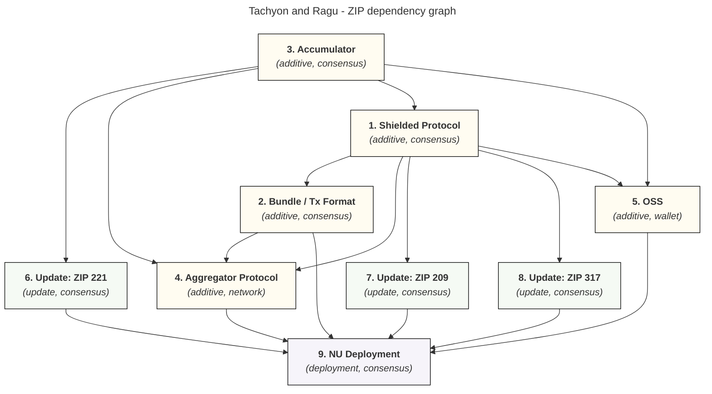

# Tachyon ZIPs

The [ZIP process](https://zips.z.cash/zip-0000) seems highly formalized, with codified standards and ceremony around each proposal. Tachyon will need to determine the domain of different ZIPs we intend to propose, the ordering of those proposals, and what existing ZIPs need modification and how version control works in that context. This is intended to compile research and seed discussion on the ZIP writing process.

## ZIP Versioning

For more details on the ZIP process, reference [ZIP 0](https://zips.z.cash/zip-0000).

ZIPs are associated with a triple: **status, category, and (informally, my own classification) a role**.

- **Status:** 'draft, proposed, final, withdrawn, obsolete, reserved, rejected, active, implemented' – these are state transitions as a function of consensus approval,
- **Category:** 'consensus, standards, process, consensus process, informational, network, rpc, wallet, ecosystem' – different categories that define the ZIP kind,
- **Role:** 'update, successor, additive, deployment' – this is more of an informal metric for ZIP versioning, defining how the proposed ZIP interplays with existing ZIPs.

For more specifics on ZIP versioning conventions, reference [ZIP 0](https://zips.z.cash/zip-0000), but here's my distillation of those patterns: 

**1. Update ZIPs (2xxx):** These are smaller scoped, surgical edits to the existing [Zcash Protocol Specification](https://zips.z.cash/protocol/protocol.pdf). Reference [zip-2003](https://zips.z.cash/zip-2003) and [zip-2004](https://zips.z.cash/zip-2004) (and their accompany PRs [#825](https://github.com/zcash/zips/pull/825) and [#917](https://github.com/zcash/zips/pull/917)) for reference on process.

Note that Final ZIPs are *not* immutable. Per [ZIP 0](https://zips.z.cash/zip-0000): "Final ZIPs MAY be updated; the specification is still in force but modified by another specified ZIP or ZIPs (check the optional Updated-By header)." In practice, feature ZIPs like [ZIP 227](https://zips.z.cash/zip-0227) (ZSA) and [ZIP 231](https://zips.z.cash/zip-0231) (memo bundles) defined their changes to ZIP-317 in their own specs, and the editors folded those changes directly into ZIP-317's text. Similarly, Orchard's pool was added directly to ZIP-209 without a separate Update ZIP. The 2xxx 'Update' ZIPs (like zip-2003, zip-2004) are specifically for surgical diffs against the [Zcash Protocol Specification](https://zips.z.cash/protocol/protocol.pdf), not for amending other ZIPs.

**2. Successor ZIPs (2xx):** These are primarily full replacements that supersede existing ZIPs. The process here is that (1) the old ZIP's applicability narrows (protocol spec is updated to say "[Pre-NU{N}] use ZIP 243; [NU{N} onward] use ZIP 244."), and (2) old ZIP's status may change from 'Active' to 'Obsolete'. Reference [ZIP-244](https://zips.z.cash/zip-0244) which supersedes [ZIP-243](https://zips.z.cash/zip-0243) for changes to the sighash, and [ZIP-225](https://zips.z.cash/zip-0225) which supersedes [ZIP-202](https://zips.z.cash/zip-0202) for changes to the transaction format.

**3. Deployment ZIPs:** These define a network upgrade's activation parameters. Reference [ZIP-252 (NU5)](https://zips.z.cash/zip-0252) and [ZIP-253 (NU6)](https://zips.z.cash/zip-0253).

**4. Additive ZIPs (mostly 2xx):** This is a new specification that sits besides an existing one and doesn't supersede anything, for instance a new shielded pool in [ZIP-224](https://zips.z.cash/zip-0224) or an OSS service.

### ZIPs vs Protocol Specification

The ZIPs come first. The [protocol specification PDF](https://zips.z.cash/protocol/protocol.pdf) is downstream, a consolidated document that incorporates rules defined across many ZIPs.

1. Feature ZIP is written and reaches **Proposed** status
2. If the ZIP includes changes to existing ZIPs, editors fold those in
3. Once the ZIP reaches **Implemented/Final**, the protocol specification PDF is updated to reflect the new consensus rules
4. If the spec changes are complex enough, a 2xxx Update ZIP may describe the diff against the spec

## Tachyon ZIPs

This attempts to enumerate the landscape, at a high-level lacking a lot of detail, for the different kinds of ZIPs that Tachyon will need to propose: 5 'Additive' ZIPs, 3 'Update' ZIPs, 0 'Successor' ZIP, and 1 'Deployment' ZIP = 9 ZIPs.

There are probably other ZIPs that need updating, but haven't examined the entire search space here yet (there are a lot of ZIPs)!

Each ZIP entry below contains three subsections: **Dependencies**, **Design Considerations** (exploratory context and open questions), and a **ZIP Draft** (the formal specification intended to be upstreamed to [zcash/zips](https://github.com/zcash/zips)). For each ZIP entry, see the corresponding issue in the tracking issue [#111](https://github.com/tachyon-zcash/tachyon/issues/111) for more context.
