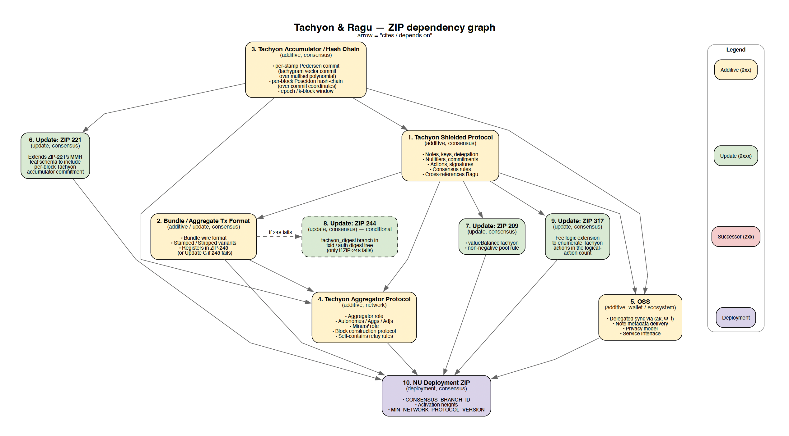

# Tachyon ZIPs

The [ZIP process](https://zips.z.cash/zip-0000) seems highly formalized, with codified standards and ceremony around each proposal. Tachyon will need to determine the domain of different ZIPs we intend to propose, the ordering of those proposals, and what existing ZIPs need modification and how version control works in that context. This document is intended to compile research and seed discussion on the ZIP writing process.

## ZIP Versioning

ZIPs are associated with a triple: **status, category, and (informally, my own classification) a role**.

- **Status:** 'draft, proposed, final, withdrawn, obsolete, reserved, rejected, active, implemented' – these are state transitions as a function of consensus approval,
- **Category:** 'consensus, standards, process, consensus process, informational, network, rpc, wallet, ecosystem' – different categories that define the ZIP kind,
- **Role:** 'update, successor, additive, deployment' – this is more of an informal metric for ZIP versioning, defining how the proposed ZIP interplays with existing ZIPs.

The versioning process seems to follow *informal* patterns that aren't standardized / named in the ZIP process, so I'm distilling those patterns here. Here are the informal ZIP amendment patterns (ie. the **roles**):

**1. Update ZIPs (2xxx):** These are smaller scoped, surgical edits to the existing [Zcash Protocol Specification](https://zips.z.cash/protocol/protocol.pdf). Reference [zip-2003](https://zips.z.cash/zip-2003) and [zip-2004](https://zips.z.cash/zip-2004) (and their accompany PRs [#825](https://github.com/zcash/zips/pull/825) and [#917](https://github.com/zcash/zips/pull/917)) for reference on process.

Importantly, an 'Update' ZIP doesn't amend the 'Final' ZIP that originally introduced the rule (final ZIPs are immutable). The 'Update' ZIP's own 'Specification' section instead describes a diff against the Zcash Protocol Specification. Again, this is a smaller scoped edit.

**2. Successor ZIPs (2xx):** These are primarily full replacements that supersede existing ZIPs. The process here is that (1) the old ZIP's applicability narrows (protocol spec is updated to say "[Pre-NU{N}] use ZIP 243; [NU{N} onward] use ZIP 244."), and (2) old ZIP's status may change from 'Active' to 'Obsolete'. Reference [ZIP-244](https://zips.z.cash/zip-0244) which supersedes [ZIP-243](https://zips.z.cash/zip-0243) for changes to the sighash, and [ZIP-225](https://zips.z.cash/zip-0225) which supersedes [ZIP-202](https://zips.z.cash/zip-0202) for changes to the transaction format.

**3. Deployment ZIPs:** These define a network upgrade's activation parameters. Reference [ZIP-252 (NU5)](https://zips.z.cash/zip-0252) and [ZIP-253 (NU6)](https://zips.z.cash/zip-0253).

**4. Additive ZIPs (mostly 2xx):** This is a new specification that sits besides an existing one and doesn't supersede anything, for instance a new shielded pool in [ZIP-224](https://zips.z.cash/zip-0224) or an OSS service.

## Tachyon ZIPs

This attempts to enumerate the landscape, at a high-level lacking a lot of detail, for the different kinds of ZIPs that Tachyon will need to propose: 5 'Additive' ZIPs, 4 'Update' ZIPs, 0 'Successor' ZIP, and 1 'Deployment' ZIP = 10 ZIPs.

There are probably other ZIPs that need updating, but haven't examined the entire search space here yet (there are a lot of ZIPs)!

